# خواننده تلگرام

<!-- TOP_NAV START -->

<a href="https://github.com/miladsa74520/aio-downloader/blob/main/telegram/content/archive_1.md" style="display:inline-block; padding:6px 12px; margin:0 4px; background-color:#2ea44f; color:white; text-decoration:none; border-radius:4px; font-weight:bold;">صفحه بعد</a>

<!-- TOP_NAV END -->

<!-- MSG START -->

---
📅 بروزرسانی: 1405/02/26 15:06
---

## VahidOOnLine — post 240464

  

♦️خبرگزاری تسنیم، روز شنبه ۲۶ اردیبهشت ماه، به مقل از منابع آگاه از سفر سید محسن نقوی، وزیر کشور پاکستان به تهران خبر داد.
به گزارش تسنیم، گفته می‌شود وزیر کشور پاکستان طی این سفر از پیش اعلام نشده قرار است با شماری از مقام‌های جمهوری اسلامی، از جمله وزیر کشور، دیدار کند.
‌🇸🇦 Indypersian

🤖 @VahidOOnLine

## VahidOOnLine — post 240463

روایت شما از زندگی در آتش‌بس- شنبه ۲۶ اردیبهشت ۱۴۰۵

🔹 ابوقراضه‌ای به نام کوییک، سال ۱۴۰۱ قیمتش ۱۷۰ میلیون بود، الان شده یک میلیارد و ۲۷۰ میلیون تومان، در حالی که حقوق کارمند سال ۱۴۰۱ پانزده میلیون بود و الان شده ۳۰ میلیون.
🔹 فقط وصل شدم بگم مرگ بر اصل ولایت فقیه. مرگ بر جمهوری اسلامی، لعنت بر تک‌تک عاملان فساد در ایران‌مون. یه گیگ اینترنت خریدیم ۵۰۰ هزار تومان! خسته شدیم، بزنید، اصلاً هم ما راحت شیم هم اینا برن.
🔹 از نیشابور پیام می‌دیم، نظام فاسد با گرون کردن بنزین منتظر باشه دوباره ملت بریزن تو خیابون ریشه‌شون رو بکنن.
🔹 همه‌چیز سرسام‌آور گرون شده، دارو نیست، بنزین رو می‌خوان سه برابر گرون کنن و آزاد رو سه برابر بیشتر بفروشن. ترامپ زودتر تصمیمتو بگیر، کشتی ما رو با قیمت نفت، ما این‌ها رو نمی‌خواهیم، تحت هیچ شرایطی.
🔹 از تهران پیام می‌دم، من یک دانش‌آموز هستم و ما برای مدرسه‌ای که نرفتیم باید ۱۵۰ میلیون برای مدارس غیردولتی که هیچ کاری برامون نکردن شهریه بدیم. به بی‌بی و ترامپ بگین خیلی حواسشون جمع باشه، تغییر رژیم کار سختیه، باید حمایت زیاد بشیم، خسته شدیم به خدا.
‌🏁 🇬🇧 IranintlTV

🤖 @VahidOOnLine

## VahidOOnLine — post 240462

  

ابراهیم عزیزی، رییس کمیسیون امنیت ملی مجلس، با اشاره به طرح مجلس برای تنگه هرمز نوشت که جمهوری اسلامی سازوکاری برای مدیریت ترافیک این آبراه در مسیر تعیین‌شده تهیه کرده است که به‌زودی رونمایی می‌شود. عزیزی نوشت: «این مسیر کماکان برای عاملان پروژه به اصطلاح آزادی بسته خواهد ماند.»

او در ایکس نوشت: «ایران در چارچوب حق حاکمیت ملی و تضمین امنیت تجارت بین‌الملل، سازوکاری حرفه‌ای برای مدیریت ترافیک تنگه هرمز در مسیر تعیین‌شده تهیه کرده است که به‌زودی رونمایی می‌شود.»

او افزود: «در این فرآیند، فقط کشتی‌های تجاری و طرف‌های همکار با ایران از آن بهره‌مند خواهند شد. حقوق لازم در ازای خدمات تخصصی ارائه‌شده، با این سازوکار برای ایران اخذ می‌شود.»
‌🏁 🇬🇧 IranintlTV

🤖 @VahidOOnLine

## VahidOOnLine — post 240461

  <a href="telegram/content/VahidOOnLine_240461_1778931371.mp4" target="_blank">🎬 Download video</a>

ایرانیان استرالیا روز شنبه در حمایت از انقلاب ملی در بریزبن تجمع کرده و بخش‌هایی از پیام شاهزاده رضا پهلوی را پخش کردند.
‌🏁 🇬🇧 IranintlTV

🤖 @VahidOOnLine

## VahidOOnLine — post 240460

  

⭕️ عضو شورای شهر تهران:
در جنگ اخیر، ۱۰ اثر تاریخی تهران کاملا تخریب و ۶۰ اثر دیگر آسیب دیدند

♦️سید احمد علوی، عضو شورای شهر تهران از آسیب دیدن حدود ۶۰ اثر و تخریب کامل ۱۰ اثر تاریخی پایتخت در جریان جنگ چهل روزه آمریکا و اسرائیل علیه جمهوری اسلامی خبر داد.
او گفت برنامه‌ریزی برای بازسازی بناهای تخریب‌شده با همکاری شهرداری مناطق، اداره‌کل میراث فرهنگی استان تهران و همچنین بخش خصوصی در دستور کار قرار گرفته است.
به گفته این عضو شورای شهر، بناهای تخریب‌شده قرار است با همان کاربری پیشین و در محل اصلی خود بازسازی شوند. با این حال هنوز جزئیات دقیقی از نام آثار تخریب‌شده، میزان خسارت‌ها و زمان آغاز پروژه‌های مرمت منتشر نشده است.
‌🇸🇦 Indypersian

🤖 @VahidOOnLine

## VahidOOnLine — post 240459

  

♦️ابراهیم عزیزی، رئیس کمیسیون امنیت ملی مجلس ایران، روز شنبه با انتشار پیامی در شبکه اجتماعی ایکس اعلام کرد تهران سازوکاری «حرفه‌ای» برای مدیریت تردد در تنگه هرمز از طریق یک مسیر تعیین‌شده آماده کرده است که به‌زودی جزئیات آن را اعلام می‌کند.
عزیزی در توضیح این طرح با تکرار دریافت پول در ازای گذر از تنگه هرمز نوشت: «فقط کشتی‌های تجاری و طرف‌های همکاری با ایران از آن بهره‌مند خواهند شد. حقوق لازم در ازایِ خدمات تخصصی ارائه شده، با این سازوکار برای ایران اخذ می‌شود.»
عزیزی در پایان گفت: «این مسیر کماکان برای عاملین پروژهٔ به اصطلاح آزادی بسته خواهد ماند.»
«پروژه آزادی» طرح آمریکا برای اسکورت کشتی‌ها در تنگه هرمز بود که طی آن، جمهوری اسلامی به کشتی‌ها و مناطقی در امارات متحده آتش گشود.
‌🇸🇦 Indypersian

🤖 @VahidOOnLine

## VahidOOnLine — post 240458

  <a href="telegram/content/VahidOOnLine_240458_1778931377.mp4" target="_blank">🎬 Download video</a>

کریس رایت، وزیر انرژی آمریکا گفته است انتظار دارد تنگه هرمز «حداکثر تا مقطعی در تابستان» بازگشایی شود.

رایت همچنین گفت اگر ایران به «گروگان گرفتن اقتصاد جهان» ادامه دهد، ارتش آمریکا می‌تواند برای بازگشایی تنگه هرمز مداخله کند.
‌🏁 🇬🇧 ManotoTV

🤖 @VahidOOnLine

## VahidOOnLine — post 240457

  <a href="telegram/content/VahidOOnLine_240457_1778931377.mp4" target="_blank">🎬 Download video</a>

در برنامه‌های شامگاه گذشته تلویزیون جمهوری اسلامی، بخش‌هایی با محور آموزش کار با سلاح پخش شد.

در این برنامه‌ها، مجریان یا کارشناسان حاضر در استودیو، شیوه گرفتن و استفاده از سلاح را توضیح دادند. پخش چنین محتوایی از تلویزیون حکومتی در شرایطی صورت می‌گیرد که رسانه‌های وابسته به جمهوری اسلامی در هفته‌های اخیر بر ادبیات نظامی، آمادگی دفاعی و بسیج حامیان خود تاکید بیشتری داشته‌اند.
‌🏁 🇬🇧 ManotoTV

🤖 @VahidOOnLine

## VahidOOnLine — post 240456

  <a href="telegram/content/VahidOOnLine_240456_1778931378.mp4" target="_blank">🎬 Download video</a>

‌
«دریک»، رپر، خواننده و بازیگر کانادایی، در یکی از قطعه‌های تازه خود با نام «Don’t Worry» به دختری ایرانی اشاره کرده که فارسی حرف می‌زند. این قطعه در آلبوم تازه او منتشر شده است. در متن ترانه نیز بندی آمده که در آن زن مورد اشاره خود را ایرانی معرفی می‌کند که فارسی حرف می‌‌زند.

دریک با نام کامل «آبری دریک گراهام» زاده تورنتو است و پیش از ورود جدی به موسیقی، با بازی در مجموعه تلویزیونی نوجوانانه «دگراسی، نسل بعدی» شناخته شد. او سپس به یکی از چهره‌های اصلی موسیقی هیپ‌هاپ و پاپ معاصر تبدیل شد و سبک ترکیبی او میان رپ‌خوانی و خوانندگی، جایگاه گسترده‌ای در بازار جهانی موسیقی برایش به همراه آورد.
‌🏁 🇬🇧 ManotoTV

🤖 @VahidOOnLine

## VahidOOnLine — post 240455

  <a href="telegram/content/VahidOOnLine_240455_1778931380.mp4" target="_blank">🎬 Download video</a>

ایرانیان نیوزیلند روز شنبه ۲۶ اردیبهشت‌ماه در حمایت از شاهزاده رضا پهلوی و علیه قطع اینترنت و اعدام‌های جمهوری اسلامی در اوکلند تجمع برگزار کردند.
‌🏁 🇬🇧 IranintlTV

🤖 @VahidOOnLine

## VahidOOnLine — post 240454

  

♦️فرماندهی کل نیروی دفاع بحرین، روز شنبه با انتشار بیانیه‌ای اعلام کرد تمامی یگان‌ها و تسلیحات این کشور در بالاترین سطح آمادگی و آماده‌باش دفاعی قرار دارند.
در این بیانیه آمده است، فرماندهی کل به سطح آمادگی رزمی و هوشیاری نیروهای نظامی این کشور در انجام وظایف خود ابراز افتخار کرده و بر آمادگی آن‌ها برای دفاع از کشور تاکید می‌کند.
نیروی دفاع بحرین همچنین از شهروندان و ساکنان این کشور خواست از نزدیک شدن یا دست زدن به هرگونه اجسام ناشناس یا مشکوک که ممکن است بقایای حملات ایران باشد، خودداری کنند.
در این بیانیه آمده است نیروهای واحد مهندسی میدان سلطنتی بحرین در آمادگی کامل قرار دارند تا برای حفظ امنیت عمومی، این اجسام را به‌صورت ایمن بررسی و خنثی کنند.
‌🇸🇦 Indypersian

🤖 @VahidOOnLine

## VahidOOnLine — post 240453

  

♦️محمد مخبر، مشاور رهبر جمهوری اسلامی، روز شنبه با انتشار متنی در شبکه اجتماعی ایکس با استفاده از هشتگ کویت و امارات نوشت: «ایران سال‌ها به چشم دوست و برادر به آنها نگاه کرد، ولی آنها با پیش‌فروش استقلال خود، حتی خاک و خانه‌هایشان را در اختیار دشمنان فلسطین و ایران قرار دادند.»

مخبر در این پیام با اشاره به حضور نیروهای آمریکایی در کشورهای منطقه، تهدید کرد: «پاسخ جمهوری اسلامی به سنگرهای استیجاری سنتکام در جنگ اخیر تمام‌عیار نبود، اما قطعا این خویشتن‌داری همیشگی نیست.»
‌🇸🇦 Indypersian

🤖 @VahidOOnLine

## VahidOOnLine — post 240452

  <a href="telegram/content/VahidOOnLine_240452_1778931385.mp4" target="_blank">🎬 Download video</a>

ایرانیان استرالیا روز شنبه در حمایت از انقلاب ملی علیه جمهوری اسلامی تجمع کرده و با حمل پرچم شیروخورشید ترانه‌های ملی را هم‌خوانی کردند.
‌🏁 🇬🇧 IranintlTV

🤖 @VahidOOnLine

## VahidOOnLine — post 240451

  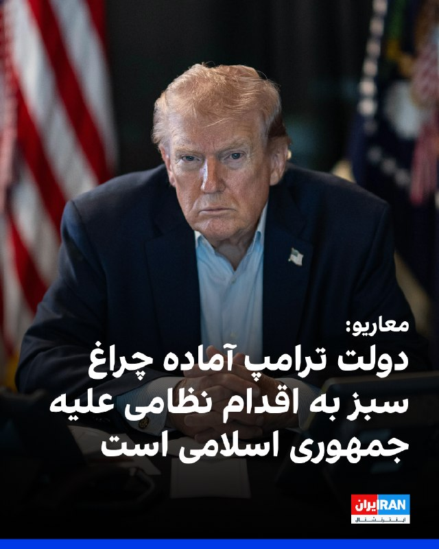

روزنامه معاریو به نقل از منابع آگاه گزارش داد که دولت دونالد ترامپ در روزهای اخیر آمادگی خود را برای دادن «چراغ سبز» به اقدام نظامی در صورت شکست نهایی تلاش‌های دیپلماتیک با جمهوری اسلامی نشان داده است.

بر اساس این گزارش، با وجود این رویکرد، هنوز تصمیم نهایی برای آغاز عملیات نظامی اتخاذ نشده است.

این منابع افزودند که «پنجره دیپلماتیک به سرعت در حال بسته شدن است» و روزهای آینده می‌تواند در تعیین مسیر تحولات سرنوشت‌ساز باشد.
‌🏁 🇬🇧 IranintlTV

🤖 @VahidOOnLine

## VahidOOnLine — post 240450

  <a href="telegram/content/VahidOOnLine_240450_1778931389.mp4" target="_blank">🎬 Download video</a>

مخاطبان ایران اینترنشنال طی روزهای اخیر با ارسال پیام‌هایی درباره سلامت و جان نرگس محمدی، زندانی سیاسی، ابراز نگرانی کرده و از ایرانیان خواستند در خارج از کشور صدای او باشند. پیام مخاطبان با هوش مصنوعی بازخوانی شده است.
‌🏁 🇬🇧 IranintlTV

🤖 @VahidOOnLine

## VahidOOnLine — post 240449

  

محمد مخبر، مشاور رهبر جمهوری اسلامی، با انتشار مطلبی در ایکس با هشتگ کویت و امارات نوشت: «ایران سال‌ها به چشم دوست و برادر به آنها نگاه کرد، ولی آنها با پیش‌فروش استقلال خود، حتی خاک و خانه‌هایشان را در اختیار دشمنان فلسطین و ایران قرار دادند.»

او تهدید کرد: «پاسخ جمهوری اسلامی به سنگرهای استیجاری سنتکام در جنگ اخیر تمام‌عیار نبود، اما قطعا این خویشتن‌داری همیشگی نیست.»
‌🏁 🇬🇧 IranintlTV

🤖 @VahidOOnLine

## VahidOOnLine — post 240448

  

♦️امارات: خروج از اوپک تصمیمی راهبردی بود، نه سیاسی
وزیر انرژی امارات متحده عربی اعلام کرد تصمیم ابوظبی برای خروج از اوپک و اوپک‌پلاس، اقدامی «حاکمیتی و راهبردی» بوده و انگیزه سیاسی نداشته است.
به گزارش رویترز، مقام‌های اماراتی تاکید کردند این تصمیم بر پایه ارزیابی جامع از سیاست تولید نفت و ظرفیت‌های آینده این کشور اتخاذ شده و نشانه اختلاف با دیگر شرکای اوپک نیست.
وزیر انرژی امارات گفت خروج از اوپک بخشی از راهبرد بلندمدت ابوظبی برای مدیریت مستقل‌تر ظرفیت‌های تولید انرژی و برنامه‌های توسعه آینده است و نباید به‌عنوان نشانه تنش سیاسی در داخل ائتلاف تولیدکنندگان نفت تفسیر شود.
تصمیم امارات در شرایطی اعلام شده که بازار جهانی انرژی همچنان تحت تاثیر جنگ ایران، بحران تنگه هرمز و نوسان شدید قیمت نفت قرار دارد و برخی تحلیلگران، خروج ابوظبی را نشانه تغییرات ساختاری در آینده اوپک و بازار جهانی انرژی می‌دانند.
‌🇸🇦 Indypersian

🤖 @VahidOOnLine

## VahidOOnLine — post 240447

  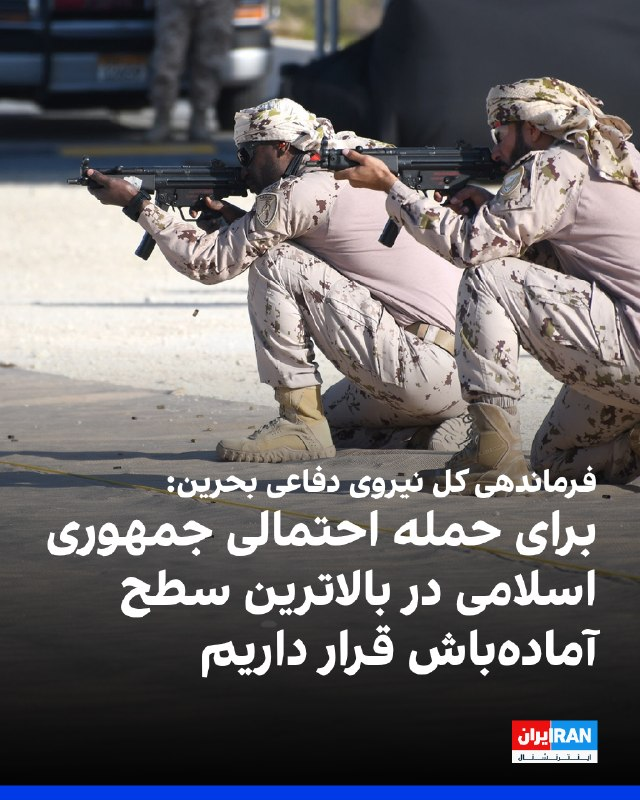

فرماندهی کل نیروی دفاعی بحرین اعلام کرد که تمامی سلاح‌ها و یگان‌های این نیرو در بالاترین سطح آمادگی و آماده‌باش دفاعی برای مواجه با حمله احتمالی جمهوری اسلامی قرار دارند. بحرین همچنین از شهروندانش خواست با توجه به پیامدهای این حمله، از نزدیک شدن یا دست زدن به هرگونه شیء ناشناس یا مشکوک که ممکن است از بقایای این حمله باشد، خودداری کنند.

در بیانیه این فرماندهی آمده است که نیروهای آن از آمادگی رزمی پیشرفته و هوشیاری بالا در انجام وظیفه ملی خود برای دفاع از کشور و حفاظت از دستاوردهای آن برخوردارند.
‌🏁 🇬🇧 IranintlTV

🤖 @VahidOOnLine

## VahidOOnLine — post 240446

  <a href="telegram/content/VahidOOnLine_240446_1778931396.mp4" target="_blank">🎬 Download video</a>

⭕️ یخاب آران و بیدگل؛
زیستگاه امن حیات‌وحش کویری ایران

♦️گله‌ای از قوچ‌ و میش‌های وحشی در پناهگاه حیات وحش یخاب ابوزیدآباد در شهرستان آران و بیدگل، در قاب دوربین ثبت شد، منطقه‌ای بکر و کم‌نظیر در حاشیه کویر که یکی از زیستگاه‌های مهم حیات‌وحش ایران به شمار می‌رود.
پناهگاه حیات وحش یخاب با برخورداری از تنوع زیستی ارزشمند، زیستگاه گونه‌هایی همچون قوچ و میش وحشی، جبیر، کاراکال و انواع پرندگان بومی کویر است و به‌دلیل شرایط خاص طبیعی و حفاظت محیط‌زیستی، از مناطق مهم حیات‌وحش در استان اصفهان محسوب می‌شود.
ویدیویی از حضور و حرکت گله قوچ و میش‌های وحشی در این منطقه، جلوه‌ای از حیات طبیعی و زیبایی کم‌نظیر زیستگاه‌های کویری ایران را به نمایش گذاشته است.
‌🇸🇦 Indypersian

🤖 @VahidOOnLine

## VahidOOnLine — post 240445

  <a href="telegram/content/VahidOOnLine_240445_1778931399.mp4" target="_blank">🎬 Download video</a>

یک شهروند ویدیویی به ایران اینترنشنال فرستاده که بحران در دسترسی به بنزین و تشکیل صف‌های طولانی در بندرعباس در روز شنبه ۲۶ اردیبهشت‌ماه را نشان می‌دهد.
‌🏁 🇬🇧 IranintlTV

🤖 @VahidOOnLine

## WithYashar — post 11388

  <a href="telegram/content/WithYashar_11388_1778931402.mp4" target="_blank">🎬 Download video</a>

نظر کلی رسانه ها اینه که ۷۲ ساعت طلایی پیشه رو داریم 😬
@withyashar

## WithYashar — post 11387

شبکه فاکس نیوز: ارتش آمریکا درحال آماده شدن برای دور جدیدی از درگیری های نظامی در ایران است
@withyashar

## WithYashar — post 11386

ایال زمیر، رئیس ستاد کل نیروهای مسلح اسرائیل اعلام کرد کشته‌شدن عزالدین الحداد، فرمانده‌ شاخه ‌نظامی «حماس» یک گام مهم و موفقیتی بزرگ در عرصه عملیاتی است.
او افزود اسرائیل «با جدیت» به‌ تعقیب و هدف قرار دادن سایر رهبران و فرماندهان حماس ادامه خواهد داد.
@withyashar

## WithYashar — post 11385

  

صدا و سیما هم میدونه چی میشه داره آموزش کار با سلاح رو میده 😂 اینا رفتنین شک نکنید 👋🏾👋🏾 @withyashar

## WithYashar — post 11384

آقا یاشار عزیز،

واقعاً دلم می‌خواست یه چیزی بهت بگم از ته دل.

مرسی که با کارای دلی و عشقیت، بهم نشون دادی وقتی کاریو با دل شروع می‌کنی، چقدر می‌تونه برکت و موفقیت بیاره.

از اون موقع که تو نوجونی اون سایت برای پروموت کردن رپرها ساختی تا همین الان که با تمام وجود وقتت رو پای این کانال خبری (تلگرام و اینستا) می‌ذاری تا مردم خبر درست بگیرن، یه چیز بزرگ یاد گرفتم ازت — اینکه عشق و نیت خالص از هر چیز دیگه‌ای قوی‌تره.

بهم یادآوری و یاد دادی که پیشرفت فقط با کار زیاد نیست، بلکه دلی و با عشق کار کردن توی کاره.

دمت گرم ، واسه همه این زحماتت، واسه الهامی که بهم دادی، و واسه اینکه خودِ واقعی‌ت رو بی‌منت به دنیا نشون میدی💚

## WithYashar — post 11383

جسی واترز، مجری فاکس نیوز:

ترامپ درحال آماده‌شدن برای دور جدیدی از حملات نظامی به ایرانه.
@withyashar

## WithYashar — post 11382

ترامپ: 5 بار با ایران نزدیک توافق شدم، ولی روز بعدش زدن زیرش
@withyashar

## WithYashar — post 11381

نشست آینده تکنولوژی در ایران، با حضور و سخنرانی شاهزاده رضا پهلوی امشب ۸:۳۰ به وقت تهران ۱۰ صبح به وقت غرب آمریکا سانفرانسیسکو
@withyashar

## WithYashar — post 11380

سنتکام به نیویورک تایمز : کشتی‌های ایرانی رو با ماهواره و چند روش دیگه ردیابی می‌کنیم
@withyashar

## WithYashar — post 11379

آسوشیتدپرس: بازگشت ناو هواپیمابر جرالد فورد به پایگاه پس از ۱۱ ماه مأموریت

وزارت‌جنگ آمریکا اعلام کرد پیت هگست، وزیر جنگ، روز شنبه در پایگاه دریایی نورفولک در ویرجینیا از ناو هواپیمابر جرالد فورد و ۴۵۰۰ ملوان آن پس از ۱۱ ماه مأموریت استقبال می‌کند.
این ناو ۳۲۶ روز در دریا بوده که طولانی‌ترین استقرار یک ناو هواپیمابر آمریکایی در ۵۰ سال گذشته و سومین رکورد از زمان جنگ ویتنام است.
@withyashar

## WithYashar — post 11378

کانال N12 اسرائیل: جنگ سوم با ایران نزدیک است
@withyashar

## WithYashar — post 11377

نامه زرشکیان به پاپ: ما به راهکارهای دیپلماتیک برای حل و فصل مسائل، از جمله پرونده‌های اختلافی با آمریکا، پایبندیم و بعد برقراری امنیت، عبور از تنگه هرمز به حالت عادی بازخواهد گشت
@withyashar

## WithYashar — post 11376

رویترز به نقل از یک منبع آگاه گزارش داد که متیاس گرافستروم، دبیرکل فیفا، امروز در استانبول با مقام‌های فدراسیون فوتبال ایران دیدار می‌کند و درباره حضور تیم ملی در جام جهانی ۲۰۲۶ «اطمینان خاطر» خواهد داد. این درحالی است که مهدی تاج پیش از این خواستار تضمین‌هایی از فیفا شده بود.
@withyashar

## WithYashar — post 11375

کرملین امروز اعلام کرد که ولادیمیر پوتین، رئیس‌جمهور روسیه ۱۹ مه (۲۹ اردیبهشت) برای یک سفر دو روزه به چین خواهد رفت. این سفر در پی سفر دونالد ترامپ، رئیس‌جمهور آمریکا به پکن انجام می‌شود.
@withyashar

## WithYashar — post 11374

چمران رئیس شورای شهر تهران:

رایگان اعلام کردن مترو و اتوبوس در تهران کار احساسی بود و فردا آخرین روز رایگان بودن حمل و نقل عمومی در تهران است و تمدید نخواهد شد.
@withyashar

## WithYashar — post 11373

شریعتمداری: مذاکره به جای خود، اما جنگ بدون پاسخ پایان نمی‌یابد/ با شهادت آقا شروع کردند بی‌انتقام تمام نمی‌کنیم
@withyashar

## WithYashar — post 11372

کانال ۱۲ اسرائیل گزارش داد انتظار می‌رود دونالد ترامپ، رییس‌جمهوری آمریکا، طی ۲۴ ساعت آینده تیم مشاوران نزدیک خود را تشکیل دهد تا درباره ایران تصمیم نهایی بگیرد. برآوردها در اسرائیل حاکی است تصمیم درباره اقدام نظامی ممکن است بسیار به‌زودی اتخاذ شود.

برنامه تلویزیونی «اولپن شیشی» به نقل از یک مقام ارشد اسرائیلی گزارش داد که «ازسرگیری درگیری نزدیک است» و اسرائیل خود را برای احتمال «چند روز تا چند هفته جنگ» آماده می‌کند.
@withyashar

## mwarmonitor — post 9151

  <a href="telegram/content/mwarmonitor_9151_1778931405.mp4" target="_blank">🎬 Download video</a>

📝این نمایش مشمئزکننده و دست‌وپا زدن‌های فضاحت‌بار این جیره‎خواران و فاحشه‌های ولایت با اسلحه روی آنتن زنده، تقلاهای رو به موتی است که تنها بوی گندِ زوال و سقوط می‌دهد. وقتی این جانورانِ تروریست کلمات مقدسی مثل «وطن» و «خاک» را در آن دهان‌های نجس می‌چرخانند، دقیقاً یادآور روزهای آخر، درماندگی و توهماتِ جنون‌آمیز قذافی در تفدانِ تاریخ هستند.

🔸به این تئاترِ تهوع‌آور و خط‌ونشان کشیدن‌های مضحک ادامه بدهید؛ اما بدانید که هر ثانیه از این تصویر، جرقه‌ای است بر انبارِ باروت. چنان خشمِ لجام‌گسیخته، سیاه و ویرانگری در اعماق این جامعه‌ی زجرکشیده در حال انباشت شدن است که هیچ دیواری مانع آن نخواهد شد. این غده‌های چرکینی که امروز جلوی دوربین مانورِ قدرت می‌دهند، فردا در سیلابِ خشمِ مردم غرق خواهند شد. روزی که این دیگِ بجوش‌آمده سرریز کند، دیگر هیچ راه فراری نیست؛ این ملتِ کاردبه‌استخوان‌رسیده، زنده زنده روی همین آنتن زنده تلویزیون، خرخره‌ی تو و امثالِ کثیف تو را خواهند جوید و این بساطِ پر از خون و جنایت را برای همیشه در هم خواهند کوبید.

@mwarmonitor

## mwarmonitor — post 9150

  

📍تنگه هرمز، کشتی‌های در حال خروج از خلیج فارس:

🚢کشتی حمل دام «SAPHIRA» (متعلق به ترکیه)

🚢کشتی فله‌بر «KIRAN CHINA» (متعلق به ترکیه)

🚢نفتکش «SEAWAY» (متعلق به چین)

🚢کشتی فله‌بر «KAIA» (با پرچم جزایر مارشال)

@mwarmonitor

## pm_afshaa — post 90845

  <a href="telegram/content/pm_afshaa_90845_1778931408.webm" target="_blank">🎬 Download video</a>

🔴کانال 12 اسرائیل: برآورد اسرائیل نشون میده تصمیم برای اقدام نظامی بسیار زود گرفته میشه. ترامپ طی 24 ساعت آینده جلسه‌ای با تیم نزدیک خود برای تصمیم‌گیری نهایی درباره ایران برگزار خواهد کرد.

به گفته یک مقام ارشد اسرائیلی، ازسرگیری درگیری نزدیکه و اسرائیل خودش رو برای چند روز تا چند هفته جنگ آماده میکنه.

💧 Rainbet.com the #1 Non-KYC Crypto Casino & Sportsbook @rainbetcom

😁 @Pm_Afshaa

## pm_afshaa — post 90844

  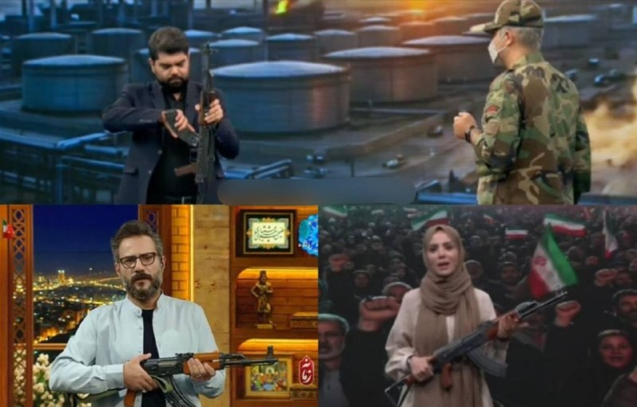

مجری‌های صداوسیما در چند برنامه زنده، با اسلحه کلاشینکف حضور پیدا کردن :

💧 Rainbet.com the #1 Non-KYC Crypto Casino & Sportsbook @rainbetcom

😁 @Pm_Afshaa

## pm_afshaa — post 90843

  <a href="telegram/content/pm_afshaa_90843_1778931409.webm" target="_blank">🎬 Download video</a>

🔴سی‌ان‌ان: مقام‌های آمریکایی منتظر بودن ببینن در سفر ترامپ به چین پیشرفتی در مذاکرات مربوط به ایران شکل میگیره یا خیر، که بعد از سفر بنظر میرسه هیچ پیشرفت قابل توجهی صورت نگرفته.

💧 Rainbet.com the #1 Non-KYC Crypto Casino & Sportsbook @rainbetcom

😁 @Pm_Afshaa

## pm_afshaa — post 90842

  <a href="telegram/content/pm_afshaa_90842_1778931410.webm" target="_blank">🎬 Download video</a>

🔴نیویورک تایمز:
نیروهای نظامی آمریکا در حال آماده‌سازی برای دور دیگری از حملات هستن؛ این بار با شدت بیشتر. این حملات ممکنه از روز دوشنبه آغاز شود. اهداف نظامی بیشتری از ایران در نظر گرفته شده که شامل زیرساخت‌ها هم میشه.

💧 Rainbet.com the #1 Non-KYC Crypto Casino & Sportsbook @rainbetcom

😁 @Pm_Afshaa

## pm_afshaa — post 90841

  <a href="telegram/content/pm_afshaa_90841_1778931411.webm" target="_blank">🎬 Download video</a>

🔴روزنامه معاریو: دولت ترامپ آماده چراغ سبز به اقدام نظامی علیه جمهوری اسلامیه.

💧 Rainbet.com the #1 Non-KYC Crypto Casino & Sportsbook @rainbetcom

😁 @Pm_Afshaa

## pm_afshaa — post 90840

  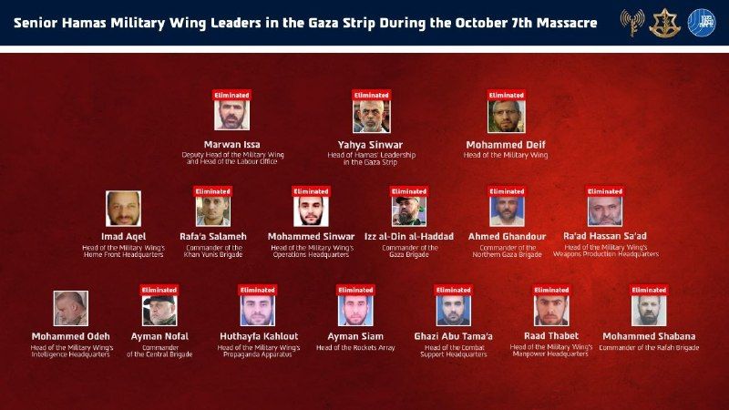

ارتش اسرائیل با بیانیه‌ای خبر ترور عزالدین حداد را تایید کرد و اعلام کرد تنها دو فرمانده ارشد حماس از زمان هفت اکتبر باقی مانده

💧 Rainbet.com the #1 Non-KYC Crypto Casino & Sportsbook @rainbetcom

😁 @Pm_Afshaa

## pm_afshaa — post 90839

🔴فرماندهی کل نیروی دفاعی بحرین : برای حمله احتمالی جمهوری اسلامی، تو آماده‌باش سطح بالا قرار داریم

💧 Rainbet.com the #1 Non-KYC Crypto Casino & Sportsbook @rainbetcom

😁 @Pm_Afshaa

## pm_afshaa — post 90838

🔴کانال N12 اسرائیل: جنگ سوم با ایران نزدیک است

💧 Rainbet.com the #1 Non-KYC Crypto Casino & Sportsbook @rainbetcom

😁 @Pm_Afshaa

## pm_afshaa — post 90837

🔴جسی واترز، مجری فاکس نیوز: ترامپ درحال آماده‌شدن برای دور جدیدی از حملات نظامی به ایرانه

💧 Rainbet.com the #1 Non-KYC Crypto Casino & Sportsbook @rainbetcom

😁 @Pm_Afshaa

## pm_afshaa — post 90836

🔴ترامپ: 5 بار با ایران نزدیک توافق شدم، ولی روز بعدش زدن زیرش

💧 Rainbet.com the #1 Non-KYC Crypto Casino & Sportsbook @rainbetcom

😁 @Pm_Afshaa

## pm_afshaa — post 90835

🔴سنتکام:تمام کشتی ها قایق های ایران رو زیر نظر داریم

💧 Rainbet.com the #1 Non-KYC Crypto Casino & Sportsbook @rainbetcom

😁 @Pm_Afshaa

## pm_afshaa — post 90834

  

ارابه مرگ مردم ایران 1 میلیارد رو رد کرد

💧 Rainbet.com the #1 Non-KYC Crypto Casino & Sportsbook @rainbetcom

😁 @Pm_Afshaa

## DEJradio — post 4666

  <a href="telegram/content/DEJradio_4666_1778931414.webm" target="_blank">🎬 Download video</a>

🔺📢 اسکات بسنت وزیرخزانه‌داری آمریکا:
رژیم ایران دستمزد سربازایش را هم نمی‌تواند پرداخت کند

‏اسکات بسنت وزیرخزانه‌داری آمریکا
در مصاحبه با سی‌ان‌بی‌سی درباره جمهوری اسلامی گفت، فقط تا اینجای امسال، آن‌ها سی تا چهل هزار تن را اعدام کرده‌اند؛ خیلی از آن‌ها هم معترضان مسالمت‌آمیز بوده‌اند. خب، با چنین رژیمی چطور باید برخورد کرد؟

او افزود: باید از نظر اقتصادی حکومت ایران را تحت فشار گذاشت و ما معتقدیم به جایی رسیده‌اند که حتی دستمزد سربازهایشان هم پرداخت نمی‌شود.
دیگر نمی‌توانند ذخایر تسلیحاتی‌شان را از خارج تأمین کنند. بنابراین فکر می‌کنم در آخرین نفس‌هایشان هستند.

#نیروهای_مسلح #جنگ
@DEJradio

## DEJradio — post 4665

  <a href="telegram/content/DEJradio_4665_1778931415.mp4" target="_blank">🎬 Download video</a>

🚨
🔸 خبر ۲۱
آدینه ۲۵ اردیبهشت ۱۴۰۵

#خبر۲۱
@DEJradio

## DEJradio — post 4664

  <a href="telegram/content/DEJradio_4664_1778931418.mp4" target="_blank">🎬 Download video</a>

🤡
🔺 آموزش استفاده از سلاح در تلویزیون جمهوری اسلامی.

صدا و سیمای جمهوری اسلامی سازمان یافته با نشان دادن و آموزش کاربرد اسلحه به مردم چنگ و دندان نشان می‌دهد.

شهرام سبزواری کارشنای نظامی در مورد آموزش کلاشنیکف میگوید فردی که مربی سلاح است و ماسک زده تا شناسایی نشود، لز ساعت هوشمند استفاده می‌کند آنهم در شرایطی که نظامی‌ها بویژه در هنگام ماموریت خاص نباید از تجهیزات هوشمند استفاده کنند.

#کلاشنیکف #صداوسیما
@DEJradio

## DEJradio — post 4663

  <a href="telegram/content/DEJradio_4663_1778931421.mp4" target="_blank">🎬 Download video</a>

🤡
🔺 در صدا و سیمای حکومتی به طور سازمان یافته استفاده از کلاشنیکف را آموزش می‌دهند.

به بهانه تبلیغ پروژه امنیتی "جانفدا" در صدا و سیمای حکومتی، طرفداران نظام را ترغیب به استفاده از سلاح می‌کنند.

برای تلطیف این اقدام جنگ‌طلبانه، زنان وسیله تبلیغ می‌شوند.

#کلاشنیکف #صداوسیما
@DEJradio

## DEJradio — post 4662

  <a href="telegram/content/DEJradio_4662_1778931423.mp4" target="_blank">🎬 Download video</a>

🚨📢 جسد عبدالرحیم موسوی ۳۰ روز زیر آوار ماند

علی موسوی، پسر عبدالرحیم موسوی رئیس پیشن ستاد کل نیروهای مسلح جمهوری اسلامی، گفت که جنازه پدرش که در نخستین روز حملات اسرائیل و آمریکا به بین علی خامنه‌ای کشته شد نزدیک به ۳۰ روز در زیر آوار ماند و یک ماه در جستجوی جنازه‌اش بودند. موسوی پس از کشته شدن محمد باقری در جنگ ۱۲ روزه، به‌عنوان رییس ستاد کل نیروهای مسلح منصوب شده بود.

#جنگ۱۲روزه #IRGCterrorists
@DEJradio

## DEJradio — post 4661

  <a href="telegram/content/DEJradio_4661_1778931426.webm" target="_blank">🎬 Download video</a>

🤡
🔺 بر اساس گزارش‌های منتشر شده، ارتش آمریکا در جریان جنگ اخیر از جزیره بوبیان کویت استفاده عملیاتی کرده است و رسانه‌های وابسته به نظام مدعی شلیک موشک‌های HIMARS آمریکایی در فروردین از این جزیره کویتی هستند، اما منابع کویتی این ادعا را رد می‌کنند.

در این میان، در تاریخ ۱۱ اردیبهشت، کماندوهای نیروی دریایی سـ.ـپاه که پیش از این تبلیغات زیادی درباره توانایی‌هایشان شده بود، در قالب یک تیم شش‌نفره به سمت جزیره بوبیان کویت حرکت کردند. هدف عملیاتی آن‌ها هنوز مشخص نیست، اما این به ‌اصطلاح کماندوها پیش از ورود به جزیره در یک درگیری کوتاه، شکست خوردند و چهار نفر از آنان، شامل سه افسر ارشد و یک افسر جزء، اسیر شدند و دو کماندوی دیگر سپاه نیز موفق به فرار شدند و شاید بتوان گفت فرار این دو موفق ترین، بخش عملیات آنها بوده است.

#نیروی_دریایی #IRGCterrorists
@DEJradio

## DEJradio — post 4658

  <a href="telegram/content/DEJradio_4658_1778931427.webm" target="_blank">🎬 Download video</a>

🔺📢 محمدباقر الساعدی (داوود الساعدی) یکی از فرماندهان ارشد حـ.ـزب‌الله عراق توسط نیروهای امنیتی در یکی از کشورهای منطقه [احتمالا ترکیه، امارات یا اردن] بازداشت شده است. ماموران اف‌بی‌آی او را به آمریکا منتقل کرده‌اند تا محاکمه شود.

وزارت دادگستری آمریکا اعلام کرد، الساعدی رهبر کتائب حزب‌الله عراق با ۶ اتهام مرتبط با تروریسم روبرو است.

این اتهام‌ها به دلیل فعالیت‌های الساعدی با گردان‌های حـ.ـزب‌الله عراق و سـ.ـپاه پاسداران است. او روابط نزدیکی با قـ.ـاسم سـ.ـلیمانی فرمانده پیشین سـ.ـپاه قدس داشت.

براساس یک شکایت سعدی قصد داشته آمریکایی‌ها و یهودیان را در لس‌آنجلس و نیویورک به قتل برساند و برنامه‌ریزی برای حمله به یک کنیسه در نیویورک را آغاز کرده بود.
بازداشت او نشان داد تا چه اندازه نفوذ سرویس‌های امنیتی آمریکا در خاورمیانه زیاد است.

#حزب_الله #عراق
@DEJradio

## DEJradio — post 4657

  <a href="telegram/content/DEJradio_4657_1778931428.webm" target="_blank">🎬 Download video</a>

🚨
⭕️ روزنامه «نیویورک‌تایمز» با اشاره به بن‌بست در مذاکرات جمهوری اسلامی و آمریکا، گزارش داد ایالات متحده و اسرائیل آماده‌سازی‌های گسترده‌ای را برای ازسرگیری احتمالی کارزار نظامی علیه جمهوری اسلامی آغاز کرده‌اند.

بر اساس این گزارش، مقام‌های دولت دونالد ترامپ طرح‌هایی برای عملیات نظامی علیه حکومت ایران تهیه کرده‌اند، اما رییس‌جمهوری آمریکا هنوز تصمیم نهایی را در این رابطه اتخاذ نکرده است.

در این گزارش تأکید شده گزینه‌های زیاد از بمباران گسترده تا عملیات زمینی علیه تاسیسات هسته‌ای جمهوری اسلامی روی میز قرار دارد.

#جنگ #مذاکرات #ترامپ
@DEJradio

## mamlekate — post 103540

  <a href="telegram/content/mamlekate_103540_1778931429.mp4" target="_blank">🎬 Download video</a>

سخنرانی حسین یکتا از تیرخلاص زن‌های دی‌ماه خونین… در کنار مزدوران تیم فوتبال جمهوری اسلامی!

CrimesArchives
@mamlekate

## mamlekate — post 103537

🔫 صداوسیما

🔫سقوط دولت لیبی:
t.me/mamlekate/101453

## mamlekate — post 103536

نرخ ارز طبق برنامه اعلام‌شده پیش رفته. تا سال آینده هم قراره به ۲۸۴۸۰۰ برسه که زودتر از برنامه هم بهش خواهد رسید. رشد اقتصادی هم منفی بوده (فروپاشی) که ننوشتن.

پست کانال در آبان ۱۴۰۳:
t.me/mamlekate/90970

## mamlekate — post 103534

  <a href="telegram/content/mamlekate_103534_1778931431.mp4" target="_blank">🎬 Download video</a>

«مربی برتر آموزش استفاده از سلاح» میگه شلیک کن ببینیم توی سلاح یک گلوله بوده یا دوتا! به این نتیجه می‌رسن شلیک کنن بفهمن!

🎈 t.me/mamlekate/103529

## mamlekate — post 103533

  

دیشب کانال «چشم عقاب» رفت روی ماهواره. مدتی بود روی این پروژه کار می‌کردم.

روش کار ساده است: کانال ماهواره را روی تلویزیون باز می‌کنی، کیوآر کدها پشت سر هم روی صفحه می‌آیند، اپ چشم عقاب روی گوشی اندروید با دوربین آن‌ها را می‌خواند، خبر روی گوشی ذخیره می‌شود. کاملاً آفلاین. گوشی حتی مجوز اینترنت هم ندارد. هر پخش امضای دیجیتال دارد، اپ پخش‌های جعلی را رد می‌کند.

داخل اپ خبر از چند رسانه فارسی و خارجی، توییت‌های اکانت‌های اضافه شده به سیستم، پیام‌های کانال‌های تلگرامی، و کانفیگ فیلترشکن می‌رسد، تا هرکسی توانست به اینترنت وصل شود راهی داشته باشد. توجه داشته باشید از سایت چشم عقاب میتونید کانال تلگرام یا اکانت ایکس مورد علاقه خودتون رو که فکر می‌کنید برای مردم مناسب است را پیشنهاد بدین.

الان بیش از ۷۰ روز از یکی از طولانی‌ترین قطعی‌های اینترنت در تاریخ ایران می‌گذرد. این یکی از روش‌هایی است که برای رساندن خبر به‌طور مطمئن به دست مردم می‌بینم.

هزینه اجاره کانال برای یک ماه تأمین شده است. بعدش اگر کسی نباشد که کمک کند، قطع می‌شود. فعلا نه فاند دولتی برای این پروژه گرفته‌ام، نه از رسانه‌ای پول، هیچ. تنها راه ادامه‌اش حمایت مستقیم مردمی است.

اگر اندرویدی هستید، نصبش کنید و برای کسانی که به اینترنت دسترسی ندارند یکطوری اپلیکیشن رو بهشون برسون اگر باهاش حال کردی. اگر نمی‌توانید نصب کنید، حداقل همرسانی کنید. و اگر می‌توانید حمایت مالی هم کنید، الان از هر چیز دیگری مهم‌تر است.

https://x.com/NarimanGharib/status/2052054823025942545
https://cheshmehoghab.app/

دانلود اپلیکیشن اندروید:

https://t.me/CheshmehOghabApp/11

## kianmeli1 — post 87435

  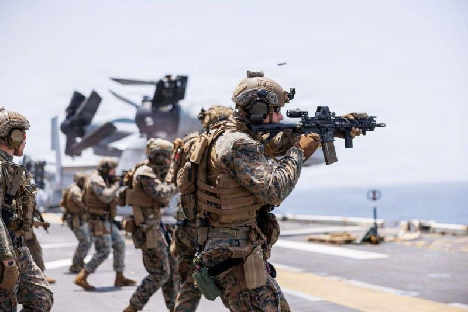

🔴نیویورک تایمز به نقل از مقامات نظامی آمریکا: اگر جزیره خارگ تصرف شود، نیروهای زمینی برای حفظ آن لازم خواهند بود.
https://t.me/kianmeli1

## kianmeli1 — post 87434

‏🔴نماینده خامنه‌ای در سپاه در کردستان: امروز نظام «استکبار» در موضع ضعف قرار گرفته و در این مرحله پایانی وارد آوردن ضربه نهایی برای «اضمحلال دشمن» ضرورتی حیاتی دارد
https://t.me/kianmeli1

## kianmeli1 — post 87430

  <a href="telegram/content/kianmeli1_87430_1778931434.mp4" target="_blank">🎬 Download video</a>

🔴شب گذشته در بسیاری از برنامه های صداوسیما، مجریان با تفنگ حاضر شدند

یکی از مجریان در برنامه زنده پرچم امارات را نشانه گرفت و شلیک کرد
https://t.me/kianmeli1

## kianmeli1 — post 87429

‏🔴محمد مخبر، مشاور مجتبی خامنه‌ای، مطلبی را با هشتگ امارات و کویت در ایکس منتشر کرد و نوشت «آن‌ها با پیش‌فروش استقلال خود، حتی خاک و خانه‌هایشان را در اختیار دشمنان فلسطین و جمهوری اسلامی قرار دادند و پاسخ ما به سنگرهای استیجاری سنتکام در جنگ اخیر تمام‌عیار نبود؛ اما این خویشتنداری همیشگی نیست.»
https://t.me/kianmeli1

## kianmeli1 — post 87428

‏🔴وزارت دفاع بریتانیا افزود چهار جنگنده تایفون را در هفته‌های پس از آغاز جنگ به قطر اعزام کرد تا حضور هوایی این کشور در منطقه را تقویت کند
https://t.me/kianmeli1

## kianmeli1 — post 87427

‏🔴فرماندهی کل نیروی دفاع بحرین اعلام کرد همه یگان‌ها در بالاترین سطح آمادگی دفاعی هستند و از مردم خواست به اجسام مشکوک ناشی از حمله از سوی ایران نزدیک نشوند
https://t.me/kianmeli1

## kianmeli1 — post 87426

‏🔴نورنیوز، رسانه نزدیک به شورای عالی امنیت ملی به نقل از یک مقام مطلع نظامی نوشت در صورت وقوع جنگ، «طرح جامع مقابله آنی» به همه یگان‌های عملیاتی ابلاغ شده و هرگونه اقدام آمریکا با پاسخ «فوری، گسترده و چندلایه» مواجه خواهد شد. به گفته این منبع، اهدافی که در جنگ ۴۰ روزه مورد اصابت قرار نگرفتند، این‌بار در اولویت قرار دارند و سناریوی جدید بر مبنای «حداکثر فشار متقابل» بازتعریف شده است
https://t.me/kianmeli1

## IranIntlTV — post 337464

ویدیوی رسیده به ایران اینترنشنال نشان می‌دهد ایرانیان روز شنبه در تجمعی که به فراخوان تامی رابینسون،‌ فعال راست‌گرای بریتانیا،‌ در لندن برگزار شده حاضر شده و پرچم شیروخورشید به دست گرفتند.

## IranIntlTV — post 337463

روایت شما از زندگی در آتش‌بس- شنبه ۲۶ اردیبهشت ۱۴۰۵

🔹 ابوقراضه‌ای به نام کوییک، سال ۱۴۰۱ قیمتش ۱۷۰ میلیون بود، الان شده یک میلیارد و ۲۷۰ میلیون تومان، در حالی که حقوق کارمند سال ۱۴۰۱ پانزده میلیون بود و الان شده ۳۰ میلیون.
🔹 فقط وصل شدم بگم مرگ بر اصل ولایت فقیه. مرگ بر جمهوری اسلامی، لعنت بر تک‌تک عاملان فساد در ایران‌مون. یه گیگ اینترنت خریدیم ۵۰۰ هزار تومان! خسته شدیم، بزنید، اصلاً هم ما راحت شیم هم اینا برن.
🔹 از نیشابور پیام می‌دیم، نظام فاسد با گرون کردن بنزین منتظر باشه دوباره ملت بریزن تو خیابون ریشه‌شون رو بکنن.
🔹 همه‌چیز سرسام‌آور گرون شده، دارو نیست، بنزین رو می‌خوان سه برابر گرون کنن و آزاد رو سه برابر بیشتر بفروشن. ترامپ زودتر تصمیمتو بگیر، کشتی ما رو با قیمت نفت، ما این‌ها رو نمی‌خواهیم، تحت هیچ شرایطی.
🔹 از تهران پیام می‌دم، من یک دانش‌آموز هستم و ما برای مدرسه‌ای که نرفتیم باید ۱۵۰ میلیون برای مدارس غیردولتی که هیچ کاری برامون نکردن شهریه بدیم. به بی‌بی و ترامپ بگین خیلی حواسشون جمع باشه، تغییر رژیم کار سختیه، باید حمایت زیاد بشیم، خسته شدیم به خدا.

## IranIntlTV — post 337462

  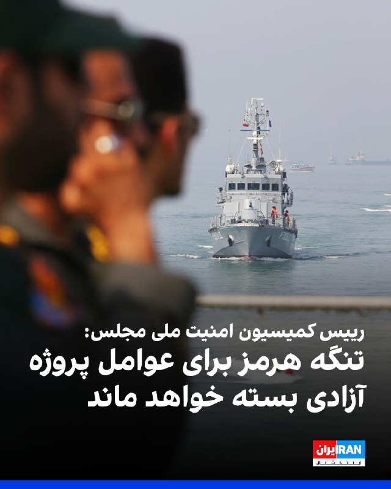

ابراهیم عزیزی، رییس کمیسیون امنیت ملی مجلس، با اشاره به طرح مجلس برای تنگه هرمز نوشت که جمهوری اسلامی سازوکاری برای مدیریت ترافیک این آبراه در مسیر تعیین‌شده تهیه کرده است که به‌زودی رونمایی می‌شود. عزیزی نوشت: «این مسیر کماکان برای عاملان پروژه به اصطلاح آزادی بسته خواهد ماند.»

او در ایکس نوشت: «ایران در چارچوب حق حاکمیت ملی و تضمین امنیت تجارت بین‌الملل، سازوکاری حرفه‌ای برای مدیریت ترافیک تنگه هرمز در مسیر تعیین‌شده تهیه کرده است که به‌زودی رونمایی می‌شود.»

او افزود: «در این فرآیند، فقط کشتی‌های تجاری و طرف‌های همکار با ایران از آن بهره‌مند خواهند شد. حقوق لازم در ازای خدمات تخصصی ارائه‌شده، با این سازوکار برای ایران اخذ می‌شود.»
https://iranintl.com/202605164109

## IranIntlTV — post 337461

  <a href="telegram/content/IranIntlTV_337461_1778931438.mp4" target="_blank">🎬 Download video</a>

ایرانیان استرالیا روز شنبه در حمایت از انقلاب ملی در بریزبن تجمع کرده و بخش‌هایی از پیام شاهزاده رضا پهلوی را پخش کردند.

## IranIntlTV — post 337460

  <a href="telegram/content/IranIntlTV_337460_1778931441.mp4" target="_blank">🎬 Download video</a>

مروری بر روزنامه‌های ایران، شنبه ۲۶ اردیبهشت، با مجتبی هاشمی، روزنامه‌نگار
@iranintltv

## IranIntlTV — post 337459

  <a href="telegram/content/IranIntlTV_337459_1778931444.mp4" target="_blank">🎬 Download video</a>

گزارش‌ها حاکی از بحران جدی بهداشت و درمان در زندان فشافویه تهران است. بر اساس روایت زندانیان، شیوع بیماری پوستی گال، تراکم بالای جمعیت و نبود دسترسی به پزشک و دارو، وضعیت زندانیان را بحرانی کرده است.

گفت‌وگو با محمد مقیمی، وکیل دادگستری و کارشناس ارشد حقوق بشر
@iranintltv

## IranIntlTV — post 337458

  <a href="telegram/content/IranIntlTV_337458_1778931447.mp4" target="_blank">🎬 Download video</a>

عطا حسینیان، روزنامه‌نگار اقتصادی و حوزه انرژی، گفت ایران در حال حاضر در زمینه تولید بنزین با مشکلات جدی مواجه است. او «حملات به پارس جنوبی، محاصره دریایی، روابط مخدوش جمهوری اسلامی با امارات و کمبود منابع مالی» را از جمله عوامل موثر بر تولید و عرضه بنزین در کشور دانست.
@iranintltv

## IranIntlTV — post 337457

  <a href="telegram/content/IranIntlTV_337457_1778931449.mp4" target="_blank">🎬 Download video</a>

ایرانیان نیوزیلند روز شنبه ۲۶ اردیبهشت‌ماه در حمایت از شاهزاده رضا پهلوی و علیه قطع اینترنت و اعدام‌های جمهوری اسلامی در اوکلند تجمع برگزار کردند.

## IranIntlTV — post 337450

🔻اریک کانتونا، اسطوره فوتبال فرانسه و یکی از عوامل مستند «کانتونا»، در جریان فوتوکال این فیلم که در بخش «نمایش‌های ویژه» هفتاد و نهمین جشنواره فیلم کن ارائه شد، روز شنبه ۲۶ اردیبهشت مقابل دوربین عکاسان ژست گرفت.

🔹مستند «کانتونا» که در جشنواره فیلم کن رونمایی شد، پرتره‌ای از اریک کانتونا، ستاره فرانسوی دهه ۹۰ منچستریونایتد، ارائه می‌دهد؛ فوتبالیستی جذاب اما تندخو که هم به‌واسطه نبوغ فوتبالی‌اش و هم به دلیل جنجال‌هایش به چهره‌ای اسطوره‌ای بدل شد.

🔹این فیلم به کارگردانی دیوید تری‌هورن و بن نیکلاس، سازندگان مستند «پله»، با ترکیبی از گفت‌وگوهای تازه با کانتونا و روایت‌هایی از الکس فرگوسن، دیوید بکام و گی رو، تلاش می‌کند تصویری کامل از «مرد، اسطوره، افسانه» بسازد.

@iranintltvsport

## IranIntlTV — post 337449

  <a href="telegram/content/IranIntlTV_337449_1778931452.mp4" target="_blank">🎬 Download video</a>

سرخط خبرهای شنبه ۲۶ اردیبهشت
@iranintltv

## IranIntlTV — post 337448

  <a href="telegram/content/IranIntlTV_337448_1778931454.mp4" target="_blank">🎬 Download video</a>

ایرانیان استرالیا روز شنبه در حمایت از انقلاب ملی علیه جمهوری اسلامی تجمع کرده و با حمل پرچم شیروخورشید ترانه‌های ملی را هم‌خوانی کردند.

## IranIntlTV — post 337447

  

روزنامه معاریو به نقل از منابع آگاه گزارش داد که دولت دونالد ترامپ در روزهای اخیر آمادگی خود را برای دادن «چراغ سبز» به اقدام نظامی در صورت شکست نهایی تلاش‌های دیپلماتیک با جمهوری اسلامی نشان داده است.

بر اساس این گزارش، با وجود این رویکرد، هنوز تصمیم نهایی برای آغاز عملیات نظامی اتخاذ نشده است.

این منابع افزودند که «پنجره دیپلماتیک به سرعت در حال بسته شدن است» و روزهای آینده می‌تواند در تعیین مسیر تحولات سرنوشت‌ساز باشد.
https://iranintl.com/202605162346

## IranIntlTV — post 337446

  <a href="telegram/content/IranIntlTV_337446_1778931458.mp4" target="_blank">🎬 Download video</a>

همزمان با افزایش تنش‌ها میان امارات متحده عربی و جمهوری اسلامی، یک مجری صدا و سیمای جمهوری اسلامی در برنامه‌ای با محور آموزش کار با سلاح، پرچم امارات متحده عربی را به‌عنوان هدف انتخاب کرد و به سوی آن شلیک کرد.

این بخش از برنامه در حالی پخش شد که روابط تهران و ابوظبی در هفته‌های اخیر با تنش‌هایی همراه بوده است.

صدا و سیمای جمهوری اسلامی جمعه چند برنامه پخش کرد که در آنها مجریان در بخش‌های استودیویی با در دست داشتن تفنگ ظاهر شدند و اعلام کردند در حال یادگیری کار با سلاح‌های سبک هستند و در صورت لزوم به جنگ خواهند پیوست.
@iranintltv

## IranIntlTV — post 337445

  <a href="telegram/content/IranIntlTV_337445_1778931460.mp4" target="_blank">🎬 Download video</a>

مخاطبان ایران اینترنشنال طی روزهای اخیر با ارسال پیام‌هایی درباره سلامت و جان فاطمه سپهری، زندانی سیاسی، ابراز نگرانی کرده و از ایرانیان خواستند در خارج از کشور صدای او باشند. پیام مخاطبان با هوش مصنوعی بازخوانی شده است.

## Shin_Persian — post 6027

Emanuel (Mannie) Fabian ✓ @manniefabian
Sat, 16 May 2026 09:32:14 UTC

The funeral for Hamas leader in the Gaza Strip, Izz al-Din al-Haddad, has begun, according to Palestinian media.

فارسی

به گفته رسانه‌های فلسطینی، مراسم تشییع پیکر عزالدین الحداد، از رهبران حماس در نوار غزه، آغاز شده است.

𝕏 · @shin_persian

## ManotoTV — post 105511

  <a href="telegram/content/ManotoTV_105511_1778931463.mp4" target="_blank">🎬 Download video</a>

کریس رایت، وزیر انرژی آمریکا گفته است انتظار دارد تنگه هرمز «حداکثر تا مقطعی در تابستان» بازگشایی شود.

رایت همچنین گفت اگر ایران به «گروگان گرفتن اقتصاد جهان» ادامه دهد، ارتش آمریکا می‌تواند برای بازگشایی تنگه هرمز مداخله کند.

## ManotoTV — post 105510

  <a href="telegram/content/ManotoTV_105510_1778931464.mp4" target="_blank">🎬 Download video</a>

در برنامه‌های شامگاه گذشته تلویزیون جمهوری اسلامی، بخش‌هایی با محور آموزش کار با سلاح پخش شد.

در این برنامه‌ها، مجریان یا کارشناسان حاضر در استودیو، شیوه گرفتن و استفاده از سلاح را توضیح دادند. پخش چنین محتوایی از تلویزیون حکومتی در شرایطی صورت می‌گیرد که رسانه‌های وابسته به جمهوری اسلامی در هفته‌های اخیر بر ادبیات نظامی، آمادگی دفاعی و بسیج حامیان خود تاکید بیشتری داشته‌اند.

## ManotoTV — post 105509

  <a href="telegram/content/ManotoTV_105509_1778931465.mp4" target="_blank">🎬 Download video</a>

‌
«دریک»، رپر، خواننده و بازیگر کانادایی، در یکی از قطعه‌های تازه خود با نام «Don’t Worry» به دختری ایرانی اشاره کرده که فارسی حرف می‌زند. این قطعه در آلبوم تازه او منتشر شده است. در متن ترانه نیز بندی آمده که در آن زن مورد اشاره خود را ایرانی معرفی می‌کند که فارسی حرف می‌‌زند.

دریک با نام کامل «آبری دریک گراهام» زاده تورنتو است و پیش از ورود جدی به موسیقی، با بازی در مجموعه تلویزیونی نوجوانانه «دگراسی، نسل بعدی» شناخته شد. او سپس به یکی از چهره‌های اصلی موسیقی هیپ‌هاپ و پاپ معاصر تبدیل شد و سبک ترکیبی او میان رپ‌خوانی و خوانندگی، جایگاه گسترده‌ای در بازار جهانی موسیقی برایش به همراه آورد.

## ManotoTV — post 105508

  <a href="telegram/content/ManotoTV_105508_1778931467.mp4" target="_blank">🎬 Download video</a>

گروه ناظر اینترنتی نت‌بلاکس اعلام کرد خاموشی دیجیتال در ایران اکنون وارد دوازدهمین هفته و هفتادوهشتمین روز خود شده است.
نت‌بلاکس می‌گوید این قطع اینترنت که یک کشور ۹۰ میلیونی را برای مدتی بی‌سابقه تا حد زیادی از دسترسی به اینترنت جهانی محروم کرده، همچنان در حال تضعیف حقوق بشر، اقتصاد و آزادی‌های اساسی در ایران است.

## ManotoTV — post 105507

  <a href="telegram/content/ManotoTV_105507_1778931468.mp4" target="_blank">🎬 Download video</a>

رسانه‌های عراقی گزارش دادند صدای انفجارهایی که روز شنبه در بغداد، پایتخت عراق شنیده شد، ناشی از شلیک گلوله‌های توپخانه به مناسبت تشکیل دولت جدید بوده است.
یک منبع امنیتی به خبرگزاری فرانسه گفت این شلیک‌ها همزمان با آغاز به کار دولت به ریاست نخست‌وزیر جدید عراق، علی الزیدی، انجام شده است.
پیش‌تر برخی رسانه‌ها از شنیده شدن چند انفجار در مرکز بغداد خبر دادند.

## FarsiVOA — post 217887

  <a href="telegram/content/FarsiVOA_217887_1778931469.mp4" target="_blank">🎬 Download video</a>

اعتراض گسترده شهروندان ژاپنی علیه ساخت مسجد در شهر فوجیساوا؛

صدها نفر از شهروندان ژاپنی در شهر ساحلی فوجیساوا، در جنوب توکیو، در اعتراض به پروژه ساخت اولین مسجد بزرگ این شهر دست به تجمع زدند.

معترضان نگران تغییر بافت فرهنگی محله و تأثیر آن بر هویت سنتی منطقه هستند. آن‌ها معتقدند مقیاس این مسجد بزرگ‌تر از زیارتگاه‌های شینتو در نزدیکی آن است.

علاوه بر مسائل فرهنگی، نگرانی‌هایی درباره ترافیک، سر و صدا و عدم آشنایی با آداب مذهبی جدید مطرح شده است.

شهرداری فوجیساوا اعلام کرده که این پروژه تمامی استانداردهای قانونی و شهرسازی را رعایت کرده و مجوزهای لازم را دارد، بنابراین روند ساخت از نظر قانونی مانعی ندارد. شهروندان به تجمعات گسترده در مسیر تردد مقامات شهرداری در این شهر ادامه دادند.

شهر فوجیساوا به دلیل قرار گرفتن بین کلانشهر توکیو و مناظر طبیعی و آرام از موقعیت خاصی برخوردار است.

این تنش‌ها در حالی رخ می‌دهد که جمعیت مسلمانان ژاپن در سال‌های اخیر رشد چشمگیری داشته و به بیش از ۴۰۰ هزار نفر رسیده است، موضوعی که بحث‌های گسترده‌ای را درباره نحوه همزیستی و تنوع فرهنگی در این کشور برانگیخته است.
@FarsiVOA

## FarsiVOA — post 217886

🔺وام یک میلیاردی مسکن فقط کفاف خرید ۱۰ متر از یک خانه را می‌دهد

◾️رئیس گروه مالی بانک مسکن، گفته است در شرایط فعلی، تسهیلات یک میلیارد تومانی خرید مسکن فقط امکان خرید حدود ۱۰ متر خانه را فراهم می‌کند.

◾️میانگین قیمت هر متر واحد مسکونی اکنون بین ۱۰۰ تا ۱۵۰ میلیون تومان برآورد شده است؛ یعنی وام یک میلیارد تومانی، حتی اگر کامل پرداخت شود، فقط بخش کوچکی از قیمت یک آپارتمان معمولی را پوشش می‌دهد.

◾️در بازار اجاره نیز هرچند گزارش مرکز آمار از کاهش سرعت رشد اجاره در فروردین حکایت دارد، فشار بر مستأجران همچنان بالاست. طبق گزارش بازنشرشده از داده‌های مرکز آمار، تورم نقطه‌به‌نقطه اجاره در فروردین ۳۱.۱ درصد و تورم سالانه اجاره ۳۳.۷ درصد بوده است.

⬇️ بیشتر بخوانید:
https://ir.voanews.com/a/8150657.html

## FarsiVOA — post 217885

  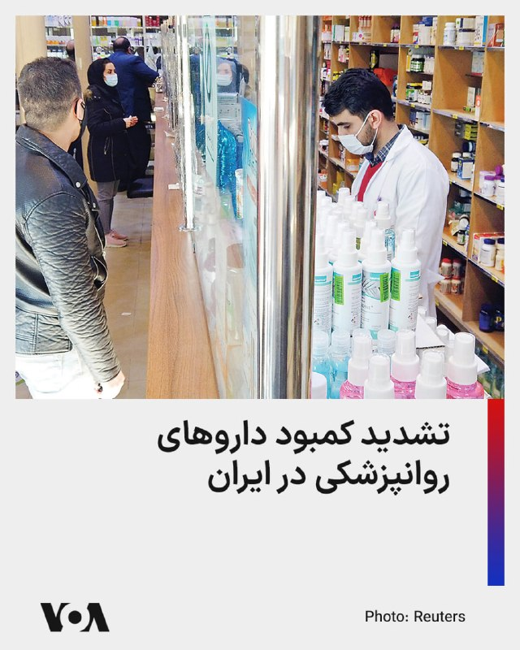

رئیس انجمن روانپزشکان ایران می‌گوید کمبود دارو در حوزه روانپزشکی جدی است و نسبت به شرایط پیش از جنگ، به «طور قابل توجهی» تشدید شده است.

وحید شریعت به ایلنا گفته است در ماه‌های اخیر، کمبود قابل توجهی در برخی اقلام دارویی مشاهده شده است که برخی از آن‌ها از پیش از آغاز جنگ تشدید یافته و برخی دیگر کاملاً جدید هستند.

به گفته او احتمالاً مسئله به اختلال در روند تولید به خاطر نبود مواد اولیه یا نوعی دست نگه داشتن در توزیع، به منظور آماده‌سازی شرایط بازار برای افزایش قیمت مرتبط باشد.

حسین‌علی شهریاری رئیس کمیسیون بهداشت و درمان مجلس نیز روز پنج‌شنبه از افزایش قیمت برخی داروها بین ۵۰ تا ۳۰۰ درصد خبر داد و گفت بر اساس برآورد وزارت بهداشت، حدود ۱۵۰ هزار میلیارد تومان منابع نیاز است تا بتوان فشار هزینه‌های دارویی بر مردم را کاهش داد.
@FarsiVOA

## FarsiVOA — post 217884

  <a href="telegram/content/FarsiVOA_217884_1778931472.mp4" target="_blank">🎬 Download video</a>

حرکات مخصوص ایلان ماسک حین عکس گرفتن با تیم کوک در پکن؛

ایلان ماسک، مدیرعامل تسلا و اسپیس‌اکس، در سفر اخیر دونالد ترامپ، رئیس جمهوری آمریکا به پکن، به عنوان یکی از چهره‌های کلیدی هیئت همراه حضور داشت.

حضور او در کنار سایر مدیران فناوری نظیر تیم کوک، مدیرعامل اپل و جنسن هوانگ، مدیرعامل انویدیا، بر اهمیت مذاکرات پیرامون هوش مصنوعی در این سفر تأکید داشت.

این حضور نشان‌دهنده نزدیکی دوباره ماسک به تیم ترامپ، پس از وقفه‌ای در همکاری‌های مستقیم دولتی آن‌ها در سال گذشته است.
@FarsiVOA

## FarsiVOA — post 217883

  

عراق در ماه آوریل تنها ۱۰ میلیون بشکه نفت از مسیر تنگه هرمز صادر کرده است؛ رقمی که به گفته باسم محمد، وزیر نفت جدید عراق، پیش از جنگ ایران به طور معمول حدود ۹۳ میلیون بشکه در ماه بود.

وزیر نفت عراق همچنین گفت صادرات نفت خام این کشور از خط لوله کرکوک-جیهان در ماه مارس، پس از توافق بغداد و اقلیم کردستان برای ازسرگیری جریان نفت، دوباره آغاز شده است.

به گفته او، عراق اکنون روزانه ۲۰۰ هزار بشکه از بندر جیهان صادر می‌کند و برنامه دارد این رقم را به ۵۰۰ هزار بشکه در روز افزایش دهد. بغداد همچنین قصد دارد با اوپک برای افزایش ظرفیت تولید و صادرات خود رایزنی کند.

تنگه هرمز در هفته‌های اخیر، هم‌زمان با جنگ آمریکا و جمهوری اسلامی و افزایش تنش‌های نظامی در خلیج فارس، به یکی از نقاط اصلی بحران انرژی تبدیل شده است.

این مسیر، گذرگاه حیاتی صادرات نفت و گاز کشورهای حاشیه خلیج فارس از جمله عراق، قطر، عربستان سعودی، امارات و کویت است.
@FarsiVOA

## FarsiVOA — post 217882

🔺بلومبرگ: ادامه جنگ نگرانی از بازگشت تورم جهانی را تشدید کرد

◾️پیامدهای جنگ در خاورمیانه همچنان در اقتصاد جهانی گسترش می‌یابد و چشم‌انداز رشد، تورم و بازارهای مالی را پیچیده‌تر کرده است.

◾️بر اساس این گزارش، جنگ دیگر فقط یک بحران منطقه‌ای نیست؛ اثر آن از مسیر نفت، هزینه حمل‌ونقل، قیمت کالاها و انتظارات تورمی به اقتصادهای بزرگ و کوچک منتقل شده است.

◾️صندوق بین‌المللی پول اخیراً اعلام کرد که جنگ در خاورمیانه اقتصاد جهانی را با شوک تازه‌ای روبه‌رو کرده و حتی با فرض محدود ماندن درگیری، رشد جهانی در سال ۲۰۲۶ به ۳.۱ درصد کاهش می‌یابد.

◾️سازمان همکاری و توسعه اقتصادی نیز پیش‌بینی کرده رشد جهانی در سال ۲۰۲۶ به ۲.۹ درصد برسد و تورم اقتصادهای گروه ۲۰ به ۴ درصد افزایش یابد.

⬇️ بیشتر بخوانید:
https://ir.voanews.com/a/8150656.html

## FarsiVOA — post 217881

  <a href="telegram/content/FarsiVOA_217881_1778931476.mp4" target="_blank">🎬 Download video</a>

تصاویر منتشر شده از سواحل جنوبی ایران، از یک فاجعه زیست‌محیطی گسترده حکایت دارد؛ لجن‌های نفتی و مواد سمی بخش وسیعی از اکوسیستم دریایی این منطقه را آلوده کرده است.

در حالی که کارشناسان به فرسودگی شدید زیرساخت‌ها اشاره می‌کنند، برخی گزارش‌ها نیز حاکی از احتمال تخلیه عمدی پسماندهای نفتی در آب‌های ساحلی است که ابعاد این فاجعه را پیچیده‌تر می‌کند.

در همین زمینه مایک والتز، نماینده آمریکا در سازمان ملل متحد، روز جمعه با بازنشر این ویدیو در شبکه ایکس نوشت جمهوری اسلامی «ایران اکنون علاوه بر اهداف غیرنظامی، کمک‌های بشردوستانه و کشتیرانی غیرنظامی، به محیط زیست نیز حمله می‌کند.»

نشت مواد سمی باعث مرگ دسته‌جمعی هزاران خرچنگ و گونه‌های جانوری دیگر در نوار ساحلی شده است.

آتش‌سوزی در بخش‌هایی از لکه‌های نفتی، توده‌های عظیم دود سیاه ایجاد کرده که سلامت ساکنان منطقه را تهدید می‌کند.
@FarsiVOA

## FarsiVOA — post 217880

🔺آمریکا در تدارک اعلام جرم علیه رائول کاسترو رهبر پیشین کوبا

◾️رویترز به نقل از یک مقام وزارت دادگستری آمریکا گزارش داد دولت ترامپ قصد دارد روز چهارشنبه ۲۰ مه، اتهامات کیفری علیه رائول کاسترو، رهبر پیشین کوبا، را در میامی اعلام کند.

◾️به گفته این مقام، پرونده به حادثه سال ۱۹۹۶ بازمی‌گردد؛ زمانی که جنگنده‌های کوبا دو هواپیمای کوچک متعلق به گروه تبعیدیان کوبایی «برادران نجات» را سرنگون کردند و چهار نفر شهروند آمریکایی کشته شدند. رائول کاسترو در آن زمان وزیر دفاع کوبا بود.

◾️واشنگتن پس از این حادثه، در دوره بیل کلینتون، تحریم‌هایی علیه کوبا اعمال کرد؛ از جمله تعلیق پروازهای چارتر، محدود کردن رفت‌وآمد دیپلمات‌های کوبایی، و تلاش برای تشدید تحریم‌ها در کنگره.

⬇️ بیشتر بخوانید:
https://ir.voanews.com/a/8150655.html

## FarsiVOA — post 217879

  

بلومبرگ گزارش داد شرکت ملی نفت ابوظبی، ادنوک، با وجود اختلال‌های حمل‌ونقل در خلیج فارس، همچنان گاز طبیعی مایع را روی نفتکش‌هایی بارگیری می‌کند که سامانه‌های ردیابی خود را خاموش کرده‌اند.

بر اساس این گزارش، این کشتی‌ها برای عبور از تنگه هرمز موقعیت خود را پنهان می‌کنند؛ مسیری که از آغاز جنگ و افزایش تهدیدها علیه کشتیرانی، با خطر جدی روبه‌رو شده است.

ادنوک پیش‌تر اعلام کرده بود به دلیل اختلال در عبور کشتی‌ها از تنگه هرمز، تولید و صادرات ال‌ان‌جی و برخی محصولات صادراتی خود را به‌طور موقت تنظیم کرده است.

تأسیسات داس آیلند این شرکت در داخل خلیج فارس قرار دارد و صادرات آن برای رسیدن به بازارهای جهانی ناچار به عبور از تنگه هرمز است.

رویترز نیز اوایل ماه مه گزارش داد دومین نفتکش ال‌ان‌جی تحت مدیریت ادنوک، پس از خاموش کردن سامانه ردیابی خود، از تنگه هرمز عبور کرده است.

داده‌های رهگیری کشتی‌ها نشان می‌دهد شماری از نفتکش‌ها در هفته‌های اخیر برای کاهش خطر هدف‌گیری یا توقیف، موقعیت خود را پنهان کرده یا الگوهای شناسایی غیرعادی داشته‌اند.
@FarsiVOA

## FarsiVOA — post 217878

🔺خاموشی اینترنت در ایران وارد هفته دوازدهم شد

◾️نت‌بلاکس، نهاد ناظر بر اختلالات اینترنت، اعلام کرد خاموشی دیجیتال در ایران وارد هفته دوازدهم و روز هفتادوهشتم شده است

◾️این محدودیت بی‌سابقه، کشوری ۹۰ میلیونی را تا حد زیادی از اینترنت جهانی جدا کرده و حقوق بشر، اقتصاد و آزادی‌های بنیادین شهروندان را در مقیاسی گسترده فرسایش می‌دهد.

◾️مقام‌های دولتی مدعی هستند که اینترنت حق عمومی و برابر شهروندان است، اما ساختار دسترسی در عمل به سمت اینترنت گزینشی، لیست سفید و «اینترنت پرو» حرکت کرده است.

◾️همچنین دسترسی به زیرساخت حیاتی اینترنت، به‌جای آنکه برای همه شهروندان و فعالان اقتصادی تضمین شود، به فرآیندی اداری، صنفی و گزینشی تبدیل شده است.

⬇️ بیشتر بخوانید:
https://ir.voanews.com/a/8150654.html

## FarsiVOA — post 217877

  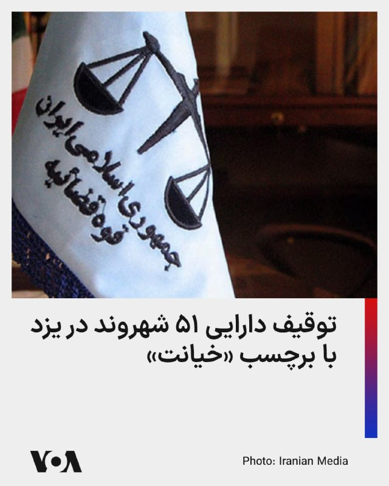

رسانه وابسته به قوه قضائیه جمهوری اسلامی اعلام کرد اموال ۵۱ نفر در استان یزد، با دستور قضایی و به اتهام آنچه «خیانت به وطن» و «همکاری با دشمن» خوانده شده، توقیف شده است.

بر اساس این گزارش، پرونده این افراد در ارتباط با قانون موسوم به «تشدید مجازات جاسوسی و همکاری با رژیم صهیونیستی علیه امنیت و منافع ملی» در حال رسیدگی است و مقام‌های قضایی مدعی شده‌اند دارایی‌های توقیف‌شده قرار است برای «حفظ حقوق عامه» و بازسازی اماکن آسیب‌دیده از جنگ هزینه شود.

اموال توقیف‌شده شامل حساب‌های بانکی، دارایی‌های منقول و غیرمنقول، سهام شرکت‌ها و حتی اموال وکالتی عنوان شده است.

طبق گزارش میزان، از میان این ۵۱ نفر، ۲۰ نفر در داخل کشور حضور دارند و ۳۱ نفر دیگر در خارج از کشور به سر می‌برند.

این اقدام در ادامه موج تازه‌ای از مصادره و توقیف اموال شهروندان و مخالفان سیاسی صورت می‌گیرد؛ روندی که در عمل به ابزاری برای فشار، ارعاب و مصادره دارایی افراد تحت عنوان‌های سنگینی مانند «خیانت» و «همکاری با دشمن» تبدیل شده است.
@FarsiVOA

## FarsiVOA — post 217876

  

ارتش اسرائیل اعلام کرد پیش از آغاز حملات هوایی علیه مواضع حزب‌الله در جنوب لبنان، برای ساکنان ۹ روستا هشدار تخلیه صادر کرده است.

بر اساس این هشدار، ساکنان قعقعیه الصنوبر، کوثریه السیاد، مروانیه، غسانیه، تفاحتا، ارزی، بابلیه، انصار و بیصاریه باید دست‌کم یک کیلومتر از محل سکونت خود فاصله بگیرند.

سخنگوی ارتش اسرائیل گفت این اقدام در پی نقض توافق آتش‌بس از سوی حزب‌الله انجام می‌شود و ارتش اسرائیل قصد آسیب‌زدن به غیرنظامیان را ندارد.
@FarsiVOA

## FarsiVOA — post 217875

  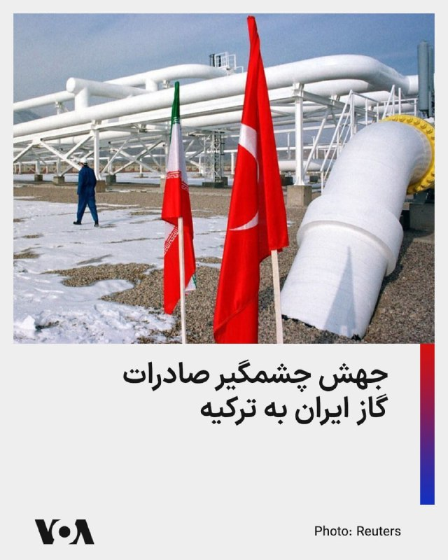

آمارهای اداره تنظیم بازار انرژی ترکیه از جهش ۸۲ درصدی صادرات گاز ایران به ترکیه در اولین ماه آغاز عملیات نظامی مشترک اسرائیل و آمریکا علیه جمهوری اسلامی خبر داد.

ایران در ماه مارس بیش از ۸۲۳ میلیون متر مکعب گاز تحویل ترکیه داده و سهمی بالای ۱۳ درصدی در کل واردات گاز ترکیه داشته است. واردات گاز ترکیه از ایران در سه ماهه ابتدایی ۲۰۲۶ نیز بیش از دو برابر شده و به یک میلیارد و ۷۵۶ میلیون متر مکعب اوج گرفته است.

این در حالی است که ایران با کسری شدید گاز در داخل کشور مواجه است و قرارداد ۲۵ ساله صادرات گاز ایران به ترکیه نیز در هفته‌های پیش رو به اتمام می‌رسد. پیشتر وزیر انرژی ترکیه گفته بود که مذاکراتی برای تمدید این قرارداد در جریان نیست.
@FarsiVOA

## FarsiVOA — post 217874

  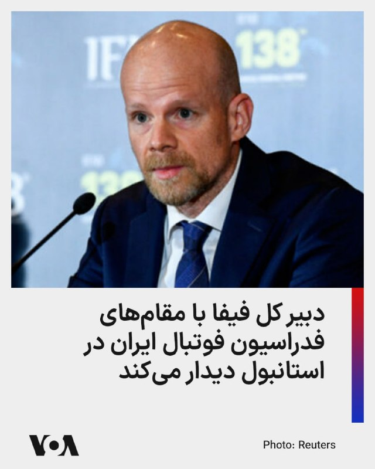

خبرگزاری رویترز از قول یک منبع آگاه گزارش داده که دبیر کل فیفا با مقامات فدراسیون فوتبال ایران در استانبول دیدار خواهد کرد.

این منبع که نامی از او برده نشده گفته است ماتیاس گرافستروم درباره حضور ایران در جام جهانی به مقامات فدراسیون ایران «اطمینان خاطر» خواهد داد.

پس از آنکه مهدی تاج، رئیس فدراسیون فوتبال ایران، به دلیل ارتباط با سپاه پاسداران از ورود به کانادا برای شرکت در کنگره فیفا در ونکوور در اوایل ماه جاری منع شد، پرسش‌های بیشتری درباره وضعیت حضور ایران مطرح شد.

آمریکا و کانادا که همراه با مکزیک میزبان جام جهانی هستند، سپاه پاسداران را «سازمان تروریستی» طبقه‌بندی کرده‌ و گفته‌اند افرادی را که با سپاه ارتباط دارند، نخواهند پذیرفت.
@FarsiVOA

## DW_Farsi — post 124760

🔶 دولت ترامپ اعزام ۴۰۰۰ سرباز آمریکایی به لهستان را متوقف کرد

پس از اعلام خروج بخشی از نیروهای آمریکایی از آلمان، ایالات متحده به شکلی غیرمنتظره برنامه اعزام چهار هزار سرباز به لهستان را لغو کرد.

کریستوفر لانو، رئیس موقت ستاد ارتش ایالات متحده، این تصمیم را در برابر کمیته نیروهای مسلح مجلس نمایندگان آمریکا تأیید کرد.

این مقام بلندپایه ارتش آمریکا، بدون ارائه جزئیات بیشتر، اعلام کرد: «معقول‌ترین تصمیم این بود که این تیپ در منطقه عملیاتی مستقر نشود.»

دموکرات‌ها و جمهوری‌خواهان بلندپایه از این اقدام انتقاد کردند و خشم خود را از این موضوع ابراز داشتند که برخلاف الزامات قانونی، کنگره نه از این تصمیم مطلع شده و نه مورد مشورت قرار گرفته است.

@dw_farsi

## DW_Farsi — post 124758

  

🔶 صادرات نفت عراق از طریق تنگه هرمز به ۱۰ میلیون بشکه کاهش یافت

عراق اعلام کرد صادرات نفت این کشور از طریق تنگه هرمز در ماه آوریل به ۱۰ میلیون بشکه کاهش یافته؛ رقمی که پیش از جنگ ایران ماهانه حدود ۹۳ میلیون بشکه بوده است.

باسم محمد خزیر، وزیر نفت عراق روز شنبه ۲۶ اردیبهشت (۱۶ مه) در یک کنفرانس مطبوعاتی اعلام کرد بسته‌شدن تنگه هرمز در پی جنگ ایران، صادرات نفت عربستان سعودی، امارات، کویت و عراق را محدود کرده و باعث افزایش شدید قیمت‌ها شده است.

او همچنین اعلام کرد صادرات نفت عراق از طریق خط لوله کرکوک-جیهان از ماه مارس از سر گرفته شده و بغداد قصد دارد صادرات از بندر جیهان ترکیه را از ۲۰۰ هزار بشکه به ۵۰۰ هزار بشکه در روز افزایش دهد.

به گفته وزیر نفت عراق، این کشور همچنین در حال رایزنی با سازمان کشورهای صادر‌کننده نفت "اوپک" برای افزایش ظرفیت تولید و صادرات نفت است. عراق قصد دارد ظرفیت تولید خود را به ۵ میلیون بشکه در روز برساند.

بسته‌شدن تنگه هرمز نه‌تنها صادرکنندگان نفت، بلکه واردکنندگان آن از جمله چین را نیز با مشکل مواجه کرده است.

دونالد ترامپ، رئیس‌جمهور آمریکا، پس از سفر دو روزه خود به چین اعلام کرد که شی جین‌پینگ، رئیس جمهور این کشور با ضرورت بازگشایی تنگه هرمز موافقت کرده است، هرچند چین به‌طور رسمی چنین موضعی را تائید نکرده است.

ترامپ همچنین گفت در حال بررسی لغو تحریم‌ها علیه شرکت‌های نفتی چین است که نفت ایران را خریداری می‌کنند و تاکید کرد که در این زمینه از پکن درخواست امتیاز خاصی نکرده است.

در مقابل، شی جین‌پینگ در اظهارات عمومی درباره ایران و تنگه هرمز موضعی نگرفت، اما وزارت خارجه چین نسبت به جنگ ایران ابراز نگرانی کرده و آن را درگیری‌‌ای توصیف کرد که "نباید رخ می‌داد و نباید ادامه یابد".

@dw_farsi

## DW_Farsi — post 124757

  

🔶 دیدار دبیر کل فیفا با مقام‌های فدراسیون فوتبال ایران در استانبول

خبرگزاری رویترز گزارش داد ماتیاس گرافستروم، دبیرکل فیفا (فدراسیون بین‌المللی فوتبال) روز شنبه ۲۶ اردیبهشت (۱۶ مه) در استانبول با مقام‌های فدراسیون فوتبال ایران دیدار خواهد کرد تا درباره حضور ایران در جام جهانی "اطمینان خاطر" بدهد.

جمهوری اسلامی شامگاه چهارشنبه ۲۳ اردیبهشت با حضور هزاران هوادار در میدان انقلاب تهران، مراسم بدرقه تیم ملی فوتبال برای جام جهانی را برگزار کرد.

انتشار تصاویر شعارهایی مانند "مرگ بر آمریکا" در این مراسم بازتاب گسترده‌ای در رسانه‌ها و شبکه‌های اجتماعی داشت.

بازیکنان قرار است هفته آینده تمرینات خود را در اردوی آماده‌سازی در ترکیه آغاز کنند.

مهدی تاج، رئیس فدراسیون فوتبال ایران پیش از این به دلیل ارتباط با سپاه پاسداران انقلاب اسلامی، اجازه ورود به کانادا برای شرکت در کنگره فیفا را دریافت نکرد.

آمریکا نیز همانند کانادا، سپاه پاسداران را در فهرست سازمان‌های تروریستی قرار داده است.

گزارش‌ها درباره محدودیت‌های احتمالی ورود برخی افراد مرتبط با سپاه پاسداران نیز این نگرانی‌ها را افزایش داده است. جمهوری اسلامی مسئولیت حل موضوع ویزا برای بازیکنان و اعضای تیم را بر عهده فیفا گذاشته است.

ایران قرار است هر سه بازی مرحله گروهی جام جهانی را در آمریکا برگزار کند.

پس از حملات آمریکا و اسرائیل به ایران در اواخر فوریه، مشارکت تیم ملی ایران در این رقابت‌ها که از ۱۱ ژوئن تا ۱۹ ژوئیه برگزار می‌شود، با ابهام روبه‌رو شده است.

@dw_farsi

## DW_Farsi — post 124756

  

🔶 قربانیان تروریسم خواستار مصادره ۳۴۴ میلیون دلار ارز دیجیتالی ایران شدند

گروهی از خانواده‌های قربانیان تروریسم در آمریکا از یک قاضی فدرال در منهتن نیویورک خواسته‌اند شرکت ارز دیجیتالی "تتر"، صادرکننده "استیبل‌کوین" را ملزم کند بیش از ۳۴۴ میلیون دلار دارایی دیجیتال مسدودشده مرتبط با ایران را به وکلای آن‌ها منتقل کند.

این درخواست روز پنجشنبه ۲۴ اردیبهشت (۱۴ مه) در دادگاه منطقه منهتن نیویورک ثبت شده و مربوط به خانواده‌هایی است که با بمب‌گذاری سال ۱۹۹۷ حماس در اورشلیم ارتباط دارند و در پرونده‌های مختلف مرتبط با تروریسم، احکام پرداختی سنگینی علیه ایران دریافت کرده‌اند.

مجموع این احکام شامل حدود ۵۵۲ میلیون دلار غرامت و ۱.۸۶ میلیارد دلار خسارت تنبیهی است.

دارایی ارز دیجیتالی جمهوری اسلامی در چارچوب عملیات "خشم اقتصادی" دولت آمریکا و با هدف محدود کردن توان مالی ایران مسدود شده بود.

وزارت خزانه‌داری آمریکا اعلام کرده بود که شبکه‌های مالی مرتبط با سپاه پاسداران و حزب‌الله در این روند هدف قرار گرفته‌اند.

طبق اسناد پرونده، دو کیف پول رمزارزی که مجموعا حدود ۳۴۴ میلیون دلار در آن‌ها نگهداری می‌شد، توسط شرکت تتر مسدود شده‌اند. اکنون شاکیان درخواست کرده‌اند این دارایی‌ها برای اجرای احکام دادگاه‌های آمریکا علیه ایران به آن‌ها منتقل شود.

@dw_farsi

## DW_Farsi — post 124755

🔶 ایران متهم به هک سامانه‌های پایش سوخت پمپ‌بنزین‌های آمریکا

شبکه تلویزیونی سی‌ان‌ان در گزارشی اختصاصی نوشت مقام‌های آمریکایی گمان می‌کنند هکرهای ایرانی پشت مجموعه‌ای از نفوذهای سایبری به سامانه‌های پایش مخازن سوخت در پمپ‌بنزین‌های چندین ایالت آمریکا قرار دارند؛ سامانه‌هایی که میزان سوخت موجود در مخازن ذخیره را اندازه‌گیری و گزارش می‌کنند.

به گفته منابع آگاه از این فعالیت‌ها، هکرها از ضعف امنیتی سامانه‌های "سنجش خودکار مخازن (ATG)" سوءاستفاده کرده‌اند؛ سامانه‌هایی که به اینترنت متصل هستند و در برخی موارد حتی با رمز عبور محافظت نمی‌شده‌اند.

بر اساس گزارش سی‌ان‌ان، هکرها در برخی موارد توانسته‌اند داده‌های نمایش‌داده‌شده درباره سطح سوخت را دستکاری کنند، اما میزان واقعی سوخت موجود در مخازن تغییر نکرده است. تاکنون گزارشی از خسارت فیزیکی، انفجار، نشت یا آسیب مستقیم منتشر نشده، اما مقام‌های آمریکایی و کارشناسان بخش خصوصی هشدار داده‌اند که دسترسی به چنین سامانه‌هایی می‌تواند از نظر امنیتی خطرناک باشد؛ زیرا اصولاً ممکن است به مهاجم امکان دهد نشتی سوخت را از دید سامانه‌های هشدار پنهان کند.

@dw_farsi

## DW_Farsi — post 124754

  

📸 عکس روز: میزبان مهربان دریای کارائیب

یک لاک‌پشت دریایی روز جمعه، ۱۵ مه ۲۰۲۶ (۲۵ اردیبهشت ۱۴۰۵)، در ساحل پیسکادو واقع در منطقه وست‌پونت در جزیره کوراسائو، در میان گردشگرانی که مشغول غواصی سطحی هستند، شنا می‌کند. جزیره کوراسائو در دریای کارائیب به خاطر آب‌های زلال و حیات وحش دریایی غنی خود، یکی از مقاصد محبوب غواصان و دوستداران طبیعت است.

@dw_farsi

## DW_Farsi — post 124753

  

🔶 ترامپ: در عملیات مشترک آمریکا و نیجریه نفر دوم داعش کشته شد

دونالد ترامپ، رئیس‌جمهور آمریکا شامگاه جمعه ۲۵ اردیبهشت (۱۵ مه) اعلام کرد که "ابو بلال المینوکی"، نفر دوم گروه داعش در یک عملیات مشترک میان نیروهای آمریکا و ارتش نیجریه کشته شده است.

ترامپ در شبکه اجتماعی "تروث سوشال" نوشت این عملیات به دستور او و با اجرای نیروهای آمریکایی و نیروهای مسلح نیجریه "به‌صورت دقیق و پیچیده" انجام شده و هدف آن حذف "فعال‌ترین تروریست جهان" از میدان نبرد بوده است.

او افزود که المینوکی تصور می‌کرد می‌تواند در آفریقا مخفی شود، اما نیروهای اطلاعاتی آمریکا از فعالیت‌های او مطلع بوده‌اند.

رئیس جمهور آمریکا که پیش‌تر نیجریه را به ناتوانی در حفاظت از مسیحیان در برابر شبه‌نظامیان اسلام‌گرا در شمال‌غرب این کشور متهم کرده بود، از دولت نیجریه بابت همکاری در این عملیات قدردانی کرد.

دولت نیجریه هرگونه تبعیض مذهبی را رد و اعلام کرده است که نیروهای امنیتی این کشور با گروه‌های مسلحی مقابله می‌کنند که به مسیحیان و  مسلمانان حمله می‌کنند.

به گزارش رویترز، آمریکا پیش‌تر نیز در ماه دسامبر سال گذشته حملاتی علیه نیروهای وابسته به گروه داعش در نیجریه انجام داده بود.

واشنگتن بعد از این حملات پهپادهایی به همراه حدود ۲۰۰ نیروی نظامی برای آموزش و پشتیبانی اطلاعاتی در اختیار ارتش نیجریه قرار داد تا با شورش‌های وابسته به داعش و القاعده که در غرب آفریقا در حال گسترش هستند، مقابله کند.

@dw_farsi

## DW_Farsi — post 124751

  

🔶 ادامه درگیری‌ها در جنوب لبنان با وجود تمدید آتش‌بس

علی‌رغم تمدید آتش‌بس میان اسرائیل و حزب‌الله لبنان برای ۴۵ روز، صبح روز شنبه ۲۶ اردیبهشت (۱۶ مه) گزارش‌هایی از ادامه درگیری‌ها در جنوب لبنان منتشر شده است.

بر اساس یک گزارش رسانه‌ای، در حمله‌ای که گفته می‌شود توسط ارتش اسرائیل در جنوب لبنان انجام شده، دست‌کم شش نفر کشته و ۲۲ نفر زخمی شده‌اند.

خبرگزاری ملی لبنان "ان‌ان‌آ" گزارش داده است سه نفر از کشته‌شدگان از نیروهای امدادی در مرکز دفاع مدنی در منطقه نبطیه بوده‌اند.

ارتش اسرائیل تاکنون درباره این گزارش‌ها اظهار نظر نکرده است.

این گزارش درگیری در حالی منتشر شده است که روز جمعه ۱۵ مه سخنگوی وزارت خارجه آمریکا در شبکه ایکس از تمدید آتش‌بس میان اسرائیل و لبنان برای ۴۵ روز دیگر خبر داده بود.

این آتش‌بس از اواسط آوریل برقرار شده و پیش‌تر نیز یک‌بار تمدید شده بود، اما در هفته‌های گذشته بارها از سوی دو طرف نقض شده است.

@dw_farsi

## DW_Farsi — post 124750

  

🔶 محاکمه فرمانده گروه شبه‌نظامی "کتائب حزب‌الله عراق" در نیویورک

محمد باقر سعد داوود ساعدی، فرمانده شبه‌نظامی عراق به "دست داشتن در چندین حمله علیه منافع آمریکا در اروپا" متهم شده است.

وزارت دادگستری آمریکا روز جمعه ۲۵ اردیبهشت (۱۵ مه) اعلام کرد این فرمانده نظامی پس از بازداشت و برای پاسخ به شش اتهام مرتبط با "تروریسم" به ایالات متحده منتقل شده است.

مقام‌های قضایی آمریکا گفتند ساعدی عضو ارشد گروه شبه‌نظامی "کتائب حزب‌الله" مورد حمایت ایران بوده و به حمایت مادی از یک سازمان تروریستی خارجی متهم است.

ایالات متحده کتائب حزب‌الله عراق را به عنوان یک گروه ترویستی می‌شناسد.

دادستان نیویورک می‌گوید ساعدی متهم است که در هماهنگی یا حمایت از نزدیک به ۲۰ حمله و اقدام به حمله در سراسر اروپا و ایالات متحده نقش داشته است.

دولت آمریکا و کارشناسان مستقل می‌گویند کتائب حزب‌الله تحت هدایت نیروی قدس سپاه پاسداران فعالیت می‌کند.

@dw_farsi

## DW_Farsi — post 124749

  

🔶 ترامپ: در مذاکرات ایران به وضعیت مالی آمریکایی‌ها فکر نمی‌کنم

دونالد ترامپ، رئیس‌ جمهور آمریکا روز جمعه ۲۵ اردیبهشت (۱۵ مه) در مصاحبه با "فاکس‌نیوز" گفت که پیامدهای سیاسی جنگ ایران بر انتخابات میان‌دوره‌ای را در نظر نمی‌گیرد؛ انتخاباتی که جمهوری‌خواهان باید در آن اکثریت شکننده خود را در هر دو مجلس حفظ کنند.

او افزود: «وقتی درباره ایران صحبت می‌کنم، فقط یک چیز مهم است؛ آنها نباید سلاح هسته‌ای داشته باشند. من به وضعیت مالی آمریکایی‌ها فکر نمی‌کنم، به هیچ‌کس فکر نمی‌کنم؛ فقط به این فکر می‌کنم که ایران نباید سلاح هسته‌ای داشته باشد.»

ترامپ روز سه‌شنبه ۱۲ مه نیز تاکید کرده بود که عدم دستیابی به سلاح هسته‌ای از سوی ایران را مهم‌تر از وضعیت مالی آمریکایی‌ها می‌داند. این اظهارات با انتقاد گسترده دموکرات‌ها روبه‌رو شد، در حالی که شماری از جمهوری‌خواهان از او دفاع کردند.

ترامپ در گفت‌وگو با فاکس‌نیوز که در جریان سفرش به چین ضبط شده بود، خاطرنشان کرد که در جریان مذاکرات برای پایان دادن به جنگ ایران و بازگشایی تنگه هرمز، ممکن است "مشکلات کوتاه‌مدت" از جمله افزایش قیمت انرژی رخ دهد. ترامپ تاکید کرد که با افزایش قیمت بنزین مشکلی ندارد، اگر این موضوع به تحقق اهداف آمریکا در قبال ایران کمک کند.

ترامپ همچنین گفت: «اگر به مردم گفته شود که قرار است برای مدتی کوتاه بهای بیشتری برای بنزین بپردازند، چون هدف جلوگیری از دستیابی یک دیوانه به سلاح هسته‌ای است، همه خواهند گفت مشکلی نیست.»

از زمان آغاز حملات آمریکا و اسرائیل به ایران، قیمت بنزین در آمریکا افزایش یافته است، اما به گفته ترامپ این قیمت پس از پایان بحران و بازگشایی تنگه هرمز کاهش خواهد یافت.

@dw_farsi

## Persian_Trend_Official — post 14236

https://castbox.fm/vi/945846191

لطفا چک کنید ببنید دسترسی دارید ؟

## Persian_Trend_Official — post 14235

کانال رسمی پرشین ترند pinned «از همراهی و توجه شما واقعاً ممنونیم ❤️ اینکه با رأی‌ها، نظرات و مشارکت‌تون مسیر پرشین ترند رو دقیق‌تر می‌کنید، برای ما خیلی ارزشمنده. بر اساس همین بازخوردها، از این به بعد نسخه صوتی برنامه‌ها در «کست‌باکس» و سایر پادگیر ها مثل اسپاتیفای، اپل موزیک و ...…»

## Persian_Trend_Official — post 14234

از همراهی و توجه شما واقعاً ممنونیم ❤️
اینکه با رأی‌ها، نظرات و مشارکت‌تون مسیر پرشین ترند رو دقیق‌تر می‌کنید، برای ما خیلی ارزشمنده.

بر اساس همین بازخوردها، از این به بعد نسخه صوتی برنامه‌ها در «کست‌باکس» و سایر پادگیر ها مثل اسپاتیفای، اپل موزیک و ... منتشر میشه 🎧

با توجه به اینکه هم تلگرام و هم کست‌باکس فیلتر هستند، از نظر دسترسی تفاوت خاصی وجود نداره؛
اما برای کسانی که استفاده از فیلترشکن براشون سخت‌تره، نسخه تصویری برنامه‌ها طبق روال قبل در هاست داخلی و وب‌سایت قرار می‌گیره 📥

در عین حال تلاش می‌کنیم وب‌سایت پرشین ترند رو هم حرفه‌ای‌تر و کامل‌تر توسعه بدیم تا دسترسی به محتوا راحت‌تر بشه.

مثل همیشه ممنون از همراهی‌تون 🙏

📌 @persian_trend_official
پرشین ترند | متفاوت‌ترین کانال نظامی

## Persian_Trend_Official — post 14233

  

💢فراخوان مشمولان متولد ۱۳۵۵ تا ۱۳۸۷ برای تعیین‌تکلیف سربازی

🔹سازمان وظیفهٔ عمومی فراجا اعلام کرد: همهٔ مشمولان غایب و غیرغایب متولد سال‌های ۱۳۵۵تا ۱۳۸۷ باید خدمت وضعیت خدمتی خود را تعیین‌تکلیف کنند و مشمولانی که در مهلت تعیین‌شده وضعیت خود را مشخص نکنند، وارد غیبت می‌شوند و با محرومیت‌های اجتماعی مواجه خواهند شد.

🫆:Tony

📌 @persian_trend_official
پرشین ترند | متفاوت‌ترین کانال نظامی

## Persian_Trend_Official — post 14230

💢اجرای برنامه ها به صورت مسلح در صداوسیما ..

🫆:Tony

📌 @persian_trend_official
پرشین ترند | متفاوت‌ترین کانال نظامی

## Persian_Trend_Official — post 14229

## Persian_Trend_Official — post 14228

اگر به تاریخ، مسائل نظامی و پشت‌پرده اتفاقات منطقه علاقه داری، پیشنهاد می‌کنم حتماً پادکست پرشین ترند رو هم دنبال کنی.

این‌جا فقط خبر گفته نمی‌شه؛
موضوعات از پایه باز می‌شن، تحلیل می‌شن و با یک روایت قابل فهم ارائه می‌شن.

از بررسی سلاح‌ها و تکنولوژی‌های نظامی گرفته تا اتفاقات تاریخی و تحولات روز، با یک نگاه متفاوت و عمیق.

اگر دوست داری بدونی واقعاً پشت این خبرها چی می‌گذره، این پادکست رو از دست نده 👇

https://castbox.fm/channel/%D9%BE%D8%B1%D8%B4%DB%8C%D9%86-%D8%AA%D8%B1%D9%86%D8%AF-%7C-%D9%85%D8%AA%D9%81%D8%A7%D9%88%D8%AA-%D8%AA%D8%B1%DB%8C%D9%86-%D9%BE%D8%A7%D8%AF%DA%A9%D8%B3%D8%AA-%D8%AA%D8%A7%D8%B1%DB%8C%D8%AE%DB%8C-%D9%88-%D9%86%D8%B8%D8%A7%D9%85%DB%8C-%D9%81%D8%A7%D8%B1%D8%B3%DB%8C-id6056489?nojump=1&country=gb

## RadioFarda — post 157257

  <a href="https://t.me/radiofarda/157257" target="_blank">📎 Download file</a>

📻بشنوید: ساعت ۱۴ با رادیوفردا، ۲۶ اردیبهشت ۱۴۰۵‌

@Radiofarda

## RadioFarda — post 157256

  

🔸ارتش اسرائیل روز شنبه تأیید کرد که عزالدین الحداد، فرمانده شاخه نظامی گروه افراطی حماس، در غزه کشته شده است.

🔸بر اساس بیانیه ارتش، الحداد در یک حمله هوایی که روز جمعه، ۲۵ اردیبهشت، انجام شد کشته شده است.

🔸به نوشته خبرگزاری فرانسه، دو مقام حماس هم تأیید کرده‌اند که این فرمانده حماس در «حمله به یک ساختمان مسکونی و یک وسیله نقلیه» توسط اسرائیل جان خود را از دست داده است.

🔸اسرائیل و آمریکا گروه حماس را تروریستی تلقی می‌کنند.

🔸ارتش اسرائیل عزالدین الحداد را یکی از «برنامه‌ریزان و مجریان» حمله روز هفتم اکتبر سال ۲۰۲۳ به خاک اسرائیل معرفی کرده و می‌گوید که او در نگه داشتن گروگان‌های اسرائیلی پس از این حمله نیز دست داشته است.

@RadioFarda

## RadioFarda — post 157255

  

🔸شبکه تلویزیونی سی‌ان‌ان روز شنبه در گزارشی اختصاصی از هک شدن سیستمی در چند ایالت آمریکا خبر داد که میزان سوخت موجود در پمپ‌های بنزین را کنترل می‌کند.

🔸این شبکه به نقل از چند مقام آمریکایی که به نام‌شان اشاره نکرد نوشته است که این ظن وجود دارد که هکرهای ایرانی در نفوذ به این سیستم در آمریکا دست داشته‌اند.

🔸نفوذ سایبری در این سیستم سوخت‌رسانی در پمپ بنزین‌ها تاکنون به آسیب فیزیکی در این ایالت‌ها منجر نشده، اما به نگرانی دامن زده است، چرا که یک هکر با دسترسی به این سیستم می‌تواند به طور مثال نشت سوخت در یک پمپ بنزین را پنهان کند.

🔸از زمان آغاز جنگ در ابتدای اسفندماه ۱۴۰۴، هکرهای مرتبط با حکومت ایران از جمله در چند سایت نفت و گاز آمریکا اخلال ایجاد کرده‌اند و ایمیل‌های شخصی کَش پاتل،‌ مدیر اف‌بی‌آی، را درز داده‌اند.

@RadioFarda

## RadioFarda — post 157254

🔸در یک برنامه زنده تلویزیونی که از شبکه افق صداوسیما پخش شده است، مجری برنامه با اسلحه واقعی به پرچم امارات متحده عربی شلیک می‌کند.

🔸در این برنامه که موضوع آن درباره آموزش شلیک با اسلحه کلاشنیکف است، فردی که لباس نظامی به تن دارد و صورت خود را با ماسک پوشانده است مراحل آماده‌سازی اسلحه و شلیک گلوله را به مجری آموزش می‌دهد.

🔸مجری برنامه هم در مرحله شلیک تصمیم می‌گیرد به پرچم امارات که در بنر مربوط به دکور استودیو، شلیک کند.

🔸این اقدام هم‌زمان با اوج‌گیری تنش‌های لفظی میان ایران و امارات در روزهای اخیر انجام شده است.

🔸امارات متحده عربی روز جمعه ۲۵ اردیبهشت «تلاش‌ها برای توجیه حملات تروریستی ایران» را رد کرد و گفت که حق پاسخگویی به هرگونه تهدید، ادعا یا اقدام خصمانه ایران را برای خود محفوظ می‌دارد.

🔸این بیانیه در پی نشست روز ۲۴ اردیبهشت بریکس در دهلی نو منتشر شد که در آن‌جا عباس عراقچی، وزیر خارجه ایران، با اشاره به حملات آمریکا و اسرائیل، گفت: «امارات شریک فعال این تجاوز است.»

🔸ایران در جریان حملات آمریکا و اسرائیل بارها امارات متحده عربی را هدف قرار داد.

@RadioFarda

## RadioFarda — post 157253

  

🔸عباس عراقچی، وزیر امور خارجه جمهوری اسلامی، روز جمعه ۲۵ اردیبهشت در گفت‌وگو با خبرنگاران در هند ادعا کرد که ایران با عمان در حال رایزنی برای ایجاد سازوکار مناسب برای اداره تنگه هرمز است.

🔸بر اساس ادعای عراقچی، از آنجا که ایران و عمان در دو سوی تنگه هرمز قرار دارند، آنها باید برای مدیریت این آبراهه تصمیم بگیرند.

🔸عمان تاکنون هیچ واکنشی به این اظهار نظر نداشته و در برابر آن سکوت کرده است.

🔸عباس عراقچی این طور توضیح داده است:‌ «ایران و عمان دو کشور ساحلی در دو سوی تنگه هرمز هستند و این تنگه در آب‌های سرزمینی دو کشور قرار دارد و میان آن آب‌های بین‌المللی وجود ندارد. بنابراین مدیریت این مسیر باید توسط ایران و عمان انجام شود.»

🔸این در حالی است که ایالات متحده با این که این تنگه باید در دست ایران باشد و تهران می‌تواند در ازای اجازه عبور از کشتی‌ها عوارض دریافت کند از ابتدا مخالفت کرده و می‌گوید که عمان هم با این موضع‌گیری موافق است.

@RadioFarda

## RadioFarda — post 157252

  

🔸قوه قضاییه جمهوری اسلامی روز شنبه ۲۶ اردیبهشت از توقیف اموال ۵۱ نفر در استان یزد به اتهام «جاسوسی و همکاری با کشور‌های متخاصم و گروه‌های معاند» خبر داد.

🔸بنا بر اعلام مرکز رسانه قوه قضائیه اموال این افراد «به نفع مردم و هزینه‌کرد برای بازسازی اماکن آسیب‌دیده از جنگ توقیف شده است.»

🔸بنابر این اطلاعیه قوه قضاییه ۲۰ نفر از این افراد در داخل کشور و ۳۱ نفر در خارج از ایران به‌سر می‌برند و اموال آن‌ها «شامل وجوه نقد بانکی، اموال منقول و غیرمنقول، سهام شرکت‌ها و حتی اموال وکالتی» است.

🔸این نهاد اسامی این افراد را اعلام نکرده و برای اتهامات علیه این افراد شواهد و مدارکی ارائه نداده است.

🔸پیش از این نیز گزارش‌های متعددی از توقیف اموال شماری از روزنامه‌نگاران، فعالان سیاسی و مدنی، هنرمندان، ورزشکاران و چهره‌های شناخته‌شده با اتهاماتی چون «خیانت» به وطن و «وابستگی» به اسرائیل و «همکاری با کشورهای متخاصم» منتشر شده بود.

@RadioFarda

## RadioFarda — post 157251

🔸 معاون سیاسی و سخنگوی وزارت کشور در نشست خبری روز شنبه ۲۶ اردیبهشت ضمن تأکید بر «حفظ انسجام» در کشور گفت: «اظهارات برخی در میادین مثلاً در موضوع بی‌حجابی سیاست رسمی کشور و نظام نیست و جامعه متکثر است.»

🔸 علی زینی‌وند در بخشی از سخنان امروز ضمن تأکید بر «تنوع جمعیت ۹۰ میلیون نفری ایران» به حضور زنان با «حجاب ضعیف» در کنار زنان چادری در تجمعات حکومتی اشاره کرد و گفت: «مهم این است که حاکمیت همه مردم را ببینید.»

🔸این اظهارات در حالی مطرح می‌شود که پدر مهسا امینی، بهمن‌ماه پارسال با انتشار عکسی از مصاحبه با یک زن در راهپیمایی ۲۲ بهمن توسط رسانه‌های حکومتی گفته بود «به خاطر چهار تار مو دختر معصوم من را کشتند و کسی جوابگو نشد و این که از دختران با سرهای برهنه و پوشش به قول آن‌ها غیر متعارف در مراسم رسمی فیلم می‌گیرند و کسی فریاد وا اسلاما سر نمی‌دهد، روزگار غریبی است!»

🔸 در ماه‌های گذشته رسانه‌های حکومتی تصاویر و گزارش‌های بسیاری از زنان بدون حجاب در رویدادهای حکومتی منتشر کرده‌اند.

🔸 چرخش سیاست حکومت در قبال حجاب با واکنش‌های افراد تندرو همراه شده است.

@RadioFarda

## RadioFarda — post 157250

  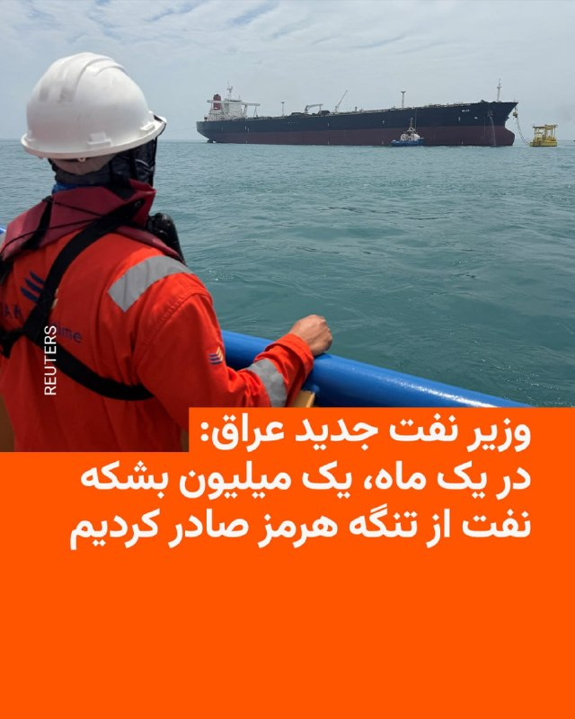

🔸وزیر نفت جدید عراق، روز شنبه ۲۶ اردیبهشت در یک کنفرانس مطبوعاتی اعلام کرد که این کشور در ماه آوریل (۱۲ فروردین تا ۱۰ اردیبهشت) ۱۰ میلیون بشکه نفت از طریق تنگه هرمز صادر کرده است.

🔸باسم محمد هم‌چنین گفت که کشورش قصد دارد برای افزایش ظرفیت تولید و صادرات کشور با اوپک همکاری کند و افزود که بغداد قصد دارد به ظرفیت تولید پنج میلیون بشکه در روز برسد.

🔸بغداد پیش از این اعلام کرده بود که با ایالات متحده و ایران به «تفاهماتی» مبنی بر کاهش پیامدهای محاصره تنگه هرمز بر صادرات نفت عراق دست یافته است.

🔸مقامات عراقی اوایل ماه آوریل اعلام کرده بودند که این کشور با از سرگیری صادرات نفت ۲۵۰ هزار بشکه در روز از طریق بندر جیحان ترکیه، صادرات نفت خام را با استفاده از کامیون‌های نفتکش از طریق سوریه آغاز کرده است.

@RadioFarda

## IranianMinds — post 20235

🔴نیویورک‌تایمز:

آمریکا و اسرائیل احتمالأ هفته آینده به ایران حمله خواهند کرد.

بعضی از رسانه‌ها هم احتمال حمله را تا ۲۴ ساعت آینده تخمین می‌زنند.

@IranianMinds

## IranianMinds — post 20234

🔴جسی واترز، مجری فاکس‌نیوز:

ترامپ در حال آماده شدن برای دور جدیدی از حملات به ایران است.

@IranianMinds

## IranianMinds — post 20233

  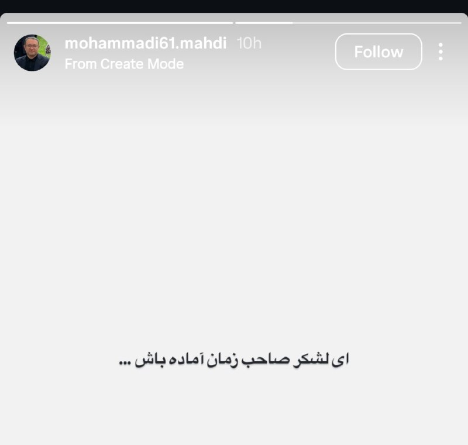

🔴استوری مشاور قالیباف😂

@IranianMinds

## IranianMinds — post 20232

  

🔴۱۹ روز قبل از سقوط رژیم جنایتکار قذافی، به دست مجریان تلویزیون اسلحه داده بودند.

@IranianMinds

## IranianMinds — post 20231

🔴کانال ۱۲ اسرائیل:

جنگ سوم با ایران نزدیک است.

@IranianMinds

## IranianMinds — post 20230

  <a href="telegram/content/IranianMinds_20230_1778931499.mp4" target="_blank">🎬 Download video</a>

وسط پخش زنده میاد یادشون‌ میده چطوری شلیک کنن

@IranianMinds

## IranianMinds — post 20228

  <a href="telegram/content/IranianMinds_20228_1778931501.mp4" target="_blank">🎬 Download video</a>

🔴 تروریستارو

صداوسیما اومده اسلحه داده دست تمام مجریاش که بیان تو پخش زنده رجز‌ بخونن و تهدید کنن

@IranianMinds

## IranianMinds — post 20227

  <a href="telegram/content/IranianMinds_20227_1778931502.webm" target="_blank">🎬 Download video</a>

🎉 ۵۰۰٬۰۰۰ تومان رایگان-بونوس ویژه ثبت‌نام

🔥 با هر ثبت نام ۵۰۰ هزار تومن جایزه بگیرید

⬅️ شرط‌بندی کنید و بونوس را به موجودی واقعی تبدیل کنید

🔥 وقتشه بازی رو یه جور دیگه ببینی
⚽️  پوشش کامل مسابقات ورزشی 

📊  پیش‌بینی با بهترین ضرایب 

⚡️  تجربه سریع و حرفه‌ای

😀 پرداخت مستقیم و سریع بدون واسطه، بدون دردسر، واریز و برداشت در سریع‌ترین زمان ممکن 

😀 کانال تلگرام: 

🔴 @winro_io  

😀 هدیه خود را با ثبت نام در سایت دریافت کنید: 

🔴 Winro.io
r26
سایت اصلی در روزهای آینده بازگشایی خواهد شد 
✅

## IranianMinds — post 20225

بعضیا انگار‌ تو یه ایران دیگه زندگی‌ میکنن

@IranianMinds

## BBCPersian — post 281209

سخنگوی وزارت کشور ایران در نشست خبری روز ۲۶ اردیبهشت گفت: شعارهای تند بعضی در میادین درباره بی‌حجابی،سیاست رسمی نظام و حاکمیت نیست.

علی زینی‌وند گفت: «سیاست کلی نظام جلوگیری قاطع از هر شعار، سخنرانی و اقدامی است که باعث اختلال در انسجام کشور شود.»

پس از اظهارات چهره‌هایی چون امام جمعه رشت که زنان بی‌حجاب را «همراستا با اسکتبار جهانی» خواند، در یکی از تجمع‌های شبانه از زنان کم‌حجاب حاضر به عنوان «نورچشم» یاد شد. 

حجاب اجباری از اصولی است که حکومت ایران برای حفظ آن هزینه‌های بسیاری را کرده و زنان در ایران برای رعایت حجاب اجباری تحت فشار‌های بسیاری بوده‌اند.

بعد از کشته شدن مهسا امینی در بازداشت گشت ارشاد و شکل گرفتن اعترضات سراسری «زن، زندگی، آزادی» که منجر به کشته شدن بسیاری از معترضان شد، گشت ارشاد دیگر به طور رسمی فعالیتی نداشت. گرچه همچنان گزارش‌هایی از بازداشت زنان به دلیل عدم رعایت حجاب اجباری منتشر شد.

حکومت ایران پیش از این هم از زنانی که بدون حجاب اجباری در مراسم حکومتی شرکت می‌کنند، به عنوان نشانه‌ای از «وحدت بین اقشار مختلف مردم برای حفظ نظام» استفاده کرده است.
@BBCPersian

## BBCPersian — post 281208

🔻عضو هیئت رئيسه مجلس: تشکیل ستاد ویژه فضای مجازی خلاف قانون است

علیرضا سلیمی، عضو هیئت رئيسه مجلس ایران، تشکیل ستاد ویژه فضای مجازی از سوی مسعود پزشکیان را «خلاف قانون برنامه هفتم» و «مغایر با سیاست‌های کلی نظام» خواند.

آقای سلیمی گفت: «با توجه به اینکه شورای عالی فضای مجازی و مرکز ملی فضای مجازی نیز هر دو وجود دارند و وظایف آنها کاملاً روشن است، چگونه ممکن است رئیس‌جمهور که خود رئیس شورای عالی فضای مجازی است، اختیارات مربوط به شورا را به ستادی خارج از شورا واگذار کند؟»

تشکیل ویژه فضای مجازی پیش از این هم با انتقادهایی همراه بوده است. مصطفی پوردهقان، دبیر دوم کمیسیون صنایع و معادن مجلس، تشکیل این ستاد را اقدامی «تزئینی» خوانده و گفته بود که «این تصمیم‌ها بیشتر جنبه روانی دارد و قرار نیست تغییر مشخصی ایجاد شود.»

آقای پزشکیان چند روز پیش از تشکیل ستادی ویژه برای ساماندهی فضای مجازی خبر داد و محمدرضا عارف، معاون اول خود، را به سمت رئیس این ستاد انتخاب کرد.

در حکم آقای پزشکیان بر «حکمرانی یکپارچه» در فضای مجازی و پایان دادن به «چندصدایی» و جلوگیری از «موازی‌کاری» میان نهادهای مسئول تأکید شده است.

این ستاد در حالی تشکیل شده است که اینترنت در بیش از ۷۰ روز گذشته یعنی از زمان شروع جنگ آمریکا و اسرائیل با ایران عملا قطع است.

https://bbc.in/4tEavKe
@BBCPersian

## BBCPersian — post 281207

🔻مهدی چمران، رئیس شورای شهر تهران، درباره تمدید رایگان شدن اتوبوس و مترو در پایتخت گفت کار احساسی نمی‌توان انجام داد و قرار نیست تمدید شود.

او در گفت‌وگو با باشگاه خبرنگاران جوان گفت اجرای چنین تصمیمی نیازمند ارائه طرح یا لایحه است، اما تاکنون هیچ‌یک از این دو به شورای شهر ارائه نشده است.

اتوبوس‌های درون‌شهری در تهران اولین‌بار نهم اسفند ۱۴۰۴ و به دنبال شروع جنگ و مترو از ۲۴ اسفند رایگان شد. پس از آن شورای شهر بصورت هفتگی این طرح را تمدید کرد.

پرویز سروری، نایب رئیس شورای شهر تهران پنجم اردیبهشت در تلویزیون ایران اعلام کرد: براساس برنامه‌ریزی صورت گرفته قرار است اتوبوس و مترو با تصویب شورای اسلامی شهر تهران برای همیشه رایگان شود.
او گفت در حال برنامه‌ریزی با نمایندگان و مدیریت شهرداری هستیم تا امکان دائمی‌شدن خدمات رایگان مترو و اتوبوس در تهران انجام شود.

https://bbc.in/4dNI8o4

@BBCPersian

## BBCPersian — post 281206

🔻بنابر گزارش‌ها وزارت دادگستری آمریکا در نظر دارد در روزهای آینده علیه رائول کاسترو، رهبر سابق کوبا، اعلام جرم کند. این پرونده به سرنگونی دو هواپیما با پدافند هوایی کوبا در سال ۱۹۹۶ مربوط می‌شود که در جریان آن چهار نفر کشته شدند. این هواپیماها متعلق به گروه…

## BBCPersian — post 281205

  

🔻بنابر گزارش‌ها وزارت دادگستری آمریکا در نظر دارد در روزهای آینده علیه رائول کاسترو، رهبر سابق کوبا، اعلام جرم کند.

این پرونده به سرنگونی دو هواپیما با پدافند هوایی کوبا در سال ۱۹۹۶ مربوط می‌شود که در جریان آن چهار نفر کشته شدند.

این هواپیماها متعلق به گروه تبعیدی آمریکایی «برادران برای نجات» بود؛ گروهی که خود را نهادی حقوق بشری توصیف می‌کند که هدفش کمک به قایق‌های مهاجرانی است که از کوبا فرار می‌کنند. این گروه قبلا در نزدیکی سواحل کوبا اقدام به پخش اعلامیه‌های ضد دولت کاسترو کرده بود.

دولت کوبا در زمان سرنگونی این هواپیماها مدعی شده بود که هواپیماها حریم هوایی این کشور را نقض کرده‌اند، اما سازمان بین‌المللی هوانوردی غیرنظامی اعلام کرد که حمله در آب‌های بین‌المللی رخ داده است.

به گفته مقام‌های آمریکایی، کیفرخواست احتمالی ممکن است از هفته آینده و پس از تأیید هیئت منصفه صادر شود. این اقدام بخشی از فشارهای فزاینده واشنگتن علیه کوبا ارزیابی می‌شود. فشاری که تحریم‌ها و محدودیت‌های نفتی را شامل می‌شود.

📸Getty Images
@BBCPersian

## BBCPersian — post 281204

🔻اسرائیل از موج تازه حملات علیه مواضع حزب‌الله خبر داد

ارتش اسرائیل می‌گوید که موج تازه‌ای از حملات هوایی را علیه مواضع حزب‌الله در جنوب لبنان آغاز کرده است.

ارتش اسرائیل پیش‌تر به ساکنان چندین منطقه در جنوب لبنان دستور تخلیه داده بود.

این حملات جدید یک روز پس از آن انجام شد که نمایندگان اسرائیل و لبنان در نشستی در واشنگتن، آتش‌بس شکننده جاری را برای ۴۵ روز دیگر تمدید کردند.

پیش‌تر، مقام‌های لبنانی اسرائیل را متهم کردند که عمداً مراکز درمانی را هدف قرار داده است.

وزارت بهداشت لبنان اعلام کرد که اسرائیل یک مرکز امدادرسانی را هدف حمله قرار داده که در نتیجه آن شش نفر، از جمله سه امدادگر، کشته شدند.

اما اسرائیل هدف قرار دادن نیروهای امدادی و پزشکی را رد کرد.

https://bbc.in/4uQiCnV
@BBCPersian

## BBCPersian — post 281203

  

🔻ساعاتی پس از آنکه دونالد ترامپ گفت که هنوز در مورد فروش سلاح به تایوان تصمیم نگرفته است، رئیس‌جمهور تایوان بر اهمیت و لزوم این موضوع تاکید کرده است.

سخنگوی رئیس‌جمهور تایوان گفت که فروش تسلیحات آمریکا به تایوان نه تنها تعهدی حقوقی است، بلکه همواره یک عامل بازدارنده مشترک علیه تهدیدهای منطقه‌ای بوده است.

این موضعگیری تایوان پس از دیداردونالد ترامپ و همتای چینی‌اش شی‌ جین‌پینگ است که در آن رهبر چین هشدار داد که «مدیریت نامناسب» مساله تایوان می‌تواند به درگیری یا جنگ مستقیم بینجامد.

چین تایوان را یک استان متمرد خود می‌داند و امکان استفاده از زور برای تحت کنترل درآوردن آن را رد نکرده است.

واشنگتن بر اساس «قانون روابط با تایوان» موظف است برای این جزیره سلاح فراهم کند.

📷Getty Images
@BBCPersian

## BBCPersian — post 281202

🔻وزیر نفت عراق: در ماه قبل ۱۰ میلیون بشکه نفت از طریق تنگه هرمز صادر کردیم

وزیر جدید نفت عراق امروز اعلام کرد که این کشور در ماه آوریل ۱۰ میلیون بشکه نفت از طریق تنگه هرمز صادر کرده است.

باسم محمد که در یک نشست خبری صحبت می‌کرد، همچنین گفت که عراق قصد دارد برای افزایش ظرفیت تولید و صادرات نفت خود با اوپک همکاری و رایزنی کند.

به گفته آقای محمد، بغداد در تلاش است تا ظرفیت تولید نفت عراق را به روزانه ۵ میلیون بشکه برساند.

@BBCPersian

## BBCPersian — post 281201

  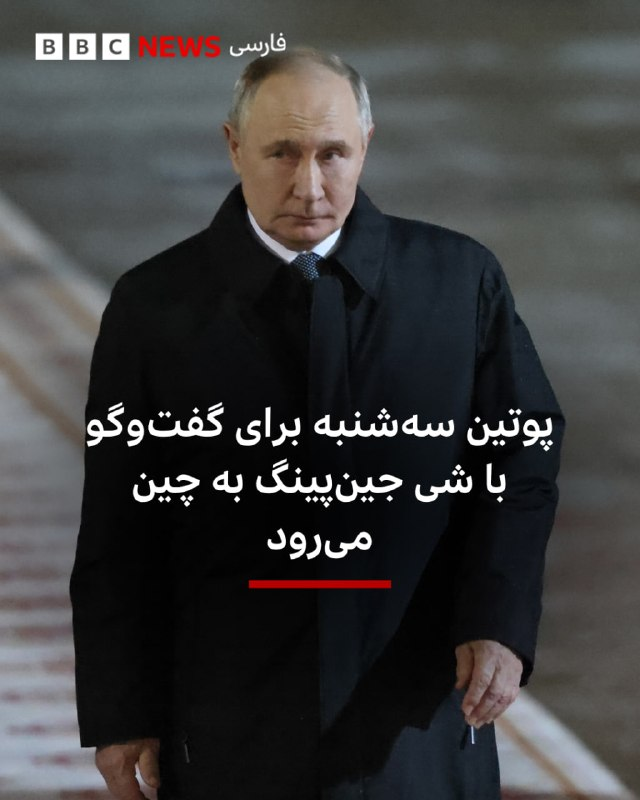

🔻کرملین روز شنبه اعلام کرد که ولادیمیر پوتین، رئیس‌جمهور روسیه ۱۹ مه /۲۹ اردیبهشت برای یک سفر دو روزه به چین خواهد رفت. این سفر در پی سفر دونالد ترامپ، رئیس‌جمهور آمریکا به پکن انجام می‌شود.

بر اساس بیانیه کرملین آقای پوتین در این سفر با شی جین‌پینگ، همتای چینی خود، درباره «مشارکت‌ همه‌جانبه و همکاری راهبردی» مسکو و پکن گفت‌وگو خواهد کرد.

به گفته کرملین رهبران دو کشور همچنین درباره «موضوعات مهم بین‌المللی و منطقه‌ای تبادل نظر خواهند کرد» و در پایان مذاکرات، یک بیانیه مشترک امضا خواهند کرد.

در جریان این سفر، آقای پوتین قرار است درباره همکاری‌های اقتصادی و تجاری با لی چیانگ، نخست‌وزیر چین، هم گفت‌وگو کند.

اعلام این سفر در حالی صورت گرفته است که آقای ترامپ دیروز سفر خود به چین را به پایان رساند و به آمریکا بازگشت.

چین که بزرگ‌ترین خریدار سوخت‌های فسیلی روسیه است، پس از اعمال تحریم‌های غرب علیه نفت و گاز روسیه، به مهم‌ترین شریک اقتصادی مسکو تبدیل شده است.

📷Getty Images
@BBCPersian

## idfinfarsi — post 11589

ارتش اسرائیل و شین‌بت عزالدین حداد را به هلاکت رساندند - رئیس شاخه نظامی سازمان تروریستی حماس و از آخرین مقامات ارشد این سازمان که کشتار خونین ۷ اکتبر را پیش بردند

سخنگوی ارتش اسرائیل و سخنگوی شین‌بت اعلام می‌کنند که در یک حمله دقیق دیروز (جمعه) در محدوده شهر غزه، تروریست عزالدین حداد - رئیس شاخه نظامی سازمان تروریستی حماس و از معماران کشتار ۷ اکتبر به هلاکت رسید.

حداد پس از به هلاکت رسیدن محمد سنوار به این سمت منصوب شد و در طول دوره اخیر برای بازسازی توانمندی‌های شاخه نظامی سازمان تروریستی فعالیت کرد و همچنین به برنامه‌ریزی طرح‌های تروریستی متعدد علیه شهروندان اسرائیل و نیروهای ارتش اسرائیل پرداخت.

در طول جنگ، حداد در نگهداری بسیاری از ربوده شدگان اسرائیلی در اسارت حماس دخیل بود. همچنین حداد سازوکار نگهداری ربوده شدگان را اداره کرد و خود را با اسیران اسرائیلی احاطه کرد به‌منظور جلوگیری از به هلاکت رسیدنش.

حداد یکی از باسابقه‌ترین فرماندهان در این سازمان است که در دوره تأسیس آن به صفوف آن پیوست و از نزدیک‌ترین افراد به رهبری حماس بود. در طول دوره حضور خود در سازمان، حداد نقش مرکزی در حاکمیت تروریستی داشت و مجموعه‌ای از مناصب کلیدی از جمله فرمانده تیپ شهر غزه و فرمانده واحدهای دیگر را بر عهده داشت.

حداد از آخرین فرماندهان ارشد در شاخه نظامی حماس است که بر برنامه‌ریزی و اجرای کشتار ۷ اکتبر و بر مدیریت جنگ علیه نیروهای ارتش اسرائیل فرماندهی کردند. به هلاکت رسیدن او به به هلاکت رسیدن بسیاری از مقامات ارشد حماس در طول جنگ اضافه می‌شود.

## Dirty_Kids — post 389553

  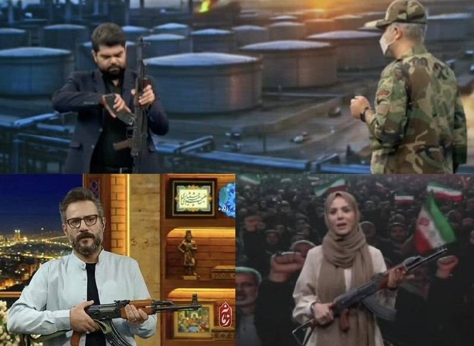

به اونایی که می‌گفتن تو کوله سرباز خارجی آزادی پیدا نمی‌شه بگید مجری‌های صداوسیما واستون اسلحه کشیدن.

@Dirty_Kids 👻

## Dirty_Kids — post 389552

بمونم خونه overthink ميكنم، برم بيرون overpay.

@Dirty_Kids 👻

## Dirty_Kids — post 389551

  <a href="telegram/content/Dirty_Kids_389551_1778931506.mp4" target="_blank">🎬 Download video</a>

مامانم وقتی میگم از عمه خبری نیست:

@Dirty_Kids 👻

## Dirty_Kids — post 389550

  <a href="https://t.me/Dirty_Kids/389550" target="_blank">📎 Download file</a>

✅ اپلیکیشن اندروید سایت جهانی دربی بت

💰اولین سایت جهانی با امکان شارژ و برداشت ریالی(کارت به کارت)

🔗 برای ورود فیلترشکن روی کشور مناسب قرار دهید مانند فنلاند و المان و....

😀Telegram Channel
👇
https://t.me/+bcynkEgSW2dlYTc0

## Dirty_Kids — post 389549

  

😤دنبال یه سایت شرط بندی بین المللی بودی که به ایرانیا خدمات بده؟!
⛔

👍دربی بت همون انتخاب  100%

💎ویژگی های سایت جهانی Derby Bet:

⬅️امکان شارژ امن با کارت بانکی

⬅️واریز اول دوبل شارژ می شوید(بونوس۱۰۰٪)

⬅️پر اپشن ترین سایت فعال در ایران

⬅️تسویه حساب کمتر از 5 دقیقه

⬅️برگشت بخشی از باخت به صورت هفتگی

🚨کد هدیه ثبت نام:GG007

⚠️برای دانلود اپلکیشن کلیک کنید
👉

🔔کانال دربی بت :

🪙https://t.me/+bcynkEgSW2dlYTc0

## Dirty_Kids — post 389548

  

#کص_فدا 😂😂😂😂
فاکتور داره میکنه بره پولشو بگیره

@Dirty_Kids 👻

## Dirty_Kids — post 389547

‏لیست مشاغل باقی مانده در ایران :
کانفیگ فروش
عرق فروش
آدم فروش
اسنپ
تریاک فروش

بقیه هم نشستن همو نگاه میکنن …

@Dirty_Kids 👻

## Dirty_Kids — post 389546

  <a href="telegram/content/Dirty_Kids_389546_1778931510.mp4" target="_blank">🎬 Download video</a>

🔴 توی انگلیس وقتی یه پیرمرد بالاخره به رویاش رسید و یه خانم زیبا رو بوس کرد، از شدت هیجان و شادی بیهوش شد و کارش به بیمارستان کشید.

@Dirty_Kids 👻

## Dirty_Kids — post 389545

  

بادبان با همراهی شما 50 هزار نفری شد
🎉

🛡فروش سرویس جدید با کاهش قیمت تا گیگی 200 هزار تومان باز شد
🛒

🎊کد تخفیف 100 هزار تومانی بادبان فعال بوده و میتونید برای خرید اولتون ازش استفاده کنید

BadBan4k : کد تخفیف

🚀همچنین میتونید با معرفی بادبان از طریق لینک معرفی به دوستان 10 درصد از مبلغ تمام خرید هاشون رو در کیف پولتون داشته باشید
R26
وقتی بادبان داری، هیچ بادی مانع نیست… با ما راه بازه حتی وقتی اینترنت ملیه!

⛵️@BadBan_VPN | کانال 

🤖@BadBan_VPNBot | ربات 

📞@BadBan_VPNSupport | پشتیبانی

## Dirty_Kids — post 389543

پاسداران سپاه اسلام هستند که خیلی شیک با دیدن اولین اسلحه دست طرف مقابل تسلیم شدند:)

تجهیزات این نیروهای ویژه سپاه در یک عملیات واقعی هم جالب است
حتی تجهیزات غواصی هم مخصوص عملیات نیروی ویژه نیست
گفته شده بود اینها روی لنج بودند ولی با توجه به عکس به نظر روی یک قایق تندرو بودند و حتی پیش از آغاز عملیات خفت شدند
با این حساب پاشون بوبیان هم نرسیده

@Dirty_Kids 👻

## Dirty_Kids — post 389542

  

کجای دنیا دیدید کلاشینکف ببرند توی استودیو تلوزیون آموزش بدن اونهم با تیر واقعی و شلیک کنند به سقف استودیو،جز طویله صداوسیمای رژیمی که صدای نفسهای سقوط رو میشنوه @Dirty_Kids 👻

## Dirty_Kids — post 389541

  <a href="telegram/content/Dirty_Kids_389541_1778931513.mp4" target="_blank">🎬 Download video</a>

کجای دنیا دیدید کلاشینکف ببرند توی استودیو تلوزیون آموزش بدن اونهم با تیر واقعی و شلیک کنند به سقف استودیو،جز طویله صداوسیمای رژیمی که صدای نفسهای سقوط رو میشنوه

@Dirty_Kids 👻

## Dirty_Kids — post 389539

  <a href="telegram/content/Dirty_Kids_389539_1778931515.mp4" target="_blank">🎬 Download video</a>

🔴 دیشب صداوسیما اسلحه داده بود دست مجریاش تا برای دشمن رجز بخونن و تهدید کنن!

+ بوی سقوط و ضعف مساویس با دست‌وپای بیشتر

@Dirty_Kids 👻

## Hranews — post 112968

  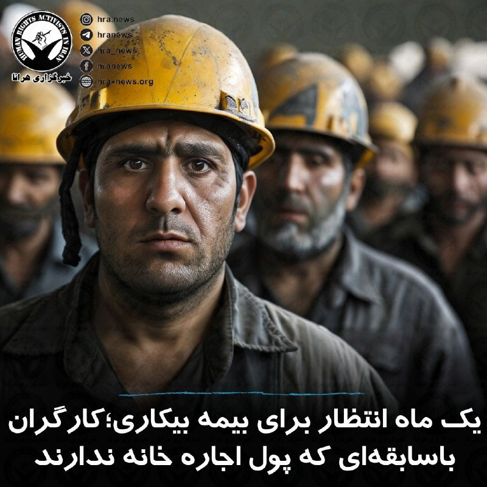

خبرگزاری کار ایران در گزارشی نوشت: در روزهایی که #بیکاری فشار بی‌سابقه‌ای بر زندگی کارگران وارد کرده، مراجعه به واحد شمال‌شرق اداره کار تهران بیش از هر چیز روایت انسان‌هایی است که میان امید و ناامیدی سرگردان مانده‌اند. جایی که باید پناهگاه کارگران بیکار باشد، امروز با انباشت پرونده‌ها و تأخیرهای طولانی در رسیدگی مواجه است؛ به‌طوری‌که شکایت‌های ثبت‌شده از اسفندماه سال گذشته همچنان بلاتکلیف باقی مانده‌اند.

در میان این انتظارهای طولانی، صدای #کارگران بیش از هر آمار و گزارشی شنیده می‌شود. یکی از آن‌ها با چشمانی خسته می‌گوید: «از کار بیکارم کردند، با هزار امید آمدم تا دست‌کم بیمه بیکاری‌ام برقرار شود و شرمنده صاحب‌خانه نشم… یک ماهه هر بار میام میگن در دست بررسیه.» کارگر دیگری که ۱۵ سال در یک کارخانه کار کرده، با تلخی اضافه می‌کند: «همه جوانی‌م رو اونجا گذاشتم، آخرش گفتن به مشکل خوردیم، نیازی به شما نیست… حالا یک ماهه فقط دارم می‌دوم دنبال بیمه بیکاری، بی‌جواب.»

در کنار این روایت‌ها، پرونده‌هایی دیده می‌شود که از اواخر فروردین ثبت شده‌اند اما هنوز در وضعیت «در دست بررسی» باقی مانده‌اند؛ در حالی که بسیاری از این کارگران با اجاره‌خانه عقب‌افتاده، بدهی و بیکاری ناگهانی دست‌وپنجه نرم می‌کنند.

↘️
@hranews_bot تماس ✉️ - @Hranews کانال هرانا 🆑

## Hranews — post 112967

دادگاه تجدیدنظر؛ امیر رحیمی، معلم به حبس محکوم شد

❗️
❗️
❗️
❗️
❗️– امیر رحیمی، معلم محبوس در زندان شهرستان درود و از بازداشت شدگان اعتراضات دی ماه ۱۴۰۴، توسط دادگاه تجدیدنظر استان لرستان به چهار سال حبس محکوم شد.

#امیر_رحیمی

ادامه مطلب
↘️
@hranews_bot تماس ✉️ - @Hranews کانال هرانا 🆑

## Hranews — post 112966

گزارشی از بازداشت صباح بیواره در پیرانشهر

❗️
❗️
❗️
❗️
❗️– صباح بیواره، شهروند اهل پیرانشهر روز پنجشنبه ۲۴ اردیبهشت ماه، توسط نیروهای امنیتی در این شهرستان بازداشت شده و کماکان از محل نگهداری وی اطلاعی حاصل نشده است.

#صباح_بیواره

ادامه مطلب

↘️
@hranews_bot تماس ✉️ - @Hranews کانال هرانا 🆑

## Hranews — post 112965

اموال ۵۱ شهروند در استان یزد توقیف شد

❗️
❗️
❗️
❗️
❗️– دارایی‌ها و اموال ۵۱ شهروند در استان یزد مصادره شد. دستگاه قضایی این افراد را متهم به «همکاری با دشمن» دانسته است. ۲۰ تن از این شهروندان در داخل کشور و ۳۱ نفر دیگر در خارج از ایران سکونت دارند.

ادامه مطلب

↘️
@hranews_bot تماس ✉️ - @Hranews کانال هرانا 🆑

## Hranews — post 112964

  

با پایان دوران محکومیت؛ فهیمه سلطانی آزاد شد

خبرگزاری هرانا – فهیمه سلطانی، زندانی سیاسی محبوس در زندان دستگرد اصفهان، با پایان دوران محکومیت آزاد شد.

به گزارش خبرگزاری هرانا، ارگان خبری مجموعه فعالان حقوق بشر در ایران، فهیمه سلطانی آزاد شد.

بر اساس اطلاعات دریافتی هرانا، آزادی خانم سلطانی در تاریخ ۱۸ اردیبهشت ماه، با پایان دوران محکومیت وی از زندان دستگرد اصفهان صورت گرفته است.

#فهیمه_سلطانی

ادامه مطلب

↘️
@hranews_bot تماس ✉️ -  @Hranews  کانال هرانا 🆑

## Hranews — post 112963

گزارشی از بازداشت یک شهروند در ارومیه

❗️
❗️
❗️
❗️
❗️– فروزان نوجوان (اسلامی)، مدرس زبان انگلیسی و اهل ارومیه، روز چهارشنبه ۲۳ اردیبهشت ماه، توسط نیروهای امنیتی در این شهرستان بازداشت و به مکان نامعلومی منتقل شد.

#فروزان_نوجوان
#فروزان_اسلامی

ادامه مطلب

↘️
@hranews_bot تماس ✉️ -  @Hranews  کانال هرانا 🆑

## Hranews — post 112962

  

بر اساس آخرین داده‌های نت‌بلاکس، قطع #اینترنت در ایران وارد هفتادوهشتمین روز خود شده و اکنون دوازدهمین هفته از این اختلال گسترده سپری می‌شود. این نهاد ناظر بر وضعیت دسترسی به اینترنت در جهان اعلام کرد که تداوم این وضعیت، بخش عمده‌ای از جمعیت حدود ۹۰ میلیونی کشور را برای مدتی بی‌سابقه از دسترسی به اینترنت جهانی محروم کرده است.

نت‌بلاکس همچنین تاکید کرده است که ادامه این محدودیت‌ها به‌طور گسترده حقوق بشر، آزادی‌های اساسی و وضعیت اقتصادی شهروندان را تحت تاثیر قرار داده و پیامدهای آن در ابعاد مختلف همچنان رو به گسترش است.

↘️
@hranews_bot تماس ✉️ -  @Hranews  کانال هرانا 🆑

## Hranews — post 112961

یک شهروند توسط نیروهای امنیتی در سرابله بازداشت شد

❗️
❗️
❗️
❗️
❗️– محمدرضا فریادی، شهروند اهل سرابله روز چهارشنبه ۲۳ اردیبهشت ماه، توسط نیروهای امنیتی در این شهرستان بازداشت و به مکان نامعلومی منتقل شده است.

#محمدرضا_فریادی

ادامه مطلب

↘️
@hranews_bot تماس ✉️ -  @Hranews  کانال هرانا 🆑

## manototv — post 105511

  <a href="telegram/content/manototv_105511_1778931519.mp4" target="_blank">🎬 Download video</a>

کریس رایت، وزیر انرژی آمریکا گفته است انتظار دارد تنگه هرمز «حداکثر تا مقطعی در تابستان» بازگشایی شود.

رایت همچنین گفت اگر ایران به «گروگان گرفتن اقتصاد جهان» ادامه دهد، ارتش آمریکا می‌تواند برای بازگشایی تنگه هرمز مداخله کند.

## manototv — post 105510

  <a href="telegram/content/manototv_105510_1778931520.mp4" target="_blank">🎬 Download video</a>

در برنامه‌های شامگاه گذشته تلویزیون جمهوری اسلامی، بخش‌هایی با محور آموزش کار با سلاح پخش شد.

در این برنامه‌ها، مجریان یا کارشناسان حاضر در استودیو، شیوه گرفتن و استفاده از سلاح را توضیح دادند. پخش چنین محتوایی از تلویزیون حکومتی در شرایطی صورت می‌گیرد که رسانه‌های وابسته به جمهوری اسلامی در هفته‌های اخیر بر ادبیات نظامی، آمادگی دفاعی و بسیج حامیان خود تاکید بیشتری داشته‌اند.

## manototv — post 105509

  <a href="telegram/content/manototv_105509_1778931521.mp4" target="_blank">🎬 Download video</a>

‌
«دریک»، رپر، خواننده و بازیگر کانادایی، در یکی از قطعه‌های تازه خود با نام «Don’t Worry» به دختری ایرانی اشاره کرده که فارسی حرف می‌زند. این قطعه در آلبوم تازه او منتشر شده است. در متن ترانه نیز بندی آمده که در آن زن مورد اشاره خود را ایرانی معرفی می‌کند که فارسی حرف می‌‌زند.

دریک با نام کامل «آبری دریک گراهام» زاده تورنتو است و پیش از ورود جدی به موسیقی، با بازی در مجموعه تلویزیونی نوجوانانه «دگراسی، نسل بعدی» شناخته شد. او سپس به یکی از چهره‌های اصلی موسیقی هیپ‌هاپ و پاپ معاصر تبدیل شد و سبک ترکیبی او میان رپ‌خوانی و خوانندگی، جایگاه گسترده‌ای در بازار جهانی موسیقی برایش به همراه آورد.

## manototv — post 105508

  <a href="telegram/content/manototv_105508_1778931523.mp4" target="_blank">🎬 Download video</a>

گروه ناظر اینترنتی نت‌بلاکس اعلام کرد خاموشی دیجیتال در ایران اکنون وارد دوازدهمین هفته و هفتادوهشتمین روز خود شده است.
نت‌بلاکس می‌گوید این قطع اینترنت که یک کشور ۹۰ میلیونی را برای مدتی بی‌سابقه تا حد زیادی از دسترسی به اینترنت جهانی محروم کرده، همچنان در حال تضعیف حقوق بشر، اقتصاد و آزادی‌های اساسی در ایران است.

## manototv — post 105507

  <a href="telegram/content/manototv_105507_1778931523.mp4" target="_blank">🎬 Download video</a>

رسانه‌های عراقی گزارش دادند صدای انفجارهایی که روز شنبه در بغداد، پایتخت عراق شنیده شد، ناشی از شلیک گلوله‌های توپخانه به مناسبت تشکیل دولت جدید بوده است.
یک منبع امنیتی به خبرگزاری فرانسه گفت این شلیک‌ها همزمان با آغاز به کار دولت به ریاست نخست‌وزیر جدید عراق، علی الزیدی، انجام شده است.
پیش‌تر برخی رسانه‌ها از شنیده شدن چند انفجار در مرکز بغداد خبر دادند.

## alonews — post 120372

  <a href="telegram/content/alonews_120372_1778931524.webm" target="_blank">🎬 Download video</a>

👈 ارتش دفاعی اسرائیل اعلام کرده است که حملات به سایت‌های زیرساختی حزب‌الله در چندین منطقه در جنوب لبنان را آغاز کرده است

✅ @AloNews خبر جنگ

## alonews — post 120371

  <a href="telegram/content/alonews_120371_1778931525.webm" target="_blank">🎬 Download video</a>

👈دقایقی پیش وزیر کشور پاکستان برای دیدار با مقامات ایرانی، در سفری از پیش اعلام نشده وارد تهران شد

✅ @AloNews خبر جنگ

## alonews — post 120370

  <a href="telegram/content/alonews_120370_1778931525.webm" target="_blank">🎬 Download video</a>

👈رئیس کمیسیون امنیت ملی مجلس :
یه سیستم طراحی کردیم که رفت‌وآمد کشتی‌ها تو تنگه هرمز رو با یه مسیر مشخص کنترل کنیم و به‌زودی هم اعلامش می‌کنیم

✅ @AloNews خبر جنگ

## alonews — post 120369

  <a href="telegram/content/alonews_120369_1778931525.webm" target="_blank">🎬 Download video</a>

👈به گزارش کانال ۱۲ اسرائیل : ترامپ بزودی با اعضای کابینه خود جلسه اضطراری برای پایان دادن به اوضاع ایران برگزار میکند ، حمله و تقابل سوم قریب الوقوع و بسیار نزدیک است

✅ @AloNews خبر جنگ

## alonews — post 120368

  <a href="telegram/content/alonews_120368_1778931526.webm" target="_blank">🎬 Download video</a>

👈الجزیره: وزیر انرژی امارات می‌گوید خروج از اوپک یک «انتخاب استراتژیک مستقل» است

✅ @AloNews خبر جنگ

## alonews — post 120367

  <a href="telegram/content/alonews_120367_1778931526.webm" target="_blank">🎬 Download video</a>

👈از دقایقی قبل سوپراپلیکیشن بله با اختلال مواجه شده و کار نمی کنه

✅ @AloNews خبر جنگ

## alonews — post 120366

  <a href="telegram/content/alonews_120366_1778931526.webm" target="_blank">🎬 Download video</a>

👈فارس مدعی شد: یک نفتکش غول‌پیکر چینی که از تنگهٔ هرمز عبور کرده بود، خارج از خط محاصرهٔ آمریکا رویت شد.

🔴این نفتکش پیش از آغاز مذاکرات رئیس‌جمهور چین و ترامپ درحال عبور از مسیر تعیین‌شدهٔ ایران در تنگهٔ هرمز در کنار جزیرهٔ لارک دیده شده بود.

✅ @AloNews خبر جنگ

## alonews — post 120365

  <a href="telegram/content/alonews_120365_1778931527.webm" target="_blank">🎬 Download video</a>

👈ناو شارل دوگل فرانسه، خروجی خلیج عدن - ورودی دریای عرب دیده شده

✅ @AloNews خبر جنگ

## alonews — post 120364

  <a href="telegram/content/alonews_120364_1778931527.webm" target="_blank">🎬 Download video</a>

👈فرماندهی کل نیروی دفاعی بحرین : برای حمله احتمالی جمهوری اسلامی، تو آماده‌باش سطح بالا قرار داریم

✅ @AloNews خبر جنگ

## alonews — post 120362

  <a href="telegram/content/alonews_120362_1778931528.webm" target="_blank">🎬 Download video</a>

🔴فوری / شبکه فاکس نیوز: ارتش آمریکا درحال آماده شدن برای دور جدیدی از درگیری های نظامی در ایران است

✅ @AloNews خبر جنگ

## alonews — post 120361

  <a href="telegram/content/alonews_120361_1778931528.webm" target="_blank">🎬 Download video</a>

👈امارات مدعی شد: خروج از اوپک و اوپک‌پلاس نشانه اختلاف با شرکا نیست

✅ @AloNews خبر جنگ

## alonews — post 120360

  <a href="telegram/content/alonews_120360_1778931528.webm" target="_blank">🎬 Download video</a>

👈یک مقام مطلع نظامی به نورنیوز: در صورت وقوع جنگ، اهدافی که قبلاً مصون ماندند این‌بار در تیررس‌اند

✅ @AloNews خبر جنگ

## alonews — post 120359

  <a href="telegram/content/alonews_120359_1778931529.webm" target="_blank">🎬 Download video</a>

👈سی‌ان‌ان: مشاوران ترامپ خواهان پایان فوری جنگ هستند؛ فشار اقتصادی رای‌دهندگان را نگران کرده

✅ @AloNews خبر جنگ

## alonews — post 120358

  <a href="telegram/content/alonews_120358_1778931529.webm" target="_blank">🎬 Download video</a>

👈مهاجرانی: نگاه دولت به اینترنت دسترسی برابر برای همه شهروندان است!

✅ @AloNews خبر جنگ

## alonews — post 120357

  <a href="telegram/content/alonews_120357_1778931529.webm" target="_blank">🎬 Download video</a>

👈وزارت دفاع اسرائیل می‌خواد برد جنگنده‌های F-35I رو بیشتر کنه - DefNews

✅ @AloNews خبر جنگ

## alonews — post 120356

  <a href="telegram/content/alonews_120356_1778931530.mp4" target="_blank">🎬 Download video</a>

👈جنگنده‌های جدید "MiG-29" سوریه رسماً رفتن تو عملیات و دارن برای دفاع از حریم هوایی سوریه پرواز می‌کنن

✅ @AloNews خبر جنگ

## alonews — post 120355

  <a href="telegram/content/alonews_120355_1778931531.webm" target="_blank">🎬 Download video</a>

👈یک مقام ارشد اسرائیلی در گفتگو با کانال ۱۲ اسرائیل: تل‌آویو در حال آماده شدن برای یک جنگ چند روزه یا چند هفته‌ای با ایران است

✅ @AloNews خبر جنگ

## alonews — post 120354

  <a href="telegram/content/alonews_120354_1778931532.webm" target="_blank">🎬 Download video</a>

👈ترامپ: ۵ بار با ایران نزدیک توافق شدم، ولی روز بعدش زدن زیرش

✅ @AloNews خبر جنگ

## alonews — post 120353

  <a href="telegram/content/alonews_120353_1778931532.webm" target="_blank">🎬 Download video</a>

👈حدادی، عضو کمیسیون صنایع: گران شدن خودرو توجیه فنی ندارد/قیمت‌ها باید به قبل از جنگ بازگردد

✅ @AloNews خبر جنگ

## alonews — post 120351

<!-- MSG END -->

<!-- NAV START -->

<a href="https://github.com/miladsa74520/aio-downloader/blob/main/telegram/content/archive_1.md" style="display:inline-block; padding:6px 12px; margin:0 4px; background-color:#2ea44f; color:white; text-decoration:none; border-radius:4px; font-weight:bold;">صفحه بعد</a>

<!-- NAV END -->
