# خواننده تلگرام

<!-- TOP_NAV START -->

<a href="https://github.com/miladsa74520/aio-downloader/blob/main/telegram/content/archive_1.md" style="display:inline-block; padding:6px 12px; margin:0 4px; background-color:#2ea44f; color:white; text-decoration:none; border-radius:4px; font-weight:bold;">صفحه بعد</a>

<!-- TOP_NAV END -->

<!-- MSG START -->

---
📅 بروزرسانی: 1405/02/29 14:22
---

## VahidOOnLine — post 240939

  <a href="telegram/content/VahidOOnLine_240939_1779187975.mp4" target="_blank">🎬 Download video</a>

علیرضا رئیسی، معاون بهداشت وزارت بهداشت، اعلام کرد جمعیت ایران بر اساس آخرین آمار به ۸۶ میلیون و ۵۶۴ هزار نفر رسیده است.
به گفته او، از این تعداد ۴۳ میلیون و ۶۵۸ هزار نفر مرد و ۴۲ میلیون و ۹۰۶ هزار نفر زن هستند.
‌🏁 🇬🇧 ManotoTV

🤖 @VahidOOnLine

## VahidOOnLine — post 240938

  

الی کوهن، وزیر انرژی و عضو کابینه سیاسی-امنیتی اسرائیل، گفت: «رهبر جمهوری اسلامی پنهان شده و تحت فشار است. محاصره هرمز اقتصاد ایران را به سمت فروپاشی می‌برد و اگر تهران برنامه هسته‌ای را از سر بگیرد، اسرائیل حمله خواهد کرد.»

او افزود: «اسرائیل اجازه نخواهد داد جمهوری اسلامی به سلاح هسته‌ای نزدیک شود و برای حفظ برتری نظامی خود بیش از ۱۰۰ میلیارد دلار سرمایه‌گذاری خواهد کرد.»
‌🏁 🇬🇧 IranintlTV

🤖 @VahidOOnLine

## VahidOOnLine — post 240937

  

در ادامه لفاظی‌های تهدیدآمیز مقام‌های حکومت، محمد اکرمی‌نیا، سخنگوی ارتش جمهوری اسلامی، گفت در صورت حمله مجدد دشمن، «با ابزارها و شیوه‌های جدید، جبهه‌های جدیدی را علیه آنها خواهیم گشود».

او اضافه کرد: «جمهوری اسلامی محاصره‌پذیر و قابل شکست نیست.»
‌🏁 🇬🇧 IranintlTV

🤖 @VahidOOnLine

## VahidOOnLine — post 240936

  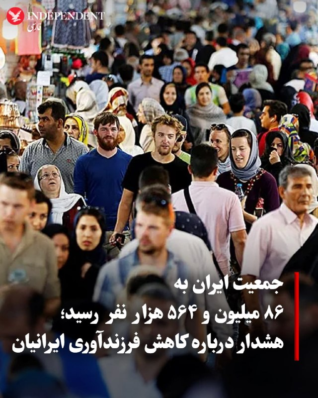

♦️ علیرضا رئیسی، معاون وزارت بهداشت دولت مسعود پزشکیان روز سه‌شنبه ۲۹ اردیبهشت اعلام کرد جمعیت ایران براساس آخرین سرشماری به ۸۶ میلیون و ۵۶۴ هزار نفر رسیده است.

این مقام دولتی با هشدار درباره سرعت گرفتن روند پیری جمعیت در سال گذشته اعلام کرد: «نسبت تولد به فوت در کشور که در سال ۱۴۰۳ معادل ۲.۱۴ بود، در سال ۱۴۰۴ به ۱.۹۸ سقوط کرده است. این یعنی اکنون به ازای هر دو فوتی، حتی دو تولد هم ثبت نمی‌شود.»
‌🇸🇦 Indypersian

🤖 @VahidOOnLine

## VahidOOnLine — post 240935

  <a href="telegram/content/VahidOOnLine_240935_1779187978.mp4" target="_blank">🎬 Download video</a>

ویدیوی ارسال‌شده به ایران‌اینترنشنال، شعارنویسی در حمایت از شاهزاده رضا پهلوی را روی یکی از دیوارهای شهر کیش نشان می‌دهد.
‌🏁 🇬🇧 IranintlTV

🤖 @VahidOOnLine

## VahidOOnLine — post 240934

  

♦️ ابراهیم عزیزی، رئیس کمیسیون امنیت ملی و سیاست خارجی مجلس شورای اسلامی روز سه‌شنبه ۲۹ اردیبهشت به خبرگزاری ایسنا گفت تنگه هرمز «برای همیشه در اختیار و مدیریت» ایران باقی می‌ماند و تا ابد یک اهرم اقتصادی، سیاسی، و نظامی تمام‌عیار» خواهد بود.

این سخنان در حالی عنوان می‌شود که جمهوری اسلامی ایران تلاش می‌کند حاکمیت خود را این آبراه راهبردی با اهمیت جهانی اعمال کند. جامعه جهانی، ازجمله کشورهای حاشیه جنوب خلیج فارس، اروپا، آمریکا و همچنین ترکیه خواستار بازگشایی فوری تنگه هرمز هستند و می‌گویند ایران حق ندارد بابت تردد کشتی‌ها، پول یا امتیازی بگیرد.
‌🇸🇦 Indypersian

🤖 @VahidOOnLine

## VahidOOnLine — post 240933

  <a href="telegram/content/VahidOOnLine_240933_1779187980.mp4" target="_blank">🎬 Download video</a>

بر پایه گزارش‌های منتشر شده حامد تیزرویان، فعال محیط زیست و عکاس شناخته شده بازداشت شده است. آقای تیزرویان ۱۴ اردیبهشت در ساری بازداشت شده و با وجود سپری شدن حدود دو هفته، از نهاد بازداشت کننده یا دلیل دستگیری او اطلاعی در دست نیست.
وسایل الکترونیکی از جمله تلفن همراه حامد تیزرویان هنگام بازداشت او ضبط شده است. حامد تیزرویان، عکاس حیات وحش و دانشجوی دکترای تنوع زیستی دانشگاه شهید بهشتی، پیش‌تر تصاویری کم‌نظیر از گونه‌های در معرض خطر انقراض از جمله خرس قهوه‌ای و مرال ثبت کرده است. او همچنین در ساخت دست‌کم ۱۰ پاسگاه محیط‌بانی در محدوده جنگل‌های هیرکانی مشارکت داشته و طی سال‌های گذشته در زمینه آموزش و آگاهی‌رسانی درباره حفاظت از محیط زیست، به‌ویژه جنگل‌های هیرکانی، فعالیت مستمر داشته است. فعالان محیط زیست نگران سرنوشت آقای تیزرویان هستند. صفحه اینستاگرام حامد تیزرویان نیز آذر سال گذشته، پس از انتشار مطالبی انتقادی درباره عملکرد مدیران دولتی در مهار آتش‌سوزی جنگل‌های الیمالات مازندران، برای چند روز مسدود شده بود.
‌🏁 🇬🇧 ManotoTV

🤖 @VahidOOnLine

## VahidOOnLine — post 240932

  

رسانه‌های ایران گزارش دادند حمید خانی، عضو پیشین سپاه پاسداران، در جریان ماموریت خنثی‌سازی بمب‌های عمل‌نکرده ناشی از حملات مشترک اسرائیل و آمریکا در تهران کشته شده است. بر اساس این گزارش‌ها، او به صورت داوطلبانه در بخش مهندسی قرارگاه خاتم‌الانبیا فعالیت می‌کرده است.

جزئیات بیشتری درباره زمان دقیق حادثه و نحوه وقوع آن منتشر نشده است.
‌🏁 🇬🇧 IranintlTV

🤖 @VahidOOnLine

## VahidOOnLine — post 240931

  

♦️ تدروس ادهانوم قبریسوس، رئیس سازمان جهانی بهداشت روز سه‌شنبه ۲۹ اردیبهشت اعلام کرد سرعت و ابعاد شیوع ویروس ابولا در کشور جمهوری دموکراتیک کنگو، بسیار نگران‌کننده است.

رئیس سازمان جهانی بهداشت در دومین روز مجمع عمومی کشورهای عضو این نهاد بین‌المللی گفت امروز برای بررسی وضعیت شیوع این بیماری یک کمیته فوق‌العاده تشکیل خواهد شد.

از هفته گذشته تاکنون دست‌کم ۱۰۳ نفر براثر ابتلا به سویه بوندیبوگیو ویروس ابولا در جمهوری دموکراتیک کنگو جان خود را از دست داده‌اند.

کارشناسان سازمان جهانی بهداشت می‌گویند واکسنی که برای سویه «زئیر» این ویروس در سال‌های قبل به‌کار گرفته شده بود، ممکن است در پیشگیری از گونه جدید موثر باشد.
‌🇸🇦 Indypersian

🤖 @VahidOOnLine

## VahidOOnLine — post 240930

  <a href="telegram/content/VahidOOnLine_240930_1779187982.mp4" target="_blank">🎬 Download video</a>

ویدیوی ارسال‌شده به ایران‌اینترنشنال، برگزاری مراسم عقد میان حامیان حکومت را در یکی از تجمع‌های حکومتی در تهران نشان می‌دهد.
‌🏁 🇬🇧 IranintlTV

🤖 @VahidOOnLine

## VahidOOnLine — post 240929

🗣روایت شما از بحران اقتصادی و زندگی در آتش‌بس- سه‌شنبه ۲۹ اردیبهشت:

🔹یک بسته برنج یک کیلویی، یک بسته بال مرغ، ۶ تا تخم‌مرغ و یه روغن کوچیک گرفتیم شد ۲ میلیون و ۱۰۰ هزار تومن.

🔹یارانه یک خانواده‌ ۳ نفره ۳ میلیون تومانه، اما یک روغن جامد ۵ کیلویی قیمتش ۳ میلیون و ۴۰۰ هزار تومانه.

🔹ما از دی ماه نه دانشگاه رفتیم نه خوابگاه ولی هر ماه شهریه خوابگاه رو باید بدیم. پدر من بازنشسته‌است، از کجا بیاریم آخه.

🔹صنعت گردشگری و هتلداری فرو پاشیده. ۴ ماهه حقوق نگرفتیم.

🔹برا ۵ تا نان لواش با یه کیسه پلاستیکی ۵۵ هزار تومان پرداختم. گرونی جوریه که اگه بیمار باشی، ناتوان باشی، یا برای یه سالمند بخواهی سفارش آنلاین بدی، مجبور به پرداخت مبلغ زیادی هستی.

🔹ما بازنشسته‌ها با این حقوق‌های پایین داریم له می‌شیم، حتی نمی‌تونیم به درمان خودمون برسیم.

🔹من پارسال بعد ازدواجم یه آپارتمان گرفتم با مبلغ ۸۰۰ میلیون رهن و ۱۰ میلیون تومان اجاره. امسال صاحبخانه گفته باید یک میلیارد و ۲۰۰ رهن بدی با ۲۵ میلیون تومان اجاره... کادر درمان هستم و موندم چکار کنم.

🔹قطعی برق شهرک‌های صنعتی تهران از ۲۶ اردیبهشت شروع شده. فعلا طبق برنامه مدیریت بار، یک روز در هفته از ساعت ۸ صبح تا ۱۲ شب!

🔹قطعی آب در زاهدان طولانی مدت شده و حتی به ۱۲ ساعت هم می‌رسه. زمان‌های قطعی هم متفاوته، یک‌بار صبح زود یک‌بار ظهر یک‌بار عصر.
‌🏁 🇬🇧 IranintlTV

🤖 @VahidOOnLine

## VahidOOnLine — post 240928

  <a href="telegram/content/VahidOOnLine_240928_1779187985.mp4" target="_blank">🎬 Download video</a>

نت‌بلاکس، نهاد ناظر بر دسترسی اینترنت، اعلام کرد ایران برای هشتاد و یکمین روز متوالی با قطعی گسترده اینترنت روبه‌رو است و این رخداد اکنون به طولانی‌ترین خاموشی اینترنتی ملی ثبت‌شده در یک کشور متصل به اینترنت تبدیل شده است.

بر اساس داده‌های نت‌بلاکس، دسترسی کاربران داخل ایران به اینترنت جهانی به‌شدت محدود مانده و ارتباطات دیجیتال کشور در سطحی بسیار پایین‌تر از وضعیت عادی قرار دارد.
‌🏁 🇬🇧 ManotoTV

🤖 @VahidOOnLine

## VahidOOnLine — post 240927

  

♦️محمد کاظم غریب‌آبادی، معاون وزیر امور خارجه جمهوری اسلامی روز سه‌شنبه ۲۹ اردیبهشت‌ماه گفت که خروج نیروهای نظامی آمریکا از «محیط پیرامونی ایران» یکی از شروط تهران برای مذاکره پایان جنگ با واشنگتن است.

به گزارش خبرگزای ایرنا، غریب‌آبادی در جریان دیدار با اعضای کمیسیون امنیت ملی مجلس شورای اسلامی در باره روند «مذاکرات با آمریکا» گفت: «تاکید بر حق غنی سازی و برخورداری جمهوری اسلامی ایران از حقوق هسته‌ای صلح‌آمیز، خاتمه جنگ در تمامی جبهه‌ها از جمله لبنان، رفع محاصره دریایی آمریکا، آزادسازی اموال و دارائی‌های ایران، تامین خسارت‌های وارد شده در جنگ تحمیلی توسط ایالات متحده جهت بازسازی، خاتمه تمامی تحریم‌های یکجانبه و قطعنامه‌های شورای امنیت ، خروج نیروهای آمریکایی از محیط پیرامونی جمهوری اسلامی ، از جمله محورها و چهارچوب‌هایی است که در پیشنهادهای اخیر ایران مطرح شده است.»

دونالد ترامپ گفته است آمریکا هیچ امتیازی به ایران نخواهد داد.
‌🇸🇦 Indypersian

🤖 @VahidOOnLine

## VahidOOnLine — post 240926

♦️ مادر جاویدنام متین پرویزی، یکی از هزاران جان‌باخته انقلاب ملی ایرانیان، تولد ۲۲ سالگی جگرگوشه‌اش را بر مزار او برگزار کرد.

در ویدیویی که از این مراسم در شبکه‌های اجتماعی منتشر شده، بی‌تابی وگریه‌های مادار داغدار متین بر سر مزارفرزندش که کیک تولدی به شکل نقشه ایران و سه رنگ پرچم ملی میهن روی آن قرار دارد و با شاخه‌های گل آراسته شده، دیده می‌شود. روی کیک جاویدنام شعار «فرزند ایران، جان فدای وطن» نوشته شده است.

متین پرویزی شامگاه ۱۸ دی‌ماه و در تظاهرات انقلاب ملی ایرانیان هدف گلوله سرکوبگران جمهوری اسلامی قرار گرفت و کشته شد.
‌🇸🇦 Indypersian

🤖 @VahidOOnLine

## VahidOOnLine — post 240925

  

نت‌بلاکس، نهاد مستقل پایش وضعیت اینترنت در جهان، سه‌شنبه ۲۹ اردیبهشت اعلام کرد قطع اینترنت در ایران اکنون به هشتاد و یکمین روز رسیده است.

نت‌بلاکس افزود: «هم‌زمان، حکومت در تلاش است کنترل دیجیتال خود را به سطح بین‌المللی گسترش دهد؛ از جمله با مطالبه کنترل کابل‌های سایر کشورها در تنگه هرمز و وادار کردن شرکت‌های بزرگ فناوری به تبعیت از قوانین جمهوری اسلامی.»
‌🏁 🇬🇧 IranintlTV

🤖 @VahidOOnLine

## VahidOOnLine — post 240924

  <a href="telegram/content/VahidOOnLine_240924_1779187987.mp4" target="_blank">🎬 Download video</a>

وزارت دفاع روسیه اعلام کرد نیروهای مسلح این کشور از سه‌شنبه ۲۹ اردیبهشت تا ۳۱ اردیبهشت رزمایش نیروهای هسته‌ای برگزار می‌کنند.

بر اساس این اعلام، بیش از ۶۴ هزار نیروی نظامی و ۷۸۰۰ قطعه تجهیزات نظامی در این رزمایش شرکت دارند و قرار است موشک‌های بالستیک و کروز از پایگاه‌های آزمایشی در خاک روسیه شلیک شوند.

این خبر هم‌زمان با افزایش تنش‌های امنیتی میان روسیه و غرب منتشر شده است. یک روز پیشتر نیز بلاروس اعلام کرد با مشارکت روسیه رزمایشی را برای تمرین جابه‌جایی و آماده‌سازی مهمات هسته‌ای برگزار می‌کند. بلاروس میزبان تسلیحات هسته‌ای تاکتیکی روسیه است، اما مسکو کنترل این تسلیحات را در اختیار دارد.
‌🏁 🇬🇧 ManotoTV

🤖 @VahidOOnLine

## VahidOOnLine — post 240923

  

مسعود پزشکیان، رییس دولت جمهوری اسلامی، در نشست با مدیران وزارت کار گفت: «برای غلبه بر آثار و پیامدهای ناشی از جنگ باید با تدبیر، برنامه‌ریزی و نگاه بلندمدت عمل کرد.»

او افزود: «برخی اقدامات فعلی اگرچه برای کنترل شرایط ضروری است، اما در عمل به‌مثابه مُسَکِن و درمان موقت محسوب می‌شود و لازم است برای حل ریشه‌ای مشکلات اقتصادی و اجتماعی، برنامه‌ریزی ساختاری و پایدار صورت گیرد.»

پزشکیان ادامه داد: «باید به‌گونه‌ای برنامه‌ریزی شود که به‌جای اتکای صرف به پرداخت بیمه بیکاری، زمینه ایجاد فرصت‌های شغلی پایدار برای افرادی که در جریان جنگ شغل خود را از دست داده‌اند، فراهم شود.»

رییس دولت جمهوری اسلامی «مدیریت مصرف و پرهیز از اسراف» را یک «ضرورت ملی» دانست و تاکید کرد: «همه دستگاه‌ها باید در این زمینه پیشگام باشند.»
‌🏁 🇬🇧 IranintlTV

🤖 @VahidOOnLine

## VahidOOnLine — post 240922

  

⭕️ایلان ماسک: اسرائیل در نوآوری و فناوری در خط مقدم جهان قرار دارد

♦️ایلان ماسک، مدیرعامل تسلا روز دوشنبه ۲۸ اردیبهشت و در جریان یک سخنرانی مجازی در نهمین کنفرانس بین‌المللی حمل‌ونقل هوشمند در اسرائیل، از جایگاه این کشور در حوزه فناوری و نوآوری تمجید کرد و گفت: «اسرائیل فراتر از آنچه با توجه به جمعیتش انتظار می‌رود عمل می‌کند.»

مدیرعامل تسلا و اسپیس‌ایکس همچنین پیش‌بینی کرد طی یک دهه آینده، ۹۰ درصد خودروها خودران خواهند بود و افزود اسرائیل از نظر «سرانه نوآوری» با اختلاف در رتبه نخست جهان قرار دارد.

ماسک تاکید کرد از نوآوری‌هایی که از اسرائیل ارائه می‌شود، «حمایت جدی» می‌کند.
‌🇸🇦 Indypersian

🤖 @VahidOOnLine

## VahidOOnLine — post 240921

  

♦️ خبرگزاری مهر، وابسته به سازمان تبلیغات اسلامی روز سه‌شنبه ۲۹ اردیبهشت‌ماه از «کشف و ضبط ۹۰۰ تن مرغ منجمد احتکار شده در شیراز» خبر داد.

به گزارش مهر، موسی رهبر، مدیرکل تعزیرات حکومتی  استان فارس گفت: «با گزارش سربازان گمنام امام زمان در سازمان اطلاعات سپاه فجر فارس مبنی بر احتکار مرغ در سردخانه‌ای واقع در شهر شیراز ، اکیپی مشترک از بازرسان تعزیرات حکومتی و سازمان جهاد کشاورزی به محل اعزام شدند.
 در بازرسی از این سردخانه، مقدار ۹۰۰ تن مرغ منجمد که توسط صاحب آن احتکار شده بود، کشف و ضبط گردید.»

در هفته‌های گذشته و همزمان با سیر بی‌سابقه صعودی نرخ تورم کالاهای خوراکی و مصرفی، قوه قضائیه و نهادهای اطلاعاتی جمهوری اسلامی چند بار از کشف انبارهای محصولات احتکار شده خبر داده‌اند.
‌🇸🇦 Indypersian

🤖 @VahidOOnLine

## VahidOOnLine — post 240920

  

کاظم غریب‌آبادی، معاون وزیر خارجه جمهوری اسلامی، در دیدار با نمایندگان مجلس اعلام کرد مجموعه‌ای از مطالبات جمهوری اسلامی در پیشنهاد اخیر تهران به آمریکا درج شده است.

او گفت تاکید بر حق غنی‌سازی، خاتمه جنگ در همه جبهه‌ها از جمله لبنان، رفع محاصره دریایی آمریکا، آزادسازی اموال بلوکه‌شده، تامین خسارت‌های واردشده در جنگ، پایان همه تحریم‌ها و خروج نیروهای آمریکایی از محیط پیرامونی جمهوری اسلامی در این پیشنهاد گنجانده شده است.

غریب‌آبادی جزئیات بیشتری درباره روند بررسی این پیشنهاد یا واکنش طرف آمریکایی ارائه نکرد.
‌🏁 🇬🇧 IranintlTV

🤖 @VahidOOnLine

## WithYashar — post 11644

دادگاه نتانیاهو امروز به دلایل جلسات امنیتی بازم لغو شد.
@withyashar

## WithYashar — post 11643

😾

## WithYashar — post 11642

سخنگوی ارتش: ارتش ایران، دوره آتش بس را به منزله دوران جنگ تلقی کرده و از این فرصت برای تقویت توان رزمی خود استفاده کرده است.

اگر دشمن حماقت کند و مجدداً در دام اسرائیل گرفتار شود و دست به تجاوزی دیگر به ایران عزیز ما بزند، با ابزارها و شیوه‌های جدید جبهه‌های جدیدی را علیه آنها خواهیم گشود.
@withyashar

## WithYashar — post 11641

اتاق جنگ با شما : پالایشگاه بندرعباس تخلیه شد همین الان
@withyashar

## WithYashar — post 11640

## WithYashar — post 11639

  <a href="telegram/content/WithYashar_11639_1779187990.mp4" target="_blank">🎬 Download video</a>

بمب اتمی کره شمالی
@withyashar

## WithYashar — post 11638

من سریع خوندم فک کردم میگه پاکستان میده به اونا ، در جواب پس یه ویدیو میبینیم با هم

## WithYashar — post 11637

عمو اینکه جمهوری اسلامی به پاکستان گفته که ما سه تا بمب اتم داریم ، اگر حمله ای صورت بگیره کشور های همسایه پودر میشن واقعیه؟ ازشون واقعا برمیاد همه چی.

## WithYashar — post 11636

عمو اینکه جمهوری اسلامی به پاکستان گفته که ما سه تا بمب اتم داریم ، اگر حمله ای صورت بگیره کشور های همسایه پودر میشن واقعیه؟
ازشون واقعا برمیاد همه چی.

## WithYashar — post 11635

روزنامه واشنگتن پست به نقل از یک مقام پاکستانی: ایران می‌خواهد پیش از اعلام توافق هسته‌ای، به توافقی برای پایان دادن به جنگ دست یابد.
واشنگتن می‌خواهد توافق بر سر همه مسائل را یکجا اعلام کند.
@withyashar

## WithYashar — post 11634

  <a href="telegram/content/WithYashar_11634_1779187992.mp4" target="_blank">🎬 Download video</a>

سم جدید .. 😂
@withyashar

## WithYashar — post 11633

صدای شدید پدافند دزفول اینم حتما پدافند کنترل شدست چیزی‌ نیست 😂

## WithYashar — post 11632

کمی پیش صدای انفجار و ستون دود در پادگان موشکی ۱۵ خرداد اصفهان @withyashar

## WithYashar — post 11631

@withyashar part6

## WithYashar — post 11629

دیشب خود گوهشون گفتن فردا اصفهان صدا میشنوید

## WithYashar — post 11628

دیشب خود گوهشون گفتن فردا اصفهان صدا میشنوید

## WithYashar — post 11627

  <a href="telegram/content/WithYashar_11627_1779187994.mp4" target="_blank">🎬 Download video</a>

کمی پیش صدای انفجار و ستون دود در پادگان موشکی ۱۵ خرداد اصفهان
@withyashar

## WithYashar — post 11626

  <a href="telegram/content/WithYashar_11626_1779187996.mp4" target="_blank">🎬 Download video</a>

پیت هگست وزیر جنگ با تقلید صدای ترامپ گفت وقتی ترامپ صمت وزیر جنگ را به او داد گفت : پیت، باید خیلی خشن و محکم باشی… آماده ای؟
@withyashar

## WithYashar — post 11622

@withyashar

## mwarmonitor — post 9300

صدای انفجار در قشم

## mwarmonitor — post 9299

🇮🇱ارتش اسرائیل (IDF) به ساکنان ۱۲ شهر و روستای جنوب لبنان دستور تخلیه صادر کرده است.

@mwarmonitor

## mwarmonitor — post 9298

🔴بلومبرگ : روبل روسیه در صدر بهترین ارزهای جهانی قرار گرفته است، به‌طوری‌که از ابتدای ماه آوریل تاکنون حدود ۱۲٪ در برابر دلار آمریکا تقویت شده است.

@mwarmonitor

## mwarmonitor — post 9297

🔴«نیویورک تایمز» می‌گوید: سرنگونی یک فروند جنگنده F-15E و آسیب‌دیدن یک فروند F-35 نشان داد که تاکتیک‌های نیروی هوایی آمریکا تا حد زیادی قابل پیش‌بینی شده‌اند.

@mwarmonitor

## mwarmonitor — post 9296

🔴انور قرقاش ؛ «اختلاط نقش‌ها در جریان این تجاوز وحشیانه ایران گیج‌کننده است و کشورهای منطقه پیرامون خلیج فارس را نیز در بر می‌گیرد. در نتیجه نقش قربانی با نقش میانجی در هم آمیخته شده و برعکس، و دوست به جای اینکه پشتیبان و حامی باشد، به میانجی تبدیل شده است.

🔸در این مرحله که خطرناک‌ترین دوره در تاریخ خلیج فارسِ معاصر است، و در میانه این تجاوز خائنانه، موضع خاکستری خطرناک‌تر از بی‌موضعی است.»

@mwarmonitor

## mwarmonitor — post 9294

  

✈️نیروی هوایی آمریکا (USAF)

بوئینگ KC-135 استراتوتانکر (سوخت‌رسان) – ۱ فروند
AE04EA 61-0276 – REACH 756
AE07BA 62-3557 – REACH 164

✈️پروازهای REACH 756 و REACH 164 امروز صبح از فرودگاه بن گوریون تل‌آویو به سمت پایگاه هوایی RAF Mildenhall در بریتانیا در حرکت هستند.

@mwarmonitor

## mwarmonitor — post 9293

🔴به گفته افرادی که با ارزیابی آمریکا از این نشست آشنا هستند، شی جین‌پینگ، رئیس‌جمهور چین، در جریان گفت‌وگوها در پکن در هفته گذشته به دونالد ترامپ گفته است که ولادیمیر پوتین، رئیس‌جمهور روسیه، ممکن است از تصمیم خود برای حمله به اوکراین پشیمان شود. — فایننشال تایمز

@mwarmonitor

## mwarmonitor — post 9292

✈️پرواز هواپیماهای جنگی بر فراز آسمان استان واسط عراق (هم مرز با استان ایلام).

@mwarmonitor

## mwarmonitor — post 9291

🔴 سنای ایالات متحده قصد دارد امروز ـ برای هشتمین بار ـ درباره قطعنامه «اختیارات جنگی» رأی‌گیری کند؛ قطعنامه‌ای که به مشارکت نیروهای آمریکا در جنگ با ایران بدون مجوز کنگره پایان می‌دهد. این موضوع را دموکرات‌های سنا اعلام کردند.

🔸همچنین مجلس نمایندگان آمریکا ممکن است در همین هفته درباره قطعنامه‌ای مشابه رأی‌گیری کند.

@mwarmonitor

## mwarmonitor — post 9290

🔸باراک راوید خبرنگار آکسیوس:

🚨 پشت‌پرده: به گفته دو منبع آگاه، ترامپ در ۲۴ ساعت پیش از اعلام موضعش، با رهبران عربستان سعودی، قطر و امارات متحده عربی به‌صورت تلفنی گفت‌وگو کرده است.

🚨 یک مقام آمریکایی گفت: «پیام واحدی از دوحه، ابوظبی و ریاض منتقل شد؛ در این مضمون که به مذاکرات فرصت بدهید، چون اگر به ایران حمله کنید، همه ما بهای آن را خواهیم پرداخت.»

🚨 یک منبع آگاه دیگر گفت ترامپ به برخی از متحدان سیاسی تندروِ خود گفته است که این سه رهبر عرب به او گفته‌اند: «آن‌ها نمی‌خواهند تأسیسات نفت و انرژی‌شان در نتیجه تلافی‌جویی ایران هدف قرار بگیرد.»

@mwarmonitor

## mwarmonitor — post 9289

🔴«به گزارش منابع، ترامپ بخشی از حملات بیشتر علیه ایران را متوقف کرد؛ اقدامی که تا حدی به‌دلیل نگرانی‌های پنتاگون بود مبنی بر اینکه تهران در حال مؤثرتر شدن در ردیابی عملیات‌های هوایی آمریکا و بهبود پدافند هوایی خود است.»

🔸«نیویورک‌تایمز گزارش می‌دهد که پنتاگون معتقد بود ایران در جریان درگیری به‌سرعت در حال تطبیق است؛ الگوهای پروازی آمریکا را بررسی می‌کند، پدافند هوایی خود را بهبود می‌بخشد و عنصر غافلگیری در حملات آمریکا را کاهش می‌دهد.»

@mwarmonitor

## mwarmonitor — post 9288

🔴وال‌استریت ژورنال: شرکت آنتروپیک اخیراً به کاربران مدل قدرتمند هوش مصنوعی خود با نام «میثوس» اجازه داده است تهدیدهای امنیت سایبری را با دیگرانی که ممکن است با آسیب‌پذیری‌های مشابه روبه‌رو باشند، به اشتراک بگذارند.

@mwarmonitor

## FoxNewsTwitter — post 341915

  <a href="telegram/content/FoxNewsTwitter_341915_1779187998.mp4" target="_blank">🎬 Download video</a>

Fox News (Twitter/X)

NEW: The clock is still ticking on Iran.

President Trump is giving Tehran more time after requests came in from regime officials to delay military action and continue negotiations, but he’s still threatening a massive strike if a deal falls apart.

The U.S. is now in what officials are calling a “temporary pause” to see whether diplomacy can still work.

Iran says “dialogue does not equal surrender” and is mocking President Trump for repeatedly setting deadlines and then extending them.

@TreyYingst reports.

## FoxNewsTwitter — post 341914

  <a href="telegram/content/FoxNewsTwitter_341914_1779188001.mp4" target="_blank">🎬 Download video</a>

Fox News (Twitter/X)

NFL legend Bill Belichick reflects on his partnership with Tom Brady and the football dynasty they built on "Hang Out with Sean Hannity."

"I learned so much from Tom. I never played quarterback. Tom saw the game through a quarterback's eyes. I saw the game through a coach's eyes. Together, I think we both learned a lot from each other — Tom on how defensive coaches looked at him or looked at offense, and me on what a quarterback can do and what he can't do, what's hard, what's easy, what I can see, what I can't see, and how you see the game."

Catch the full podcast episode starting Tuesday at 10 AM ET. | @seanhannity

## FoxNewsTwitter — post 341913

  <a href="telegram/content/FoxNewsTwitter_341913_1779188004.mp4" target="_blank">🎬 Download video</a>

Fox News (Twitter/X)

NEW: San Diego Police Chief Scott Wahl revealed that the mother of one of the suspects called authorities before the mosque attack, warning that her son was missing and may have been suicidal.

Wahl said the mother reported multiple weapons missing, her vehicle gone and that her son was traveling with a companion while dressed in camouflage, which "began to trigger a larger threat-assessment picture."

## FoxNewsTwitter — post 341912

  

Fox News (Twitter/X)

WATCH LIVE: Police give update on deadly San Diego mosque shooting https://twitter.com/i/broadcasts/1kKzDMRoZQDJv

## FoxNewsTwitter — post 341911

  <a href="telegram/content/FoxNewsTwitter_341911_1779188007.mp4" target="_blank">🎬 Download video</a>

Fox News (Twitter/X)

REPORTER: "Can you speak a little bit about your, post on Truth Social on Iran? And what was the decision ... why you didn't attack... ?"

PRESIDENT TRUMP: "Well, other countries have come to me and they've said... We were getting ready to do a very major attack tomorrow. I've put it off for a little while, hopefully, maybe forever, but possibly for a little while, because we've had, very big discussions with Iran and we'll see what they amount to."

"I was asked by Saudi Arabia, Qatar, UAE and some others if we could put it off for 2 or 3 days, a short period of time, because they think that they are getting very close to making a deal. And if we can do that where there's no nuclear weapon going into the hands of Iran, I think and if they're satisfied, we will be probably satisfied."

## FoxNewsTwitter — post 341910

  

Fox News (Twitter/X)

BREAKING: Former LAPD Detective Mark Fuhrman, who discovered the bloody glove in the 1995 O.J. Simpson murder case and was convicted of lying on the witness stand, has died at the age of 74.

## FoxNewsTwitter — post 341909

  

Fox News (Twitter/X)

BREAKING: Former LAPD Detective Mark Fuhrman, who discovered the bloody glove in the O.J. Simpson murder case and was convicted of lying on the witness stand back in 1994, has died at the age of 74.

## FoxNewsTwitter — post 341908

Fox News (Twitter/X)

BREAKING: Former LAPD Detective Mark Fuhrman, who discovered the bloody glove in the O.J. Simpson murder case and was convicted of lying on the witness stand back in 1994, has died at the age of 74.

## FoxNewsTwitter — post 341907

  <a href="telegram/content/FoxNewsTwitter_341907_1779188011.mp4" target="_blank">🎬 Download video</a>

Fox News (Twitter/X)

FOX NEWS REPORT: Three people are dead after a shooting at the Islamic Center of San Diego in what police are investigating as a hate crime. Meanwhile, President Trump says he called off a planned strike on Iran as ‘serious negotiations’ continue. @BillMelugin_ has the latest.

## FoxNewsTwitter — post 341906

  <a href="telegram/content/FoxNewsTwitter_341906_1779188013.mp4" target="_blank">🎬 Download video</a>

Fox News (Twitter/X)

“He made a mistake. It was a big mistake.”

President Trump jokes about Mark Cuban previously backing Kamala Harris as the two appear together at a healthcare affordability event focused on lowering prescription drug costs.

Trump says Cuban joined the effort because “this is something that really works,” adding that he plans to expand access to cheaper medications through major distribution networks including Amazon.

“I have a lot of respect for Mark, frankly, and I always have.”

## pm_afshaa — post 91020

  <a href="telegram/content/pm_afshaa_91020_1779188015.webm" target="_blank">🎬 Download video</a>

🔴دادگاه نتانیاهو امروز به دلایل جلسات امنیتی بازم لغو شد.

💧 Rainbet.com the #1 Non-KYC Crypto Casino & Sportsbook @rainbetcom

😁 @Pm_Afshaa

## pm_afshaa — post 91019

  <a href="telegram/content/pm_afshaa_91019_1779188016.webm" target="_blank">🎬 Download video</a>

🔴بورس ایران بعد از 80 روز فعالیتش رو از سر گرفت و معاملات بازار سهام صبح امروز آغاز شد.

با این حال، بیش از 40 نماد مرتبط با شرکت‌های آسیب‌دیده در جنگ هنوز بازگشایی نشدن و ارزش صف فروش به بیش از 10 همت رسیده. همچنین نمادهای بانکی و خودرویی فعال شدن، اما بسیاری از نمادهای بزرگ بازار در محدوده منفی معامله میشن.

💧 Rainbet.com the #1 Non-KYC Crypto Casino & Sportsbook @rainbetcom

😁 @Pm_Afshaa

## pm_afshaa — post 91018

  <a href="telegram/content/pm_afshaa_91018_1779188017.webm" target="_blank">🎬 Download video</a>

🔴دموکرات‌های سنای آمریکا امروز قصد دارن برای هشتمین بار درباره قطعنامه « محدود کردن اختیارات جنگی ترامپ» رأی‌گیری کنن؛

قطعنامه‌ای که به مشارکت نیروهای آمریکا در جنگ با جمهوری اسلامی بدون مجوز کنگره پایان میده.

💧 Rainbet.com the #1 Non-KYC Crypto Casino & Sportsbook @rainbetcom

😁 @Pm_Afshaa

## pm_afshaa — post 91017

  <a href="telegram/content/pm_afshaa_91017_1779188017.webm" target="_blank">🎬 Download video</a>

🔴غریب‌آبادی، معاون عراقچی:
جمهوری اسلامی در پیشنهاد اخیرش به آمریکا، مجموعه‌ای از مطالبات از جمله حق غنی‌سازی، پایان جنگ در همه جبهه‌ها، رفع محاصره دریایی، آزادسازی دارایی‌های بلوکه‌شده، جبران خسارت‌های جنگ و خروج نیروهای آمریکایی از اطراف ایران رو مطرح کرده.

💧 Rainbet.com the #1 Non-KYC Crypto Casino & Sportsbook @rainbetcom

😁 @Pm_Afshaa

## pm_afshaa — post 91016

🔴نشریه AFP : همزمان با سفر پوتین به چین، روسیه قصد داره رزمایش نیروهای هسته‌ایشو برگزار کنه

💧 Rainbet.com the #1 Non-KYC Crypto Casino & Sportsbook @rainbetcom

😁 @Pm_Afshaa

## pm_afshaa — post 91015

🔴وال استریت ژورنال: ترامپ هنوز تمایل به حمله به ایران دارد

💧 Rainbet.com the #1 Non-KYC Crypto Casino & Sportsbook @rainbetcom

😁 @Pm_Afshaa

## pm_afshaa — post 91014

🔴ترامپ: ما با محاصره دریایی، دیوار فولادی دور ایران ساخته‌ایم

💧 Rainbet.com the #1 Non-KYC Crypto Casino & Sportsbook @rainbetcom

😁 @Pm_Afshaa

## pm_afshaa — post 91013

🔴طبق گزارش رسانه های آمریکایی،
نیروی هوایی آمریکا در حال حاضر در حالت آماده‌باش کامل از اروپا تا خاورمیانه است،زیرا گزارش‌هایی منتشر شده که ارتش اسرائیل در حال آماده‌سازی برای
جنگ یکجانبه علیه ایران است

💧 Rainbet.com the #1 Non-KYC Crypto Casino & Sportsbook @rainbetcom

😁 @Pm_Afshaa

## pm_afshaa — post 91012

  <a href="telegram/content/pm_afshaa_91012_1779188018.webm" target="_blank">🎬 Download video</a>

🔴معاون سخنگوی کاخ سفید:
ترامپ خط قرمز ما رو تو این مذاکرات واضح بیان کرد؛ ایران باید یک بار برای همیشه از جاه‌طلبی‌های هسته‌ایش دست بکشه.

💧 Rainbet.com the #1 Non-KYC Crypto Casino & Sportsbook @rainbetcom

😁 @Pm_Afshaa

## pm_afshaa — post 91011

  <a href="telegram/content/pm_afshaa_91011_1779188019.webm" target="_blank">🎬 Download video</a>

🔴فاکس نیوز به نقل از ترامپ:
ایران میخواد جنگ زود تموم بشه و اصلا نمیتونه سلاح هسته‌ای به دست بیاره.

💧 Rainbet.com the #1 Non-KYC Crypto Casino & Sportsbook @rainbetcom

😁 @Pm_Afshaa

## pm_afshaa — post 91010

  <a href="telegram/content/pm_afshaa_91010_1779188019.webm" target="_blank">🎬 Download video</a>

🔴واشنگتن پست به نقل از یک مقام پاکستانی: با توجه به مسائل متعدد در حال بررسی و نوع اجرای توافق، پیشرفت مذاکرات دشوار شده.

💧 Rainbet.com the #1 Non-KYC Crypto Casino & Sportsbook @rainbetcom

😁 @Pm_Afshaa

## pm_afshaa — post 91009

  <a href="telegram/content/pm_afshaa_91009_1779188020.webm" target="_blank">🎬 Download video</a>

🔴نیویورک تایمز:
ترامپ فعلا به خاطر نگرانی‌های پنتاگون که فکر میکنن ایران سیستم‌های پایش هوایی و دفاعیش رو ارتقا داده، از شروع دوباره جنگ برای فردا منصرف شده.

💧 Rainbet.com the #1 Non-KYC Crypto Casino & Sportsbook @rainbetcom

😁 @Pm_Afshaa

## pm_afshaa — post 91008

  <a href="telegram/content/pm_afshaa_91008_1779188021.webm" target="_blank">🎬 Download video</a>

🔴کانال 12 اسرائیل:
ترامپ به اسرائیل اطلاع داد که تاخیر در حمله به ایران تنها دو تا سه روزه.

💧 Rainbet.com the #1 Non-KYC Crypto Casino & Sportsbook @rainbetcom

😁 @Pm_Afshaa

## DEJradio — post 4721

🚨
🌐 نت‌بلاکس گزارش داد جمهوری اسلامی در پی گسترش سانسور دیجیتال فراتر از مرزهای ایران است

نت‌بلاکس روز سه‌شنبه اعلام کرد قطعی سراسری اینترنت در ایران به روز هشتاد و یکم رسیده و از ۱۹۲۰ ساعت فراتر رفته است.
این نهاد جهانی پایش اینترنت افزود جمهوری اسلامی همزمان تلاش می‌کند کنترل دیجیتال خود را به خارج از مرزهای ایران گسترش دهد.
به گزارش نت‌بلاکس، مقامات رژیم از جمله تلاش دارند کابل‌های اینترنتی سایر کشورها را در تنگۀ هرمز تحت کنترل بگیرند. بنا بر این گزارش، جمهوری اسلامی همچنین بر شرکت‌های فناوری برای تبعیت از قوانین رژیم، فشار می‌آورد.
نت‌بلاکس همچنین به عملیات اخیر یوروپل اشاره کرد که در آن بیش از ۱۴ هزار پست و لینک مرتبط با سپاه پاسداران، در فضای آنلاین شناسایی شد و هدف قرار گرفت.

#جمهوری_اسلامی #سانسور
@DEJradio

## DEJradio — post 4720

🚨
🔴 سخنگوی دولت گفت «منویات رهبری» در مسألۀ اینترنت مهم است

فاطمه مهاجرانی، سخنگوی دولت مسعود پزشکیان مدعی شد دولت طرفدار محدودیت اینترنت نیست و به دنبال «گره‌گشایی» در این حوزه است.
او تاکید کرد این اقدامات با در نظر گرفتن «منویات رهبری» و ملاحظات موجود انجام خواهد شد.
فاطمه مهاجرانی همچنین ادعا کرد محدودیت‌های اخیر اینترنت، ناشی از شرایط جنگی است.

#اینترنت #موشتبا
@DEJradio

## DEJradio — post 4719

  <a href="telegram/content/DEJradio_4719_1779188021.webm" target="_blank">🎬 Download video</a>

🔺📌 ‏ملخ جهنده؛ روایتی از فرارهای احمدرضا رادان

یکی از فرماندهان جنایتکار نظام که مردم ایران مشتاقانه در انتظار شنیدن خبر به هلاکت رسیدن او هستند، احمدرضا رادان، قاتل فرزندان ملت است؛ او تا این لحظه از دو جنگ ۱۲ روزه و ۴۰ روزه جان سالم به در برده است اما چگونه؟

رادان فردی بسیار ترسو اما موذی است و به‌ محض آن‌که خطری را احساس کند، از حضور در محل‌های ثابت خود، مانند منزل و دفتر کارش، خود داری می‌کند. این در حالی است که به فرماندهان زیرمجموعه و نیروهای خود دستور می‌دهد حتماً در محل کار حضور داشته باشند اینگونه سازمان خود را فعال نشان میدهد. به هلاکت رسیدن تعداد زیادی از سرداران و نیروهای فراجا در مقرهای خود، تأییدی بر همین موضوع است.

مأموریت‌ها در نیروی انتظامی عمدتاً روتین و روزمره‌اند و از سوی فرماندهان رده‌های پایین‌تر نیز قابل اجرا و نظارت هستند؛ بنابراین، برخلاف سایر فرماندهان ارشد در دیگر سازمان‌های نیروهای مسلح که درگیر جنگ‌اند و باید شخصاً دستورات را صادر و بر اجرای آن نظارت کنند و این باعث لو رفتن مکان آنها می‌شود، نیازی به حضور فیزیکی یا حضور دائمی رادان پشت شبکه‌های ارتباطی و بی‌سیم وجود ندارد.

از سوی دیگر، رادان یکی از بی‌اخلاق‌ترین و بزدل‌ترین فرماندهان جمهوری اسلامی است و هنگام خطر هیچ ابایی ندارد از این‌که جان مردم عادی را سپر خود کند او در جنگ ۱۲ روزه در بیمارستان سجاد تهران و در جنگ ۴۰ روزه در یکی از ایستگاه‌های متروی تهران، شب ها را همراه با ترس سپری می کرد.
یک بار جستی ملخک...

#احمدرضا_رادان #جنگ۱۲روزه #جنگ۴۰روزه
@DEJradio

## DEJradio — post 4718

  <a href="telegram/content/DEJradio_4718_1779188022.webm" target="_blank">🎬 Download video</a>

🚨
🔺 واکنش مثبت بازار اروپا به تعویق حمله به جمهوری اسلامی

بازارهای اروپایی روز سه‌شنبه به تعلیق حملۀ آمریکا به جمهوری اسلامی واکنش مثبت نشان دادند.
پس از اظهارات شامگاه دوشنبۀ دونالد ترامپ، درمورد توقف حملۀ برنامه‌ریزی‌شده به جمهوری اسلامی، شاخص‌های بازار سهام اروپا اندکی افزایش یافت.
شاخص استوکس ۶۰۰ اروپا صبح سه‌شنبه با رشد ۰.۲ درصدی به ۶۱۱ واحد رسید.
به گزارش خبرگزاری رویترز، بازارهای اروپایی به دلیل وابستگی بالا به واردات نفت، در هفته‌های اخیر عملکرد ضعیف‌تری نسبت به بازارهای جهانی داشته‌اند.

#اروپا #ترامپ #جنگ
@DEJradio

## DEJradio — post 4717

  <a href="telegram/content/DEJradio_4717_1779188023.webm" target="_blank">🎬 Download video</a>

🔸
🔺 بریتانیا خواستار بازگشایی بی‌درنگ تنگۀ هرمز شد

ایووت کوپر، وزیر امور خارجۀ بریتانیا، هشدار داد ادامه بسته‌ماندن تنگۀ هرمز می‌تواند بحران جهانی غذا را تشدید کند.
کوپر گفت دنیا دیگر نمی‌تواند برای بازگشایی این آبراه صبر کند و میلیون‌ها نفر ممکن است با خطر گرسنگی روبه‌رو شوند.
وزارت امور خارجۀ بریتانیا اعلام کرد طرح‌هایی برای «ماموریت چندملیتی تنگۀ هرمز» با هدف پشتیبانی از بازگشایی بی‌درنگ این مسیر در حال بررسی است.

#بریتانیا #تنگه_هرمز
@DEJradio

## DEJradio — post 4716

  

💀
🚨 کشته‌شدن یک سـ.ـپاهی درعملیات خنثی‌سازی بمب

حمید خانی سـ.ـپاهی بازنشسته از شهرستان بروجن، که به‌صورت داوطلبانه در بخش مهندسی قرارگاه خاتم‌الانبیا مشغول کار بود در عملیات خنثی‌سازی بمب‌های عمل‌نکرده برجای مانده از جنگ ۴۰ روزه در تهران کشته شد.

#IRGCterrorists #حذف_هدفمند #جنگ۴۰روزه
@DEJradio

## DEJradio — post 4715

  <a href="telegram/content/DEJradio_4715_1779188024.webm" target="_blank">🎬 Download video</a>

👑
🔺 شاهزاده رضا پهلوی: «برای انجام نقش خودم به بهترین نحو، باید کاملا موضع فراجناحی و بی‌طرف داشته باشم. نه به نفع پادشاهی و نه به نفع جمهوری؛ به نفع دموکراسی!»

نشست آینده تکنولوژی در ایران
سان‌فرانسیسکو، ۲۶ اردیبهشت ۲۵۸۵/۱۴۰۵

#شاهزاده_رضا_پهلوی #ایران_را_پس_میگیریم
@DEJradio

## DEJradio — post 4714

  <a href="telegram/content/DEJradio_4714_1779188025.mp4" target="_blank">🎬 Download video</a>

🔺🎥 پیام یک شهروند:
قیمت سوسیس و کالباس انقدر زیاده دیگه نمیشه خرید...

#تورم #سوسیس #کالباس
@DEJradio

## DEJradio — post 4713

  <a href="telegram/content/DEJradio_4713_1779188027.webm" target="_blank">🎬 Download video</a>

🔺📢 “دارو خیلی گرون شده، بچه من جلوی چشمم داره پرپر می‌زنه، به‌خدا با حقوق کارگری نمی‌شه تهیه کرد، بیمه قبول نمی‌کنه، به کی بگیم؟

پیام دریافتی

#تورم #دارو
@DEJradio

## DEJradio — post 4712

  <a href="telegram/content/DEJradio_4712_1779188028.mp4" target="_blank">🎬 Download video</a>

🔺📢 در جیرفت کرمان، مردم برای تنها ۲۰ لیتر بنزین از شب تا صبح در صف می‌مانند...

#کرمان #بنزین
@DEJradio

## DEJradio — post 4711

  <a href="telegram/content/DEJradio_4711_1779188030.mp4" target="_blank">🎬 Download video</a>

🤡
🔺 کاروان عروسی و صیغه با ماشین‌های جنگی و دوشکا!

#صیغه #تجمعات_حکومتی
@DEJradio

## mamlekate — post 103556

  

📝 کاخ سفید: تحویل اورانیوم غنی‌شده خط قرمز ترامپ است

📝 ترامپ به درخواست عربستان سعودی، امارات متحده عربی و قطر حمله برنامه‌ریزی شده در روز سه‌شنبه را تعلیق کرد

دونالد ترامپ، رئیس‌جمهوری آمریکا روز دوشنبه گفت قصد داشته است «سه‌شنبه» به ایران حمله کند، اما برای دادن فرصت دوباره به مذاکرات، اجرای آن را متوقف کرده است. او گفت این تصمیم را به درخواست چندین رهبر عربی گرفته است.

📝 ترامپ: خوشحال می‌شوم بدون بمباران وحشتناک ایران به نتیجه برسیم

دونالد ترامپ، رییس‌‌جمهوری آمریکا، دوشنبه ۲۸ اردیبهشت اعلام کرد که حمله برنامه‌ریزی‌شده سه‌شنبه به جمهوری اسلامی را متوقف کرده تا فرصتی برای انجام مذاکرات برای پایان دادن به جنگ فراهم شود؛ اقدامی که پس از ارسال یک پیشنهاد جدید صلح از سوی تهران به واشینگتن صورت گرفته است.

@mamlekate

## kianmeli1 — post 87479

  

🔴نیویورک پست به‌نقل از یک ژنرال ارشد بازنشسته آمریکایی اعلام کرد که ایالات متحده در آستانه ازسرگیری نبرد با ایران با تمام توان است
https://t.me/kianmeli1

## kianmeli1 — post 87478

  

🔴خبرنگار بلومبرگ:

آمریکا هفته گذشته حدود ۹.۹ میلیون بشکه نفت از ذخایر استراتژیک نفت(SPR) خود را به بازار تزریق کرد

این یک رکورد بی‌سابقه در جریان روزانه‌ی بیش از ۱.۴ میلیون بشکه در روز است.

دومین هفته‌ی متوالی است که نرخ تخلیه ذخایر استراتژیک رکورد می‌زند.
https://t.me/kianmeli1

## kianmeli1 — post 87477

  <a href="telegram/content/kianmeli1_87477_1779188034.mp4" target="_blank">🎬 Download video</a>

🔴مداح: بزنید که امتحانا مجازی شه!!

در حال حاضر کشور توسط مداحان با کارناوال شبانه کنترل میشود
https://t.me/kianmeli1

## kianmeli1 — post 87476

🔴اسرائیل به شدت خواهان ورود امارات به جنگ مستقیم علیه ایران است «یکی از دلایل» این است که امارات قطب سرمایه گذاری نباشد و تبدیل به کشوری نامطمئن برای سرمایه گذاران شود و در عوض اسرائیل به قطب اقتصادی و سرمایه گذاری تبدیل شود https://t.me/kianmeli1

## kianmeli1 — post 87475

🔴اسرائیل به شدت خواهان ورود امارات به جنگ مستقیم علیه ایران است

«یکی از دلایل» این است که امارات قطب سرمایه گذاری نباشد و تبدیل به کشوری نامطمئن برای سرمایه گذاران شود و در عوض اسرائیل به قطب اقتصادی و سرمایه گذاری تبدیل شود
https://t.me/kianmeli1

## IranIntlTV — post 337912

  

رسانه‌های ایران از شنیده شدن صدای انفجار در قشم در ظهر روز سه‌شنبه خبر دادند. خبرگزاری مهر گزارش داد که هنوز هیچ‌یک از نهادهای رسمی درباره علت وقوع این صداها اظهارنظر نکرده‌اند.

@iranintltv

## IranIntlTV — post 337911

  <a href="telegram/content/IranIntlTV_337911_1779188036.mp4" target="_blank">🎬 Download video</a>

سرخط خبرهای سه‌شنبه ۲۹ اردیبهشت
@iranintltv

## IranIntlTV — post 337910

  

الی کوهن، وزیر انرژی و عضو کابینه سیاسی-امنیتی اسرائیل، گفت: «رهبر جمهوری اسلامی پنهان شده و تحت فشار است. محاصره هرمز اقتصاد ایران را به سمت فروپاشی می‌برد و اگر تهران برنامه هسته‌ای را از سر بگیرد، اسرائیل حمله خواهد کرد.»

او افزود: «اسرائیل اجازه نخواهد داد جمهوری اسلامی به سلاح هسته‌ای نزدیک شود و برای حفظ برتری نظامی خود بیش از ۱۰۰ میلیارد دلار سرمایه‌گذاری خواهد کرد.»
https://iranintl.com/202605196327

## IranIntlTV — post 337909

  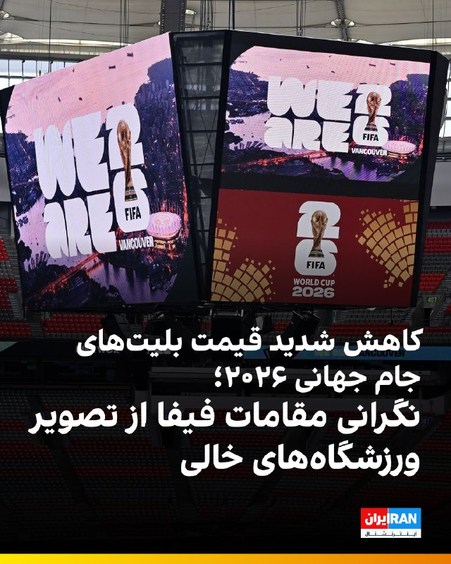

🔻روزنامه نیویورک‌پست گزارش داد قیمت بلیت‌های جام جهانی ۲۰۲۶ به‌طور قابل توجهی کاهش یافته است.

🔹بر اساس این گزارش، برگزارکنندگان جام جهانی در ایالات متحده، کانادا و مکزیک با استقبال کمتر از انتظار هواداران روبه‌رو شده‌اند و همین مسئله باعث افت قیمت بلیت‌ها شده است.

🔹نیویورک‌پست نوشت برخی بلیت‌ها که پیش‌تر با قیمت‌های بسیار بالا عرضه شده بودند، اکنون با کاهش چشمگیر قیمت فروخته می‌شوند. نگرانی درباره هزینه بالای سفر، اقامت و حمل‌ونقل در شهرهای میزبان از جمله دلایل کاهش تقاضا عنوان شده است.

🔹این گزارش همچنین به نگرانی مقام‌های فیفا درباره تصاویر ورزشگاه‌های نیمه‌خالی اشاره کرده و نوشته است برگزارکنندگان در تلاش‌اند با کاهش قیمت‌ها و طرح‌های تشویقی، فروش بلیت‌ها را افزایش دهند.

🔹جام جهانی ۲۰۲۶ برای نخستین‌بار با حضور ۴۸ تیم برگزار خواهد شد و گستردگی جغرافیایی مسابقات، چالش‌های تازه‌ای برای هواداران ایجاد کرده است.

@iranintltvsport

## IranIntlTV — post 337908

  <a href="telegram/content/IranIntlTV_337908_1779188040.mp4" target="_blank">🎬 Download video</a>

مهدی پیرصالحی، رییس سازمان غذا و دارو، هشدار داد افزایش قیمت دارو می‌تواند باعث نارضایتی عمومی شود و به همین دلیل بیمه‌ها باید پوشش بیشتری برای بیماران فراهم کنند.

گفت‌وگو با منصوره حسینی‌یگانه، عضو تحریریه ایران‌اینترنشنال

@iranintltv

## IranIntlTV — post 337907

  <a href="telegram/content/IranIntlTV_337907_1779188042.mp4" target="_blank">🎬 Download video</a>

یکی از اعضای شورای شهر زنجان هنگام تحصن کارگران برای درخواست افزایش حقوق، با خودروی دولتی از روی پای یک پارکبان معترض عبور کرد.

گفت‌وگو با آیه دریس، عضو تحریریه ایران‌اینترنشنال
@iranintltv

## IranIntlTV — post 337906

  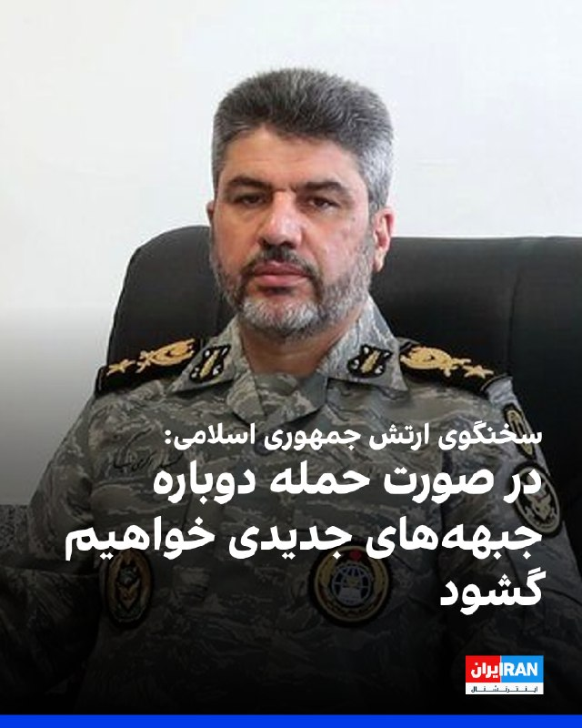

در ادامه لفاظی‌های تهدیدآمیز مقام‌های حکومت، محمد اکرمی‌نیا، سخنگوی ارتش جمهوری اسلامی، گفت در صورت حمله مجدد دشمن، «با ابزارها و شیوه‌های جدید، جبهه‌های جدیدی را علیه آنها خواهیم گشود».

او اضافه کرد: «جمهوری اسلامی محاصره‌پذیر و قابل شکست نیست.»
https://iranintl.com/202605192299

## IranIntlTV — post 337905

شرکت آلکاتل اعلام کرد تعمیر کابل‌های اینترنت زیردریایی در خلیج فارس را به‌دلیل ناامنی و تهدیدهای سپاه پاسداران متوقف کرده‌ است. این شرکت تاکید کرد سپاه از اپراتورهای خارجی خواسته برای نگه‌داری این زیرساخت‌ها به جمهوری اسلامی هزینه حفاظت بپردازند.
گفت‌وگو با علی‌حسین قاضی‌زاده، عضو تحریریه ایران‌اینترنشال
@iranintltv

## IranIntlTV — post 337904

  <a href="telegram/content/IranIntlTV_337904_1779188045.mp4" target="_blank">🎬 Download video</a>

ویدیوی ارسال‌شده به ایران‌اینترنشنال، شعارنویسی در حمایت از شاهزاده رضا پهلوی را روی یکی از دیوارهای شهر کیش نشان می‌دهد.

## IranIntlTV — post 337903

  <a href="telegram/content/IranIntlTV_337903_1779188046.mp4" target="_blank">🎬 Download video</a>

شرکت آلکاتل اعلام کرده تعمیر کابل‌های اینترنت زیردریایی در خلیج فارس را به‌دلیل شرایط ناامن و تهدیدهای منتسب به سپاه پاسداران متوقف کرده است. این تصمیم در حالی گرفته شده که موضوع تامین امنیت و هزینه حفاظت از زیرساخت‌های ارتباطی همچنان محل اختلاف با اپراتورهای خارجی است و نگرانی‌ها درباره اختلال در شبکه‌های اینترنتی و مالی در صورت آسیب به کابل‌ها افزایش یافته است.
@iranintltv

## IranIntlTV — post 337902

  <a href="telegram/content/IranIntlTV_337902_1779188048.mp4" target="_blank">🎬 Download video</a>

روزنامه اسرائیل هیوم در گزارشی تحلیلی نوشت احتمال ازسرگیری جنگ میان جمهوری اسلامی و آمریکا بالاست. هم‌زمان، دونالد ترامپ، رییس‌جهوری آمریکا، در گفت‌وگو با نیویورک پست گفت پس از دریافت پاسخ اخیر تهران درباره مذاکرات، تمایلی به دادن امتیاز بیشتر به جمهوری اسلامی ندارد.
جزییات بیشتر با اشکان صفایی، خبرنگار ایران‌اینترنشنال
@iranintltv

## IranIntlTV — post 337901

  <a href="telegram/content/IranIntlTV_337901_1779188050.mp4" target="_blank">🎬 Download video</a>

مستند «تمرین‌هایی برای یک انقلاب» ساخته پگاه آهنگرانی، برنده جایزه ویژه هیات داوران مستند گلدن گلوبز شد. این مستند با استفاده از تصاویر آرشیوی، روایت وقایع پس از انقلاب ۵۷ تا امروز را با زندگی شخصی فیلمساز پیوند می‌دهد.
لی‌لی نیکفر، خبرنگار ایران‌اینترنشنال، گزارش می‌دهد
@iranintltv

## IranIntlTV — post 337900

🔻نیویورک‌تایمز: جمهوری اسلامی از فرصت آتش‌بس برای احیای توان موشکی خود استفاده کرد

نیویورک‌تایمز گزارش داد جمهوری اسلامی در دوره آتش‌بس شکننده میان تهران و واشینگتن، بازسازی بخشی از توان موشکی خود را آغاز کرده و هم‌زمان برای احتمال ازسرگیری درگیری‌ها آماده می‌شود.

بر اساس این گزارش، جمهوری اسلامی از این فرصت برای بازگشایی ده‌ها محل استقرار موشک‌های بالستیک که در جریان حملات هدف قرار گرفته بودند، استفاده کرده است.

جابه‌جایی پرتابگرهای متحرک موشکی و تطبیق تاکتیک‌های نظامی برای دور تازه احتمالی جنگ نیز از دیگر اقدام‌های تهران عنوان شده است.

یک مقام نظامی آمریکا به نیویورک‌تایمز گفت بسیاری از موشک‌های بالستیک جمهوری اسلامی در تاسیسات زیرزمینی عمیق در دل کوه‌های گرانیتی نگهداری می‌شدند و آمریکا در حملات خود عمدتا ورودی این مراکز را هدف قرار داده بود.

به گفته او، فروریختن دهانه این تاسیسات باعث مدفون شدن آن‌ها شد، اما ساختار اصلی سایت‌ها از بین نرفت و اکنون حکومت ایران بخش قابل توجهی از این مراکز را دوباره بازگشایی کرده است.

این مقام آمریکایی افزود تهران همچنین بسیاری از تسلیحات باقی‌مانده خود را جابه‌جا کرده و در میان مقام‌های جمهوری اسلامی این باور تقویت شده که می‌توانند در برابر آمریکا مقاومت کنند؛ چه از طریق بستن موثر تنگه هرمز، چه با حمله به زیرساخت‌های انرژی کشورهای خلیج فارس و چه با تهدید هواپیماهای آمریکایی.

جمهوری اسلامی در انتظار جنگی کوتاه اما شدید

نیویورک‌تایمز نوشت با وجود ادامه مذاکرات، مقام‌های جمهوری اسلامی خود را برای احتمال ازسرگیری حملات آماده کرده‌اند و هشدار داده‌اند در صورت وقوع جنگ تازه، هزینه سنگینی به همسایگان و اقتصاد جهانی تحمیل خواهند کرد.

حمیدرضا عزیزی، پژوهشگر مسائل امنیتی ایران در موسسه آلمانی امور بین‌الملل و امنیت، به این روزنامه گفت مقام‌های جمهوری اسلامی در دور نخست جنگ، خود را برای یک درگیری طولانی‌مدت حدود سه ماهه آماده کرده بودند و به همین دلیل استفاده از موشک‌ها را محدود کردند تا بتوانند هفته‌ها حملات را ادامه دهند.

اما به گفته او، اگر جنگ دوباره آغاز شود، رهبران جمهوری اسلامی انتظار یک نبرد «کوتاه اما بسیار شدید» را دارند؛ جنگی که می‌تواند با حملات هماهنگ به زیرساخت‌های انرژی ایران همراه باشد.

به نوشته نیویورک‌تایمز، جمهوری اسلامی ممکن است در دور تازه درگیری‌ها روزانه ده‌ها یا حتی صدها موشک شلیک کند تا «محاسبات طرف مقابل را تغییر دهد».

تهدید خلیج فارس و باب‌المندب

این گزارش افزود که کشورهای عربی خلیج فارس در صورت آغاز دوباره جنگ، ممکن است با حملات شدیدتر به زیرساخت‌های انرژی خود روبه‌رو شوند. هدف قرار دادن میادین نفتی، پالایشگاه‌ها و بنادر نفتی، یکی از مهم‌ترین ابزارهای تهران برای وارد آوردن فشار بر اقتصاد جهانی توصیف شده است.

نیویورک‌تایمز همچنین به افزایش تهدیدهای لفظی علیه امارات متحده عربی اشاره کرد و نوشت برخی مقام‌ها و تحلیلگران نزدیک به جمهوری اسلامی معتقدند امارات با میزبانی پایگاه‌های نظامی آمریکا، در حملات علیه حکومت ایران نقش داشته است.

مهدی خراطیان، تحلیلگر نزدیک به نهادهای امنیتی جمهوری اسلامی، ماه گذشته گفته بود: «ما حتما باید امارات را به دوران شترسواری برگردانیم و می‌توانیم این کار را بکنیم. اگر لازم باشد، ابوظبی را اشغال خواهیم کرد.»

این روزنامه همچنین نوشت جمهوری اسلامی ممکن است علاوه بر تنگه هرمز، بر تنگه باب‌المندب نیز فشار وارد کند. آبراهی راهبردی میان دریای سرخ و خلیج عدن که حدود یک‌دهم تجارت جهانی از آن عبور می‌کند و در نزدیکی مناطق تحت کنترل حوثی‌های مورد حمایت جمهوری اسلامی قرار دارد.

به نوشته نیویورک‌تایمز، اگر تهران احساس کند کنترلش بر تنگه هرمز در خطر است، ممکن است تلاش کند آمریکا را هم‌زمان در دو جبهه دریایی درگیر کند.

این گزارش در پایان افزود اگرچه حوثی‌ها وعده داده‌اند در صورت وقوع جنگ منطقه‌ای از تهران حمایت کنند، اما در دور قبلی درگیری‌ها واکنش محتاطانه‌ای نشان دادند. موضوعی که تحلیلگران آن را ناشی از نگرانی این گروه درباره کاهش ذخایر نظامی‌اش می‌دانند.

🔗 وب‌سایت ایران اینترنشنال

@iranintltv

## IranIntlTV — post 337899

  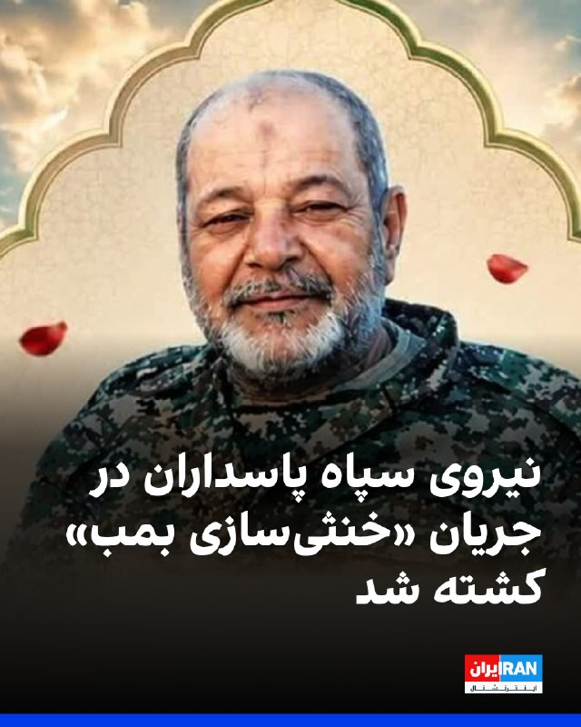

رسانه‌های ایران گزارش دادند حمید خانی، عضو پیشین سپاه پاسداران، در جریان ماموریت خنثی‌سازی بمب‌های عمل‌نکرده ناشی از حملات مشترک اسرائیل و آمریکا در تهران کشته شده است. بر اساس این گزارش‌ها، او به صورت داوطلبانه در بخش مهندسی قرارگاه خاتم‌الانبیا فعالیت می‌کرده است.

جزئیات بیشتری درباره زمان دقیق حادثه و نحوه وقوع آن منتشر نشده است.
https://iranintl.com/202605198404

## IranIntlTV — post 337898

  <a href="telegram/content/IranIntlTV_337898_1779188053.mp4" target="_blank">🎬 Download video</a>

پگاه آهنگرانی، بازیگر و مستندساز، پیش از نمایش فیلم «تمرین‌هایی برای یک انقلاب» در جشنواره فیلم کن، گفت این فیلم را به مادرانی تقدیم می‌کند که فرزندانشان را در «راه آزادی» از دست دادند.
@iranintltv

## IranIntlTV — post 337897

  <a href="telegram/content/IranIntlTV_337897_1779188055.mp4" target="_blank">🎬 Download video</a>

مدیرکل دفتر بهبود تغذیه وزارت بهداشت با اشاره به ادامه آموزش «تغذیه ارزان‌قیمت» گفت خانواده‌ها با استفاده از جایگزین‌های غذایی تلاش می‌کنند حداقل کالری و پروتئین مورد نیاز خود را تامین کنند. او همچنین گفت حدود ۵ درصد کودکان زیر ۵ سال در ایران دچار کوتاه‌قدی ناشی از سوءتغذیه هستند.
گفت‌وگو با بابک خطی، پزشک و متخصص کودکان
@iranintltv

## IranIntlTV — post 337896

  <a href="telegram/content/IranIntlTV_337896_1779188057.mp4" target="_blank">🎬 Download video</a>

هاکان فیدان، وزیر خارجه ترکیه، در کنفرانس خبری مشترک با همتای آلمانی‌اش گفت مهم‌ترین موضوع درباره ایران، باز ماندن تنگه هرمز و پس از آن، پرونده هسته‌ای جمهوری اسلامی است. فیدان افزود: «ذخایر اورانیوم غنی‌شده باید از ایران خارج شود.»

گفت‌وگو با احمد صمدی، خبرنگار ایران‌اینترنشنال
@iranintltv

## IranIntlTV — post 337895

  <a href="telegram/content/IranIntlTV_337895_1779188059.mp4" target="_blank">🎬 Download video</a>

ویدیوی ارسال‌شده به ایران‌اینترنشنال، برگزاری مراسم عقد میان حامیان حکومت را در یکی از تجمع‌های حکومتی در تهران نشان می‌دهد.

## IranIntlTV — post 337894

  <a href="telegram/content/IranIntlTV_337894_1779188061.mp4" target="_blank">🎬 Download video</a>

دونالد ترامپ، رییس‌جمهوری آمریکا، اعلام کرد به‌درخواست امارات متحده عربی، عربستان سعودی و قطر، حمله احتمالی علیه جمهوری اسلامی را برای چند روز به تعویق انداخته تا فرصت بیشتری برای دستیابی به توافق فراهم شود.

گفت‌وگو با مرتضی کاظمیان، عضو تحریریه ایران‌اینترنشنال
@iranintltv

## IranIntlTV — post 337893

🗣روایت شما از بحران اقتصادی و زندگی در آتش‌بس- سه‌شنبه ۲۹ اردیبهشت:

🔹یک بسته برنج یک کیلویی، یک بسته بال مرغ، ۶ تا تخم‌مرغ و یه روغن کوچیک گرفتیم شد ۲ میلیون و ۱۰۰ هزار تومن.

🔹یارانه یک خانواده‌ ۳ نفره ۳ میلیون تومانه، اما یک روغن جامد ۵ کیلویی قیمتش ۳ میلیون و ۴۰۰ هزار تومانه.

🔹ما از دی ماه نه دانشگاه رفتیم نه خوابگاه ولی هر ماه شهریه خوابگاه رو باید بدیم. پدر من بازنشسته‌است، از کجا بیاریم آخه.

🔹صنعت گردشگری و هتلداری فرو پاشیده. ۴ ماهه حقوق نگرفتیم.

🔹برا ۵ تا نان لواش با یه کیسه پلاستیکی ۵۵ هزار تومان پرداختم. گرونی جوریه که اگه بیمار باشی، ناتوان باشی، یا برای یه سالمند بخواهی سفارش آنلاین بدی، مجبور به پرداخت مبلغ زیادی هستی.

🔹ما بازنشسته‌ها با این حقوق‌های پایین داریم له می‌شیم، حتی نمی‌تونیم به درمان خودمون برسیم.

🔹من پارسال بعد ازدواجم یه آپارتمان گرفتم با مبلغ ۸۰۰ میلیون رهن و ۱۰ میلیون تومان اجاره. امسال صاحبخانه گفته باید یک میلیارد و ۲۰۰ رهن بدی با ۲۵ میلیون تومان اجاره... کادر درمان هستم و موندم چکار کنم.

🔹قطعی برق شهرک‌های صنعتی تهران از ۲۶ اردیبهشت شروع شده. فعلا طبق برنامه مدیریت بار، یک روز در هفته از ساعت ۸ صبح تا ۱۲ شب!

🔹قطعی آب در زاهدان طولانی مدت شده و حتی به ۱۲ ساعت هم می‌رسه. زمان‌های قطعی هم متفاوته، یک‌بار صبح زود یک‌بار ظهر یک‌بار عصر.

## Shin_Persian — post 6082

  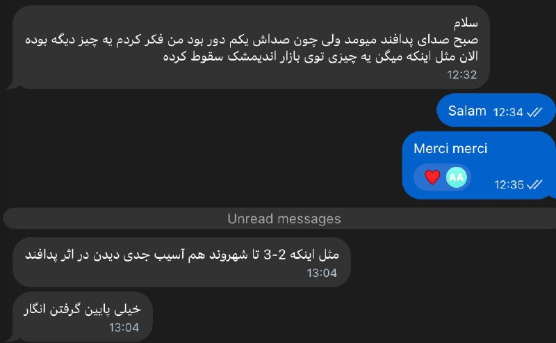

Shin ✓ @hey_itsmyturn
Tue, 19 May 2026 10:06:08 UTC

Earlier today:
"AA activity in Andimeshk"
Adds:
"Something reportedly crashed in the Andimeshk Bazaar"
Also adds:
"Apparently 2-3 citizens were severely wounded due to the AA fire" [???]

Khuzestan Province, #Iran

فارسی

امروز کمی پیش:
«فعالیت پدافند هوایی در اندیمشک»
می‌افزاید:
«گزارش شده که چیزی در بازار اندیمشک سقوط کرده است»
همچنین می‌افزاید:
«ظاهراً ۲-۳ شهروند بر اثر شلیک پدافند هوایی به شدت مجروح شده‌اند» [؟؟؟]

استان خوزستان، #Iran_

𝕏 · @shin_persian

## Shin_Persian — post 6081

  

Shin ✓ @hey_itsmyturn
Tue, 19 May 2026 09:46:48 UTC

Now @ 0946Z
Blast was heard in Qeshm island, eyewitness reports it was likely from the sea
Hormozgan Province, #Iran

فارسی

هم‌اکنون @ ۰۹۴۶ زولو (۱۳:۱۶ به وقت تهران)
صدای انفجار در جزیره قشم شنیده شد، گزارش‌های شاهدان عینی حاکی از آن است که احتمالاً از سمت دریا بوده است.
استان هرمزگان، #Iran

𝕏 · @shin_persian

## Shin_Persian — post 6080

  

DefenceGeek 🇬🇧 @DefenceGeek Tue, 19 May 2026 09:04:39 UTC UPDATE: US Air Force Tanker Fleet 19/05/2026 (Ceasefire Day 42) #FreeIran‌ --- Operation EPIC FURY / Project FREEDOM --- Another weekly update. Overall tanker numbers remain around the same from…

## Shin_Persian — post 6079

DefenceGeek 🇬🇧 @DefenceGeek
Tue, 19 May 2026 09:04:39 UTC

UPDATE: US Air Force Tanker Fleet 19/05/2026 (Ceasefire Day 42) #FreeIran‌
--- Operation EPIC FURY / Project FREEDOM ---

Another weekly update. Overall tanker numbers remain around the same from my last update, although we're starting to see a growing number of airframes previously deployed into the region returning from CONUS after rest/maintenance.

Usual rule, exact distribution I won't give out for now on the off chance that hostilities begin again in the coming days/weeks.

@MATA_osint @vcdgf555 @steffanwatkins @ArmchairAdml @TheIntelFrogbu @jamjake01 @Andyyyyrrrr @Saint1Mil @rocketron101 @Faytuks

فارسی

به‌روزرسانی: ناوگان تانکرهای نیروی هوایی ایالات متحده (USAF) ۱۴۰۵/۰۲/۲۹ (روز ۴۲ آتش‌بس) #FreeIran‌
--- عملیات خشم حماسی (Operation EPIC FURY) / پروژه آزادی ---

یک به‌روزرسانی هفتگی دیگر. تعداد کل تانکرها نسبت به آخرین به‌روزرسانی من تقریباً در همان سطح باقی مانده است، هرچند شاهد بازگشت تعداد فزاینده‌ای از هواگردهایی هستیم که پیش‌تر در منطقه مستقر بودند و پس از استراحت/تعمیرات از ایالات متحده (CONUS) باز می‌گردند.

طبق روال معمول، توزیع دقیق را فعلاً به دلیل احتمال ناچیز از سرگیری درگیری‌ها در روزها یا هفته‌های آینده اعلام نخواهم کرد.

@MATA_osint @vcdgf555 @steffanwatkins @ArmchairAdml @TheIntelFrogbu @jamjake01 @Andyyyyrrrr @Saint1Mil @rocketron101 @Faytuks_

𝕏 · @shin_persian

## ManotoTV — post 105628

  <a href="telegram/content/ManotoTV_105628_1779188066.mp4" target="_blank">🎬 Download video</a>

علیرضا رئیسی، معاون بهداشت وزارت بهداشت، اعلام کرد جمعیت ایران بر اساس آخرین آمار به ۸۶ میلیون و ۵۶۴ هزار نفر رسیده است.
به گفته او، از این تعداد ۴۳ میلیون و ۶۵۸ هزار نفر مرد و ۴۲ میلیون و ۹۰۶ هزار نفر زن هستند.

## ManotoTV — post 105627

  <a href="telegram/content/ManotoTV_105627_1779188066.mp4" target="_blank">🎬 Download video</a>

بر پایه گزارش‌های منتشر شده حامد تیزرویان، فعال محیط زیست و عکاس شناخته شده بازداشت شده است. آقای تیزرویان ۱۴ اردیبهشت در ساری بازداشت شده و با وجود سپری شدن حدود دو هفته، از نهاد بازداشت کننده یا دلیل دستگیری او اطلاعی در دست نیست.
وسایل الکترونیکی از جمله تلفن همراه حامد تیزرویان هنگام بازداشت او ضبط شده است. حامد تیزرویان، عکاس حیات وحش و دانشجوی دکترای تنوع زیستی دانشگاه شهید بهشتی، پیش‌تر تصاویری کم‌نظیر از گونه‌های در معرض خطر انقراض از جمله خرس قهوه‌ای و مرال ثبت کرده است. او همچنین در ساخت دست‌کم ۱۰ پاسگاه محیط‌بانی در محدوده جنگل‌های هیرکانی مشارکت داشته و طی سال‌های گذشته در زمینه آموزش و آگاهی‌رسانی درباره حفاظت از محیط زیست، به‌ویژه جنگل‌های هیرکانی، فعالیت مستمر داشته است. فعالان محیط زیست نگران سرنوشت آقای تیزرویان هستند. صفحه اینستاگرام حامد تیزرویان نیز آذر سال گذشته، پس از انتشار مطالبی انتقادی درباره عملکرد مدیران دولتی در مهار آتش‌سوزی جنگل‌های الیمالات مازندران، برای چند روز مسدود شده بود.

## ManotoTV — post 105626

  <a href="telegram/content/ManotoTV_105626_1779188067.mp4" target="_blank">🎬 Download video</a>

نت‌بلاکس، نهاد ناظر بر دسترسی اینترنت، اعلام کرد ایران برای هشتاد و یکمین روز متوالی با قطعی گسترده اینترنت روبه‌رو است و این رخداد اکنون به طولانی‌ترین خاموشی اینترنتی ملی ثبت‌شده در یک کشور متصل به اینترنت تبدیل شده است.

بر اساس داده‌های نت‌بلاکس، دسترسی کاربران داخل ایران به اینترنت جهانی به‌شدت محدود مانده و ارتباطات دیجیتال کشور در سطحی بسیار پایین‌تر از وضعیت عادی قرار دارد.

## ManotoTV — post 105625

  <a href="telegram/content/ManotoTV_105625_1779188068.mp4" target="_blank">🎬 Download video</a>

وزارت دفاع روسیه اعلام کرد نیروهای مسلح این کشور از سه‌شنبه ۲۹ اردیبهشت تا ۳۱ اردیبهشت رزمایش نیروهای هسته‌ای برگزار می‌کنند.

بر اساس این اعلام، بیش از ۶۴ هزار نیروی نظامی و ۷۸۰۰ قطعه تجهیزات نظامی در این رزمایش شرکت دارند و قرار است موشک‌های بالستیک و کروز از پایگاه‌های آزمایشی در خاک روسیه شلیک شوند.

این خبر هم‌زمان با افزایش تنش‌های امنیتی میان روسیه و غرب منتشر شده است. یک روز پیشتر نیز بلاروس اعلام کرد با مشارکت روسیه رزمایشی را برای تمرین جابه‌جایی و آماده‌سازی مهمات هسته‌ای برگزار می‌کند. بلاروس میزبان تسلیحات هسته‌ای تاکتیکی روسیه است، اما مسکو کنترل این تسلیحات را در اختیار دارد.

## ManotoTV — post 105624

  <a href="telegram/content/ManotoTV_105624_1779188068.mp4" target="_blank">🎬 Download video</a>

علی عبداللهی، فرمانده قرارگاه مرکزی حضرت خاتم‌الانبیا، در اظهاراتی خطاب به آمریکا و هم‌پیمانانش هشدار داد که «دوباره مرتکب خطای محاسباتی نشوند».

او گفت اگر «خطای دیگری» از سوی دشمنان جمهوری اسلامی رخ دهد، نیروهای مسلح ایران با «قدرت و توانایی به مراتب بالاتر از جنگ تحمیلی رمضان» با آن برخورد خواهند کرد.

این اظهارات در حالی مطرح می‌شود که در روزهای گذشته احتمال حمله نظامی به ایران افزایش یافته و دونالد ترامپ نیز دیشب گفت چند کشور عربی از او خواسته‌اند حمله‌ای «بسیار بزرگ» را برای چند روز به تعویق بیندازد.

## ManotoTV — post 105623

  <a href="telegram/content/ManotoTV_105623_1779188069.mp4" target="_blank">🎬 Download video</a>

آنا کلی، سخنگوی کاخ سفید، گفت موضع دونالد ترامپ درباره جمهوری اسلامی تغییری نکرده و رئیس‌جمهوری آمریکا همچنان برای جلوگیری از دستیابی تهران به سلاح هسته‌ای «بسیار جدی» است.

او گفت جمهوری اسلامی ۴۷ سال شعار «مرگ بر آمریکا» سر داده و نیروهای آمریکایی در خارج از کشور را تهدید کرده، هرگز نباید به سلاح هسته‌ای دست پیدا کند.

کلی افزود پیام ترامپ در شبکه تروث سوشال نشان می‌دهد او تا چه اندازه در این موضوع جدی است. به گفته او، جمهوری اسلامی اکنون با مشکلات متعددی روبه‌رو است، زیرا «ترامپ همه برگ‌ها را در دست دارد».

## ManotoTV — post 105622

  <a href="telegram/content/ManotoTV_105622_1779188071.mp4" target="_blank">🎬 Download video</a>

دونالد ترامپ شب گذشته گفت چند کشور به او گفته‌اند که برای «حمله‌ای بسیار بزرگ» آماده می‌شدند، اما او این حمله را برای مدتی کوتاه، و شاید برای همیشه، به تعویق انداخته است.

ترامپ گفت عربستان سعودی، قطر، امارات متحده عربی و چند کشور دیگر از او خواستند این اقدام را دو یا سه روز عقب بیندازد، زیرا به گفته او، این کشورها معتقدند مذاکرات با جمهوری اسلامی به دستیابی به توافق نزدیک شده است.

ترامپ گفت اسرائیل و دیگر طرف‌های درگیر در خاورمیانه از این تصمیم مطلع شده‌اند. او این تحول را «بسیار مثبت» خواند، اما تاکید کرد هنوز روشن نیست به نتیجه برسد یا نه.

## ManotoTV — post 105621

  <a href="telegram/content/ManotoTV_105621_1779188072.mp4" target="_blank">🎬 Download video</a>

پلیس سن‌دیگو اعلام کرد دو نوجوان مسلح روز دوشنبه ۲۸ اردیبهشت به سوی مرکز اسلامی سن‌دیگو تیراندازی کردند و سه مرد را کشتند. به گفته پلیس، این دو مهاجم که ۱۷ و ۱۸ ساله بودند، پس از حمله چند خیابان دورتر اقدام به خودکشی کردند. این حمله به عنوان «جرم نفرت‌محور» در دست بررسی است.

پلیس پیش از تیراندازی در جست‌وجوی یکی از این دو نوجوان بود، زیرا مادر او با پلیس تماس گرفته و گفته بود پسرش با نشانه‌های ضربه به خود از خانه خارج شده است. به گفته پلیس، هم‌زمان چند سلاح و خودروی مادر این نوجوان نیز از خانه ناپدید شده بود.

## ManotoTV — post 105620

  <a href="telegram/content/ManotoTV_105620_1779188073.mp4" target="_blank">🎬 Download video</a>

«رشید مظاهری صدای مردم ایران شده بود»

## ManotoTV — post 105619

  <a href="telegram/content/ManotoTV_105619_1779188074.mp4" target="_blank">🎬 Download video</a>

دونالد ترامپ، رئیس‌جمهوری آمریکا، در پاسخ به سوال خبرنگاران گفت چند کشور منطقه، از جمله قطر، عربستان سعودی و امارات متحده عربی، در حال گفت‌وگو با آمریکا و جمهوری اسلامی هستند و احتمال رسیدن به توافق وجود دارد.

ترامپ گفت: «این سه کشور، به‌علاوه چند کشور دیگر، با من تماس گرفتند و آن‌ها مستقیماً با مقام‌های ما و در حال حاضر با ایران در تماس هستند.»

او افزود: «به نظر می‌رسد احتمال بسیار خوبی وجود دارد که بتوانند به یک توافق برسند.»

رئیس‌جمهوری آمریکا همچنین گفت ترجیح می‌دهد بحران بدون اقدام نظامی حل شود و افزود: «اگر بتوانیم بدون اینکه آن‌ها را به‌شدت بمباران کنیم به نتیجه برسیم، بسیار خوشحال خواهم شد.

## FarsiVOA — post 218127

  <a href="telegram/content/FarsiVOA_218127_1779188076.mp4" target="_blank">🎬 Download video</a>

تصاویری از خارج کردن کودکان از «مرکز اسلامی» سن‌دیگو پس از تیراندازی مرگبار در این مکان؛

مقام‌های آمریکایی گفتند تیراندازی روز دوشنبه در یک «مرکز اسلامی» در شهر سن‌دیگو واقع در ایالت کالیفرنیا، سه مرد، از جمله یک نگهبان امنیتی را کشت. پلیس در یک نشست خبری گفت این نگهبان امنیتی به نظر می‌رسد که نقش مهمی در جلوگیری از وخیم‌تر شدن حمله داشت.

دونالد ترامپ، رئيس‌جمهوری آمریکا در یک کنفرانس خبری که عصر دوشنبه برگزار شد گفت گزارشی از این حمله را دریافت می‌کند. ای‌بی‌سی به نقل از مقامات گزارش داد که اجساد قربانیان مقابل ساختمان مرکز اسلامی پیدا شد.

پیش‌تر مقامات پلیس اعلام کرده بودند که مظنونان تیراندازی، دو نوجوان به نام‌های کین کلارک و کیلب وازکز، بر اثر شلیک گلوله به خود جان باخته‌اند.

تاکنون انگیزه‌ای برای این حمله اعلام نشده است. با این حال، دو مقام ارشد پلیس گفتند بازرسان در حال بررسی نوشته‌هایی با محتوای احتمالی ضداسلامی هستند که در خودروی محل پیدا شدن اجساد مظنونان کشف شده است. فعلا این تیراندازی به عنوان «جرم ناشی از نفرت» قلمداد شده است.
@FarsiVOA

## FarsiVOA — post 218126

🔺تماس‌های تلفنی وزیر خارجه قطر با همتایان خود در عربستان و ترکیه

▪️وزیر خارجه قطر با همتایان خود در عربستان سعودی و ترکیه تماس تلفنی گرفت و درباره تحولات منطقه گفت‌وگو کرد.

▪️این دومین تماس تلفنی وزرای خارجه قطر و عربستان سعودی در ۲۴ ساعت گذشته است. به گزارش وزارت خارجه قطر، در جریان این تماس، از جمله «آتش‌بس میان ایالات متحده و جمهوری اسلامی، و تلاش‌ها با هدف کاهش تنش‌ها» بررسی شده است.

▪️روز سه‌شنبه وزیر خارجه قطر با وزیر خارجه ترکیه نیز درباره تحولات منطقه تلفنی گفت‌وگو کرد.

▪️دونالد ترامپ، رئیس‌جمهور آمریکا، پیشتر اعلام کرده بود حمله برنامه‌ریزی شده در روز سه‌شنبه به ایران را درخواست رهبران قطر، عربستان سعودی و امارات به تعویق انداخته تا نتیجه مذاکرات مشخص شود.

⬇️ بیشتر بخوانید:
https://ir.voanews.com/a/8151594.html

## FarsiVOA — post 218125

  

رئیس کمیسیون سلامت، محیط زیست و خدمات شهری شورای شهر تهران از تداوم «تنش آبی» در پایتخت ایران خبر داد و اعلام کرد: «با وجود بارندگی‌های اخیر، وضعیت ذخایر سدهای تأمین‌کننده آب تهران همچنان نگران‌کننده است.»

مهدی پیرهادی در گفت‌وگو با ایسنا، گفت استان‌های تهران و قم حدود ۳۰ درصد کاهش بارندگی را تجربه کرده‌اند و کاهش منابع آب زیرزمینی باعث شده تهران همچنان تحت تأثیر بحران خشکسالی سال‌های اخیر قرار داشته باشد.

این عضو شورای شهر تهران ادامه داد که علاوه بر تهران و قم، شرایط آبی در دیگر استان‌های کشور، مانند مرکزی، خراسان رضوی، اصفهان، زنجان و همدان همچنان «نامناسب» است.

او افزود: «نزدیک به ۱۰ استان کشور که جمعیتی حدود ۳۵ میلیون نفر را در خود جای داده‌اند، هنوز با کمبود بارش نسبت به میانگین بلندمدت مواجهند.»
@FarsiVOA

## FarsiVOA — post 218124

  

پلیس ضدتروریسم ترکیه ۱۱۰ نفر را به ظن فعالیت در حمایت از گروه «دولت اسلامی» (داعش) در عملیاتی که عمدتا در استانبول انجام شد، بازداشت و مقداری سلاح ضبط کرد.

خبرگزاری دولتی آناتولی ترکیه روز سه‌شنبه گزارش داد که این افراد متهم هستند که در انجمن‌های غیرقانونی کلاس‌هایی برای آموزش کودکان با ایدئولوژی داعش سازمان‌دهی کرده‌اند.

بر اساس این گزارش، این افراد همچنین متهمند برای داعش پول جمع‌آوری و تلاش کرده‌اند اعضای جدیدی برای این گروه جذب کنند. عملیات پلیس ضدتروریسم ترکیه با هماهنگی دفتر دادستانی کل استانبول انجام شده است.

هفته گذشته نیز پلیس ترکیه ۳۲۴ نفر دیگر را در جریان یورش‌هایی در ۴۷ استان به ظن ارتباط با داعش بازداشت کرده بود.

در هفتم آوریل، یک مهاجم در جریان درگیری مسلحانه خارج از کنسولگری اسرائیل در استانبول کشته و دو نفر دیگر زخمی شدند. وزیر کشور ترکیه گفت یکی از مهاجمان به «سازمانی که از دین سوءاستفاده می‌کند» مرتبط بوده است. رسانه‌های ترکیه گزارش داده‌اند که این سازمان داعش بوده است.
@FarsiVOA

## FarsiVOA — post 218123

🔺قطع اینترنت از ۱۹۲۰ ساعت گذشت؛ شرق از حضور اطلاعات سپاه در تشکیلات تازه مدیریت اینترنت خبر داد

▪️نت‌بلاکس اعلام کرد خاموشی اینترنت در ایران پس از ۱۹۲۰ ساعت وارد روز هشتاد و یکم شده است.

▪️این نهاد ناظر بر اختلالات اینترنت همچنین نوشت جمهوری اسلامی، هم‌زمان با قطع گسترده دسترسی کاربران ایرانی، در تلاش است دامنه «خفگی دیجیتال» خود را به بیرون از مرزهای ایران گسترش دهد.

▪️دولت پزشکیان در میانه طولانی‌ترین دوره قطعی اینترنت در ایران، ساختار تازه‌ای با عنوان «ستاد ویژه ساماندهی و راهبری فضای مجازی کشور» ایجاد کرد.

▪️شرق، می‌نویسد اعضای این ستاد فقط محدود به وزارت ارتباطات یا نهادهای اجرایی نیستند، و دادستان کل کشور، وزارت اطلاعات، دبیر شورای عالی امنیت ملی، و اطلاعات سپاه در این ساختار حضور دارند.

⬇️ بیشتر بخوانید:
https://ir.voanews.com/a/8151593.html

## FarsiVOA — post 218122

🔺وزیر خارجه بریتانیا: جهان دیگر نمی‌تواند برای بازگشایی تنگه هرمز صبر کند

▪️ایووت کوپر، وزیر خارجه بریتانیا، هشدار داد جهان دیگر نمی‌تواند برای بازگشایی تنگه هرمز صبر کند و ادامه بسته‌ماندن این آبراه، امنیت غذایی کشورهای آسیب‌پذیر را با بحران جدی‌تری روبه‌رو می‌کند.

▪️وزارت خارجه بریتانیا اعلام کرد برنامه‌هایی برای «مأموریت چندملیتی تنگه هرمز» در حال پیشبرد است تا در صورت دستیابی به توافق، از بازگشایی فوری و بدون محدودیت این مسیر حمایت شود.

▪️کوپر تأکید کرد بحران‌هایی مانند بحران جمهوری اسلامی در مرزها متوقف نمی‌شوند و راه‌حل آنها نیز نیازمند همکاری بین‌المللی است.

⬇️ بیشتر بخوانید:
https://ir.voanews.com/a/8151592.html

## FarsiVOA — post 218121

  

عمران احمد صدیقی، سفیر منصوب پاکستان در تهران، پیش از آغاز مأموریت خود با محمد اسحاق دار، معاون نخست‌وزیر و وزیر خارجه پاکستان دیدار و گفت‌وگو کرد.

به گزارش وزارت خارجه پاکستان، در این دیدار، اسحاق دار با اشاره به روابط میان پاکستان و ایران، بر «تعهد اسلام‌آباد به گسترش همکاری‌های دوجانبه در حوزه‌های مختلف، به‌ویژه تجارت، اتصال منطقه‌ای، تبادلات مردمی و همکاری‌های مشترک منطقه‌ای» تأکید کرد.

او همچنین بر ضرورت «حفظ روند مثبت تعاملات میان دو کشور از طریق هماهنگی نزدیک و درک متقابل» تأکید کرد و «نقش سازنده پاکستان در حمایت از صلح، گفت‌وگو و ثبات منطقه‌ای» را یادآور شد.

در روزهای اخیر، وزیر کشور پاکستان به تهران سفر و با مقامات بلندپایه جمهوری اسلامی، از جمله مسعود پزشکیان و محمدباقر قالیباف دیدار کرده بود.

پاکستان نقش میانجی را در جنگ علیه جمهوری اسلامی بر عهده دارد.
@FarsiVOA

## FarsiVOA — post 218120

  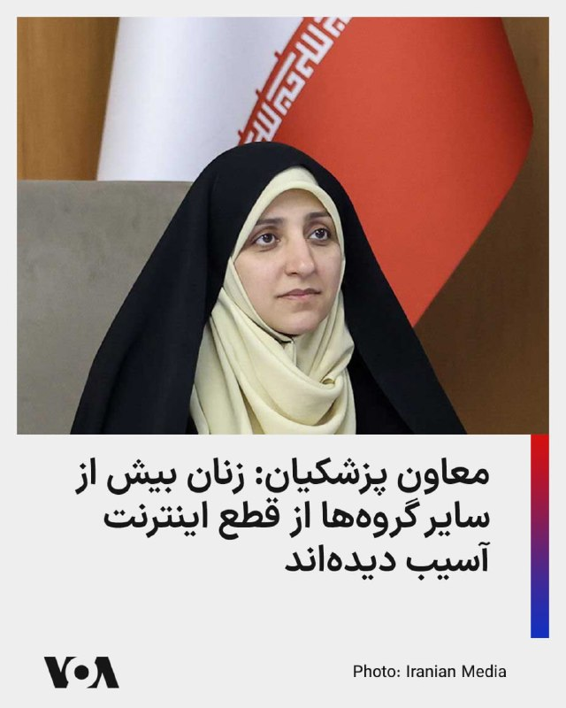

زهرا بهروزآذر، معاون امور زنان در دولت جمهوری اسلامی، می‌گوید: زنان بیش از دیگر گروه‌ها از قطع و محدودیت اینترنت در ایران آسیب دیده‌اند؛ محدودیت‌هایی که به گفته او به تشدید نابرابری و گسترش شکاف دیجیتال منجر شده است.

به گزارش رسانه‌های داخلی، زهرا بهروزآذر در دیدار با ستار هاشمی، وزیر ارتباطات گفت بسیاری از زنان، به‌ویژه فعالان مشاغل خانگی و فروشندگان آنلاین، در نتیجه محدودیت‌های اینترنتی با آسیب‌های شغلی و اقتصادی روبه‌رو شده‌اند.

او همچنین با اشاره به طرح «اینترنت پرو» هشدار داد که دسترسی طبقاتی به اینترنت می‌تواند تبعیض دیجیتال را تشدید کند، زیرا بسیاری از زنان به دلیل محدودیت‌های اقتصادی توان استفاده از اینترنت باکیفیت‌تر را ندارند.

بهروزآذر افزود: ادامه محدودیت‌ها می‌تواند اینترنت را از ابزار کاهش شکاف اجتماعی به عاملی برای تشدید نابرابری تبدیل کند، زیرا دسترسی به اینترنت باکیفیت بیش از پیش به توان مالی وابسته شده و بسیاری از زنان از فرصت‌های آموزشی، شغلی و اجتماعی محروم می‌شوند.
@FarsiVOA

## FarsiVOA — post 218119

  

معاون حقوقی و بین‌الملل وزارت خارجه جمهوری اسلامی اعلام کرد که پیشنهاد اخیر حکومت ایران به آمریکا شامل لغو تحریم‌ها، آزادسازی دارایی‌های مسدودشده و پایان دادن به محاصره دریایی علیه بنادر جنوب ایران است.

به گزارش خبرگزاری دولتی ایرنا، کاظم غریب‌آبادی روز سه‌شنبه در نشستی با اعضای کمیسیون امنیت ملی مجلس شورای اسلامی همچنین گفت که این پیشنهاد شامل پایان دادن به جنگ در تمام جبهه‌ها از جمله در لبنان، خروج نیروهای آمریکایی از مناطق نزدیک به ایران و جبران خسارت‌های ناشی از جنگ است.

همچنین بر اساس گزارش ایرنا، «تأکید بر حق غنی‌سازی و برخورداری جمهوری اسلامی ایران از حقوق هسته‌ای صلح‌آمیز» از جمله شروط جمهوری اسلامی بوده است. آمریکا با غنی‌سازی اورانیوم در خاک ایران مخالفت کرده است.

پیشتر دونالد ترامپ، رئیس‌جمهور آمریکا، در گفت‌وگویی با نشریه فورچون، با اعلام این که مقامات حکومت ایران علی‌رغم اظهارات تند علنی خود، به شدت به امضای یک توافق با واشنگتن نیاز دارند، افزود: «اما یک توافق می‌کنند و بعد یک کاغذ برایت می‌فرستند که هیچ ربطی به توافقی که کرده بودی ندارد. من می‌گویم: "شما دیوانه‌اید؟"»
@FarsiVOA

## FarsiVOA — post 218118

🔺فایننشال تایمز: شی به ترامپ گفته پوتین ممکن است از تهاجم به اوکراین «پشیمان» شود

▪️فایننشال تایمز به نقل از منابع آگاه گزارش داد که رئیس‌جمهور چین در جریان گفت‌وگوهای خود با دونالد ترامپ رئیس‌جمهور آمریکا در پکن در هفته گذشته، گفته که ولادیمیر پوتین ممکن است در نهایت از تهاجم خود به اوکراین «پشیمان» شود.

▪️فایننشال تایمز نوشت که اظهارات شی درباره تصمیم پوتین برای آغاز تهاجم تمام‌عیار به کشور همسایه‌اش در سال ۲۰۲۲، به نظر می‌رسد فراتر از مواضع پیشین او بوده است. بر اساس این گزارش، شی تاکنون چنین برداشتی‌ از مواضع پوتین در جنگ اوکراین ارائه نکرده بود.

▪️هنوز مقامات آمریکا، چین و روسیه رسماً به این گزارش فایننشال تایمز واکنشی نشان نداده‌اند.

⬇️ بیشتر بخوانید:
https://ir.voanews.com/a/8151591.html

## FarsiVOA — post 218117

🔺برق واحد آسیب‌دیده نیروگاه هسته‌ای امارات وصل شد

▪️آژانس بین‌المللی انرژی اتمی اعلام کرد امارات متحده عربی برق خارجی واحد ۳ نیروگاه هسته‌ای براکه را پس از حمله پهپادی روز یکشنبه دوباره برقرار کرده است.

▪️رویترز پیش‌تر گزارش داده بود یک پهپاد به ژنراتور برق خارج از محدوده داخلی نیروگاه براکه برخورد کرد و دو پهپاد دیگر رهگیری شدند. مقام‌های امارات گفته‌اند منشأ حمله در دست بررسی است و سطح ایمنی پرتوی نیروگاه تحت تأثیر قرار نگرفته است.

▪️این حملات در شرایطی رخ داد که مقام‌هایی در جمهوری اسلامی پیش‌تر امارات را تهدید کرده بودند.

▪️حمله به نیروگاه براکه با موجی از محکومیت‌های منطقه‌ای و بین‌المللی روبه‌رو شد.

⬇️ بیشتر بخوانید:
https://ir.voanews.com/a/8151590.html

## FarsiVOA — post 218116

  <a href="telegram/content/FarsiVOA_218116_1779188082.mp4" target="_blank">🎬 Download video</a>

تشدید حملات پهپادی اوکراین به مسکو؛ تغییر استراتژی به سمت زیرساخت‌های حیاتی؛

خبرگزاری رویترز گزارش داد، در جریان بزرگ‌ترین حمله پهپادی اوکراین به پایتخت روسیه، مسکو، در یک سال گذشته، دست‌کم ۴ نفر کشته شدند که ۳ تن از آن‌ها در منطقه مسکو و یک نفر در منطقه مرزی بلگورود بوده‌اند.

ارتش اوکراین اعلام کرد که در این عملیات، تأسیسات نفتی و یک کارخانه تولید تسلیحات نظامی روسیه را با موفقیت هدف قرار داده است.

مقامات روسیه اعلام کردند که پدافند هوایی این کشور توانسته ۱۱ فروند پهپاد را از میان یک موج بزرگ ۴۵ فروندی رهگیری و منهدم کند.

ولودیمیر زلنسکی، رئیس‌جمهور اوکراین، با دفاع از این عملیات تأکید کرد که این حملات «پاسخی مشروع» به حملات مداوم روسیه به خاک اوکراین است.

کارشناسان این حملات را نشانه‌ای از تغییر استراتژی اوکراین از «اقدامات نمادین» به سمت «حملات هماهنگ به زیرساخت‌های حیاتی» از جمله پالایشگاه‌های نفت و تأسیسات نظامی روسیه می‌دانند.
@FarsiVOA

## FarsiVOA — post 218115

🔺نفت ایران به دلیل محاصره آمریکا، روی نفتکش‌های فرسوده ذخیره می‌شود

▪️فایننشال تایمز گزارش داد که مقامات جمهوری اسلامی به دلیل فشار ناشی از محاصره و تحریم‌های آمریکا که توان صادرات نفت ایران به کشورهای شرق آسیا را محدود کرده، مجبور شده نفت خود را روی نفتکش‌های قدیمی و لنگر انداخته در خلیج فارس ذخیره کند.

▪️بر اساس داده‌های سازمان «اتحاد علیه ایران هسته‌ای» نوشت حدود ۳۹ نفتکش حامل نفت و پتروشیمی ایران در حال حاضر در خلیج فارس حضور دارند، در حالی که پیش از آغاز محاصره آمریکا در بیش از یک ماه پیش، این رقم ۲۹ فروند بوده است.

▪️طبق داده‌های کپلر، در مجموع ۴۲ میلیون بشکه نفت خام روی نفتکش‌های ایران در خاورمیانه قرار دارد که ۶۵ درصد نسبت به آغاز درگیری افزایش یافته است.

⬇️ بیشتر بخوانید:
https://ir.voanews.com/a/8151589.html

## FarsiVOA — post 218114

🔺بازگشایی قرمز بورس تهران پس از ۸۰ روز توقف؛ صف فروش سنگین در نخستین روز معاملات

▪️بورس تهران پس از ۸۰ روز توقف معاملات سهام، روز سه‌شنبه ۲۹ اردیبهشت ۱۴۰۵ بازگشایی شد؛ اما نخستین روز معاملات بیشتر از آن‌که نشانه بازگشت عادی بازار باشد، تصویری از فشار فروش، احتیاط سهامداران و تداوم ابهام پس از جنگ ارائه داد.

▪️با وجود بازگشایی بازار، معاملات کامل از سر گرفته نشد و ۴۲ نماد بزرگ، که حدود ۳۵ درصد ارزش بازار را تشکیل می‌دهند، متأثر از آسیب‌های ناشی از جنگ همچنان بسته ماندند.

▪️توقف معاملات سهام از ۹ اسفندآغاز شد، اما در این مدت همه بخش‌های بازار سرمایه تعطیل نبودند. معاملات صندوق‌های درآمد ثابت، صندوق‌های طلا، صندوق‌های املاک و مستغلات و گواهی سپرده ادامه داشت.

⬇️ بیشتر بخوانید:
https://ir.voanews.com/a/8151588.html

## FarsiVOA — post 218113

🔺بلومبرگ: اتحادیه اروپا به‌دنبال نهایی‌کردن توافق تجاری با آمریکا است

▪️بلومبرگ گزارش داد مقام‌های اتحادیه اروپا تلاش می‌کنند قانون لازم برای اجرای توافق تجاری با آمریکا را نهایی کنند؛ توافقی که بروکسل امیدوار است با آن از موج تازه تعرفه‌های ترامپ علیه کالاهای اروپایی جلوگیری کند.

▪️ترامپ پیش‌تر هشدار داده بود اگر اتحادیه اروپا تعهدات توافق تجاری سال گذشته را اجرا نکند، تعرفه خودروهای اروپایی از ۱۵ درصد به ۲۵ درصد افزایش می‌یابد.

▪️رویترز گزارش داده است مذاکره‌کنندگان اروپایی برای جلوگیری از افزایش تعرفه‌ها، در تلاش‌اند متن مشترکی درباره حذف تعرفه کالاهای آمریکایی نهایی کنند.

▪️افزایش تعرفه خودرو به ۲۵ درصد، بیش از همه صنعت خودروسازی اروپا، به‌ویژه آلمان، را تهدید می‌کند.

⬇️ بیشتر بخوانید:
https://ir.voanews.com/a/8151587.html

## FarsiVOA — post 218112

  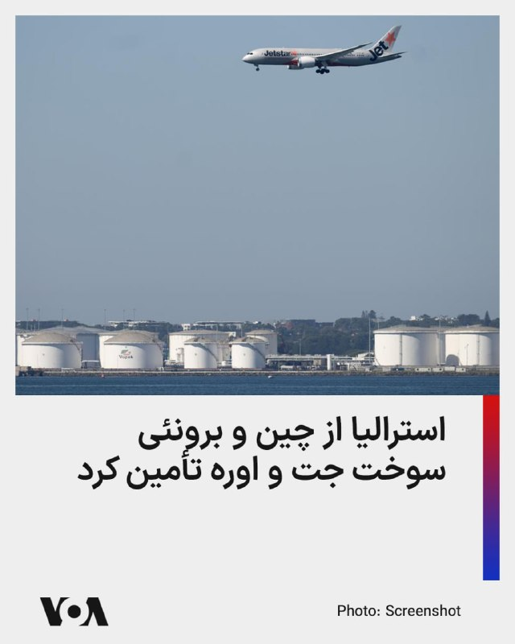

استرالیا از خرید سه محموله سوخت جت از چین و مقدار بیشتری اوره کشاورزی از برونئی خبر داد

دولت استرالیا روز سه‌شنبه اعلام کرد که پس از گفت‌وگوهای میان نخست‌وزیر آنتونی آلبانیزی و نخست‌وزیر چین لی چیانگ، بیش از ۶۰۰ هزار بشکه، معادل حدود ۱۰۰ میلیون لیتر، سوخت جت از اوایل ماه ژوئن وارد خواهد شد.

پکن پس از بسته شدن تنگه هرمز که جریان نفت خام و سوخت را مختل کرده، برای حفاظت از ذخایر داخلی خود، صادرات سوخت را محدود کرده بود.

دولت استرالیا همچنین اعلام کرد که ۳۸ هزار و ۵۰۰ تُن اوره از برونئی برای حمایت از کشاورزان و بخش کشاورزی تأمین کرده است.

هر دو محموله سوخت و کود به ارزش ۷.۵ میلیارد دلار استرالیا (۵.۳۶ میلیارد دلار آمریکا) تأمین شده‌اند.

استرالیا در مقابله با فشارهای تأمین ایجاد شده ناشی از انسداد تنگه هرمز، سازوکاری برای کمک به صنایع کشاورزی و حمل‌ونقل و از طریق ارائه وام، بیمه و کمک مالی ایجاد کرده است.
@FarsiVOA

## FarsiVOA — post 218111

  

وزارت خزانه‌داری آمریکا اعلام کرد شرکت آدانی اینترپرایزس، مستقر در احمدآباد هند، با پرداخت ۲۷۵ میلیون دلار برای حل‌وفصل مسئولیت احتمالی مدنی خود در ارتباط با نقض تحریم‌های ایران موافقت کرده است.

دفتر کنترل دارایی‌های خارجی وزارت خزانه‌داری آمریکا، اوفک، اعلام کرد این توافق مربوط به ۳۲ مورد نقض احتمالی تحریم‌های ایران است. به گفته اوفک، آدانی اینترپرایزس از نوامبر ۲۰۲۳ تا ژوئن ۲۰۲۵ محموله‌های گاز مایع، ال‌پی‌جی، را از یک تاجر مستقر در دبی خریداری کرده بود که مدعی بود این محموله‌ها از عمان و عراق تأمین شده‌اند، اما نشانه‌هایی وجود داشت که منشأ واقعی آنها ایران بوده است.

بر اساس اعلام وزارت خزانه‌داری آمریکا، این شرکت در این دوره باعث شد مؤسسات مالی آمریکایی ۳۲ پرداخت دلاری به ارزش حدود ۱۹۲ میلیون دلار را برای این محموله‌ها پردازش کنند.

رویترز نیز گزارش داد این پرونده در ادامه بررسی‌های آمریکا درباره خرید گاز مایع با منشأ ایرانی از طریق مسیرهای واسطه‌ای مطرح شده بود. آدانی پیش‌تر هرگونه دور زدن عمدی تحریم‌ها را رد کرده بود.
@FarsiVOA

## FarsiVOA — post 218110

  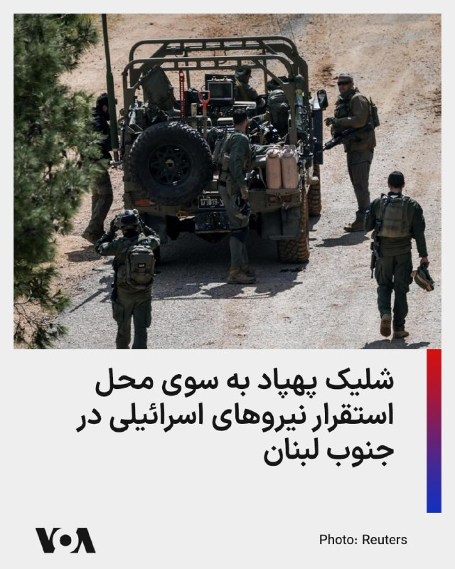

ارتش اسرائیل اعلام کرد که صبح سه‌شنبه یک موشک رهگیر به‌سوی یک پهپاد متعلق به حزب‌الله، بر فراز منطقه‌ای در جنوب لبنان شلیک کرده است.

بر اساس گزارش ارتش اسرائیل، این پهپاد در مدت کوتاهی بر فراز محل استقرار نیروهای نظامی اسرائیل شناسایی شد.

در این حادثه هیچ گزارشی از زخمی شدن افراد منتشر نشده است.
@FarsiVOA

## FarsiVOA — post 218109

🔺لیندزی گراهام: هر توافقی با جمهوری اسلامی باید به تائید کنگره برسد؛ تاکید سناتور آمریکایی بر پایان غنی‌سازی و قطع حمایت از نیابتی‌ها

▪️سناتور جمهوری‌خواه، لیندزی گراهام، روز دوشنبه و پس از آنکه دونالد ترامپ، رئیس جمهوری آمریکا گفت به درخواست رهبران چند کشور عربی حمله برنامه‌ریزی شده روز ‌سه‌شنبه به جمهوری اسلامی را به تعویق انداخته‌است، بار دیگر تاکید کرد که هر توافقی که میان ایالات متحده و جمهوری اسلامی ایران امضا شود «باید، همانند برجام در دوران ریاست‌جمهوری باراک اوباما، برای تأیید به کنگره ارائه شود.»

⬇️ بیشتر بخوانید:
https://ir.voanews.com/a/8151586.html
@FarsiVOA

## FarsiVOA — post 218108

⚡️ایران روزگاری کشوری بود که صدای بازی کودکان در کوچه‌ها بخشی از هویت روزمره‌اش بود. اما اکنون آمارهای رسمی از کاهش شدید نرخ باروری، پیرشدن جمعیت و بسته‌شدن پنجره جمعیتی خبر می‌دهند. روندی که روایتی از فشار اقتصادی، ناامیدی اجتماعی و تغییر عمیق سبک زندگی در ایران امروز است
@FarsiVOA

## DW_Farsi — post 124865

🔶 دنیس اکرت با نامی جدید و برای تیم ایران به جام جهانی می‌رود
 
دنیس اکرت آیِنسا، فوتبالیست متولد بن آلمان، درجام جهانی فوتبال ۲۰۲۶ برای تیم ملی ایران بازی خواهد کرد، اما با نام جدید "دنیس درگاهی".
 
او جایگزین سردار آزمون شده که حدود دو ماه پیش توسط فدراسیون فوتبال ایران از فهرست تیم ملی کنار گذاشته شد.
 
بنا به گزارش "ورزش۳" اکرت آیِنسا روز دوشنبه ۱۸ مه (۲۸ اردیبهشت) راهی ترکیه شد تا به اردوی آماده‌سازی تیم ملی ایران برای جام جهانی بپیوندد. گفته می‌شود فیفا مجوز حضور او در تیم ملی ایران را صادر کرده است.
 
این بازیکن نام خانوادگی "درگاهی" را از پدر ایرانی‌تبارش گرفته است. آناهیتا درگاهی، عمه او‌، از چهره‌های شناخته‌شده سینمای ایران است. مادر این بازیکن ۲۹ ساله اهل اسپانیاست.
 
دنیس اکرت آیِنسا از سال ۲۰۲۴ در باشگاه بلژیکی استاندارد لیژ بازی می‌کند. او که سابقهٔ بازی برای تیم ملی زیر ۱۹ سال آلمان را دارد، برای تیم‌هایی مانند سلتاویگو در لالیگا و همچنین اینگولشتات در لیگ‌های دوم و سوم آلمان به میدان رفته است.
 
اکرت  ۲۹ اسفند ۱۴۰۴ برای اولین بار توسط امیر قلعه‌نویی، سرمربی تیم ملی، برای انجام دو بازی دوستانه مقابل نیجریه و کاستاریکا، در لیست سی‌وپنج‌ نفرهٔ تیم فوتبال ایران قرار گرفت.
@dw_farsi

## DW_Farsi — post 124864

🔶 هرانا: از آغاز جنگ بیش از ۵۰ نفر در ایران اعدام شده‌اند
 
هرانا، مجموعه فعالان حقوق بشر ایران، روز سه‌شنبه ۱۹ مه (۲۹ اردیبهشت) در گزارشی اعلام کرد از زمان شروع حملات آمریکا و اسرائیل علیه ایران در روز نهم اسفند ۱۴۰۴ تا هفته گذشته، دست‌کم چهار هزار و ۲۳ مورد بازداشت و ۵۰ مورد اعدام را در ایران ثبت کرده است.
 
این گزارش با عنوان "میان موشک و سرکوب" بر پایه ۱۷۷ منبع تأییدشده، شامل گزارش‌های منابع آزاد و شبکه میدانی مجموعه فعالان حقوق بشر در داخل کشور، در ۲۴۰ صفحه و به دو زبان فارسی و انگلیسی منتشر شده است. 
 
این نهاد حقوق بشری تأکید کرده که این گزارش با هدف ارائه روایت جامع از کل درگیری تهیه نشده و یافته‌های آن "صرفاً به رویدادهایی محدود می‌شود که در داده‌های این نهاد مستندسازی و راستی‌آزمایی شده‌اند". 
 
به نوشته هرانا نهادهای امنیتی با اتهاماتی چون "جاسوسی"، "تهدید علیه امنیت ملی" و "ارتباط یا ارسال مطالب مربوط به جنگ به رسانه‌های خارجی" شهروندان را بازداشت یا اعدام کرده‌اند. از ۵۰ مورد حکم اعدام که به اجرا گذاشته شده، ۳۲ مورد با اتهامات سیاسی و امنیتی مرتبط بوده‌اند.
 
در این گزارش تصریح شده که مقامات جمهوری اسلامی از جنگ "برای تشدید روایت‌های امنیتی و توجیه بازداشت‌ها، محدودیت آزادی بیان و اعمال خشونت علیه غیرنظامیان استفاده کرده‌اند". در گزارش هرانا همچنین به خاموشی اینرنت به عنوان ابزاری برای سرکوب اشاره شده است.
 
هرانا در گزارش خود به آسیب‌های شهروندان در حملات آمریکا و اسرائیل به ایران اشاره کرده و آورده که در این راستا دست‌کم سه هزار و ۶۳۶ مورد مرگ را مستند کرده است؛ شامل ۱۷۰۱ غیرنظامی، ۱۲۲۱ نیروی نظامی و ۷۱۴ فرد که هویت یا وضعیت آنان قابل شناسایی نبوده است. در این گزارش به کشته شدن ۳۰۷ کودک و زخمی شدن ۲ هزار ۲۱۳ کودک اشاره شده است.
 
مجموعه فعالان حقوق بشر ایران در گزارش خود شماری از الگوهای نگران‌کننده را برجسته کرده و در مورد آن‌ها هشدار داده است، از جمله "ضعف در راستی‌آزمایی اهداف"، "استفاده محدود از نظارت انسانی در برخی فناوری‌های هدف‌گیری"، "هشدار ناکافی پیش از حملات" و "به‌کارگیری تسلیحات انفجاری سنگین در مناطق پرجمعیت".
@dw_farsi

## DW_Farsi — post 124863

  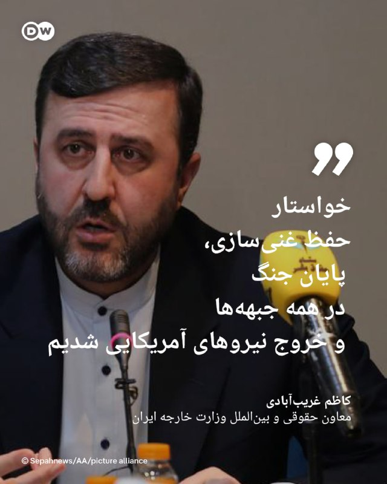

🔶 غریب‌آبادی: خواستار حفظ غنی‌سازی، پایان جنگ در همه جبهه‌ها و خروج نیروهای آمریکایی شدیم
 
کاظم غریب‌آبادی روز سه‌شنبه ۱۹ مه (۲۹ اردیبهشت) با حضور در کمیسیون امنیت ملی و سیاست خارجی مجلس شورای اسلامی، نمایندگان را در جریان روند مذاکرات تهران و واشنگتن و تصمیم‌های اتخاذشده قرار داد. بنا بر گزارش‌ رسانه‌های داخلی ایران، جزئیات اجلاس وزرای امور خارجه کشورهای عضو بریکس که اخیرا با حضور عباس عراقچی در هند برگزار شده بود و نیز اهداف سفر وزیر کشور پاکستان به ایران در نشست غریب‌آبادی با اعضای این کمیسیون مورد بحث و تبادل نظر قرار گرفت.
 
معاون حقوقی و بین‌الملل وزارت خارجه ایران در نشست به این کمیسیون گفت که "حق غنی‌سازی اورانیوم و برخورداری از حقوق هسته‌ای صلح‌آمیز"، "پایان جنگ در همه جبهه‌ها از جمله لبنان" و "آزادسازی دارایی‌های ایران" از موارد ذکرشده در پیشنهاد جمهوری اسلامی به ایالات متحده بوده است.
 
غریب‌آبادی در این نشست ضمن ارائه گزارش از روند مذاکرات و طرح پیشنهادی جمهوری اسلامی به طرف آمریکایی بر "ایستادگی تصمیم‌گیران و اعضای تیم مذاکره‌کننده ایران بر روی اصول" تأکید کرد.
 
@dw_farsi

## DW_Farsi — post 124862

🔶 مرکل، زلنسکی و والسا، جزو نخستین برندگان "نشان لیاقت اروپا"
 
پارلمان اروپا قرار است روز سه‌شنبه ۱۹ ماه مه (۲۹ اردیبهشت) برای نخستین بار "نشان لیاقت اروپا" را به اولین دریافت‌کنندگان آن اعطا کند.
 
آنگلا مرکل، صدراعظم سابق آلمان، ولودیمیر زلنسکی، رئیس جمهور اوکراین و لخ والسا، رئیس جمهور پیشین لهستان، از جمله نخستین برندگان این نشان هستند. زلنسکی شخصاً در مراسم اهدای جایزه در استراسبورگ حضور نخواهد داشت.
 
اتحادیه اروپا اعلام کرده است که این جایزه برای قدردانی از افرادی اعطا می‌شود که در روند همگرایی اروپا نقش داشته‌اند یا در ترویج ارزش‌های بنیادین این اتحادیه کوشیده و از آنها دفاع کرده‌اند.
 
مرکل، زلنسکی و والسا قرار است بالاترین سطح از سه سطح این نشان افتخار را دریافت کنند. دیگر شخصیت‌های شناخته‌شده، از جمله پیترو پارولین، دیپلمات ارشد واتیکان، مایا ساندو، رئیس جمهور مولداوی و ژان-کلود تریشه، رئیس پیشین بانک مرکزی اروپا، سطوح پایین‌تر این نشان را دریافت خواهند کرد.
 
ولفگانگ شوسل، صدراعظم پیشین اتریش و اعضای گروه راک ایرلندی "یوتو" (U2) نیز این جایزه را دریافت خواهند کرد.
@dw_farsi

## DW_Farsi — post 124861

🔶 دیدار پوتین و شی در پکن؛ اندک‌زمانی پس از ترامپ
 
چند روز پس از سفر دونالد ترامپ، رئیس جمهور آمریکا، ولادیمیر پوتین، رئیس کرملین، نیز سه‌شنبه ۱۹ مه (۲۹ اردیبهشت) سفر دو روزه‌ای به چین را آغاز می‌کند. دمیتری پسکوف، سخنگوی کرملین، گفت پوتین با هیأتی متشکل از وزیران و مدیران شرکت‌های دولتی و خصوصی به این سفر می‌رود.
 
به گفت پسکوف، گفت‌وگوها که به دعوت شی جین‌پینگ، رئیس جمهور چین، انجام می‌شود، بر گسترش "شراکت راهبردی ممتاز" میان دو کشور متمرکز خواهد بود.
 
بر اساس اطلاعات رسمی مسکو، روس‌ها و چینی‌ها قصد دارند در مجموع حدود ۴۰ سند امضا کنند. این اسناد از جمله به همکاری در حوزه‌های صنعت، تجارت، حمل‌ونقل و ساخت‌وساز مربوط می‌شوند. همچنین انتظار می‌رود تجاوز نظامی روسیه به اوکراین و نیز جنگ آمریکا و اسرائیل علیه ایران از موضوعات گفت‌وگوها باشد.
 
کرملین تأکید کرده است که سفر پوتین هیچ ارتباطی با دیدار ترامپ از چین ندارد. یوری اوشاکوف، مشاور سیاست خارجی پوتین، گفت تاریخ این سفر از ماه فوریه تعیین شده بوده است.
 
به گفته اوشاکوف، بیست‌وپنجمین سالگرد امضای پیمان حسن همجواری و همکاری دوستانه میان دو کشور نیز از دلایل این سفر است. طبق اعلام کرملین، پوتین همچنین قصد دارد درباره سفر هفته گذشته ترامپ به چین اطلاعات بیشتری کسب کند.
 
در پکن نیز این روایت رد نشده است. با این حال رسانه‌های دولتی چین بر توالی غیرمعمول این دیدارها تأکید کرده‌اند. روزنامه گلوبال تایمز، نزدیک به حزب کمونیست چین، نوشت که پکن بیش از پیش در حال تبدیل شدن به یکی از کانون‌های دیپلماسی جهانی است.
@dw_farsi

## DW_Farsi — post 124860

  

🔶 نیویورک تایمز: ایران از آتش‌بس برای احیای توان موشکی خود استفاده کرده است
 
به گزارش نیویورک تایمز، جمهوری اسلامی از آتش‌بس موقت میان تهران و واشنگتن استفاده کرده است تا قابلیت‌های موشکی خود را احیا کند، پرتابگرهای موشکی خود را از نو مستقر سازد و از آمادگی لازم برای احتمال از سرگیری درگیری‌ها برخوردار شود.
 
این نشریه آمریکایی به نقل از یک مقام نظامی ایالات متحده که نخواست نامش فاش شود گزارش داد، جمهوری اسلامی از زمان برقراری آتش‌بس موقت در ۸ آوریل تا کنون "بسیاری از موشک‌های بالستیک خود را در تأسیسات زیرزمینی که بمباران شده بودند، از عمق زمین بیرون کشیده، پرتابگرهای متحرک را جابه‌جا کرده و تاکتیک‌هایش را برای از سرگیری احتمالی درگیری‌ها تطبیق داده است".
 
در گزارش نیویورک تایمز به نقل از این مقام آگاه آمده است، آمریکا در چارچوب عملیات خود علیه ظرفیت موشکی ایران به صورت عمده ورودی‌های سایت‌های نظامی را مورد حمله قرار داد، اما خود پرتابگر‌ها را نابود نکرد، چرا که آن‌ها در عمق زمین مستقر بودند. ظاهرا ایران توانسته است با سودجویی از فرصت آتش‌بس، بخش درخور توجهی از این سایت‌ها را دوباره فعال کند.
 
@dw_farsi

## DW_Farsi — post 124859

  

🔶 لیندزی گراهام: هر توافقی با ایران باید به تأیید کنگره برسد
 
لیندزی گراهام، سناتور جمهوری‌خواه شامگاه دوشنبه ۱۸ مه (۲۸ اردیبهشت) پس از اعلام به تعویق افتادن حمله برنامه‌ریزی‌شده ایالات متحده به جمهوری اسلامی از سوی ترامپ، با انتشار پستی در شبکه ایکس تأکید کرد، هر توافقی که در پی مذاکرات واشنگتن و تهران حاصل شود، باید به تأیید کنگره آمریکا برسد. 
 
این سناتور آمریکایی تصریح کرد، هر توافقی که میان ایالات متحده و جمهوری اسلامی امضاء شود، "مانند برجام در دوران ریاست‌جمهوری باراک اوباما، باید به منظور تأیید به کنگره ارائه گردد".
 
گراهام خاطرنشان کرد که همانگونه پیشتر گفته است، موضوع ترامپ در رابطه با جمهوری اسلامی این موارد را شامل می‌شود:
·       عدم غنی‌سازی اورانیوم
·       کنترل ایالات متحده بر حدود ۹۰۰ پوند (۴۵۰ کیلوگرم) اورانیوم با غنای بالا
·       بازگشایی تنگه هرمز بدون مداخله‌های ایران
·       ایران باید برنامه موشک‌های بالستیک دوربرود خود و همچنین تلاش برای توسعه سلاح هسته‌ای را متوقف کند
·       جمهوری اسلامی باید پشتیبانی خود از تمامی گروه‌های نیابتی تروریستی در منطقه را کنار بگذارد
 
@dw_farsi

## DW_Farsi — post 124858

🔶 حمله مرگبار به مرکز اسلامی سن دیگو چند کشته به جای گذاشت
 
در پی حمله و تیراندازی به یک مرکز اسلامی در سن دیگو در ایالت کالیفرنیا که روز دوشنبه ۱۸ مه (۲۸ اردیبهشت) روی داد، سه نفر کشته شدند. طبق اعلام پلیس یکی از قربانیان، نگهبان این مرکز بوده است. رسانه‌ها گزارش داده‌اند که دو فرد دیگر از کارکنان این مرکز اسلامی بوده‌اند که افزون بر بزرگ‌ترین مسجد سن دیگو، یک مدرسه را نیز در برمی‌گرفته است.
 
به گفته اسکات وال، رئیس پلیس سن دیگو، فرد نگهبان "نقشی تعیین‌کننده" داشته که این حمله "پیامدهای به مراتب بدتری" به همراه نداشته است. مأموران پلیس جسد کشته‌شدگان را جلوی ساختمان این مرکز پیدا کردند.
 
همچنین اعلام شد که جسد دو فرد مظنون در یک خودروی پارک‌شده پیدا شده است؛ دو جوان ۱۷ و ۱۹ ساله که پس از انجام حمله دست به خودکشی زده‌اند.
 
پلیس سن دیگو اعلام کرد، از آنجایی که حمله، به یک مؤسسه مذهبی صورت گرفته، این حادثه به عنوان "جنایت ناشی از نفرت" در دست بررسی است و از این رو کارآگاهان پلیس فدرال ایالات متحده (اف بی‌آی) نیز در بررسی‌ها و تحقیقات مشارکت دارند.
 
رئیس پلیس سن دیگو افزود، مادر یکی از دو جوان مظنون حدود دو ساعت پیش از وقوع این حمله مرگبار با پلیس تماس گرفته تا مفقود شدن پسرش را به مأموران اطلاع دهد. به گفته پلیس، او نگران بوده که فرزندش دست به خودکشی بزند و سپس متوجه شده که چندین سلاح موجود در خانه و همچنین خودروی او ناپدید شده است.
 
@dw_farsi

## DW_Farsi — post 124857

  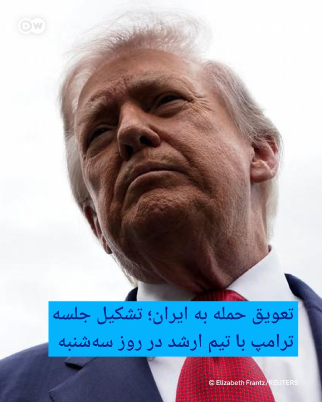

🔶 تعویق حمله به ایران؛ تشکیل جلسه ترامپ با تیم ارشد در روز سه‌شنبه
 
سایت خبری اکسیوس شامگاه دوشنبه ۱۸ مه (۲۸ اردیبهشت) در گزارشی به اعلام به تعویق افتادن حمله ایالات متحده به ایران از سوی دونالد ترامپ پرداخت و به نقل از دو مقام آگاه آمریکایی نوشت، انتظار می‌رود که رئیس‌جمهور آمریکا روز سه‌شنبه ۱۹ مه با تیم ارشد امنیت ملی خود در اتاق وضعیت تشکیل جلسه دهد تا گزینه‌های نظامی [علیه جمهوری اسلامی] را مورد بحث و بررسی قرار دهد.
 
به نوشته اکسیوس ترامپ از زمان آغاز جنگ در ماه فوریه تا کنون "دست کم شش بار ضرب‌الاجل‌های اعلام‌شده را تمدید کرده و حمله‌های برنامه‌ریزی شده علیه جمهوری اسلامی را به تعویق انداخته است".
 
ترامپ عصر دوشنبه با انتشار پستی در شبکه اجتماعی خود، تروث سوشال اعلام کرد، ایالات متحده حمله نظامی "برنامه‌ریزی‌شده" علیه ایران را که قرار بود روز سه‌شنبه انجام شود، "اجرا نخواهد کرد".
 
@dw_farsi

## Persian_Trend_Official — post 14469

  <a href="telegram/content/Persian_Trend_Official_14469_1779188089.webm" target="_blank">🎬 Download video</a>

💢شنیده شدن صدای انفجار در جزیره قشم

▪️ظهر سه شنبه شنیده شدن صدای انفجار در جزیره قشم از سوی ساکنان محلی گزارش شده است.

🔹اخبار تکمیلی متعاقباً منتشر خواهد شد./خبرگزاری مهر

🫆:Tony

📌 @persian_trend_official
پرشین ترند | متفاوت‌ترین کانال نظامی

## Persian_Trend_Official — post 14468

  <a href="telegram/content/Persian_Trend_Official_14468_1779188090.mp4" target="_blank">🎬 Download video</a>

💢ویدیویی منتسب به چوپان عراقی که از پرواز هواپیما های اسرائیلی منتشر کرد و به گفته رسانه ها پیش زمینه لو رفتن پایگاه مخفی اسرائیل در خاک عراق شد.

🫆:Tony

📌 @persian_trend_official
پرشین ترند | متفاوت‌ترین کانال نظامی

## Persian_Trend_Official — post 14467

  

✍یک فروند هواپیمای اختصاصی اسرائیلی از تل‌آویو به مقصد ابوظبی در حال پرواز است.

.
🇮🇱
🇰🇼

👑Phantom
👑

📌 @persian_trend_official
پرشین ترند | متفاوت‌ترین کانال نظامی

## Persian_Trend_Official — post 14466

لینک اسپاتیفای لایو دیشب :

https://open.spotify.com/episode/6bpS3p3rcr8qKiJrfEaSaM?si=JvUGVU-RQ7WWFDKd7fnxMA

## Persian_Trend_Official — post 14465

🔴هشدار آژانس انرژی درباره ذخایر نفت

💢فاتح بیرول، رئیس آژانس بین‌المللی انرژی، اعلام کرد آزادسازی ذخایر راهبردی نفت روزانه حدود ۲.۵ میلیون بشکه به بازار اضافه کرده است، اما این ذخایر نامحدود نیستند.

▪️او همچنین گفت میان وضعیت بازار فیزیکی نفت و معاملات آتی شکاف ادراکی وجود دارد؛ به این معنا که قیمت‌گذاری در بازارهای مالی الزاماً فشار واقعی موجود در عرضه فیزیکی را به‌طور کامل منعکس نمی‌کند.

💢بیرول در ادامه هشدار داد که ذخایر تجاری نفت با سرعت زیادی در حال کاهش است و تنها چند هفته تا افت بیشتر این ذخایر باقی مانده است.

🫆:Tony

📌 @persian_trend_official
پرشین ترند | متفاوت‌ترین کانال نظامی

## Persian_Trend_Official — post 14464

🔴 سنای آمریکا فردا برای هشتمین بار درباره پایان جنگ ایران رأی‌گیری می‌کند

💢بر اساس گزارش‌ها، سنای آمریکا قرار است فردا برای هشتمین بار درباره طرح «اختیارات جنگی» با هدف پایان‌دادن به جنگ با ایران رأی‌گیری کند.

▪️ این رأی‌گیری‌ها از زمان آغاز جنگ تقریباً به‌صورت هفتگی در جریان بوده است

💢طرح اختیارات جنگی با هدف محدودکردن ادامه عملیات نظامی بدون مجوز رسمی کنگره مطرح شده، اما تاکنون تمام تلاش‌ها برای تصویب آن ناکام مانده است.

🫆:Tony

📌 @persian_trend_official
پرشین ترند | متفاوت‌ترین کانال نظامی

## Persian_Trend_Official — post 14463

  <a href="telegram/content/Persian_Trend_Official_14463_1779188092.mp4" target="_blank">🎬 Download video</a>

صبحتون‌ بخیر 🔥❤️

📝 Nick
📌 @persian_trend_official
پرشین ترند | متفاوت‌ترین کانال نظامی

## Persian_Trend_Official — post 14462

  <a href="telegram/content/Persian_Trend_Official_14462_1779188093.mp4" target="_blank">🎬 Download video</a>

▪️ شبتون بخیر 🫶

🫆:Tony

📌 @persian_trend_official
پرشین ترند | متفاوت‌ترین کانال نظامی

## RadioFarda — post 157337

مرگ‌ومیر ابولا در شرق کنگو به ۱۳۱ نفر افزایش یافت؛ ابراز نگرانی سازمان جهانی بهداشت

🔸مقام‌های جمهوری دموکراتیک کنگو روز سه‌شنبه ۲۹ اردیبهشت اعلام کردند که در ۲۴ ساعت گذشته ۲۶ مورد مرگ مشکوک دیگر بر اثر ابولا در شرق این کشور ثبت شده و رئیس سازمان جهانی بهداشت نسبت به گسترش این شیوع عمیقاً ابراز نگرانی کرده است.

🔸با این موارد جدید، شمار قربانیان مرتبط با این شیوع در شرق کنگو به ۱۳۱ نفر رسیده است. بر اساس بولتن روزانه مقامات بهداشتی، ۵۱۶ مورد مشکوک و ۳۳ مورد تأییدشده در کنگو گزارش شده و دو مورد تأییدشده نیز در کشور همسایه، اوگاندا، ثبت شده است.

🔸تدروس آدهانوم گبریسوس، مدیرکل سازمان جهانی بهداشت، روز شنبه شیوع سویه نادر «بوندیبوگیو» از این ویروس را یک وضعیت اضطراری بهداشت عمومی با نگرانی بین‌المللی اعلام کرد. این موضوع کارشناسان را نگران کرده، زیرا ویروس توانسته که طی هفته‌ها بدون شناسایی در منطقه‌ای پرجمعیت از کنگو گسترش یابد.

🔸ژان-ژاک مویِمبه، مدیر مؤسسه ملی تحقیقات زیست‌پزشکی کنگو، به خبرگزاری رویترز گفت که شهر بوتِمبو در استان کیوو شمالی، با جمعیتی چندصد هزار نفری، روز دوشنبه نخستین دو مورد تأییدشده خود را ثبت کرده است.

🔸ابولا از طریق تماس مستقیم با مایعات بدن افراد یا حیوانات آلوده منتقل می‌شود و علائمی مانند تب بالا، استفراغ و خونریزی داخلی و خارجی ایجاد می‌کند.

🔸به گفته سازمان جهانی بهداشت، نرخ مرگ‌ومیر متوسط این بیماری حدود ۵۰ درصد است، هرچند در شیوع‌های گذشته بین ۲۵ تا ۹۰ درصد متغیر بوده است.

🔸تدروس روز سه‌شنبه در ژنو به اعضای مجمع جهانی بهداشت گفت: «من عمیقاً نگران مقیاس و سرعت این همه‌گیری هستم»، و به تعداد موارد گزارش‌شده در مناطق شهری و میان کارکنان بهداشتی اشاره کرد.

🔸نسخه کامل این گزارش را در وب‌سایت رادیوفردا بخوانید.

@RadioFarda

## RadioFarda — post 157336

  

🔸رسانه‌های ایران از آغاز به‌کار دوبارهٔ بورس کشور بعد از ۸۰ روز تعطیلی خبر می‌دهند.

🔸بر اساس این گزارش‌ها، نخستین معاملات بازار سهام در سال ۱۴۰۵ از ساعت ۹ صبح سه‌شنبه ۲۹ اردیبهشت در تالار معاملات بورس تهران آغاز شد.

🔸با این حال روزنامه «دنیای اقتصاد» نوشته بیش از ۴۰ نماد که شرکت‌های آن‌ها در جریان حملات آمریکا و اسرائیل دچار آسیب شده بودند، فعلاً بازگشایی نخواهند شد.

🔸بر اساس این گزارش، عمده نمادهای متوقف در گروه‌های شیمیایی و فلزات اساسی قرار دارند که به‌دلیل بمباران کارخانه‌های پتروشیمی و فولاد امکان فعالیت ندارند. تنها نمادهای بانکی و خودرویی در میان نمادهای آغاز معاملات امروز قرار دارند.

🔸تعدادی از نمادهای صندوق‌های اهرمی نیز که پیشتر گفته شده بود باز نمی‌شوند قرار است امروز بازگشایی شوند ولی محدودیت فروش ۱۰۰ هزار واحد دارند.

@RadioFarda

## RadioFarda — post 157335

  <a href="telegram/content/RadioFarda_157335_1779188095.mp4" target="_blank">🎬 Download video</a>

🔸تصاویری از یک گله قوچ اوریال در پارک ملی سالوک در خراسان‌شمالی که مشغول گشت‌وگذار هستند، منتشر شده است.

🔸قوچ‌ اوریال یا گوسفند وحشی اوریال گروهی از زیرگونه‌های گوسفند وحشی است که در مناطق کوهستانی و تپه‌ماهوری زندگی می‌کند.

🔸گوسفند وحشی به دو گروه زیرگونه‌ای تقسیم می‌شود که گروه غربی آن گوسفند وحشی ارمنی و گروه شرقی آن گوسفند وحشی اوریال است.

🔸گوسفند وحشی اوریال در پاکستان، کشمیر، شمال غربی هندوستان، افغانستان، تاجیکستان، ازبکستان، قزاقستان و ترکمنستان پراکنده است و در ایران در شمال خراسان رضوی، خراسان شمالی، شرق گلستان و شمال شرق استان سمنان دیده می‌شود.

🔸 پارک ملی سالوک در جنوب بجنورد در خراسان‌شمالی واقع شده و زیستگاه پرندگان و حیوانات بسیاری همچون آهو، قوچ، میش است.

@RadioFarda

## RadioFarda — post 157334

اتحادیه اروپا ۱۴ هزار پست مرتبط با سپاه پاسداران در فضای مجازی را هدف قرار داد

🔸آژانس اتحادیه اروپا برای همکاری در اجرای قانون، یوروپل، اعلام کرد در یک اقدام هماهنگ علیه محتوای تروریستی در فضای آنلاین، مجموعاً ۱۴ هزار و ۲۰۰ پست مرتبط با سپاه پاسداران انقلاب اسلامی را هدف قرار داد.

🔸یوروپل، مدیریت اطلاعات جنایی و مبارزه با سازماندهی جنایت و جرایم سازمان‌یافته بین‌المللی مانند تروریسم را بر عهده دارد.

🔸این اقدام ماه‌ها بعد از ۹ بهمن ۱۴۰۴ صورت می‌گیرد که وزیران خارجه اتحادیۀ اروپا پس از سال‌ها فشار از داخل و خارج این بلوک، سرانجام با قرار دادن نام سپاه پاسداران انقلاب اسلامی در فهرست «سازمان‌های تروریستی» موافقت کردند.

🔸این تصمیم پس از آن اتخاذ شد که حکومت ایران در دی‌ماه پارسال، اعتراضات مردمی را به‌صورتی خشونت‌بار سرکوب کرد.

🔸تروریستی اعلام شدن سپاه پاسداران به نهادهای مجری قانون در اتحادیه اروپا اجازه می‌دهد تا علیه فعالیت اعضا و نهادهای حامی این نیروی نظامی اقدام کنند.

🔸به گزارش وب‌سایت یوروپل، حساب اصلی سپاه پاسداران در شبکهٔ ایکس که بیش از ۱۵۰ هزار دنبال‌کننده داشت، در اتحادیه اروپا مسدود شد و هزاران لینک دیگر در چندین پلتفرم حذف شده‌اند یا در حال بررسی برای حذف هستند.

🔸این عملیات به رهبری «واحد ارجاع اینترنتی اتحادیه اروپا» در یوروپل انجام شد و بر شناسایی و مختل کردن حضور آنلاین این گروه که برای انتشار تبلیغات، جذب حامی و جمع‌آوری منابع مالی استفاده می‌شد، تمرکز داشت.

🔸واحد ارجاع اینترنتی که در مرکز اروپایی مبارزه با تروریسم یوروپل مستقر است، وظیفه شناسایی، تحلیل و ارجاع محتوای تروریستی و افراط‌گرایانه خشونت‌آمیز در فضای آنلاین را بر عهده دارد.

🔸نسخه کامل این گزارش را در وب‌سایت رادیوفردا بخوانید.

@RadioFarda

## RadioFarda — post 157333

🔸پلیس آمریکا اعلام کرد که دو نوجوان مسلح روز دوشنبه ۲۸ اردیبهشت به مرکز اسلامی سن‌ دیه‌گو در ایالت کالیفرنیا تیراندازی کردند و یک نگهبان امنیتی و دو مرد دیگر را در بیرون مسجد کشتند.
🔸 اجساد مظنونان بعد در حالی پیدا شد که ظاهراً بر اثر شلیک گلوله به خود جان باخته بودند.

🔸اسکات وال، رئیس پلیس سن‌ دیه‌گو، گفت نیروهای محلی و اف‌بی‌آی در حال بررسی این حمله به‌عنوان «جنایت ناشی از نفرت» هستند. با این حال، مقامات هنوز انگیزه یا عامل مشخصی برای این خشونت اعلام نکرده‌اند.

🔸به گفته پلیس پیش از این حادثه، پلیس از هیچ «تهدید مشخصی» علیه این مسجد یا هیچ مرکز مذهبی، مدرسه یا مکان دیگری مطلع نبوده است.

🔸این حمله در هفته‌ای رخ داد که به عید قربان و همچنین مراسم سالانهٔ حج مسلمانان نزدیک است.

🔸مرکز اسلامی سن‌ دیه‌گو بزرگ‌ترین مسجد در این شهر است و مدرسه‌ای به نام «آکادمی برایت هورایزن» را در خود جای داده که آموزش اسلامی ارائه می‌دهد.

@RadioFarda

## RadioFarda — post 157332

  

🔸سازمان «کمک به گروگان‌ها در سراسر جهان» اعلام کرد که شهاب دلیلی پس از بیش از یک دهه «بازداشت ناعادلانه» در ایران «سرانجام سالم به خانه و کنار خانواده‌اش» در آمریکا بازگشت.
🔸شهاب دلیلی که اقامت دائمی آمریکا را دارد، از سال ۱۳۹۵ در ایران زندانی بود.

🔸سازمان «کمک به گروگان‌ها در سراسر جهان» روز سه‌شنبه ۲۹ اردیبهشت در پستی در شبکهٔ ایکس نوشت: «پس از سفری طولانی از اوین به ایروان و سپس واشینگتن، با خوشحالی اعلام می‌کنیم که شهاب دلیلی پس از بیش از یک دهه بازداشت ناعادلانه در ایران، سرانجام سالم به خانه و در کنار خانواده‌اش بازگشته است».

🔸این نهاد افزوده است: «از همه می‌خواهیم که برای بازگشت هرچه بهتر شهاب به زندگی عادی از او حمایت کنند».

🔸شهاب دلیلی، کاپیتان پیشین شرکت کشتیرانی ایران و ساکن آمریکا، به گفتهٔ خانواده‌اش، برای شرکت در خاکسپاری پدرش به تهران رفته بود و پس از یک اقامت یک هفته‌ای، در حالی که با تاکسی به سوی فرودگاه می‌رفت تا به آمریکا بازگردد، از سوی نیروهای امنیتی بازداشت شد.

@RadioFarda

## RadioFarda — post 157331

  

🔸معاون وزیر خارجه ایران می‌گوید تهران در پیشنهادهای اخیر خود به آمریکا برای پایان جنگ میان دو کشور، خواستار برخورداری از حق غنی‌سازی، خاتمه جنگ در تمام جبهه‌ها از جمله لبنان و خروج نیروهای آمریکایی از محیط پیرامونی ایران شده است.

🔸کاظم غریب‌آبادی که روز سه‌شنبه ۲۹ اردیبهشت برای ارائه گزارشی در مورد روند مذاکرات میان تهران و واشینگتن، در کمیسیون امنیت ملی و سیاست خارجی مجلس حاضر شده بود، از دیگر شروط ایران را «رفع محاصرهٔ دریایی آمریکا، آزادسازی اموال و دارایی‌های ایران، تأمین خسارت‌های وارد شده در جنگ توسط ایالات متحده جهت بازسازی و خاتمه تمامی تحریم‌های یکجانبه و قطعنامه‌های شورای امنیت» اعلام کرد.

🔸ایران و ایالات متحده از زمان آتش‌بس شکننده میان دو کشور در ۱۹ فروردین امسال، درگیر یک دور مذاکره مستقیم و همچنین تبادل پیام‌هایی از طریق پاکستان بوده‌اند تا به توافقی برای پایان جنگ دست یابند.

🔸دونالد ترامپ، رئیس‌جمهور آمریکا، پیشتر پیشنهادهای ایران را «مزخرف» خوانده بود و روز ۲۸ اردیبهشت تهدید کرد که اگر ظرف دو سه روز آینده توافقی حاصل نشود، بار دیگر به ایران حمله نظامی خواهد کرد.

@RadioFarda

## RadioFarda — post 157330

  

🔸لیندزی گراهام، سناتور جمهوری‌خواه نزدیک به دونالد ترامپ، برای چندمین‌بار گفت که هرگونه توافق میان ایالات متحده و ایران باید به تأیید کنگره برسد.

🔸تأکید دوباره او در این زمینه پس از آن صورت گرفت که دونالد ترامپ اعلام کرد به درخواست رهبران چند کشور عربی حاشیه خلیج فارس، حملهٔ برنامه‌ریزی شده روز ‌سه‌شنبه به ایران را به تعویق انداخته ‌است.

🔸گراهام در واکنش در شبکهٔ ایکس نوشت که هر توافقی میان تهران و واشینگتن «باید، همانند برجام در دوران ریاست‌جمهوری باراک اوباما، برای تأیید به کنگره ارائه شود».

🔸او با ابراز تردید نسبت به احتمال دستیابی توافق با جمهوری اسلامی، با این حال اضافه کرد: «اگر بتوانیم از طریق راهکارهای دیپلماتیک و در چارچوب تحقق اهداف امنیت ملی‌مان به این درگیری پایان دهیم، این یک دستاورد بزرگ خواهد بود».

@RadioFarda

## RadioFarda — post 157329

ترامپ می‌گوید به درخواست رهبران عرب خلیج فارس حمله سه‌شنبه به ایران را عقب انداخت

🔸دونالد ترامپ، رئیس جمهور آمریکا، روز دوشنبه ۲۸ اردیبهشت خبر داد حملهٔ تازه‌ به ایران را که برای روز سه‌شنبه ۲۹ اردیبهشت برنامه‌ریزی شده بود، فعلاً به عقب می‌اندازد.

🔸پیش‌تر چنین حمله‌ای به‌طور رسمی اعلام نشده بود و خبرگزاری رویترز نوشته که نتوانسته است مشخص کند آیا واقعاً مقدمات حملاتی فراهم شده بود که می‌توانست به معنای از سرگیری جنگی باشد که ترامپ در ۹ اسفند پارسال آغاز کرد یا نه.

🔸آقای ترامپ در شبکه اجتماعی خود، تروث‌ سوشال، توضیح داده است که این حمله را به درخواست «امیر قطر، ولیعهد عربستان سعودی و رئیس امارات متحده عربی» به تعویق انداخته است.

🔸او نوشته که این سه رهبر جهان عرب، «از من خواسته‌اند حملهٔ نظامی برنامه‌ریزی‌شده‌مان علیه ایران را که قرار بود فردا انجام شود، متوقف کنم؛ زیرا اکنون مذاکرات جدی در جریان است و به نظر آن‌ها، به‌عنوان رهبران بزرگ و متحدان ما، توافقی حاصل خواهد شد که برای ایالات متحده آمریکا، همچنین همه کشورهای خاورمیانه و فراتر از آن، بسیار قابل قبول خواهد بود».

🔸او جزئیاتی درباره توافق مورد بحث ارائه نکرد،‌ اما تأکید کرد که «این توافق، مهم‌تر از همه، شامل این خواهد بود که ایران هیچ سلاح هسته‌ای نداشته باشد».

🔸رئیس‌جمهور آمریکا ساعاتی پیشتر در واکنش به پاسخ تازهٔ تهران به پیشنهادات آمریکا گفته بود که قرار نیست امتیازی به ایران بدهد. او در ادامه تهدید کرده بود که ایران می‌داند «خیلی زود چه اتفاقی خواهد افتاد».

🔸ایران روز دوشنبه اعلام کرد که به پیشنهاد جدید آمریکا با هدف پایان دادن به جنگ پاسخ داده است و افزود که تبادل نظر میان طرفین همچنان ادامه دارد.

🔸نسخه کامل این گزارش را در وب‌سایت رادیوفردا بخوانید.

@RadioFarda

## RadioFarda — post 157328

پنج نفر در حمله به مرکز اسلامی سن‌ دیه‌گو از جمله دو مهاجم کشته شدند

🔸پلیس آمریکا اعلام کرد که دو نوجوان مسلح روز دوشنبه ۲۸ اردیبهشت به مرکز اسلامی سن‌ دیه‌گو در ایالت کالیفرنیا تیراندازی کردند و یک نگهبان امنیتی و دو مرد دیگر را در بیرون مسجد کشتند. اجساد مظنونان بعد پیدا شد که ظاهراً بر اثر شلیک گلوله به خود جان باخته بودند.

🔸اسکات وال، رئیس پلیس سن‌ دیه‌گو، گفت نیروهای محلی و اف‌بی‌آی در حال بررسی این حمله به‌عنوان «جنایت ناشی از نفرت» هستند. با این حال، مقامات هنوز انگیزه یا عامل مشخصی برای این خشونت اعلام نکرده‌اند.

🔸مقامات گفتند تمامی کودکانی که در مدرسه روزانه داخل مجموعه مسجد حضور داشتند، پس از تیراندازی که حدود ساعت ۱۱:۴۰ پیش از ظهر به وقت محلی رخ داد، سالم هستند.

🔸وال در یک کنفرانس خبری عصرگاهی گفت که مادر یکی از مظنونان حدود دو ساعت پیش از حادثه با پلیس تماس گرفته و گزارش داده بود که پسرش، که او را دارای «افکار خودکشی» توصیف کرده، با سه اسلحه متعلق به او و خودرویش از خانه فرار کرده است.

🔸به گفته رئیس پلیس، مادر گفته بود که پسرش همراه یک فرد دیگر است و هر دو لباس مبدل به تن دارند. پلیس برای یافتن آن‌ها اقدام کرده و به‌عنوان اقدام احتیاطی نیروهایی را به یک مرکز خرید نزدیک و دبیرستان پسر اعزام کرده بود، که در همین حین تماس‌هایی درباره تیراندازی در مسجد دریافت شد.

🔸وال از افشای محتوای یادداشتی که به گفته او توسط مادر این نوجوان پیدا شده بود، خودداری کرد.

🔸نسخه کامل این گزارش را در وب‌سایت رادیوفردا بخوانید.

@RadioFarda

## RadioFarda — post 157327

  

🔸حامد تیزرویان، عکاس حیات‌وحش و فعال محیط زیست، در ساری بازداشت شده است.

🔸به گفته زینب رحیمی، روزنامه‌نگار حوزه محیط زیست، آقای تیزرویان روز ۱۴ اردیبهشت ۱۴۰۵، بازداشت شده و موبایل و دیگر وسایل الکترونیکی او ضبط شده است.

🔸اتهام مطرح‌شده علیه آقای تیزرویان «اجتماع و تبانی با هدف اقدام علیه امنیت ملی» عنوان شده است.

🔸بازداشت او در پی انتشار مطالبی انتقادی درباره کشتار معترضان در دی‌ماه و همچنین اعتراض به اعدام‌ها در شبکه‌های اجتماعی صورت گرفته است.

🔸آقای تیزرویان از عکاسان برجسته و سرشناس حیات وحش است و ثبت عکس‌های کمیاب از حیات وحش ایران از جمله خرس قهوه‌ای و مرال به عنوان گونه‌های‌ در معرض خطر انقراض، بخشی از کارنامه کاری این عکاس حیات وحش است.

🔸بازداشت فعالان محیط زیست در ایران سابقه دارد.ایمان معماریان، دامپزشک حیات‌وحش و فعال محیط زیست، اول اردیبهشت در تهران بازداشت شده است. فریبرز حیدری، عکاس حیات‌وحش، دوم بهمن‌ماه سال گذشته در منزل خود بازداشت شد و پس از بیش از دو ماه، در ۱۷ فروردین آزاد شد. همچنین آرش نیکخو، فعال محیط زیست در یاسوج، در بهمن ۱۴۰۴ بازداشت و مدتی بعد آزاد شد.

@RadioFarda

## RadioFarda — post 157325

  

🔸پایگاه خبری حقوق بشری «هرانا» می‌گوید از زمان شروع حملات آمریکا و اسرائیل به ایران، تا هفته گذشته، دست‌کم چهار هزار و ۲۳ بازداشت و ۵۰ مورد اعدام را در ایران ثبت کرده است.

🔸بر اساس اعلام این گروه حقوق بشری مستقر در آمریکا، این افراد با اتهاماتی چون «جاسوسی»، «تهدید علیه امنیت ملی» و ارتباط یا ارسال مطالب مربوط به جنگ به رسانه‌های خارجی بازداشت یا اعدام شده‌اند.

🔸بنابر این گزارش که «میان موشک و سرکوب» نام دارد، مقام‌های ایران از جنگ «برای تشدید روایت‌های امنیتی و توجیه بازداشت‌ها، محدودیت آزادی بیان و اعمال خشونت علیه غیرنظامیان استفاده کرده‌اند.»

🔸هرانا افزوده که «شرایط در مراکز بازداشت به‌شدت وخیم‌تر شده، در حالی که مقام‌ها ایست‌های بازرسی را گسترش داده، محدودیت‌های رفت‌وآمد را تشدید کرده و یک خاموشی طولانی‌مدت اینترنت را اعمال کرده‌اند که سطح اتصال کشور را به حدود یک درصد میزان عادی کاهش داده است.»

🔸هرانا همچنین نوشته که در فاصله ۹ اسفند ۱۴۰۴ تا ۲۳ اردیبهشت ۱۴۰۵، ۵۰ مورد اعدام را مستند کرده است که ۳۲ مورد از آن‌ها با اتهامات سیاسی و امنیتی مرتبط بوده‌اند.

@RadioFarda

## RadioFarda — post 157324

  <a href="https://t.me/radiofarda/157324" target="_blank">📎 Download file</a>

📻بشنوید: سرخط خبرها با رادیوفردا، ۲۹ اردیبهشت ۱۴۰۵‌

@RadioFarda

## IranianMinds — post 20380

  

🔴 اکانت اسرائیل به فارسی:

بسیجی‌های زیادی از به درک واصل شدن خامنه‌ای خوشحالن، نه؟
هر شب تو خیابون عروسی دارن…

@IranianMinds

## IranianMinds — post 20379

  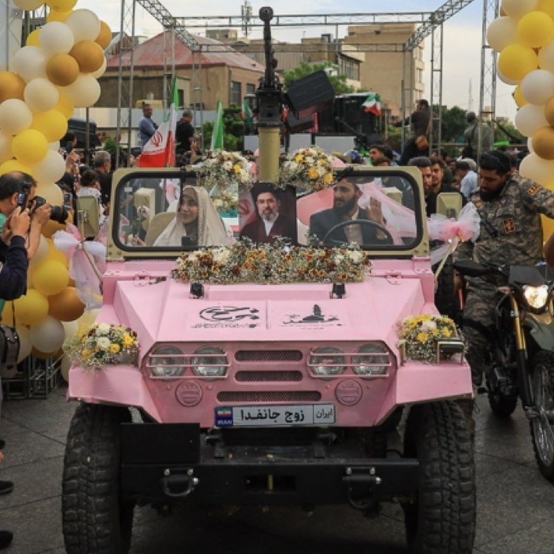

این چی بود من دیدم

@IranianMinds

## IranianMinds — post 20378

  <a href="telegram/content/IranianMinds_20378_1779188102.webm" target="_blank">🎬 Download video</a>

💥 با هر ثبت نام 
🅰️
🅰️
🅰️ هزار تومن جایزه بگیرید

✔️ میتونید شرط‌بندی کنید و بونوس را به موجودی واقعی تبدیل کنید

⚽️  پوشش کامل مسابقات ورزشی 

💯  پیش‌بینی با بهترین ضرایب 

⭐️ تجربه سریع و حرفه‌ای

💰پرداخت مستقیم و سریع بدون واسطه، بدون دردسر، واریز و برداشت در سریع‌ترین زمان ممکن

☑️ کانال تلگرام: 

➡️ @winro_io  

🎁 هدیه خود را با ثبت نام در سایت دریافت کنید: 

➡️ Winro.io
R29
سایت اصلی در روزهای آینده بازگشایی خواهد شد A
💎

## IranianMinds — post 20377

🔴 پاکستان :

احتمال اینکه جنگ مجدد شروع بشه خیلی کمه و دو طرف دارن به توافق میرسن.

@IranianMinds

## IranianMinds — post 20376

  

🔴 پولیتیکو :

دولت ترامپ پس از ماه‌ها فشار اقتصادی که نتوانست حکومت کوبا را به انجام اصلاحات وادار کند، حالا در حال بررسی گزینه اقدام نظامی علیه هاواناست.

مقام‌های آمریکایی می‌گویند کاخ سفید از بی‌نتیجه ماندن تحریم‌ها، محدودیت‌های سوخت و فشارهای دیپلماتیک ناامید شده.

گفته می‌شود گزینه‌های نظامی از حملات هوایی محدود تا عملیات گسترده‌تر برای بی‌ثبات کردن حکومت کوبا را شامل می‌شود.

همچنین گزارش‌ها حاکی از آن است که فرماندهی جنوبی ارتش آمریکا در حال آماده‌سازی سناریوهای احتمالی است، هرچند هنوز تصمیم نهایی گرفته نشده.

@IranianMinds

## IranianMinds — post 20375

  <a href="telegram/content/IranianMinds_20375_1779188103.mp4" target="_blank">🎬 Download video</a>

🔴 ترامپ تو سخنرانی دیشبش :

شما دوتا خانوم چقدر خوشگلید , بیاید اینجا پیش من ببینم

@IranianMinds

## IranianMinds — post 20374

🔴 بعد از ۸۰ روز بورس ایران هم باز شد.

@IranianMinds

## IranianMinds — post 20372

قدرت پدافندی خاورمیانه

@IranianMinds

## IranianMinds — post 20371

  <a href="telegram/content/IranianMinds_20371_1779188105.mp4" target="_blank">🎬 Download video</a>

🔴 رئیس‌جمهور ترامپ درباره ایران:
ما کشوری را که قرار بود سلاح هسته‌ای داشته باشد، عملاً نابود کردیم.

ما می‌توانیم همین الان برویم و بازسازی آن‌ها ۲۵ سال طول می‌کشد، و آخرین چیزی که به آن فکر می‌کنند، به نظر من، هسته‌ای است. حالا آن‌ها باید این را به صورت مکتوب بیان کنند.

ما ارتش آن‌ها را کاملاً نابود کردیم. رهبری آن‌ها را نابود کردیم.

@IranianMinds

## IranianMinds — post 20370

  <a href="telegram/content/IranianMinds_20370_1779188107.webm" target="_blank">🎬 Download video</a>

💥 با هر ثبت نام 
🅰️
🅰️
🅰️ هزار تومن جایزه بگیرید

✔️ میتونید شرط‌بندی کنید و بونوس را به موجودی واقعی تبدیل کنید

⚽️  پوشش کامل مسابقات ورزشی 

💯  پیش‌بینی با بهترین ضرایب 

⭐️ تجربه سریع و حرفه‌ای

💰پرداخت مستقیم و سریع بدون واسطه، بدون دردسر، واریز و برداشت در سریع‌ترین زمان ممکن

☑️ کانال تلگرام: 

➡️ @winro_io  

🎁 هدیه خود را با ثبت نام در سایت دریافت کنید: 

➡️ Winro.io
A28
سایت اصلی در روزهای آینده بازگشایی خواهد شد A
💎

## BBCPersian — post 281474

  

🔻تابلویی از جکسون پولاک، هنرمند برجسته آمریکایی، در حراجی نیویورک به قیمت رکوردشکن ۱۸۱/۲ میلیون دلار فروخته شد.

به این ترتیب، این نقاشی به چهارمین اثر هنری گران‌قیمت تاریخ حراج‌ها تبدیل شد و در عین حال، رکورد تازه‌ای را هم برای آثار پولاک برجا گذاشت؛ قیمت فروش آن، تقریباً سه برابر رکورد قبلی فروش آثار این نقاش اکسپرسیونیست انتزاعی است.

این اثر با عنوان «شماره ۷ اِی، ۱۹۴۸» ترکیبی از چکه‌های رنگ سیاه با رگه‌هایی از رنگ قرمز را بر روی بومی عظیم به طول بیش از سه متر به تصویر می‌کشد.

در حراجی دوشنبه‌شب مؤسسه کریستی، در کمتر از سه ساعت آثاری هنری به ارزش بیش از یک میلیارد دلار به فروش رفت.

مراسم حراجی دیشب همچنین شاهد ثبت چند رکورد دیگر، از جمله برای آثار خوان میرو و مارک روتکو بود.

📸Reuters
@BBCPersian

## BBCPersian — post 281473

🔻بقایی اتهام صدر‌اعظم آلمان به ایران درباره حمله به تاسیسات هسته‌ای امارات را رد کرد

سخنگوی وزارت خارجه اتهام صدراعظم آلمان را تکذیب کرد که گفته بود ایران در حمله به نزدیکی نیروگاه هسته‌ای امارات متحده عربی نقش داشته است.

اسماعیل بقایی به زبان آلمانی در شبکه ایکس، فریدریش مرتس را به «ریاکاری» متهم کرد: «حملات آشکار آمریکا و اسرائیل به تاسیسات هسته‌ای ایمن ایران (تحت نظارت آژانس) محکوم نمی‌شود، بلکه با بهانه‌هایی توجیه می‌شود. اما وقتی عملیات پرچم دروغین انجام می‌شود که حتی خود امارات رسما به ایران نسبت نداده است، همان صداها ناگهان زبان 'حقوق بین‌الملل' و 'امنیت منطقه' را به کار‌ می‌گیرند.»

آقای بقایی در ادامه نوشت: «اگر حمله به تأسیسات هسته‌ای تهدیدی برای مردم منطقه است، این اصل باید برای همه کشورها یکسان باشد نه فقط زمانی که مصالح سیاسی غرب اقتضا کند.»

فریدریش مرتس، صدر‌اعظم آلمان، دیروز «حملات هوایی تازه ایران به امارات و دیگر شرکا» را محکوم کرد و گفته بود که حمله به «تاسیسات هسته‌ای» تهدیدی برای امنیت مردم سراسر منطقه است.

امارات متحده روز یکشنبه گفت که در حمله پهپادی، ژانراتور برق بیرون محوطه نیروگاه هسته‌ای براکه در نزدیکی ابوظبی آتش گرفته است. امارات در بیانیه‌هایش نامی از کشوری نبرد و فقط گفت پهپاد از «مرز غربی» وارد شده بود.

https://bbc.in/4eVQ6MZ
@BBCPersian

## BBCPersian — post 281472

🔻بورس تهران در غیاب بعضی نمادها، بعد از ۸۰ روز آغاز به کار کرد

معاملات سهام در بازار بورس تهران بعد از ۸۰ روز تعطیلی فعالیت خود را از سر گرفت؛ بازار بورس بعد از حملات آمریکا و اسرائیل به ایران در نهم اسفند ماه پارسال و آغاز جنگ تعطیل شده بود.

با وجود بازگشایی بازار سرمایه، معاملات بطور کامل از سر گرفته نشده و بر اساس اعلام سازمان بورس، ۴۲ نماد همچنان بسته مانده‌اند و آغاز معاملات آنها به زمان دیگری موکول شده است.

نمادهایی که بسته مانده‌اند حدود ۳۵ درصد ارزش بازار را شامل می‌شوند و بعضی شرکت‌های متولی این نمادها در جریان جنگ آمریکا و اسرائیل با ایران آسیب دیدند.

در ساعات ابتدایی فعالیت امروز بازار، معاملات پرنوسان بود و تا ساعت ۱۰ و نیم صبح بوقت محلی(تهران) شاخص کل ۴۰۸۰ واحد افت کرد.

به گزارش رسانه‌های اقتصادی تهران، شاخص کل بورس تا ساعت ۱۰ صبح تهران به عدد ۳ میلیون و ۷۱۰ هزار واحد رسید.

شاخص کل در اوایل بهمن ماه پارسال تا رقم ۴‌/۴ میلیون واحد هم پیش رفته بود.

حجت‌اله صیدی، رئیس سازمان بورس و اوراق بهادار تهران امروز در مراسم بازگشایی معاملات بورس «ابهام ناشی از شرایط جنگ» و «گزارش مالی شرکت‌ها» را دلیل بسته ماندن ۸۰ روزه بورس عنوان کرد.

بنابر اعلام سازمان بورس بیش از ۵۰۰ شرکت در معاملات امروز حضور داشتند.

https://bbc.in/3RxuaOu
@BBCPersian

## BBCPersian — post 281471

🔻افزایش ساعات فعالیت دو فرودگاه اصلی در تهران

به گفته مجید اخوان، سخنگوی سازمان هواپیمایی کشوری در ایران ساعات فعالیت دو فرودگاه اصلی در تهران، یعنی مهرآباد و امام خمینی، افزایش یافته است.

بر این اساس، این دو فرودگاه از ساعت ۴:۳۰ صبح تا نه و نیم شب فعالیت خواهند داشت و «تمامی پروازهای داخلی و بین‌المللی می‌توانند طبق اطلاعیه هوانوردی صادرشده از سوی سازمان هواپیمایی کشوری، در این دو فرودگاه انجام شود.»

به گفته آقای اخوان با افزایش ساعات کاری فرودگاه‌ها، تاخیر در پروازها «کاهش خواهد یافت.»

پروازهای خارجی از ایران که از زمان شروع جنگ در نهم اسفند سال گذشته متوقف شده بود، در اوایل اردیبهشت از سر گرفته شد.

آمریکا و اسرائیل در طول جنگ شماری از فرودگاه‌ها و هواپیماهای ایران را هدف حملات هوایی قرار دادند.

https://bbc.in/4umE58h
@BBCPersian

## BBCPersian — post 281470

🔻رئیس کمیسیون امنیت ملی مجلس ایران: تنگه هرمز تا ابد اهرم استراتژیک خواهد بود

رئیس کمیسیون امنیت ملی و سیاست خارجی مجلس شورای اسلامی گفت که تنگه هرمز «برای همیشه در اختیار و مدیریت» ایران باقی خواهد ماند.

ابراهیم عزیزی به خبرگزاری ایسنا گفت که تنگه هرمز «یک اهرم اقتصادی، سیاسی و نظامی تمام‌عیار است که تا ابد در اختیار و مدیریت ملت رشید و با اقتدار ایران خواهد بود.»

او با هشدار به کشورهایی که «به هر دلیلی سودای قدرت‌نمایی در تنگه هرمز دارند»،‌ افزود: «با اقتدار کامل پیش می‌رویم و با هیچ‌کس تعارف نداریم.»

آقای عزیزی تاکید کرد که کنترل و مدیریت این آبراه از «حقوق مسلم ایران» است و هشدار داد که «هرگونه اقدام خصمانه یا تلاش برای محدود کردن نفوذ و حاکمیت ایران در این منطقه، با پاسخ قاطع و مقتدرانه مواجه خواهد شد.»

https://bbc.in/3RhcGpK
@BBCPersian

## BBCPersian — post 281469

🔻پیام ویدئویی پوتین به مردم چین

کرملین پیش از سفر ولادیمیر پوتین به پکن در روز سه‌شنبه، یک پیام ویدیویی از رئیس‌جمهور روسیه خطاب به مردم چین منتشر کرد.

در سخنانی سرشار از تمجید از رهبر چین، آقای پوتین از شی جین پینگ «دوست خوب و قدیمی» خود قدردانی کرد و گفت روابط دو کشور به «سطحی واقعاً بی‌سابقه» رسیده است.

آقای پوتین تاکید کرد که اتحاد راهبردی نزدیک روسیه و چین نقشی مهم و ثبات‌بخش در صحنه جهانی ایفا می‌کند.

سفر آقای پوتین به پکن تنها چند روز بعد از آن انجام می‌شود که آقای شی میزبان دونالد ترامپ بود.

https://bbc.in/4tNAGOt
@BBCPersian

## BBCPersian — post 281460

⭕️افزایش حملات دریایی در بحبوحه جنگ ایران؛ ناخدایی که به دزدان دریایی گفت: «شلیک نکنید، مسلمانم»

✍️ام. ایرهام، لینی بارون و فاطمه معلم

شامگاه شرجی یکی از روزهای آوریل، اندکی پس از نماز مغرب، تلفن سانتی سانایا با پیامی لرزید که مدت‌ها از رسیدنش می‌ترسید.

همسرش ناخدا نفت‌کشی بود که در میانه جنگ آمریکا و اسرائیل علیه ایران، محموله‌هایی را در سراسر خاورمیانه جابه‌جا می‌کرد.

ناخدا آشاری سامادیکون روز ۲ آوریل از امارات متحده عربی به راه افتاده بود. او در حوالی تنگه هرمز به‌سختی از پرتابه‌ها جان سالم به در برد، اما در ادامه مسیر، وارد آب‌هایی شد که در محدوده فعالیت دزدان‌دریایی قرار داشت.

آشاری که پدر دو فرزند است، در تماس‌هایی که از کشتی با خانواده‌اش در روستای زادگاهش در جزیره سولاوسی اندونزی می‌گرفت، می‌کوشید آرام به نظر برسد و به آن‌ها اطمینان بدهد. روستای او در میان ردیف‌هایی از درختان جک‌فروت قرار دارد. او به خانواده‌اش گفته بود که برای دولت نفت حمل می‌کند، «پس ان‌شاءالله اتفاقی نمی‌افتد».

📸BBC/ Getty/ Reuters

https://bbc.in/4nBAoJb
@BBCPersian

## BBCPersian — post 281459

🔻انفجارهای کنترل‌شده در شمال اصفهان

روابط عمومی سپاه پاسداران جمهوری اسلامی در استان اصفهان از احتمال شنیده شدن صدای انفجارهای کنترل شده در محدوده شمال اصفهان، خیابان کاوه خبر داده است.

به گزارش رسانه‌های ایرانی این انفجارها امروز سه‌شنبه، ۲۹ اردیبهشت‌ماه از ساعت ۸ صبح تا ۱۲ ظهر به وقت محلی انجام می‌شود.

در روزهای گذشته نیز مقام‌های ارتش جمهوری اسلامی از از انفجار کنترل شده بمب‌های عمل نکرده در استان‌های فارس و کهگیلویه و بویراحمد خبر داده بود.

https://bbc.in/4wtkF2S
@BBCPersian

## BBCPersian — post 281452

🔻چرا پهپادهای کوچک حزب‌الله برای اسرائیل دردسرساز شده است؟

✍️لوک اونگر و آدام دربین
بی‌بی‌سی وریفای

حزب‌الله لبنان استفاده از پهپادهای کوچک «دید اول‌شخص» یا اف‌پی‌وی را برای حمله به اسرائیل افزایش داده است؛ از جمله سامانه‌هایی که با کابل‌های فیبر نوری هدایت می‌شوند تا بتوانند از سامانه‌های پیشرفته دفاعی عبور کنند.
«بی‌بی‌سی وریفای» از ۲۶ مارس تاکنون ۳۵ ویدیو منتشرشده از سوی این گروه شبه‌نظامی لبنانی را مکان‌یابی کرده است. این ویدیوها حمله به سربازان اسرائیلی، خودروهای زرهی و سامانه‌های پدافند هوایی در جنوب لبنان و شمال اسرائیل را نشان می‌دهند.
کارشناسان به بی‌بی‌سی وریفای گفته‌اند ارتش اسرائیل «تاکنون نتوانسته هیچ راهکار موثری برای مقابله» با این پهپادهای کوچک پیدا کند، زیرا این پهپادها به راحتی می‌توانند از سامانه‌های شناسایی عبور کنند.

BBC/ Reuters / GettyImages/ Hezbollah Military Media/Global Images Ukraine via Getty Images

https://bbc.in/4nI5AGW
@BBCPersian

## idfinfarsi — post 11606

❌ارتش اسرائیل یک تروریست از گروه تروریستی حماس را که تهدیدی برای نیروهای ما بود و در قتل‌عام ۷ اکتبر به داخل خاک اسرائیل نفوذ کرده بود، به هلاکت رساند

⭕️دیروز (دوشنبه)، نیروهای تیم رزمی تیپ ۱۸۸ که در جنوب نوار غزه فعالیت می‌کنند، یک تروریست از گروه تروریستی حماس را شناسایی کردند که از خط زرد عبور کرده و به‌گونه‌ای به نیروها نزدیک شده بود که تهدیدی فوری محسوب می‌شد.

⭕️بلافاصله پس از شناسایی، نیروی هوایی با هدایت نیروهای زمینی این تروریست را برای رفع تهدید به هلاکت رساند.

⭕️تروریستی که به هلاکت رسید، در قتل‌عام ۷ اکتبر به داخل خاک اسرائیل نفوذ کرده بود و در دوره اخیر تلاش داشت طرح‌های تروریستی علیه نیروهای ارتش اسرائیل را اجرا کند.

🔻نیروهای ارتش اسرائیل در فرماندهی جنوب مطابق توافق در منطقه مستقر هستند و به فعالیت برای رفع هرگونه تهدید فوری ادامه خواهند داد.

## Dirty_Kids — post 389726

  

🌪وقتی اینترنت طوفانیه... کافیه بادبان ها رو بکشی تا

⚫️با بالاترین کیفیت ممکن
⚡️ 

⚫️100 هزار تومان شارژ هدیه 
🎁

⚫️پایین ترین قیمت گیگی 250
🌐 

⚫️و ارائه پورسانت %10 در ازای هر معرفی
💼

بتونی یه اتصال پایدار با پشتیبانی 24 ساعته داشته باشی
🚀

بادبان راهتو باز می‌کنه
⛵️

R29

🛡@BadBan_VPN | کانال 

🤖@BadBan_VPNBot | ربات 

📞@BadBan_VPNSupport | پشتیبانی

## Dirty_Kids — post 389725

  

یه مسافر که شباهت زیادی به مایکل جکسون داشته، تو یه اتوبوس توی مکزیک دیده شد.
یعنی ممکنه زنده باشه؟😐

@Dirty_Kids 👻

## Dirty_Kids — post 389724

  <a href="telegram/content/Dirty_Kids_389724_1779188109.mp4" target="_blank">🎬 Download video</a>

اظهار نظر محمدحسین عظیمی (دبیر کل جبهه انقلاب اسلامی) در مورد مسیح علی‌نژاد و گلشیفته فراهانی: عامل دستگاه امنیتی در ایران بودند!

@Dirty_Kids 👻

## Dirty_Kids — post 389723

  

🌪وقتی اینترنت طوفانیه... کافیه بادبان ها رو بکشی تا

⚫️با بالاترین کیفیت ممکن
⚡️ 

⚫️100 هزار تومان شارژ هدیه 
🎁

⚫️پایین ترین قیمت گیگی 250
🌐 

⚫️و ارائه پورسانت %10 در ازای هر معرفی
💼

بتونی یه اتصال پایدار با پشتیبانی 24 ساعته داشته باشی
🚀

بادبان راهتو باز می‌کنه
⛵️

R29

🛡@BadBan_VPN | کانال 

🤖@BadBan_VPNBot | ربات 

📞@BadBan_VPNSupport | پشتیبانی

## Dirty_Kids — post 389722

  <a href="telegram/content/Dirty_Kids_389722_1779188112.mp4" target="_blank">🎬 Download video</a>

دیگه صرف نداره یدونه یدونه این حشریارو عقد کنن، بصورت گوسفندی گله‌وار عقدشون میکنن برن جهاد نکاح

@Dirty_Kids 👻

## Dirty_Kids — post 389721

  <a href="telegram/content/Dirty_Kids_389721_1779188114.mp4" target="_blank">🎬 Download video</a>

پیت اَدای ترامپو دراورد 😂😂

مرتیکه ی جذاب 😂🤦🏻‍♀️

@Dirty_Kids 👻

## Dirty_Kids — post 389720

  <a href="telegram/content/Dirty_Kids_389720_1779188115.webm" target="_blank">🎬 Download video</a>

☢️خفن ترین و‌ قدیمی ترین  انالیزور  ایران ینی دکتر بت 
👍 
🔴هیچ سایت بتی دوست نداره شما کانال دکتر بت رو پیدا کنین چون خیلی سود میکنید🤷‍♂ رایگان بهترین شرط هارو براتون میذاره حتی هزار تومن هم دریافت نمیکنه روزانه میتونی از پیش بینی فوتبال باهاش پول در بیاری…

## Dirty_Kids — post 389719

  <a href="telegram/content/Dirty_Kids_389719_1779188116.webm" target="_blank">🎬 Download video</a>

☢️خفن ترین و‌ قدیمی ترین  انالیزور  ایران ینی دکتر بت 
👍

🔴هیچ سایت بتی دوست نداره شما کانال دکتر بت رو پیدا کنین چون خیلی سود میکنید🤷‍♂

رایگان بهترین شرط هارو براتون میذاره
حتی هزار تومن هم دریافت نمیکنه
روزانه میتونی از پیش بینی فوتبال باهاش پول در بیاری 👌
A28
اگ اهل پیش بینی فوتبالی این کانال اصلا از دست ندین👇

✅https://t.me/+4_ADqwB9e-QwYjlk

✅https://t.me/+4_ADqwB9e-QwYjlk

## Dirty_Kids — post 389718

  

#بخوابیم

@Dirty_Kids 👻

## Dirty_Kids — post 389717

  <a href="telegram/content/Dirty_Kids_389717_1779188116.mp4" target="_blank">🎬 Download video</a>

ماشین عروس مسلح به مسلسل سنگین در شوی حکومتی موسوم به «جشن زوج‌های جانفدا» در میدان «امام حسین» تهران به نمایش درآمد.

سپاه محمد رسول‌الله تهران بزرگ ٢٨ اردیبهشت این مراسم را برگزار کرد.

@Dirty_Kids 👻

## Hranews — post 113034

شهرستان دماوند؛ یک شهروند به دلیل استفاده از استارلینک بازداشت شد

❗️
❗️
❗️
❗️
❗️– فرمانده انتظامی شهرستان دماوند از #بازداشت یک شهروند در این شهرستان به دلیل آنچه استفاده از “تجهیزات استارلینک” عنوان کرده است، خبر داد. به گفته وی، از این فرد سه دستگاه استارلینک و تجهیزات مربوطه ضبط شده است.

ادامه مطلب

↘️
@hranews_bot تماس ✉️ - @Hranews کانال هرانا 🆑

## Hranews — post 113033

  

روز دوشنبه، هرانا با انتشار گزارشی در ۲۴۰ صفحه و به دو زبان فارسی و انگلیسی، به بررسی درگیری نظامی میان ایالات متحده و اسرائیل با ایران، در بازه زمانی ۹ اسفند ۱۴۰۴ تا ۱۹ فروردین ۱۴۰۵ پرداخت؛ دوره‌ای که طی آن هزاران حمله در نقاط مختلف کشور ثبت شده است. داده‌های مستندشده نشان می‌دهد این عملیات‌ها طیف گسترده‌ای از اهداف، از زیرساخت‌های نظامی تا مراکز غیرنظامی، را دربر گرفته و در بسیاری موارد فراتر از اهداف اعلام‌شده گسترش یافته‌اند.

بر اساس یافته‌های این گزارش، بخش قابل توجهی از این حملات با آسیب مستقیم به غیرنظامیان و زیرساخت‌های حیاتی همراه بوده است. مراکز درمانی، آموزشی، مناطق مسکونی و زیرساخت‌های انرژی و آب از جمله اهداف یا آسیب‌دیدگان این حملات بوده‌اند؛ موضوعی که نگرانی‌های جدی درباره رعایت اصول حقوق بین‌الملل بشردوستانه ایجاد می‌کند.

هم‌زمان، پیامدهای داخلی این درگیری‌ها نیز قابل توجه بوده است؛ از جمله افزایش بازداشت‌ها، تشدید سرکوب‌های امنیتی، رشد اعدام‌ها و محدودیت‌های گسترده ارتباطی. این روندها نشان می‌دهد که اثرات این مخاصمه تنها به میدان جنگ محدود نمانده و ابعاد اجتماعی، اقتصادی و حقوق بشری گسترده‌تری را در داخل کشور به همراه داشته است.

📎 گزارش را به زبان فارسی مطالعه کنید

📎 دانلود مستقیم فایل پی دی اف فارسی از تلگرام

📎 Complete report in English

📎Direct download of the English PDF

↘️
@hranews_bot تماس ✉️ - @Hranews کانال هرانا 🆑

## Hranews — post 113032

  

گزارشی از کیفیت نازل آموزش مجازی و محرومیت از دسترسی به آموزش

❗️
❗️
❗️
❗️
❗️– در شرایطی که آموزش مجازی قرار بود راهکاری موقت برای ادامه تحصیل دانش‌آموزان در دوران بحران جنگ باشد، اکنون بسیاری از خانواده‌ها و معلمان می‌گویند این شیوه بیش از آنکه جایگزینی پایدار برای مدرسه باشد، به تجربه‌ای فرساینده و بی‌ثبات تبدیل شده است. گزارش پیش رو که توسط هرانا و بر اساس گفت‌وگو با خانواده‌های دانش‌آموزان، معلمان، مدیران مدارس و کارشناسان آموزشی تهیه شده، تلاش دارد ابعاد بحران آموزش غیرحضوری در ایران را بررسی کند؛ بحرانی که از اختلال گسترده اینترنت و ضعف زیرساخت‌های آموزشی تا کمبود تجهیزات، فشار اقتصادی بر خانواده‌ها و نبود برنامه‌ریزی روشن برای یک دوره نامعلوم پیش رو را در بر می‌گیرد.

به گزارش خبرگزاری هرانا، ارگان خبری مجموعه فعالان حقوق بشر در ایران، تبدیل «آموزش مجازی» از یک راهکار موقت به یک بستر اجباری و فرساینده، نظام آموزشی کشور با چالش‌های ساختاری عمیقی مواجه شده است.

بررسی‌های میدانی و گزارش‌های دریافتی هرانا نشان می‌دهد که اختلالات تعمدی و ساختاری در شبکه اینترنت، فقدان زیرساخت‌های پلتفرمی، قطع مکرر برق، تبعیض در توزیع امکانات رقمی (دیجیتال) و سیاست‌گذاری‌های متناقض مسئولان، نه تنها کیفیت یادگیری را به حداقل رسانده، بلکه حق دسترسی برابر به آموزش مندرج در اسناد حقوق بشری و قوانین داخلی را به شکلی جدی نقض کرده است.

ادامه مطلب

#آموزش_مجازی #دانش‌آموزان

↘️
@hranews_bot تماس ✉️ - @Hranews کانال هرانا 🆑

## Hranews — post 113031

  

اخیراً در یکی از برنامه‌های صدا و سیما که به موضوع ازدواج و تبلیغ شیوه‌های سنتی مرتبط با آن می‌پردازد، نمونه‌هایی از کودک‌همسری به نمایش گذاشته شده و استفاده از ادبیات تبعیض‌آمیز علیه زنان و دختران نیز در آن مشاهده می‌شود. در این برنامه، زوج‌هایی حضور یافته‌اند که به نظر می‌رسد مصداق ازدواج دختران زیر ۱۸ سال یا «کودک‌همسری» باشند. همچنین مجری زن برنامه، در سخنان خود، سنت‌هایی را ترویج می‌کند که در آن‌ها تولد نوزاد پسر نوعی امتیاز تلقی می‌شود. این موضوعات، به‌ویژه در ادامه تبلیغات آشکار و پنهان برای ازدواج افراد زیر ۱۸ سال در رسانه‌های دولتی، نگرانی‌های جدی فعالان حوزه حقوق کودک و حقوق زنان را برانگیخته است.
#کودک‌همسری #زنان

↘️
@hranews_bot تماس ✉️ - @Hranews کانال هرانا 🆑

## Hranews — post 113030

  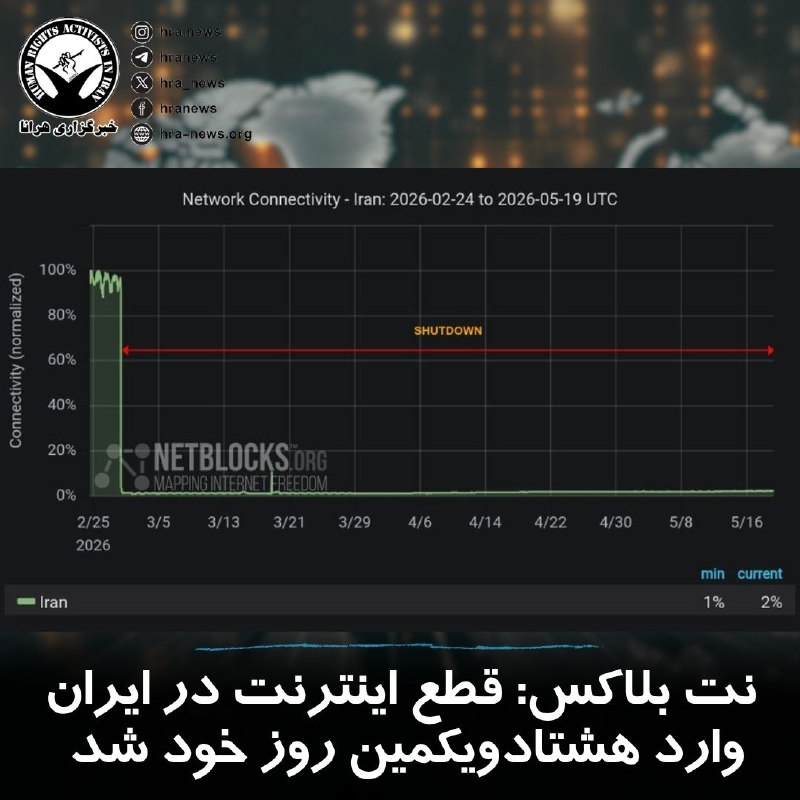

بر اساس آخرین داده‌های نت‌بلاکس، #قطع_اینترنت در ایران پس از ۱۹۲۰ ساعت وارد هشتاد و یکمین روز خود شده است. این نهاد ناظر بر دسترسی به اینترنت در جهان اعلام کرده که هم‌زمان، حکومت ایران در تلاش است محدودیت و کنترل دیجیتال خود را به سطح بین‌المللی نیز گسترش دهد؛ به‌طوری‌ که خواستار کنترل بر کابل‌های ارتباطی سایر کشورها در تنگه هرمز شده و از شرکت‌های بزرگ فناوری خواسته است خود را با قوانین جمهوری اسلامی تطبیق دهند.

↘️
@hranews_bot تماس ✉️ - @Hranews کانال هرانا 🆑

## Hranews — post 113029

  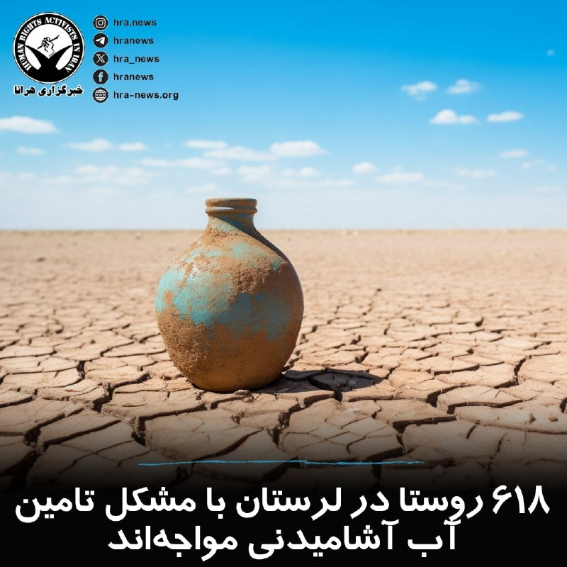

نورالدین نوری‌یزدان، مدیرعامل شرکت آب‌وفاضلاب استان لرستان، گفت: در حال حاضر، ۶۱۸ روستای این استان با #تنش_آبی مواجه هستند و ۲۴۵ روستا نیز از طریق تانکر آب‌رسانی می‌شوند. وی همچنین تاکید کرد که کمبود منابع آبی در سال‌های گذشته همچنان جبران نشده است.

↘️
@hranews_bot تماس ✉️ - @Hranews کانال هرانا 🆑

## Hranews — post 113028

بازداشت و ضبط تجهیزات استارلینک ۲ شهروند در تهران

❗️
❗️
❗️
❗️
❗️– فرمانده انتظامی تهران از #بازداشت دو شهروند در غرب و شمال این شهر به دلیل آنچه «ارسال اطلاعات و همکاری با شبکه معاند» عنوان کرده، خبر داد. در جریان این اقدام، تجهیزات اینترنت ماهواره‌ای استارلینک این افراد نیز ضبط شد.

ادامه مطلب

↘️
@hranews_bot تماس ✉️ - @Hranews کانال هرانا 🆑

## Hranews — post 113027

  

تداوم بازداشت؛ گزارشی از آخرین وضعیت حامد تیزرویان در زندان ساری

❗️
❗️
❗️
❗️
❗️– حامد تیزرویان، دانشجوی دکترای محیط زیست دانشگاه بهشتی و فعال محیط زیست، ۱۶ روز است که توسط ماموران اداره اطلاعات در ساری بازداشت شده و کماکان به صورت بلاتکلیف در زندان این شهر نگهداری می شود.

به گزارش خبرگزاری هرانا، ارگان خبری مجموعه فعالان حقوق بشر در ایران، حامد تیزرویان کماکان در بازداشت به‌سر می برد.

حامد تیزرویان در تاریخ ۱۴ اردیبهشت ماه، توسط ماموران اداره اطلاعات در ساری #بازداشت شد. همزمان، ماموران شماری از وسایل الکترونیکی این فعال محیط زیست را ضبط کردند. او هم اکنون در زندان ساری نگهداری می شود و با اتهاماتی از جمله اجتماع و تبانی به قصد اقدام علیه امنیت ملی مواجه شده است.

ادامه مطلب

#حامد_تیزرویان

↘️
@hranews_bot تماس ✉️ - @Hranews کانال هرانا 🆑

## Hranews — post 113026

  

میان موشک و سرکوب؛ گزارش مجموعه فعالان حقوق بشر درباره مخاصمه نظامی ایالات متحده-اسرائیل و ایران منتشر شد

💥
💥
💥
💥
💥 – امروز، مجموعه فعالان حقوق بشر در ایران گزارش جدیدی را در ۲۴۰ صفحه و دو زبان منتشر کرد که به بررسی کارزار نظامی ایالات متحده و اسرائیل در ایران در فاصله ۹ اسفند ۱۴۰۴ تا ۱۹ فروردین ۱۴۰۵ (۲۸ فوریه تا ۸ آوریل ۲۰۲۶) می‌پردازد.

این گزارش بر پایه ۱۷۷ منبع تأییدشده ــ شامل گزارش‌های منابع آزاد و شبکه میدانی مجموعه فعالان حقوق بشر در داخل کشور ــ ۶٬۳۲۴ رویداد منحصربه‌فرد شامل ۱۲٬۷۹۸ حمله مجزا را مستندسازی کرده است.
مجموعه فعالان تاکید کرد این گزارش با هدف ارائه روایت جامع از کل درگیری تهیه نشده است. یافته‌های آن صرفاً به رویدادهایی محدود می‌شود که در داده‌های این نهاد مستندسازی و راستی‌آزمایی شده‌اند.

📊 یافته‌های کلیدی گزارش
◾️ ثبت ۶٬۳۲۴ رویداد منحصربه‌فرد و ۱۲٬۷۹۸ حمله مجزا
◾️ ۷۷ درصد رویدادها شامل آسیب به غیرنظامیان یا اماکن غیرنظامی
◾️ ثبت دست‌کم ۳٬۶۳۶ مورد مرگ، از جمله ۱٬۷۰۱ غیرنظامی
◾️ کشته شدن ۳۰۷ کودک و زخمی شدن ۲٬۲۱۳ کودک
◾️ تمرکز ۴۴٫۸۵ درصدی رویدادها در استان تهران
◾️ هدف قرار گرفتن یا آسیب دیدن مدارس، مراکز درمانی، مراکز فرهنگی و زیرساخت‌های حیاتی

⚠️ الگوهای نگران‌کننده
این گزارش چندین الگوی نگران‌کننده را برجسته می‌کند، از جمله:
◾️ ضعف در راستی‌آزمایی اهداف
◾️ استفاده محدود از نظارت انسانی در برخی فناوری‌های هدف‌گیری
◾️ هشدارهای ناکافی پیش از حملات
◾️ استفاده از تسلیحات انفجاری سنگین در مناطق پرجمعیت
◾️ حملات تکراری به برخی مناطق غیرنظامی
◾️ آسیب گسترده به زیرساخت‌های غیرنظامی

🚨 این گزارش همچنین به بازداشت گسترده شهروندان در ایران اشاره دارد؛ دست‌کم ۴٬۰۲۳ نفر با اتهامات مرتبط با امنیت ملی یا جنگ بازداشت شده‌اند.

از سوی دیگر تشدید محدودیت‌های امنیتی، گسترش ایست‌های بازرسی و محدودیت‌های گسترده اینترنت از دیگر پیامدهای مستندسازی‌شده عنوان شده است.

در همین بازه زمانی، ۵۰ مورد اعدام ثبت شده که ۳۲ مورد آن با اتهامات سیاسی و امنیتی مرتبط بوده است.

📎 ادامه گزارش به زبان فارسی

📎 دانلود مستقیم فایل پی دی اف گزارش از تلگرام

📎 دانلود مستقیم فایل پی دی اف گزارش از سایت

📎 Complete report in English

📎Direct download of the English PDF

↘️
@hranews_bot تماس ✉️ - @Hranews کانال هرانا 🆑

## Hranews — post 113025

  <a href="https://t.me/hranews/113025" target="_blank">📎 Download file</a>

میان موشک و سرکوب؛ گزارش مجموعه فعالان حقوق بشر درباره مخاصمه نظامی ایالات متحده-اسرائیل و ایران منتشر شد 
💥
💥
💥
💥
💥 – امروز، مجموعه فعالان حقوق بشر در ایران گزارش جدیدی را در ۲۴۰ صفحه و دو زبان منتشر کرد که به بررسی کارزار نظامی ایالات متحده و اسرائیل در ایران…

## manototv — post 105628

  <a href="telegram/content/manototv_105628_1779188122.mp4" target="_blank">🎬 Download video</a>

علیرضا رئیسی، معاون بهداشت وزارت بهداشت، اعلام کرد جمعیت ایران بر اساس آخرین آمار به ۸۶ میلیون و ۵۶۴ هزار نفر رسیده است.
به گفته او، از این تعداد ۴۳ میلیون و ۶۵۸ هزار نفر مرد و ۴۲ میلیون و ۹۰۶ هزار نفر زن هستند.

## manototv — post 105627

  <a href="telegram/content/manototv_105627_1779188122.mp4" target="_blank">🎬 Download video</a>

بر پایه گزارش‌های منتشر شده حامد تیزرویان، فعال محیط زیست و عکاس شناخته شده بازداشت شده است. آقای تیزرویان ۱۴ اردیبهشت در ساری بازداشت شده و با وجود سپری شدن حدود دو هفته، از نهاد بازداشت کننده یا دلیل دستگیری او اطلاعی در دست نیست.
وسایل الکترونیکی از جمله تلفن همراه حامد تیزرویان هنگام بازداشت او ضبط شده است. حامد تیزرویان، عکاس حیات وحش و دانشجوی دکترای تنوع زیستی دانشگاه شهید بهشتی، پیش‌تر تصاویری کم‌نظیر از گونه‌های در معرض خطر انقراض از جمله خرس قهوه‌ای و مرال ثبت کرده است. او همچنین در ساخت دست‌کم ۱۰ پاسگاه محیط‌بانی در محدوده جنگل‌های هیرکانی مشارکت داشته و طی سال‌های گذشته در زمینه آموزش و آگاهی‌رسانی درباره حفاظت از محیط زیست، به‌ویژه جنگل‌های هیرکانی، فعالیت مستمر داشته است. فعالان محیط زیست نگران سرنوشت آقای تیزرویان هستند. صفحه اینستاگرام حامد تیزرویان نیز آذر سال گذشته، پس از انتشار مطالبی انتقادی درباره عملکرد مدیران دولتی در مهار آتش‌سوزی جنگل‌های الیمالات مازندران، برای چند روز مسدود شده بود.

## manototv — post 105626

  <a href="telegram/content/manototv_105626_1779188123.mp4" target="_blank">🎬 Download video</a>

نت‌بلاکس، نهاد ناظر بر دسترسی اینترنت، اعلام کرد ایران برای هشتاد و یکمین روز متوالی با قطعی گسترده اینترنت روبه‌رو است و این رخداد اکنون به طولانی‌ترین خاموشی اینترنتی ملی ثبت‌شده در یک کشور متصل به اینترنت تبدیل شده است.

بر اساس داده‌های نت‌بلاکس، دسترسی کاربران داخل ایران به اینترنت جهانی به‌شدت محدود مانده و ارتباطات دیجیتال کشور در سطحی بسیار پایین‌تر از وضعیت عادی قرار دارد.

## manototv — post 105625

  <a href="telegram/content/manototv_105625_1779188124.mp4" target="_blank">🎬 Download video</a>

وزارت دفاع روسیه اعلام کرد نیروهای مسلح این کشور از سه‌شنبه ۲۹ اردیبهشت تا ۳۱ اردیبهشت رزمایش نیروهای هسته‌ای برگزار می‌کنند.

بر اساس این اعلام، بیش از ۶۴ هزار نیروی نظامی و ۷۸۰۰ قطعه تجهیزات نظامی در این رزمایش شرکت دارند و قرار است موشک‌های بالستیک و کروز از پایگاه‌های آزمایشی در خاک روسیه شلیک شوند.

این خبر هم‌زمان با افزایش تنش‌های امنیتی میان روسیه و غرب منتشر شده است. یک روز پیشتر نیز بلاروس اعلام کرد با مشارکت روسیه رزمایشی را برای تمرین جابه‌جایی و آماده‌سازی مهمات هسته‌ای برگزار می‌کند. بلاروس میزبان تسلیحات هسته‌ای تاکتیکی روسیه است، اما مسکو کنترل این تسلیحات را در اختیار دارد.

## manototv — post 105624

  <a href="telegram/content/manototv_105624_1779188124.mp4" target="_blank">🎬 Download video</a>

علی عبداللهی، فرمانده قرارگاه مرکزی حضرت خاتم‌الانبیا، در اظهاراتی خطاب به آمریکا و هم‌پیمانانش هشدار داد که «دوباره مرتکب خطای محاسباتی نشوند».

او گفت اگر «خطای دیگری» از سوی دشمنان جمهوری اسلامی رخ دهد، نیروهای مسلح ایران با «قدرت و توانایی به مراتب بالاتر از جنگ تحمیلی رمضان» با آن برخورد خواهند کرد.

این اظهارات در حالی مطرح می‌شود که در روزهای گذشته احتمال حمله نظامی به ایران افزایش یافته و دونالد ترامپ نیز دیشب گفت چند کشور عربی از او خواسته‌اند حمله‌ای «بسیار بزرگ» را برای چند روز به تعویق بیندازد.

## manototv — post 105623

  <a href="telegram/content/manototv_105623_1779188125.mp4" target="_blank">🎬 Download video</a>

آنا کلی، سخنگوی کاخ سفید، گفت موضع دونالد ترامپ درباره جمهوری اسلامی تغییری نکرده و رئیس‌جمهوری آمریکا همچنان برای جلوگیری از دستیابی تهران به سلاح هسته‌ای «بسیار جدی» است.

او گفت جمهوری اسلامی ۴۷ سال شعار «مرگ بر آمریکا» سر داده و نیروهای آمریکایی در خارج از کشور را تهدید کرده، هرگز نباید به سلاح هسته‌ای دست پیدا کند.

کلی افزود پیام ترامپ در شبکه تروث سوشال نشان می‌دهد او تا چه اندازه در این موضوع جدی است. به گفته او، جمهوری اسلامی اکنون با مشکلات متعددی روبه‌رو است، زیرا «ترامپ همه برگ‌ها را در دست دارد».

## manototv — post 105622

  <a href="telegram/content/manototv_105622_1779188127.mp4" target="_blank">🎬 Download video</a>

دونالد ترامپ شب گذشته گفت چند کشور به او گفته‌اند که برای «حمله‌ای بسیار بزرگ» آماده می‌شدند، اما او این حمله را برای مدتی کوتاه، و شاید برای همیشه، به تعویق انداخته است.

ترامپ گفت عربستان سعودی، قطر، امارات متحده عربی و چند کشور دیگر از او خواستند این اقدام را دو یا سه روز عقب بیندازد، زیرا به گفته او، این کشورها معتقدند مذاکرات با جمهوری اسلامی به دستیابی به توافق نزدیک شده است.

ترامپ گفت اسرائیل و دیگر طرف‌های درگیر در خاورمیانه از این تصمیم مطلع شده‌اند. او این تحول را «بسیار مثبت» خواند، اما تاکید کرد هنوز روشن نیست به نتیجه برسد یا نه.

## manototv — post 105621

  <a href="telegram/content/manototv_105621_1779188128.mp4" target="_blank">🎬 Download video</a>

پلیس سن‌دیگو اعلام کرد دو نوجوان مسلح روز دوشنبه ۲۸ اردیبهشت به سوی مرکز اسلامی سن‌دیگو تیراندازی کردند و سه مرد را کشتند. به گفته پلیس، این دو مهاجم که ۱۷ و ۱۸ ساله بودند، پس از حمله چند خیابان دورتر اقدام به خودکشی کردند. این حمله به عنوان «جرم نفرت‌محور» در دست بررسی است.

پلیس پیش از تیراندازی در جست‌وجوی یکی از این دو نوجوان بود، زیرا مادر او با پلیس تماس گرفته و گفته بود پسرش با نشانه‌های ضربه به خود از خانه خارج شده است. به گفته پلیس، هم‌زمان چند سلاح و خودروی مادر این نوجوان نیز از خانه ناپدید شده بود.

## manototv — post 105620

  <a href="telegram/content/manototv_105620_1779188129.mp4" target="_blank">🎬 Download video</a>

«رشید مظاهری صدای مردم ایران شده بود»

## manototv — post 105619

  <a href="telegram/content/manototv_105619_1779188130.mp4" target="_blank">🎬 Download video</a>

دونالد ترامپ، رئیس‌جمهوری آمریکا، در پاسخ به سوال خبرنگاران گفت چند کشور منطقه، از جمله قطر، عربستان سعودی و امارات متحده عربی، در حال گفت‌وگو با آمریکا و جمهوری اسلامی هستند و احتمال رسیدن به توافق وجود دارد.

ترامپ گفت: «این سه کشور، به‌علاوه چند کشور دیگر، با من تماس گرفتند و آن‌ها مستقیماً با مقام‌های ما و در حال حاضر با ایران در تماس هستند.»

او افزود: «به نظر می‌رسد احتمال بسیار خوبی وجود دارد که بتوانند به یک توافق برسند.»

رئیس‌جمهوری آمریکا همچنین گفت ترجیح می‌دهد بحران بدون اقدام نظامی حل شود و افزود: «اگر بتوانیم بدون اینکه آن‌ها را به‌شدت بمباران کنیم به نتیجه برسیم، بسیار خوشحال خواهم شد.

## alonews — post 121055

👈وزیر دارایی اسرائیل: من اینجا به طور قاطع می‌گویم: اگر حزب‌الله تسلیم نشود، ما بخش‌های بیشتری از جنوب لبان را تصرف خواهیم کرد

✅ @AloNews خبر جنگ

## alonews — post 121054

  <a href="telegram/content/alonews_121054_1779188132.webm" target="_blank">🎬 Download video</a>

👈وضعیت هوای اهواز امروز ...

✅ @AloNews خبر جنگ

## alonews — post 121053

  <a href="telegram/content/alonews_121053_1779188132.webm" target="_blank">🎬 Download video</a>

👈امتحانات مدارس در البرز غیرحضوری شد

✅ @AloNews خبر جنگ

## alonews — post 121052

  <a href="telegram/content/alonews_121052_1779188132.mp4" target="_blank">🎬 Download video</a>

👈سخنگوی شورای شهر تهران: از فردا مترو و بی‌آرتی در تهران رایگان نیست و مهمونی بسه

✅ @AloNews خبر جنگ

## alonews — post 121051

  <a href="telegram/content/alonews_121051_1779188134.webm" target="_blank">🎬 Download video</a>

👈امتحانات مدارس در البرز غیرحضوری شد

معاون آموزش متوسطه اداره کل  آموزش و پرورش استان البرز:

🔴با تصمیم جدید شورای تأمین استان، امتحانات در استان البرز بار دیگر به صورت مجازی برگزار می‌شود.

✅ @AloNews خبر جنگ

## alonews — post 121050

  <a href="telegram/content/alonews_121050_1779188134.webm" target="_blank">🎬 Download video</a>

👈فارس: تخم‌مرغ از ۵۵۰ به زیر ۴۰۰ هزار تومان سقوط کرد، اما مرغ گرم از کیلویی ۳۸۰ به ۴۵۰ هزار تومان افزایش یافته!

✅ @Aloanews خبر جنگ

## alonews — post 121049

  <a href="telegram/content/alonews_121049_1779188134.webm" target="_blank">🎬 Download video</a>

👈بورس اولین روز بعداز جنگ را مثبت تمام کرد

🔴شاخص کل بورس در پایان معاملات امروز با رشد 2500 واحدی به 3 میلیون و 716 هزار واحد رسید.

✅ @AloNews خبر جنگ

## alonews — post 121048

  <a href="telegram/content/alonews_121048_1779188135.mp4" target="_blank">🎬 Download video</a>

👈حمله‌ی ارتش اسرائیل از صبح امروز، به لبنان ادامه داره

✅ @AloNews خبر جنگ

## alonews — post 121047

  <a href="telegram/content/alonews_121047_1779188136.webm" target="_blank">🎬 Download video</a>

👈روزنامه واشنگتن پست به نقل از یک مقام پاکستانی: ایران می‌خواهد پیش از اعلام توافق هسته‌ای، به توافقی برای پایان دادن به جنگ دست یابد.

🔴واشنگتن می‌خواهد توافق بر سر همه مسائل را یکجا اعلام کند.

✅ @AloNews خبر جنگ

## alonews — post 121046

  <a href="telegram/content/alonews_121046_1779188136.webm" target="_blank">🎬 Download video</a>

👈سخنگوی ارتش: ارتش ایران، دوره آتش بس را به منزله دوران جنگ تلقی کرده و از این فرصت برای تقویت توان رزمی خود استفاده کرده است.

🔴اگر دشمن حماقت کند و مجدداً در دام اسرائیل گرفتار شود و دست به تجاوزی دیگر به ایران عزیز ما بزند، با ابزارها و شیوه‌های جدید جبهه‌های جدیدی را علیه آنها خواهیم گشود.

✅ @AloNews خبر جنگ

## alonews — post 121045

  <a href="telegram/content/alonews_121045_1779188136.webm" target="_blank">🎬 Download video</a>

🔴باید ایستاده برای این مرد و سخنرانیش دست زد.

🔴تامی رابینسون از روز اول کنار مردم ایران بوده اما امروز سنگ تموم گذاشت و درمقابل ده‌ها هزار نفر از انقلاب شیر و خورشید حمایت کرد.

✅@AloNews

## alonews — post 121044

  <a href="telegram/content/alonews_121044_1779188137.webm" target="_blank">🎬 Download video</a>

👈اتحادیه اروپا کشورهای حامی روسیه یا ایران را به قطع کمک‌ها تهدید کرد

🔴طبق گزارش یوراکتیو، کایا کالاس، مسئول سیاست خارجی اتحادیه اروپا، کشورهای در حال توسعه‌ای را که از روسیه یا ایران حمایت می‌کنند، به محرومیت از کمک‌های اتحادیه اروپا تهدید کرده است.

✅ @AloNews خبر جنگ

## alonews — post 121043

  <a href="telegram/content/alonews_121043_1779188137.webm" target="_blank">🎬 Download video</a>

👈صدای شنیده شده در دزفول مربوط به تست سامانه پدافند بود

✅ @AloNews خبر جنگ

## alonews — post 121042

  <a href="telegram/content/alonews_121042_1779188137.webm" target="_blank">🎬 Download video</a>

👈وزیر دفاع پاکستان : احساس می‌کنم جنگ ایران از سر گرفته نمی‌شه

✅ @AloNews خبر جنگ

## alonews — post 121041

  <a href="telegram/content/alonews_121041_1779188137.webm" target="_blank">🎬 Download video</a>

👈نشریه AFP : همزمان با سفر پوتین به چین، روسیه قصد داره رزمایش نیروهای هسته‌ایشو برگزار کنه

✅ @AloNews خبر جنگ

## alonews — post 121040

  <a href="telegram/content/alonews_121040_1779188137.webm" target="_blank">🎬 Download video</a>

👈منبع نظامی ایرانی المیادین: ایران تاکتیک‌های جدید مبتنی بر «دکترین دفاعی تهاجمی» آماده کرده و هیچ مشکلی برای دفاع از کشور ندارد!

✅ @AloNews خبر جنگ

## alonews — post 121039

  <a href="telegram/content/alonews_121039_1779188138.webm" target="_blank">🎬 Download video</a>

👈رئیس شرکت میهن: جوانان الان گشاد هستن و کار نمیکنن بعد میگن اوضاع جامعه خرابه

🔴منم جوون بودم و زحمت کشیدم ولی الانیا چی؟ تنبلن

✅ @AloNews خبر جنگ

## alonews — post 121038

  <a href="telegram/content/alonews_121038_1779188138.webm" target="_blank">🎬 Download video</a>

👈مدیرعامل صندوق قرض‌الحسن جهاددانشگاهی:
به دانشجوهایی که ازدواج کنند ۳۰ میلیون وام تعلق می‌گیرد😍😍😍😍😍😍😍😍😍😍😍😍😳😳😳😳😳😳😳😍😍😍😍😍😍😍

✅ @AloNews خبر جنگ

## alonews — post 121037

  <a href="telegram/content/alonews_121037_1779188138.webm" target="_blank">🎬 Download video</a>

👈منبع نظامی ایرانی به خبرگزاری ریانووستی: ایران تاکتیک‌های جدید مبتنی بر «دکترین دفاعی تهاجمی» آماده کرده و هیچ مشکلی برای دفاع از کشور ندارد.

✅ @AloNews خبر جنگ

## alonews — post 121036

  <a href="telegram/content/alonews_121036_1779188138.webm" target="_blank">🎬 Download video</a>

👈از فردا (چهارشنبه ۳۰ اردیبهشت) پرداخت بلیت مترو و اتوبوس در تهران به حالت عادی و پولی بازمی‌گردد.

✅ @AloNews خبر جنگ

<!-- MSG END -->

<!-- NAV START -->

<a href="https://github.com/miladsa74520/aio-downloader/blob/main/telegram/content/archive_1.md" style="display:inline-block; padding:6px 12px; margin:0 4px; background-color:#2ea44f; color:white; text-decoration:none; border-radius:4px; font-weight:bold;">صفحه بعد</a>

<!-- NAV END -->
