# خواننده تلگرام

<!-- TOP_NAV START -->

<a href="https://github.com/miladsa74520/aio-downloader/blob/main/telegram/content/archive_1.md" style="display:inline-block; padding:6px 12px; margin:0 4px; background-color:#2ea44f; color:white; text-decoration:none; border-radius:4px; font-weight:bold;">صفحه بعد</a>

<!-- TOP_NAV END -->

<!-- MSG START -->

---
📅 بروزرسانی: 1405/02/31 15:31
---

## VahidOOnLine — post 241322

  <a href="telegram/content/VahidOOnLine_241322_1779364898.mp4" target="_blank">🎬 Download video</a>

♦️رسانه‌های محلی روسیه روز پنجشنبه ۳۱ اردیبهشت ماه گزارش دادند که پهپادهای اوکراینی پالایشگاه نفت «سیزران» متعلق به شرکت روس‌نفت را در منطقه سامارای روسیه هدف قرار دادند.
تصاویر منتشرشده در شبکه‌های اجتماعی، شعله‌های گسترده و آتش‌سوزی در این تاسیسات نفتی را نشان می‌دهد.

این حمله در ادامه تشدید حملات پهپادی اوکراین به زیرساخت‌های انرژی و پالایشگاهی روسیه و در حالی انجام شده است که چشم‌انداز پایان جنگ پس از چهار سال همچنان مبهم به نظر می‌رسد.

 کی‌یف این حملات را بخشی از راهبرد تضعیف توان لجستیکی و اقتصادی مسکو در جنگ و وادار کردن روسیه به پذیرش آتش‌بس توصیف می‌کند.
‌🇸🇦 Indypersian

🤖 @VahidOOnLine

## VahidOOnLine — post 241321

  <a href="telegram/content/VahidOOnLine_241321_1779364900.mp4" target="_blank">🎬 Download video</a>

ویدیوی ارسالی به ایران اینترنشنال نشان می‌دهد که ۳۱ اردیبهشت‌ماه گروهی از دانش‌آموزان با بر زمین نشستن و تحصن جلوی ساختمان استانداری در شهرکرد، شعارهایی چون «امتحان حضوری نمی‌خواهیم» و «حمایت، حمایت» سردادند.
‌🏁 🇬🇧 IranintlTV

🤖 @VahidOOnLine

## VahidOOnLine — post 241320

♦️کوین اسپیسی، بازیگر آمریکایی، در هفتادونهمین جشنواره فیلم کن روی فرش قرمز حاضر شد. این بازیگر مطرح هالیوودی پس از اتهام‌های گسترده آزار جنسی تا حد زیادی از صحنه سینما و انظار عمومی دور مانده بود.
اسپیسی ۶۶ ساله در مراسم نمایش فیلم «دوگل» در کن دیده شد و بار دیگر توجه رسانه‌ها و عکاسان را به خود جلب کرد.
این بازیگر برنده اسکار به دلیل اتهام‌های سورفتار و آزار جنسی با کاهش چشمگیر حضور حرفه‌ای در پروژه‌های سینمایی و تلویزیونی مواجه شده بود.
‌🇸🇦 Indypersian

🤖 @VahidOOnLine

## VahidOOnLine — post 241319

  

♦️دقایقی پس از آنکه خبرگزاری رویترز به نقل از مقام‌های جمهوری اسلامی گزارش کرد که مجتبی خامنه‌ای دستور داده است تا اورانیوم به‌شدت غنی‌شده از ایران خارج نشود، بهای نفت در بازارهای جهانی نزدیک به دو دلار افزایش یافت.

قیمت هر بشکه نفت خام برنت دریای شمال بعدازظهر پنجشنبه ۳۱ اردیبهشت‌ماه در بازارهای اروپایی از ۱۰۵ دلار به بیش از ۱۰۷ دلار افزایش یافت.
‌🇸🇦 Indypersian

🤖 @VahidOOnLine

## VahidOOnLine — post 241318

  <a href="telegram/content/VahidOOnLine_241318_1779364904.mp4" target="_blank">🎬 Download video</a>

ویدیوی رسیده به ایران اینترنشنال نشان می‌دهد که شامگاه ۳۱ اردیبهشت در شهر دهلران استان ایلام، گروهی با در دست داشتن پرچم جمهوری اسلامی و بیرق‌های مذهبی، موسیقیِ باکلام عربی را با صدای بلند در خیابان پخش می‌کنند. فرستنده ویدیو گفت: «مزاحمت‌های شبانه طرفداران حکومت، تمامی ندارد.»
‌🏁 🇬🇧 IranintlTV

🤖 @VahidOOnLine

## VahidOOnLine — post 241317

  

علی یزدی‌خواه، نایب‌رییس کمیسیون فرهنگی مجلس، گفت در شرایط فعلی تصمیمی برای بازگشایی اینترنت جهانی وجود ندارد و محدودیت‌ها با «ملاحظات امنیتی» ادامه خواهد داشت.

یزدی‌خواه قطع اینترنت جهانی را به مصوبات شورای عالی امنیت ملی نسبت داد و گفت این تصمیم به‌دلیل «مسائل امنیتی، امنیت کشور و حفظ جان افراد» گرفته شده است.

با وجود اینکه نت‌بلاکس اعلام کرده خاموشی اینترنت در ایران وارد هشتادوسومین روز خود شده، یزدی‌خواه گفت بیش از ۹۰ درصد نیازهای مردم در وضعیت فعلی برآورده می‌شود و مراجعات گسترده‌ای در اعتراض به قطع اینترنت وجود ندارد.

او همچنین گفت در قالب طرح موسوم به «اینترنت پرو»، تاکنون بیش از یک میلیون نفر دسترسی دریافت کرده‌اند؛ طرحی که منتقدان آن را مصداق اینترنت طبقاتی و تبعیض‌آمیز می‌دانند، زیرا دسترسی به اینترنت جهانی را به گروه‌های خاص محدود می‌کند و شهروندان عادی را از حق برابر دسترسی آزاد به اینترنت محروم نگه می‌دارد.

نایب‌رییس کمیسیون فرهنگی مجلس همچنین گفت شرکت‌های صادرات و واردات، مراکز علمی و پژوهشی، آزمایشگاه‌ها و برخی اصناف در صورت نیاز می‌توانند برای دسترسی به اینترنت بین‌الملل اقدام کنند.
https
‌🏁 🇬🇧 IranintlTV

🤖 @VahidOOnLine

## VahidOOnLine — post 241316

  <a href="telegram/content/VahidOOnLine_241316_1779364907.mp4" target="_blank">🎬 Download video</a>

ویدیوهای رسیده به ایران اینترنشنال نشان می‌دهد که ۳۱ اردیبهشت در شهرکرد، گروهی از دانش‌آموزان معترض به برگزاری حضوری امتحان‌ها ضمن تلاش برای پاسخگو کردن مسئولان مربوط، شعار «دانش‌آموز داد بزن، حقتو فریاد بزن» سردادند.
‌🏁 🇬🇧 IranintlTV

🤖 @VahidOOnLine

## VahidOOnLine — post 241315

  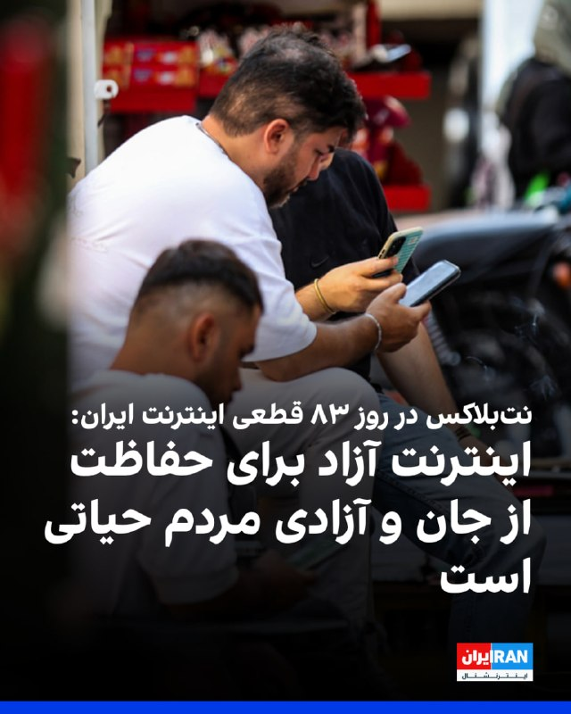

نت‌بلاکس، نهاد ناظر بر اینترنت، نوشت که داده‌های این نهاد نشان می‌دهد قطعی اینترنت در ایران وارد هشتادوسومین روز خود شده و شبکه‌های بین‌المللی بیش از هزار و ۹۶۸ ساعت است که به‌طور گسترده مسدود مانده‌اند.

این نهاد ناظر بر اینترنت با تاکید بر اهمیت دسترسی آزاد به اینترنت نوشت: «اینترنت آزاد و باز، برای حفاظت از جان، آزادی و پاسخگویی عمومی نقشی اساسی دارد.»
‌🏁 🇬🇧 IranintlTV

🤖 @VahidOOnLine

## VahidOOnLine — post 241314

  

♦️خبرگزاری رویترز روز پنجشنبه ۳۱ اردیبهشت ماه به نقل از دو مقام ارشد جمهوری اسلامی گزارش کرد که مجتبی خامنه‌ای، رهبر حکومت ایران دستور داده است که ذخایر اورانیوم با غنای بالا (نزدیک به اورانیوم مورد نیاز برای ساخت سلاح هسته‌ای) در خاک ایران باقی بماند.

این خبر در حالی منتشر می‌شود که مساله ذخایر بیش از ۴۰۰ کیلوگرم اورانیوم ۶۰ درصد غنی شده، چالش اساسی در مذاکرات میان جمهوری اسلامی و آمریکا برای پایان جنگ به شمار می‌رود.
‌🇸🇦 Indypersian

🤖 @VahidOOnLine

## VahidOOnLine — post 241313

  

♦️بر اساس گزارشی از رویترز دولت آمریکا قصد دارد به تشکیلات فلسطینی هشدار دهد که در صورت نامزدی ریاض منصور، نماینده فلسطین در سازمان ملل، برای سمت نایب‌رئیسی مجمع عمومی، ممکن است ویزای اعضای هیئت فلسطینی لغو شود.
این موضوع در یک تلگرام داخلی وزارت خارجه آمریکا مطرح شده که به رسانه‌ها درز کرده است. بر اساس این سند که روز چهارشنبه تنظیم شده به دیپلمات‌های آمریکایی در سفارت این کشور در اورشلیم دستور داده شده پیام واشنگتن را به مقام‌های فلسطینی منتقل کنند. در این پیام آمده است که نامزدی منصور برای این سمت «تنش‌ها را افزایش می‌دهد» و می‌تواند طرح صلح غزه دولت دونالد ترامپ را تضعیف کند.
در بخشی از این تلگرام آمده است: «برای روشن شدن موضوع، اگر هیئت فلسطینی نامزدی خود برای نایب‌رئیسی مجمع عمومی را پس نگیرد، ما تشکیلات خودگردان فلسطین را مسئول خواهیم دانست.»
دولت ترامپ سال گذشته نیز از صدور ویزا برای محمود عباس، رئیس تشکیلات خودگردان فلسطین، و هیئت همراه او برای شرکت در نشست مجمع عمومی سازمان ملل خودداری کرده بود. این تصمیم در اعتراض به برنامه فلسطینی‌ها برای شرکت در نشستی با محوریت راه‌حل دو کشوری و به رسمیت شناختن یک‌جانبه کشور فلسطین اتخاذ شد؛ اقدامی که معمولا در سیاست خارجی آمریکا برای دشمنان سرسخت واشنگتن به کار گرفته می‌شود.
در سند جدید وزارت خارجه آمریکا همچنین آمده است: «مایه تاسف خواهد بود اگر ناچار شویم بار دیگر گزینه‌های موجود را بررسی کنیم.»
بر اساس این تلگرام، ریاض منصور پیش‌تر در ماه فوریه و در پی فشارهای آمریکا، از نامزدی برای ریاست مجمع عمومی سازمان ملل انصراف داده بود. با این حال، مقام‌های آمریکایی نگران‌اند که در صورت انتخاب او به‌عنوان نایب‌رئیس مجمع عمومی، امکان ریاست بر برخی جلسات این نهاد برای او فراهم شود.

در سند وزارت خارجه آمریکا آمده است: «همچنان این خطر وجود دارد که فلسطینی‌ها در جریان هشتاد و یکمین نشست مجمع عمومی سازمان ملل ریاست برخی جلسات را بر عهده بگیرند، مگر آنکه از رقابت کنار بکشند.»

انتخابات رئیس مجمع عمومی سازمان ملل و ۱۶ نایب‌رئیس آن قرار است روز دوم ژوئن برگزار شود.

تشکیلات خودگردان فلسطین که در سازمان ملل با عنوان رسمی «دولت فلسطین» نمایندگی دارد، عضو کامل سازمان ملل نیست و در مجمع عمومی ۱۹۳ عضوی این سازمان حق رای ندارد. فلسطین در سازمان ملل جایگاه «کشور ناظر» دارد؛ جایگاهی مشابه واتیکان.
‌🇸🇦 Indypersian

🤖 @VahidOOnLine

## VahidOOnLine — post 241312

  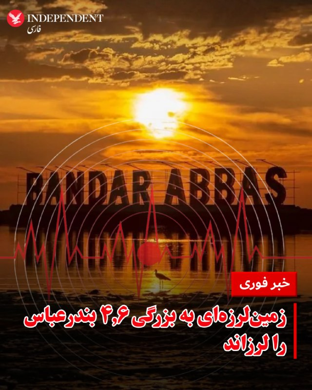

♦️زمین‌لرزه‌ای به بزرگی ۴.۶ عصر پنجشنبه ۳۱ اردیبهشت بندرعباس و مناطقی از استان هرمزگان را لرزاند.

خبرگزاررکنا گزارش کرد این زلزله ساعت ۱۳:۲۶ در عمق ۲۰ کیلومتری زمین حوالی درگهان قشم را هم لرزانده است و تیم عملیاتی هلال‌احمر جهت ارزیابی خسارات احتمالی به منطقه اعزام شد.
‌🇸🇦 Indypersian

🤖 @VahidOOnLine

## VahidOOnLine — post 241311

  

فداحسین مالکی، عضو کمیسیون امنیت ملی مجلس، با تمجید از اقدامات نیروهای مسلح جمهوری اسلامی در جریان جنگ گفت سران واشینگتن تصور می‌کردند در ایران نیز پیروز خواهند شد، اما «در این میدان به معنای واقعی کلمه میخکوب شدند».

او گفت: «سران واشینگتن که پس از وقایع ونزوئلا دچار غرور و سرمستی سیاسی شده بودند، تصور می‌کردند در حمله به ایران نیز پیروز خواهند بود؛ اما در این میدان به معنای واقعی کلمه میخکوب شدند.»

مالکی همچنین درباره احتمال توافق با آمریکا با میانجی‌گری پاکستان گفت پاکستانی‌ها «حسن نیت» دارند و برای انجام این میانجی‌گری تلاش می‌کنند.

او افزود: «احتمال می‌دهم رفاقتی که عاصم منیر با ترامپ دارد، او را وادار کند شروط را بپذیرد؛ از جمله این‌که وارد تنگه هرمز نشود، وارد غنی‌سازی نشود، خسارت ما را بدهد و پول‌های بلوکه‌شده را آزاد کند.»
‌🏁 🇬🇧 IranintlTV

🤖 @VahidOOnLine

## VahidOOnLine — post 241310

  <a href="telegram/content/VahidOOnLine_241310_1779364913.mp4" target="_blank">🎬 Download video</a>

ویدیوی ارسالی به ایران اینترنشنال نشان‌ می‌دهد که ۳۱ اردیبهشت در حوالی روستای سَلَخ شهرستان قشم استان هرمزگان، صف بنزین در کنار جاده ادامه پیدا کرده است. به گفته ساکنان منطقه، مردم این روستا با کمبود سوخت روبرو شده‌اند.
‌🏁 🇬🇧 IranintlTV

🤖 @VahidOOnLine

## VahidOOnLine — post 241309

  <a href="telegram/content/VahidOOnLine_241309_1779364915.mp4" target="_blank">🎬 Download video</a>

بر اساس ویدیو و گزارش‌های رسیده به ایران اینترنشنال شماری از دانش‌آموزان و خانواده‌های آنان در شهرکرد، صبح پنجشنبه ٢١ اردیبهشت برای اعتراض به حضوری شدن امتحانات جلوی ساختمان استانداری چهارمحال و بختیاری تجمع کرده و شعار سردادند.
‌🏁 🇬🇧 IranintlTV

🤖 @VahidOOnLine

## VahidOOnLine — post 241308

  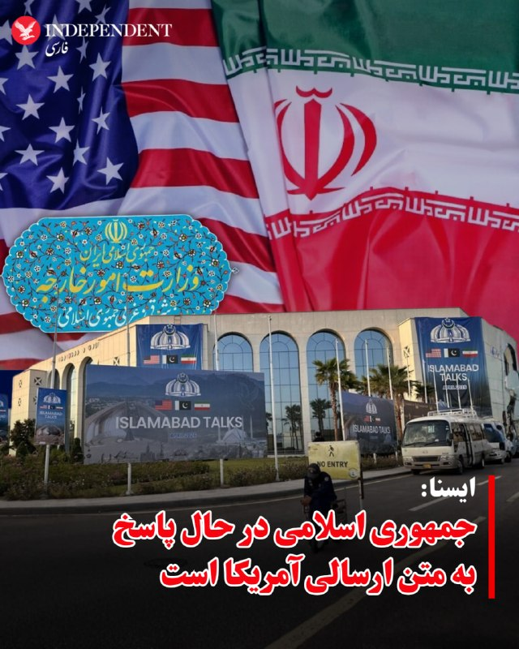

♦️خبرگزاری ایسنا روز پنجشنبه ۳۱ اردیبهشت ماه با انتشار خبری در تلگرام نوشت جمهوری اسلامی ایران «در حال پاسخ به متن ارسالی آمریکا است.»

ایسنا منبع این خبر را ذکر نکرده است. با این حال خبرگزاری رویترز پس از دقایقی همین خبر را منتشر کرد و بسیاری از رسانه‌ها هم آن را گزارش کردند.

براساس خبر ایسنا، ایران در پاسخ به متن آمریکا در حال تدوین چارچوب کلان، برخی جزییات و اقدامات اعتمادساز به عنوان تضمین است.

ایسنا نوشته است «متن ارسالی به میزانی شکاف‌ها را کم کرده است اما کمتر شدن شکاف‌ها نیازمند پایان یافتن وسوسه جنگ در سمت واشنگتن است.»

 ایسنا درباره سفر رئیس ستاد کل ارتش پاکستان به ایران نوشته است: «ورود ژنرال عاصم منیر به تهران، به منظور کم کردن این شکاف‌ها و رسیدن به لحظه اعلام رسمی پذیرش یادداشت تفاهم است.»

الجزیره دقایقی پس از انتشار این خبر به نقل از یک منبع دولت پاکستان گزارش کرد که سفر ژنرال عاصم منیر به تهران مشروط به نتایج مذاکرات وزیر کشور پاکستان با مقام‌های جمهوری اسلامی است.
‌🇸🇦 Indypersian

🤖 @VahidOOnLine

## VahidOOnLine — post 241307

  <a href="telegram/content/VahidOOnLine_241307_1779364918.mp4" target="_blank">🎬 Download video</a>

بر پایه گزارش رسانه‌های حکومتی، ۲۰ ملوان ایرانی که کشتی‌شان در آب‌های سنگاپور توقیف شده بود و در «وضعیت نامناسبی» قرار داشتند، ساعتی پیش به ایران بازگشتند.
سفیر جمهوری‌اسلامی در پاکستان با قدردانی از دولت پاکستان اعلام کرد این ملوانان پس از پیگیری‌های دیپلماتیک و با همکاری مقام‌های پاکستانی، از سنگاپور به اسلام‌آباد منتقل شدند و سپس به کشور بازگشتند.
او از نقش نخست‌وزیر پاکستان، وزارت خارجه و دیگر نهادهای این کشور در آزادی و انتقال ملوانان ایرانی تشکر کرد.
‌🏁 🇬🇧 ManotoTV

🤖 @VahidOOnLine

## VahidOOnLine — post 241306

  <a href="telegram/content/VahidOOnLine_241306_1779364919.mp4" target="_blank">🎬 Download video</a>

بریتانیا از توافق تجاری ۵ میلیارد دلاری با کشورهای خلیج فارس رونمایی کرد؛ توافقی که در بحبوحه تنش‌های منطقه‌ای پس از جنگ ایران، به گفته لندن «پیامی از ثبات و اعتماد» به بازارها می‌دهد.
این توافق با شورای همکاری خلیج فارس شامل عربستان، امارات، قطر، کویت، عمان و بحرین است و قرار است سالانه حدود ۳.۷ میلیارد پوند به اقتصاد بریتانیا اضافه کند.
لندن می‌گوید ۹۳ درصد تعرفه‌های کشورهای خلیج فارس برای کالاهای بریتانیایی حذف می‌شود؛ از جمله محصولات غذایی، خودرو، صنایع هوافضا و الکترونیک.
در مقابل، بریتانیا نیز برخی تعرفه‌ها را کاهش می‌دهد، هرچند نفت و گاز کشورهای عربی پیش‌تر هم بدون تعرفه وارد بریتانیا می‌شد.
فعالان حقوق بشر از نبود بندهای الزام‌آور درباره حقوق بشر در این توافق انتقاد کرده‌اند و آن را «عقب‌گرد اخلاقی» توصیف کردند.
‌🏁 🇬🇧 ManotoTV

🤖 @VahidOOnLine

## VahidOOnLine — post 241305

  <a href="telegram/content/VahidOOnLine_241305_1779364920.mp4" target="_blank">🎬 Download video</a>

♦️خبرگزاری اسپوتنیک روسیه، روز پنجشنبه ۳۱ اردیبهشت ماه، تصویری از ورود اعضای تیم ملی فوتبال مردان ایران به سفارت آمریکا در آنکارا منتشر کرد.
تیم ملی فوتبال ایران که برای اردوای آمادگی پیش از جام‌جهانی فوتبال ۲۰۲۶ در ترکیه به سر می‌برد، سرانجام برای دریافت ویزا به سفارت آمریکا مراجعه کرد.
پیش‌تر مهدی تاج با اعلام آنکه تیم ملی فوتبال مردان ایران «قطعا» در جام‌جهانی شرکت می‌کند، گفته بود هنوز هیچ ویزایی برای حضور تیم ملی در رقابت‌های جام جهانی در ایالات متحده صادر نشده است.
مقام‌های ورزشی ایران در روزهای گذشته برای برگزاری مسابقات در کشور آمریکا، جلساتی را با مقام‌های فیفا برگزار کرده‌اند.
‌🇸🇦 Indypersian

🤖 @VahidOOnLine

## VahidOOnLine — post 241304

  <a href="telegram/content/VahidOOnLine_241304_1779364922.mp4" target="_blank">🎬 Download video</a>

♦️تصاویری که صفحه «اسرائیل به فارسی» روز پنجشنبه ۳۱ اردیبهشت در شبکه‌های اجتماعی منتشر کرده نشان می‌دهد، پرچم ملی شیروخورشید نشان ایران در کنار پرچم سایر کشورها در یکی از خیابان‌های شهر اشدود اسرائیل به اهتزاز درآمده است.
‌🇸🇦 Indypersian

🤖 @VahidOOnLine

## VahidOOnLine — post 241303

  

♦️ماریا زاخاروا، سخنگوی وزارت امور خارجه روسیه روز پنجشنبه ۳۱ اردیبهشت‌ماه گفت که تنها ایران باید درباره سرنوشت ذخایر اورانیوم این کشور تصمیم بگیرد.
سخنگوی وزارت امور خارجه روسیه بار دیگر بر موضع رسمی مسکو گفت: «پرونده هسته‌ای ایران تنها با در نظر گرفتن منافع ایران و و از راه دیپلماتیک قابل حل و فصل است.»
‌🇸🇦 Indypersian

🤖 @VahidOOnLine

## WithYashar — post 11835

منابع اسرائیلی به رویترز:
ترامپ به اسرائیل قول داد که اورانیوم غنی‌شده از ایران خارج شود و هر توافق احتمالی شامل این بند خواهد بود!
@withyashar

## WithYashar — post 11834

یزدی خواه: اینترنت جهانی فعلاً بازگشایی نمی‌شود/ دسترسی ویژه برای گروه‌های موردنیاز برقرار است
@withyashar

## WithYashar — post 11833

@withyashar

## WithYashar — post 11832

رویترز: رهبر ایران دستور داده است که اورانیوم با درجه نزدیک به تولید سلاح باید در ایران باقی بماند
@withyashar

## WithYashar — post 11831

ادعای اندیشکده آمریکایی: طبق ارزیابی کارشناسان، وحیدی و اعضای حلقه نزدیک او کنترل نه‌تنها پاسخ نظامی ایران در این درگیری، بلکه سیاست‌های مذاکراتی تهران را نیز در دست گرفته‌اند.
@withyashar
من دو هفته پیش در این ویدیو به این مسئله اشاره کردم
https://www.instagram.com/reel/DYIY6lnxd_R/?igsh=bjlqYWRvcDZ5NHIz

## WithYashar — post 11830

وزیر کشور پاکستان با احمد وحیدی، فرمانده سپاه پاسداران در تهران دیدار کرد. @withyashar یکی اینو آخرش از سولاخ کشید بیرون دیگه مابقی با موساده 😅

## WithYashar — post 11829

تایمز اسرائیل: ایران در جریان آتش‌بس از فرصت برای جابه‌جایی لانچرهای موشکی و آماده‌سازی برای دور جدید درگیری استفاده کرده
@withyashar

## WithYashar — post 11828

روسیه: ایران به تنهایی باید در مورد سرنوشت ذخایر اورانیوم خود تصمیم بگیرد.
@withyashar

## WithYashar — post 11827

گزارش های تایید نشده از ۳ انفجار در بندر عباس و قشم
@withyashar

## WithYashar — post 11826

همکنون زلزله در بندر عباس
@withyashar
مرحله بعدی زامبی و گودزیلا است

## WithYashar — post 11825

‏علی قلهکی : آمریکایی‌ها پس از دریافت نظراتِ ایران، پیشنهاد کرده‌اند که «پایانِ جنگ در تمامیِ جبهه‌ها»، «رفع محاصره تنگه هرمز توسط آمریکا»، «بازشدن تنگه هرمز توسط ایران با تعرفه و مسیر دریایی مدنظر ایران»، «آزادسازی ۲۵٪ از اموال بلوکه شده ایران _حدود ۲۵ میلیارد دلار»، «معافیتِ فروشِ نفت ایران به مدت ۳۰روز» و فازِ اصلیِ مذاکره یعنی «خروجِ ۴۰۰ کیلو اورانیوم از ایران _در بهترین حالت ارسال به کشور ثالث_» و «قبولِ حقِ غنی‌سازی ۳.۶۷ ٪ برای ایران (بعید است در فاز نهایی آمریکا آن را بپذیرد)» و «تعطیلی مراکز هسته‌ای _منهای راکتورِ تهران صرفا با کاربرد پزشکی) به طور یکجا توسط ایران امضا شود!
‏ایران می‌گوید تمام فازهای پیشنهادی آمریکا برای راستی‌آزمایی به مدت ۳۰ روز انجام شود تا هم ایران نفت خود را بفروشد و هم‌مُجاب شود در بحث هسته‌ای مذاکره را انجام دهد!
‏پی‌نوشت: ۱. اختلاف جدی بَر سَرِ مباحث هسته‌ای است؛ «۴۰۰ کیلو اورانیوم» خط قرمزِ دیکته‌ای اسرائیل برای آمریکاست! ایران ۴۰۰کیلو اورانیوم را نمی‌دهد، غنی‌سازی را هم حتما می‌خواهد و ۲۰ سال آن را تعلیق نمی‌کند. ایران با ارسال ۴۰۰ کیلو اورانیوم به کشور ثالث _چین و روسیه_ موافقت نکرده، آمریکا هم همینطور و خودش آن را می‌خواهد. نقطه‌ی جدی شکستِ توافق اینجاست. ایران مذاکره بر سر «پرونده‌ی هسته‌ای» را جُدای از «پرونده بازگشایی تنگه هرمز» و «اتمامِ جنگ» می‌داند!
‏۲. ایران و آمریکا سر فاز بندی توافق اختلاف دارند؛ ایران یکجا توافق نمی‌کند و آمریکا دنبالِ توافق یکجاست!
‏۳. آمریکا متعهد به متون و محورهای ارسالی نیست؛ محورهای ذکر شده با اینکه فاصله جدی با شروط ایران دارد ولی همین‌ها هم توسط آمریکا به مرحله اجرا در نمی‌آید!
‏۴. آمریکا تحریمی را لغو نمی‌کند؛ شاید تعلیقِ مدت‌دار در بهترین حالت، قسمتِ ایران در توافق شود.
‏۵. بر فرض توافق با آمریکا، هیچ تضمینی برای جلوگیری از ترور سطح بالا توسط اسرائیل نیست!
@withyashar

## WithYashar — post 11824

  <a href="telegram/content/WithYashar_11824_1779364926.mp4" target="_blank">🎬 Download video</a>

اعضای تیم ملی فوتبال ایران برای درخواست ویزا به سفارت آمریکا در آنکارا مراجعه کردند
@withyashar

## WithYashar — post 11823

الجزیره به نقل از یک منبع پاکستانی:

مقامات ایرانی از پاکستان خواسته‌اند تا مهلتی برای ارزیابی و بررسی معیارهای آمریکایی برای مذاکره دریافت کند.
اورانیوم غنی‌شده، گره اصلی در مذاکرات آمریکا و ایران است.
ژنرال منیر هنوز در پاکستان است و سفر او به ایران بستگی به نتایج سفر وزیر کشور دارد.
@withyashar

## WithYashar — post 11822

  

صدا و سیما : تا عید غدیر مجسمه‌ای ۱۵ متری از مشت علی خامنه‌ای در میدان انقلاب تهران نصب میشه‌.
@withyashar

## WithYashar — post 11821

فاکس نیوز در گزارشی به نقل از عمر محمد، کارشناس مبارزه با تروریسم، نوشت سبک زندگی مجتبی خامنه‌ای به سطحی از ناپدید شدن رسیده که اسامه بن لادن سال‌ها در ایبت‌آباد تجربه می‌کرد؛ زندگی بدون ارتباط مخابراتی و با اتکا به پیک‌های مورد اعتماد.
@withyashar

## WithYashar — post 11820

۲۰ ملوان ایرانی به کشور بازگشتند
سفیر ایران در پاکستان از بازگشت ۲۰ ملوان ایرانی که به‌دلیل توقیف کشتی‌شان در آب‌های سنگاپور گرفتار شده بودند، به ایران خبر داد.

این ملوانان پس از تلاش‌های دیپلماتیک از سنگاپور به اسلام‌آباد منتقل و ساعاتی پیش به میهن بازگشتند.
@withyashar

## WithYashar — post 11819

ایران در حال پاسخ به متن ارسال شده از سوی آمریکا است

ایران در حال گفت و گو‌ بر سر چارچوب کلان، برخی جزییات و اقدامات اعتمادساز به عنوان تضمین است.
متن ارسالی به میزانی شکاف‌ها را کم کرده است اما کمتر شدن شکاف‌ها نیازمند پایان یافتن وسوسه جنگ در سمت واشنگتن است.

ورود ژنرال عاصم منیر به تهران، به منظور کم کردن این شکاف‌ها و رسیدن به لحظه اعلام رسمی پذیرش یادداشت تفاهم است./ ایسنا
@withyashar

## WithYashar — post 11817

گزارش CNN: حکومت ایران در طول آتش‌بس بخشی از تولید پهپادهای خود را از سر گرفته است، که نشان می‌دهد در حال سریعاً بازسازی برخی توانایی‌های نظامی است که در حملات آسیب دیده‌اند.
@withyashar

## WithYashar — post 11816

امروز ۲۱ می روز جهانی چای است
و یادی میکنیم از پدر چای ایران ، حاج محمد میرزا (کاشف السلطنه)
او معتقد بود مردم ایران نباید برای چای و قند و نفت سفید به کشورهای دیگر وابسته باشند. از این رو به عنوان سفیر ایران راهی هند شد و در پوشش تاجر فرانسوی بصورت مخفی در مزارع چای مشغول یاد گیری کشت چای شد. دلیل این کار این بود که فن چای کاری را سری و انحصاری میدانستند و حاضر نمی شدند کسی آن را یاد گرفته و در سطح وسیع عمل کند. وی قبل از مراجعت به ایران تخم چای و چهار هزار گلدان نهال چای به ایران فرستاد و با سختی و مشقت فراوان موفق به کشت و توسعه چای در ایران شد و از طرف مظفرالدین شاه کاشف السلطنه لقب گرفت.
برای آموزش چای کاری به کشاورزان چهار چای کار چینی توسط وی به ایران آورده شدند که منجر به اسلام آوردن آنها و تشکیل خانواده در ایران شد.
انگلستان که منافعش در انحصار چای در ایران به خطر افتاده بود طی توطئه ای وی را به قتل رساند در برخی نوشته‌ها هم عنوان شده که او در سال ۱۳۰۸ خورشیدی در یک سانحهٔ اتومبیل مشکوک در مسیر بوشهر–شیراز درگذشت
@withyashar

## WithYashar — post 11815

رسانه عبری والا: منابع اسرائیلی می‌گویند آمریکایی‌ها در مذاکرات با ایران یک قدم به جلو برداشته‌اند، بنابراین برآوردها این است که حمله‌ای به ایران در ۲۴ ساعت آینده تکرار نخواهد شد
@withyashar

## mwarmonitor — post 9402

🛢اگر کسی با هیجان خبری منتشر کرد که «جزیره خارک امروز در حال بارگیری چند نفتکش با نفت خام است»، به او بگویید ترکر تانکر می‌گوید این دو نفتکش کوچک از نوع Handymax (تقریباً 300,000 تا 350,000 بشکه نفت خام برای هر کشتی ) در حال بارگیری هستند تا محموله را برای پالایش در سایر پالایشگاه‌های داخل ایران منتقل کنند، ممنون.

@mwarmonitor

## mwarmonitor — post 9401

📝 این شوء تهوع‌آور، نقطه‌ی پرگارِ بلاهت و پایانِ رسمی عقلانیت است. تماشای این سیرکِ سیار از بوزینه‌های دست‌آموزِ وارداتی که با دلارهای نفتی و بورسیه‌های گدایی، از سواحل قحطی‌زده و طاعون‌زده‌ی آفریقا به تهران گسیل شده‌اند تا برای ما نسخه‌ی «مقاومت» بپیچند، فراتر از یک کمدی سیاه، یک انحطاط مطلق است.

🔸اوج وقاحت و سورئالیسمِ ماجرا آنجاست که یکی از این جیرهخورانِ شکم‌سیر با بی‌شرمی جلوی دوربین ژست می‌گیرد و می‌گوید «من وطن‌فروش نیستم!»؛ انگار که در قاموس این موجوداتِ مواجب‌بگیر، مرزهای خیانت و وطن‌فروشی هم با نرخ ارز جابه‌جا می‌شود. البته از حق نباید گذشت؛ وقتی بین ابولا و فقر مطلق در زادگاهشان، و چریدن در سفره‌ی بی‌صاحبِ جمهوری اسلامی مخیر شدند، معلوم است که این جماعتِ بی‌هویت، گزینه‌ی دوم را ترجیح می‌دهند.

🔸قلم را باید شکست و دهان منطق را گل گرفت؛ وقتی صاحبان اصلی این خاک برای بقا دست‌وپا می‌زنند، این گداهای ایدئولوژیک از آفریقا، پرچم‌دار آرمان‌هایی شده‌اند که حتی خودِ نظام هم دیگر به آن‌ها باور ندارد.

@mwarmonitor

## mwarmonitor — post 9400

🚨«بر اساس گفته‌های دو منبع آگاه از ارزیابی‌های اطلاعاتی ایالات متحده، ایران در طول آتش‌بس شش هفته‌ای که از اوایل آوریل آغاز شد، تولید برخی از پهپادهای خود را از سر گرفته است؛ نشانه‌ای از اینکه این کشور به سرعت در حال بازسازی برخی از توانمندی‌های نظامی خود است که در جریان حملات مشترک آمریکا و اسرائیل آسیب دیده بودند. چهار منبع به سی‌ان‌ان (CNN) گفتند که داده‌های اطلاعاتی آمریکا نشان می‌دهد ارتش ایران بسیار سریع‌تر از آنچه در ابتدا برآورد می‌شد، در حال بازسازی و احیای قوا است.

🔴به گفته این چهار منبع آگاه از گزارش‌های اطلاعاتی، بازسازی توانمندی‌های نظامی—شامل جایگزینی پایگاه‌های موشکی، پرتابگرها و ظرفیت تولید سیستم‌های تسلیحاتی کلیدی که در طول درگیری‌های اخیر منهدم شده بودند—به این معنی است که در صورت از سرگیری کمپین بمباران توسط پرزیدنت دونالد ترامپ، ایران همچنان تهدیدی جدی برای متحدان منطقه‌ای خواهد بود.

@mwarmonitor

## mwarmonitor — post 9399

🔴به گفته دو منبع ارشد ایرانی که با Reuters گفت‌وگو کرده‌اند، رهبر جمهوری اسلامی ایران دستور داده است که ذخایر اورانیوم با غنای نزدیک به سطح تسلیحاتی ایران باید در داخل کشور باقی بماند.

🔸به گفته این منابع، این دستور بازتاب‌دهنده یک اجماع گسترده در میان ساختار حاکمیتی ایران است.

@mwarmonitor

## mwarmonitor — post 9398

🚨علی هاشم خبرنگار الجزیره: بر اساس منابع من در تهران، پاسخ ایران هنوز به میانجی پاکستانی تحویل داده نشده است. رایزنی‌ها همچنان ادامه دارد و تلاش‌های جدی برای رسیدن به پیش‌نویس نهایی در جریان است.

@mwarmonitor

## mwarmonitor — post 9397

🔴انور قرقاش: ما طی دهه‌های طولانی به زورگویی و قلدری ایران عادت کرده‌ایم، تا جایی که به بخشی از صحنه سیاسی خلیج فارس تبدیل شده است؛ و میان گفتمان تهاجمی و بیانیه‌های دوستیِ توخالی، اعتبار از میان رفته است.

🔸امروز نیز، پس از تجاوز خشن ایران، این نظام می‌کوشد واقعیتی جدید را که از یک شکست نظامی آشکار زاده شده، تثبیت کند؛ اما تلاش برای کنترل تنگه هرمز یا تعرض به حاکمیت دریایی امارات چیزی جز رؤیاهای پریشان نیست.

🔸هر کس بخواهد با محیط عربی پیرامون خود همزیستی داشته باشد، باید بداند که اعتماد از دست رفته است؛ و بازگرداندن آن نه با شعار، بلکه با زبانی مسئولانه، حفظ حاکمیت‌ها و پایبندی واقعی به اصول حسن همجواری ممکن است.

@mwarmonitor

## mwarmonitor — post 9396

  

✈️⛽️ یک دسته از تانکرهای سوخت‌رسان نیروی هوایی آمریکا از پایگاه هوایی Lajes Field به پرواز درآمده‌اند؛ این هواپیماها در حال سوخت‌رسانی به جنگنده‌ها هستند و احتمالاً به سمت پایگاه‌های آمریکا در خاورمیانه حرکت می‌کنند. 🔸پایگاه هوایی Lajes Field در جزایر آزور…

## mwarmonitor — post 9394

  

✈️⛽️ یک دسته از تانکرهای سوخت‌رسان نیروی هوایی آمریکا از پایگاه هوایی Lajes Field به پرواز درآمده‌اند؛ این هواپیماها در حال سوخت‌رسانی به جنگنده‌ها هستند و احتمالاً به سمت پایگاه‌های آمریکا در خاورمیانه حرکت می‌کنند.

🔸پایگاه هوایی Lajes Field در جزایر آزور (میان اقیانوس اطلس) قرار دارد و متعلق به پرتغال است.
این پایگاه روی جزیره ترسیرا (Terceira) واقع شده و یکی از نقاط راهبردی هوایی میان آمریکا، اروپا و غرب آسیاست.

@mwarmonitor

## mwarmonitor — post 9393

🔴ترامپ برای ادامه جنگ با ایران، در حال از دست دادن آرای خود در کنگره است

📝نویسندگان: اندرو سولندر، کیت سانتالیز AXIOS

🔰دموکرات‌های مجلس نمایندگان یک قدم دیگر به برگزاری یک رأی‌گیری موفقیت‌آمیز درباره اختیارات جنگی با ایران نزدیک شده‌اند؛ چرا که آخرین مخالف آن‌ها در حزب قصد دارد رأی خود را تغییر دهد و دست‌کم یک نماینده جمهوری‌خواه نیز اعلام کرده که ممکن است اقدام مشابهی انجام دهد.

چرا این موضوع اهمیت دارد؟
اگرچه این رأی‌گیری تا حد زیادی نمادین خواهد بود — زیرا پرزیدنت ترامپ می‌تواند این مصوبه را وتو کند — اما دموکرات‌ها بر این باورند که این اقدام، یک سرزنش و مخالفت جدی و حیاتی علیه این درگیری نظامی خواهد بود.
جیم هایمز (نماینده دموکرات از ایالت کنتیکت) و عضو ارشد کمیته اطلاعات مجلس نمایندگان که یکی از رهبران این طرح است، به اکسیوس گفت که نسبت به شانس تصویب این قطعنامه در روز پنجشنبه «حس بسیار خوبی دارد».
یک نماینده دموکرات ارشد دیگر نیز در پاسخ به این سوال که آیا رهبری حزب به این رأی‌گیری اطمینان دارد یا خیر، به اکسیوس گفت: «بله».
جریان اصلی خبر
جرد گلدن (نماینده دموکرات از ایالت مین)، تنها دموکراتی که پیش از این همواره علیه قطعنامه‌های اختیارات جنگ با ایران رأی داده بود، به اکسیوس گفت که «قصد دارد روز پنجشنبه به این طرح رأی مثبت دهد».
گلدن اشاره کرد که «بیش از ۶۰ روز» از آغاز این درگیری گذشته است؛ بر اساس «قانون اختیارات جنگی»، این دقیقاً همان بازه زمانی است که اگر کنگره اعلام جنگ نکند، رئیس‌جمهور باید عملیات نظامی را متوقف کند.
وی افزود: «دولت می‌تواند به کنگره بیاید و برای دریافت مجوز تلاش کند»، و اضافه کرد که این مصوبه برعکس طرحی که هفته گذشته به رأی گذاشته شد، طرحی «شفاف و بدون حاشیه» است.
نگاه نزدیک‌تر
دان بیکن (نماینده جمهوری‌خواه از ایالت نبراسکا)، یک میانه‌روی حامی مداخله نظامی که در گذشته به قطعنامه‌های اختیارات جنگ با ایران رأی منفی داده بود، به اکسیوس گفت که ترامپ «برای استفاده از زور به اختیارات بیشتری نیاز دارد» اما با این حال در مورد رأی پیش‌رو «کاملاً مردد» است.
او گفت: «رأی سختی است، چون ما قانون اساسی و اختیارات ماده یک را داریم. رئیس‌جمهور این طرح را دوست ندارد. مسلماً او ترجیح می‌دهد کنگره را در کنار خود نداشته باشد [تا دستش بازتر باشد].»
بیکن که در پایان امسال بازنشسته می‌شود، بارها از رئیس‌جمهور به دلیل آنچه که سوءاستفاده از قدرت خوانده، انتقاد کرده است.
فلاش‌بک (مرور گذشته)
تلاش دموکرات‌ها برای تصویب قطعنامه اختیارات جنگی در هفته گذشته، در یک رأی‌گیری بی‌سابقه با نتیجه مساوی ۲۱۲ به ۲۱۲ شکست خورد.
در آن رأی‌گیری، گلدن رأی منفی داد، در حالی که نمایندگان جمهوری‌خواه، توماس ماسی (از کنتاکی)، برایان فیتزپاتریک (از پنسیلوانیا) و تام برت (از میشیگان) رأی مثبت دادند.
نیمی از دموکرات‌ها و جمهوری‌خواهان (حدود ۶ نماینده) در آن جلسه غایب بودند، از جمله تام کین جونیور (جمهوری‌خواه از نیوجرسی) و فردریکا ویلسون (دموکرات از فلوریدا) که هر دو چندین هفته است در رأی‌گیری‌ها غایب هستند.

جیم هایمز به اکسیوس گفت: «مثل هر چیز دیگری در این مجلس، همه چیز به غایبان بستگی دارد.»
مجلس نمایندگان ابتدا قرار بود روز چهارشنبه درباره این قطعنامه رأی‌گیری کند، اما رهبری جمهوری‌خواهان به دلیل فاصله اندک آرا، آن را به تعویق انداخت.
بعدازظهر چهارشنبه، ۲۰ نماینده مجلس در رأی‌گیری‌ها حاضر نشدند — ۷ دموکرات و ۱۳ جمهوری‌خواه.

📌گرگ میکس (نماینده دموکرات از نیویورک) و عضو ارشد کمیته امور خارجی مجلس نمایندگان به اکسیوس گفت: «اگر امروز رأی‌گیری می‌شد، قطعنامه تصویب می‌شد؛ به همین دلیل آن را عقب کشیدند.»

@mwarmonitor

## FoxNewsTwitter — post 342035

  <a href="telegram/content/FoxNewsTwitter_342035_1779364930.mp4" target="_blank">🎬 Download video</a>

Fox News (Twitter/X)

NEW: Iran is drawing a hard line in nuclear talks, insisting its enriched uranium must stay inside the country.

That demand is now fueling new friction in negotiations with the U.S., as President Trump signals the ceasefire could end if Tehran refuses a deal.

@aishahhasnie has the latest as gas prices climb and voters grow more anxious about the cost of living.

## FoxNewsTwitter — post 342034

  <a href="telegram/content/FoxNewsTwitter_342034_1779364933.mp4" target="_blank">🎬 Download video</a>

Fox News (Twitter/X)

Intense footage shows a police BearCat accelerating toward a camouflage-clad alleged cop killer as he fired multiple rounds into the armored vehicle's window and underside.

Deputies backed away but were forced to re-engage a second time as the suspect continued manipulating his rifle and reached for a handgun in his waistband.

Tulare County Sheriff Mike Boudreaux confirmed that deputies ultimately used the BearCat to run over the suspect a third and final time to neutralize the threat, resulting in his death.

## FoxNewsTwitter — post 342033

  <a href="telegram/content/FoxNewsTwitter_342033_1779364935.mp4" target="_blank">🎬 Download video</a>

Fox News (Twitter/X)

Johnny “Joey” Jones is heading back into the Marine Corps.

The FOX News host and combat veteran announced he is reenlisting more than a decade after medically retiring following a 2010 IED-related incident in Afghanistan that cost him both legs.

Jones has become one of the most visible advocates for veterans and wounded warriors since joining FOX News.

Now the decorated Marine says he’s ready to serve again. |@Johnny_Joey

## FoxNewsTwitter — post 342032

  

Fox News (Twitter/X)

Vanessa Trump announced she has been diagnosed with breast cancer and recently underwent a procedure as she starts treatment and recovery.

"I am staying focused and hopeful while surrounded by the love and support of my family, my kids, and those closest to me," Trump wrote.

The update quickly prompted an outpouring of support from other members of the Trump family and supporters.

## FoxNewsTwitter — post 342031

‌Fox News (Twitter/X)

Read more:

## FoxNewsTwitter — post 342030

  

Fox News (Twitter/X)

"I'm Hunter Biden. You've never actually heard from me."

A newly active "Hunter Biden" X account is sparking a firestorm as politicians and commentators relentlessly mock the first post.

## pm_afshaa — post 91157

🔴به بیمارستان‌های اسراییل دستور آماده‌باش برای ورود به وضعیت جنگی را اعلام شده

‌
💧 Rainbet.com the #1 Non-KYC Crypto Casino & Sportsbook @rainbetcom

😁 @Pm_Afshaa

## pm_afshaa — post 91156

♨️
♨️
♨️
♨️

## pm_afshaa — post 91155

🔴علی هاشم خبرنگار الجزیره: بر اساس منابع من در تهران، پاسخ ایران هنوز به میانجی پاکستانی تحویل داده نشده است. رایزنی‌ها همچنان ادامه دارد و تلاش‌های جدی برای رسیدن به پیش‌نویس نهایی در جریان است

💧 Rainbet.com the #1 Non-KYC Crypto Casino & Sportsbook @rainbetcom

😁 @Pm_Afshaa

## pm_afshaa — post 91154

  <a href="telegram/content/pm_afshaa_91154_1779364939.webm" target="_blank">🎬 Download video</a>

🔴رویترز به نقل از منابع ارشد ایرانی:
مجتبی خامنه‌ای دستور داده که اورانیوم غنی شده در ایران باقی بماند.

💧 Rainbet.com the #1 Non-KYC Crypto Casino & Sportsbook @rainbetcom

😁 @Pm_Afshaa

## pm_afshaa — post 91152

  <a href="telegram/content/pm_afshaa_91152_1779364939.webm" target="_blank">🎬 Download video</a>

🔴سی‌ان‌ان: ایران در طول آتش‌بس بخشی از تولید پهپادهای خودش رو از سر گرفته، که نشان میده سریعاً در حال بازسازی برخی توانایی‌های نظامیه که در حملات آسیب دیدن.

💧 Rainbet.com the #1 Non-KYC Crypto Casino & Sportsbook @rainbetcom

😁 @Pm_Afshaa

## pm_afshaa — post 91151

  <a href="telegram/content/pm_afshaa_91151_1779364940.webm" target="_blank">🎬 Download video</a>

🔴کانال 13 اسرائیل به نقل از یک مقام ارشد اسرائیلی:

در حلقه اطراف ترامپ، بر او فشار میارن تا با ایران به توافق برسه، اما گزینه حمله همچنان روی میز است.

💧 Rainbet.com the #1 Non-KYC Crypto Casino & Sportsbook @rainbetcom

😁 @Pm_Afshaa

## pm_afshaa — post 91150

  <a href="telegram/content/pm_afshaa_91150_1779364941.webm" target="_blank">🎬 Download video</a>

🔴ایسنا: ایران در حال پاسخ به متن ارسال شده از سوی آمریکاست.

متن ایران در حال گفت‌وگو‌ در تهران بر سر چارچوب کلان، برخی جزییات و اقدامات اعتمادساز به عنوان تضمین است.
متن ارسالی به میزانی شکاف‌ها رو کم کرده اما کمتر شدن شکاف‌ها نیازمند پایان یافتن وسوسه جنگ در سمت واشنگتن است.

💧Rainbet.com the #1 Non-KYC Crypto Casino & Sportsbook @rainbetcom

😁 @Pm_Afshaa

## pm_afshaa — post 91149

  <a href="telegram/content/pm_afshaa_91149_1779364941.mp4" target="_blank">🎬 Download video</a>

اکانت اسرائیل به فارسی:درخشش پرچم شیر‌ و خورشید در کنار پرچم کشورهای دیگر در شهر اشدود در اسرائیل.

💧 Rainbet.com the #1 Non-KYC Crypto Casino & Sportsbook @rainbetcom

😁 @Pm_Afshaa

## pm_afshaa — post 91148

🔴3 انفجار پیاپی در بندر عباس

💧 Rainbet.com the #1 Non-KYC Crypto Casino & Sportsbook @rainbetcom

😁 @Pm_Afshaa

## pm_afshaa — post 91147

  

🚨اشتراک استارز ⭐️ فیلترشکن ایران وی پی ان
تخفیف ها تا ساعت ۱۲ امشب هستن و هیچ وقت دیگر بر نمیگردن❌

تعرفه های باور نکردنی🔮

سرورا بدون ضریب هستن و ساب دارن😎🔋

1 gig= 230t🚀

3 gig= 670t 🚀

5 gig= 1050t🚀

7 gig = 1550t 🚀

10 gig= 2100t 🚀

قبل خرید میتونید تست بگیرید 🛜
بهترین و ارزون ترین سرور ایران دست ماست

🚨تمامی سرور ها کاربر نامحدود هستن و تاریخ انقضا ندارن✅

جهت خرید به ایدی زیر پیام بدین 👇

@IRAN_VPNADMIN

کانال. و رضایت مشتری ها👇

https://t.me/IRAN_VPNON

## pm_afshaa — post 91146

🔴تایمز اسرائیل: ایران در جریان آتش‌بس از فرصت برای جابه‌جایی لانچرهای موشکی و آماده‌سازی برای دور جدید درگیری استفاده کرده

💧 Rainbet.com the #1 Non-KYC Crypto Casino & Sportsbook @rainbetcom

😁 @Pm_Afshaa

## pm_afshaa — post 91145

🔴والا نیوز:منابع اسرائیلی می‌گویند آمریکایی‌ها در مذاکرات با ایران یک قدم به جلو برداشته‌اند، بنابراین برآوردها این است که حمله‌ای به ایران در 24 ساعت آینده تکرار نخواهد شد

💧 Rainbet.com the #1 Non-KYC Crypto Casino & Sportsbook @rainbetcom

😁 @Pm_Afshaa

## pm_afshaa — post 91144

🔴یدیعوت آحارونوت به نقل از یک مقام امنیتی: باید جنگ‌ها رو سریع‌تر علیه جمهوری اسلامی راه بندازیم تا برنامه هسته‌ای و موشک‌هایشون دیگه تهدیدی نباشن

💧 Rainbet.com the #1 Non-KYC Crypto Casino & Sportsbook @rainbetcom

😁 @Pm_Afshaa

## pm_afshaa — post 91143

🔴میدل ایست آی:سه منبع گفتند که انتظار دارند جنگ در هفته‌های آینده و پس از پایان دوره حج، از سر گرفته شود

💧 Rainbet.com the #1 Non-KYC Crypto Casino & Sportsbook @rainbetcom

😁 @Pm_Afshaa

## pm_afshaa — post 91142

رامین زله و کریم معروف پور از معترضین دی ماه امروز صبح اعدام شدن 
💧 Rainbet.com the #1 Non-KYC Crypto Casino & Sportsbook @rainbetcom 
😁 @Pm_Afshaa

## pm_afshaa — post 91141

  

رامین زله و کریم معروف پور از معترضین دی ماه امروز صبح اعدام شدن

💧 Rainbet.com the #1 Non-KYC Crypto Casino & Sportsbook @rainbetcom

😁 @Pm_Afshaa

## pm_afshaa — post 91140

🔴آکسیوس:نتانیاهو به مذاکرات اعتماد ندارد و معتقد است اسرائیل باید به حمله به ایران ادامه دهد تا نیروی نظامی آن را تضعیف کرده و زیرساخت‌های مهم را آسیب بزند

💧 Rainbet.com the #1 Non-KYC Crypto Casino & Sportsbook @rainbetcom

😁 @Pm_Afshaa

## pm_afshaa — post 91139

🔴یدیعوت آحارونوت: مقامات اسرائیل از اقدامات ترامپ راضی نیستن

💧 Rainbet.com the #1 Non-KYC Crypto Casino & Sportsbook @rainbetcom

😁 @Pm_Afshaa

## DEJradio — post 4817

⭕️ بمب‌افکن بی-۱بی آمریکا بر فراز خاورمیانه پرواز آموزشی انجام داد

سنتکام با انتشار تصویری اعلام کرد یک فروند بمب‌افکن بی-۱بی لنسر، نیروی هوایی آمریکا بر فراز آب‌های خاورمیانه پرواز آموزشی انجام داده است.
ستاد فرماندهی مرکزی ارتش آمریکا اعلام کرد این بمب‌افکن در جریان پرواز، از هواپیمای سوخت‌رسان کی‌سی-۱۳۵ سوخت‌گیری هوایی کرد.

#سنتکام #خاورمیانه
@DEJradio

## DEJradio — post 4816

  <a href="telegram/content/DEJradio_4816_1779364945.webm" target="_blank">🎬 Download video</a>

🔺📢 هرمز در مسیر سقوط

*عطا حسینیان، روزنامه‌نگار اقتصادی

#اقتصاد_ایران #تنگه_هرمز
@DEJradio

## DEJradio — post 4815

⭕️ رسانۀ اسرائیلی از افزایش شدید سطح آمادگی نظامی در این کشور خبر داد

کانال ۱۱ اسرائیل گزارش داد ارتش و نهادهای امنیتی این کشور در پی ارزیابی‌های تازۀ اطلاعاتی، سطح آمادگی را به بالاترین سطح افزایش داده‌اند.
بنا بر این گزارش، افزایش آمادگی به دلیل احتمال ازسرگیری جنگ با جمهوری اسلامی، صورت گرفته است.
براساس این گزارش، ارزیابی‌ها نشان می‌دهد حملات و فعالیت نظامی علیه ایران ممکن است «هر لحظه» از سر گرفته شود.
یک مقام اسرائیلی گفت دونالد ترامپ بیش از هر زمان دیگری به پشتیبانی آشکارا از اقدام نظامی علیه جمهوری اسلامی نزدیک شده است.
به گفتۀ این مقام، واشینگتن هنوز فرصتی محدود را برای مسیر دیپلماتیک و به نتیجه رسیدن مذاکرات، باز نگه داشته است.

#اسرائیل #جنگ #جمهوری_اسلامی
@DEJradio

## DEJradio — post 4814

⭕️ قطعی سراسری اینترنت در ایران از مرز ۱۹۸۶ ساعت گذشت

نت‌بلاکس، اعلام کرد خاموشی اینترنت در ایران وارد هشتادوسومین روز شد و از ۱۹۸۶ ساعت عبور کرد.
این نهاد جهانی پایش اینترنت هشدار داد محدودیت‌های گسترده، دسترسی شهروندان به اطلاعات و امکان مستندسازی نقض حکومتی حقوق بشر را به‌شدت محدود کرده است.
گزارش‌ها همچنین از خسارت میلیاردی به مشاغل اینترنتی و اختلال در خدمات درمانی و تأمین دارو خبر می‌دهد.
از سویی جمهوری اسلامی برخورد با کاربران استارلینک را تشدید کرده است.
رژیم حاکم بر ایران امتیاز استفاده از اینترنت را در اختیار برخی اقشار و همچنین هوادارانی قرار می‌دهد که مواضع جمهوری اسلامی را تبلیغ می‌کنند.

#اینترنت
@DEJradio

## DEJradio — post 4813

⭕️ بازیکنان تیم ملی فوتبال جمهوری اسلامی برای دریافت ویزای آمریکا به آنکارا رفتند

بازیکنان تیم فوتبال ایران صبح پنج‌شنبه برای انجام مراحل دریافت ویزای آمریکا به سفارت‌خانۀ این کشور در آنکارا مراجعه کردند.
فدراسیون فوتبال جمهوری اسلامی در آستانۀ جام جهانی با مشکل صدور ویزا برای اعضای کاروان روبه‌رو شده است.
بر پایۀ گزارش‌ها حاکی است ممکن است برای برخی بازیکنان یا اعضای کادر فنی به‌دلیل سوابق حضور یا ارتباط با سپاه پاسداران، ویزا صادر نشود.
شماری از بازیکنان و اعضای کادر تیم ملی فوتبال جمهوری اسلامی در سپاه خدمت کرده‌اند. مهدی تاج، رئیس فدراسیون فوتبال جمهوری اسلامی سابقۀ عضویت رسمی در سپاه را دارد.
سپاه پاسداران در سیاهۀ تروریستی آمریکا، کانادا و اتحادیۀ اروپا قرار دارد.

#فوتبال #جام_جهانی
@DEJradio

## DEJradio — post 4812

⭕️ اکسیوس از تماس «پرتنش» ترامپ و نتانیاهو دربارۀ جمهوری اسلامی خبر داد

وبسایت خبری اکسیوس، به نقل از منابع آگاه گزارش داد تماس تلفنی دونالد ترامپ و بنیامین نتانیاهو درمورد پروندۀ جمهوری اسلامی «پرتنش» بوده است.
بر پایۀ این گزارش، نتانیاهو نسبت به مذاکرات با جمهوری اسلامی به‌شدت بدبین است و خواهان ازسرگیری جنگ برای تضعیف بیشتر توان نظامی رژیم حاکم بر ایران است.
اکسیوس نوشت در سوی دیگر ترامپ باور دارد که هنوز امکان دستیابی به توافق از بین نرفته است. بنا بر این گزارش، ترامپ گفته که اگر مذاکرات شکست بخورد، آمادۀ ازسرگیری جنگ است.

#ترامپ #نتانیاهو #جنگ
@DEJradio

## DEJradio — post 4811

⭕️ دادگاه فدرال آمریکا رائول کاسترو را به قتل متهم کرد

یک دادگاه فدرال آمریکا رائول کاسترو، رئیس‌ جمهوری پیشین کوبا را به مشارکت در قتل شهروندان آمریکایی متهم کرد.
این پرونده به سرنگونی دو هواپیمای متعلق به کوبایی‌های تبعیدی در سال ۱۹۹۶ مرتبط است.
به گفتۀ مقام‌های آمریکایی، رائول کاسترو دستور این عملیات را صادر کرده بود.

#کوبا #سرنگونی
@DEJradio

## DEJradio — post 4810

⭕️ بهای نفت در پی احتمال آغاز جنگ دوباره بالا رفت

پس از دو روز کاهش، بهای نفت از روز پنج‌شنبه دوباره روندی صعودی در پیش گرفت. این در حالی است که اخباری از بهبود بازار سهام آسیا در روزهای اخیر منتشر شده است.
بهای نفت برنت روز پنج‌شنبه به بیش از ۱۰۵ دلار و نفت آمریکا نیز به حدودا ۹۹ دلار در هر بشکه افزایش یافت.
به گفتۀ تحلیلگران، اخبار تازه درمورد احتمال ازسرگیری جنگ علیه جمهوری اسلامی و کاهش ذخایر نفت آمریکا، عامل اصلی رشد قیمت‌ها است.

#نفت #جنگ
@DEJradio

## DEJradio — post 4809

⭕️ شاخص‌های بازار آسیا در پی احتمال توافق واشینگتن و تهران و آمریکا جهش کرد

بازارهای سهام آسیا در پی اخبار منتشر شده در مورد احتمال توافق میان جمهوری اسلامی و آمریکا و کاهش تنش در خاورمیانه، رشد کرد.
خبرگزاری رویترز گزارش داد شاخص سهام آسیا-اقیانوسیه ۲.۶ درصد افزایش یافت. همچنین بورس کرۀ جنوبی بیش از هفت درصد جهش کرد.
از سویی رشد سهام شرکت‌های فناوری، گزارش مالی انویدیا و تعلیق اعتصاب سامسونگ نیز از عوامل تقویت بازارها عنوان شد.
تحلیلگران با وجود رشد بازارها، نسبت به نتیجۀ مذاکرات تهران و واشینگتن همچنان محتاطانه اظهار نظر می‌کنند.

#توافق #بورس
@DEJradio

## DEJradio — post 4808

⭕️ سی‌ان‌ان گزارش داد سپاه سریع‌تر از انتظار در حال بازسازی توان نظامی است

شبکۀ خبری سی‌ان‌ان به نقل از مقام‌های اطلاعاتی آمریکا گزارش داد سپاه پاسداران سریع‌تر از برآوردهای قبلی در حال بازسازی قابلیت‌های نظامی آسیب‌دیدۀ خود است.
به گفتۀ این منابع، سپاه در شش هفتۀ پیشین بخشی از چرخۀ تولید پهپاد و زیرساخت‌های موشکی خود را دوباره فعال کرده است.
به گفتۀ مقام‌های آمریکایی، این روند نشان می‌دهد جمهوری اسلامی همچنان تهدیدی جدی برای متحدان منطقه‌ای آمریکا به شمار می‌رود.

#سپاه_تروریستی_پاسداران #پهپاد
@DEJradio

## DEJradio — post 4807

⭕️ فرماندۀ ارتش پاکستان دوباره به تهران می‌رود

رسانه‌های داخل ایران گزارش دادند فیلد مارشال عاصم منیر، فرماندۀ ارتش پاکستان، روز پنج‌شنبه ۳۱ اردیبهشت به تهران سفر می‌کند.
این دومین سفر او به ایران در جریان میانجی‌گری اسلام‌آباد میان تهران و واشینگتن، پس از جنگ چهل روزه به شمار می‌رود.
اسماعیل بقائی، سخنگوی وزارت امور خارجۀ جمهوری اسلامی گفت سفر مقام‌های پاکستانی برای «تسهیل تبادل پیام‌ها» میان تهران و واشینگتن، انجام می‌شود.

#مذاکرات #پاکستان
@DEJradio

## DEJradio — post 4806

⭕️ دو تبعۀ عراقی به اتهام «جاسوسی» پنهانی در کرج اعدام شدند

بنا بر گزارش سازمان‌های حقوق بشری، دو شهروند عراقی به نام‌های علی نادر العبیدی و فاضل شیخ کریم، به اتهام «جاسوسی» برای کشورهای عربی به صورت پنهانی در زندان مرکزی کرج اعدام شدند.
بر پایۀ این گزارش، حکم اعدام این دو نفر ۱۷ فروردین ۱۴۰۵ اجرا شده اما خبر آن اکنون درز کرده است.
نهادهای حقوق بشری می‌گویند این دو زندانی پیش از اعدام درحدود یازده ماه در بازداشت نهادهای امنیتی بوده و زیر شکنجه قرار داشتند.
دستگاه قضائی جمهوری اسلامی و مقام‌های عراقی تاکنون واکنشی به این گزارش نشان نداده‌اند.

#اعدام
@DEJradio

## DEJradio — post 4805

⭕️ اندیشکده آمریکایی: احمد وحیدی از نفرات اصلی موضع تندروانۀ رژیم در مذاکرات است

اندیشکدۀ مؤسسه مطالعات جنگ اعلام کرد احمد وحیدی به یکی از چهره‌های اصلی تدوین موضع سخت‌گیرانۀ جمهوری اسلامی در مذاکره با آمریکا تبدیل شده است.
بنا بر این گزارش وحیدی و حلقۀ نزدیک به او علاوه بر جهت‌دهی واکنش‌های نظامی، بر سیاست‌های مذاکراتی تهران نیز نفوذی گسترده دارند.
بر پایۀ این ارزیابی، وحیدی از نزدیک‌ترین افراد به مجتبی خامنه‌ای، رهبر تازه اعلام شدۀ جمهوری اسلامی به شمار می‌رود.

#مذاکرات #جمهوری_اسلامی
@DEJradio

## DEJradio — post 4804

⭕️ ترامپ گفت یا توافق و یا برمی‌گردیم و کار رژیم را به پایان می‌رسانیم

دونالد ترامپ گفت تنها پرسش باقی‌مانده این است که آیا آمریکا برای «به پایان بردن کار جمهوری اسلامی» بازمی‌گردد یا این که تهران توافقنامه را امضا می‌کند.
رئیس جمهوری آمریکا گفت نیروی دریایی و نیروی هوایی جمهوری اسلامی از بین رفته‌ و واشینگتن اجازه نمی‌دهد جمهوری اسلامی به سلاح هسته‌ای دست پیدا کند.
ترامپ گفت مذاکره با جمهوری اسلامی در مراحل پایانی قرار دارد، اما اگر توافق حاصل نشود، حملات بیشتری در پیش است.
او همچنین تأکید کرد باز شدن بی‌درنگ تنگۀ هرمز یکی از مسائل اصلی در توافق احتمالی است.

#ترامپ #مذاکرات #توافق #جنگ
@DEJradio

## DEJradio — post 4803

⭕️ قالیباف گفت آمریکا در پی دور تازۀ جنگ علیه رژیم است

محمدباقر قالیباف، رئیس مجلس شورای اسلامی گفت آمریکا همچنان در جست‌وجوی آغاز دور تازۀ جنگ علیه جمهوری اسلامی است.
او مدعی شد جمهوری اسلامی در دورۀ آتش‌بس توان نظامی خود را بازسازی کرده است.
قالیباف همچنین ادعا کرد در صورت آغاز دوبارۀ جنگ، نیروهای جمهوری اسلامی «دشمن» را «شگفت‌زده» می‌کنند.
رئیس مجلس شورای اسلامی همچنین خبر افزایش بهای کالاهای اساسی و کاهش قدرت خرید مردم را تأیید کرد.

#قالیباف #جنگ
@DEJradio

## DEJradio — post 4802

  <a href="telegram/content/DEJradio_4802_1779364945.mp4" target="_blank">🎬 Download video</a>

👑
🔺برافراشته شدن پرچم شیر و خورشید در بندر اشدود اسرائیل.

#اسرائیل #پرچم_شیروخورشید
@DEJradio

## DEJradio — post 4801

  <a href="telegram/content/DEJradio_4801_1779364947.mp4" target="_blank">🎬 Download video</a>

🤡
🔺 سیاهی‌لشکر آفریقایی‌‌ها در حمایت از حکومت.

#آفریقایی #تجمعات_حکومتی
@DEJradio

## DEJradio — post 4800

  <a href="telegram/content/DEJradio_4800_1779364950.mp4" target="_blank">🎬 Download video</a>

🔺🎥 بناب؛ قدردانی از سردار آزمون به دلیل حمایت از مردم

یک شهروند با ارسال ویدیویی که شعارنویسی در حمایت از سردار آزمون بازیکن مردم‌دوست تیم فوتبال نوشت: «مردم بناب و اصلا کل آذربایجان غربی و شرقی خیلی سردار آزمون رو دوست دارن، و خیلی عصبانی هستن از این که آزمون رو از تیم حذف کردن، خاک تو سرشون. آزمون ما دوست داریم و تو باعث افتخار مایی. لطفا صدای اعتراض و افتخار ما به آزمون رو اگر چه که حذفش کردن رو به همه، و بخصوص به اون تصمیم گیرنده‌های نالایق هر کی که هستند برسونید.»

#بناب #سردار_آزمون
@DEJradio

## DEJradio — post 4799

  <a href="telegram/content/DEJradio_4799_1779364952.mp4" target="_blank">🎬 Download video</a>

⭕️ سنتکام: تفنگداران آمریکایی وارد یک نفتکش جمهوری اسلامی شدند

سنتکام اعلام کرد نیروهای آمریکایی روز چهارشنبه در دریای عمان وارد نفتکش «ام‌تی سلستیال سی» شدند.
ستاد فرماندهی مرکزی آمریکا گفت این نفتکش که پرچم جمهوری اسلامی را برافراشته بود، برای نقض محاصرۀ دریایی و حرکت به سمت بنادر ایران در تلاش بود.
سنتکام اعلام کرد پس از بازرسی و صدور دستور تغییر مسیر، این شناور را آزاد کرده است.
به گزارش سنتکام، تاکنون ۹۱ کشتی تجاری مرتبط با جمهوری اسلامی، در جریان محاصرۀ دریایی ناگزیر به تغییر مسیر شده‌اند.
#محاصره_دریایی #سنتکام
@DEJradio

## DEJradio — post 4798

⭕️ ترامپ: چند روز منتظر می‌مانیم اما پاسخ تهران باید ۱۰۰ درصد درست باشد

دونالد ترامپ گفت آمریکا حاضر است چند روز دیگر برای پاسخ جمهوری اسلامی به پیشنهاد توافق منتظر بماند.
رئیس جمهوری آمریکا هشدار داد پاسخ تهران باید «۱۰۰ درصد درست» باشد، در غیر این صورت تنش‌ها به‌سرعت افزایش می‌یابد.
ترامپ همچنین مدعی شد واشینگتن اکنون با افرادی «باهوش و قدرتمند» از طرف تهران روبه‌رو است که جایگزین رهبران پیشین شده‌اند.
او پیش‌تر نیز گفته بود در صورت شکست مذاکرات، حمله‌ای شدیدتر از حملات پیشین، علیه جمهوری اسلامی آغاز می‌شود.

#ترامپ #توافق #مذاکرات
@DEJradio

## mamlekate — post 103564

📝 ترامپ: مذاکرات با تهران در مراحل نهایی است، توافق نکنند حمله می‌کنیم

دونالد ترامپ، رییس‌جمهوری آمریکا، چهارشنبه ۳۰ اردیبهشت گفت مذاکرات با جمهوری اسلامی در مراحل نهایی قرار دارد اما هم‌زمان هشدار داد که در صورت شکست مذاکرات، حملات بیشتری علیه جمهوری اسلامی انجام خواهد شد. این اظهارات هم‌زمان با سفر وزیر کشور پاکستان به تهران مطرح شد.

@mamlekate

## mamlekate — post 103563

خلاصه رویداد مهم Google IO 2026 ، یکی از مهمترین رویدادهای تکنولوژی دنیا در سال ۲۰۲۶ ، با زیرنویس فارسی [۶۰ مگابابت برای ۳۵ دقیقه]

shah_riyar_
@mamlekate

## mamlekate — post 103562

📝 ادعای نیویورک‌تایمز: محمود احمدی‌نژاد بخشی از طرح تغییر رژیم ایران بود

روزنامه نیویورک تایمز در گزارشی مدعی شد اسرائیل و آمریکا محمود احمدی‌نژاد را یکی از گزینه‌های احتمالی برای ادارهٔ ایران پس از حمله نظامی در نظر گرفته بودند.

@mamlekate ⚠️ خطر فرناز فصیحی

## mamlekate — post 103561

📝 هلی‌کوپتر، جنگ و پاستور؛ روایتی از دو سال پرحادثه جمهوری اسلامی

روز سی‌ام اردیبهشت‌ماه سال ۱۴۰۳، هلی‌کوپتر حامل ابراهیم رئیسی، رئیس‌جمهوری منصوب علی خامنه‌ای، و همراهانش در جنگل‌های ارسباران سقوط کرد. این حادثه از همان ساعات نخست، به یکی از پرابهام‌ترین رخدادهای تاریخ جمهوری اسلامی تبدیل شد و در حالی که دو هلی‌کوپتر همراه دیگر بدون مشکل به مقصد رسیدند، سقوط هلی‌کوپتر حامل رئیس دولت سیزدهم موجی از پرسش‌ها و گمانه‌زنی‌ها را برانگیخت.

دو سال پیش:
t.me/mamlekate/87456

## mamlekate — post 103560

  

📝 پس از نقض حکم اعدام؛ ۳ متهم پرونده شهرک اکباتان به حبس و دیه محکوم و ۳ تن تبرئه شدند

رسانه های حقوق بشری گزارش دادند دادگاه کیفری تهران پس از رسیدگی دوباره به پرونده شهرک اکباتان، سه معترض بازداشت شده در این پرونده را به دیه و پنج سال حبس محکوم و سه معترض دیگر را از اتهام مشارکت در «قتل عمد» تبرئه کرد. حکم اعدام این شش تن پیش تر در دیوان عالی کشور نقض شده بود.

سایت هرانا چهارشنبه ۳۰ اردیبهشت گزارش داد شعبه ۱۳ دادگاه کیفری یک استان تهران، میلاد آرمون، علیرضا کفایی و امیرمحمد خوش اقبال را بابت اتهام «مشارکت در قتل عمد» آرمان علی وردی، از نیروهای بسیج، محکوم کرد.

هر یک از آن ها به پرداخت سهم مساوی از دیه کامل یک انسان و پنج سال حبس محکوم شده اند.

طبق گزارش هرانا، نوید نجاران، حسین نعمتی و علیرضا برمرزپورناک، سه متهم دیگر این پرونده، به دلیل «فقدان مدارک دال بر وارد کردن ضربه به ناحیه مشخصی از بدن علی وردی» از اتهام مشارکت در قتل عمد تبرئه شدند.

@mamlekate

## VahidOnline — post 75589

  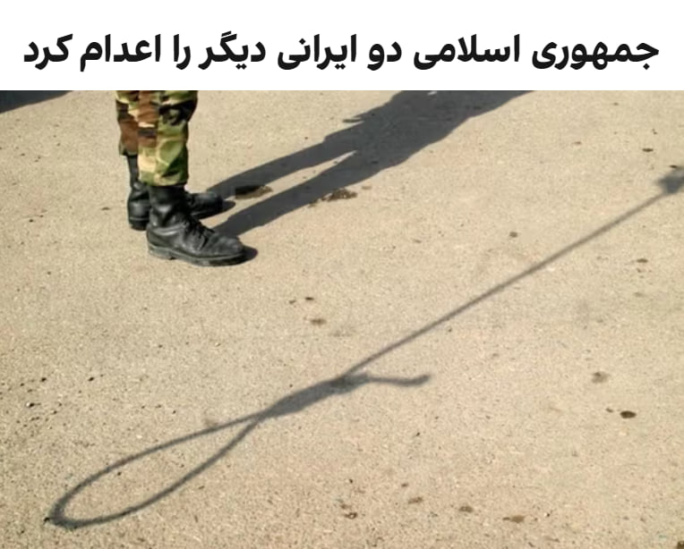

قوه قضائیه جمهوری اسلامی دو زندانی را به اتهام عضویت در «گروه‌های تروریستی تجزیه‌طلب» و «قیام مسلحانه از طریق تشکیل گروه‌های مجرمانه» اعدام کرد.

ارگان رسمی دستگاه قضایی ایران، میزان، هویت این دو نفر را رامین زله و کریم معروف‌پور معرفی کرده و نوشته که آنها صبح روز پنج‌شنبه، ۳۱ اردیبهشت، اعدام شدند.

میزان نوشته که رامین زله «پس از طی دوره‌های آموزشی از طرف گروهک ماموریت پیدا کرده بود تا در ناآرامی‌های کشور به عنوان لیدر شرکت کند».
ارگان رسمی قوه قضائیه ایران همچنین نوشته که این دو نفر «اعتراف» کرده بودند که «برای ترور فرمانده پایگاه سپاه یکی از شهرستان‌های غرب کشور» با یکدیگر «همکاری» داشته و برای این کار، «سلاح» نگهداری می‌کردند.

از زمان حملات آمریکا و اسرائیل به ایران، جمهوری اسلامی اجرای احکام اعدام را افزایش داده است و در برخی روزها چند نفر را اعدام کرده است.
@VahidHeadline

📡 @VahidOnline

## kianmeli1 — post 87529

  <a href="telegram/content/kianmeli1_87529_1779364957.mp4" target="_blank">🎬 Download video</a>

🔴تبلیغ وطن دوستی با شهروندان وارداتی از سنگال، غنا، کنیا، بورکینافاسو، ساحل عاج، نیجریه، تانزانیا، مالی
https://t.me/kianmeli1

## kianmeli1 — post 87528

  

🔴رویترز: مجتبی خامنه‌ای دستور داده است که اورانیوم با غنای بالای ایران باید در داخل کشور باقی بماند
https://t.me/kianmeli1

## kianmeli1 — post 87527

  <a href="telegram/content/kianmeli1_87527_1779364959.mp4" target="_blank">🎬 Download video</a>

🔴پالایشگاه سیزران، استان سامارا، در روسیه توسط پهپادهای اوکراینی مورد حمله قرار گرفته و اکنون در حال سوختن است.
https://t.me/kianmeli1

## IranIntlTV — post 338237

  <a href="telegram/content/IranIntlTV_338237_1779364961.mp4" target="_blank">🎬 Download video</a>

ویدیوی ارسالی به ایران اینترنشنال نشان می‌دهد که ۳۱ اردیبهشت‌ماه گروهی از دانش‌آموزان با بر زمین نشستن و تحصن جلوی ساختمان استانداری در شهرکرد، شعارهایی چون «امتحان حضوری نمی‌خواهیم» و «حمایت، حمایت» سردادند.

## IranIntlTV — post 338236

  <a href="telegram/content/IranIntlTV_338236_1779364963.mp4" target="_blank">🎬 Download video</a>

ویدیوی رسیده به ایران اینترنشنال نشان می‌دهد که شامگاه ۳۱ اردیبهشت در شهر دهلران استان ایلام، گروهی با در دست داشتن پرچم جمهوری اسلامی و بیرق‌های مذهبی، موسیقیِ باکلام عربی را با صدای بلند در خیابان پخش می‌کنند. فرستنده ویدیو گفت: «مزاحمت‌های شبانه طرفداران حکومت، تمامی ندارد.»

## IranIntlTV — post 338235

  <a href="telegram/content/IranIntlTV_338235_1779364965.mp4" target="_blank">🎬 Download video</a>

هم‌زمان با ادامه کارزار مردمی جاویدنامان الغدیر، جزییات تازه‌ای از هویت و چگونگی کشته‌ شدن شماری از جان‌باختگان اعتراضات ۱۸ و ۱۹ دی‌ماه به دست ایران‌اینترنشنال رسیده است. در میان این روایت‌ها، خانواده و نزدیکان ستاره رفیعی، حمیدرضا حق‌پرست و حسین ناصری از نحوه کشته‌ شدن و انتقال پیکر آن‌ها به بیمارستان الغدیر گفته‌اند.

جزییات بیشتر با فرنوش فرجی، عضو تحریریه ایران‌اینترنشنال
@iranintltv

## IranIntlTV — post 338234

  

علی یزدی‌خواه، نایب‌رییس کمیسیون فرهنگی مجلس، گفت در شرایط فعلی تصمیمی برای بازگشایی اینترنت جهانی وجود ندارد و محدودیت‌ها با «ملاحظات امنیتی» ادامه خواهد داشت.

یزدی‌خواه قطع اینترنت جهانی را به مصوبات شورای عالی امنیت ملی نسبت داد و گفت این تصمیم به‌دلیل «مسائل امنیتی، امنیت کشور و حفظ جان افراد» گرفته شده است.

با وجود اینکه نت‌بلاکس اعلام کرده خاموشی اینترنت در ایران وارد هشتادوسومین روز خود شده، یزدی‌خواه گفت بیش از ۹۰ درصد نیازهای مردم در وضعیت فعلی برآورده می‌شود و مراجعات گسترده‌ای در اعتراض به قطع اینترنت وجود ندارد.

او همچنین گفت در قالب طرح موسوم به «اینترنت پرو»، تاکنون بیش از یک میلیون نفر دسترسی دریافت کرده‌اند؛ طرحی که منتقدان آن را مصداق اینترنت طبقاتی و تبعیض‌آمیز می‌دانند، زیرا دسترسی به اینترنت جهانی را به گروه‌های خاص محدود می‌کند و شهروندان عادی را از حق برابر دسترسی آزاد به اینترنت محروم نگه می‌دارد.

نایب‌رییس کمیسیون فرهنگی مجلس همچنین گفت شرکت‌های صادرات و واردات، مراکز علمی و پژوهشی، آزمایشگاه‌ها و برخی اصناف در صورت نیاز می‌توانند برای دسترسی به اینترنت بین‌الملل اقدام کنند.
https

## IranIntlTV — post 338233

  <a href="telegram/content/IranIntlTV_338233_1779364968.mp4" target="_blank">🎬 Download video</a>

ویدیوهای رسیده به ایران اینترنشنال نشان می‌دهد که ۳۱ اردیبهشت در شهرکرد، گروهی از دانش‌آموزان معترض به برگزاری حضوری امتحان‌ها ضمن تلاش برای پاسخگو کردن مسئولان مربوط، شعار «دانش‌آموز داد بزن، حقتو فریاد بزن» سردادند.

## IranIntlTV — post 338232

  

نت‌بلاکس، نهاد ناظر بر اینترنت، نوشت که داده‌های این نهاد نشان می‌دهد قطعی اینترنت در ایران وارد هشتادوسومین روز خود شده و شبکه‌های بین‌المللی بیش از هزار و ۹۶۸ ساعت است که به‌طور گسترده مسدود مانده‌اند.

این نهاد ناظر بر اینترنت با تاکید بر اهمیت دسترسی آزاد به اینترنت نوشت: «اینترنت آزاد و باز، برای حفاظت از جان، آزادی و پاسخگویی عمومی نقشی اساسی دارد.»

## IranIntlTV — post 338231

  <a href="telegram/content/IranIntlTV_338231_1779364971.mp4" target="_blank">🎬 Download video</a>

پس از راه‌اندازی کارزار مردمی ایران‌اینترنشنال برای ثبت هویت جاویدنامان بیمارستان الغدیر، خانواده‌ها و نزدیکان جان‌باختگان در روزهای اخیر اطلاعات تازه‌ای درباره هویت شماری دیگر از کشته‌شدگان ارائه کرده‌اند. ایران‌اینترنشنال اعلام کرده این کارزار برای ثبت حقیقت و شناسایی جاویدنامان در هفته‌ها و ماه‌های آینده ادامه خواهد داشت.
این گزارش حاوی تصاویر تلخ و تکان‌دهنده است.
@iranintltv

## IranIntlTV — post 338230

  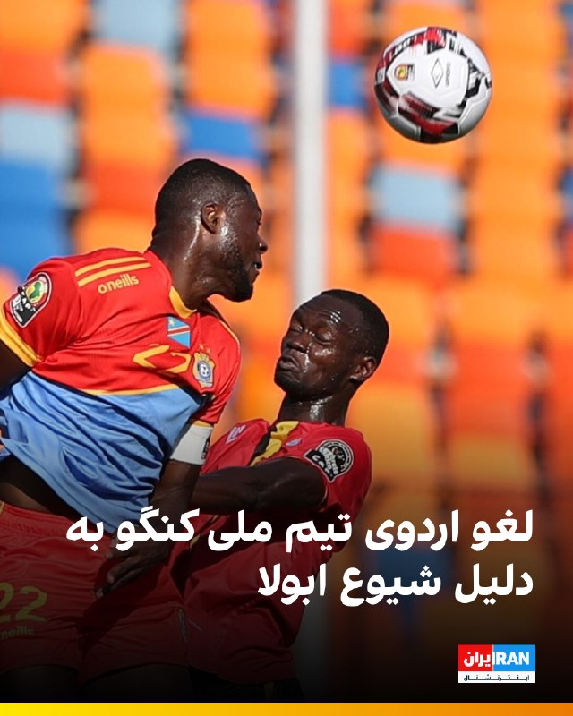

🔻تیم ملی کنگو به دلیل شیوع بیماری ابولا در شرق این کشور، اردوی آماده‌سازی خود را برای جام جهانی، در کینشاسا، پایتخت این کشور لغو کرد. اردوی آماده‌سازی این تیم در پی تشدید این بحران که تاکنون جان بیش از ۱۳۰ نفر را گرفته، به بلژیک منتقل شده است.

🔹سازمان جهانی بهداشت این وضعیت را «وضعیت اضطراری بهداشت عمومی با اهمیت بین‌المللی» نامیده، اما آن را در سطح همه‌گیری جهانی ندانسته است.

🔹تیم ملی کنگو قرار است سوم ژوئن در بلژیک به مصاف دانمارک و نهم ژوئن در اسپانیا به مصاف شیلی برود.

🔹جری کاله‌مو، سخنگوی تیم ملی کنگو به خبرگزاری رویترز گفت دلیل اصلی لغو اردو، محدودیت‌های مسافرتی اعمال‌شده از سوی آمریکا است. آژانس بهداشت عمومی آمریکا ورود افراد غیرآمریکایی را که طی ۲۱ روز گذشته در کنگو، اوگاندا یا سودان جنوبی بوده‌اند، ممنوع کرده است.

@iranintltvsport

## IranIntlTV — post 338229

  <a href="telegram/content/IranIntlTV_338229_1779364974.mp4" target="_blank">🎬 Download video</a>

چهارمین روز دادگاه رسیدگی به پرونده متهمان حمله با چاقو به پوریا زراعتی، مجری تلویزیون ایران‌اینترنشنال، در حال برگزاری است. چهارشنبه دادستان اعلام کرده بود متهمان این پرونده به نیابت از جمهوری اسلامی به زراعتی حمله کرده‌اند.در جریان دادگاه، تصاویر دوربین‌های مداربسته از لحظه حمله به زراعتی نیز به‌عنوان بخشی از مدارک و شواهد به نمایش درآمد.

رضا محدث، خبرنگار ایران‌اینترنشنال، گزارش می‌دهد
@iranintltv

## IranIntlTV — post 338228

  <a href="telegram/content/IranIntlTV_338228_1779364976.mp4" target="_blank">🎬 Download video</a>

ایال زمیر، رییس ستاد کل ارتش اسرائیل، گفت نیروهای این کشور در بالاترین سطح آماده‌باش قرار دارند و برای هر تحول احتمالی آماده‌اند.

بابک اسحاقی، خبرنگار ایران‌اینترنشنال، گزارش می‌دهد
@iranintltv

## IranIntlTV — post 338227

  <a href="telegram/content/IranIntlTV_338227_1779364978.mp4" target="_blank">🎬 Download video</a>

افزایش شدید قیمت دارو، در کنار کمیاب و نایاب شدن بسیاری از اقلام دارویی، باعث شده بسیاری از مردم توان پرداخت هزینه‌های درمان را نداشته باشند. شماری از شهروندان در پیام‌های ارسالی به ایران‌اینترنشنال گفته‌اند به دلیل ناتوانی مالی، از ادامه درمان صرف‌نظر می‌کنند.

لیلا سعادتی، عضو تحریریه ایران‌اینترنشنال، گزارش می‌دهد
@iranintltv

## IranIntlTV — post 338226

  

فداحسین مالکی، عضو کمیسیون امنیت ملی مجلس، با تمجید از اقدامات نیروهای مسلح جمهوری اسلامی در جریان جنگ گفت سران واشینگتن تصور می‌کردند در ایران نیز پیروز خواهند شد، اما «در این میدان به معنای واقعی کلمه میخکوب شدند».

او گفت: «سران واشینگتن که پس از وقایع ونزوئلا دچار غرور و سرمستی سیاسی شده بودند، تصور می‌کردند در حمله به ایران نیز پیروز خواهند بود؛ اما در این میدان به معنای واقعی کلمه میخکوب شدند.»

مالکی همچنین درباره احتمال توافق با آمریکا با میانجی‌گری پاکستان گفت پاکستانی‌ها «حسن نیت» دارند و برای انجام این میانجی‌گری تلاش می‌کنند.

او افزود: «احتمال می‌دهم رفاقتی که عاصم منیر با ترامپ دارد، او را وادار کند شروط را بپذیرد؛ از جمله این‌که وارد تنگه هرمز نشود، وارد غنی‌سازی نشود، خسارت ما را بدهد و پول‌های بلوکه‌شده را آزاد کند.»
https://iranintl.com/202605216184

## IranIntlTV — post 338225

  <a href="telegram/content/IranIntlTV_338225_1779364980.mp4" target="_blank">🎬 Download video</a>

سرخط خبرهای پنجشنبه ۳۱ اردیبهشت
@iranintltv

## IranIntlTV — post 338224

  <a href="telegram/content/IranIntlTV_338224_1779364982.mp4" target="_blank">🎬 Download video</a>

ویدیوی ارسالی به ایران اینترنشنال نشان‌ می‌دهد که ۳۱ اردیبهشت در حوالی روستای سَلَخ شهرستان قشم استان هرمزگان، صف بنزین در کنار جاده ادامه پیدا کرده است. به گفته ساکنان منطقه، مردم این روستا با کمبود سوخت روبرو شده‌اند.

## IranIntlTV — post 338223

  <a href="telegram/content/IranIntlTV_338223_1779364984.mp4" target="_blank">🎬 Download video</a>

بر اساس ویدیو و گزارش‌های رسیده به ایران اینترنشنال شماری از دانش‌آموزان و خانواده‌های آنان در شهرکرد، صبح پنجشنبه ۳۱ اردیبهشت برای اعتراض به حضوری شدن امتحانات جلوی ساختمان استانداری چهارمحال و بختیاری تجمع کرده و شعار سردادند.

## IranIntlTV — post 338222

  

🔻زهرا زارعی، دونده استان کرمان، در مسابقات دوومیدانی جایزه بزرگ بندر ترکمن، رکورد ملی ماده ۴۰۰ متر زنان ایران را پس از ۱۴ سال شکست. او با ثبت زمان ۵۱.۹۷ ثانیه، رکورد این ماده را حدود یک ثانیه بهبود داد.

🔹رکورد ملی ۴۰۰ متر زنان ایران پیش از این با زمان ۵۲.۹۵ ثانیه در اختیار مریم طوسی بود که اردیبهشت ۱۳۹۱ در مسابقات جایزه بزرگ آسیا در تایلند ثبت شده بود.
@iranintltvsport

## IranIntlTV — post 338221

  <a href="telegram/content/IranIntlTV_338221_1779364987.mp4" target="_blank">🎬 Download video</a>

نگرانی‌ها درباره تداوم موج اعدام‌ها در ایران افزایش یافته است. هم‌زمان با اعلام قوه قضاییه درباره اعدام دو زندانی سیاسی، سازمان حقوق بشر ایران نیز از اعدام مخفیانه دو تبعه عراقی در زندان مرکزی کرج خبر داد و نسبت به روند رو به افزایش اجرای احکام اعدام هشدار داد.
گفت‌وگو با شراره عزیزی، عضو تحریریه ایران‌اینترنشنال
@iranintltv

## IranIntlTV — post 338220

  <a href="telegram/content/IranIntlTV_338220_1779364989.mp4" target="_blank">🎬 Download video</a>

روزنامه اسرائیل هیوم گزارش داد نشست کاخ سفید درباره پرونده جمهوری اسلامی با اختلاف‌نظر میان مقام‌های ارشد آمریکا همراه بوده است. به‌گفته این روزنامه، دونالد ترامپ بر ادامه مذاکرات تاکید کرده است. در مقابل، مارکو روبیو، وزیر امور خارجه، و پیت هگست، وزیر جنگ، معتقدند بدون تهدید به حمله و افزایش فشار اقتصادی، از تهران نمی‌شود امتیاز گرفت.
جزییات بیشتر با حسین آقایی، عضو تحریریه ایران‌اینترنشنال
@iranintltv

## IranIntlTV — post 338219

  

غلامرضا تاجگردون، رییس کمیسیون برنامه و بودجه مجلس، گفت دولت امروز به نقطه‌ای رسیده که باید «قرارگاه‌های مردمی تامین منابع مالی پایدار» را شکل دهد.

او اضافه کرد: «این یعنی بانک مرکزی باید یک پشتوانه مردمی دیگر برای تامین منابع داشته باشد؛ چه از جانب افرادی که در داخل کشور منابع دارند و چه ایرانیان خارج از کشور که امروز می‌توانند به اقتصاد کشورشان کمک کنند.»
https://iranintl.com/202605219231

## IranIntlTV — post 338218

  

انور قرقاش، مشاور دیپلماتیک رییس امارات متحده عربی، با انتقاد از رفتار جمهوری اسلامی در منطقه گفت کشورهای خلیج فارس طی دهه‌های طولانی به «زورگویی ایران» عادت کرده‌اند و این رفتار به بخشی از صحنه سیاسی در خلیج فارس تبدیل شده است.

او گفت اعتبار جمهوری اسلامی میان «سخنان تهاجمی» و «بیانیه‌های توخالی دوستی» از بین رفته است.

قرقاش افزود: «امروز، پس از تجاوز آشکار ایران، این حکومت می‌کوشد واقعیتی تازه را تثبیت کند؛ واقعیتی که از یک شکست نظامی روشن زاده شده است. اما تلاش‌ها برای کنترل تنگه هرمز یا تعرض به حاکمیت دریایی امارات، چیزی جز خیال‌پردازی نیست.»

مشاور دیپلماتیک رییس امارات همچنین تاکید کرد هر کشوری که خواهان همزیستی با محیط عربی پیرامون خود است، باید بداند که اعتماد از بین رفته است.

او افزود بازسازی این اعتماد با شعار ممکن نیست، بلکه تنها با «زبان مسئولانه، پاسداشت حاکمیت و پایبندی واقعی به اصول حسن همجواری» امکان‌پذیر است.
https://iranintl.com/202605217797

## Shin_Persian — post 6121

Shin ✓ @hey_itsmyturn
Thu, 21 May 2026 11:59:19 UTC

As if anyone would expect anything else than IRGC (Yeah, not Mojtaba’s decision for sure) not allowing the handover of 400+ Kg of Uranium out of Iran, which is one of the most valuable bargaining chips fir then

فارسی

انگار کسی انتظار چیزی غیر از این را داشت که سپاه پاسداران (قطعا این تصمیم مجتبی نیست) اجازه خروج بیش از ۴۰۰ کیلوگرم اورانیوم را از ایران ندهد، که یکی از ارزشمندترین اهرم‌های چانه‌زنی برای آن‌هاست.

𝕏 · @shin_persian

## Shin_Persian — post 6120

Shin ✓ @hey_itsmyturn
Thu, 21 May 2026 10:02:55 UTC

3 blasts were just heard in Qeshm island.
(Highly likely EOD)
Hormozgan Province, #Iran

فارسی

۳ انفجار دقایقی پیش در جزیره قشم شنیده شد.
(احتمال زیاد خنثی‌سازی مهمات - EOD)
استان هرمزگان، #Iran_

𝕏 · @shin_persian

## ManotoTV — post 105716

  <a href="telegram/content/ManotoTV_105716_1779364993.mp4" target="_blank">🎬 Download video</a>

بر پایه گزارش رسانه‌های حکومتی، ۲۰ ملوان ایرانی که کشتی‌شان در آب‌های سنگاپور توقیف شده بود و در «وضعیت نامناسبی» قرار داشتند، ساعتی پیش به ایران بازگشتند.
سفیر جمهوری‌اسلامی در پاکستان با قدردانی از دولت پاکستان اعلام کرد این ملوانان پس از پیگیری‌های دیپلماتیک و با همکاری مقام‌های پاکستانی، از سنگاپور به اسلام‌آباد منتقل شدند و سپس به کشور بازگشتند.
او از نقش نخست‌وزیر پاکستان، وزارت خارجه و دیگر نهادهای این کشور در آزادی و انتقال ملوانان ایرانی تشکر کرد.

## ManotoTV — post 105715

  <a href="telegram/content/ManotoTV_105715_1779364994.mp4" target="_blank">🎬 Download video</a>

بریتانیا از توافق تجاری ۵ میلیارد دلاری با کشورهای خلیج فارس رونمایی کرد؛ توافقی که در بحبوحه تنش‌های منطقه‌ای پس از جنگ ایران، به گفته لندن «پیامی از ثبات و اعتماد» به بازارها می‌دهد.
این توافق با شورای همکاری خلیج فارس شامل عربستان، امارات، قطر، کویت، عمان و بحرین است و قرار است سالانه حدود ۳.۷ میلیارد پوند به اقتصاد بریتانیا اضافه کند.
لندن می‌گوید ۹۳ درصد تعرفه‌های کشورهای خلیج فارس برای کالاهای بریتانیایی حذف می‌شود؛ از جمله محصولات غذایی، خودرو، صنایع هوافضا و الکترونیک.
در مقابل، بریتانیا نیز برخی تعرفه‌ها را کاهش می‌دهد، هرچند نفت و گاز کشورهای عربی پیش‌تر هم بدون تعرفه وارد بریتانیا می‌شد.
فعالان حقوق بشر از نبود بندهای الزام‌آور درباره حقوق بشر در این توافق انتقاد کرده‌اند و آن را «عقب‌گرد اخلاقی» توصیف کردند.

## ManotoTV — post 105714

  <a href="telegram/content/ManotoTV_105714_1779364994.mp4" target="_blank">🎬 Download video</a>

انور قرقاش، مشاور سیاست خارجی رئیس امارات متحده عربی، در حساب ایکس خود نوشت جمهوری اسلامی پس از تجاوز و شکست نظامی آشکار، در تلاش است واقعیتی جدید را بر منطقه تحمیل کند، اما تلاش برای کنترل تنگه هرمز یا تعرض به حاکمیت دریایی امارات «چیزی جز رویاپردازی نیست.»
قرقاش افزود کشورهای عربی خلیج فارس دهه‌ها به «زورگویی‌های ایران» عادت کرده‌اند؛ تا جایی که این رفتار به بخشی از فضای سیاسی منطقه تبدیل شده و شکاف عمیقی میان شعارهای تهاجمی تهران و ادعاهای دوستی ایجاد کرده است.
او همچنین تأکید کرد هر کشوری که خواهان همزیستی با جهان عرب است باید بداند اعتماد از دست رفته و بازسازی آن نه با شعار، بلکه با احترام به حاکمیت کشورها، زبان مسئولانه و پایبندی واقعی به اصول حسن همجواری ممکن خواهد بود.

## ManotoTV — post 105713

  <a href="telegram/content/ManotoTV_105713_1779364995.mp4" target="_blank">🎬 Download video</a>

بر اساس داده‌های مرکز پایش اینترنت نت‌بلاکس، خاموشی اینترنت در ایران اکنون وارد هشتادوسومین روز خود شده است.
نت‌بلاکس اعلام کرد دسترسی به شبکه‌های بین‌المللی برای بیش از ۱۹۶۸ ساعت به‌طور گسترده مسدود بوده است. این نهاد تأکید کرد اینترنت آزاد و باز نقشی اساسی در حفاظت از جان، آزادی و پاسخگویی عمومی دارد.

## ManotoTV — post 105712

  <a href="telegram/content/ManotoTV_105712_1779364996.mp4" target="_blank">🎬 Download video</a>

وزیران خارجه استرالیا و بلژیک در واکنش به ویدیوی منتشرشده از نحوه برخورد نیروهای اسرائیلی با فعالان «ناوگان آزادی» حامیان غزه، از احضار سفیران اسرائیل خبر دادند. در این ویدیو ده‌ها فعال حامی غزه با دستان بسته روی زمین زانو زده‌اند و ایتامار بن‌گویر، وزیر امنیت ملی اسرائیل، در حالی که پرچم این کشور را در دست دارد، به آن‌ها می‌گوید: «به اسرائیل خوش آمدید.»
ینی وانگ، وزیر خارجه استرالیا، این تصاویر را «غیرقابل قبول» توصیف کرد و گفت «رفتار تحقیرآمیز با بازداشت‌شدگان را محکوم می‌کند». وزیر خارجه بلژیک نیز تصاویر منتشرشده را «عمیقاً نگران‌کننده» خواند و اعلام کرد شماری از شهروندان بلژیک در میان بازداشت‌شدگان هستند.
همزمان جورجا ملونی، نخست‌وزیر ایتالیا، و پدرو سانچز، نخست‌وزیر اسپانیا، نیز این اقدام را محکوم کرده‌اند

## ManotoTV — post 105711

  <a href="telegram/content/ManotoTV_105711_1779364998.mp4" target="_blank">🎬 Download video</a>

سی‌ان‌ان به نقل از منابع اطلاعاتی آمریکا گزارش داد جمهوری اسلامی بازسازی زیرساخت‌های نظامی و تولید پهپاد را سریع‌تر از برآوردهای اولیه از سر گرفته است.
بر اساس این گزارش، ایران در جریان آتش‌بس شش‌هفته‌ای که از اوایل آوریل آغاز شد، بخشی از تولید پهپادهای خود را دوباره راه‌اندازی کرده است. منابع آگاه گفته‌اند این موضوع نشان می‌دهد تهران در حال بازسازی سریع توان نظامی آسیب‌دیده خود در حملات آمریکا و اسرائیل است.
چهار منبع مطلع نیز به سی‌ان‌ان گفته‌اند ارزیابی نهادهای اطلاعاتی آمریکا نشان می‌دهد روند بازسازی ارتش ایران بسیار سریع‌تر از آن چیزی است که پیش‌تر تخمین زده می‌شد
به گفته این منابع، بازسازی پایگاه‌های موشکی، سکوهای پرتاب و ظرفیت تولید سامانه‌های تسلیحاتی نشان می‌دهد ایران همچنان در صورت ازسرگیری حملات، تهدیدی جدی برای متحدان منطقه‌ای آمریکا خواهد بود.
یکی از مقام‌های آمریکایی نیز گفته است برخی برآوردهای اطلاعاتی نشان می‌دهد ایران ممکن است ظرف شش ماه توان کامل حملات پهپادی خود را بازیابی کند.

## ManotoTV — post 105710

  <a href="telegram/content/ManotoTV_105710_1779364998.mp4" target="_blank">🎬 Download video</a>

رسانه‌های اسرائیل به نقل از سی‌ان‌ان گزارش دادند تماس تلفنی اخیر دونالد ترامپ و بنیامین نتانیاهو درباره ایران، «پرتنش» بوده است. بر اساس این گزارش، نتانیاهو خواهان ازسرگیری حملات به ایران شده اما ترامپ خواستار زمان بیشتر برای ادامه دیپلماسی بوده است.
به گزارش رسانه‌های اسرائیل، نتانیاهو گفته تعلل آمریکا به سود ایران است، در حالی که ترامپ تأکید کرده ترجیح می‌دهد فرصت بیشتری به مسیر دیپلماتیک داده شود.
همزمان، وال‌استریت ژورنال گزارش داد اسرائیل نسبت به پایبندی جمهوری اسلامی به هرگونه توافق هسته‌ای تردید دارد و مقام‌های اسرائیلی از آنچه «وقت‌کشی دیپلماتیک ایران» می‌خوانند ابراز نارضایتی کرده‌اند.

دو طرف است

## ManotoTV — post 105709

  <a href="telegram/content/ManotoTV_105709_1779364999.mp4" target="_blank">🎬 Download video</a>

روزنامه تلگراف در گزارشی به واحد مخفی دلفین‌های نیروی دریایی آمریکا پرداخت؛ واحدی که از دوران جنگ سرد برای شناسایی مین‌های دریایی و کمک به عملیات مین‌روبی ایجاد شده است.
بر اساس این گزارش، دلفین‌های پوزه‌بطری با استفاده از توانایی مکان‌یابی صوتی، مین‌ها و اجسام زیر آب را با دقت بالا شناسایی کرده و محل آن‌ها را به نیروهای نظامی اطلاع می‌دهند تا به‌صورت ایمن خنثی شوند.
تلگراف تأکید کرده این دلفین‌ها برای منفجر کردن مین‌ها آموزش نمی‌بینند، بلکه وظیفه آن‌ها شناسایی تهدیدها و کمک به باز نگه داشتن مسیرهای دریایی است.
این گزارش همزمان با افزایش تنش‌ها در تنگه هرمز منتشر شده و به نقش احتمالی این واحد ویژه در تأمین امنیت کشتیرانی در من اشاره می‌کند.

## ManotoTV — post 105708

  <a href="telegram/content/ManotoTV_105708_1779365000.mp4" target="_blank">🎬 Download video</a>

دومین زمین‌لرزه در کمتر از ۱۰ ساعت گذشته، دریای خزر در حوالی شهرستان مرزی آستارا را لرزاند. بنا بر گزارش رسانه‌های داخلی، این زمین‌لرزه ۳.۸ ریشتر قدرت داشته است.
هنوز گزارشی از خسارات احتمالی یا تلفات منتشر نشده است.

## ManotoTV — post 105707

  <a href="telegram/content/ManotoTV_105707_1779365000.mp4" target="_blank">🎬 Download video</a>

وب‌سایت وای‌نت به نقل از یک مقام ارشد اسرائیلی گزارش داد که «جنگ بعدی با ایران، آخرین جنگ نخواهد بود» و تا زمانی که جمهوری اسلامی در قدرت باشد، احتمال تکرار درگیری‌ها وجود دارد.
این مقام گفته است باید «انتظارات عمومی بازتنظیم شود» زیرا حتی در صورت حمله‌ای دیگر، تهدیدها علیه اسرائیل پایان نخواهد یافت. به گفته او، در صورت ادامه وضعیت کنونی، ممکن است درگیری‌ها هر سال یا حتی در بازه‌های کوتاه‌تر تکرار شوند.
این مقام اسرائیلی همچنین مدعی شد هدف از این سیاست، مهار تهدید هسته‌ای و برنامه موشک‌های بالستیک ایران علیه موجودیت اسراییل است.

## FarsiVOA — post 218289

▪️مدیر شرکت ملی نفت ابوظبی اعلام کرد که حتی اگر اکنون درگیری‌ها در خاورمیانه پایان یابد، جریان صادرات نفت از تنگه هرمز تا سه‌ماهه اول یا دوم سال ۲۰۲۷ کاملاً به حالت قبل از این جنگ بازنخواهد گشت.

▪️او افزود که محاصره تنگه هرمز از سوی جمهوری اسلامی یک اقدام «خطرناک» است.

▪️منطقه خلیج فارس پیشتر بحران‌های مرتبط با انرژی را تجربه کرده اما این اولین بار است که یک بحران انرژی طولانی در این منطقه به دلیل انسداد تنگه هرمز ایجاد می‌شود.

▪️جمهوری اسلامی از آغاز درگیری نظامی با آمریکا و اسرائیل، عملاً این آبراه را که گلوگاهی برای عبور حدود یک‌پنجم صادرات جهانی نفت است، مسدود کرده است.

⬇️ بیشتر بخوانید:
https://ir.voanews.com/a/8152364.html

## FarsiVOA — post 218288

  <a href="telegram/content/FarsiVOA_218288_1779365001.mp4" target="_blank">🎬 Download video</a>

فرماندهی مرکزی ایالات متحده، سنتکام، اعلام کرد نیروهای تفنگدار دریایی آمریکا در دریای عمان روز چهارشنبه ۳۰ اردیبهشت وارد یک نفتکش تجاری با پرچم رژیم ایران به نام نفتکش ام‌تی «سلستیال سی» شدند.

به گفته سنتکام، این نفتکش مظنون به تلاش برای نقض محاصره دریایی آمریکا و حرکت به سوی یک بندر ایران بوده است. سنتکام می‌گوید پس از بازرسی، کشتی رفع توقیف شد و به خدمه دستور تغییر مسیر داده شد.

آمریکا همچنین اعلام کرد تاکنون مسیر ۹۱ کشتی تجاری را تغییر داده است.

@FarsiVOA

## FarsiVOA — post 218287

  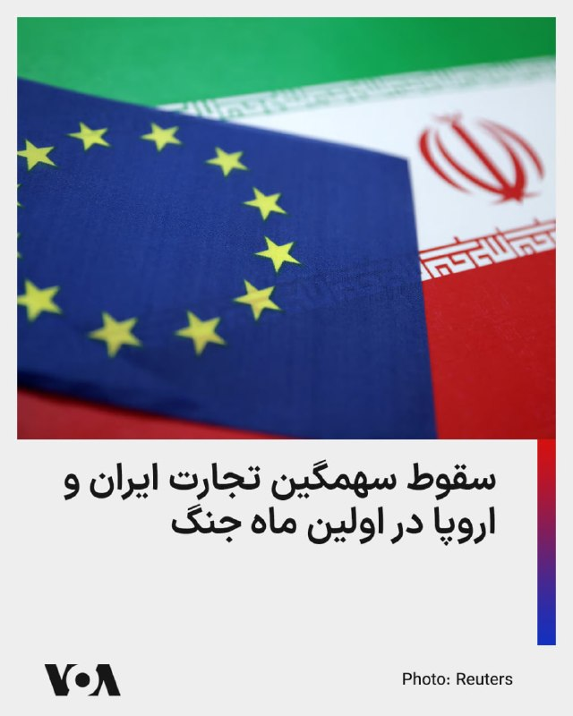

داده‌های جدید مرکز آمار اتحادیه اروپا، از سقوط چشمگیر تجارت این اتحادیه با ایران در ماه مارس، اولین ماه عملیات نظامی مشترک آمریکا و اسرائیل علیه جمهوری اسلامی، خبر می‌دهد.

آلمان بزرگترین شریک تجاری ایران در اتحادیه اروپا، در ماه مارس کمتر از ۲۵ میلیون یورو صادرات به ایران داشته که تقریباً یک سوم ماه‌های پیش از جنگ است.

صادرات ایتالیا، دومین شریک بزرگ تجاری، به ایران نیز تقریباً به همین میزان افت داشته و به زیر ۱۰ میلیون یورو رسیده است.

صادرات فرانسه و اتریش به ایران نیز به یک پنجم ماه‌های پیش از جنگ سقوط کرده است. صادرات ایران به اتحادیه اروپا در ماه مارس هم افت داشته، اما نه به اندازه افت وارداتش از این اتحادیه.

ایران پارسال ۷۵۰ میلیون یورو صادرات و ۲.۷ میلیارد یورو واردات از اتحادیه اروپا داشت.
@FarsiVOA

## FarsiVOA — post 218286

  <a href="telegram/content/FarsiVOA_218286_1779365003.mp4" target="_blank">🎬 Download video</a>

بازداشت ۸ فلسطینی در یک کامیون هنگام ورود غیرقانونی به اسرائیل؛

نیروهای امنیتی اسرائیل بیش از ۸ شهروند فلسطینی را که در یک محفظه مخفی در داخل یک کامیون پنهان شده بودند، بازداشت کردند.

این افراد تلاش می‌کردند به صورت غیرقانونی و از طریق پنهان شدن در دیواره کاذب کامیون وارد خاک اسرائیل شوند.

پس از کشف این محفظه مخفی، تمامی سرنشینان آن توسط نیروهای امنیتی بازداشت و برای بازجویی و بررسی انگیزه‌های ورودشان منتقل شدند.
@FarsiVOA

## FarsiVOA — post 218284

  <a href="telegram/content/FarsiVOA_218284_1779365005.mp4" target="_blank">🎬 Download video</a>

حمله پهپادی اوکراین به پالایشگاه «سیزران» روسیه از فاصله ۸۰۰ کیلومتری؛

ولودیمیر زلنسکی، رئیس‌جمهور اوکراین، رسماً تایید کرد که ارتش این کشور پالایشگاه نفت سیزران در خاک روسیه را هدف قرار داده است.

این هدف‌گیری از فاصله‌ بیش از ۸۰۰ کیلومتری از مرز اوکراین انجام شده است.

این عملیات به عنوان یکی از دوربردترین حملات اوکراین در عمق خاک روسیه تا به امروز ثبت شده است.

حمله به این پالایشگاه در راستای استراتژی جدید اوکراین برای ضربه زدن به زیرساخت‌های حیاتی و درآمدهای نفتی ارتش روسیه انجام شده است.

پیشتر فایننشال تایمز به نقل از منابع آگاه گزارش داده بود که رئیس‌جمهور چین در جریان گفت‌وگوهای خود با دونالد ترامپ در پکن، گفته که ولادیمیر پوتین ممکن است در نهایت از تهاجم خود به اوکراین «پشیمان» شود.
@FarsiVOA

## FarsiVOA — post 218283

  <a href="telegram/content/FarsiVOA_218283_1779365007.mp4" target="_blank">🎬 Download video</a>

رهگیری خطرناک هواپیمای گشت‌زنی بریتانیا توسط جنگنده‌های روسیه در دریای سیاه؛

وزارت دفاع بریتانیا با انتشار این ویدیو از رهگیری «شدیدا خطرناک» یک فروند هواپیمای راهبردی «ریوت جوینت» متعلق به نیروی هوایی سلطنتی، توسط جنگنده‌های ارتش روسیه در حریم هوایی بین‌المللی بر فراز دریای سیاه خبر داد.

جنگنده‌های روسی در اقدامی بی‌مهابا تا فاصله ۶ متری هواپیمای بریتانیایی نزدیک شدند که این مانور خطرناک باعث فعال شدن سیستم‌های هشدار اضطراری خودکار این هواپیما شد.

این هواپیمای پیشرفته جاسوسی و الکترونیکی بریتانیا، در حال انجام یک پرواز گشت‌زنی روتین برای پشتیبانی از عملیات ناتو و تقویت امنیت جناح شرقی این ائتلاف بود که علی‌رغم این مزاحمت، ماموریت خود را با موفقیت و به سلامت به پایان رساند.

مقامات بریتانیا این حادثه را نشانه‌ای از تداوم رفتارهای تهاجمی روسیه در شرق اروپا ارزیابی و تأکید کردند که لندن و متحدانش در ناتو در برابر این تهدیدات یکپارچه خواهند ماند.
@FarsiVOA

## FarsiVOA — post 218282

  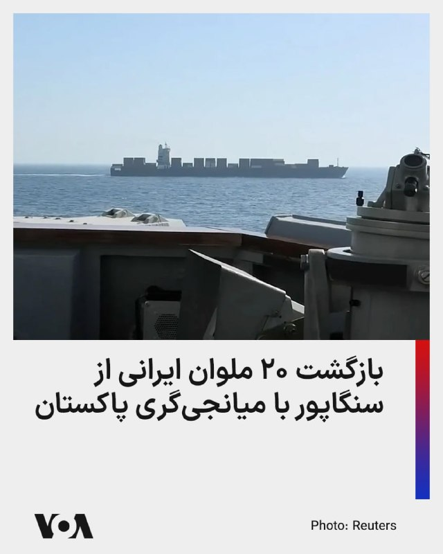

رسانه‌های حکومتی جمهوری اسلامی از بازگشت ۲۰ ملوان ایرانی در پی توقیف کشتی آنان توسط نیروهای آمریکایی در سواحل سنگاپور خبر دادند.

دقیقاً مشخص نیست نام کشتی توقیف شده چه بوده، اما دو هفته پیش نیز یک گروه از ملوانان کشتی توقیف شده «توسکا» با وساطت پاکستان آزاد و به ایران بازگشتند. اوایل اردیبهشت نیز وزارت جنگ آمریکا از ورود نیروهای نظامی ایالات متحده به عرشه نفتکش «تیفانی» مرتبط با جمهوری اسلامی در منطقه هند-آرام و توقیف کشتی و خدمه آن خبر داده بود.

دولت پاکستان اوایل هفته جاری خبر داده بود که طبق توافقاتی که با آمریکا انجام داده، ۲۰ ملوان ایرانی یک کشتی توقیف شده جمهوری در سنگاپور را به خاک پاکستان منتقل کرده است.

اکنون رسانه‌های ایران می‌گویند خدمه‌های یاد شده پنجشنبه با پرواز ماهان ایر به تهران بازگشتند.
@FarsiVOA

## FarsiVOA — post 218281

🔺پاکستان همزمان با احتمال سفر عاصم منیر به تهران تلاش‌های دیپلماتیک را افزایش داد

▪️پاکستان با طرح احتمال سفر از پیش برنامه‌ریزی‌نشده رئیس ستاد ارتش این کشور به تهران، تلاش‌ها برای تسریع روند مذاکرات آمریکا و جمهوری اسلامی را افزایش داد.

▪️رویترز پنجشنبه از قول سه منبع آگاه از مذاکرات نوشت که عاصم منیر در این روز تصمیم می‌گیرد در چارچوب تلاش‌های میانجی‌گری به تهران سفر کند یا نه.

▪️این سفر در ادامه سفرهای مکرر مقامات پاکستانی به تهران با هدف میانجیگری برای پایان جنگ علیه جمهوری اسلامی است.

▪️پرزیدنت ترامپ که روز دوشنبه از توقف موقت یک حمله برنامه‌ریزی‌شده به منظور به نتیجه رسیدن مذاکرات جاری خبر داد، بارها بر عزم خود برای جلوگیری از دستیابی ایران به سلاح هسته‌ای تأکید کرده است.

⬇️ بیشتر بخوانید:
https://ir.voanews.com/a/pakistan-steps-up-diplomatic-bid-to-get-iran-us-peace-talks-on-track/8152360.html

## FarsiVOA — post 218279

🔺رکورد جمهوری اسلامی در ایجاد محدودیت ارتباطی برای شهروندان به مرز ۲۰۰۰ ساعت رسید

▪️جمهوری اسلامی باز هم رکورد خود در ایجاد محدودیت در دسترسی به اینترنت را بالاتر برد و اکنون شهروندان ایرانی هشتادوسومین روز از خاموشی دیجیتال را تجربه می‌کنند.

▪️براساس گزارش نت‌بلاکس، نهاد ناظر بر اختلالات اینترنت، خاموشی اینترنت از مرز هزار و ۹۸۶ ساعت گذشته است.

▪️به گفته نت‌بلاکس، اینترنت آزاد و باز، نقشی اساسی در حفاظت از جان انسان‌ها، آزادی، و پاسخ‌گویی عمومی دارد.

▪️این سطح بی‌سابقه از محدودیت نشان می‌دهد که قطع اینترنت دیگر یک ابزار موقت و اضطراری برای مهار کوتاه‌مدت اعتراضات یا مواجه با شرایط بحرانی نیست، بلکه به عنوان یک زیرساخت یکپارچه برای کنترل مطلق جریان اطلاعات به کار گرفته شده است.

⬇️ بیشتر بخوانید:
https://ir.voanews.com/a/8152359.html

## FarsiVOA — post 218278

  

وزارت خارجه چین اعلام کرد که شهباز شریف، نخست‌وزیر پاکستان، از ۲۳ تا ۲۶ مه (دوم تا پنجم خرداد) به چین سفر خواهد کرد. این سفر سه روز پس از سفرهای اخیر رهبران آمریکا و روسیه به چین صورت می‌گیرد.

همچنین محمد اسحاق دار، وزیر خارجه پاکستان در اواخر ماه مارس و در بحبوحه تلاش‌های فشرده برای کاهش تنش‌ها در خاورمیانه به پکن سفر کرده بود.

پاکستان در روزهای اخیر تلاش‌های دیپلماتیک خود را برای تسریع مذاکرات صلح میان آمریکا و ایران افزایش داده است.

در حالی که تهران اعلام کرد در حال بررسی پاسخ‌های جدید واشنگتن است، دونالد ترامپ، رئیس‌جمهور آمریکا، گفته ممکن است چند روز برای «پاسخ‌های درست» از تهران صبر کند، اما او هشدار داده که آماده ازسرگیری حملات به جمهوری اسلامی است.
@FarsiVOA

## FarsiVOA — post 218277

🔺جهش ۴۰ درصدی فروش خودروهای برقی در خاورمیانه

▪️آژانس بین‌المللی انرژی از جهش ۴۰ درصدی فروش خودروهای برقی در خاورمیانه طی سال ۲۰۲۵ خبر داد.

▪️سال گذشته ۷۵ هزار دستگاه خودرو برقی در خاورمیانه به فروش رفته که نیمی از آنها در امارات و ۴۵ درصد در عربستان و قطر ثبت شده است.

▪️فروش خودروهای برقی در آسیای مرکزی نیز به شدت اوج گرفته و به ۶۰ هزار دستگاه در سال گذشته رسیده است.

▪️بازار ترکیه کماکان صدرنشین فروش خودروهای برقی منطقه است و پارسال ۲۴۰ هزار دستگاه خودرو برقی در این کشور به فروش رسیده که دو برابر سال ۲۰۲۴ است.

⬇️ بیشتر بخوانید:
https://ir.voanews.com/a/8152358.html

## FarsiVOA — post 218276

  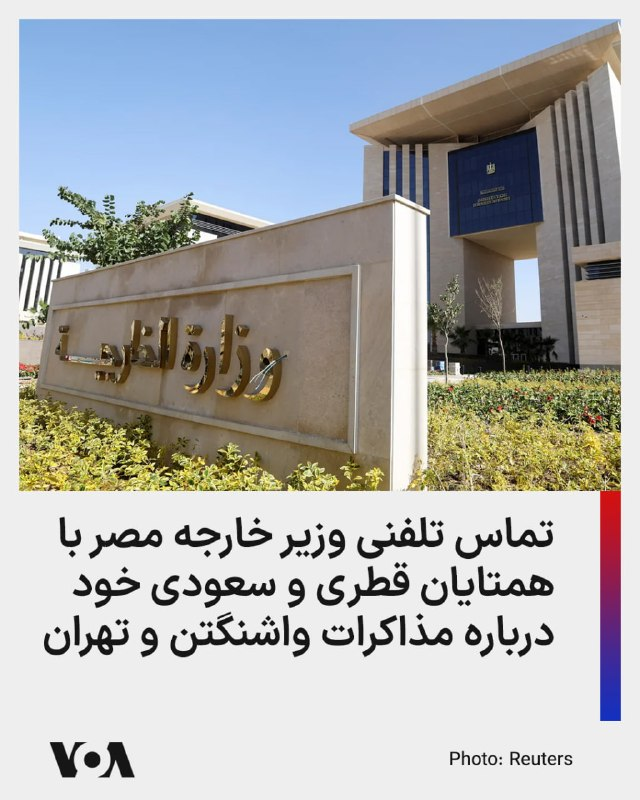

وزارت خارجه مصر اعلام کرد که وزیر خارجه این کشور در دو تماس جداگانه با همتایان قطری و سعودی خود درباره مذاکرات جاری میان تهران و واشنگتن گفت‌وگو کرد.

در بیانیه وزارت خارجه مصر آمده که این تماس‌ها از سوی بدر عبدالعاطی در روز چهارشنبه صورت گرفته است. این بیانیه می‌افزاید: «در این دو تماس، هماهنگی مستمر درباره تحولات شتابان منطقه و تلاش‌های مشترک برای مهار وضعیت کنونی تنش و کاهش تنش مورد بحث قرار گرفت.»

بر اساس این گزارش، عبدالعاطی «از موضع رئیس‌جمهور آمریکا، دونالد ترامپ، در فراهم کردن فرصت برای گفت‌وگو و دیپلماسی به منظور حل اختلافات و جلوگیری از گرفتار شدن منطقه در خطر کشیده شدن به رویارویی‌های گسترده‌تر، قدردانی کرد.»

وزیر خارجه مصر همچنین بر «اهمیت بسیار بالای ادامه مسیر مذاکرات آمریکا - ایران تا دستیابی به توافقی متوازن که منافع همه طرف‌ها را تأمین کند»، تأکید کرد.

او با این حال گفت که «هرگونه توافق باید نگرانی‌های امنیتی کشورهای منطقه، به‌ویژه امنیت و ثبات کشورهای خلیج فارس را مدنظر قرار دهد، زیرا این موضوع یکی از ارکان اساسی امنیت ملی مصر و جهان عرب به شمار می‌رود.»
@FarsiVOA

## FarsiVOA — post 218275

  

رسانه‌های ایران گزارش دادند که عاصم منیر، رئیس ستاد ارتش پاکستان روز پنجشنبه به تهران سفر خواهد کرد. این سفر در ادامه سفرهای مکرر مقامات بلندپایه پاکستانی به تهران در چارچوب میانجیگری برای پایان جنگ علیه جمهوری اسلامی است.

خبرگزاری ایسنا نوشت که منیر در جریان این سفر با مقامات حکومت ایران گفت‌وگو خواهد کرد.

روز چهارشنبه نیز وزیر کشور پاکستان در تهران بود و شامگاه چهارشنبه سخنگوی وزارت خارجه جمهوری اسلامی اعلام کرد که مقامات حکومت ایران در حال بررسی آخرین نظرات دولت آمریکا درباره مذاکرات برای پایان دادن به جنگ هستند.

دونالد ترامپ، رئیس‌جمهور آمریکا، روز دوشنبه با اعلام توقف موقت یک حمله برنامه‌ریزی‌شده به حکومت ایران، اعلام کرد که این تصمیم برای به نتیجه رسیدن مذاکرات جاری بوده است.

آقای ترامپ اعلام کرده که آماده است چند روزی صبر کند تا «پاسخ‌های درست» را از تهران دریافت کند، اما هشدار داده که اگر توافقی حاصل نشود، حملات از سر گرفته خواهند شد.
@FarsiVOA

## FarsiVOA — post 218274

  

وزارت تجارت بریتانیا از امضای قرارداد لغو بخشی از تعرفه‌ کالاهای صادراتی این کشور با اعضای شورای همکاری خلیج فارس خبر داد. طبق توافق، سالانه ۵۸۰ میلیون پوند (۷۸۰ میلیون دلار) تعرفه کشورهای عرب حوزه خلیج فارس بر صادرات کالاهای بریتانیایی لغو شد.

وزارت بازرگانی بریتانیا می‌گوید ارزش این قرارداد با کشورهای عربستان، امارات، قطر، بحرین، عراق و عمان بر اقتصاد این کشور پنج میلیارد دلار خواهد بود.

این قرارداد در میانه تنش‌های منطقه، انسداد تنگه هرمز توسط جمهوری اسلامی و محاصره دریایی جمهوری اسلامی توسط آمریکا امضا شد. پیشتر بریتانیا قراردادهای مشابهی با هند و کره جنوبی امضا کرده بود.
@FarsiVOA

## FarsiVOA — post 218273

  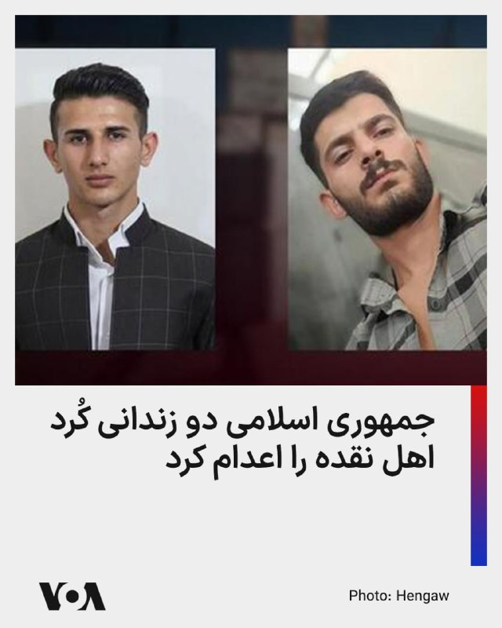

🔺جمهوری اسلامی دو زندانی سیاسی کرد را اعدام کرد

▪️دستگاه قضایی جمهوری اسلامی از اعدام دو زندانی سیاسی کرد به نام‌های رامین زله و کریم معروف‌پور خبر داد.

▪️آقای زله در مرداد ۱۴۰۳، توسط نیروهای امنیتی بدون ارائه حکم قضایی بازداشت شده بود، و «از طریق ویدئو کنفرانس در یک جلسه دادرسی چند دقیقه‌ای» محاکمه شده بود و از حق دسترسی به وکیل هم محروم بود.

▪️همچنین آقای معروف‌پور نیز فروردین ۱۴۰۰ توسط نیروهای امنیتی در سردشت و تحت ضرب و شتم بازداشت شد.

▪️شهروندان کُرد در ایران پس از انقلاب ۱۳۵۷، به‌طور مکرر و گسترده با اتهاماتی نظیر «اقدام علیه امنیت ملی از طریق عضویت در احزاب کُرد مخالف نظام» و عنوان کیفری «بغی» با احکام سنگین، از جمله اعدام، مواجه شده‌اند.

⬇️ بیشتر بخوانید:
https://ir.voanews.com/a/iran-executed-two-kurdish-citizens-ramin-zele-and-karim-maroufpour/8152357.html

## FarsiVOA — post 218272

  

سخنگوی وزارت خارجه جمهوری اسلامی اعلام کرد که مقامات حکومت ایران در حال بررسی آخرین نظرات دولت آمریکا درباره مذاکرات برای پایان دادن به جنگ هستند.

اسماعیل بقایی شامگاه چهارشنبه به صداوسیمای جمهوری اسلامی گفت: «از طریق واسطه پاکستانی و متمرکز بر طرح اولیه ۱۴ بندی ایران، تبادل پیام‌ها [میان تهران و واشنگتن] در چند نوبت انجام شده است. ما نقطه نظرات طرف آمریکایی را دریافت کردیم و در حال بررسی هستیم.»

او درباره حضور وزیر کشور پاکستان در ایران نیز گفت که «برای تسهیل این تبادل پیام‌ها» بوده است.

وزیر کشور پاکستان روز چهارشنبه در تهران حضور داشت و دومین سفر او به ایران طی یک هفته اخیر محسوب می‌شد.

دونالد ترامپ، رئیس‌جمهور آمریکا، روز دوشنبه با اعلام توقف موقت یک حمله برنامه‌ریزی‌شده به حکومت ایران، اعلام کرد که این تصمیم برای به نتیجه رسیدن مذاکرات جاری بوده است.

آقای ترامپ اعلام کرده که آماده است چند روزی صبر کند تا «پاسخ‌های درست» را از تهران دریافت کند، اما هشدار داده که اگر توافقی حاصل نشود، حملات از سر گرفته خواهند شد.
@FarsiVOA

## FarsiVOA — post 218271

  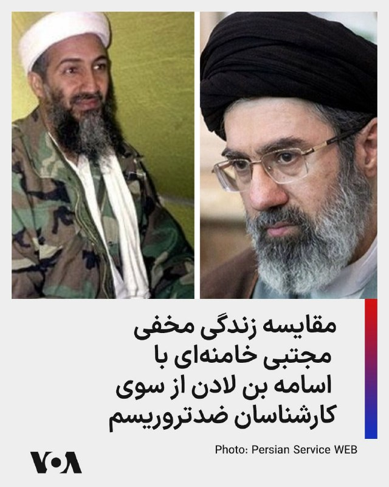

⚡️فاکس‌نیوز در گزارشی درباره مجتبی خامنه‌ای، رهبر جدید جمهوری اسلامی نوشت که او نزدیک به سه ماه است که در بحبوحه تشدید تنش‌ها با آمریکا در مخفیگاه به سر می‌برد.
این گزارش به نقل از تحلیلگران مبارزه با تروریسم، می‌گوید که پنهان‌شدن مجتبی خامنه‌ای یادآور سال‌های پایانی عمر اسامه بن لادن، مغز متفکر گروه تروریستی القاعده، است که در خانه‌ای در پاکستان سال‌ها پنهان شده بود.
تشکیلات اطلاعاتی ایالات متحده سرانجام با ردیابی یکی از پیک‌های اسامه بن لادن محل زندگی او را شناسایی کرد و این امر منجر به حمله‌ی نیروی دریایی ایالات متحده در سال ۲۰۱۱ شد که به کشته شدن رهبر القاعده در مخفیگاهش انجامید.
@FarsiVOA

## FarsiVOA — post 218270

🔺مقام ارشد کاخ سفید: باقیمانده رهبران جمهوری اسلامی یک «انتخاب دوگانه» دارند، یا توافق یا مجازاتی بی‌مانند در تاریخ مدرن

▪️استیون میلر، از مقامات ارشد کاخ سفید، در مصاحبه‌ای تلویزیونی گفت باقی‌مانده رهبران جمهوری اسلامی، همانطور که رئيس جمهوری آمریکا، دونالد ترامپ، «خیلی روشن» گفته است با یک «انتخاب دوگانه» روبرو هستند: «یا می‌توانند با یک توافق‌نامه‌ای موافقت کنند که برای ایالات متحده رضایت‌بخش باشد، یا باید با مجازاتی از سوی ارتش ما روبه‌رو شوند؛ مجازاتی که مانندش در تاریخ مدرن دیده نشده است. این انتخابی است که پیش روی آن‌ها است.»

⬇️ بیشتر بخوانید:
https://ir.voanews.com/a/8152356.html
@FarsiVOA

## FarsiVOA — post 218269

⚡️نخستين نتیجه از سياست بستن تنگه، خفگى اقتصاد جمهورى اسلامى
@FarsiVOA

## FarsiVOA — post 218268

  <a href="telegram/content/FarsiVOA_218268_1779365015.mp4" target="_blank">🎬 Download video</a>

⚡️واکنش‌ها به سفر احتمالی طالبان به اروپا
@FarsiVOA

## DW_Farsi — post 124956

  

🔶 هشدار مشاور رئیس امارات به ایران: تلاش برای کنترل تنگه هرمز خیال خامی بیش نیست

انور قرقاش، مشاور دیپلماتیک رئیس امارات متحده عربی، هشدار داد تلاش‌های جمهوری اسلامی برای اعمال حاکمیت بر تنگه هرمز یا تجاوز به حاکمیت دریایی امارات "خیال خامی بیش نیست".

قرقاش روز پنج‌شنبه با انتشار پیامی در ایکس نوشت: «ما طی دهه‌های طولانی به زورگویی‌های ایران عادت کرده‌ایم، تا جایی که این رفتار به بخشی از چشم‌انداز سیاسی خلیج فارس تبدیل شده و در میان لفاظی‌های تهاجمی و اعلام دوستی‌های توخالی، جایی برای اعتبار باقی نمانده است.»

او ادامه داد: «امروز، پس از تجاوز وحشیانه ایران، رژیم تلاش می‌کند واقعیتی جدید را که از یک شکست آشکار نظامی متولد شده تثبیت کند، اما تلاش برای کنترل تنگه هرمز یا تعرض به حاکمیت دریایی امارات متحده عربی چیزی جز خیال خام نیست.»

@dw_farsi

## DW_Farsi — post 124955

  

🔶 شریعتمداری: تنگه هرمز باید تا کشته شدن ترامپ به روی آمریکایی‌ها بسته بماند

حسین شریعتمداری، مدیرمسئول روزنامه کیهان، خواستار آن شد تا تمام کشتی‌ها و شناور‌هایی که متعلق به اسرائیل هستند یا برای این کشور نفت حمل می‌کنند، مصادره شوند. او در یادداشتی با انتقاد از مجلس شورای اسلامی به دلیل "به تعویق انداختن تعیین و تصویب نظام قانونی" برای اعمال حاکمیت ایران بر تنگه هرمز نوشت، جمهوری اسلامی باید از "تمامی شناورها بدون استثناء" عوارض دریافت کند و این تنگه را به روی شناورهای آمریکایی و متحدان این کشور ببندد.

شریعتمداری همچنین اضافه کرد تنگه هرمز باید تا زمان "دریافت خسارت‌‌های وارده از آمریکا و متحدان غربی و عربی آن" و نیز "برچیده‌ شدن پایگاه‌های آمریکایی از منطقه و در صدر آن کشتن ترامپ و دار و دسته‌" او بسته بماند.

ابراهیم عزیزی، رئیس کمیسیون امنیت ملی و سیاست خارجی مجلس، اخیرا گفته بود طرحی برای ارائه به صحن مجلس تدوین شده که در آن مقرر شده است دولت به هر فرد حقیقی یا حقوقی که دونالد ترامپ، رئیس جمهور آمریکا، را بکشد "۵۰ میلیون یورو" پاداش دهد.

@dw_farsi

## DW_Farsi — post 124954

  

🔶 سی‌ان‌ان‌: ایران سریع‌تر از حد انتظار در حال بازیابی توانمندی‌های نظامی خود است

دو منبع آگاه به شبکه خبری "سی‌ان‌ان" گفته‌اند که ارزیابی‌های اطلاعاتی ایالات متحده نشان می‌دهد ایران در طول آتش‌بس که از حدود شش هفته پیش آغاز شده، بخشی از تولید پهپادی خود را از سر گرفته‌ است و این امر نشان می‌دهد که این کشور به سرعت در حال بازسازی برخی از قابلیت‌های نظامی تضعیف‌شده خود در پی جنگ با آمریکا و اسرائیل است.

سی‌ان‌ان روز پنج‌شنبه به نقل از چهار منبع مطلع دیگر گزارش داد که بر اساس ارزیابی اطلاعاتی آمریکا، ارتش ایران "بسیار سریع‌تر از برآوردهای اولیه" در حال بازسازی توان نظامی خود است.

این منابع گفته‌اند بازسازی‌ توانمندی‌های نظامی نظیر جایگزینی سایت‌های موشکی، پرتابگر‌ها و ظرفیت تولید سامانه‌های تسلیحاتی کلیدی که در جنگ نابود شده‌اند، به این معناست که در صورت از سرگیری حملات آمریکا و اسرائیل، ایران همچنان تهدیدی جدی برای متحدان منطقه‌ای آمریکا خواهد بود. به نوشته سی‌ان‌ان‌ این موضوع همچنین ادعاها در مورد میزان واقعی تأثیر حملات آمریکا و اسرائیل بر تضعیف بلندمدت توان نظامی ایران تردید ایجاد کرده است.

@dw_farsi

## DW_Farsi — post 124953

  

📸 کلاه‌ها به نشانه شادی در هوا

مراسم پایانی دوره افسری گارد ساحلی ایالات متحده در نیولندن با شادی فارغ‌التحصیلان برگزار شد. آکادمی گارد ساحلی آمریکا پیشینه‌ای طولانی دارد. در جشن امسال دونالد ترامپ، رئیس جمهور آمریکا حضور داشت و سخنانی خطاب به فارغ‌التحصیلان ایراد کرد. پرسنل گارد ساحلی آمریکا بیش از ۴۳ هزار نفر است.

## DW_Farsi — post 124952

  

🔶 عاصم منیر، فرمانده ارتش پاکستان، راهی تهران می‌شود

رسانه‌های داخلی ایران گزارش داده‌اند فیلد مارشال عاصم منیر، فرمانده ارتش پاکستان، روز پنج‌‌شنبه ۳۱ اردیبهشت به تهران سفر می‌کند. این سفر در حالی صورت می‌گیرد که روز چهارشنبه نیز وزیر کشور پاکستان برای دومین بار در هفته جاری به تهران رفته و با مسعود پزشکیان، رئیس جمهور و اسکندر مؤمنی وزیر کشور ایران دیدار و گفت‌وگو کرده بود.

در این گزارش‌ها بدون اشاره به جزئیات بیشتر گفته شده که عاصم منیر برای "ادامه گفت‌وگو‌ها و رایزنی با مقامات" ایرانی در چارچوب تلاش‌های میانجی‌گرانه پاکستان میان ایران و آمریکا راهی تهران می‌شود.

@dw_farsi

## DW_Farsi — post 124951

  

🔶 رئیس جمهور آلمان: جنگ ایران یک جنگ غیرضروری است

فرانک والتر اشتاین‌مایر، رئیس جمهور آلمان، در گفت‌وگویی با پادکست "Vorangedacht" حمله نظامی آمریکا و اسرائیل به ایران را "قابل اجتناب" خوانده و گفت: «این جنگ غیرضروری است.»

اشتاین مایر با اشاره به توافق هسته‌ای سال ۲۰۱۵ موسوم به "برجام" که میان ایران و غرب امضا شد و آمریکا در نخستین دوره ریاست‌جمهوری دونالد ترامپ در سال ۲۰۱۸ از آن خارج شد، گفت: «خوب می‌بود که ما این توافق را حفظ می‌کردیم. عواقبی که اکنون شاهد آن هستیم، نباید اتفاق می‌افتادند.»

رئیس جمهور آلمان اوایل فروردین نیز در یک سخنرانی شدیدالحن، جنگ ایران را "یک خطای سیاسی فاجعه‌بار" خوانده و گفته بود اگر هدف آن متوقف کردن ایران در مسیر دستیابی به سمت بمب اتمی بوده باشد، "یک جنگ واقعا قابل اجتناب و غیرضروری" است.

@dw_farsi

## DW_Farsi — post 124950

  

🔶 سازمان حقوق بشر ایران: دو شهروند عراقی در ایران به اتهام جاسوسی اعدام شدند

"سازمان حقوق بشر ایران" روز چهارشنبه ۳۰ اردیبهشت از اعدام دو شهروند عراقی در زندان مرکزی کرج خبر داد.

این سازمان هویت این دو نفر را علی نادر العبیدی ۲۷ ساله و فاضل شیخ کریم ۲۹ ساله معرفی کرده و گفته است که آنها در یک پرونده مشترک به اتهام "جاسوسی"، سحرگاه روز دوشنبه ۱۷ فروردین در سکوت خبری اعدام شدند.

طبق این گزارش این دو زندانی از شهروندان عرب و اهل شهر عماره در عراق بوده‌اند که پیش‌تر در کرج بازداشت و به "جاسوسی برای نهادهای اطلاعاتی و امنیتی یکی از کشورهای عربی" متهم شده بودند.

یک منبع مطلع به سازمان حقوق بشر ایران گفته است علی نادر العبیدی و فاضل شیخ کریم پیش از صدور حکم، "به مدت ۱۱ ماه در بازداشتگاه وزارت اطلاعات تحت بازجویی قرار داشتند و سپس به بند اطلاعات سپاه در زندان رجایی‌شهر کرج منتقل شدند".

طبق این گزارش،‌ این دو زندانی در نهایت برای اجرای حکم اعدام به ندامتگاه مرکزی کرج منتقل شده بودند.

@dw_farsi

## DW_Farsi — post 124949

  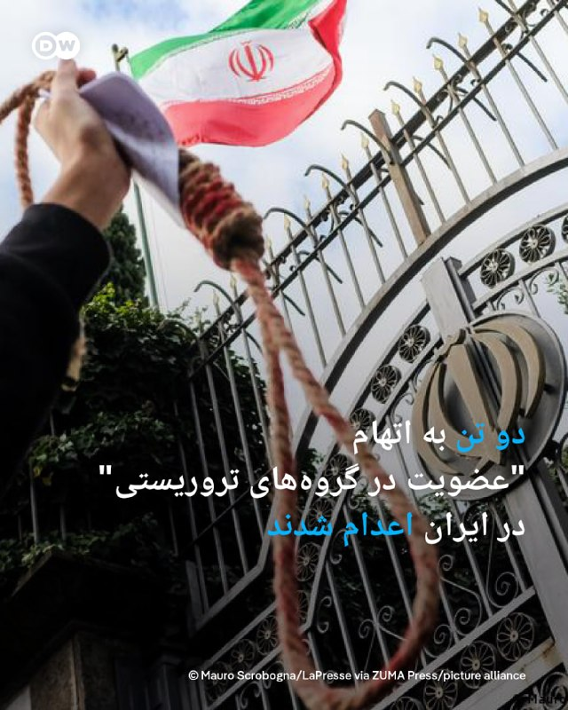

🔶 دو تن به اتهام "عضویت در گروه‌های تروریستی" در ایران اعدام شدند

خبرگزاری میزان، ارگان رسمی قوه قضائیه ایران، از اعدام دو تن به اتهام "عضویت در گروه‌های تروریستی تجزیه‌طلب" و "قیام مسلحانه از طریق تشکیل گروه‌های مجرمانه" در صبح پنج‌شنبه ۳۱ اردیبهشت خبر داد.

در این گزارش هویت این دو نفر، رامین زله و کریم معروف‌پور معرفی شده، اما به نام گروهی که آنها متهم به عضویت در آن بوده‌اند، اشاره‌ای نشده است.

میزان ادعا کرده است که رامین زله و کریم معروف‌پور برای "ترور فرمانده پایگاه سپاه" یکی از شهرستان‌های غرب کشور "همکاری" داشته‌اند. به ادعای میزان، رامین زله پس از "طی دوره‌های آموزشی از طرف یک گروهک ماموریت پیدا کرده بود تا در ناآرامی‌های کشور به عنوان لیدر شرکت کند".

در این گزارش ادعا شده است که او در اعترافات خود گفته است که به سمت یک خودرو حامل نیروهای نظامی "شلیک و از این عملیات فیلمبرداری کرده‌اند". به ادعای میزان کریم معروف‌‌پور در اعترافات خود اقرار کرده است که از "اقدامات مسلحانه" این گروه "آگاهی داشته" و یکی از مسئولیت‌هایش "نگهداری سلاح برای انجام عملیات‌های تروریستی" بوده است.

@dw_farsi

## DW_Farsi — post 124948

  

🔶 جام‌های ۱۹۷۰ و ۱۹۷۴؛ گرد مولر، "بمب‌افکن" تیم ملی آلمان

گرد مولر که در نوک حمله‌ی تیم فوتبال باشگاه بایرن مونیخ و تیم ملی فوتبال آلمان بازی می‌کرد، در فاصله‌ی سال‌های ۱۹۶۶ تا ۱۹۷۴، در تیم ملی آلمان جزو محور اسطوره‌ای "مایر ـ بکن‌باوئر ـ مولر" به شمار می‌رفت و در تاریخ فوتبال آلمان و جهان رکوردهای شگفت‌انگیزی برجای گذاشت.

اگر چه ستاره گرد مولر در سال ۱۹۶۶ درخشیدن گرفت، اما هلوت شون، سرمربی تیم ملی فوتبال آلمان او را پس از جام جهانی ۱۹۶۶ انگلیس به تیم ملی دعوت کرد. با این حساب، گرد مولر در دو دوره جام جهانی (۱۹۷۰ و ۱۹۷۴) حضور داشت.

او که در تاریخ ۳ نوامبر سال ۱۹۴۵ در نوردلینگن (آلمان) متولد شد، برای نخستین بار در ۲۱ سالگی پیراهن تیم ملی فوتبال آلمان را به تن کرد و ۸ سال در خدمت این تیم بود؛ در این ۸ سال روی هم ۶۲ بازی برای تیم ملی فوتبال آلمان انجام داد و ۶۸ گل به ثمر رساند، یعنی به طور میانگین بیش از یک گل در هر بازی.

@dw_farsi

## DW_Farsi — post 124947

  

🔶 استقبال اردوغان از تمدید آتش‌بس آمریکا با ایران در گفت‌وگو با ترامپ

دفتر ریاست‌جمهوری ترکیه اعلام کرد رجب طیب اردوغان روز چهارشنبه ۲۰ مه در تماس تلفنی با دونالد ترامپ، از تمدید آتش‌بس میان آمریکا و ایران استقبال و تأکید کرد، مسائل مورد اختلاف میان دو طرف قابل حل و فصل است.

ترکیه که عضو ناتو و همسایه ایران است، در هفته‌های گذشته با هدف پایان دادن به جنگ، با ایران، واشنگتن و پاکستان که میانجیگری مذاکرات میان ایران و آمریکا را بر عهده دارد، در تماس بوده است.

در بیانیه‌ای که دفتر اردوغان منتشر کرده، آمده است: «رئیس‌جمهور [ترکیه] در این گفت‌وگو اظهار داشت که تصمیم برای تمدید آتش‌بس را تحولی مثبت می‌داند و باور دارد که راه‌حلی منطقی برای مسائل مورد اختلاف امکان‌پذیر است.»

در این بیانیه همچنین گفته شده است که اردوغان در گفت‌وگو با ترامپ بازگشت ثبات به سوریه را "دستاوردی مهم" برای منطقه توصیف کرده و خواستار اقداماتی برای جلوگیری از وخیم‌تر شدن اوضاع لبنان در پی ادامه حملات متقابل اسرائیل و حزب‌الله شده است.

@dw_farsi

## DW_Farsi — post 124946

  

🔶 سنتکام: پس از ورود به یک نفتکش ایرانی، آن را وادار به تغییر مسیر کردیم

ارتش ایالات متحده روز چهارشنبه ۲۰ مه اعلام کرد که تفنگداران دریایی این کشور یک نفتکش با پرچم ایران را که مظنون به تلاش برای نقض محاصره دریایی بود، در دریای عمان متوقف و بازرسی کردند.

ستاد فرماندهی مرکزی آمریکا (سنتکام) با انتشار ویدئویی در شبکه‌ اجتماعی ایکس اعلام کرد این نفتکش با نام "ام/‌تی سلستیال سی" که مظنون به تلاش به نقض محاصره دریایی و حرکت به سوی یکی از بنادر ایران بود، متوقف شد و تحت بازرسی قرار گرفت و سپس مسیر آن تغییر داده شد. در بیانیه سنتکام آمده است که نیروهای آمریکایی "پس از جستجو و هدایت، خدمه را برای تغییر مسیر کشتی آزاد کردند".

سنتکام افزوده است: «نیروهای آمریکایی همچنان به اجرای کامل محاصره دریایی ادامه می‌دهند، تاکنون ۹۱ کشتی تجاری را برای اطمینان از رعایت آن، تغییر مسیر داده‌اند.»

پس از اعمال محاصره دریایی آمریکا علیه بنادر ایران که اواسط آوریل، چند روز پس از برقراری آتش‌بس، صورت گرفت تا کنون دستکم پنج کشتی تجاری توقیف یا مورد بازرسی قرار گرفته‌اند.

@dw_farsi

## DW_Farsi — post 124945

  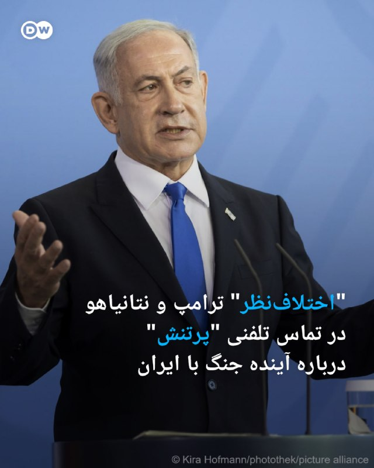

🔶 "اختلاف‌نظر" ترامپ و نتانیاهو در تماس تلفنی "پرتنش" درباره آینده جنگ با ایران

وبسایت "اکسیوس" و روزنامه "وال‌استریت ژورنال" روز چهارشنبه در گزارش‌هایی جداگانه به نقل از منابع ناشناس خبر دادند دونالد ترامپ و بنیامین نتانیاهو در تماس تلفنی اخیر خود بر سر نحوه ادامه برخورد با ایران دچار اختلاف شدند.

گفته می‌شود این اختلاف بر سر دیدگاه‌های متفاوت درباره یک پیشنهاد اصلاح‌شده برای پایان دادن به تنش با ایران بوده است. به نوشته اکسیوس و به نقل از یکی از منابع، نخست‌وزیر اسرائیل پس از گفت‌وگوی تلفنی با ترامپ "کاملا برآشفته" شده بود. طبق این گزارش‌ها، قطر و پاکستان به همراه برخی شرکای دیگر، یک پیشنهاد صلح به‌روزشده ارائه کرده بودند که هدف آن کاهش اختلافات میان واشنگتن و تهران بود.

در همین حال یک مقام آمریکایی نیز در گفت‌وگو با شبکه "سی‌ان‌ان‌" این موضوع را تأیید کرده و اظهار داشت ترامپ روز سه‌شنبه تماس تلفنی پرتنشی با نتانیاهو داشت که منعکس‌کننده دیدگاه‌های متفاوت آنها در مورد چگونگی پیشبرد جنگ با ایران بوده است.

@dw_farsi

## DW_Farsi — post 124944

  

🔶 ترامپ: برای توافق عجله‌ای ندارم، اما پاسخ‌های ایران باید صد در صد درست باشند

دونالد ترامپ، رئیس جمهور آمریکا‌، روز چهارشنبه ۲۰ مه (۳۰ اردیبهشت) در گفت‌وگو با خبرنگاران در پایگاه نظامی مشترک "اندروز" در حومه واشنگتن اظهار داشت که مذاکرات با ایران "در لب مرز" بین رسیدن به توافق برای پایان دادن جنگ و از سرگیری مجدد حملات قرار دارد.

او گفت ایالات متحده "کاملا آماده" است و اگر پاسخ‌های درستی از تهران نگیرد، وارد عمل خواهد شد. ترامپ افزود برای توافق با ایران "عجله‌ای ندارد" و واشنگتن می‌تواند چند روز صبر کند تا "پاسخ‌های درست" را دریافت کند.

ترامپ تأکید کرد: «باید پاسخ‌های درست را دریافت کنیم؛ پاسخ‌هایی که باید به‌طور کامل، صددرصد خوب باشند.»

رئیس جمهور آمریکا گفت اگر ایران به توافق برسد "مقدار زیادی در زمان، انرژی و جان انسان‌ها صرفه‌جویی می‌شود" و این اتفاق می‌تواند "خیلی سریع یا ظرف چند روز" رخ دهد.

@dw_farsi

## DW_Farsi — post 124943

🔶 گام نخست کنگره آزادی ایران؛امید به اتحاد، چالش حضور اتنیک‌ها

نخستین انتخابات "کنگره آزادی ایران" با انتقاد شماری از فعالان اتنیکی به دلیل غیبت نمایندگانشان روبه‌رو شدە است. به گفتە منتقدان نحوە عبور از این چالش عیار تکثرگرایی و آینده این ائتلاف را خواهد آزمود.

تلاش برای همگرایی و ایجاد ائتلاف میان نیروهای متکثر مخالف جمهوری اسلامی، همواره یکی از پرچالش‌ترین عرصه‌های سیاست‌ورزی در دهه‌های اخیر در ایران بوده است. تشکیل "کنگره آزادی ایران" و برگزاری نخستین انتخابات شورای مرکزی و هیئت نظارت آن، تازه‌ترین گام در این مسیر پرفرازونشیب است. پروژه‌ای که هدف خود را عبور از ساختارهای فردمحورِ سنتی و رسیدن به پلتفرمی کثرت‌گرا و دموکراتیک عنوان می‌کند.

با این حال اعلام نتایج این انتخابات و غیبت نمایندگان برخی اتنیک‌ها در ارکان کلیدی آن، بلافاصله انتقاد برخی از فعالان سیاسی را بر انگیخت و پرسش‌هایی درباره میزان پایبندی این کنگره به شعار تکثرگرایی مطرح کرد.

دویچه‌وله فارسی برای بررسی دقیق‌تر دستاوردها، چالش‌ها و حواشی این رویداد، با پنج تن از چهره‌های سیاسی و مدنی گفت‌وگو کرده است.

@dw_farsi

## Persian_Trend_Official — post 14582

💢وضعیت هوش مصنوعی داخلی در پیام رسان بله ...

🫆:Tony

📌 @persian_trend_official
پرشین ترند | متفاوت‌ترین کانال نظامی

## Persian_Trend_Official — post 14581

  <a href="telegram/content/Persian_Trend_Official_14581_1779365025.mp4" target="_blank">🎬 Download video</a>

💢جنگ طلبی از صفات بارز امام بود ...

🫆:Tony

📌 @persian_trend_official
پرشین ترند | متفاوت‌ترین کانال نظامی

## Persian_Trend_Official — post 14580

🔴 سفر احتمالی عاصم منیر به تهران؛ آخرین تلاش برای جلوگیری از بازگشت جنگ؟

💢گزارش‌ها حاکی است سفر احتمالی «عاصم منیر» فرمانده ارتش پاکستان به تهران، نشانه وجود پیام‌های مهم و مذاکرات حساس میان طرف‌هاست.

💢بر اساس ارزیابی‌ها:

▪️ بسیاری این تحرکات را آخرین فرصت برای جلوگیری از ازسرگیری جنگ می‌دانند

▪️ با این حال اختلافات اساسی میان ایران و آمریکا همچنان پابرجاست

💢خواسته‌های اصلی ایران:

▪️ دریافت تضمین برای جلوگیری از وقوع جنگی دیگر

▪️ به‌رسمیت شناختن کنترل ایران بر تنگه هرمز

▪️ آزادسازی دارایی‌های بلوکه‌شده

▪️ باقی ماندن بخشی از ذخایر اورانیوم غنی‌شده در داخل کشور

💢در مقابل، آمریکا خواستار:

▪️ تعطیلی تمامی تأسیسات هسته‌ای ایران به‌جز مرکز تهران شده است

▪️ واشینگتن تأکید دارد حتی تأسیسات باقی‌مانده نیز نباید فعالیت غنی‌سازی داشته باشند

💢اختلاف دیگر بر سر نحوه اجرای توافق است:

▪️ آمریکا خواهان اجرای کامل و یک‌باره توافق است

▪️ اما ایران می‌گوید اگر جنگ طی ۳۰ روز نخست پایان یابد، سایر مراحل می‌تواند به‌تدریج اجرا شود

💢همچنین گزارش شده آمریکا قادر نیست تضمین دهد اسرائیل ترورهای هدفمند در داخل ایران را متوقف خواهد کرد؛ مسئله‌ای که یکی از مهم‌ترین نگرانی‌های تهران محسوب می‌شود.

🫆:Tony

📌 @persian_trend_official
پرشین ترند | متفاوت‌ترین کانال نظامی

## Persian_Trend_Official — post 14579

  

💢نت‌بلاکس، نهاد ناظر بر اینترنت، نوشت که داده‌های این نهاد نشان می‌دهد قطعی اینترنت در ایران وارد هشتادوسومین روز خود شده و شبکه‌های بین‌المللی بیش از هزار و ۹۶۸ ساعت است که به‌طور گسترده مسدود مانده‌اند.

💢این نهاد ناظر بر اینترنت با تاکید بر اهمیت دسترسی آزاد به اینترنت نوشت: «اینترنت آزاد و باز، برای حفاظت از جان، آزادی و پاسخگویی عمومی نقشی اساسی دارد.»

🫆:Tony

📌 @persian_trend_official
پرشین ترند | متفاوت‌ترین کانال نظامی

## Persian_Trend_Official — post 14578

  

🔴 آمریکا و نیجریه فرمانده ارشد داعش در آفریقا را کشتند

💢ایالات متحده و نیجریه اعلام کردند در عملیات مشترکی «ابوبلال المینوکی» از فرماندهان ارشد داعش در غرب آفریقا کشته شده است.

▪️ المینوکی از رهبران اصلی شاخه «داعش ولایت غرب آفریقا» (ISWAP) بود
▪️ او پیش‌تر عضو بوکوحرام بوده و پس از انشعاب این گروه به داعش پیوسته بود
▪️ برخی منابع اطلاعاتی او را «نفر دوم داعش در سطح جهانی» توصیف کرده‌اند

💢شاخه غرب آفریقای داعش طی سال‌های اخیر به یکی از فعال‌ترین و خطرناک‌ترین شاخه‌های این گروه در جهان تبدیل شده است.

🫆:Tony

📌 @persian_trend_official
پرشین ترند | متفاوت‌ترین کانال نظامی

## Persian_Trend_Official — post 14577

🔴 رهبر جمهوری اسلامی دستور داده ذخایر اورانیوم از کشور خارج نشود

💢خبرگزاری رویترز به نقل از منابع ایرانی گزارش داد رهبر جمهوری اسلامی دستور داده ذخایر اورانیوم غنی‌شده نزدیک به سطح تسلیحاتی، از کشور خارج نشود.

🫆:Tony

📌 @persian_trend_official
پرشین ترند | متفاوت‌ترین کانال نظامی

## Persian_Trend_Official — post 14576

  <a href="telegram/content/Persian_Trend_Official_14576_1779365028.webm" target="_blank">🎬 Download video</a>

💢انور قرقاش، مشاور محمد بن زاید

💢ما طی دهه‌های طولانی به قلدری و زورگویی ایران عادت کرده‌ایم، تا جایی که بخشی از صحنه سیاسی خلیج فارس شده است. اعتبارشان بین گفتارهای تهاجمی و بیانیه‌های دوستی توخالی از بین رفته است.

💢امروز، پس از تجاوز وحشیانه ایران، رژیم تلاش می‌کند واقعیت جدیدی را تحکیم کند که از یک شکست نظامی آشکار متولد شده. اما تلاش برای کنترل تنگه هرمز یا تعدی به حاکمیت دریایی امارات، چیزی جز رویاهای پریشان و واهی نیست.

💢هر کس که بخواهد با محیط عربی خود همزیستی کند، باید بداند که اعتماد از بین رفته و بازگرداندن آن با شعارها ممکن نیست، بلکه با زبان مسئولانه، احترام به حاکمیت و تعهد واقعی به اصول همسایگی خوب انجام می‌شود.

🫆:Tony

📌 @persian_trend_official
پرشین ترند | متفاوت‌ترین کانال نظامی

## Persian_Trend_Official — post 14575

  <a href="telegram/content/Persian_Trend_Official_14575_1779365029.webm" target="_blank">🎬 Download video</a>

⭕️بندرعباس لرزید

💢دقایقی پیش زمین لرزه ای به قدرت ۴.۶ ریشتر بندرعباس را لرزاند

🫆:Tony

📌 @persian_trend_official
پرشین ترند | متفاوت‌ترین کانال نظامی

## Persian_Trend_Official — post 14574

🔴 سخنگوی وزارت خارجه ایران: در حال بررسی پاسخ جدید آمریکا هستیم

💢اسماعیل بقایی، سخنگوی وزارت خارجه ایران، اعلام کرد تهران در حال بررسی آخرین پاسخ واشینگتن به چارچوب پیشنهادی آتش‌بس است؛ چارچوبی که پس از چند دور تبادل پیام با میانجیگری پاکستان ارائه شده است.

بر اساس گزارش‌ها:

▪️ پیام‌ها میان تهران و واشینگتن از طریق پاکستان ادامه دارد
▪️ ایران هنوز تصمیم نهایی درباره پیشنهاد آمریکا نگرفته است
▪️ مذاکرات بر محور پایان جنگ، کاهش تنش و مسائل مربوط به تنگه هرمز متمرکز است

💢بقایی همچنین گفته تصمیم نهایی پس از تکمیل بررسی‌های داخلی ایران اتخاذ خواهد شد.

🫆:Tony

📌 @persian_trend_official
پرشین ترند | متفاوت‌ترین کانال نظامی

## Persian_Trend_Official — post 14573

  

⭕️ ژاپن به ساخت هواپیمای مافوق صوت خود نزدیک شده است. آژانس فضایی ژاپن (JAXA) به همراه دانشگاه‌های واسدا، توکیو و کیئو آزمایش‌های زمینی موتور رمجت (Ramjet) برای وسیله پروازی مافوق صوتی که قادر به پرواز با سرعتی پنج برابر سرعت صوت است را انجام دادند.

آزمایش‌ها در مرکز فضایی کاکودا انجام شد. در تونل باد، دانشمندان پرواز مافوق صوت را شبیه‌سازی کردند و عملکرد موتور رمجت، سیستم‌های کنترل و محافظ حرارتی هواپیما را بررسی کردند. در سرعت ۵ ماخ (تقریباً حدود ۶۱۰۰ کیلومتر بر ساعت) دمای هوای اطراف وسیله می‌تواند به حدود ۱۰۰۰ درجه سانتی‌گراد برسد، اما سیستم محافظ حرارتی توانست شرایط تقریباً نرمالی را برای عملکرد الکترونیک داخل سازه حفظ کند.

این پروژه به منظور ساخت یک سکوی آزمایشی مافوق صوت طراحی شده است. مرحله بعدی باید آزمایش‌های پروازی کامل با نصب وسیله آزمایشی روی یک راکت ژئوفیزیکی باشد. هدف اصلی برنامه ایجاد فناوری‌هایی برای هواپیماها و فضاپیماهای مافوق صوت آینده است.

در JAXA معتقدند که در آینده این فناوری‌ها امکان کاهش زمان پرواز بین ژاپن و آمریکا از طریق اقیانوس آرام را به حدود دو ساعت فراهم می‌کنند. علاوه بر این، تحقیقات می‌توانند پایه‌ای برای ساخت وسایلی باشند که قادر به صعود تا ارتفاع حدود ۱۰۰ کیلومتر هستند.

📝 Nick

📌 @persian_trend_official
پرشین ترند | متفاوت‌ترین کانال نظامی

## Persian_Trend_Official — post 14572

  

💢سخنگوی وزارت خارجه روسیه: مسکو آماده کمک به اجرای توافقات احتمالی میان ایران و آمریکا است

💢ماریا زاخارووا، سخنگوی وزارت امور خارجه روسیه گفت، روسیه کاملاً آماده است کمک‌های لازم را به تهران و واشنگتن برای اجرای تصمیماتی که ممکن است در جریان مذاکرات میان آن‌ها حاصل شود، ارائه دهد.

🫆:Tony

📌 @persian_trend_official
پرشین ترند | متفاوت‌ترین کانال نظامی

## Persian_Trend_Official — post 14571

  <a href="telegram/content/Persian_Trend_Official_14571_1779365031.mp4" target="_blank">🎬 Download video</a>

💢 لو رفتن موقعیت توسط نیروهای خودی و گیر افتادن ۴۸ ساعته و خفه شدن نیروهای سپاه پاسداران داخل تونل موشکی

🫆:Tony

📌 @persian_trend_official
پرشین ترند | متفاوت‌ترین کانال نظامی

## Persian_Trend_Official — post 14570

  

به بهانه امنیت اینترنت 80 میلیون ایرانی رو قطع میکنن !
اونوقت با پاکستانی ها دیدار میکنن !
بعد مه ترورش کردن میگن وحیدی رو از طریق اینترنت رد زنی کردن !!!

📌 @persian_trend_official
پرشین ترند | متفاوت‌ترین کانال نظامی

## Persian_Trend_Official — post 14569

بازارهای خلیج فارس با امید به توافق جمهوری اسلامی و آمریکا رشد کردند

خبرگزاری رویترز گزارش داد بازارهای سهام خلیج فارس در آغاز معاملات پنج‌شنبه ۳۱ اردیبهشت، تحت تاثیر امیدها به نزدیک شدن آمریکا و جمهوری اسلامی به توافقی برای پایان جنگ خاورمیانه و همچنین افزایش قیمت نفت، رشد کردند.

بر اساس این گزارش، سرمایه‌گذاران پس از سخنان دونالد ترامپ درباره قرار داشتن مذاکرات با جمهوری اسلامی در مراحل پایانی، نشانه‌های پیشرفت در گفت‌وگوها را دنبال می‌کنند.

ترامپ هم‌زمان هشدار داده اگر جمهوری اسلامی با توافق موافقت نکند، حملات بیشتری انجام خواهد شد.

شاخص بورس دبی یک درصد، شاخص ابوظبی ۰/۲ درصد و شاخص قطر ۰/۶ درصد افزایش یافتند. در مقابل، شاخص بورس عربستان سعودی اندکی کاهش یافت. قیمت نفت برنت نیز با رشد بیش از یک درصدی به ۱۰۶ دلار و ۲۹ سنت در هر بشکه رسید.

📌 @persian_trend_official
پرشین ترند | متفاوت‌ترین کانال نظامی

## Persian_Trend_Official — post 14568

  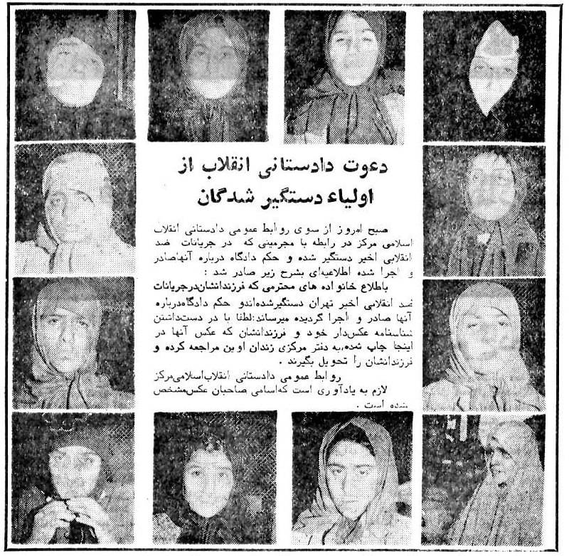

قابل توجه وطن پرستان گوبلزی !

یه زمانی دادستانی انقلاب توی روزنامه آگهی میزد اولیا این کودکان زیر سن قانونی با در دست داشتن شناسنامه به دفتر مرکزی زندان اوین مراجعه کنن تا اجساد فرزندانشون رو دریافت کنند !

اکثر این افراد زیر سن قانونی بودن و حتی از حق داشتن وکیل و یک دادگاه منصفانه محروم بودند !

اعدام شدن بدون اینکه حتی دادگاه نامشون رو احراز کرده باشه یا شناسایی شده باشند !

📌 @persian_trend_official
پرشین ترند | متفاوت‌ترین کانال نظامی

## Persian_Trend_Official — post 14567

  <a href="telegram/content/Persian_Trend_Official_14567_1779365035.webm" target="_blank">🎬 Download video</a>

بدون شرح

## Persian_Trend_Official — post 14566

  <a href="telegram/content/Persian_Trend_Official_14566_1779365036.mp4" target="_blank">🎬 Download video</a>

https://youtube.com/live/CCiwTJiy05Y?feature=share

## Persian_Trend_Official — post 14565

⭕️زمین‌لرزه ۴ ریشتری فراشبند فارس را لرزاند

🔹مرکز لرزه‌نگاری موسسه ژئوفیزیک دانشگاه تهران اعلام کرد، زمین‌لرزه‌ای به قدرت ۴ ریشتر ساعت ۳:۴۷ بامداد امروز -پنجشنبه- حوالی فراشبند استان فارس را لرزاند. این زمین‌لرزه در عمق ۱۰ کیلومتری زمین رخ داد.

🫆:Tony

📌 @persian_trend_official
پرشین ترند | متفاوت‌ترین کانال نظامی

## RadioFarda — post 157420

هشدار نماینده کنگره آمریکا؛ ابهام و شکاف در ائتلاف غرب به سود روسیه، ایران و چین است

🔸دان بیکن، از جمهوری‌خواهان ارشد کمیته نیروهای مسلح مجلس نمایندگان آمریکا، در مصاحبه‌ای مفصل می‌گوید ابهام و عدم قطعیت واشینگتن می‌تواند دشمنان آمریکا، از جمله روسیه، ایران و چین را «گستاخ‌تر» کند؛ آن هم در شرایطی که تنش‌ها در داخل ائتلاف ناتو رو به افزایش است.

🔸این ژنرال سابق نیروی هوایی این اظهارات را در گفت‌وگو با رادیو اروپای آزاد/رادیو آزادی و هم‌زمان با اعلام پنتاگون درباره کاهش شمار تیپ‌های رزمی ارتش آمریکا در اروپا از چهار تیپ به سه تیپ و نیز تعویق استقرار برنامه‌ریزی‌شده نیروها در لهستان مطرح کرد.

🔸بیکن گفت بازنگری در استقرار نیروها، بخشی از موضوع گسترده‌ترِ نحوهٔ مواجههٔ آمریکا با چالش‌های هم‌زمان ناشی از روسیه، چین، ایران و گروه‌های افراط‌گرا است.

🔸او با بیان این‌که «ابهام در دنیای امروز خطرناک است»، گفت واشینگتن و متحدانش نمی‌توانند در شرایطی که این تهدیدها بیش از پیش با هم مرتبط می‌شوند، فاقد شفافیت راهبردی باشند.

🔸گفت‌وگوی کامل را در وب‌سایت رادیو فردا می‌توانید بخوانید.

@RadioFarda

## RadioFarda — post 157419

  <a href="https://t.me/radiofarda/157419" target="_blank">📎 Download file</a>

📻بشنوید: ساعت ۱۴ با رادیوفردا، ۳۱ اردیبهشت ۱۴۰۵‌

@Radiofarda

## RadioFarda — post 157418

  

🔸سازمان حقوق بشر ایران روز چهارشنبه، ۳۰ اردیبهشت، خبر داد که در فروردین‌ماه گذشته دو شهروند عراق هم در ایران «به جرم جاسوسی» اعدام شده‌اند.

🔸به نوشته این سازمان، علی نادر العبیدی، ۲۷ ساله، و فاضل شیخ کریم، ۲۹ ساله، در یک پرونده مشترک با اتهام «جاسوسی» به اعدام محکوم شده بودند و حکم‌شان سحرگاه روز دوشنبه ۱۷ فروردین در زندان مرکزی کرج به اجرا درآمد.

🔸سازمان حقوق بشر ایران می‌گوید که این دو نفر «به اتهام جاسوسی برای نهادهای اطلاعاتی و امنیتی یکی از کشورهای عربی» در کرج بازداشت شده بودند.

🔸طبق محاسبه این سازمان، از زمان آغاز جنگ آمریکا و اسرائیل با ایران، هشت نفر به جرم جاسوسی در ایران اعدام شده‌اند.

🔸گروه‌های حقوق بشری از جمله سازمان عفو بین‌الملل می‌گویند ایران دارای بیشترین تعداد اعدام به نسبت جمعیت خود در جهان است، و پس از چین که آمار قابل اعتمادی از آن در دست نیست، بیشترین تعداد اعدام را در میان کشورها به خود اختصاص داده است.

@RadioFarda

## RadioFarda — post 157417

  <a href="telegram/content/RadioFarda_157417_1779365038.mp4" target="_blank">🎬 Download video</a>

🔸اعضای تیم ملی فوتبال ایران روز ۳۱ اردیبهشت برای شرکت در جلسات صدور ویزا در سفارت کانادا در آنکارا، پایتخت ترکیه، حضور یافتند.

🔸بر اساس گزارش‌ها این بازیکنان به یک مرکز خصوصی درخواست ویزا مراجعه و درخواست‌های ویزا را برای سفارت کانادا مرتب کردند.

🔸به گفته یک مقام رسمی فدراسیون فوتبال ایران برخی بازیکنان ایرانی مقیم خارج از کشور، پیش از سفر به اردوی تمرینی تیم در آنتالیا در ساحل مدیترانه‌ای ترکیه، در آنکارا به تیم ملحق شدند.

🔸جام‌جهانی به میزبانی مشترک ایالات متحده، کانادا و مکزیک برگزار خواهد شد و ایران قرار است هر سه بازی مرحله گروهی خود را در ایالات متحده انجام دهد.

🔸بحران نظامی و سیاسی در خاورمیانه بر حضور تیم ملی فوتبال ایران در جام‌جهانی سایه انداخته است.

🔸پیش‌تر فدراسیون فوتبال جمهوری اسلامی درخواست کرده بود که مسابقاتش به مکزیک منتقل شود، اما جیانی اینفانتینو، رئیس فیفا، با این درخواست مخالفت کرد.

@RadioFarda

## RadioFarda — post 157416

  

🔸سفیر تهران در پاکستان از آزادی و بازگشت ۲۰ ملوان ایرانی یک کشتی توقیف‌شده توسط آمریکا در آب‌های سنگاپور به ایران خبر داد.

🔸سفیر ایران در پاکستان امروز پنجشنبه ۳۱ اردیبهشت اعلام کرد این ۲۰ ملوان ایرانی که به‌دلیل توقیف کشتی در وضعیت نامناسبی قرار داشتند، با وساطت و پیگیری پاکستان آزاد و امروز به کشور بازگشتند.

🔸بر اساس اعلام قبلی وزیر خارجه پاکستان، ۱۱ ملوان این کشتی که اکنون در آب‌های سنگاپور در حالت توقیف قرار دارد، تبعهٔ پاکستان هستند.

🔸ارتش ایالات متحده پس از توقف جنگ با ایران با آتش‌بسی که از ۱۹ فروردین اعلام شد، همزمان با مسدود نگه داشته شدن تنگه هرمز توسط سپاه پاسداران، اقدام به محاصره دریایی بنادر جنوبی ایران کرده است.

@RadioFarda

## RadioFarda — post 157415

  

سپاه پاسداران محدوده نظارتی خود بر تنگه هرمز را تعیین کرد

🔸نهاد مدیریت آبراه خلیج فارس که اخیرا از طرف سپاه پاسداران تشکیل شده محدوده نظارتی خود بر تنگه هرمز را مشخص کرد.

🔸در اطلاعیه این نهاد گفته شده که این محدوده خط اتصال کوه مبارک در ایران و جنوب فجیره در امارات متحده عربی در شرق تنگه هرمز تا خط اتصال انتهای جزیره قشم در ایران و ام‌القُوین در غرب تنگه هرمز را شامل می‌شود.

🔸به گفته نیروی دریایی سپاه عبور و مرور از تنگه هرمز باید با هماهنگی با مدیریت آبراه خلیج فارس و مجوز این نهاد صورت بگیرد.

🔸هفته گذشته امارات اعلام کرد ظرفیت خط لوله‌ای که نفت آن کشور را از طریق بندر فجیره به بازارهای جهانی منتقل می‌کند، افزایش خواهد یافت.

🔸انتقال نفت از بندر فجیره بدون عبور از تنگه هرمز صورت می گیرد و ایران کنترلی بر آبهای ساحلی آن ندارد.

🔸روز گذشته ایران اعلام کرد ۲۶ کشتی در هماهنگی با نیروی دریایی سپاه از تنگه هرمز عبور کرده‌اند.

🔸هنوز معلوم نیست که صاحبان این کشتی‌ها پولی به ایران پرداخت کرده‌اند یا تنها با مجوز تهران از تنگه هرمز عبور کرده‌اند.

@RadioFarda

## RadioFarda — post 157414

  

🔸شبکه تلویزیونی سی‌ان‌ان ۳۱ اردیبهشت به نقل از چند مقام اطلاعاتی آمریکا نوشت که سپاه پاسداران انقلاب اسلامی «بسیار سریع‌تر از آن چه تصور می‌شد» در حال بازسازی قابلیت‌ها و شاخه‌هایی از صنایع نظامی است که در اثر حملات آمریکا و اسرائیل آسیب شدید دیده بود.

🔸این شبکه به نقل از دو مقام آشنا به ارزیابی اطلاعاتی آمریکا نوشته است که در شش هفته‌ای که از آتش‌بس می‌گذرد، سپاه بازسازی صنایع خود را آغاز کرده و از جمله بخشی از چرخه تولید پهپاد را بار دیگر از سر گرفته است.

🔸چهار منبع به سی‌ان‌ان گفته‌اند که بازیابی قابلیت‌های نظامی در ایران بلافاصله پس از قطع حملات آمریکا و اسرائیل،‌ از جمله جایگزینی سایت‌های موشکی و پرتابگرها، به معنای آن است که ایران «هم‌چنان تهدیدی چشمگیر برای متحدان منطقه‌ای» آمریکا به شمار می‌رود.

🔸در دو تا سه هفته اول جنگی که با حملات مشترک آمریکا و اسرائیل در روز ۹ اسفند ۱۴۰۴ آغاز شد، دو کشور اعلام می‌کردند، سایت‌های موشکی و سایت‌های تولید پهپاد از جمله مهم‌ترین اهداف حملات بی‌امان آنها بود و گزارش‌های متعددی از خسارت‌های عمده این زمینه که به ایران وارد آمد، منتشر کردند.

@RadioFarda

## RadioFarda — post 157413

  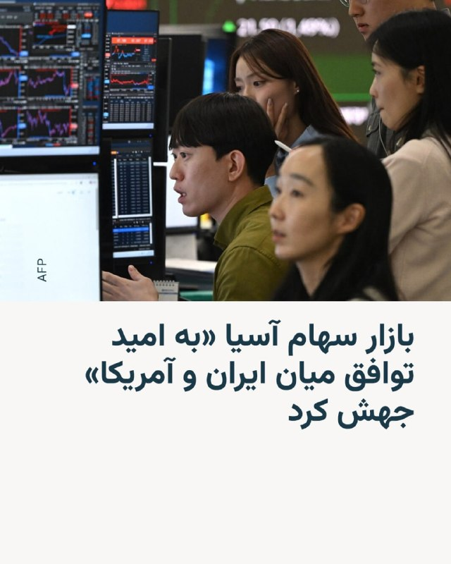

🔸با افزایش امیدهای بازار جهانی به دستیابی به توافق صلح در خاورمیانه و همچنین عبور چندین کشتی از تنگه هرمز، سهام بازارهای آسیایی در روز پنج‌شنبه ۳۱ اردیبهشت جهش کرد.

🔸علاوه بر موضوع مذاکرات ایران و آمریکا، سود مالی فراتر از انتظار شرکت انویدیا و مذاکرات برای جلوگیری از اعتصاب برنامه‌ریزی‌شده کارگران شرکت سامسونگ نیز در جهش سهام در توکیو، سئول و دیگر بازارهای آسیایی تأثیرگذار بوده است.

🔸اتحادیه کارگری بزرگ‌ترین تولیدکننده تراشه حافظه جهان، پس از آن‌که مذاکرات بر سر پاداش‌ها شکست خورد و نگرانی‌هایی درباره اختلال احتمالی در تولید نیمه‌هادی‌ها ایجاد شد، قصد داشت از روز پنج‌شنبه اعتصاب را آغاز کند.

🔸با این حال این اتحادیه اواخر روز چهارشنبه اعلام کرد که اعتصاب به‌دلیل از سر گرفته شدن مذاکرات با مدیریت با حضور وزیر کار کره جنوبی، به حالت تعلیق درآمده است.

🔸دونالد ترامپ، رئیس‌جمهور آمریکا، روز چهارشنبه مذاکرات را در «مرز میان توافق و حملات دوباره» توصیف کرد.

🔸با اظهارات تازهٔ او امیدهای محتاطانه به‌سرعت در بازارهای مالی گسترش یافت، قیمت نفت بیش از پنج درصد کمتر شد و سهام آمریکا رشد کرد.

@RadioFarda

## RadioFarda — post 157412

  

🔸 فیلد مارشال عاصم منیر، رئیس ستاد ارتش پاکستان، در ادامه رایزنی‌ها در جریان مذاکرات ایران و آمریکا، امروز پنج‌شنبه، ۳۱ اردیبهشت، به تهران سفر می‌کند.

🔸 این دومین‌ بار است که عاصم منیر در جریان میانجی‌گری اسلام‌آباد میان ایران و آمریکا پس از جنگ اخیر به تهران سفر می‌کند.

🔸 خبرگزاری‌های رسمی ایران این خبر را یک روز پس از آن منتشر کردند که وزیر کشور پاکستان، برای دومین‌ بار طی هفته جاری وارد تهران شد.

🔸 محسن نقوی، وزیر کشور پاکستان، که روز ۲۶ اردیبهشت به ایران رفته و با مقام‌های ارشد جمهوری اسلامی دیدار کرده بود، بعد از چهار روز بار دیگر وارد تهران شد.

🔸 این سفرها در شرایطی انجام می‌شود که رئیس‌جمهور آمریکا ساعتی پیش اعلام کرد مذاکره با ایران در «مراحل پایانی» قرار دارد و افزود اگر ایران سند توافق را امضا نکند، ایالات متحده حملات نظامی را از سر خواهد گرفت.

🔸 اسماعیل بقائی، سخنگوی وزارت خارجه ایران روز چهارشنبه گفت که سفر دوباره وزیر کشور پاکستان در ایران برای «تسهیل مبادله پیام‌ها» بین تهران و واشینگتن انجام شده است.

@RadioFarda

## RadioFarda — post 157411

انتشار جزئیاتی از اختلاف ترامپ و نتانیاهو بر سر ایران؛ ترامپ: چند روز صبر می‌کنیم

🔸 رئیس‌جمهور آمریکا شامگاه چهارشنبه، ۳۰ اردیبهشت، گفت حاضر است «چند روز» برای پاسخ تازه ایران به پیشنهاد واشینگتن دربارهٔ توافق پایان جنگ صبر کند، اما هشدار داد که این پاسخ باید «صد درصد درست» باشد.

🔸 همزمان جزئیات بیشتری از آخرین مکالمهٔ تلفنی دونالد ترامپ با بنیامین نتانیاهو، نخست‌وزیر اسرائیل، در رسانه‌های آمریکا منتشر شده است که حاکی از اختلاف نظر این دو شریک جنگ با ایران است.

🔸 پس از آن که وب‌سایت خبری اکسیوس برای اولین بار از مکالمه «پرتنش» نتانیاهو با ترامپ در روز سه‌شنبه نوشت، حال شبکه تلویزیونی سی‌ان‌ان هم گزارش کرده است که «تنش» از اختلاف نظر این دو دربارهٔ شیوهٔ برخورد با ایران در روزها و هفته‌های آینده سرچشمه گرفته است.

🔸گزارش کامل را در وب‌سایت رادیو فردا می‌توانید بخوانید.

@RadioFarda

## RadioFarda — post 157410

  

🔸 گزارش‌ها حاکی است که فدراسیون جهانی فوتبال، فیفا، بار دیگر قصد دارد نمایش پرچم شیروخورشید را در جریان جام جهانی ۲۰۲۶ ممنوع کند. این اقدام جنجال‌های دوره جام جهانی قطر را دوباره زنده کرده و با واکنش ایرانیان خارج از کشور و چهره‌های مخالف جمهوری اسلامی روبه‌رو شده است.

🔸 روزنامه «اتلتیک» روز ۲۹ اردیبهشت گزارش داد که فیفا با استناد به آیین‌نامه رفتاری ورزشگاه‌ها، نمایش «بنرها، پرچم‌ها، پوشش‌ها و دیگر اقلامی را که ماهیتی سیاسی، توهین‌آمیز یا تبعیض‌آمیز دارند» در محل مسابقات ممنوع می‌کند.

🔸 برخلاف جام جهانی قطر که اجرای این محدودیت‌ها یکدست نبود، احتمال دارد این ممنوعیت در جام جهانی ۲۰۲۶ به‌صورت سراسری اعمال شود.

🔸 در این گزارش آمده است که فدراسیون فوتبال جمهوری اسلامی ایران فهرستی از خواسته‌ها را درباره حضور تیم ملی به فیفا ارائه کرده که از جمله شامل احترام به پرچم رسمی جمهوری اسلامی ایران بوده است.

@RadioFarda

## RadioFarda — post 157408

🔸ایتامار بن‌ گویر، وزیر امنیت ملی اسرائیل در شبکه اجتماعی ایکس ویدیویی از اعضای بازداشت‌شده کاروان کمک‌رسانی به غزه منتشر کرده که با انتقادهای زیادی همراه شده است.

🔸در این ویدئو دیده می‌شود که به اعضای این کاروان دستبند زده شده و آنها بر روی زمین زانو زده‌اند. هم‌چنین تصاویری از برخوردهای خشونت‌آمیز با آن‌ها دیده می‌شود.

🔸بن گویر که به‌عنوان یک چهره سیاسی راست افراطی شناخته می‌شود ضمن انتشار این ویدئو نوشته است: «ما این‌گونه حامیان تروریسم را می‌پذیریم»

🔸این ویدئو با انتقاد وزیر خارجه اسرائیل و مقامات چندین کشور مواجه شده، از جمله جورجا ملونی، نخست‌وزیر ایتالیا، ضمن محکوم کردن این اقدامات خواستار عذرخواهی شده است.

@RadioFarda

## RadioFarda — post 157407

  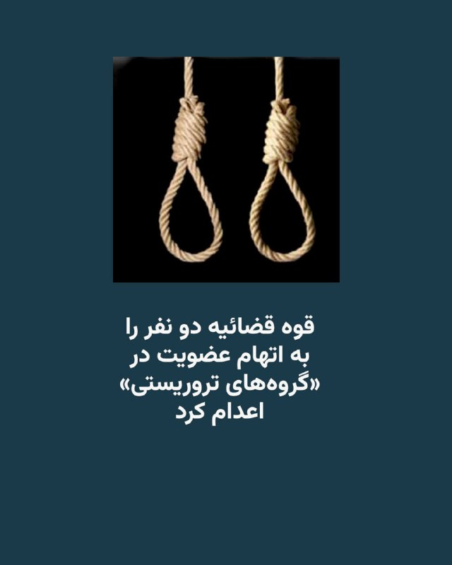

🔸قوه قضائیه جمهوری اسلامی دو زندانی را به اتهام عضویت در «گروه‌های تروریستی تجزیه‌طلب» و «قیام مسلحانه از طریق تشکیل گروه‌های مجرمانه» اعدام کرد.

🔸ارگان رسمی دستگاه قضایی ایران، میزان، هویت این دو نفر را رامین زله و کریم معروف‌پور معرفی کرده و نوشته که آنها صبح روز پنج‌شنبه، ۳۱ اردیبهشت، اعدام شدند.

🔸میزان نوشته که رامین زله «پس از طی دوره‌های آموزشی از طرف گروهک ماموریت پیدا کرده بود تا در ناآرامی‌های کشور به عنوان لیدر شرکت کند».

🔸ارگان رسمی قوه قضائیه ایران همچنین نوشته که این دو نفر «اعتراف» کرده بودند که «برای ترور فرمانده پایگاه سپاه یکی از شهرستان‌های غرب کشور» با یکدیگر «همکاری» داشته و برای این کار، «سلاح» نگهداری می‌کردند.

🔸از زمان حملات آمریکا و اسرائیل به ایران، جمهوری اسلامی اجرای احکام اعدام را افزایش داده است و در برخی روزها چند نفر را اعدام کرده است. طی این مدت، در بعضی هفته‌ها، چند روز پشت سر هم، اخبار اجرای احکام اعدام منتشر شده است.

🔸خبرگزاری حقوق بشری هرانا که در آمریکا مستقر است، نوشته هویت «۵۰ فردی» که از ابتدای جنگ در ایران اعدام شده‌اند را احراز کرده است.

@RadioFarda

## RadioFarda — post 157406

  

🔸سردار آزمون، فوتبالیست سرشناس ایرانی، پس از حذف از تیم ملی، در پستی از علاقه خود به فوتبال و مردم ایران گفته و نوشته است: «هر جايي كه فوتبال بازی كنم، هويت من، قلب من و افتخار من ايران است.»

🔸مهاجم باشگاه شباب الاهلی در لیگ برتر امارت در پستی که به تازگی در اینستاگرام منتشر کرده توضیح داده که این پست را در ارتباط با کسانی نوشته است که «به خاطر بعضی سوءتفاهم‌ها نسبت به من قضاوتی عجولانه كردند.»

🔸این مهاجم شناخته‌شده که به‌عنوان دومین گلزن برتر تاریخ تیم ملی ایران پس از علی دایی شناخته می‌شود، در این پست هم‌چنین گفته است: «وقتي پيراهن تيم ملی كشورم رو پوشيدم، به خودم قول دادم هر بار كه برای ايران بازی می‌كنم، با تمام وجود تلاش كنم تا باعث خوشحالی مردمی كه با عشق فوتبال رو دنبال می‌كنن بشم بخصوص بچه‌هايی كه توی دورترين شهرها و روستاها با پيروزی ما خوشحال ميشن.»

🔸انتشار تصاویر دیدار این فوتبالیست با مقامات حکومت امارات در روزهای نخست جنگ در صفحه اینستاگرام او حاشیه‌ساز شد تا جایی که برخی حامیان حکومت خواستار تعلیق او از تیم ملی و ضبط اموالش در ایران شدند.

@RadioFarda

## RadioFarda — post 157405

  <a href="https://t.me/radiofarda/157405" target="_blank">📎 Download file</a>

📻بشنوید: سرخط خبرها با رادیوفردا، ۳۱ اردیبهشت ۱۴۰۵‌

@RadioFarda

## IranianMinds — post 20487

🔴 دو منبع ایرانی به رویترز:

مجتبی خامنه‌ای دستور داده است که اورانیوم غنی شده نباید از ایران خارج بشود.

@IranianMinds

## IranianMinds — post 20486

  

🔴 طبق قوانین جدید طالبان سن ازدواج برای دختر به ۹ سال کاهش یافت ، و اگر دختر در هنگام خواندن خطبه ی عقد سکوت کند هم به منزله ی رضایت به ازدواج تلقی میشود.

@IranianMinds

## IranianMinds — post 20485

  <a href="telegram/content/IranianMinds_20485_1779365047.mp4" target="_blank">🎬 Download video</a>

حدود نیم‌ قرن پیش، عده‌ای بی‌ تدبیر انقلاب کردند و از همان روز، خورشید این سرزمین غروب کرد.

دیگر نور و روشنایی و زیبایی را ندیدیم. نه کودکی ‌مان را زندگی کردیم، نه نوجوانی و نه جوانی. کل عمرمان گذشت بین مذاکرات و جنگ، گرانی و هزار سختی دیگر، و انگار همه چیز از دست رفت. مگه تا کی زنده‌ایم که فقط منتظر بمانیم…

@IranianMinds

## IranianMinds — post 20484

  <a href="telegram/content/IranianMinds_20484_1779365049.mp4" target="_blank">🎬 Download video</a>

اکانت اسرائیل به فارسی:

درخشش پرچم شیر‌ و خورشید در کنار پرچم کشورهای دیگر در شهر اشدود در اسرائیل.

@IranianMinds

## IranianMinds — post 20483

🔴 تایمز اسرائیل:

ایران در جریان آتش‌بس از فرصت برای جابه‌جایی لانچرهای موشکی و آماده‌سازی برای دور جدید درگیری استفاده کرده

@IranianMinds

## IranianMinds — post 20482

  <a href="telegram/content/IranianMinds_20482_1779365051.mp4" target="_blank">🎬 Download video</a>

ویدیویی از عروسی یک‌ زوج‌ جانفدا ، فقط اگه تونستید حدس بزنید عروس‌ کدومه جایزه دارید.

@IranianMinds

## IranianMinds — post 20481

🔴 والا نیوز

منابع اسرائیلی می‌گویند آمریکایی‌ها در مذاکرات با ایران یک قدم به جلو برداشته‌اند، بنابراین برآوردها این است که حمله‌ای به ایران در ۲۴ ساعت آینده تکرار نخواهد شد

@IranianMinds

## IranianMinds — post 20480

ثبت نام کن ۵۰۰ هزارتومان جایزه بگیر
نیازی هم به واریز نیست
تنها سایت مورد #تایید ما با بونوس های واقعی:

🌐
🌐 Winro.io

## IranianMinds — post 20479

  <a href="telegram/content/IranianMinds_20479_1779365052.webm" target="_blank">🎬 Download video</a>

🎯شانستو #رایگان امتحان کن 
⚠️

🤔 میدونستی توی #وینرو میتونی رایگان شرط ببندی؟

👍تنها کاری که باید بکنی اینه که عضو سایتش بشید و 
🤩
🤩
🤩 هزارتومان جایزه بگیرید بدون نیاز به واریز

💖تنها سایت مورد اعتماد ما با بونوس های کاملا واقعی و رویایی:

🌐 Winro.io

🌐 Winro.io
کانال بونوس های رایگان r31

📱 @winro_io

## IranianMinds — post 20478

  

🔴 توییت پوریا زراعتی خبرنگار ایران اینترنشنال

@IranianMinds

## IranianMinds — post 20477

  

زندگی در ایران عزیزمون اینطوری شده که اگه «یه خرید» بری و برگردی؛ «یه دهک» جابجا میشی!

@IranianMinds

## IranianMinds — post 20476

  

🔴 از ۷ اکتبر تا به امروز رو باهم یه مرور دوباره بکنیم:

@IranianMinds

## IranianMinds — post 20475

  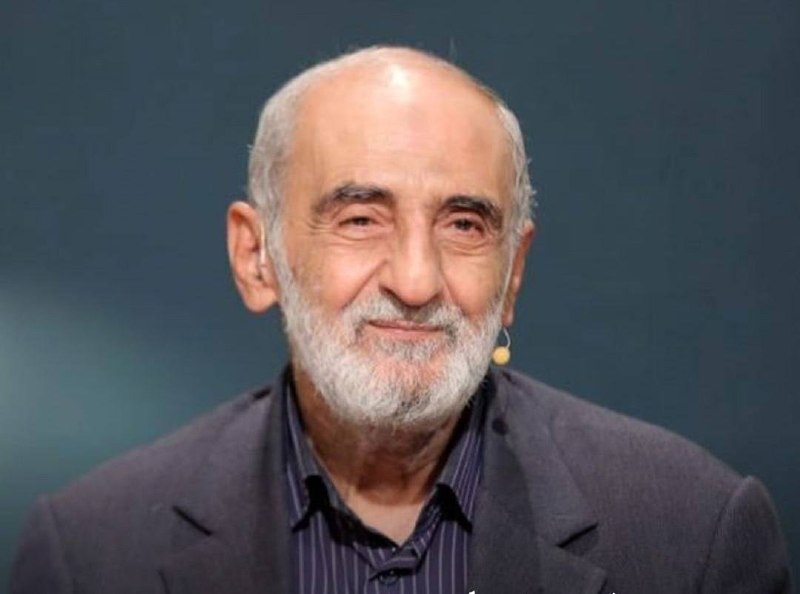

🔴 شریعتمداری :

باید یه قانون‌ تصویب کنیم که تنگه هرمز تا زمانی که ترامپ کشته نشه بسته بمونه !

@IranianMinds

## IranianMinds — post 20474

  

⚫️ امروز صبح جمهوری اسلامی دو‌ نفر دیگه از هموطن هامونو هم کشت ، خبرگزاری میزان قوه قضائیه اعلام کرد رامین زله و کریم معروف پور از معترضین دی ماه امروز صبح اعدام شدن.

@IranianMinds

## BBCPersian — post 281696

🔻چین: آمریکا از استفاده و تهدید به ابزارهای قضایی علیه کوبا دست بردارد

چین روز پنج‌شنبه از آمریکا خواست که «از استفاده و تهدید به ابزارهای قضایی علیه کوبا دست بردارد.» این درخواست پس از آن‌ است که واشنگتن رائول کاسترو، رئیس‌جمهور سابق کوبا را به اتهام قتل تحت پیگرد قرار داد.

گوئو جیاکون، سخنگوی وزارت خارجه چین، در یک نشست خبری و در پاسخ به پرسشی درباره این اتهامات گفت: «طرف آمریکایی باید از به‌کار بردن ابزار تحریم و ابزار قضایی علیه کوبا دست بردارد و هر بار تهدید به زور را متوقف کند.»

ایالات متحده رائول کاسترو، رهبر پیشین کوبا، را به اتهام توطئه برای قتل شهروندان آمریکایی و چند اتهام دیگر در ارتباط با سرنگونی دو هواپیما در سال ۱۹۹۶ در مسیر کوبا و فلوریدا متهم کرد.

رائول کاسترو که اکنون ۹۴ ساله است، در آن زمان فرمانده نیروهای مسلح کوبا بود و پس از این حادثه با محکومیت بین‌المللی روبه‌رو شد.

https://bbc.in/4fwMLUO
@BBCPersian

## BBCPersian — post 281695

  <a href="telegram/content/BBCPersian_281695_1779365056.mp4" target="_blank">🎬 Download video</a>

🔻مردی در تگزاس به اتهام راندن عمدی وانت تسلا سایبرتراک خود به داخل دریاچه برای استفاده از ویژگی «حالت عبور از آب» این خودرو دستگیر شده است.

اداره پلیس گریپ‌واین اعلام کرد که مامورانش روز دوشنبه برای نجات وسیله نقلیه که پس از ورود به آب و گیر کردن آن توسط سرنشینانش رها شده بود، به دریاچه گریپ‌واین در شمال تگزاس فراخوانده شدند.

طبق دفترچه راهنمای آنلاین تسلا، حالت «عبور از آب» به سایبرتراک اجازه می‌دهد تا «وارد آب شود و از رودخانه‌ها یا نهرهایی» با حداکثر عمق ۸۱ سانتی‌متر عبور کند.

خودروی نیمه‌غرق‌شده از نزدیکی خط ساحلی ضلع جنوبی دریاچه بیرون کشیده شد و تیم نجات آبی اداره آتش‌نشانی گریپواین در این عملیات به پلیس کمک کرد.

طبق بیانیه پلیس، «راننده اظهار داشت که عمداً برای استفاده از ویژگی "عبور از آب" سایبرتراک به داخل دریاچه رانده است».

پلیس اعلام کرد که راننده به اتهام رانندگی در بخش ممنوع دریاچه و سایر تخلفات تجهیزات ایمنی آب بازداشت شده است.

سایبرتراک تسلا یک وانت برقی است که از بدنه فولادی ضد گلوله ساخته شده و با قیمت بیش از ۷۰ هزار دلار به فروش می‌رسد.

@BBCPersian

## BBCPersian — post 281694

🔻جنگ ایران باعث کاهش فعالیت بخش خصوصی در آلمان شده است

نتایج یک نظرسنجی که امروز (پنجشنبه) منتشر شد نشان می‌دهد که فعالیت بخش خصوصی آلمان برای دومین ماه پیاپی کاهش یافته است.

این نشان‌دهنده آن است که جنگ ایران روند رشد اقتصادی آلمان را کند کرده، تقاضا را تحت فشار قرار داده و باعث افزایش قیمت‌ها شده است.

هرچند شاخص اولیه ترکیبی مدیران خرید آلمان که توسط «اس‌ اند ‌پی گلوبال» تهیه می‌شود، در ماه مه نسبت به ماه آوریل اندکی افزایش داشت و به ۴۸‌‌/۶ رسید. با این حال، این شاخص همچنان پایین‌تر از سطح ۵۰ باقی ماند؛ سطحی که مرز میان رشد و انقباض اقتصادی به شمار می‌رود.

قرار گرفتن شاخص زیر ۵۰ به معنای ادامه کاهش فعالیت‌های اقتصادی است.

شاخص ترکیبی مدیران خرید، عملکرد بخش خدمات و صنعت را بررسی می‌کند. دو بخشی که در مجموع بیش از دوسوم اقتصاد آلمان، بزرگ‌ترین اقتصاد اتحادیه اروپا را تشکیل می‌دهند.

https://bbc.in/4fwMLUO
@BBCPersian

## BBCPersian — post 281693

🔻ایرلند رفتار اسرائیل با فعالان ناوگان غزه را «نفرت‌انگیز» خواند

سیمون هریس، معاون نخست‌وزیر جمهوری ایرلند، پس از بازداشت اعضای ناوگان کمک‌رسانی به غزه، از جمله چند شهروند ایرلندی توسط اسرائیل، خواستار «واکنش قوی و بدون ابهام اتحادیه اروپا» شد.

آقای هریس در شبکه اجتماعی ایکس نوشت: «اقدامات دولت اسرائیل و بازداشت غیرقانونی اعضای ناوگان سمود نفرت‌انگیز است و نمی‌تواند بدون عواقب باشد.»

او گفت که «محکومیت مهم است اما کافی نیست.»

معاون نخست‌وزیر جمهوری ایرلند این بازداشت‌ها را «نقض آشکار دیگری از قوانین بین‌المللی» توصیف کرد و درخواست کشورش را برای تعلیق عناصر تجاری توافقنامه همکاری اتحادیه اروپا و اسرائیل تکرار کرد.

او خواهان اقدام اتحادیه اروپا شد و تاکید کرد که «زمان زیادی گذشته است تا اروپا اقدامی انجام دهد.»

https://bbc.in/4fwMLUO
@BBCPersian

## BBCPersian — post 281692

🔻بریتانیا با شش کشور حوزه خلیج فارس قرارداد تجاری ۳/۷ میلیارد پوندی امضا کرد

بریتانیا با شش کشور حاشیه خلیج فارس یک توافق تجاری امضا کرده است که دولت می‌گوید ارزش آن برای اقتصاد به ۳/۷ میلیارد پوند خواهد رسید.

دولت بریتانیا گفته است این توافق با کشورهای بحرین، کویت، عمان، قطر، عربستان سعودی و امارات متحده عربی، پس از اجرای کامل، باعث می‌شود هر سال حدود ۵۸۰ میلیون پوند از هزینه‌های تعرفه‌ای که بر صادرات بریتانیا به این کشورها اعمال می‌شود، حذف شود.

همچنین گفته شده این توافق باعث می‌شود شرکت‌های بریتانیایی راحت‌تر بتوانند در بازارهای خلیج فارس فعالیت و همکاری کنند و در نتیجه به ایجاد و حفظ شغل‌ها کمک خواهد کرد.

با این حال، گروه‌های فعال حقوق بشری از نبود جزئیات درباره حقوق بشر و حمایت از حقوق کارگران در این توافق انتقاد کرده‌اند.

حزب محافظه‌کار، حزب مخالف دولت که مذاکرات این توافق را در زمان دولت خود آغاز کرده بود، گفته است این توافق «یکی دیگر از فرصت‌های مهم برگزیت» است که حزب کارگر ممکن است به دلیل مواضع نزدیک‌تر به اتحادیه اروپا آن را «از دست بدهد.»

بر اساس این توافق، تعرفه واردات برخی محصولات بریتانیایی از جمله پنیر چدار، کره و شکلات حذف خواهد شد.

توافق تجاری بین بریتانیا و شورای همکاری خلیج فارس سومین توافقی است که توسط دولت سر کی‌یر استارمر، نخست وزیر پس از توافق با هند و کره جنوبی، منعقد شده است.

https://bbc.in/3Rk3TTT
@BBCPersian

## BBCPersian — post 281691

🔻کانادا سفیر اسرائیل را احضار کرد

کانادا سفیر اسرائیل را به خاطر بازداشت فعالان ناوگان کمک به غزه احضار کرد.

مارک کارنی، نخست وزیر کانادا، در شبکه‌ اجتماعی ایکس نوشت: «وزیر امور خارجه کانادا به مقامات دستور داده است تا سفیر اسرائیل را احضار کنند و از او در مورد امنیت و سلامت کانادایی‌های درگیر در این ماجرا تضمین بگیرند.»

آقای کارنی همچنین ویدئویی را به اشتراک گذاشته که وزیر امنیت داخلی اسرائیل را نشان می‌دهد و نیروهای اسرائیلی با فعالان بازداشت شده بدرفتاری می‌کنند. او نوشته: «کانادا پیش از این تحریم‌های شدیدی را علیه آقای بن گویر، از جمله مسدود کردن دارایی‌ها و ممنوعیت سفر، در پاسخ به تحریک مکرر خشونت توسط او، اعمال کرده است.»

براساس گزارش‌ها ۱۱ شهروند کانادایی در ناوگان کمک‌رسانی به غزه حضور داشته‌اند.

https://bbc.in/4fwMLUO
@BBCPersian

## BBCPersian — post 281690

📽وقتی که رفت روزنامه‌ها نوشتند: عقاب از شهر کلاغ‌ها گریخت.

🔹او تنها به خاطر فوتبالیست خوب بودن شهرت نیافت. ناصر حجازی به خاطرنه گفتن به شرایط حاکم بود که محبوب شد.
🔹در پانزدهمین سال‌مرگش یادی می‌کنیم از او در برنامه این هفته آپارات.

📺برنامه این هفته آپارات
افسانه یک عقاب

🎬ساخته امیر رفیعی

🔹ساعات پخش
جمعه ۹:۰۰ شب
شنبه ۶:۳۰ صبح
شنبه ۱۱:۳۰ صبح
دو‌شنبه ۲:۰۰ بامداد
دوشنبه ۸:۳۰ شب
سه‌شنبه ۱۱:۳۰ صبح
تکرار جمعه ۱۱:۳۰ صبح

🔹از برنامه آپارات همیشه فیلم متفاوت ببینید.

@BBCPersian

## BBCPersian — post 281689

  <a href="telegram/content/BBCPersian_281689_1779365059.mp4" target="_blank">🎬 Download video</a>

⁨ دانشمندان موسسه «اوشن سنسس» (سرشماری اقیانوس) در سال گذشته بيش از یک هزار و ۱۰۰ گونه تازه دريايی كشف كرده‌اند؛ از يک اسفنج گوشتخوار گرفته تا يک «كوسه روح» و كرم پرزدار ساكن «قصر شيشه‌ای». اما شايد شگفت‌زده شويد اگر بدانيد اين يافته‌ها تنها قطره‌ای در اقيانوس‌اند؛ زيرا برآوردها نشان می‌دهد حدود ۹۰ درصد از گونه‌های دريايی هنوز كشف نشده‌اند.
این ویدیو را ببینید.⁩

@BBCPersian
https://bbc.in/4uoww0D

## BBCPersian — post 281688

  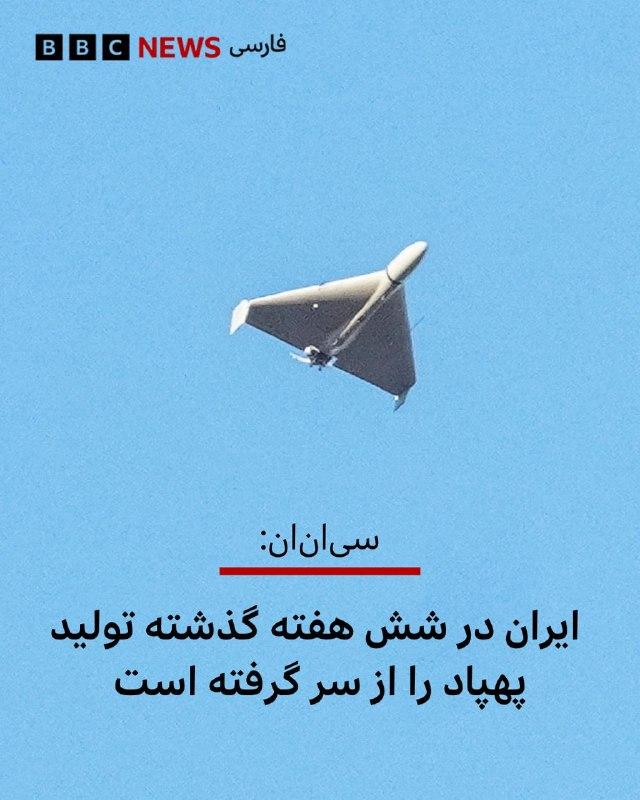

شبکه خبری سی‌ان‌ان به نقل از دو منبع آگاه از ارزیابی‌های اطلاعاتی آمریکا گزارش داد که ایران در جریان آتش‌بس شش‌هفته‌ای که از اوایل آوریل آغاز شده، بخشی از تولید پهپادهای خود را از سر گرفته است.

این گزارش همچنین به نقل از چهار منبع و ارزیابی‌های اطلاعاتی آمریکا حاکیست که ایران با سرعتی بیش از برآوردهای اولیه در حال بازسازی توان نظامی خود است.

دیروز محمدباقر قالیباف، رئیس مجلس ایران در سومین پیام صوتی هفته‌های اخیر خود تایید کرد که در جریان آتش‌بس توان نظامی آن کشور با «قدرت بیشتری بازسازی شده است.»

در همین حال، دونالد ترامپ، رئیس‌جمهور آمریکا، روز چهارشنبه گفت که اگر ایران با طرح صلح موافقت نکند، ایالات متحده آماده انجام حملات بیشتر علیه آن کشور است.

با این حال او اشاره کرد که واشنگتن ممکن است چند روزی صبر کند تا «پاسخ‌های مناسب» را دریافت کند.

📸 Reuters

https://bbc.in/4fwMLUO
@BBCPersian

## BBCPersian — post 281687

🔻دیدار وزیر کشور پاکستان با عباس عراقچی

محسن نقوی، وزیر کشور پاکستان با عباس عراقچی، وزیر خارجه ایران در تهران دیدار و گفت‌وگو کرده است.

هنوز جزییاتی از این گفت‌وگوها رسانه‌ای نشده است.

آقای نقوی که روز گذشته به تهران آمد با مقامات ارشد جمهوری اسلامی دیدار کرد.

ایران اعلام کرده که در حال بررسی تازه‌ترین پیشنهادهای آمریکا برای پایان دادن به جنگ است.

رسانه‌های مختلف هم گفته‌اند که قرار است فیلد مارشال عاصم منیر،‌ فرمانده ارتش پاکستان، برای کمک به میانجی‌گری میان ایران و آمریکا به تهران سفر کند.

دونالد ترامپ گفته است که چند روز دیگر به ایران برای توافق فرصت خواهد داد.

https://bbc.in/4fwMLUO
@BBCPersian

## BBCPersian — post 281686

🔻جنجال ناوگان کمک به غزه؛ لهستان کاردار اسرائیل را احضار کرد

وزیر امور خارجه لهستان روز پنج‌شنبه اعلام کرد که کاردار اسرائیل را به‌دلیل بازداشت فعالان، از جمله شهروندان لهستانی، احضار کرده و خواستار آزادی فوری آن‌ها و عذرخواهی شده است.

رادوسلاو سیکورسکی در شبکه‌های اجتماعی نوشت: «لهستان رفتار نمایندگان مقامات اسرائیلی با فعالان ناوگان صمود را که توسط ارتش اسرائیل بازداشت شده‌اند، از جمله شهروندان لهستانی را به‌شدت محکوم می‌کند.»

انتشار ویدیویی از رفتار ایتار بن‌گویر، وزیر امنیت ملی اسرائیل با بازداشت شدگان ناوگان کمک‌رسانی به غزه واکنش‌های بین‌المللی را به همراه داشته است.

https://bbc.in/4fwMLUO

@BBCPErsian

## BBCPersian — post 281685

  <a href="telegram/content/BBCPersian_281685_1779365063.mp4" target="_blank">🎬 Download video</a>

🎶 آرین کشیشی موزیسینی چندوجهی و بین‌المللی است؛ نوازنده برجسته گیتار بیس، آهنگساز و تهیه‌کننده‌ای که از دل تهران به صحنه‌های حرفه‌ای اروپا رسیده و امروز در آمستردام فعالیت می‌کند.

او در سبک‌های متنوعی از جمله جز، فیوژن، پاپ، راک، کلاسیک، فلامنکو و موسیقی فولکلور ایرانی و ارمنی تجربیات متنوعی دارد و با هنرمندانی چون همایون شجریان، علیرضا قربانی، سهراب پورناظری، ظافر یوسف (نوازنده عود اهل تونس) و آنتونیو ری (گیتاریست اسپانیایی) همکاری کرده است.

مجموعه این همکاری‌ها و تجربه‌ها به شکل‌گیری صدای منحصربه‌فرد او انجامیده است.

آرین در سال ۲۰۱۵ پروژه شخصی خود را راه‌اندازی کرد که بر تولید موسیقی جز و فیوژن با حضور موسیقیدانان بین‌المللی متمرکز است.

نخستین آلبوم شخصی او با نام Self-Reflection در سال ۲۰۲۳ منتشر شد؛ اثری که نوعی تأمل درونی و خودبازاندیشی موسیقایی است و از خلال آن تجربه‌ها و هویت چندفرهنگی‌اش را واکاوی می‌کند.

اجرای چند قطعه از این آلبوم در جشنواره جز لندن را در «رنگ‌آهنگ» این هفته ببینید.

@BBCPersian

## BBCPersian — post 281684

🔻وزیر امور خارجه لهستان روز پنج‌شنبه اعلام کرد که کاردار اسرائیل را به‌دلیل بازداشت فعالان، از جمله شهروندان لهستانی، احضار کرده و خواستار آزادی فوری آن‌ها و عذرخواهی شده است.

رادوسلاو سیکورسکی در شبکه‌های اجتماعی نوشت: «لهستان رفتار نمایندگان مقامات اسرائیلی با فعالان ناوگان صمود را که توسط ارتش اسرائیل بازداشت شده‌اند، از جمله شهروندان لهستانی را به‌شدت محکوم می‌کند.»

انتشار ویدیویی از رفتار ایتار بن‌گویر، وزیر امنیت ملی اسرائیل با بازداشت شدگان ناوگان کمک‌رسانی به غزه واکنش‌های بین‌المللی را به همراه داشته است.
https://bbc.in/4ur2Joh
@BBCPersian

## BBCPersian — post 281683

🔻 ارزش روپیه هند به دلیل جنگ ایران به پایین‌ترین سطح تاریخی خود رسید

وزیر بازرگانی هند اعلام کرد که این کشور در حال بررسی مجموعه‌ای از اقدامات برای مقابله با کاهش ارزش روپیه، پول ملی هند است و وضعیت بازار را به‌دقت زیر نظر دارد.

پیوش گویال روز پنج‌شنبه گفت: «ما شرایط را رصد می‌کنیم و چندین اقدام در دست بررسی است. وضعیت در سطح جهانی بسیار چالش‌برانگیز است.»

اظهارات او در حالی مطرح می‌شود که ارزش روپیه هند در روزهای اخیر بارها به پایین‌ترین سطح تاریخی خود رسیده و از زمان آغاز جنگ آمریکا و اسرائیل علیه ایران که باعث افزایش قیمت نفت خام شده، بیش از ۶ درصد تضعیف شده است.

https://bbc.in/4nOXA72
@BBCPersian

## BBCPersian — post 281673

سارا گرین و سایمون تولت
شغل,بخش پادکست سرویس جهانی بی‌بی‌سی
🔻وقتی در بالاترین سطح برخی از بزرگ‌ترین شرکت‌های دنیا جابه‌جایی قدرت اتفاق می‌افتد، بیشتر مردم اصلا متوجه نمی‌شوند.
اگر محصولات خوب عمل کنند، خدمات به‌درستی ارائه شود و قفسه‌های فروشگاه‌ها پر باشند، اینکه چه کسی در اتاق هیئت‌مدیره می‌نشیند خبرساز نمی‌شود. اما وقتی پای سامسونگ در میان باشد، دودمان خانوادگی پشت آن آنقدر پیچیده است و شرکت آنقدر برای اقتصاد کره جنوبی حیاتی است که خبرساز می‌شود.
در سال ۲۰۱۷، لی جه یونگ، وارث سامسونگ که با نام جی‌وای لی نیز شناخته می‌شود، به دلیل نقشش در یک رسوایی فساد که رئیس‌جمهور کشور را نیز ساقط کرد، زندانی شد.
ادامه مطلب را در لینک زیر بخوانید:
https://bbc.in/4fz83RN

📸GettyImages/ Bloomberg via
Getty Images/ AFP via Getty Images/ LightRocket via Getty Images

@BBCPersian

## Dirty_Kids — post 389874

  <a href="telegram/content/Dirty_Kids_389874_1779365065.mp4" target="_blank">🎬 Download video</a>

مراد تایم:

@Dirty_Kids 👻

## Dirty_Kids — post 389873

  

وایرال ترین عکس ۲۴ ساعت اخیر فضای مجازی با بیش از ۳۰ میلیون بازدید!

@Dirty_Kids 👻

## Dirty_Kids — post 389872

  

‏نه ممنون همون سکس

@Dirty_Kids 👻

## Dirty_Kids — post 389871

  <a href="telegram/content/Dirty_Kids_389871_1779365069.mp4" target="_blank">🎬 Download video</a>

چون بحث مموتی داغه
این موزیک‌ویدیو رو یادتونه ؟🤣🤦‍♂️

@Dirty_Kids 👻

## Dirty_Kids — post 389870

‏توی یک رابطه سالم دعوا و اختلاف نظر هست اگه فقط دنبال آرامشی دمنوش بابونه بخور

@Dirty_Kids 👻

## Dirty_Kids — post 389869

  <a href="https://t.me/Dirty_Kids/389869" target="_blank">📎 Download file</a>

📱 اپلیکیشن اندروید بدون فیلتر ریتزوبت

➖➖➖➖➖

🔹 ثبت نام آسان 
✅
🔹 رابط کاربری بسیار راحت و سریع 
✅
🔹 درگاه پرداخت کارت به کارت 
✅
🔹 درگاه پرداخت دلاری سریع 
✅
🔹 بونوس ۱۰۰ درصدی اولین واریز 
✅
🔹 بونوس ۱۰۰ درصدی واریز یکشنبه ها 
✅

➖➖➖➖➖
🌐 https://RitzoBet.com

⚡️ @RitzoBet_ir

## Dirty_Kids — post 389868

  

⚠️ برای #شرطبندی های فوتبال از سایت معتبر و بین المللی استفاده کنید ✅

سایت #ریتزوبت ، چهار سال هستش داخل ایران فعالیت میکنه 
✅

لایسنس بین المللی داره ، روش های شارژ و برداشت متنوع داره و بونوس 100% ورزشی و کش بک های جذاب
💎

⏪ اپلیکیشن بدون فیلتر ریتزوبت 
📱
⏩
R31

✅ لینک بدون‌ فیلتر ریتزوبت
🤣

🆔 @RitzoBet_ir 
🇮🇷

## Dirty_Kids — post 389867

  <a href="telegram/content/Dirty_Kids_389867_1779365072.mp4" target="_blank">🎬 Download video</a>

درخشش پرچم شیر و خورشید در کنار پرچم کشورهای دیگر در شهر اشدود در اسرائیل. 
🇮🇱
🇮🇷

@Dirty_Kids 👻

## Dirty_Kids — post 389866

‏در تایید مادرجنده بودنتون همین بس که حتی از خبر فیک گزینه اسراییل بودن احمدی‌نژاد ذوق‌زده میشید ولی اسم پهلوی که میاد کهیر میزنید. حقیقتا دشمنان باشکوهی هم نیستید :)))

@Dirty_Kids 👻

## Dirty_Kids — post 389865

‏این دوس‌دختر سابقم هردفعه به یه بهانه‌ای سعی میکنه با من ارتباط برقرار کنه؛ یه بار زنگ میزنه میگه وسایلمو بفرست، یه بار میگه انقد ریلزای کسشر نفرس، یه بار میگه اون صد میلیون که ازم قرض گرفتی رو کی پس میدی؟ نمیدونم کی میخواد ازم مووآن کنه.

@Dirty_Kids 👻

## Dirty_Kids — post 389864

  <a href="telegram/content/Dirty_Kids_389864_1779365073.mp4" target="_blank">🎬 Download video</a>

نه رشیدپور بی‌شرف، بازار اعتصاب كرد، پهلوى رو صدا زد، پهلوى براى اولين بار فراخوان داد، رژيم،ايرانی كش جمهوری اسلامی، مردم رو قتل عام كرد.
اصن بر فرض مردم گول خوردن، شما چرا ۵۰٫۰۰۰ نفر رو کشتید بیشرفا؟؟؟

@Dirty_Kids 👻

## Dirty_Kids — post 389863

  

🌪وقتی اینترنت طوفانیه فقط کافیه بادبان ها رو بکشی

⚫️100 هزار تومان تخفیف خرید اول 
🎁

⚫️پایین ترین قیمت گیگی 180 هزار تومان
🌐 

⚫️پورسانت %10 دائمی برای هر معرفی
💼

با بادبان، میتونی یه اتصال سریع، پایدار و امن
همراه با پشتیبانی ۲۴ ساعته داشته باشی
🚀

🛒کد تخفیف: badban4k

بادبان راهتو باز می‌کنه
⛵️
R31

🛡@BadBan_VPN | کانال 

🤖@BadBan_VPNBot | ربات 

📞@BadBan_VPNSupport | پشتیبانی

## Dirty_Kids — post 389862

  <a href="telegram/content/Dirty_Kids_389862_1779365076.mp4" target="_blank">🎬 Download video</a>

🔴 شما ببین محمدرضا شاه کی بود که بعد از ۵۰ سال حتی طرفدارای جمهوری اسلامی ازش تعریف و شاه خطابش میکنن.

@Dirty_Kids 👻

## Dirty_Kids — post 389861

  

شما بای دیفالت توی هر عروسی بری یکی با قیافه علی شادمان هست که از پادگان مرخصی گرفته خودشو برسونه عروسی، معمولا هم بدمست بازی در میارن.

@Dirty_Kids 👻

## Dirty_Kids — post 389859

پس‌از اینکه حجاب تو تجمعات حکومتی آزاد شد، کرکتر منچیکو (منچ آنلاین) هم تو مایکت کشف حجاب کرد :)))

@Dirty_Kids 👻

## Dirty_Kids — post 389858

  <a href="telegram/content/Dirty_Kids_389858_1779365077.mp4" target="_blank">🎬 Download video</a>

حمله واشقانی به شهبازی

مملکت مگه صاحاب نداره؟ خیلی کار احمقانه‌ای کردی
گلنوش خسروی ملی پوش فوتبال: از حرف مجری تلویزیون ترسیده بودیم و به ما می‌گفتن اگه برگردیم اتفاقی برای ما می‌افتد

+ کص‌ننه جفتتون

@Dirty_Kids 👻

## Dirty_Kids — post 389857

  

داغش؟ یارو سه ماهه تو فریزره، الان دیگه باید برفکش رو باور کنی.

@Dirty_Kids 👻

## Dirty_Kids — post 389856

  <a href="telegram/content/Dirty_Kids_389856_1779365080.mp4" target="_blank">🎬 Download video</a>

من هرروز صبح:

@Dirty_Kids 👻

## Hranews — post 113075

  

احمد میدری، وزیر تعاون، کار و رفاه اجتماعی ایران اعلام کرد که از آغاز جنگ اخیر تا امروز، حدود ۲۳۰ هزار نفر از کارگرانی که شغل خود را از دست داده‌اند برای دریافت بیمه بیکاری ثبت‌نام کرده‌اند.

این آمار در حالی منتشر می‌شود که بسیاری از #کارگران روزمزد و شاغلان غیررسمی اساساً تحت پوشش بیمه نیستند و در این آمار محاسبه نمی‌شوند.

↘️
@hranews_bot تماس ✉️ - @Hranews کانال هرانا 🆑

## Hranews — post 113074

  

رئیس انجمن پزشکان عمومی ایران از دریافت گزارش‌هایی درباره کمبود یا دسترسی دشوار به برخی داروها در ماه‌های اخیر خبر داد. به گفته وی، این وضعیت پیش از شرایط جنگی نیز وجود داشته و با تشدید محدودیت‌های اقتصادی و لجستیکی ادامه یافته است. احمد ولی‌پور اعلام کرد این کمبودها عمدتا در حوزه برخی آنتی‌بیوتیک‌ها، داروهای بیماران مزمن، سرم‌ها و اقلام مصرفی درمانی مشاهده شده است. وی با اشاره به فشار بر زنجیره تامین دارو ناشی از مشکلات اقتصادی، محدودیت واردات مواد اولیه و نقدینگی صنعت دارو، بر ضرورت اقدام عملی تاکید کرد.

ولی‌پور همچنین به وضعیت #پزشکان_عمومی اشاره کرد و گفت برخلاف تصور عمومی، بسیاری از آنان به‌ویژه در بخش دولتی و مناطق محروم با وجود مسئولیت‌های سنگین، کشیک‌های مداوم و حجم بالای مراجعه بیماران، با چالش‌های معیشتی و نبود امنیت شغلی پایدار مواجه هستند. وی با تاکید بر نقش پزشکان عمومی به‌عنوان خط اول نظام سلامت، نسبت به تضعیف جایگاه این گروه و پیامدهای آن بر دسترسی مردم به خدمات درمانی هشدار داد.
#کمبود_دارو

↘️
@hranews_bot تماس ✉️ - @Hranews کانال هرانا 🆑

## Hranews — post 113073

یک زن در تهران توسط مرد مورد علاقه‌اش به قتل رسید

❗️
❗️
❗️
❗️
❗️– مردی در تهران، زن مورد علاقه‌اش را با خوراندن قرص برنج به #قتل رساند. متهم بازداشت و پس از حدود دو ماه به این اقدام اعتراف کرد.

ادامه مطلب

↘️
@hranews_bot تماس ✉️ - @Hranews کانال هرانا 🆑

## Hranews — post 113072

  

بر اساس آخرین داده‌های نت‌ بلاکس، معیارهای پایش نشان می‌دهد که #قطع_اینترنت در ایران اکنون وارد هشتادوسومین روز خود شده و دسترسی به شبکه‌های بین‌المللی برای بیش از ۱۹۶۸ ساعت به‌طور گسترده مسدود مانده است. این نهاد ناظر بر وضعیت دسترسی به اینترنت در جهان تاکید می‌کند که اینترنت آزاد و باز، عنصری بنیادین برای حفاظت از حق حیات، آزادی و پاسخگویی عمومی به‌شمار می‌رود.

↘️
@hranews_bot تماس ✉️ - @Hranews کانال هرانا 🆑

## Hranews — post 113071

زن و مردی در تهران به شلاق و تبعید محکوم شدند

❗️
❗️
❗️
❗️
❗️– یک زن جوان و مردی که به عنوان ماساژور فعالیت داشت، در پی رسیدگی قضایی به اتهامات مرتبط با رابطه خارج از چارچوب زناشویی، توسط دادگاه کیفری استان تهران به مجازات #شلاق و #تبعید محکوم شدند.

ادامه مطلب

↘️
@hranews_bot تماس ✉️ - @Hranews کانال هرانا 🆑

## Hranews — post 113070

  

دستکم ۱۲ شهروند توسط نیروهای امنیتی بازداشت شدند

❗️
❗️
❗️
❗️
❗️– طی روزهای اخیر، محمد گودرزی، فرزاد فرداد، ستار بابایی، محسن دغاغله، سبحان اسپروینی، علی رجائی، امیرمهدی جلالی، احمد قائدی رحمتی، رجبعلی چیلان، ابوالفضل مجردی، رضا روشنی و عرفان عباسی‌فر، توسط نیروهای امنیتی در شهرهای مختلف بازداشت شده‌اند. همچنان اطلاعی از وضعیت و سرنوشت این افراد در دست نیست.

به گزارش خبرگزاری هرانا، ارگان خبری مجموعه فعالان حقوق بشر در ایران، دستکم ۱۲ شهروند در شهرهای مختلف توسط نیروهای امنیتی بازداشت شدند.

هویت این افراد، محمد گودرزی، فرزاد فرداد، ستار بابایی، محسن دغاغله، سبحان اسپروینی، علی رجائی، امیرمهدی جلالی، احمد قائدی رحمتی، رجبعلی چیلان، ابوالفضل مجردی، رضا روشنی و عرفان عباسی‌فر، توسط هرانا احراز شده است.

ادامه مطلب

#محمد_گودرزی #فرزاد_فرداد #ستار_بابایی
#محسن_دغاغله #سبحان_اسپروینی #علی_رجائی
#امیرمهدی_جلالی #احمد_قائدی_رحمتی #رجبعلی_چیلان
#ابوالفضل_مجردی #رضا_روشنی #عرفان_عباسی‌فر

↘️
@hranews_bot تماس ✉️ - @Hranews کانال هرانا 🆑

## Hranews — post 113069

  

رامین زله و کریم معروف‌پور اعدام شدند

❗️
❗️
❗️
❗️
❗️– قوه قضاییه اعلام کرد که سحرگاه امروز، رامین زله و کریم معروف‌پور، بابت اتهاماتی از جمله عضویت در گروه‌های مخالف نظام و اقدام مسلحانه اعدام شدند. بر اساس داده‌های گردآوری‌شده توسط هرانا، همزمان با آغاز درگیری‌های نظامی، روند صدور و اجرای احکام #اعدام در پرونده‌های سیاسی و امنیتی افزایش یافته و تاکنون ۳۴ زندانی با این اتهامات در این بازه زمانی اعدام شده‌اند.

ادامه مطلب

#رامین_زله #کریم_معروف‌پور

↘️
@hranews_bot تماس ✉️ - @Hranews کانال هرانا 🆑

## manototv — post 105716

  <a href="telegram/content/manototv_105716_1779365082.mp4" target="_blank">🎬 Download video</a>

بر پایه گزارش رسانه‌های حکومتی، ۲۰ ملوان ایرانی که کشتی‌شان در آب‌های سنگاپور توقیف شده بود و در «وضعیت نامناسبی» قرار داشتند، ساعتی پیش به ایران بازگشتند.
سفیر جمهوری‌اسلامی در پاکستان با قدردانی از دولت پاکستان اعلام کرد این ملوانان پس از پیگیری‌های دیپلماتیک و با همکاری مقام‌های پاکستانی، از سنگاپور به اسلام‌آباد منتقل شدند و سپس به کشور بازگشتند.
او از نقش نخست‌وزیر پاکستان، وزارت خارجه و دیگر نهادهای این کشور در آزادی و انتقال ملوانان ایرانی تشکر کرد.

## manototv — post 105715

  <a href="telegram/content/manototv_105715_1779365083.mp4" target="_blank">🎬 Download video</a>

بریتانیا از توافق تجاری ۵ میلیارد دلاری با کشورهای خلیج فارس رونمایی کرد؛ توافقی که در بحبوحه تنش‌های منطقه‌ای پس از جنگ ایران، به گفته لندن «پیامی از ثبات و اعتماد» به بازارها می‌دهد.
این توافق با شورای همکاری خلیج فارس شامل عربستان، امارات، قطر، کویت، عمان و بحرین است و قرار است سالانه حدود ۳.۷ میلیارد پوند به اقتصاد بریتانیا اضافه کند.
لندن می‌گوید ۹۳ درصد تعرفه‌های کشورهای خلیج فارس برای کالاهای بریتانیایی حذف می‌شود؛ از جمله محصولات غذایی، خودرو، صنایع هوافضا و الکترونیک.
در مقابل، بریتانیا نیز برخی تعرفه‌ها را کاهش می‌دهد، هرچند نفت و گاز کشورهای عربی پیش‌تر هم بدون تعرفه وارد بریتانیا می‌شد.
فعالان حقوق بشر از نبود بندهای الزام‌آور درباره حقوق بشر در این توافق انتقاد کرده‌اند و آن را «عقب‌گرد اخلاقی» توصیف کردند.

## manototv — post 105714

  <a href="telegram/content/manototv_105714_1779365084.mp4" target="_blank">🎬 Download video</a>

انور قرقاش، مشاور سیاست خارجی رئیس امارات متحده عربی، در حساب ایکس خود نوشت جمهوری اسلامی پس از تجاوز و شکست نظامی آشکار، در تلاش است واقعیتی جدید را بر منطقه تحمیل کند، اما تلاش برای کنترل تنگه هرمز یا تعرض به حاکمیت دریایی امارات «چیزی جز رویاپردازی نیست.»
قرقاش افزود کشورهای عربی خلیج فارس دهه‌ها به «زورگویی‌های ایران» عادت کرده‌اند؛ تا جایی که این رفتار به بخشی از فضای سیاسی منطقه تبدیل شده و شکاف عمیقی میان شعارهای تهاجمی تهران و ادعاهای دوستی ایجاد کرده است.
او همچنین تأکید کرد هر کشوری که خواهان همزیستی با جهان عرب است باید بداند اعتماد از دست رفته و بازسازی آن نه با شعار، بلکه با احترام به حاکمیت کشورها، زبان مسئولانه و پایبندی واقعی به اصول حسن همجواری ممکن خواهد بود.

## manototv — post 105713

  <a href="telegram/content/manototv_105713_1779365084.mp4" target="_blank">🎬 Download video</a>

بر اساس داده‌های مرکز پایش اینترنت نت‌بلاکس، خاموشی اینترنت در ایران اکنون وارد هشتادوسومین روز خود شده است.
نت‌بلاکس اعلام کرد دسترسی به شبکه‌های بین‌المللی برای بیش از ۱۹۶۸ ساعت به‌طور گسترده مسدود بوده است. این نهاد تأکید کرد اینترنت آزاد و باز نقشی اساسی در حفاظت از جان، آزادی و پاسخگویی عمومی دارد.

## manototv — post 105712

  <a href="telegram/content/manototv_105712_1779365085.mp4" target="_blank">🎬 Download video</a>

وزیران خارجه استرالیا و بلژیک در واکنش به ویدیوی منتشرشده از نحوه برخورد نیروهای اسرائیلی با فعالان «ناوگان آزادی» حامیان غزه، از احضار سفیران اسرائیل خبر دادند. در این ویدیو ده‌ها فعال حامی غزه با دستان بسته روی زمین زانو زده‌اند و ایتامار بن‌گویر، وزیر امنیت ملی اسرائیل، در حالی که پرچم این کشور را در دست دارد، به آن‌ها می‌گوید: «به اسرائیل خوش آمدید.»
ینی وانگ، وزیر خارجه استرالیا، این تصاویر را «غیرقابل قبول» توصیف کرد و گفت «رفتار تحقیرآمیز با بازداشت‌شدگان را محکوم می‌کند». وزیر خارجه بلژیک نیز تصاویر منتشرشده را «عمیقاً نگران‌کننده» خواند و اعلام کرد شماری از شهروندان بلژیک در میان بازداشت‌شدگان هستند.
همزمان جورجا ملونی، نخست‌وزیر ایتالیا، و پدرو سانچز، نخست‌وزیر اسپانیا، نیز این اقدام را محکوم کرده‌اند

## manototv — post 105711

  <a href="telegram/content/manototv_105711_1779365087.mp4" target="_blank">🎬 Download video</a>

سی‌ان‌ان به نقل از منابع اطلاعاتی آمریکا گزارش داد جمهوری اسلامی بازسازی زیرساخت‌های نظامی و تولید پهپاد را سریع‌تر از برآوردهای اولیه از سر گرفته است.
بر اساس این گزارش، ایران در جریان آتش‌بس شش‌هفته‌ای که از اوایل آوریل آغاز شد، بخشی از تولید پهپادهای خود را دوباره راه‌اندازی کرده است. منابع آگاه گفته‌اند این موضوع نشان می‌دهد تهران در حال بازسازی سریع توان نظامی آسیب‌دیده خود در حملات آمریکا و اسرائیل است.
چهار منبع مطلع نیز به سی‌ان‌ان گفته‌اند ارزیابی نهادهای اطلاعاتی آمریکا نشان می‌دهد روند بازسازی ارتش ایران بسیار سریع‌تر از آن چیزی است که پیش‌تر تخمین زده می‌شد
به گفته این منابع، بازسازی پایگاه‌های موشکی، سکوهای پرتاب و ظرفیت تولید سامانه‌های تسلیحاتی نشان می‌دهد ایران همچنان در صورت ازسرگیری حملات، تهدیدی جدی برای متحدان منطقه‌ای آمریکا خواهد بود.
یکی از مقام‌های آمریکایی نیز گفته است برخی برآوردهای اطلاعاتی نشان می‌دهد ایران ممکن است ظرف شش ماه توان کامل حملات پهپادی خود را بازیابی کند.

## manototv — post 105710

  <a href="telegram/content/manototv_105710_1779365087.mp4" target="_blank">🎬 Download video</a>

رسانه‌های اسرائیل به نقل از سی‌ان‌ان گزارش دادند تماس تلفنی اخیر دونالد ترامپ و بنیامین نتانیاهو درباره ایران، «پرتنش» بوده است. بر اساس این گزارش، نتانیاهو خواهان ازسرگیری حملات به ایران شده اما ترامپ خواستار زمان بیشتر برای ادامه دیپلماسی بوده است.
به گزارش رسانه‌های اسرائیل، نتانیاهو گفته تعلل آمریکا به سود ایران است، در حالی که ترامپ تأکید کرده ترجیح می‌دهد فرصت بیشتری به مسیر دیپلماتیک داده شود.
همزمان، وال‌استریت ژورنال گزارش داد اسرائیل نسبت به پایبندی جمهوری اسلامی به هرگونه توافق هسته‌ای تردید دارد و مقام‌های اسرائیلی از آنچه «وقت‌کشی دیپلماتیک ایران» می‌خوانند ابراز نارضایتی کرده‌اند.

دو طرف است

## manototv — post 105709

  <a href="telegram/content/manototv_105709_1779365088.mp4" target="_blank">🎬 Download video</a>

روزنامه تلگراف در گزارشی به واحد مخفی دلفین‌های نیروی دریایی آمریکا پرداخت؛ واحدی که از دوران جنگ سرد برای شناسایی مین‌های دریایی و کمک به عملیات مین‌روبی ایجاد شده است.
بر اساس این گزارش، دلفین‌های پوزه‌بطری با استفاده از توانایی مکان‌یابی صوتی، مین‌ها و اجسام زیر آب را با دقت بالا شناسایی کرده و محل آن‌ها را به نیروهای نظامی اطلاع می‌دهند تا به‌صورت ایمن خنثی شوند.
تلگراف تأکید کرده این دلفین‌ها برای منفجر کردن مین‌ها آموزش نمی‌بینند، بلکه وظیفه آن‌ها شناسایی تهدیدها و کمک به باز نگه داشتن مسیرهای دریایی است.
این گزارش همزمان با افزایش تنش‌ها در تنگه هرمز منتشر شده و به نقش احتمالی این واحد ویژه در تأمین امنیت کشتیرانی در من اشاره می‌کند.

## manototv — post 105708

  <a href="telegram/content/manototv_105708_1779365089.mp4" target="_blank">🎬 Download video</a>

دومین زمین‌لرزه در کمتر از ۱۰ ساعت گذشته، دریای خزر در حوالی شهرستان مرزی آستارا را لرزاند. بنا بر گزارش رسانه‌های داخلی، این زمین‌لرزه ۳.۸ ریشتر قدرت داشته است.
هنوز گزارشی از خسارات احتمالی یا تلفات منتشر نشده است.

## manototv — post 105707

  <a href="telegram/content/manototv_105707_1779365089.mp4" target="_blank">🎬 Download video</a>

وب‌سایت وای‌نت به نقل از یک مقام ارشد اسرائیلی گزارش داد که «جنگ بعدی با ایران، آخرین جنگ نخواهد بود» و تا زمانی که جمهوری اسلامی در قدرت باشد، احتمال تکرار درگیری‌ها وجود دارد.
این مقام گفته است باید «انتظارات عمومی بازتنظیم شود» زیرا حتی در صورت حمله‌ای دیگر، تهدیدها علیه اسرائیل پایان نخواهد یافت. به گفته او، در صورت ادامه وضعیت کنونی، ممکن است درگیری‌ها هر سال یا حتی در بازه‌های کوتاه‌تر تکرار شوند.
این مقام اسرائیلی همچنین مدعی شد هدف از این سیاست، مهار تهدید هسته‌ای و برنامه موشک‌های بالستیک ایران علیه موجودیت اسراییل است.

## alonews — post 121533

  <a href="telegram/content/alonews_121533_1779365090.webm" target="_blank">🎬 Download video</a>

👈آخرین قیمت نفت ۱۰۷.۱۵ دلار

✅ @AloNews خبر جنگ

## alonews — post 121532

  <a href="telegram/content/alonews_121532_1779365090.webm" target="_blank">🎬 Download video</a>

👈آژانس انرژی بین المللی: بازارهای نفت ممکن است در ماه های ژوئیه و آگوست به منطقه خطر برسند.

✅ @AloNews خبر جنگ

## alonews — post 121531

  <a href="telegram/content/alonews_121531_1779365091.webm" target="_blank">🎬 Download video</a>

👈سفارت پاکستان در ایران: وزیر کشور پاکستان با «اسکندر مومنی» همتای ایرانی خود در تهران گفتگو کرد.

✅ @AloNews خبر جنگ

## alonews — post 121529

  <a href="telegram/content/alonews_121529_1779365091.mp4" target="_blank">🎬 Download video</a>

👈پهپادهای اوکراینی در طول شب به پالایشگاه نفت سیزران متعلق به روسنفت در منطقه سامارا روسیه حمله کردند و آن را در آتش فرو بردند

✅ @AloNews خبر جنگ

## alonews — post 121528

  <a href="telegram/content/alonews_121528_1779365093.mp4" target="_blank">🎬 Download video</a>

👈تمرینات نظامی اخیر کوبا شامل مدرن‌ترین سامانه دفاع هوایی آن، S-125-2BM، نسخه ارتقا یافته سامانه SA-3 دوران شوروی بود.

🔴 اگرچه این سامانه نسبت به مدل اصلی متحرک‌تر و توانمندتر است، اما همچنان در برابر حمله گسترده ایالات متحده با استفاده از هواپیماهای پنهانکار و تسلیحات هدایت‌شونده دقیق محدودیت‌های قابل توجهی خواهد داشت، به‌ویژه که جغرافیا و توازن نیروها به شدت به نفع آمریکا است.

✅ @AloNews خبر جنگ

## alonews — post 121527

  <a href="telegram/content/alonews_121527_1779365095.webm" target="_blank">🎬 Download video</a>

👈امارات از پیشرفت ۵۰ درصدی در پروژه ساخت «خط لوله دورزننده تنگه هرمز» خبر داد

✅ @AloNews خبر جنگ

## alonews — post 121526

  <a href="telegram/content/alonews_121526_1779365095.webm" target="_blank">🎬 Download video</a>

👈 مشاور رئیس‌جمهور امارات، انور قرقاش:
ما طی دهه‌های طولانی به زورگویی‌های ایرانی عادت کرده‌ایم تا جایی که این موضوع بخشی از چشم‌انداز سیاسی خلیج فارس شده است و اعتبار میان لفاظی‌های تهاجمی و اعلامیه‌های توخالی دوستی از دست رفته است.

🔴و امروز، پس از تجاوز بی‌رحمانه ایران، رژیم در تلاش است واقعیتی جدید را که از یک شکست نظامی آشکار زاده شده است، تثبیت کند، اما تلاش‌ها برای کنترل تنگه هرمز یا تجاوز به حاکمیت دریایی امارات چیزی جز تکه‌هایی از رویاها نیست.

🔴و هر کسی که می‌خواهد با محیط عربی خود همزیستی کند باید درک کند که اعتماد از دست رفته است و بازگرداندن آن از طریق شعارها حاصل نمی‌شود، بلکه از طریق زبان مسئولانه، حفظ حاکمیت و تعهد واقعی به اصول همسایگی خوب به دست می‌آید

✅ @AloNews خبر جنگ

## alonews — post 121525

  <a href="telegram/content/alonews_121525_1779365096.webm" target="_blank">🎬 Download video</a>

👈نایب‌رئیس کمیسیون فرهنگی مجلس اعلام کرد اینترنت جهانی بازگشایی نمی‌شود و تنها گروه‌های دارای نیاز تخصصی به اینترنت بین‌الملل دسترسی خواهند داشت.

✅ @AloNews خبر جنگ

## alonews — post 121524

  <a href="telegram/content/alonews_121524_1779365096.webm" target="_blank">🎬 Download video</a>

👈احتمال شنیده شدن صدای انفجارهای کنترل‌شده در بندرعباس

✅ @AloNews خبر جنگ

## alonews — post 121523

  <a href="telegram/content/alonews_121523_1779365096.webm" target="_blank">🎬 Download video</a>

👈ادعای رویترز به نقل از سه منبع: فرمانده ارتش پاکستان، عاصم منیر، روز پنج‌شنبه تصمیم خواهد گرفت که آیا به عنوان بخشی از تلاش‌های میانجی‌گری به تهران سفر کند یا خیر

✅ @AloNews خبر جنگ

## alonews — post 121522

  <a href="telegram/content/alonews_121522_1779365096.webm" target="_blank">🎬 Download video</a>

👈نماینده دولت هند : ۱۴ کشتی هندی تو منطقه تنگه هرمز گیر کردن

✅ @AloNews خبر جنگ

## alonews — post 121521

  <a href="telegram/content/alonews_121521_1779365096.webm" target="_blank">🎬 Download video</a>

👈علی هاشم خبرنگار الجزیره: بر اساس منابع من در تهران، پاسخ ایران هنوز به میانجی پاکستانی تحویل داده نشده است. رایزنی‌ها همچنان ادامه دارد و تلاش‌های جدی برای رسیدن به پیش‌نویس نهایی در جریان است

✅ @AloNews خبر جنگ

## alonews — post 121520

  <a href="telegram/content/alonews_121520_1779365097.webm" target="_blank">🎬 Download video</a>

👈رویترز: رهبر ایران دستور داده است که اورانیوم با درجه نزدیک به تولید سلاح باید در ایران باقی بماند

✅ @AloNews خبر جنگ

## alonews — post 121519

  <a href="telegram/content/alonews_121519_1779365097.mp4" target="_blank">🎬 Download video</a>

👈اردوغان، رئیس جمهور ترکیه : ما همیشه از صلح و ثبات دفاع می‌کنیم و جلوی کسایی که روی جنگ و هرج‌ومرج سرمایه‌گذاری می‌کنن می‌ایستیم

🔴 تو غزه لبنان و جاهای دیگه منطقه کسایی که زن و بچه و پیر و جوون رو بدون رحم می‌کشن ما مقابلشون می‌ایستیم

🔴 از ارزش‌های مشترک انسانی دفاع می‌کنیم تاریخ هم پر از اینه که دوستی با ملت ترکیه سود داشته و دشمنی باهاش ضررهای زیادی داشته

✅ @AloNews خبر جنگ

## alonews — post 121518

  <a href="telegram/content/alonews_121518_1779365099.webm" target="_blank">🎬 Download video</a>

👈معاون وزیر نیرو: به ادارات پرمصرف برق، اول اخطار داده می‌شود و در صورت تکرار و رعایت نکردن، فهرست اسامی مشترکان پرمصرف برق به صورت عمومی اعلام می‌شود

✅ @AloNews خبر جنگ

## alonews — post 121517

  <a href="telegram/content/alonews_121517_1779365100.webm" target="_blank">🎬 Download video</a>

👈بندرعباس لرزید

🔴دقایقی پیش زمین لرزه ای به قدرت ۴.۶ ریشتر بندرعباس را لرزاند.

✅ @AloNews خبر جنگ

## alonews — post 121516

  <a href="telegram/content/alonews_121516_1779365100.webm" target="_blank">🎬 Download video</a>

👈کامران یوسف خبرنگار اکسپرس تریبون پاکستان: پاکستان در تلاش است اختلافات بین ایران و آمریکا را کاهش دهد. با توجه به اینکه دستیابی به یک توافق نهایی ممکن است بلافاصله میسر نباشد، اکنون در حال بحث بر سر یک راه‌حل موقت هستند.

🔴این توافق، در صورت نهایی شدن، به هر دو طرف اجازه می‌دهد به طور رسمی به جنگ پایان دهند، در حالی که مذاکرات درباره مسائل اختلاف‌انگیز ادامه پیدا می‌کند.

🔴نقطه اصلی اختلاف برای توافق موقت، وضعیت تنگه هرمز است. آمریکا و سایر ذی‌نفعان خواهان بازگرداندن تنگه هرمز به وضعیت اولیه (پیش از جنگ) هستند.

🔴ایران معتقد است در صورت بازگرداندن وضعیت این آبراه کلیدی، ممکن است اهرم فشار مهمی را از دست بدهد.

🔴در همین حال، فرمانده ارتش پاکستان قرار است روز پنج‌شنبه به تهران سفر کند.

🔴هدف سفر او یافتن یک راه‌حل عملی خواهد بود.

✅ @AloNews خبر جنگ

## alonews — post 121515

  <a href="telegram/content/alonews_121515_1779365100.webm" target="_blank">🎬 Download video</a>

👈نتانیاهو: اقدام اسرائیل در توقف ناوگان غزه درست بود اما رفتار بن‌گویر قابل قبول نیست

✅ @AloNews خبر جنگ

## alonews — post 121514

  <a href="telegram/content/alonews_121514_1779365100.webm" target="_blank">🎬 Download video</a>

👈دولت پاکستان توقیف کشتی‌های ناوگان جهانی «صمود» توسط نیروهای اسرائیلی در آب‌های بین‌المللی و بازداشت خودسرانه فعالان (از جمله یک فعال پاکستانی) را محکوم کرد.

✅ @AloNews خبر جنگ

<!-- MSG END -->

<!-- NAV START -->

<a href="https://github.com/miladsa74520/aio-downloader/blob/main/telegram/content/archive_1.md" style="display:inline-block; padding:6px 12px; margin:0 4px; background-color:#2ea44f; color:white; text-decoration:none; border-radius:4px; font-weight:bold;">صفحه بعد</a>

<!-- NAV END -->
