# خواننده تلگرام

<!-- TOP_NAV START -->

<a href="https://github.com/miladsa74520/aio-downloader/blob/main/telegram/content/archive_1.md" style="display:inline-block; padding:6px 12px; margin:0 4px; background-color:#2ea44f; color:white; text-decoration:none; border-radius:4px; font-weight:bold;">صفحه بعد</a>

<!-- TOP_NAV END -->

<!-- MSG START -->

---
📅 بروزرسانی: 1405/02/30 23:09
---

## VahidOOnLine — post 241219

  

♦️ دونالد ترامپ، رئیس‌جمهوری ایالات متحده، روز چهارشنبه ۳۰ اردیبهشت هنگام بازگشت از کانتیکت در فرودگاه به خبرنگاران گفت که «آماده است برای دریافت جواب درست از سوی ایران چند روزی منتظر بماند. آن‌ها مردم منطقی‌ای هستند.»

ترامپ در ادامه هشدار داد: «اگر پاسخ‌های درستی دریافت نکنیم، اوضاع بسیار سریع پیش خواهد رفت. ما همگی آماده حرکت هستیم، اما ابتدا باید پاسخ‌های مناسبی دریافت کنیم.»
‌🇸🇦 Indypersian

🤖 @VahidOOnLine

## VahidOOnLine — post 241218

  <a href="telegram/content/VahidOOnLine_241218_1779305983.mp4" target="_blank">🎬 Download video</a>

‌
دونالد ترامپ درباره مذاکرات با جمهوری اسلامی گفت آمریکا تا زمان دستیابی به توافق، هیچ‌گونه تخفیف یا امتیازی ارائه نخواهد کرد.

ترامپ همچنین گفت واشینگتن «چند روز» منتظر پاسخ تهران خواهد ماند.

رئیس جمهور آمریکا در ادامه تاکید کرد: «این موضوع به‌زودی، به هر شکلی که باشد، پایان خواهد یافت.»

او با اشاره به روند مذاکرات افزود: «ما با افراد منطقی طرف هستیم» و تأکید کرد: «باید به پاسخ درست برسیم.»
‌🏁 🇬🇧 ManotoTV

🤖 @VahidOOnLine

## VahidOOnLine — post 241217

  

♦️ آکسیوس در گزارشی اختصاصی اعلام کرد دونالد ترامپ در تماس تلفنی طولانی و «دشوار» خود با بنیامین نتانیاهو، از تلاش میانجی‌ها برای تدوین یک «تفاهم‌نامه» خبر داده است. بر اساس این طرح، آمریکا و جمهوری اسلامی با امضای این تفاهم‌نامه رسما به جنگ پایان داده و یک دوره ۳۰ روزه را برای مذاکره درباره برنامه هسته‌ای ایران و بازگشایی تنگه هرمز آغاز می‌کنند.

به گفته دو نفر از منابع آکسیوس، این پیشنهاد با مخالفت شدید نخست‌وزیر اسرائیل مواجه شده و دو رهبر درباره مسیر پیش‌رو اختلاف‌نظر جدی دارند. یک مقام آمریکایی وضعیت نتانیاهو را پس از این تماس، «بسیار خشمگین و آشفته» توصیف کرد.

آکسیوس به نقل از منابع خود نوشت سفیر اسرائیل در واشنگتن نیز نگرانی شدید نتانیاهو از این گفتگو را به اطلاع قانون‌گذاران آمریکایی رسانده است؛ هرچند سخنگوی سفارت این موضوع را تکذیب کرد. یکی از منابع با اشاره به بدبینی همیشگی نتانیاهو به روند گفتگوها گفت: «بی‌بی همیشه نگران است.» کاخ سفید و دفتر نخست‌وزیری اسرائیل از اظهارنظر در این باره خودداری کرده‌اند.
‌🇸🇦 Indypersian

🤖 @VahidOOnLine

## VahidOOnLine — post 241216

🗣روایت شما از زندگی در آتش‌بس- چهارشنبه ۳۰ اردیبهشت ۱۴۰۵

🔹چند روز پیش پیامکی برای من ارسال شد مبنی بر اینکه ثبت‌نام شما در جانفدا با موفقیت انجام شد و برای تکمیل مشخصات به لینک ارسال‌شده مراجعه کنید. به شرافتم قسم من اصلاً ثبت‌نام نکرده بودم.

🔹اوضاع طوریه که تورم تو ریزجزئیات زندگی هم تأثیر می‌ذاره. دیروز (۲۰ اردیبهشت) با پدر و مادرم رفتیم خرید و قیمت یه دونه نمک‌پاش ۱۱۰ هزار تومن بود.

🔹من آلمان زندگی می‌کنم. امروز (۳۰ اردیبهشت) برای خط ایرانم پیام اومد که با درخواست من برای اینترنت پرو موافقت شده، در حالی که من اصلاً همچین درخواستی ندادم. این‌ها خودشون اینترنت رو روی مردم بستن، حالا هم دارن با همین کاسبی می‌کنن و جیب خالی مردم رو خالی‌تر می‌کنن.

🔹از رشت، دیدن اینکه صادراتی‌های مزدور این حکومت جانی تو شبکه‌های خارجی فعال شدن و حرف مردم ایران رو تحریف می‌کنن، در حالی که ما یک گیگ اینترنت می‌خریم تا صدامون برسه که داریم روزبه‌روز فقیر و مفلوک‌تر می‌شیم و چاره‌ای جز تموم کردن این نفرین ۴۸ ساله نداریم.

🔹توی استان ایست بازرسی می‌ذارن، همه با تفنگ و ماسک، فقط چشم‌هاشون معلومه. به همه گیر می‌دن، پلاک همه رو می‌نویسن. شرایط واقعاً سخته، مرغ شده کیلویی ۴۰۰ خورده‌ای.

🔹از تهران، این‌قدر گرانی زیاد شده، هر روز شیر گرون می‌شه. با کالابرگ فقط تونستم یک کیلو گوشت چرخ‌کرده بخرم با یه بسته مرغ.

🔹دلیل اینکه این حکومت نمی‌ره اینه که ملت هم‌دست نیست، هم‌دم نیست. وقتی نت ملی هست، هر گیگ رو ۲۵۰ تا ۴۰۰ می‌فروشن، در حالی که قیمت یک گیگ ۵۰ هست یا رایگانه. چرا این‌طور می‌کنین؟

🔹از مشهد پیام می‌دم، پمپ‌بنزین‌ها خیلی شلوغه، به موتوری‌ها کارت آزاد نمی‌دن. اگه بخوای بیشتر از دوبار از کارت سوخت استفاده کنی باید ۱۰۰ تومن بیشتر بدی.

🔹از رشت بعد از ۸۲ روز وصل شدم. یه کنکوری‌ام که همه‌چیزش رو هواست. امتحانات خرداد حضوری شده. وضعیت اقتصادی کل مردم هم واقعاً داغونه، جوری که قیمت‌ها روزانه بالا می‌ره. جاویدشاه.

🔹از یه شهرستان کوچک پیام می‌دم، پمپ‌بنزین‌ها شلوغن، همه‌چی گرونه، زندگیمون سخت شده، تروخدا به دادمون برسید. جاویدشاه پاینده ایران.
‌🏁 🇬🇧 IranintlTV

🤖 @VahidOOnLine

## VahidOOnLine — post 241215

⭕️ عراقچی: هر جا لازم باشد می‌جنگیم، هر جا لازم باشد مذاکره می‌کنیم

♦️عباس عراقچی، وزیر امور خارجه جمهوری اسلامی اعلام کرد وزارت خارجه «هر جا لازم باشد می‌جنگد و هر جا لازم باشد مذاکره می‌کند» و ماموریت خود را در هماهنگی کامل با اهداف کلان نظام دانست.
عراقچی روز چهارشنبه در مراسم بزرگداشت دو وزیر پیشین امور خارجه، کمال خرازی و حسین امیرعبداللهیان، گفت دستگاه دیپلماسی خود را جدا از دیگر نهادهای کشور نمی‌داند و در صورت لزوم، هم برای مذاکره و هم برای مقابله آماده است.
او همچنین گفت اگر منافع کشور ایجاب کند، وزارت خارجه برای گفتگو و مذاکره آماده خواهد شد، اما «با همان قدرتی» که نیروهای مسلح برای دفاع از کشور آماده می‌شوند.
عراقچی در بخش دیگری از سخنانش از هماهنگی مستمر میان دستگاه دیپلماسی و فرماندهان نیروهای مسلح خبر داد و گفت او و فرماندهان نظامی روزانه در نشست‌های مختلف شرکت می‌کنند و همگی «یک هدف مشترک» را دنبال می‌کنند.
‌🇸🇦 Indypersian

🤖 @VahidOOnLine

## VahidOOnLine — post 241214

  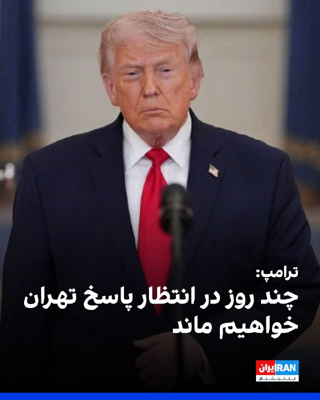

دونالد ترامپ درباره ایران گفت: «ما باید پاسخ درست را دریافت کنیم.»

او افزود آمریکا در حال مذاکره با «افراد منطقی» در ایران است و چند روز در انتظار پاسخ آن‌ها خواهد ماند.

ترامپ همچنین تاکید کرد تا زمانی که توافق حاصل نشود، هیچ‌گونه معافیتی اعمال نخواهد شد.
‌🏁 🇬🇧 IranintlTV

🤖 @VahidOOnLine

## VahidOOnLine — post 241213

  

مسعود پزشکیان در شبکه ایکس نوشت: «ایران همواره به تعهدات خود پایبند بوده و همه راه‌ها را برای جلوگیری از جنگ آزموده است؛ از سوی ما همه مسیرها همچنان باز است. وادار کردن ایران به تسلیم از طریق اجبار چیزی جز یک توهم نیست. احترام متقابل در دیپلماسی بسیار عاقلانه‌تر، امن‌تر و پایدارتر از جنگ است.»
‌🏁 🇬🇧 IranintlTV

🤖 @VahidOOnLine

## VahidOOnLine — post 241212

  

♦️وبسایت آکسیوس روز چهارشنبه ۳۰ اردیبهشت، به نقل از سه منبع آگاه گزارش داد که دونالد ترامپ و بنیامین نتانیاهو در تماسی تلفنی و دشوار در روز سه‌شنبه، تلاش‌های جدید برای دستیابی به توافق با جمهوری اسلامی را بررسی کردند؛ تا جایی که یکی از منابع آکسیوس گفت نتانیاهو پس از این تماس «بسیار خشمگین و آشفته» بود.

این تنش پس از آن رخ داد که قطر و پاکستان با همکاری دیگر میانجی‌های منطقه‌ای، پیش‌نویس طرح صلحی را برای کاهش اختلافات میان آمریکا و جمهوری اسلامی تدوین کردند. این در حالی است که ترامپ میان صدور فرمان یک حمله گسترده به ایران یا منتظر ماندن برای توافق، مردد است.

به گزارش آکسیوس، نتانیاهو به شدت نسبت به این مذاکرات بدبین است و خواستار ازسرگیری جنگ برای نابودی زیرساخت‌های حیاتی و تضعیف بیشتر نظامی ایران است. در مقابل، ترامپ روز چهارشنبه در آکادمی گارد ساحلی گفت: «سوال این است که آیا کار را تمام کنیم یا آن‌ها توافق‌نامه را امضا می‌کنند؟» او همچنین تاکید کرد نتانیاهو هرچه او بخواهد انجام می‌دهد.
‌🇸🇦 Indypersian

🤖 @VahidOOnLine

## VahidOOnLine — post 241211

  

♦️بر اساس بیانیه نهاد ریاست‌جمهوری ترکیه، رجب طیب اردوغان، رئیس‌جمهوری این کشور، روز چهارشنبه ۳۰ اردیبهشت در تماسی تلفنی با دونالد ترامپ، رئیس‌جمهوری ایالات متحده، از تمدید آتش‌بس میان آمریکا و ایران استقبال و ابراز امیدواری کرد که مسائل مورد اختلاف میان دو طرف قابل حل است.

در بیانیه ریاست‌جمهوری ترکیه آمده است: «رئیس‌جمهوری ما در این گفتگو اظهار داشت که تصمیم برای تمدید آتش‌بس در منطقه درگیری را تحولی مثبت ارزیابی می‌کند و بر این باور است که دست‌یابی به یک راه‌حل منطقی برای مسائل مورد اختلاف امکان‌پذیر است.»
‌🇸🇦 Indypersian

🤖 @VahidOOnLine

## VahidOOnLine — post 241210

♦️ولادیمیر پوتین، رئیس‌جمهوری روسیه، شامگاه چهارشنبه پس از یک سفر دو روزه به پکن و دیدار و گفتگو با شی جین‌پینگ، رئیس‌جمهوری چین، پایتخت این کشور را ترک کرد.
تصاویر منتشرشده، رئیس‌جمهوری روسیه را در حال خداحافظی با هیئت‌های دو کشور، سوار شدن به هواپیما و پرواز از چین نشان می‌دهد.
شی جین‌پینگ و ولادیمیر پوتین در جریان این سفر درباره طیف گسترده‌ای از موضوعات سیاسی، اقتصادی و بین‌المللی گفتگو کردند و دو طرف بر گسترش همکاری‌های راهبردی میان چین و روسیه تاکید داشتند.
رهبران دو کشور که تاکنون بیش از ۴۰ بار با یکدیگر دیدار کرده‌اند، روابط پکن و مسکو را «شراکت راهبردی جامع» توصیف کرده و خواستار تقویت همکاری‌ها در حوزه‌هایی از جمله اقتصاد، انرژی، فناوری، هوش مصنوعی و مسائل امنیتی شدند.
بر اساس بیانیه مشترک منتشرشده، چین و روسیه برنامه‌هایی برای توسعه همکاری‌ها در زمینه‌های مختلف از فناوری‌های نوین و تجارت گرفته تا حفاظت از گونه‌های نادر جانوری مانند ببر، پلنگ و پاندا تدوین کرده‌اند.
در جریان این سفر، شی جین‌پینگ با برگزاری مراسم استقبال رسمی در تالار بزرگ خلق پکن از پوتین استقبال کرد.
‌🇸🇦 Indypersian

🤖 @VahidOOnLine

## VahidOOnLine — post 241209

  

♦️ مسعود پزشکیان، رئیس‌جمهوری اسلامی، روز چهارشنبه ۳۰ اردیبهشت با انتشار پیامی در شبکه اجتماعی ایکس اعلام کرد که تهران «همواره به تعهدات خود پایبند بوده و از هر طریقی برای جلوگیری از جنگ استفاده کرده است».

او نوشت: «از جانب ما همچنان همه راه‌ها باز است.»

پزشکیان در ادامه تاکید کرد: «به زانو درآوردن ایران از طریق اجبار و فشار، چیزی جز یک توهم نیست. احترام متقابل در دیپلماسی، بسیار عاقلانه‌تر، ایمن‌تر و پایدارتر از جنگ است.»

پزشکیان این پیام را ساعتی بعد از دیدار با محسن نقوی، وزیر کشور پاکستان در تهران منتشر کرد. به گفته بقایی، سفر نقوی به ایران در راستای تسهیل تبادل پیام میان تهران و واشنگتن انجام شده است.
‌🇸🇦 Indypersian

🤖 @VahidOOnLine

## VahidOOnLine — post 241208

یک شهروند در پیامی به ایران اینترنشنال از افزایش کالاهای خوراکی روایت کرده و می‌گوید قیمت یک پفک به ۱۸۰ هزار تومان رسیده است. پیام او با هوش مصنوعی خوانده شده است.

Pofak-V.mp4
‌🏁 🇬🇧 IranintlTV

🤖 @VahidOOnLine

## VahidOOnLine — post 241207

  

♦️اسماعیل بقایی، سخنگوی وزارت امور خارجه جمهوری اسلامی، روز چهارشنبه ۳۰ اردیبهشت اعلام کرد که تهران پیشنهاد جدیدی از سوی ایالات متحده دریافت کرده و در حال حاضر مشغول بررسی آن است. این اظهارات همزمان با سفر وزیر کشور پاکستان، به عنوان میانجی، به ایران مطرح شد.

بقایی در مصاحبه تلفنی با صداوسیما گفت: «ما دیدگاه‌های طرف آمریکایی را دریافت کرده‌ایم و در حال حاضر مشغول بررسی آن‌ها هستیم. حضور وزیر کشور پاکستان نیز با هدف تسهیل تبادل پیام‌ها انجام شده است.»

او بار دیگر تاکید کرد که مطالبات جمهوری اسلامی در مذاکرات برای پایان دادن به جنگ، شامل آزادسازی دارایی‌های بلوکه‌شده ایران در خارج از کشور و پایان دادن به محاصره بنادر ایران توسط ایالات متحده است.
‌🇸🇦 Indypersian

🤖 @VahidOOnLine

## VahidOOnLine — post 241206

  

اسماعیل بقایی، سخنگوی وزارت خارجه جمهوری اسلامی، در واکنش به سخنان دونالد ترامپ گفت اولتیماتوم‌ دادن به جمهوری اسلامی «مضحک» است و لفاظی‌ها و تهدیدهای خارجی تاثیری نخواهد داشت. او تاکید کرد جمهوری اسلامی بدون توجه به این اظهارات، منافع خود را دنبال می‌کند.

بقایی آزادسازی اموال بلوکه‌شده را یکی از مطالبات مشخص تهران دانست و افزود در این مرحله تمرکز بر خاتمه جنگ در همه جبهه‌ها، از جمله لبنان است. او هشدار داد در صورت ادامه «زیاده‌خواهی» طرف مقابل، توافقی حاصل نخواهد شد.

سخنگوی وزارت خارجه همچنین گفت تبادل پیام‌ها از طریق وابسته پاکستانی در جریان است و دیدگاه‌های آمریکا دریافت و در حال بررسی است؛ حضور وزیر کشور پاکستان نیز برای تسهیل این روند انجام شده است.
‌🏁 🇬🇧 IranintlTV

🤖 @VahidOOnLine

## VahidOOnLine — post 241205

  

اکسیوس گزارش داد ترامپ و نتانیاهو سه‌شنبه درباره تلاش تازه برای دستیابی به توافق با ایران گفت‌وگو کردند. به گفته یک منبع آمریکایی، ترامپ به نتانیاهو اطلاع داده میانجی‌ها در حال تدوین «تفاهم اولیه» برای پایان رسمی جنگ و آغاز دوره‌ای ۳۰ روزه مذاکرات درباره موضوعاتی از جمله برنامه هسته‌ای ایران و بازگشایی تنگه هرمز هستند.
به نوشته اکسیوس، دو منبع اسرائیلی از اختلاف نظر دو رهبر درباره مسیر پیش رو خبر دادند و یک منبع آمریکایی گفت پس از تماس، «موهای بی‌بی آتش گرفته بود».
این گزارش می‌افزاید پیش‌نویس جداگانه‌ای از سوی قطر وجود ندارد و دو مقام عرب و یک منبع اسرائیلی گفته‌اند قطر پیش‌نویس جدیدی را به تهران و واشینگتن ارائه کرده، اما هنوز مشخص نیست ایران با آن موافقت کند. همچنین به گفته یک مقام عرب، هیأتی قطری برای گفت‌وگو درباره نسخه جدید به تهران سفر کرده است.

‌🏁 🇬🇧 IranintlTV

🤖 @VahidOOnLine

## VahidOOnLine — post 241204

  <a href="telegram/content/VahidOOnLine_241204_1779305989.mp4" target="_blank">🎬 Download video</a>

ویدیوی رسیده به ایران اینترنشنال نشان می‌دهد شهروندان پوستری را در کرج روی دیوار نصب کرده‌اند که با اعتراض به سیاست جنگ‌طلبانه جمهوری اسلامی افزوده تنها جنگ مردم، جنگ برای براندازی رژیم است.
‌🏁 🇬🇧 IranintlTV

🤖 @VahidOOnLine

## VahidOOnLine — post 241203

  <a href="telegram/content/VahidOOnLine_241203_1779305991.mp4" target="_blank">🎬 Download video</a>

وزارت دادگستری آمریکا علیه رائول کاسترو، رئیس‌جمهوری پیشین کوبا و برادر فیدل کاسترو، اعلام جرم کرد.

بر اساس کیفرخواستی که در دادگاه فدرال میامی منتشر شده، رائول کاسترو ۹۴ ساله به همراه پنج نفر دیگر به اتهام قتل، توطئه برای کشتن شهروندان آمریکایی و انهدام هواپیما متهم شده‌اند.

این پرونده به سرنگونی دو هواپیمای متعلق به گروه «برادران نجات» در سال ۱۹۹۶ مربوط می‌شود؛ گروهی از تبعیدیان کوبایی که برای کمک به پناهجویان کوبایی فعالیت می‌کردند. در آن حادثه، چهار نفر کشته شدند.

آمریکا می‌گوید جنگنده‌های کوبایی این هواپیماها را بر فراز آب‌های بین‌المللی هدف قرار داده‌اند، اما دولت کوبا همواره مدعی بوده این هواپیماها وارد حریم هوایی این کشور شده بودند.

این اقدام که بخشی از کارزار فشار دولت ترامپ علیه حکومت کمونیستی کوباست، تنش‌ها میان واشینگتن و هاوانا را به سطح تازه‌ای رسانده است
‌🏁 🇬🇧 ManotoTV

🤖 @VahidOOnLine

## VahidOOnLine — post 241202

  <a href="telegram/content/VahidOOnLine_241202_1779305991.mp4" target="_blank">🎬 Download video</a>

♦️ فرماندهی مرکزی ایالات متحده (سنتکام) روز چهارشنبه ۳۰ اردیبهشت اعلام کرد تفنگداران دریایی آمریکا یک نفتکش تجاری با پرچم ایران در که مشکوک به تلاش برای شکستن محاصره دریایی بود را در دریای عمان توقیف و بازرسی کردند. سنتکام ویدیویی از این عملیات را نیز در شبکه اجتماعی ایکس منتشر کرد.

سنتکام در بیانیه‌ای گفت: «نیروهای آمریکایی پس از بازرسی این شناور و هدایت خدمه آن برای تغییر مسیر، کشتی را آزاد کردند.»

مقامات جمهوری اسلامی هنوز هیچ‌گونه واکنش یا اظهارنظری درباره این حادثه نشان نداده‌اند.

سنتکام در ادامه بیانیه‌ خود افزود که ارتش آمریکا از زمان آغاز اجرای این طرح محاصره دریایی، تاکنون مسیر ۹۱ فروند کشتی تجاری را «تغییر داده است».
‌🇸🇦 Indypersian

🤖 @VahidOOnLine

## VahidOOnLine — post 241201

  <a href="telegram/content/VahidOOnLine_241201_1779305993.mp4" target="_blank">🎬 Download video</a>

⭕️ پزشکیان و وزیر کشور پاکستان در تهران، روند مذاکرات ایران و آمریکا را بررسی کردند

♦️خبرگزاری تسنیم، وابسته به سپاه پاسداران، روز چهارشنبه ۳۰ اردیبهشت گزارش کرد کە مسعود پزشکیان، رئیس‌جمهوری اسلامی در دیدار با سید محسن نقوی، وزیر کشور پاکستان، آخرین تحولات منطقه‌ای، مناسبات دوجانبه تهران و اسلام‌آباد و روند رایزنی‌های دیپلماتیک مرتبط با مذاکرات غیرمستقیم ایران و آمریکا را بررسی کرده است.
در این دیدار، دو طرف درباره روند پیگیری توافقات، تحولات جاری منطقه و اهمیت ادامه مسیر گفتگو و تفاهم تبادل نظر کردند. وزیر کشور پاکستان نیز پیام‌ها و دیدگاه‌های مقام‌های این کشور درباره تحولات منطقه و ضرورت تداوم رایزنی‌های دیپلماتیک را به پزشکیان منتقل کرد.
پزشکیان ضمن قدردانی از «مواضع و همکاری‌های دولت پاکستان در حمایت از ثبات و امنیت منطقه‌ای»، بر اهمیت گسترش روابط دوجانبه و استمرار هماهنگی‌های سیاسی میان تهران و اسلام‌آباد تاکید کرد.
‌🇸🇦 Indypersian

🤖 @VahidOOnLine

## VahidOOnLine — post 241200

  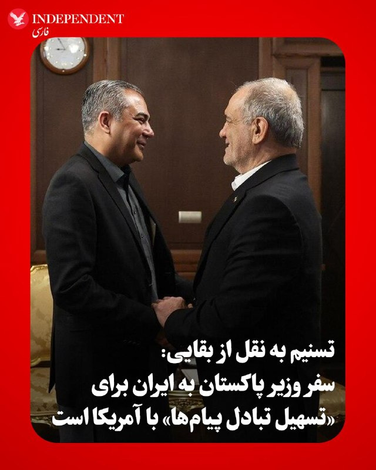

♦️خبرگزاری تسنیم، وابسته به سپاه پاسداران، روز چهارشنبه ۳۰ اردیبهشت به نقل از اسماعیل بقایی، سخنگوی وزارت امور خارجه جمهوری اسلامی، اطلاعاتی درباره روند مذاکرات میان تهران و واشنگتن را منتشر کرد.

بقایی اعلام کرد که سفر محسن نقوی، وزیر کشور پاکستان به ایران، با هدف «تسهیل تبادل پیام‌ها و ارائه توضیحات تکمیلی برای شفاف‌سازی متن‌های ارسالی میان طرفین» انجام شده است.

رسانه‌های ایران پیش از این گزارش داده بودند که نقوی در چارچوب تلاش‌ها برای دستیابی به توافق میان واشنگتن و تهران، دومین سفر خود را در یک هفته گذشته به ایران انجام داده است. نقوی در این سفر با مسعود پزشکیان نیز دیدار کرد.

بر اساس گزارش تسنیم، بقایی همچنین تاکید کرد که ایران علی‌رغم داشتن «سوءظن شدید و منطقی» به طرف آمریکایی، «مسیر مذاکرات را با جدیت و حسن نیت دنبال می‌کند».
‌🇸🇦 Indypersian

🤖 @VahidOOnLine

## WithYashar — post 11791

کانال ۱۲ اسرائیل: نیروهای آمریکایی بر روی یک نفتکش ایرانی در خلیج عمان سوار شدند.
@withyashar
🚨🚨🚨🚨🚨🚨

## WithYashar — post 11790

  <a href="telegram/content/WithYashar_11790_1779305996.mp4" target="_blank">🎬 Download video</a>

خبرنگار : قصد داری به اونا ( ایران) حمله کنی‌؟

ترامپ : اینو بهت نمیگم
@withyashar

## WithYashar — post 11789

خبرنگار : از این رفت و برگشت با ایران خسته نمیشی؟

ترامپ : من هیچوقت خسته نمیشم ولی اگه با چند روز صبر کردن بشه جلوی جنگ و کشته شدن مردم رو گرفت کار خوبیه

@withyashar

## WithYashar — post 11788

ترامپ: چند روز منتظر پاسخ ایران می‌مانیم

ایران یک کشور شکست‌خورده است و ما امیدواریم بتوانیم با آنها توافق کنیم که این برای همه عالی خواهد بود.

من هیچ تحریمی را علیه ایران تا زمانی که به توافق برسیم رفع نخواهم کرد. تا زمانی که ایران توافق را امضا نکند به ایران هیچ معافیت نفتی نخواهم داد و پیشنهادی هم برای انجام این کار نداده‌ایم.

اگر پاسخ‌های درست را نگیریم، اوضاع خیلی سریع پیش می‌رود. همه ما آماده‌ایم. باید پاسخ‌های درست را به دست آوریم.
@withyashar

## WithYashar — post 11787

  <a href="telegram/content/WithYashar_11787_1779305998.mp4" target="_blank">🎬 Download video</a>

خبرنگار: آیا همانطور که رسانه های دولتی ایران گزارش داده اند، ایالات متحده در جریان مذاکرات صلح پیشنهاد کاهش تحریم های نفتی ایران را داده است؟

ترامپ: نه، من این را نشنیده ام. تا زمانی که توافقی امضا نکنند، هیچ کمکی نمی‌کنم.
وقتی آنها توافق نامه ای امضا می کنند، ما می توانیم دوباره آن مکان را بسازیم و کشوری داشته باشیم که واقعا کشور خوبی برای مردم باشد.
اما نه، ما چیزی پیشنهاد نکرده ایم.
@withyashar

## WithYashar — post 11786

مسعود زرشکیان : وادار کردن ایران به تسلیم از طریق اجبار چیزی جز توهم نیست.
احترام متقابل در دیپلماسی بسیار عاقلانه‌تر، ایمن‌تر و پایدارتر از جنگ است
@withyashar

## WithYashar — post 11783

## WithYashar — post 11782

## WithYashar — post 11781

کلش ریپورت: اردوغان در تماس تلفنی با ترامپ درباره روابط ترکیه و آمریکا و مسائل منطقه‌ای صحبت کرد.
@withyashar

## WithYashar — post 11780

به ادعای آکسیوس : امروز اوایل روز، بحث داغی در داخل کاخ سفید درباره ایران شکل گرفت، جایی که جی‌دی ونس، استیو ویتکاف و جرد کوشنر برای توافق اولیه‌ای جهت پایان دادن به جنگ تلاش می‌کردند، در حالی که پیت هگست و مارکو روبیو برای فشار بیشتر و احتمال اقدام نظامی استدلال می‌کردند
@withyashar

## WithYashar — post 11779

لطفا دایرکت بی مورد و چند پیغامه ندید 🙌🏾

## WithYashar — post 11778

اتاق جنگ با یاشار : اول مهر مدارس مختلط است 😎
@withyashar

## WithYashar — post 11777

تسنیم به نقل از یک منبع نزدیک به تیم مذاکره‌کننده: پس از ارسال متن ۱۴ بندی ایران که سه روز پیش صورت گرفته است، آمریکایی‌ها بار دیگر متنی را از طریق میانجی پاکستانی به ایران داده‌اند.
ایران در حال بررسی متن است و هنوز پاسخی داده نشده است.
میانجی پاکستانی در تهران به دنبال نزدیک کردن متون به یکدیگر است.
هنوز چیزی در این میان نهایی نشده است.
@withyashar

## WithYashar — post 11776

## WithYashar — post 11775

ادعای آکسیوس به نقل از یک منبع آمریکایی: ترامپ به نتانیاهو از یک دوره 30 روزه مذاکره درباره برنامه هسته‌ای ایران و تنگه هرمز اطلاع داد
@withyashar

## WithYashar — post 11774

خبرنگار العربیه: بعد از تماس اسرائیل در دو حمله هوایی شهرک‌های «حداثا» و «تول» در جنوب لبنان را بمباران کرد.
@withyashar

## WithYashar — post 11773

«آکسیوس»: نتانیاهو از مکالمه تلفنی خود با ترامپ درباره ایران «بسیار عصبانی» شده بود. قطر و پاکستان تعدیلاتی بر طرح پیشنهادی برای پایان جنگ اعمال کردند.
@withyashar

## WithYashar — post 11772

وب‌سایت «آکسیوس»: گفت‌وگوی اخیر ترامپ و نتانیاهو بسیار متشنج و دشوار بود.
@withyashar

## WithYashar — post 11771

رویترز:برخی کشتی‌ها بیش از 150 هزار دلار به ایران پرداخت می‌کنند تا عبور از تنگه هرمز را تضمین کنند.

‏هزینه عبور کشتی‌ها از تنگه هرمز برای همه کشورها اعمال نمی‌شود.

‏مکانیزم جدید ایران در تنگه هرمز به کشتی‌های مرتبط با روسیه و چین است
@withyashar

## WithYashar — post 11770

  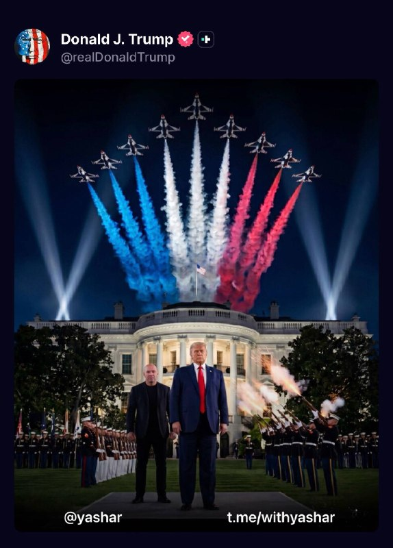

پست جدید ترامپ
@withyashar

## mwarmonitor — post 9380

حمله موشکی به مقرهای مخالفان کُرد ایرانی در استان اربیل در شمال عراق

## mwarmonitor — post 9379

🔹خبرنگار: چه پیامی دارید برای آن دسته از خانواده‌های آمریکایی که از رشد هوش مصنوعی نگرانند؟ آن‌ها نگران این هستند که فرزندانشان در آینده به خاطر جایگزین شدن هوش مصنوعی نتوانند شغلی پیدا کنند.
🔸دونالد ترامپ: خب، چیزی که من می‌گویم این است که هوش مصنوعی تا اینجا فوق‌العاده بوده است، چون در حال حاضر ما شغل‌های بیشتری داریم؛ افراد بیشتری همین الان در ایالات متحده مشغول به کار هستند، بسیار بیشتر از هر زمان دیگری در گذشته.
و جدای از جنگ، من تصور می‌کردم که اقتصاد افت خواهد کرد و بازار بورس ۲۰ تا ۲۵ درصد سقوط می‌کند، اما در واقع رشد داشته است. بازار بورس در حال حاضر بالاتر از زمانی است که من مسئله‌ی ایران را شروع کردم.
و در مورد ایران، من چاره‌ی دیگری نداشتم چون آن‌ها قرار بود به سلاح هسته‌ای دست پیدا کنند و ما قرار نیست اجازه دهیم آن‌ها سلاح هسته‌ای داشته باشند. اما این موضوع به زودی به یک شکلی تمام خواهد شد.
قیمت نفت به شدت پایین خواهد آمد. تعداد بسیار زیادی... ما ۱۶۰۰ کشتی در تنگه داریم که پر از نفت هستند و به زودی خارج خواهند شد. پس... باید منتظر بمانیم و ببینیم چه می‌شود. اما ارتش بی‌نظیر عمل کرده است. محاصره بی‌نقص بوده است. حتی یک کشتی هم نتوانسته از این محاصره عبور کند. ۳۷ کشتی تلاش کردند... و همگی آرزو می‌کنند که کاش این کار را نمی‌کردند.

📝سوال چی پرسید چی جواب داد 😐

@mwarmonitor

## mwarmonitor — post 9378

  <a href="telegram/content/mwarmonitor_9378_1779306000.mp4" target="_blank">🎬 Download video</a>

🎬 Video

## mwarmonitor — post 9377

✈️🚨 پرواز یک جنگنده در ارتفاع پایین در آسمان استان موصل در شمال عراق.

@mwarmonitor

## mwarmonitor — post 9376

🔹خبرنگار: دیروز گفتید که حدوداً یک ساعت با تصمیم‌گیری فاصله دارید. امروز اوضاع در چه حالیه؟ آیا چیزی ازشون شنیدید؟
🔸دونالد ترامپ: خیلی... دقیقاً روی مرز (مرز تصمیم‌گیری) قرار داره، باور کنید. اگر پاسخ‌های درستی دریافت نکنیم، خیلی سریع پیش میره. ما کاملاً آماده‌ایم که اقدام کنیم. اما باید پاسخ‌های درستی بگیریم. باید پاسخ‌ها کاملاً و ۱۰۰ درصد خوب باشن؛ و اگر این‌طور باشه، در زمان، انرژی و مهم‌تر از همه، در جان انسان‌ها صرفه‌جویی زیادی می‌کنیم.
🔹خبرنگار: چقدر زمان می‌بره؟
🔸دونالد ترامپ: می‌تونه خیلی سریع اتفاق بیفته. یا چند روز، ممکنه چند روز طول بکشه؛ اما پتانسیلش رو داره که خیلی سریع پیش بره. ایران یک کشور شکست‌خورده است. ما داریم با افرادی سروکار داریم و در واقع، باید بهتون بگم، داریم با افراد خیلی خوبی سروکار داریم. با کسانی طرف هستیم که فکر می‌کنم خیلی منطقی‌تر از اون افرادی هستن که دیگه واقعاً در بین ما حضور ندارن. ما داریم با افرادی سروکار داریم که استعداد دارن، از... هوش و مغز خوبی برخوردارن و این ما رو کاملاً تحت تأثیر قرار داده. بنابراین، امیدواریم این افراد توافقی رو رقم بزنن که برای همه عالی باشه.
🔹خبرنگار: آیا از این رفت‌وآمدهای مداوم خسته نشدید؟
🔸دونالد ترامپ: من نمی‌دونم، نمی‌دونم، من اصلاً... چی؟ خسته بشم؟ من هیچ‌وقت خسته نمی‌شم. اما کاری که مایلم انجام بدم اینه: اگر بتونم با چند روز صبر کردن از جنگ جلوگیری کنم، اگر بتونم با چند روز صبر کردن از کشته شدن مردم جلوگیری کنم، فکر می‌کنم ارزشش رو داره.

@mwarmonitor

## mwarmonitor — post 9375

  <a href="telegram/content/mwarmonitor_9375_1779306001.mp4" target="_blank">🎬 Download video</a>

🎬 Video

## mwarmonitor — post 9374

🔴ترامپ: ما در حال «آزادسازی کوبا» هستیم و باید به کوبایی‌ها کمک کنیم، چون آن‌ها غذا و انرژی ندارند، اما مردم بزرگی هستند. 🔸ما منتظر پاسخ مناسب ایران هستیم تا از تشدید بیشتر تنش جلوگیری شود. 🔸چند روزی منتظر پاسخ ایران خواهیم ماند. 🔸تا زمانی که به توافق نرسیم،…

## mwarmonitor — post 9373

🔴ترامپ: ما در حال «آزادسازی کوبا» هستیم و باید به کوبایی‌ها کمک کنیم، چون آن‌ها غذا و انرژی ندارند، اما مردم بزرگی هستند.

🔸ما منتظر پاسخ مناسب ایران هستیم تا از تشدید بیشتر تنش جلوگیری شود.

🔸چند روزی منتظر پاسخ ایران خواهیم ماند.

🔸تا زمانی که به توافق نرسیم، هیچ‌گونه تحریمی را از ایران لغو نخواهم کرد.

@mwarmonitor

## mwarmonitor — post 9372

🇮🇷 منبع آگاه ایرانی: آمریکایی‌ها، پس از ارسال یک پیام شامل ۱۴ بند سه روز پیش، پیام دیگری را از طریق یک واسطه پاکستانی به ایران ارسال کرده‌اند (ظاهراً همین وزیر کشور پاکستان). ایران در حال بررسی این پیام است و هنوز به آن پاسخ نداده است. 🔸 واسطه پاکستانی در…

## mwarmonitor — post 9371

🔴 طبق اعلام ریاست‌جمهوری ترکیه، اردوغان یک تماس تلفنی با ترامپ داشته است.

@mwarmonitor

## mwarmonitor — post 9370

حمله پهپادی به اقلیم کردستان

## mwarmonitor — post 9369

🔴گرگوری برو تحلیل‌گر ارشد حوزه ایران و نفت در Eurasia Group (یک شرکت معتبر در زمینه مشاوره ریسک سیاسی)

🔸به نظر می‌رسد توافق پیشنهادی شامل یک بیانیه نیت از سوی هر دو طرف درباره پایان جنگ است، که پس از آن یک دوره ۳۰ روزه برای مذاکره درباره بازگشایی تنگه و همچنین مسائل هسته‌ای در نظر گرفته می‌شود.

🔹در عمل، این یعنی تمدید ۳۰ روزه آتش‌بس.

🔹با این حال، هنوز هم به اندازه کافی هست که نتانیاهو را خشمگین کند.

@mwarmonitor

## mwarmonitor — post 9368

🇮🇷 منبع آگاه ایرانی: آمریکایی‌ها، پس از ارسال یک پیام شامل ۱۴ بند سه روز پیش، پیام دیگری را از طریق یک واسطه پاکستانی به ایران ارسال کرده‌اند (ظاهراً همین وزیر کشور پاکستان). ایران در حال بررسی این پیام است و هنوز به آن پاسخ نداده است.
🔸 واسطه پاکستانی در تهران تلاش می‌کند دیدگاه‌های دو طرف را به یکدیگر نزدیک کند. هنوز توافق نهایی حاصل نشده است.

🔸پزشکیان بعد از دیدار وزیر کشور پاکستان: ایران همواره به تعهدات خود عمل کرده و همه راه‌ها را برای جلوگیری از جنگ پیموده است؛ و همچنان همه گزینه‌ها از سوی ما باز است. وادار کردن ایران به تسلیم از طریق زور، چیزی جز یک توهم نیست. احترام متقابل در دیپلماسی، عاقلانه‌تر، امن‌تر و پایدارتر از جنگ است.

@mwarmonitor

## mwarmonitor — post 9367

دو منبع دیگر نیز اشاره کردند که نتانیاهو در مراحل قبلی مذاکرات هم — حتی زمانی که توافق‌ها به نتیجه نرسیدند — بشدت نگران بوده است. یکی از این منابع گفت: «بی‌بی همیشه نگران است.»
اظهارات طرفین
سخنگوی وزارت امور خارجه ایران اعلام کرد که برای موفقیت گفتگوها، ایالات متحده باید به «قرص‌گری و راهزنی» علیه کشتی‌های ایرانی پایان دهد و با آزادسازی دارایی‌های بلوکه‌شده موافقت کند، و اسرائیل نیز باید به جنگ خود در لبنان خاتمه دهد.
کاخ سفید و دفتر نخست‌وزیری اسرائیل هر دو از اظهار نظر در خصوص این گزارش خودداری کردند.

📌مواردی که باید زیر نظر داشت
یک منبع اسرائیلی اعلام کرد که نتانیاهو تمایل دارد طی هفته‌های آینده برای دیدار و گفتگو با ترامپ به واشنگتن سفر کند.

@mwarmonitor

## mwarmonitor — post 9366

🔴طرح پیشنهادی جدید برای صلح با ایران، موجب تماس تلفنی تنش‌آمیز میان ترامپ و نتانیاهو شد

📝نویسنده: باراک راوید AXIOS

🔰سه منبع آگاه اعلام کردند که دونالد ترامپ، رئیس‌جمهور آمریکا و بنیامین نتانیاهو، نخست‌وزیر اسرائیل، روز سه‌شنبه در یک تماس تلفنی دشوار، درباره تلاش‌های جدید برای دستیابی به توافق با ایران گفتگو کردند؛ تا جایی که به گفته یکی از این منابع، نتانیاهو پس از پایان این مکالمه بشدت برافروخته و نگران بوده است.

چرا این موضوع اهمیت دارد؟
به گفته منابع، قطر و پاکستان با همفکری سایر میانجی‌های منطقه‌ای، پیش‌نویس یک یادداشت تفاهم صلح بازنگری‌شده را تهیه کرده‌اند تا گامی برای کاهش اختلافات میان ایالات متحده و ایران بردارند. این اقدام در شرایطی صورت می‌گیرد که ترامپ میان صدور فرمان یک حمله گسترده به ایران و تلاش برای دستیابی به توافق، مردد مانده است.
نتانیاهو نسبت به این مذاکرات بشدت بدبین است و خواهان از سرگیری جنگ است تا از طریق نابود کردن زیرساخت‌های حیاتی ایران، توانمندی‌های نظامی این کشور را بیشتر تضعیف کرده و حکومت را تحت فشار بگذارد.
ترامپ همچنان معتقد است که امکان دستیابی به توافق وجود دارد، اما تاکید کرده که در صورت عدم توافق، آماده از سرگیری جنگ است.
ترامپ روز چهارشنبه در آکادمی گارد ساحلی گفت: «تنها سوال این است که آیا کار را یکسره کنیم یا آن‌ها قرار است سندی را امضا کنند. باید منتظر ماند و دید چه می‌شود.»
ترامپ همچنین با وجود اشاره به رابطه خوب خود با نتانیاهو، اظهار داشت که او (نتانیاهو) «هر کاری که من بخواهم در قبال ایران انجام خواهد داد.» هرچند این دو رهبر پیش از این نیز اختلافات موقتی درباره ایران داشته‌اند، اما در طول این جنگ همواره هماهنگی نزدیکی با یکدیگر حفظ کرده‌اند.
ایران تایید کرده که در حال بررسی این پیشنهاد به‌روزشده است، اما هنوز هیچ نشانه‌ای از انعطاف نشان نداده است.
جزئیات بیشتر (Zoom in)
سه منبع آگاه می‌گویند که پاکستان، قطر و دیگر میانجی‌ها — شامل عربستان سعودی، ترکیه و مصر — طی چند روز گذشته مشغول اصلاح این طرح پیشنهادی برای نزدیک کردن دیدگاه‌ها بوده‌اند.
به گفته دو مقام عرب و یک منبع اسرائیلی، قطر اخیراً پیش‌نویس جدیدی را به آمریکا و ایران ارائه کرده است.
اما یک منبع چهارم می‌گوید پیش‌نویس مجزایی از سوی قطر وجود ندارد، بلکه قطر صرفاً در تلاش است تا اختلافات موجود در پیشنهاد قبلی پاکستان را برطرف کند.
یک مقام عرب نیز اعلام کرد که قطری‌ها در اوایل هفته جاری هیئتی را برای گفتگو با مقامات ایرانی درباره این پیش‌نویس جدید به تهران فرستاده‌اند.
وزارت امور خارجه ایران روز چهارشنبه اعلام کرد که مذاکرات «بر اساس پیشنهاد ۱۴ ماده‌ای ایران» در جریان است و وزیر کشور پاکستان نیز برای کمک به این میانجی‌گری در تهران حضور دارد. این دومین سفر وزیر کشور پاکستان به تهران در کمتر از یک هفته گذشته است.
یک مقام عرب اظهار داشت هدف از این تلاش‌های جدید، گرفتن تعهدات ملموس‌تر از ایرانی‌ها در خصوص برنامه‌ هسته‌ای‌شان و همچنین مشخص کردن جزئیات دقیق‌تر از سوی آمریکا درباره نحوه آزادسازی تدریجی دارایی‌های بلوکه‌شده ایران است. با این حال، هر سه منبع تاکید کردند هنوز مشخص نیست که آیا ایرانی‌ها با این پیش‌نویس جدید موافقت خواهند کرد یا تغییر چشمگیری در مواضع خود ایجاد می‌کنند یا خیر.
یک دیپلمات قطری در این باره گفت: «همانطور که پیش‌تر اعلام شد، قطر از تلاش‌های میانجی‌گرانه به رهبری پاکستان حمایت کرده و می‌کند. ما همواره خواستار تنش‌زدایی به خاطر امنیت منطقه و مردم آن بوده‌ایم.»
پشت صحنه
شامگاه سه‌شنبه، ترامپ گفتگویی طولانی و «دشوار» با نتانیاهو داشت.
یک منبع آمریکایی که در جریان این گفتگو قرار گرفته، اظهار داشت ترامپ به نتانیاهو گفته است که میانجی‌ها در حال کار روی یک «تفاهم‌نامه اولیه» (Letter of intent) هستند که باید به امضای آمریکا و ایران برسد تا رسماً به جنگ پایان داده و یک دوره مذاکرات ۳۰ روزه را پیرامون مسائلی نظیر برنامه هسته‌ای ایران و بازگشایی تنگه هرمز آغاز کند.
دو منبع اسرائیلی تایید کردند که این دو رهبر درباره مسیر پیش‌رو با یکدیگر اختلاف‌نظر داشتند؛ در حالی که همان منبع آمریکایی مطلع از این تماس گفت: «بی‌بی (نتانیاهو) پس از این تماس تلفنی بشدت برافروخته و مضطرب بود.»
این منبع افزود که سفیر اسرائیل در واشنگتن به قانون‌گذاران آمریکایی اطلاع داده که نتانیاهو نسبت به این تماس نگران است. با این حال، سخنگوی سفارت اسرائیل این روایت را تکذیب کرد و گفت: «سفیر درباره گفتگوهای خصوصی اظهار نظر نمی‌کند.»

## mwarmonitor — post 9365

🔸سناتور لیندسی گراهام:

🔹«من معتقدم رئیس‌جمهور ترامپ کار درخشانی در تضعیف رژیم تروریستی ایران انجام داده و آن را به ضعیف‌ترین وضعیتش از سال ۱۹۷۹ رسانده است. به فرمانده کل قوا و همه کسانی که تحت فرمان او خدمت می‌کنند، دست‌مریزاد.

🔹مثل همه، من هم امیدوارم راه‌حلی دیپلماتیک برای بحران ایران پیدا شود، اما این راه‌حل باید جامع باشد تا اطمینان حاصل شود ایران دیگر بزرگ‌ترین حامی دولتی تروریسم نیست. همچنین باید واقعی باشد و مذاکرات باید قابل اعتماد انجام شوند. از تلاش همه در منطقه برای کمک به این هدف قدردانی می‌کنم.

🔹می‌شنوم که احتمال دارد فیلدمارشال پاکستان به ایران سفر کند — چه چیزی ممکن است اشتباه پیش برود؟! شاید او گزارشی از وضعیت هواپیماهای نظامی ایران که در پایگاه‌های هوایی پاکستان نگهداری می‌شوند ارائه دهد؟

🔹مثل بسیاری دیگر، من با دقت بسیار در حال دنبال کردن اتفاقاتی هستم که بار دیگر درباره تلاش برای رسیدن به توافق با رژیم ایران در حال رخ دادن است. برای همه افراد درگیر، آرزوی موفقیتی واقعی دارم.»

🔸مارک لوین ؛

🔹«لیندزی گراهام حق دارد که با تردید نگاه کند، اما در عین حال امیدوار باشد.»

@mwarmonitor

## mwarmonitor — post 9364

🔴«شبکه کان اسرائیل: نتانیاهو در تلاش است ترامپ را متقاعد کند تا چراغ سبز ازسرگیری جنگ علیه ایران را بدهد.» @mwarmonitor

## mwarmonitor — post 9363

🔴«بر اساس اسناد قضایی که روز چهارشنبه علنی شده، رائول کاسترو، رهبر پیشین کوبا، به همراه پنج نفر دیگر توسط یک هیئت منصفه فدرال آمریکا در ایالت فلوریدا کیفرخواست شده‌اند. به گزارش CBS

@mwarmonitor

## mwarmonitor — post 9362

🔴«فیننشال تایمز: OpenAI در حال آماده‌سازی برای ارائه درخواست عرضه عمومی سهام است و ممکن است این کار را از همین هفته انجام دهد. این آزمایشگاه هوش مصنوعی قصد دارد به‌زودی، احتمالاً تا ماه سپتامبر، یک عرضه اولیه سهام بسیار بزرگ و خبرساز برگزار کند.»

@mwarmonitor

## mwarmonitor — post 9361

🔴«شبکه کان اسرائیل: نتانیاهو در تلاش است ترامپ را متقاعد کند تا چراغ سبز ازسرگیری جنگ علیه ایران را بدهد.»

@mwarmonitor

## FoxNewsTwitter — post 342026

  <a href="telegram/content/FoxNewsTwitter_342026_1779306003.mp4" target="_blank">🎬 Download video</a>

Fox News (Twitter/X)

BREAKING: President Trump reveals the strategy behind his back-and-forth negotiating style with the Iranian regime as the region waits to see if a new waves of fighting will begin:

"I never get tired. What I like to do, if I can save war by waiting a couple of days, so I can save people being killed by waiting a couple of days, I think it's a great thing to do."

## FoxNewsTwitter — post 342025

  <a href="telegram/content/FoxNewsTwitter_342025_1779306005.mp4" target="_blank">🎬 Download video</a>

Fox News (Twitter/X)

JUST IN: President Trump dismissing growing fears and public anxiety over Artificial Intelligence disrupting the job market throughout the country.

"I'll tell you, AI has been amazing, because right now we have more jobs, more people working right now in the United States by far, than we ever had before."

## FoxNewsTwitter — post 342024

  <a href="telegram/content/FoxNewsTwitter_342024_1779306007.mp4" target="_blank">🎬 Download video</a>

Fox News (Twitter/X)

NOW: President Trump celebrates the "very big moment" of Raul Castro being indicted and what it means to the Cuban people:

"We have Cuba on our mind, it's very important.... It was a very big moment for people, not only Cuban Americans, but people who came from Cuba, that want to go back to Cuba, see their family in Cuba."

"They supported me to the nth degree, they supported me at levels that nobody's ever seen before. And so I think it's a very important moment."

## FoxNewsTwitter — post 342023

  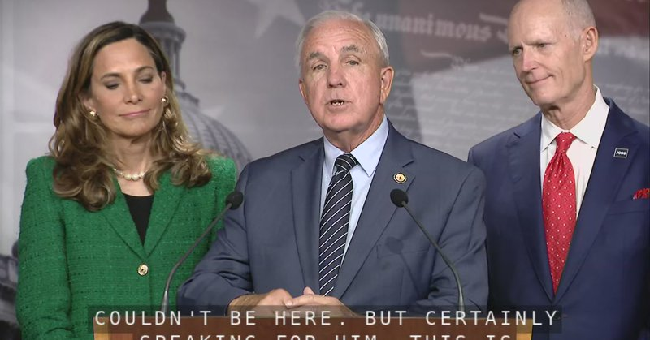

Fox News (Twitter/X)

WATCH LIVE: Florida lawmakers hold press conference on US indictment of Raúl Castro https://twitter.com/i/broadcasts/1pKkOyBYPAMKj

## FoxNewsTwitter — post 342022

  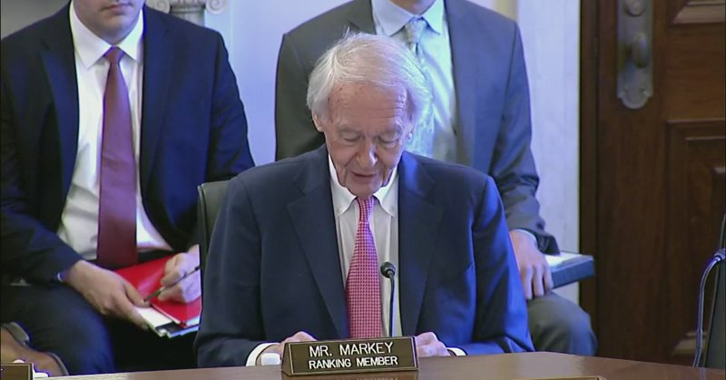

Fox News (Twitter/X)

WATCH LIVE: Senate holds 'Blowing the Whistle: Inside the Grift that Keeps Giving' hearing https://twitter.com/i/broadcasts/1jxXgeVpZgeJZ

## FoxNewsTwitter — post 342021

  <a href="telegram/content/FoxNewsTwitter_342021_1779306009.mp4" target="_blank">🎬 Download video</a>

Fox News (Twitter/X)

"Let's take a moment to revisit what actual Jim Crow was."

Rep. Wesley Hunt dismantles Democrats' talking points trying to compare voter ID requirements to segregation and other racist policies that plagued the U.S. for decades.

The Texas Republican detailed the brutal realities of the Jim Crow South, sharing how his own father had to walk to the back of a restaurant in New Orleans just to order food because of the color of his skin.

"That was Jim Crow," Hunt said. "And that is precisely why it is so offensive to compare that era of legalized discrimination and racial terror to showing a photo ID in a voting booth."

## FoxNewsTwitter — post 342020

  <a href="telegram/content/FoxNewsTwitter_342020_1779306011.mp4" target="_blank">🎬 Download video</a>

Fox News (Twitter/X)

BREAKING: Acting Attorney General Todd Blanche issues a stern warning to America's adversaries, declaring that the Trump administration will hunt down anyone who targets or kills U.S. citizens following the indictment of Raul Castro.

"Nations and their leaders cannot be permitted to target Americans, kill them, and not face accountability.”

“President Trump is committed to restoring a very simple but important principle. If you kill Americans, we will pursue you no matter who you are, no matter what title you hold, and in this case, no matter how much time has passed."

## FoxNewsTwitter — post 342019

  <a href="telegram/content/FoxNewsTwitter_342019_1779306012.mp4" target="_blank">🎬 Download video</a>

Fox News (Twitter/X)

NOW: Todd Blanche tells the tragic story of the 1996 shootdown of two civilian aircraft that killed four Americans engaged in humanitarian work:

"On February 24th, 1996, two civilian aircraft operated by Brothers The Rescue were shot down over international waters by military aircraft from Cuba. Four men were killed."

"They were unarmed civilians and were flying humanitarian missions for the rescue and protection of people fleeing oppression."

"Raul Castro and five co-defendants participated in a conspiracy that ended with Cuban military aircraft firing missiles at those civilian planes and killing four Americans."

"My message today is clear the United States and President Trump does not and will not forget its citizens."

## FoxNewsTwitter — post 342018

  <a href="telegram/content/FoxNewsTwitter_342018_1779306014.mp4" target="_blank">🎬 Download video</a>

Fox News (Twitter/X)

WATCH: Crowd erupts with cheers as Acting AG Todd Blanche announces the DOJ is indicting former Cuban president Raul Castro.

Castro and several others are being charged with conspiracy to kill U.S. nationals, destruction of aircraft, and four individual counts of murder.

## FoxNewsTwitter — post 342017

  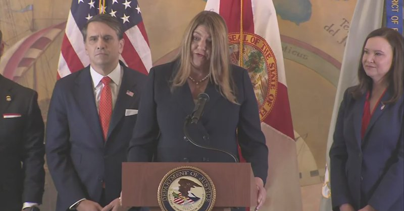

Fox News (Twitter/X)

WATCH LIVE: DOJ announces indictment against former Cuban President Raúl Castro https://twitter.com/i/broadcasts/1dxYljqOXEXJX

## FoxNewsTwitter — post 342016

‌Fox News (Twitter/X)

https://www.foxnews.com/politics/doj-indicts-cuban-ex-president-raul-castro-charges-including-murder-conspiracy-kill-us-nationals

## FoxNewsTwitter — post 342015

  <a href="telegram/content/FoxNewsTwitter_342015_1779306017.mp4" target="_blank">🎬 Download video</a>

Fox News (Twitter/X)

CENTCOM releasing new video showing U.S. Marines boarding an Iranian-flagged oil tanker in the Gulf of Oman earlier today as American forces continue enforcing the Middle East naval blockade.

The M/T Celestial Sea was searched by Marines with the 31st Marine Expeditionary Unit after the vessel was suspected of attempting to transit toward an Iranian port.

U.S. forces later released the ship and ordered the crew to alter course.

Officials say 91 commercial vessels have now been redirected as the blockade operation escalates across the region.

## FoxNewsTwitter — post 342011

Fox News (Twitter/X)

SEE THE MOMENTS: President Trump delivered a historic commencement speech at the U.S. Coast Guard Academy, making his mark as the only president to address graduates of the academy more than once.

"We're going to have to try it maybe a third time too," the president joked.

Trump, in a speech full of both humor and applause, left graduates with some words of inspiration on how to go about their lives and careers, even inviting a few of the top cadets up to the stage as he recognized them.

## FoxNewsTwitter — post 342010

  <a href="telegram/content/FoxNewsTwitter_342010_1779306019.mp4" target="_blank">🎬 Download video</a>

Fox News (Twitter/X)

JUST NOW: The crowd erupts with laughter after President Trump jokes he "hates good looking men," inviting the "top of the class" cadet to join him on stage during his commencement speech at the Coast Guard Academy.

## FoxNewsTwitter — post 342009

  <a href="telegram/content/FoxNewsTwitter_342009_1779306021.mp4" target="_blank">🎬 Download video</a>

Fox News (Twitter/X)

JUST IN: U.S. Coast Guard Academy Class President presents President Trump with a gift from the class of 2026 - a USCGA football helmet.

## FoxNewsTwitter — post 342008

Fox News (Twitter/X)

BREAKING: Cuban ex-President Raul Castro indicted on charges including murder, conspiracy to kill US nationals

## FoxNewsTwitter — post 342007

  <a href="telegram/content/FoxNewsTwitter_342007_1779306023.mp4" target="_blank">🎬 Download video</a>

Fox News (Twitter/X)

WATCH: President Trump is met with a standing ovation as he finishes his commencement speech to the U.S. Coast Guard Academy.

"The U.S. Coast Guard has never, ever let us down. And with men and women like the great class of 2026, I know that will never happen."

"Wherever the duty calls, whatever danger comes our way, you will fight, fight, fight and you will win, win, win."

"God bless the Coast Guard Academy, the class of 2026. God bless the United States military and God bless the United States of America."

## pm_afshaa — post 91131

نخست‌وزیر اسپانیا: به‌سرعت ممنوعیت ورود وزرای اسرائیلی به کشورهای اتحادیه اروپا را پیش خواهم برد

💧 Rainbet.com the #1 Non-KYC Crypto Casino & Sportsbook @rainbetcom

😁 @Pm_Afshaa

## pm_afshaa — post 91130

🔴ترامپ : اگه جواب درست نگیریم خیلی سریع اوضاع میره سمت درگیری همه چی آماده‌ست فقط باید جواب درست بگیریم

💧 Rainbet.com the #1 Non-KYC Crypto Casino & Sportsbook @rainbetcom

😁 @Pm_Afshaa

## pm_afshaa — post 91129

🔴ترامپ: تا زمانی که ایران توافق‌نامه‌ای امضا نکند، هیچ معافیت نفتی به این کشور اعطا نخواهم کرد و ما پیشنهادی برای ارائه چنین معافیت‌هایی نداده‌ایم

💧 Rainbet.com the #1 Non-KYC Crypto Casino & Sportsbook @rainbetcom

😁 @Pm_Afshaa

## pm_afshaa — post 91128

🔴اسرائیل هیوم:یک مناقشه داغ در کاخ سفید بین مقامات ارشد آمریکا بر سر سیاست ایران رخ داد،معاون رئیس‌جمهور آمریکا، جی‌دی ونس، و فرستادگان استیو ویتکاف و جارد کوشنر برای توافق اولیه به منظور پایان دادن به جنگ تلاش کردند،
در حالی که وزیر جنگ پیت هگست و وزیر امور خارجه مارکو روبیو خواستار فشار و حمله بودن

💧 Rainbet.com the #1 Non-KYC Crypto Casino & Sportsbook @rainbetcom

😁 @Pm_Afshaa

## pm_afshaa — post 91127

🔴تسنیم: آمریکایی‌ها متن جدیدی به ایران ارسال کردن و ایران در حال بررسی متن ارسال شدست؛ هنوز از طرف ایران پاسخی داده نشده

💧 Rainbet.com the #1 Non-KYC Crypto Casino & Sportsbook @rainbetcom

😁 @Pm_Afshaa

## pm_afshaa — post 91126

🔴آکسیوس به نقل از یک منبع آمریکایی: ترامپ به نتانیاهو از یک دوره 30 روزه مذاکره درباره برنامه هسته‌ای ایران و تنگه هرمز اطلاع داد

💧 Rainbet.com the #1 Non-KYC Crypto Casino & Sportsbook @rainbetcom

😁 @Pm_Afshaa

## pm_afshaa — post 91125

🔴رادیو و تلویزیون اسرائیل: نتانیاهو تلاش می‌کند تا ترامپ را به دادن چراغ سبز برای ازسرگیری حملات به ایران متقاعد سازد

💧 Rainbet.com the #1 Non-KYC Crypto Casino & Sportsbook @rainbetcom

😁 @Pm_Afshaa

## pm_afshaa — post 91123

🔴یک مقام ارشد اسرائیلی:حمله به ایران بنظر قطعیه و مسئله فقط زمانه

💧 Rainbet.com the #1 Non-KYC Crypto Casino & Sportsbook @rainbetcom

😁 @Pm_Afshaa

## pm_afshaa — post 91122

🔴رویترز:برخی کشتی‌ها بیش از 150 هزار دلار به ایران پرداخت می‌کنند تا عبور از تنگه هرمز را تضمین کنند.

‏هزینه عبور کشتی‌ها از تنگه هرمز برای همه کشورها اعمال نمی‌شود.

‏مکانیزم جدید ایران در تنگه هرمز به کشتی‌های مرتبط با روسیه و چین است

💧 Rainbet.com the #1 Non-KYC Crypto Casino & Sportsbook @rainbetcom

😁 @Pm_Afshaa

## pm_afshaa — post 91121

  <a href="telegram/content/pm_afshaa_91121_1779306024.webm" target="_blank">🎬 Download video</a>

🔴رادیو پخش اسرائیل به نقل از یک مقام اسرائیلی: ترامپ تمایل داره از حمله نظامی حمایت کنه، اما همچنان پنجره باریکی برای مذاکره با ایران باقی می‌گذاره.

💧 Rainbet.com the #1 Non-KYC Crypto Casino & Sportsbook @rainbetcom

😁 @Pm_Afshaa

## pm_afshaa — post 91120

  <a href="telegram/content/pm_afshaa_91120_1779306025.webm" target="_blank">🎬 Download video</a>

🔴کانال 12 اسرائیل: نتانیاهو از ترامپ خواست به فشار نظامی بر ایران ادامه بده.

💧 Rainbet.com the #1 Non-KYC Crypto Casino & Sportsbook @rainbetcom

😁 @Pm_Afshaa

## pm_afshaa — post 91119

  <a href="telegram/content/pm_afshaa_91119_1779306025.webm" target="_blank">🎬 Download video</a>

🔴سخنگوی وزارت خارجه ایران:
حضور وزیر کشور پاکستان برای تسهیل تبادل پیام‌ها و ارائه توضیحات تکمیلی جهت شفاف‌سازی متون ارسالی میان طرفین انجام می‌شود.

ایران با وجود سابقه منفی طرف مقابل در یک سال و نیم گذشته، با جدیت و حسن نیت مسیر مذاکره را دنبال می‌کند اما نسبت به عملکرد آمریکا «سوءظن شدید و منطقی» دارد.

💧 Rainbet.com the #1 Non-KYC Crypto Casino & Sportsbook @rainbetcom

😁 @Pm_Afshaa

## pm_afshaa — post 91118

  <a href="telegram/content/pm_afshaa_91118_1779306026.webm" target="_blank">🎬 Download video</a>

🔴ترامپ: ما ضربهٔ بسیار سختی به آنها وارد کردیم. ممکنه مجبور بشیم حتی سخت‌تر هم به آن‌ها ضربه بزنیم اما شاید هم نه.

ما اجازه نخواهیم داد ایران به سلاح هسته‌ای دست پیدا کنه و کل خاورمیانه رو منفجر کنه و بعد هم به اینجا بیاید و شما رو هدف قرار بده.

💧 Rainbet.com the #1 Non-KYC Crypto Casino & Sportsbook @rainbetcom

😁 @Pm_Afshaa

## pm_afshaa — post 91117

  <a href="telegram/content/pm_afshaa_91117_1779306026.mp4" target="_blank">🎬 Download video</a>

🔴ترامپ: همه چیزشون از بین رفته، تنها سوال اینه که ما بریم کار رو تموم کنیم یا قراره توافق رو امضا کنن؟ ببینیم چه اتفاقی میفته..

💧 Rainbet.com the #1 Non-KYC Crypto Casino & Sportsbook @rainbetcom

😁 @Pm_Afshaa

## pm_afshaa — post 91114

🔴ترامپ: ما در «مراحل نهایی» مذاکرات با ایران هستیم

شبکه الحدث: احتمالا طی ساعات آینده، متن توافق ایران و آمریکا نهایی میشه؛ دور بعدی مذاکرات هم باز تو پاکستانه.

💧 Rainbet.com the #1 Non-KYC Crypto Casino & Sportsbook @rainbetcom

😁 @Pm_Afshaa

## pm_afshaa — post 91113

سخنگوی وزارت خارجه : ما اورانیوم خودمونو به کسی تحویل نمیدیم و مسئله ی هسته ای ما کاملا صلح آمیزه

💧 Rainbet.com the #1 Non-KYC Crypto Casino & Sportsbook @rainbetcom

😁 @Pm_Afshaa

## pm_afshaa — post 91112

خالیباف:تحرکات آشکار و پنهان «دشمن» نشان می‌دهد که آنها به دنبال دور جدیدی از جنگ هستن

💧 Rainbet.com the #1 Non-KYC Crypto Casino & Sportsbook @rainbetcom

😁 @Pm_Afshaa

## pm_afshaa — post 91111

🔴سفیر آمریکا در سازمان ملل:
پول حکومت ایران رو به اتمام و اقتصادش درحال فروپاشیه

💧 Rainbet.com the #1 Non-KYC Crypto Casino & Sportsbook @rainbetcom

😁 @Pm_Afshaa

## pm_afshaa — post 91110

نسخه کامل گفتگو در نشست آینده تکنولوژی ایران

این نشست روز ۱۶ مه (۲۶ اردیبهشت) در محل دفتر مرکزی شرکت «اوبر» در شهر سان‌فرانسیسکو در ایالت کالیفرنیای آمریکا برگزار شد.

@OfficialRezaPahlavi

## pm_afshaa — post 91109

  <a href="telegram/content/pm_afshaa_91109_1779306028.mp4" target="_blank">🎬 Download video</a>

🎙️خبرنگار: درباره جنگ ایران چی میگید؟

ترامپ: بذار اینجوری بگم، شما تو ویتنام 19 سال توی جنگ بودید، جنگ جهانی دوم 4 سال بودید؛ من 3 ماهه تو ایران درگیرم، خیلیاش هم آتش‌بس بوده. تو دوتا جنگ، ونزوئلا و اینجا، ما 13 نفر از دست دادیم، تو جنگ‌های دیگه صدها هزار نفر کشته دادید. ما عملاً ونزوئلا رو گرفتیم تقریباً هم ایران رو هم گرفتیم.

💧 Rainbet.com the #1 Non-KYC Crypto Casino & Sportsbook @rainbetcom

😁 @Pm_Afshaa

## iaghapour — post 2622

🔻دوستان عزیزی که درخواست معرفی افراد معتبر برای خرید فیلترشکن دارید؛ طبق بررسی و نظرسنجی که در این پست قرار دادیم، با چندین نفری که از سال‌های قبل همکاری داشتیم صحبت کردیم و ازشون یکسری درخواست‌ها داشتیم؛ از جمله ضمانت بازگشت پول و اینکه مبلغی رو به عنوان ضمانت پیش ما بگذارند.

به همین دلیل ۹۰ درصدشون قبول نکردن و فقط تعداد محدودی پذیرفتن که هفته پیش یکی از اون‌ها رو بهتون معرفی کردیم. بازم اگه کسی از افراد قدیمی شرایط ما رو قبول کنه حتماً معرفی می‌کنیم.

افرادی که به ما تبلیغ می‌دن می‌دونن چقدر تو تبلیغات سخت‌گیر هستیم حالا در هر موضوعی باشه. بیش از ۳۰ درصد کسانی که پیام می‌دن، چون کانال قدیمی یا کاربر زیادی ندارن یا سایت معتبری ندارن، با نهایت احترام تبلیغشون رو اصلاً قبول نمی‌کنیم.

🔹با این حال بازم سعی می‌کنیم همین یکی دو تا فردی که می‌شناسیم و شرایطمون رو قبول کردن بهتون معرفی کنیم؛ البته اگه خودشون دوباره قبول کنن تبلیغ بدن :)

ممنون میشم افراد جدید برای تبلیغات در زمینه فیلترشکن فعلاً پیام ندن. شرایط رو کامل در این پست براشون توضیح دادیم.

## iaghapour — post 2621

⭕️ اعتراف رسمی دولت: ۷۰ درصد مطالبات مردم، رفع محدودیت‌های اینترنت است

معاون اجرایی رئیس‌جمهور صراحتاً اعلام کرد که طبق نظرسنجی‌های نهاد ریاست‌جمهوری، بیش از ۷۰ درصد گلایه‌ها و خواسته‌های مردم به محدودیت‌های اینترنت مربوط می‌شود. او تأکید کرد که سیاست پایدار کشور نباید بر مبنای فیلترینگ باشد.

نکات کلیدی سخنان معاون رئیس‌جمهور درباره وضعیت اینترنت:

🔹 تصمیمات اضطراری باید تمام شوند: محدودیت‌های اخیر به دلیل شرایط خاص امنیتی و جنگی بوده، اما تصمیمات دوران اضطرار نباید دائمی شوند و سیاست پایدار کشور نمی‌تواند بر محدودسازی بنا شود.

🔸 اعتراف به شکست فیلترینگ: تجربه عملی نشان داد محدودیت‌های فراگیر ارتباطی به نتایج مورد انتظار منجر نشده و استفاده گسترده از فیلترشکن‌ها اثربخشی این محدودیت‌ها را از بین برده است.

🔹 حق آگاهی مردم: اعتماد عمومی مهم‌ترین سرمایه است و مردم حق دارند بدانند محدودیت‌ها بر چه مبنایی اعمال می‌شود، چه دامنه‌ای دارد و تا چه زمانی ادامه خواهد داشت.

به گفته قائم‌پناه، کشور به یک تفاهم ملی در حوزه ارتباطات نیاز دارد؛ چرا که آینده ایران متصل و فناورانه است و دسترسی پایدار به اینترنت، پیش‌شرط تحقق این آینده خواهد بود./ زومیت

🆔 @iaghapour

## DEJradio — post 4790

  <a href="telegram/content/DEJradio_4790_1779306030.mp4" target="_blank">🎬 Download video</a>

🔺🎥 “اینجا به ارزشی الاغ آموزش اسلحه میدن

یک شهروند از محله سرآسیاب مهرآباد تهران با ارسال ویدیویی می‌گوید اینجا به «ارزشی‌های الاغ آموزش اسلحه میدن».
توزیع و آموزش اسلحه بین هواداران حکومت‌ در شرایطی است که رژیم‌ بشار اسد و معمرقذافی نیز در واپسین ماه‌های قدرت همین کار را کرده بودند.

#الاغ #ارزشی
@DEJradio

## DEJradio — post 4789

  <a href="telegram/content/DEJradio_4789_1779306032.webm" target="_blank">🎬 Download video</a>

🔺📢 دونالد ترامپ:
در ایران خشم و ناآرامی زیادی وجود دارد

دونالد ترامپ، رییس‌جمهوری آمریکا، در یک مصاحبه گفته در ایران خشم و ناآرامی زیادی وجود دارد زیرا مردم در شرایط بدی زندگی می‌کنند و باید دید چه اتفاقی می‌افتد.

او با مقایسه جنگ‌های گذشته آمریکا در ویتنام، افغانستان و عراق گفت در آن جنگ‌ها صدها هزار نفر کشته شدند، اما در درگیری‌های اخیر، به گفته او، تنها ۱۳ نفر جان باخته‌اند و افزود: «ایران نابود شده است. چیزهای شگفت‌انگیزی خواهید دید.»

رییس‌جمهوری آمریکا درباره اقتصاد این کشور گفت سرمایه‌گذاری‌های عظیمی در حال انجام است و کارخانه‌های خودروسازی از کشورهای مختلف در حال انتقال به آمریکا هستند.
او در پاسخ به سوالی درباره وجود افراد مخالف در وزارت دادگستری و اف‌بی‌آی گفت اگر چنین افرادی باشند، آن‌ها را پیدا کرده و کنار خواهند گذاشت و افزود کشور در وضعیت خوبی قرار دارد.

#جنگ #ترامپ
@DEJradio

## DEJradio — post 4788

  <a href="telegram/content/DEJradio_4788_1779306032.mp4" target="_blank">🎬 Download video</a>

🔺🎥 حضور سنگین هواپیماهای نظامی آمریکا در فرودگاه بن‌گوریون اسرائیل.

#جنگ #حمله_نظامی
@DEJradio

## DEJradio — post 4787

  <a href="telegram/content/DEJradio_4787_1779306034.webm" target="_blank">🎬 Download video</a>

🚨
🔸 بر اساس گزارش منابع آمریکایی نیروهای سـ.ـپاه و ارتش در برخی مناطق ایران از جمله تهران، تبریز و حومه اهواز در چند منطقه درگیری شدند و به سمت حمل آتش گشودند.

شهرام سبزواری، کارشناس نظامی، در این باره توضیحاتی می‌دهد.

#ارتش #IRGCterrorists
@DEJradio

## DEJradio — post 4786

  <a href="telegram/content/DEJradio_4786_1779306034.mp4" target="_blank">🎬 Download video</a>

🔺📢 اعتراض به تهدید جنسی دختران مدرسه "شرافت" توسط ماموران امنیتی

#مدرسه_شرافت #تهدید_جنسی
@DEJradio

## DEJradio — post 4785

  <a href="telegram/content/DEJradio_4785_1779306036.webm" target="_blank">🎬 Download video</a>

🔺📌 خبرچین‌های نظام؛ کبک‌هایی با سر در برف
#یادداشت: فریبرز کرمی زند

در نهادهای اطلاعاتی جمهوری اسلامی، اعم از وزارت اطلاعات، اطلاعات سپاه، اطلاعات بسیج، حراست ادارات، حفاظت اطلاعات نیروهای مسلح و اطلاعات فراجا، قسمتی تحت عنوان «منابع و مخبرین» وجود دارد در این قسمت، پرونده افرادی نگهداری می‌شود که برای همکاری خبری و اطلاعاتی جذب شده‌اند.
در این پرونده‌ها، مشخصات کامل فردی و شغلی، حوزه فعالیت و محل نفوذ یا همان «نشانگاه» افراد ثبت می‌شود.

هر پرونده شامل بخش‌های مختلفی است، اما دو بخش آن از اهمیت ویژه‌ای برخوردار است: بخش «محصولی» و بخش «مالی» در بخش محصولی، تمامی اخبار، گزارش‌ها و اطلاعاتی که مخبر ارائه داده ثبت می‌شود و در بخش مالی، جزئیات مبالغ پرداخت‌ شده و نوع آن در قبال همان اطلاعات درج می‌گردد. برخی از مخبران در نشانگاه‌های خاص تصور می‌کنند زرنگ هستند و نمی‌خواهند مستقیماً پول نقد دریافت کنند، اما به هر شیوه ای که دریافت کنند جزئیات آن نیز در پرونده ثبت می‌شود.

حتی فرم‌های ملاقات، نحوه ارتباط، شیوه هدایت مخبر توسط افسر هادی و گزارش جلسات نیز در بخش های دیگر پرونده بایگانی می‌شود.

خلاصه اینکه مخبران نظام باید بدانند تمام جزئیات همکاری آن‌ها مو به مو ثبت و نگهداری می‌شود؛ از اخبار و گزارش‌ها گرفته تا محل ملاقات و حتی فاکتور رستورانی که جلسه در آن برگزار شده است این موارد شامل مخبران و آدم‌ فروشان خارج از کشور نیز می‌شود.

#وزارت_اطلاعات #اطلاعاتی #مخبر
@DEJradio

## DEJradio — post 4784

  <a href="telegram/content/DEJradio_4784_1779306036.webm" target="_blank">🎬 Download video</a>

🔺🎤 انتقاد از حضور جمهوری اسلامی در نهادهای حقوق بشری سازمان ملل؛

گفت‌وگو با هیلل نویر، مدیر اجرایی دیده‌بان در سازمان ملل.

#حقوق_بشر #سازمان_ملل
@DEJradio

## DEJradio — post 4783

نسخه کامل گفتگو در نشست آینده تکنولوژی ایران

این نشست روز ۱۶ مه (۲۶ اردیبهشت) در محل دفتر مرکزی شرکت «اوبر» در شهر سان‌فرانسیسکو در ایالت کالیفرنیای آمریکا برگزار شد.

@OfficialRezaPahlavi

## DEJradio — post 4782

⭕️ تظاهرات پاریس در پشتیبانی از شاهزاده و علیه حکومت سرکوبگر اسلامی

شماری از ایرانیان، فرانسوی‌ها و اسرائیلی‌ها در پاریس، در پشتیبانی از شاهزاده رضا پهلوی و همچنین علیه سرکوب و ادامۀ قطعی اینترنت در ایران، تظاهرات کردند.
در این تظاهرات بارها شعارهایی علیه جمهوری اسلامی اسلامی سرداده شد و شرکت‌کنندگان خواستار توقف اعدام‌ها و پشتیبانی بین‌المللی از شاهزاده، برای رهبری دوران گذار شدند.
برگزاری پرفورمنس‌ و اعلام همبستگی مردم ایران و اسرائیل، از دیگر برنامه‌های شرکت‌کنندگان در این تظاهرات بود.

#شاهزاده_رضا_پهلوی #همبستگی #پاریس
@DEJradio

## DEJradio — post 4781

⭕️ اقرار پزشکیان به ناتوانی در در تأمین بنزین و حامل‌های انرژی

مسعود پزشکیان، رئیس‌ دولت جمهوری اسلامی اعلام کرد نظام در تأمین بنزین و برخی حامل‌های انرژی با محدودیت روبه‌رو است.
او خواستار صرفه‌جویی، اصلاح الگوی مصرف و تدوین نظام سهمیه‌بندی استانی شد.
پزشکیان ادعا کرد مردم باید از وضعیت موجود آگاه باشند تا به گفتۀ او «عبور از شرایط کنونی ممکن شود».
علاوه بر آسیب دیدن بخشی از زیرساخت‌های انرژی و انبارهای سوخت، محاصرۀ دریایی توسط آمریکا، واردات بنزین و سایر فرآورده‌های سوختی را مختل کرده است.

#بنزین
@DEJradio

## DEJradio — post 4780

⭕️ وزیر کشور پاکستان برای دومین بار در یک هفته به تهران رفت

رسانه‌های حکومتی در ایران گزارش دادند محسن نقوی، وزیر کشور پاکستان، وارد تهران شده است.
این دومین سفر او به ایران در کمتر از یک هفته است.
خبرگزاری‌های جمهوری اسلامی از جزئیات و اهداف این سفر اظهار بی‌اطلاعی کردند.
این سفر همزمان با ادامۀ مذاکرات تهران و واشینگتن و تهدیدهای تازۀ دونالد ترامپ علیه جمهوری اسلامی انجام می‌شود.
اسلام‌آباد در ماه‌های اخیر میانجی واشینگتن و تهران بوده است.

#مذاکرات #پاکستان
@DEJradio

## DEJradio — post 4779

⭕️ سفیر آمریکا در سازمان ملل: اقتصاد ایران در حال فروپاشی است

مایک والتز، سفیر آمریکا در سازمان ملل گفت منابع مالی جمهوری اسلامی در حال پایان یافتن و اقتصاد ایران در وضعیت فروپاشی است.
او جمهوری اسلامی را متهم کرد که به‌جای حرکت به سمت صلح، همچنان به دنبال برنامۀ هسته‌ای و حمله به زیرساخت‌های غیرنظامی است.
اسکات بسنت، وزیر خزانه‌داری آمریکا نیز گفت واشینگتن ده‌ها میلیارد دلار از درآمدهای نفتی جمهوری اسلامی را مختل کرده است.

#فروپاشی #فشار_حداکثری
@DEJradio

## DEJradio — post 4778

⭕️ آمار ازدواج در ایران طی ۱۵ سال نصف شد

مرضیه وحید دستجردی، دبیر ستاد ملی جمعیت گفت میزان ازدواج در ایران نسبت به سال ۱۳۸۹ حدودا پنجاه درصد کاهش یافته است.
او اعلام کرد شمار ازدواج‌ها از حدود ۸۹۱ هزار مورد در سال ۱۳۸۹ به حدود ۴۳۱ هزار مورد در سال ۱۴۰۴ رسید.
دستجردی همچنین کاهش تولدها را «زنگ خطر جدی» برای آیندۀ ایران توصیف کرد. او گفت اشتغال، مسکن و امید اجتماعی، نقشی اساسی در فرزندآوری دارند.

#جمعیت #فرزندآوری
@DEJradio

## DEJradio — post 4777

⭕️ وکیل نوکیشان مسیحی در شیراز بازداشت شد

بنا بر گزارش‌ها بهار صحرائیان، وکیل دادگستری و فعال حقوق بشر، در شیراز بازداشت شده است.
سازمان «مادۀ ۱۸» اعلام کرد خانم صحرائیان با اتهام‌هایی از جمله «اجتماع و تبانی علیه امنیت ملی»، «فعالیت تبلیغی علیه نظام» و «نشر اکاذیب» روبه‌رو شده است.
بهار صحرائیان وکالت شماری از نوکیشان مسیحی را برعهده داشت و پیش‌تر نیز در بازداشت بوده است.

#وکیل #نوکیشان #شیراز
@DEJradio

## DEJradio — post 4776

⭕️ کایا کالاس: اجرای تحریم‌های سپاه در اروپا یکدست نیست

کایا کالاس، مسئول سیاست خارجی اتحادیۀ اروپا گفت چگونگی اجرای تحریم سپاه، بر عهدۀ کشورهای عضو اتحادیه اروپا است. به گفتۀ او، میان این کشورها تفاوت‌ بسیاری در شیوۀ اجرا وجود دارد.
کایا کالاس، همچنین تاکید کرد رسانه‌های آزاد نقشی مهم را در افشای کشورهایی دارند که امکان فعالیت سپاه را فراهم می‌کنند.
هانا نویمن، نمایندۀ آلمان در پارلمان اروپا می‌گوید شبکه‌های وابسته به سپاه همچنان در اروپا فعال هستند و اعضای آن از طریق کنسولگری‌ها و فعالیت‌های اقتصادی، ایرانیان و اسرائیلی‌های ساکن اروپا را تحت فشار قرار می‌دهند.

#اروپا #تحریم #سپاه_تروریستی_پاسداران
@DEJradio

## DEJradio — post 4775

⭕️ ادعای سپاه: ۲۶ کشتی در ۲۴ ساعت گذشته از تنگۀ هرمز عبور کرد

نیروی دریایی سپاه پاسداران مدعی شد در ۲۴ ساعت پیشین، ۲۶ کشتی تجاری و نفتکش با هماهنگی این نیرو از تنگۀ هرمز عبور کردند.
بنا بر ادعای سپاه، تردد کشتی‌ها از تنگۀ هرمز با اخذ مجوز و هماهنگی نیروی دریایی سپاه انجام می‌شود.
این در حالی است که بنادر ایران تحت محاصرۀ دریایی ارتش آمریکا قرار دارد و کشتی‌های مرتبط با جمهوری اسلامی نمی‌توانند از تنگۀ هرمز عبور کنند.
سپاه پاسداران انقلاب اسلامی در سیاهۀ تروریستی اتحادیۀ اروپا و ایالات متحدۀ آمریکا قرار دارد.

#سپاه_تروریستی_پاسداران #تنگه_هرمز
@DEJradio

## DEJradio — post 4774

⭕️ امارات از پیشرفت خط لولۀ دور زدن تنگۀ هرمز خبر داد

سلطان الجابر، مدیرعامل شرکت ملی نفت ابوظبی، اعلام کرد پروژۀ خط لولۀ تازۀ امارات برای دور زدن تنگۀ هرمز تاکنون پنجاه درصد پیشرفت داشته است.
او گفت این پروژه در سال ۲۰۲۵ با هدف کاهش وابستگی به تنگۀ هرمز دنبال شده است.
این مقام اماراتی همچنین از گسترش همکاری‌های ابوظبی و واشینگتن خبر داد. او تأکید کرد امارات پس از خروج از اوپک نیز نقشی تثبیت‌کننده در بازار انرژی برعهده می‌گیرد.

#امارات #تنگه_هرمز
@DEJradio

## DEJradio — post 4773

⭕️ جمهوری اسلامی واردات مواد پتروشیمی از طریق کولبری و ملوانی را آزاد کرد

وزارت صمت، جمهوری اسلامی واردات مواد اولیه صنایع پتروشیمی و پلیمری از طریق رویه‌های کولبری و ملوانی را مجاز اعلام کرد.
خبرگزاری حکومتی تسنیم، نزدیک به نیروهای امنیتی، نوشت این تصمیم در پی کمبود مواد اولیه در برخی واحدهای تولیدی گرفته شده است.
در سال‌های اخیر کولبران بارها مورد هدف نیروهای مسلح جمهوری اسلامی قرار گرفته و کشته شده‌اند.

#تحریم #قاچاق
@DEJradio

## DEJradio — post 4772

⭕️ عروس و پسر معصومه ابتکار در جست‌وجوی یک زندگی «عادی» در آمریکا بودند

مریم طهماسبی، عروس معصومه ابتکار، در گفت‌وگو با آسوشیتدپرس از درون بازداشتگاه مهاجرتی در تگزاس، گفت خانواده‌اش تنها به‌دنبال «زندگی عادی» در آمریکا بوده‌اند.
او و همسرش عیسی هاشمی مدعی شدند که قصد داشتند تدریس را از سر بگیرند و تصور نمی‌کردند بازداشت شوند.
به گزارش آسوشیتدپرس، این خانواده پس از بازداشت در لس‌آنجلس به‌دلیل ارتباط خانوادگی با معصومه ابتکار، اکنون خواستار آزادی‌اند.
یک قاضی فدرال موقتا دولت آمریکا را از اخراج این خانواده منع کرده است.
وزارت امور خارجۀ ایالات متحده، کارزاری را برای اخراج وابستگان رژیم از آمریکا به راه اندخته است.
معصومه ابتکار، رئیس پیشین سازمان محیط زیست، از کسانی بود که با گروگانگیران اعضای سفارت آمریکا در تهران همکاری کرده بود.

#آقازاده‌ها #صادراتی‌ها #معصومه_ابتکار
@DEJradio

## DEJradio — post 4771

⭕️ اکسیوس: ترامپ به تهران تا آدینه یا ابتدای هفتۀ آینده فرصت داد

وبسایت آمریکایی اکسیوس، به نقل از دو مقام آمریکایی گزارش داد ترامپ تنها «دو تا سه روز، شاید تا آدینه یا شنبه و اوایل هفتۀ آینده» به تهران فرصت داد تا به پیشرفت دیپلماتیک برسد.
به گزارش این وبسایت آمریکایی، دونالد ترامپ پس از تعلیق حملۀ برنامه‌ریزی‌شده به جمهوری اسلامی، نشستی با تیم امنیت ملی خود دربارۀ گزینه‌های نظامی برگزار کرده است.
اکسیوس نوشت بررسی دوباره طرح‌های نظامی نشان می‌دهد ترامپ به‌طور جدی احتمال ازسرگیری جنگ را درنظر دارد.
مقام‌های آمریکایی همچنین گفته‌اند ترامپ پیش از تعلیق حمله، هنوز تصمیم پایانی را برای اقدام نظامی نگرفته بود، اما آمادۀ آن بود.

#ترامپ #توافق #مذاکرات
@DEJradio

## VahidOnline — post 75581

  <a href="telegram/content/VahidOnline_75581_1779306037.mp4" target="_blank">🎬 Download video</a>

دونالد ترامپ، رئیس‌جمهوری ایالات متحده، روز چهارشنبه ۳۰ اردیبهشت با تاکید بر این‌که نیروی دریایی و هوایی ایران از بین رفته‌اند، گفت اکنون تنها سوال این است که آیا آمریکا برای تمام کردن کار بازمی‌گردد یا جمهوری اسلامی پای امضای یک سند (توافق‌نامه) خواهد آمد.

ترامپ که در مراسم فارغ‌التحصیلی آکادمی گارد ساحلی آمریکا سخنرانی می‌کرد، گفت: «همه چیزِ آن‌ها از دست رفته است؛ نیروی دریایی‌شان نابود شده، نیروی هوایی‌شان از بین رفته و تقریبا همه‌چیزشان را از دست داده‌اند. اکنون تنها سوال این است که آیا ما پیش می‌رویم تا کار را تمام کنیم، یا اینکه آن‌ها یک سند را امضا خواهند کرد؟ باید ببینیم چه پیش می‌آید.»
@VahidOOnLine

📡 @VahidOnline

## VahidOnline — post 75580

  

قیمت نفت، چهارشنبه ۳۰ اردیبهشت پس از اظهارات خوش‌بینانه دونالد ترامپ درباره مذاکرات با جمهوری اسلامی بیش از پنج درصد کاهش یافت.

بهای نفت برنت به ۱۰۵ دلار و ۷۰ سنت رسید؛ زیرا معامله‌گران به نشانه‌هایی واکنش نشان دادند که حاکی از نزدیک‌تر شدن واشینگتن و تهران به توافقی است که می‌تواند از دور تازه حملات جلوگیری کند و نگرانی‌ها درباره اختلال طولانی‌مدت عرضه در خاورمیانه را کاهش دهد.

ترامپ گفت مذاکرات با جمهوری اسلامی در «مراحل نهایی» قرار دارد، اما هشدار داد اگر تهران با توافق صلح موافقت نکند، آمریکا ممکن است حملات بیشتری انجام دهد.
@VahidOOnLine

📡 @VahidOnline

## VahidOnline — post 75579

  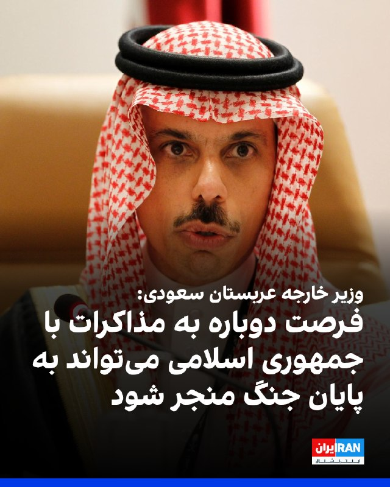

فیصل بن فرحان، وزیر خارجه عربستان سعودی، نوشت ریاض از تصمیم رییس‌جمهوری آمریکا برای دادن فرصت دوباره به مذاکرات با جمهوری اسلامی به‌منظور دستیابی به توافقی که به پایان جنگ و بازگشت امنیت و آزادی کشتیرانی در تنگه هرمز به وضعیت پیش از ۹ اسفند ۱۴۰۴ منجر شود، قدردانی می‌کند.

او همچنین از تلاش‌های مستمر پاکستان برای میانجی‌گری در این زمینه تقدیر کرد و در شبکه ایکس نوشت عربستان سعودی امیدوار است جمهوری اسلامی از این فرصت برای جلوگیری از «پیامدهای خطرناک تشدید تنش» استفاده کرده و فورا به تلاش‌ها برای پیشبرد مذاکرات پاسخ دهد.

وزیر خارجه عربستان سعودی افزود هدف از این تلاش‌ها، دستیابی به توافقی جامع است که صلح پایدار در منطقه و جهان را محقق کند.
@VahidOOnLine

📡 @VahidOnline

## VahidOnline — post 75578

  <a href="telegram/content/VahidOnline_75578_1779306038.mp4" target="_blank">🎬 Download video</a>

محمدباقر قالیباف، رئیس مجلس ایران گفت که «تحرکات آشکار و پنهان دشمن نشان می‌دهد که به موازات فشارهای اقتصادی و سیاسی از اهداف نظامی خود دست نکشیده و به دنبال دور جدیدی از جنگ و ماجراجویی جدید است.»

او این اظهارات را در سومین پیام صوتی خود مطرح کرد و با اشاره به گذشت یک ماه از آتش‌بس، فضای سیاسی پیرامون دونالد ترامپ، رئیس‌جمهور ایالات متحده را از عوامل تأثیرگذار بر تصمیم‌گیری‌های او در قبال ایران دانست.

قالیباف در این پیام، با تاکید بر تداوم فشارهای اقتصادی و سیاسی، گفت که هدف این فشارها واداشتن ایران به عقب‌نشینی است، اما به ادعای او ساختار نظامی کشور برای بازسازی توان عملیاتی خود از فرصت این دوره یک‌ماهه آتش‌بس استفاده کرده است.

در بخش دیگری از این پیام صوتی ۱۲ دقیقه‌ای، رئیس مجلس ایران با انتقاد از برخی جریان‌های سیاسی، آنان را به «نادیده گرفتن شرایط امنیتی» و تمرکز بیش از حد بر نقد دولت متهم کرد و گفت که طرح این انتقادات می‌تواند به انسجام ملی آسیب بزند.
@VahidHeadline

📡 @VahidOnline

## VahidOnline — post 75577

  <a href="telegram/content/VahidOnline_75577_1779306039.mp4" target="_blank">🎬 Download video</a>

دونالد ترامپ، رئیس‌جمهوری آمریکا، پیش از ترک واشنگتن به مقصد کانتیکت، در گفتگو با خبرنگاران در فرودگاه به تشریح وضعیت تقابل با ایران و گزینه‌های روی میز پرداخت.

او با اشاره به وضعیت داخلی ایران مدعی شد: «در حال حاضر خشم زیادی در ایران وجود دارد، زیرا مردم در شرایط بسیار بدی زندگی می‌کنند. ناآرامی و تلاطمی در آنجا جریان دارد که قبلا نظیرش را ندیده‌ایم؛ باید دید چه پیش می‌آید.»

ترامپ در پاسخ به سوال خبرنگار درباره احتمال انجام یک «توافق محدود برای تمدید آتش‌بس» گفت: «ما این شانس را امتحان می‌کنیم. من عجله‌ای ندارم؛ هرچند موضوع انتخابات میان‌دوره‌ای مطرح است، اما در حالت ایده‌آل ترجیح می‌دهم به جای افراد زیاد، آدم‌های کمتری کشته شوند.»

رئیس‌جمهوری آمریکا همچنین با ابراز تردید درباره نیت مقامات تهران گفت: «من متعجبم که آیا آن‌ها واقعا خیر و صلاح مردم خود را می‌خواهند یا خیر؛ رفتار آن‌ها نشان می‌دهد که به فکر مردم نیستند، در حالی که باید خیر و صلاح کل منطقه را در نظر بگیرند.»
@VahidOOnLine

📡 @VahidOnline

## VahidOnline — post 75574

  <a href="telegram/content/VahidOnline_75574_1779306039.mp4" target="_blank">🎬 Download video</a>

اسماعیل بقائی، سخنگوی وزارت امور خارجه جمهوری اسلامی، روز چهارشنبه ۳۰ اردیبهشت‌ماه درباره گمانه‌زنی‌ها راجع به سفر عباس عراقچی به نیویورک گفت:  «وزیر خارجه ایران برای شرکت در نشست شورای امنیت سازمان ملل درباره صلح و امنیت بین‌المللی دعوت شده، اما حضور او هنوز قطعی نیست.»

به گفته سخنگوی وزارت امور خارجه جمهوری اسلامی «این نشست به ریاست دوره‌ای چین در شورای امنیت، روز پنجم خرداد برگزار خواهد شد، اما با توجه به برنامه کاری فشرده وزیر امور خارجه»، تصمیم نهایی درباره سفر هنوز گرفته نشده است.»

این اظهارات پس از آن مطرح شد که علی خضریان، عضو کمیسیون امنیت ملی مجلس، در یک برنامه تلویزیونی نسبت به احتمال سفر عراقچی به نیویورک برای مذاکره درباره تنگه هرمز انتقاد کرده بود.
@VahidOOnLine

📡 @VahidOnline

## VahidOnline — post 75572

خبرگزاری قوه‌قضائیه گزارش داد رشید مظاهری، دروازه‌بان پیشین تیم ملی فوتبال و استقلال تهران، «هنگام تلاش برای خروج غیرقانونی از مرزهای غربی ایران بازداشت شده است.»
میزان در این گزارش رشید مظاهری را متهم کرده که «قصد داشته با تغییر چهره و پرداخت رشوه به ماموران مرزبانی از کشور خارج شود.»

قوه قضائیه به زمان بازداشت این بازیکن پیشین تیم ملی فوتبال ایران اشاره نکرده است.

رشید مظاهری پس از کشتار معترضان در ۱۸ و ۱۹ دی، با انتشار ویدیویی در پنجم اسفند، علی خامنه‌ای را مسئول کشته‌شدن معترضان معرفی کرده بود. پس از انتشار آن ویدیو، تا مدت‌ها خبری از وضعیت او منتشر نشده بود.
خبرگزاری میزان گزارش کرده که مظاهری در «بند عمومی زندان» به سر می‌برد و قرار است به اتهام‌های «پرداخت رشوه به مامور دولت»، «فعالیت تبلیغی برخلاف امنیت ملی در شرایط جنگی» و «اقدام به عبور غیرمجاز از مرز» محاکمه شود.
@VahidOOnLine

📡 @VahidOnline

## VahidOnline — post 75571

  

در میانه اختلال در مسیرهای رسمی تجارت و فشار بر زنجیره تأمین صنایع، سازمان توسعه تجارت ایران واردات برخی مواد اولیه پتروشیمی و پلیمری را از طریق رویه‌های کولبری و ملوانی مجاز اعلام کرد.

این تصمیم نشان می‌دهد بحران تأمین مواد اولیه در صنایع پایین‌دستی به مرحله‌ای رسیده که حکومت برای جبران کمبود، به مسیرهای مرزی و غیرمتعارف متوسل شده است.

اما این تصمیم پرسش‌های جدی ایجاد می‌کند. مواد اولیه پلیمری و پتروشیمی کالای مصرفی ساده نیستند؛ واردات آنها نیازمند حجم بالا، کنترل کیفیت، استاندارد، ردیابی منشأ، بیمه، حمل‌ونقل تخصصی و تسویه تجاری منظم است.
@VahidHeadline

📡 @VahidOnline

## VahidOnline — post 75570

  

سپاه پاسداران با انتشار بیانیه‌ای تهدید کرده که در صورت آغاز دوباره جنگ آمریکا و اسرائیل علیه ایران، جنگ «به فراتر از منطقه کشیده خواهد شد.»

در این بیانیه با اشاره به تهدیدهای دونالد ترامپ و مقام‌های اسرائیل برای حمله مجدد به ایران آمده: «اگر تجاوز به ایران تکرار شود جنگ منطقه‌ای که وعده داده شده بود، این بار به فراتر از منطقه کشیده خواهد شد و ضربات کوبنده ما در جاهایی که تصور آن را ندارید شما را به خاک سیاه خواهد نشاند.»

عباس عراقچی، وزیر خارجه ایران هم در واکنش به اظهارات تهدیدآمیز دونالد ترامپ، رئیس‌جمهور آمریکا، درباره احتمال از سرگیری حمله نظامی به ایران، در شبکه ایکس نوشته «با درس‌هایی که آموخته‌ایم و دانشی که به دست آورده‌ایم، مطمئن باشید بازگشت به میدان جنگ با شگفتی‌های بسیار بیشتری همراه خواهد بود.»
@VahidHeadline

📡 @VahidOnline

## VahidOnline — post 75569

  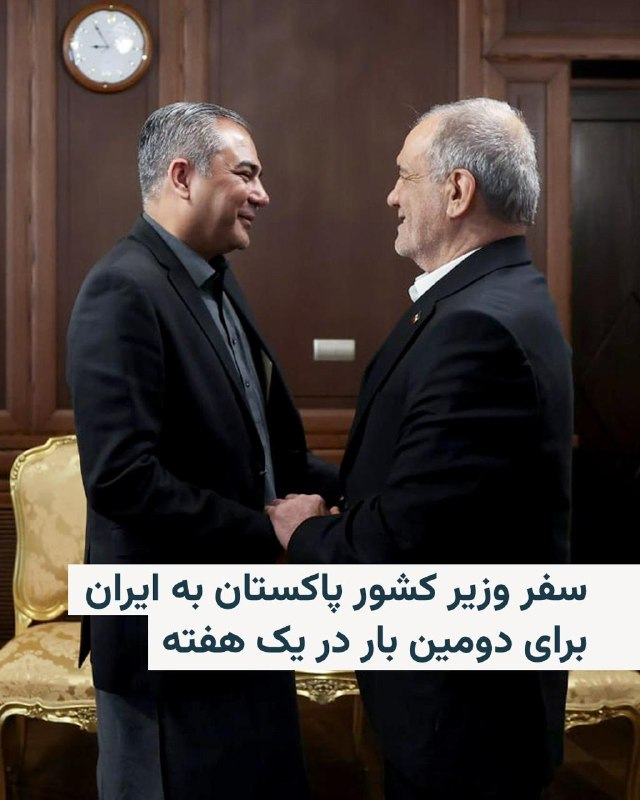

رسانه‌های ایران روز چهارشنبه ۳۰ اردیبهشت خبر دادند که محسن نقوی، وزیر کشور پاکستان، وارد تهران شده است. او روز ۲۶ اردیبهشت نیز به ایران سفر کرده بود.

خبرگزاری ایسنا اعلام کرده که برنامه و اهداف سفر این مقام ارشد پاکستانی در ایران «مشخص نیست». خبرگزاری تسنیم نیز گزارش داده که آقای نقوی در بدو ورود به تهران با وزیر کشور ایران دیدار کرده است.
@VahidHeadline

📡 @VahidOnline

## VahidOnline — post 75568

  

رسانه‌ها در ایران از اجرای حکم اعدام قاتل الهه حسین‌نژاد، که جسد او اوایل خرداد سال گذشته در بیابان‌های اطراف تهران پیدا شد، خبر می‌دهند.

عصر چهارم خرداد ۱۴۰۴ الهه حسین‌نژاد ۲۴ ساله از سالن زیبایی که در آنجا مشغول به کار بود، بیرون آمد تا به خانه‌اش در اسلامشهر برود، اما ناپدید شد و وقتی خانواده‌اش اعلام شکایت کردند بررسی‌های تیم جنایی نشان می‌داد الهه از میدان آزادی سوار یک خودروی عبوری شده است.

جست و جوها برای یافتن الهه سرانجام پس از ۱۱ روز نتیجه داد و با دستگیری راننده خودرو به نام بهمن ۳۷ ساله و اعتراف به قتل الهه، جسد او در بیابان‌های اطراف تهران پیدا شد. متهم نیز پس از محاکمه به اعدام محکوم شد.

این قتل جنجال زیادی درباره امنیت زنان در ایران به پا کرد و تا مدت‌ها رسانه‌ها درباره آن مطالب مختلفی منتشر می‌کردند.

@VahidHeadline

📡 @VahidOnline

## VahidOnline — post 75567

  

رسانه‌های حقوق بشری گزارش دادند دادگاه کیفری تهران پس از رسیدگی دوباره به پرونده شهرک اکباتان، سه معترض بازداشت‌شده در این پرونده را به دیه و پنج سال حبس محکوم و سه معترض دیگر را از اتهام مشارکت در «قتل عمد» تبرئه کرد. حکم اعدام این شش تن پیش‌تر در دیوان عالی کشور نقض شده بود.

سایت هرانا چهارشنبه ۳۰ اردیبهشت گزارش داد شعبه ۱۳ دادگاه کیفری یک استان تهران، میلاد آرمون، علیرضا کفایی و امیرمحمد خوش‌اقبال را بابت اتهام «مشارکت در قتل عمد» آرمان علی‌وردی، از نیروهای بسیج، محکوم کرد. هر یک از آن‌ها به پرداخت سهم مساوی از دیه کامل یک انسان و پنج سال حبس محکوم شده‌اند.

طبق گزارش هرانا، نوید نجاران، حسین نعمتی و علیرضا برمرزپورناک، سه متهم دیگر این پرونده، به دلیل «فقدان مدارک دال بر وارد کردن ضربه به ناحیه مشخصی از بدن علی‌وردی» از اتهام مشارکت در قتل عمد تبرئه شدند.

این حکم ۱۵ بهمن سال گذشته صادر و سه‌شنبه ۲۹ اردیبهشت به وکلای این افراد ابلاغ شده است.

این شش شهروند معترض در آبان ۱۴۰۳ از سوی همین شعبه به اعدام محکوم شده بودند.
@VahidOOnLine

📡 @VahidOnline

## kianmeli1 — post 87522

  <a href="telegram/content/kianmeli1_87522_1779306042.mp4" target="_blank">🎬 Download video</a>

🔴گزارشگر: آیا شما و نتانیاهو در مورد ایران هم‌نظر هستید؟

🔴ترامپ: بله
https://t.me/kianmeli1

## kianmeli1 — post 87521

  <a href="telegram/content/kianmeli1_87521_1779306043.mp4" target="_blank">🎬 Download video</a>

‏🔴شی جی پینگ پوتین را دوست عزیز خطاب کرد
‏پوتین هم یه ضرب المثل چینی گفت
‏یک روز همدیگر رو ندیدیم ، انگار سه پاییز گذشته
https://t.me/kianmeli1

## kianmeli1 — post 87520

  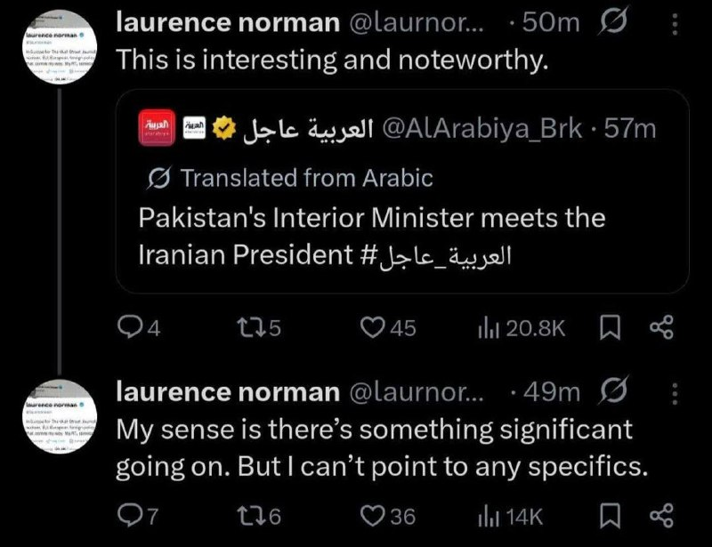

🔴لارنس نورمن سردبیر وال استریت ژورنال مدعی شد که اتفاقی در حال رخ دادن است اما نمی تواند به چیز خاصی اشاره کند (یعنی به نظر او توافق در راه است)
https://t.me/kianmeli1

## kianmeli1 — post 87519

  

🔴واکنش رئیس کمیسیون امنیت ملی در پاسخ به حرفای به ترامپ:

ایران شگفتی‌ های زیادی برای آمریکا دارد؛ برای هر سناریو آماده هستیم
https://t.me/kianmeli1

## kianmeli1 — post 87518

  <a href="telegram/content/kianmeli1_87518_1779306046.mp4" target="_blank">🎬 Download video</a>

🔴یه مقام ارشد اسرائیلی : اطرافیان ترامپ دارن روش فشار میارن که به توافق برسه

نتانیاهو هم باهاش درباره این موضوع صحبت کرده، و از نظر ترامپ گزینه حمله وجود داره که فقط بحث زمانشه
https://t.me/kianmeli1

## kianmeli1 — post 87517

  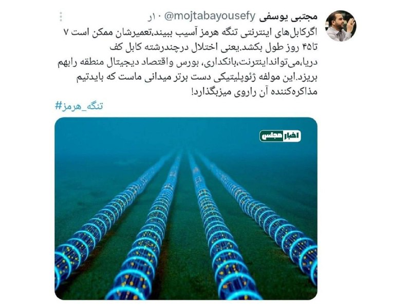

🔴تهدید قطع کابل‌های فیبر نوری از سوی نماینده مجلس/ بایدتیم مذاکره‌کننده آن راروی میزبگذارد!!!

مجتبی یوسفی، عضو هیات رئیسه مجلس: اگر کابل‌های اینترنتی تنگه هرمز آسیب ببیند، تعمیرشان ممکن است ۷ تا ۴۵ روز طول بکشد، یعنی اختلال درچندرشته کابل کف دریا،می‌توانداینترنت،بانکداری، بورس واقتصاد دیجیتال منطقه رابهم بریزد

این مولفه ژئوپلیتیکی دست برتر میدانی ماست که بایدتیم مذاکره‌کننده آن راروی میزبگذارد!
https://t.me/kianmeli1

## kianmeli1 — post 87516

  

🔴حکم اعدام زندانی سیاسی منوچهر فلاح که در زندان لاکان رشت محبوس است، دوباره تأیید شد!
صدایش باشیم
منوچهر پدر یک دختر خردسال است
https://t.me/kianmeli1

## kianmeli1 — post 87515

🔴محمدباقر قالیباف، رئیس مجلس ایران گفت که «تحرکات آشکار و پنهان دشمن نشان می‌دهد که به موازات فشارهای اقتصادی و سیاسی از اهداف نظامی خود دست نکشیده و به دنبال دور جدیدی از جنگ و ماجراجویی جدید است.»

او این اظهارات را در سومین پیام صوتی خود مطرح کرد و با اشاره به گذشت یک ماه از آتش‌بس، فضای سیاسی پیرامون دونالد ترامپ، رئیس‌جمهور ایالات متحده را از عوامل تأثیرگذار بر تصمیم‌گیری‌های او در قبال ایران دانست.

قالیباف در این پیام، با تاکید بر تداوم فشارهای اقتصادی و سیاسی، گفت که هدف این فشارها واداشتن ایران به عقب‌نشینی است، اما به ادعای او ساختار نظامی کشور برای بازسازی توان عملیاتی خود از فرصت این دوره یک‌ماهه آتش‌بس استفاده کرده است.

در بخش دیگری از این پیام صوتی ۱۲ دقیقه‌ای، رئیس مجلس ایران با انتقاد از برخی جریان‌های سیاسی، آنان را به «نادیده گرفتن شرایط امنیتی» و تمرکز بیش از حد بر نقد دولت متهم کرد و گفت که طرح این انتقادات می‌تواند به انسجام ملی آسیب بزند.
https://t.me/kianmeli1

## IranIntlTV — post 338142

  <a href="https://t.me/IranintlTV/338142" target="_blank">📎 Download file</a>

🎧نسخه صوتی چشم‌انداز: حقیقت یا دروغ؟ طرح آمریکا برای حکومت احمدی‌نژاد بر ایران؟!
@iranintlTV

## IranIntlTV — post 338141

  <a href="telegram/content/IranIntlTV_338141_1779306049.mp4" target="_blank">🎬 Download video</a>

پس از آنکه دونالد ترامپ گفت به درخواست کشورهای منطقه حمله به ایران را به تاخیر انداخته، برخی منابع منطقه‌ای به اورشلیم‌پست گفتند دلیل این درخواست، هراس از انتقام‌گیری جمهوری اسلامی بوده است.

گفت‌وگو با عطا محامد، کارشناس روابط بین‌الملل
@iranintltv

## IranIntlTV — post 338140

🗣روایت شما از زندگی در آتش‌بس- چهارشنبه ۳۰ اردیبهشت ۱۴۰۵

🔹چند روز پیش پیامکی برای من ارسال شد مبنی بر اینکه ثبت‌نام شما در جانفدا با موفقیت انجام شد و برای تکمیل مشخصات به لینک ارسال‌شده مراجعه کنید. به شرافتم قسم من اصلاً ثبت‌نام نکرده بودم.

🔹اوضاع طوریه که تورم تو ریزجزئیات زندگی هم تأثیر می‌ذاره. دیروز (۲۰ اردیبهشت) با پدر و مادرم رفتیم خرید و قیمت یه دونه نمک‌پاش ۱۱۰ هزار تومن بود.

🔹من آلمان زندگی می‌کنم. امروز (۳۰ اردیبهشت) برای خط ایرانم پیام اومد که با درخواست من برای اینترنت پرو موافقت شده، در حالی که من اصلاً همچین درخواستی ندادم. این‌ها خودشون اینترنت رو روی مردم بستن، حالا هم دارن با همین کاسبی می‌کنن و جیب خالی مردم رو خالی‌تر می‌کنن.

🔹از رشت، دیدن اینکه صادراتی‌های مزدور این حکومت جانی تو شبکه‌های خارجی فعال شدن و حرف مردم ایران رو تحریف می‌کنن، در حالی که ما یک گیگ اینترنت می‌خریم تا صدامون برسه که داریم روزبه‌روز فقیر و مفلوک‌تر می‌شیم و چاره‌ای جز تموم کردن این نفرین ۴۸ ساله نداریم.

🔹توی استان ایست بازرسی می‌ذارن، همه با تفنگ و ماسک، فقط چشم‌هاشون معلومه. به همه گیر می‌دن، پلاک همه رو می‌نویسن. شرایط واقعاً سخته، مرغ شده کیلویی ۴۰۰ خورده‌ای.

🔹از تهران، این‌قدر گرانی زیاد شده، هر روز شیر گرون می‌شه. با کالابرگ فقط تونستم یک کیلو گوشت چرخ‌کرده بخرم با یه بسته مرغ.

🔹دلیل اینکه این حکومت نمی‌ره اینه که ملت هم‌دست نیست، هم‌دم نیست. وقتی نت ملی هست، هر گیگ رو ۲۵۰ تا ۴۰۰ می‌فروشن، در حالی که قیمت یک گیگ ۵۰ هست یا رایگانه. چرا این‌طور می‌کنین؟

🔹از مشهد پیام می‌دم، پمپ‌بنزین‌ها خیلی شلوغه، به موتوری‌ها کارت آزاد نمی‌دن. اگه بخوای بیشتر از دوبار از کارت سوخت استفاده کنی باید ۱۰۰ تومن بیشتر بدی.

🔹از رشت بعد از ۸۲ روز وصل شدم. یه کنکوری‌ام که همه‌چیزش رو هواست. امتحانات خرداد حضوری شده. وضعیت اقتصادی کل مردم هم واقعاً داغونه، جوری که قیمت‌ها روزانه بالا می‌ره. جاویدشاه.

🔹از یه شهرستان کوچک پیام می‌دم، پمپ‌بنزین‌ها شلوغن، همه‌چی گرونه، زندگیمون سخت شده، تروخدا به دادمون برسید. جاویدشاه پاینده ایران.

## IranIntlTV — post 338139

  <a href="telegram/content/IranIntlTV_338139_1779306050.mp4" target="_blank">🎬 Download video</a>

حقیقت یا دروغ؟ طرح آمریکا برای حکومت احمدی‌نژاد بر ایران؟!

چشم‌انداز با مهدی مهدوی‌آزاد

نسخه کامل این برنامه در یوتیوب:
https://youtu.be/cfVdKzc7RL8
@iranintltv

## IranIntlTV — post 338138

  <a href="https://t.me/IranintlTV/338138" target="_blank">📎 Download file</a>

🎧نسخه صوتی تیتراول با نیوشا صارمی: ترامپ: یا امضا می‌کنید یا ما کار را تمام می‌کنیم؛ قالیباف هشدار جنگ داد
@iranintlTV

## IranIntlTV — post 338137

  

دونالد ترامپ درباره ایران گفت: «ما باید پاسخ درست را دریافت کنیم.»

او افزود آمریکا در حال مذاکره با «افراد منطقی» در ایران است و چند روز در انتظار پاسخ آن‌ها خواهد ماند.

ترامپ همچنین تاکید کرد تا زمانی که توافق حاصل نشود، هیچ‌گونه معافیتی اعمال نخواهد شد.
https://iranintl.com/202605204860

## IranIntlTV — post 338136

  

مسعود پزشکیان در شبکه ایکس نوشت: «ایران همواره به تعهدات خود پایبند بوده و همه راه‌ها را برای جلوگیری از جنگ آزموده است؛ از سوی ما همه مسیرها همچنان باز است. وادار کردن ایران به تسلیم از طریق اجبار چیزی جز یک توهم نیست. احترام متقابل در دیپلماسی بسیار عاقلانه‌تر، امن‌تر و پایدارتر از جنگ است.»
https://iranintl.com/202605200670

## IranIntlTV — post 338135

  <a href="telegram/content/IranIntlTV_338135_1779306053.mp4" target="_blank">🎬 Download video</a>

مهدی مهدوی‌آزاد در برنامه «چشم‌انداز» گفت: «یکی از نزدیکان سابق محمود احمدی‌نژاد در واکنش به گزارش نیویورک‌تایمز گفته او نه مخفی شده و نه تحت فشار است و گزارش‌هایی را که می‌گویند احمدی‌نژاد در حصر خانگی یا بازداشت است، رد کرده است.»

او افزود: «بخش مهم‌تر این اظهارات آن بود که این گزارش‌ها تلاشی از سوی حسن روحانی، محمدجواد ظریف و دموکرات‌های آمریکا برای انتقام گرفتن از دونالد ترامپ توصیف شد.»
@iranintltv

## IranIntlTV — post 338133

  <a href="telegram/content/IranIntlTV_338133_1779306055.mp4" target="_blank">🎬 Download video</a>

۲۴ با فرداد فرحزاد
@iranintltv

## IranIntlTV — post 338132

یک شهروند در پیامی به ایران اینترنشنال از افزایش کالاهای خوراکی روایت کرده و می‌گوید قیمت یک پفک به ۱۸۰ هزار تومان رسیده است. پیام او با هوش مصنوعی خوانده شده است.

Pofak-V.mp4

## IranIntlTV — post 338131

  

اسماعیل بقایی، سخنگوی وزارت خارجه جمهوری اسلامی، در واکنش به سخنان دونالد ترامپ گفت اولتیماتوم‌ دادن به جمهوری اسلامی «مضحک» است و لفاظی‌ها و تهدیدهای خارجی تاثیری نخواهد داشت. او تاکید کرد جمهوری اسلامی بدون توجه به این اظهارات، منافع خود را دنبال می‌کند.

بقایی آزادسازی اموال بلوکه‌شده را یکی از مطالبات مشخص تهران دانست و افزود در این مرحله تمرکز بر خاتمه جنگ در همه جبهه‌ها، از جمله لبنان است. او هشدار داد در صورت ادامه «زیاده‌خواهی» طرف مقابل، توافقی حاصل نخواهد شد.

سخنگوی وزارت خارجه همچنین گفت تبادل پیام‌ها از طریق وابسته پاکستانی در جریان است و دیدگاه‌های آمریکا دریافت و در حال بررسی است؛ حضور وزیر کشور پاکستان نیز برای تسهیل این روند انجام شده است.
https://iranintl.com/202605204064

## IranIntlTV — post 338130

  <a href="telegram/content/IranIntlTV_338130_1779306057.mp4" target="_blank">🎬 Download video</a>

جاویدنام عارف جعفرزاده در جشن قهرمانی آرسنال در کنار تیم محبوبش بود.
جاویدنام عارف جعفرزاده، ۳۴ ساله و اهل رشت، شامگاه ۱۸ دی ۱۴۰۴ در جریان اعتراضات مردمی هدف شلیک مستقیم نیروهای جمهوری اسلامی قرار گرفت و جان باخت. او پس از فراخوان شاهزاده رضا پهلوی، در حالی که لباس تیم آرسنال را بر تن داشت به خیابان رفت. کشته شدن این هوادار آرسنال در فضای هواداری این باشگاه در انگلستان بازتاب گسترده‌ای داشت.

آیدین مقیمی گزارش می‌دهد.
@iranintltv

## IranIntlTV — post 338129

  

اکسیوس گزارش داد ترامپ و نتانیاهو سه‌شنبه درباره تلاش تازه برای دستیابی به توافق با ایران گفت‌وگو کردند. به گفته یک منبع آمریکایی، ترامپ به نتانیاهو اطلاع داده میانجی‌ها در حال تدوین «تفاهم اولیه» برای پایان رسمی جنگ و آغاز دوره‌ای ۳۰ روزه مذاکرات درباره موضوعاتی از جمله برنامه هسته‌ای ایران و بازگشایی تنگه هرمز هستند.
به نوشته اکسیوس، دو منبع اسرائیلی از اختلاف نظر دو رهبر درباره مسیر پیش رو خبر دادند و یک منبع آمریکایی گفت پس از تماس، «موهای بی‌بی آتش گرفته بود».
این گزارش می‌افزاید پیش‌نویس جداگانه‌ای از سوی قطر وجود ندارد و دو مقام عرب و یک منبع اسرائیلی گفته‌اند قطر پیش‌نویس جدیدی را به تهران و واشینگتن ارائه کرده، اما هنوز مشخص نیست ایران با آن موافقت کند. همچنین به گفته یک مقام عرب، هیأتی قطری برای گفت‌وگو درباره نسخه جدید به تهران سفر کرده است.

https://iranintl.com/202605208847

## IranIntlTV — post 338128

  <a href="telegram/content/IranIntlTV_338128_1779306058.mp4" target="_blank">🎬 Download video</a>

ویدیوی رسیده به ایران اینترنشنال نشان می‌دهد شهروندان پوستری را در کرج روی دیوار نصب کرده‌اند که با اعتراض به سیاست جنگ‌طلبانه جمهوری اسلامی افزوده تنها جنگ مردم، جنگ برای براندازی رژیم است.

## IranIntlTV — post 338127

  <a href="telegram/content/IranIntlTV_338127_1779306061.mp4" target="_blank">🎬 Download video</a>

انستیتو پاستور، نهادی که یک قرن پیش برای نجات جان ایرانیان از چنگال بیماری و قحطی متولد شد، چطور تبدیل به یکی از اهداف آمریکا و اسرائیل در جنگ اخیر شد؟ از تحقیقات پیشرفته روی باکتری سیاه‌زخم تا تلاش‌های مخفیانه برای خرید تجهیزات دوگانه در اروپا؛ جمهوری اسلامی چطور یک مرکز پزشکی را به منطقه خاکستری و امنیتی تبدیل کرد؟
انستیتو پاستور زیر ذره‌بین تیتراول
@iranintltv

## IranIntlTV — post 338126

  <a href="telegram/content/IranIntlTV_338126_1779306062.mp4" target="_blank">🎬 Download video</a>

محمدباقر قالیباف، رییس هیات مذاکره‌‌کننده جمهوری اسلامی گفت فعالیت‌های آمریکا و اسرائیل نشان می‌دهد این دو کشور قصد دارند دور جدیدی از جنگ را شروع کنند. سپاه پاسداران نیز تهدید کرد در صورت حمله به ایران، جنگ محدود به منطقه نمی‌ماند.

گفت‌وگو با مصطفی دانشگر, تحلیل‌گر سیاسی
@iranintltv

## IranIntlTV — post 338124

  

فرماندهی مرکزی آمریکا، سنتکام، اعلام کرد نیروهای تفنگدار دریایی آمریکا از یگان اعزامی ۳۱، چهارشنبه ۳۰ اردیبهشت در دریای عمان سوار نفتکش تجاری «سلستیال سی» با پرچم جمهوری اسلامی شدند.

به نوشته سنتکام، این نفتکش مظنون بود که با حرکت به سوی یکی از بنادر ایران، محاصره دریایی آمریکا را نقض کند. نیروهای آمریکایی پس از بازرسی و دستور به خدمه برای تغییر مسیر، کشتی را آزاد کردند.

سنتکام افزود نیروهای آمریکا به اجرای کامل این محاصره ادامه می‌دهند و تاکنون ۹۱ کشتی تجاری را برای اطمینان از رعایت آن، تغییر مسیر داده‌اند.
https://iranintl.com/202605202458

## IranIntlTV — post 338123

🔻ترامپ: مذاکرات با تهران در مراحل نهایی است، توافق نکنند حمله می‌کنیم

دونالد ترامپ، رییس‌جمهوری آمریکا، چهارشنبه ۳۰ اردیبهشت گفت مذاکرات با جمهوری اسلامی در مراحل نهایی قرار دارد اما هم‌زمان هشدار داد که در صورت شکست مذاکرات، حملات بیشتری علیه جمهوری اسلامی انجام خواهد شد. این اظهارات هم‌زمان با سفر وزیر کشور پاکستان به تهران مطرح شد.

شش هفته پس از آنکه ترامپ عملیات «خشم حماسی» را برای برقراری آتش‌بس متوقف کرد، تاکنون پیشرفت چندانی در مذاکرات برای پایان دادن به جنگ دیده نشده است.

ترامپ دوشنبه گفت که تا آستانه صدور دستور حملات بیشتر پیش رفته، اما به درخواست رهبران عربستان سعودی، قطر و امارات متحده عربی برای دادن زمان بیشتر به مذاکرات، از آن خودداری کرده است.

فیصل بن فرحان، وزیر امور خارجه عربستان سعودی، چهارشنبه در پستی در شبکه اجتماعی ایکس نوشت ریاض از تصمیم رییس‌جمهوری آمریکا برای دادن فرصت دوباره به مذاکرات با جمهوری اسلامی به‌منظور دستیابی به توافقی که به پایان جنگ و بازگشت امنیت و آزادی کشتیرانی در تنگه هرمز به وضعیت پیش از ۹ اسفند ۱۴۰۴ منجر شود، قدردانی می‌کند.

او همچنین از تلاش‌های مستمر پاکستان برای میانجی‌گری در این زمینه تقدیر کرد و در شبکه ایکس نوشت عربستان سعودی امیدوار است جمهوری اسلامی از این فرصت برای جلوگیری از «پیامدهای خطرناک تشدید تنش» استفاده کرده و فورا به تلاش‌ها برای پیشبرد مذاکرات پاسخ دهد.

وزیر امور خارجه عربستان سعودی افزود هدف از این تلاش‌ها، دستیابی به توافقی جامع است که صلح پایدار در منطقه و جهان را محقق کند.

تشدید فعالیت‌های میانجیگرانه پاکستان

این اظهارات هم‌زمان با سفر محسن نقوی، وزیر کشور پاکستان به تهران صورت گرفته است. او در جریان این سفر چهارشنبه با محمدباقر قالیباف، رییس مجلس شورای اسلامی و رییس هیات مذاکره‌کننده جمهوری اسلامی با آمریکا و نیز احمد وحیدی، فرمانده کل سپاه پاسداران، دیدار و گفت‌وگو کرد.

در پی این سفر، برخی از رسانه‌های منطقه گزارش دادند که کار بر روی نهایی‌سازی متن توافق میان واشینگتن و تهران با جدیت در حال انجام است.

الحدث به‌نقل از منابع آگاه که نام آنها را اعلام نکرد، گزارش داد که دور بعدی مذاکرات پس از مراسم حج در اسلام‌آباد برگزار خواهد شد.

الحدث همچنین افزود ممکن است فرمانده کل ارتش پاکستان پنج‌شنبه ۳۱ اردیبهشت برای اعلام نهایی شدن متن توافق به ایران سفر کند.

شبکه العربیه نیز گزارش داد که ایالات متحده خواسته‌های خود در خصوص مساله هسته‌ای و امنیت ناوبری در تنگه هرمز را سختگیرانه‌تر کرده اما در عین حال بر سر چند موضوع اقتصادی و کاهش تحریم‌های اعمال‌شده علیه جمهوری اسلامی انعطاف‌هایی محدود از خود نشان داده است.

به‌گزارش العربیه ایالات متحده به پاکستان اطلاع داده است که در زمینه برنامه هسته‌ای و تنگه هرمز هیچ امتیازی نخواهد داد.

در مقابل جمهوری اسلامی نیز همچنان تضمین‌های آمریکا درباره هرگونه حمله احتمالی در آینده را ناکافی می‌داند.

🔗جزییات بیشتر را اینجا بخوانید

@iranintltv

## IranIntlTV — post 338122

یک شهروند در پیامی به ایران اینترنشنال از افزایش قیمت شدید داروهای مربوط به اختلالات روحی و روانی می‌گوید. پیام او و تصویر این ویدیو با هوش مصنوعی خوانده شده است.

## IranIntlTV — post 338121

  

🔻ایران اینترنشنال دریافته است که علیرضا نجاتی، قهرمان پیشین کشتی، پس از ۱۳۰ روز بازداشت با قید وثیقه آزاد شده است. او در روز ۱۹ دی ۱۴۰۴ و در پی حمایت از انقلاب ملی ایرانیان بازداشت شد.

🔹نجاتی ۵۰ روز از دوران بازداشت خود را در سلول انفرادی بوده و در این مدت تحت شکنجه و ضرب‌وشتم قرار گرفته است.

🔹قاضی انصاری که یکی از دو حکم اعدام صالح محمدی را صادر کرده بود، مسئول رسیدگی به پرونده علیرضا نجاتی است.

🔹پیش‌تر جهان‌پهلوان رسول خادم، قهرمان پیشین کشتی المپیک، با انتشار یک استوری در اینستاگرام خواهان آزادی علیرضا نجاتی شده بود.

@iranintltvsport

## Shin_Persian — post 6117

  

نسخه جدید SNI Spoofing (زبان rust) به همراه رابط گرافیکی منتشر شد.
MacOS / Linux / Windows

دریافت:
GitHub
(آموزش فارسی هم هست)

[خیر، امکان انتشار نسخه اندروید با توجه به اینکه اغلب کاربران روت نیستن تقریبا ممکن نیست، می تونید روی کامپیوتر اجرا کنید و روی شبکه محلیتون به اشتراک بذارید]

## Shin_Persian — post 6116

  <a href="telegram/content/Shin_Persian_6116_1779306065.mp4" target="_blank">🎬 Download video</a>

U.S. Central Command ✓ @CENTCOM Wed, 20 May 2026 16:59:47 UTC Earlier today in the Gulf of Oman, U.S. Marines from the 31st Marine Expeditionary Unit boarded M/T Celestial Sea, an Iranian-flagged commercial oil tanker suspected of attempting to violate the…

## Shin_Persian — post 6115

U.S. Central Command ✓ @CENTCOM
Wed, 20 May 2026 16:59:47 UTC

Earlier today in the Gulf of Oman, U.S. Marines from the 31st Marine Expeditionary Unit boarded M/T Celestial Sea, an Iranian-flagged commercial oil tanker suspected of attempting to violate the U.S. blockade by transiting toward an Iranian port. American forces released the vessel after searching and directing the ship’s crew to alter course.

U.S. forces continue to fully enforce the blockade and have now redirected 91 commercial ships to ensure compliance.

فارسی

امروز در اوایل وقت در دریای عمان، تفنگداران دریایی ایالات متحده از واحد ۳۱ اعزامی تفنگداران دریایی، وارد نفت‌کش تجاری M/T Celestial Sea شدند؛ این کشتی با پرچم ایران مظنون به تلاش برای نقض محاصره ایالات متحده از طریق عبور به سمت یک بندر ایرانی بود. نیروهای آمریکایی پس از بازرسی و هدایت خدمه کشتی برای تغییر مسیر، شناور را آزاد کردند.

نیروهای ایالات متحده به اجرای کامل محاصره ادامه می‌دهند و تاکنون ۹۱ کشتی تجاری را برای اطمینان از انطباق با قوانین تغییر مسیر داده‌اند.

𝕏 · @shin_persian

## Shin_Persian — post 6114

  

سردار مادرجنده بی جنبه :( بلاک کرد

## Shin_Persian — post 6113

📦 mhrv-rs v1.9.33 released

• In Full Tunnel mode, fully idle sessions now use a stronger empty-keepalive backoff, and when every deployment is detected as legacy they stop sending repeated empty polls after going idle
• For mixed fleets where at least one deployment still has healthy long-poll support, the client keeps emitting empty polls so round-robin can still reach that healthy peer and remote→client data doe…

Files (Android APKs, Windows, macOS, Linux, OpenWRT) on the files channel:

👉 v1.9.33 — all files with SHA-256

Channel:
https://t.me/mhrv_rs
or: https://t.me/+R1OyoHX2boA1ZDgx

#v1933

## Shin_Persian — post 6112

↩️ Quoted tweet: العربية عاجل ✓ @AlArabiya_Brk Wed, 20 May 2026 11:53:13 UTC مصادر العربية: أميركا أبلغت باكستان بأنها لن تقدم تنازلات في المطالب النووية ومضيق هرمز #العربية_عاجل ↩️ Quoted tweet — see the post below for the reply. English Al Arabiya sources:…

## Shin_Persian — post 6111

↩️ Quoted tweet:
العربية عاجل ✓ @AlArabiya_Brk
Wed, 20 May 2026 11:53:13 UTC

مصادر العربية: أميركا أبلغت باكستان بأنها لن تقدم تنازلات في المطالب النووية ومضيق هرمز #العربية_عاجل

↩️ Quoted tweet — see the post below for the reply.

English

Al Arabiya sources: The United States has informed Pakistan that it will not make concessions regarding nuclear demands and the Strait of Hormuz. #AlArabiya_Breaking

𝕏 · @shin_persian

## Shin_Persian — post 6109

  <a href="telegram/content/Shin_Persian_6109_1779306068.mp4" target="_blank">🎬 Download video</a>

ارتش دفاعی اسرائیل | IDF Farsi ✓ @IDFFarsi Wed, 20 May 2026 12:09:36 UTC سخنگوی ارتش اسرائیل: در فاصله چند متری از یک مسجد: ارتش اسرائیل یک سایت تولید تسلیحات متعلق به سازمان تروریستی حزب‌الله را که در ساختمانی با کاربری درمانگاه احداث شده بود، هدف قرار…

## Shin_Persian — post 6108

ارتش دفاعی اسرائیل | IDF Farsi ✓ @IDFFarsi
Wed, 20 May 2026 12:09:36 UTC

سخنگوی ارتش اسرائیل:

در فاصله چند متری از یک مسجد: ارتش اسرائیل یک سایت تولید تسلیحات متعلق به سازمان تروریستی حزب‌الله را که در ساختمانی با کاربری درمانگاه احداث شده بود، هدف قرار داد

نیروهای ارتش اسرائیل پریروز (دوشنبه)، یک سایت تولید تسلیحات متعلق به سازمان تروریستی حزب‌الله را در منطقه صور در جنوب لبنان هدف قرار دادند.

این سایت در ساختمانی که به‌عنوان یک درمانگاه غیرنظامی مورد استفاده قرار می‌گرفت و در فاصله‌ای بسیار نزدیک از یک مسجد قرار داشت، احداث شده بود. پس از حمله، انفجارهای ثانویه در این محل شناسایی شد که نشان‌دهنده وجود تسلیحات در داخل ساختمان است.

سازمان تروریستی حزب‌الله همچنان به فعالیت در مجاورت و از درون زیرساخت‌های غیرنظامی، از جمله اماکن مذهبی و مراکز درمانی ادامه می‌دهد و از آن‌ها به‌صورت سوءاستفاده‌آمیز برای پیشبرد طرح‌های تروریستی علیه شهروندان کشور اسرائیل و نیروهای ارتش اسرائیل بهره می‌برد.

English

IDF (Israel Defense Forces) Spokesperson:

A few meters from a mosque: The IDF targeted a weapons production site belonging to the Hezbollah terrorist organization, which was established in a building used as a clinic.

The day before yesterday (Monday), IDF forces targeted a weapons production site belonging to the Hezbollah terrorist organization in the Tyre region of southern Lebanon.

This site was established in a building used as a civilian clinic, located in very close proximity to a mosque. Following the strike, secondary explosions were identified at the scene, indicating the presence of weapons inside the building.

The Hezbollah terrorist organization continues to operate adjacent to and from within civilian infrastructure, including religious sites and medical centers, exploitatively utilizing them to advance terrorist plots against citizens of the State of Israel and IDF forces.

𝕏 · @shin_persian

## Shin_Persian — post 6107

  

U.S. Central Command ✓ @CENTCOM Wed, 20 May 2026 11:52:29 UTC A U.S. Marine Corps AH-1Z Viper attack helicopter patrols near a commercial vessel transiting regional waters as American forces enforce the maritime blockade against Iran. As of May 20, U.S.…

## Shin_Persian — post 6106

U.S. Central Command ✓ @CENTCOM
Wed, 20 May 2026 11:52:29 UTC

A U.S. Marine Corps AH-1Z Viper attack helicopter patrols near a commercial vessel transiting regional waters as American forces enforce the maritime blockade against Iran. As of May 20, U.S. forces have redirected 90 ships and disabled 4 to ensure compliance.

فارسی

یک بالگرد تهاجمی AH-1Z وایپر متعلق به سپاه تفنگداران دریایی ایالات متحده (U.S. Marine Corps) در حال گشت‌زنی در نزدیکی یک کشتی تجاری است که از آب‌های منطقه عبور می‌کند، این در حالی است که نیروهای آمریکایی محاصره دریایی علیه ایران را اجرا می‌کنند. تا تاریخ ۲۰ مه، نیروهای آمریکایی برای اطمینان از رعایت قوانین، ۹۰ کشتی را تغییر مسیر داده و ۴ کشتی را از کار انداخته‌اند.

𝕏 · @shin_persian

## Shin_Persian — post 6105

📦 mhrv-rs v1.9.32 released

• Full Tunnel batch protocol now supports zstd compression
• Compression negotiation is backward compatible
• To use this in Full mode, update the app, redeploy CodeFull.gs as a new Apps Script version, and redeploy tunnel-node / the Docker image on your VPS or Cloud Run.
• Compressed batch logging is kept safer
• Thanks to @yyoyoian-pixel for the implementation and empirical testing in PR #1314.

Files (Android APKs, Windows, macOS, Linux, OpenWRT) on the files channel:

👉 v1.9.32 — all files with SHA-256

Channel:
https://t.me/mhrv_rs
or: https://t.me/+R1OyoHX2boA1ZDgx

#v1932

## ManotoTV — post 105703

  <a href="telegram/content/ManotoTV_105703_1779306070.mp4" target="_blank">🎬 Download video</a>

‌
دونالد ترامپ گفت آمریکا در آستانه تصمیم‌گیری درباره ایران قرار دارد و اگر پاسخ‌های مورد نظر واشینگتن دریافت نشود، تحولات می‌تواند «خیلی سریع» رخ دهد.

ترامپ گفت: «اگر پاسخ‌های درست را نگیریم، همه‌چیز خیلی سریع پیش خواهد رفت. ما کاملاً آماده‌ایم.»

او تأکید کرد هرگونه پاسخ از سوی جمهوری اسلامی باید «کامل و صددرصد قابل قبول» باشد و افزود در صورت دستیابی به توافق، «زمان، انرژی و جان انسان‌های زیادی» حفظ خواهد شد.

رئیس‌جمهوری آمریکا همچنین گفت ممکن است تصمیم‌گیری ظرف چند روز انجام شود، اما تأکید کرد روند تحولات می‌تواند «بسیار سریع» باشد.

ترامپ در ادامه ایران را «کشوری شکست‌خورده» توصیف کرد و گفت آمریکا اکنون با افرادی مذاکره می‌کند که به گفته او «بسیار منطقی‌تر» از مقام‌های پیشین جمهوری اسلامی هستند.

او افزود: «ما با افرادی بااستعداد و باهوش طرف هستیم و از این موضوع تحت تأثیر قرار گرفته‌ایم.»

ترامپ همچنین گفت اگر با چند روز صبر کردن بتوان از جنگ یا کشته شدن انسان‌ها جلوگیری کرد، «این کار ارزش انجام دادن دارد.»

## ManotoTV — post 105702

  <a href="telegram/content/ManotoTV_105702_1779306071.mp4" target="_blank">🎬 Download video</a>

تماسی از ایران:
«می‌گفت دیکتاتوری با بازتولید ظلم ادامه پیدا می‌کنه…
می‌گفت باید این چرخه رو شکست؛
با اعتصاب و نایستادن پای این شرایط.»

## ManotoTV — post 105701

  <a href="telegram/content/ManotoTV_105701_1779306073.mp4" target="_blank">🎬 Download video</a>

‌
دونالد ترامپ درباره مذاکرات با جمهوری اسلامی گفت آمریکا تا زمان دستیابی به توافق، هیچ‌گونه تخفیف یا امتیازی ارائه نخواهد کرد.

ترامپ همچنین گفت واشینگتن «چند روز» منتظر پاسخ تهران خواهد ماند.

رئیس جمهور آمریکا در ادامه تاکید کرد: «این موضوع به‌زودی، به هر شکلی که باشد، پایان خواهد یافت.»

او با اشاره به روند مذاکرات افزود: «ما با افراد منطقی طرف هستیم» و تأکید کرد: «باید به پاسخ درست برسیم.»

## ManotoTV — post 105700

  <a href="telegram/content/ManotoTV_105700_1779306073.mp4" target="_blank">🎬 Download video</a>

وزارت دادگستری آمریکا علیه رائول کاسترو، رئیس‌جمهوری پیشین کوبا و برادر فیدل کاسترو، اعلام جرم کرد.

بر اساس کیفرخواستی که در دادگاه فدرال میامی منتشر شده، رائول کاسترو ۹۴ ساله به همراه پنج نفر دیگر به اتهام قتل، توطئه برای کشتن شهروندان آمریکایی و انهدام هواپیما متهم شده‌اند.

این پرونده به سرنگونی دو هواپیمای متعلق به گروه «برادران نجات» در سال ۱۹۹۶ مربوط می‌شود؛ گروهی از تبعیدیان کوبایی که برای کمک به پناهجویان کوبایی فعالیت می‌کردند. در آن حادثه، چهار نفر کشته شدند.

آمریکا می‌گوید جنگنده‌های کوبایی این هواپیماها را بر فراز آب‌های بین‌المللی هدف قرار داده‌اند، اما دولت کوبا همواره مدعی بوده این هواپیماها وارد حریم هوایی این کشور شده بودند.

این اقدام که بخشی از کارزار فشار دولت ترامپ علیه حکومت کمونیستی کوباست، تنش‌ها میان واشینگتن و هاوانا را به سطح تازه‌ای رسانده است

## ManotoTV — post 105699

  <a href="telegram/content/ManotoTV_105699_1779306074.mp4" target="_blank">🎬 Download video</a>

‌
سنتکام، ستاد فرماندهی مرکزی آمریکا، با انتشار ویدیویی اعلام کرد تفنگداران دریایی آمریکا در خلیج عمان یک نفتکش تجاری با پرچم ایران را متوقف و بازرسی کرده‌اند.

به گفته سنتکام، نیروهای «واحد اعزامی سی‌ویک تفنگداران دریایی آمریکا» ساعاتی پیش سوار نفتکش «سلستیال سی» شدند؛ کشتی‌ای که به تلاش برای نقض محاصره دریایی آمریکا و حرکت به‌سوی یکی از بنادر ایران مظنون بوده است.

سنتکام اعلام کرد نیروهای آمریکایی پس از بازرسی کامل نفتکش، به خدمه دستور تغییر مسیر دادند و سپس کشتی را آزاد کردند.

در بیانیه سنتکام آمده است نیروهای آمریکا همچنان «به‌طور کامل» محاصره دریایی را اجرا می‌کنند و تاکنون مسیر ۹۱ کشتی تجاری را برای اطمینان از رعایت این محدودیت‌ها تغییر داده‌اند.

## ManotoTV — post 105698

این خالکوبی فقط یک نقش روی صورتش نیست…
زخمِ نسلی‌ست که سال‌ها درد را نفس کشید، فریاد زد، سکوت کرد، گریه کرد، شکست، ایستاد، اما فراموش نکرد.

یادِ کودکانی‌ست که جنگ و ترس را زودتر از زندگی شناختند.

او می‌خواهد مردم هر بار که به این طرح روی صورتش نگاه می‌کنند، قصه‌ی روزهایی را به یاد بیاورند که از میان آتش، ترس، درد، ناامیدی و امید عبور کردند.

اما این فقط درد نیست…
این تتو، یادآور امید و زندگی هم هست.
یادآور روزهایی که هنوز برای ساختنشان زنده‌اند.

درست است که این تتو، طرحی از «God of War» است…
اما آن را به رنگ سبز انتخاب کرده‌اند؛ به نشانه عشق، صلح، امید و زندگی.

برای اینکه حقیقت فراموش نشود،
برای اینکه نسل بعد بداند مردم از چه روزهایی عبور کردند…
و چگونه با تمام زخم‌هایشان، هنوز عاشق ایران و ایرانی ماندند.

فراموش نکنید…
وقتی انسان‌ها برای شرافت، معرفت، عشق و گذشت ارزش قائل نشوند، ارزش‌ها کم‌کم معنای خودشان را از دست می‌دهند.

اول به انسان‌ها، بعد به حیوانات و در نهایت به طبیعت و گیاهان رحم کنیم و عشق بورزیم…
شاید دنیا هم یاد بگیرد که با ما مهربان‌تر باشد.

او سوخت…
آن‌ها سوختند…

یادتان نرود…
یادمان نرود.

## ManotoTV — post 105697

  <a href="telegram/content/ManotoTV_105697_1779306075.mp4" target="_blank">🎬 Download video</a>

نیروی دریایی سپاه اعلام کرده طی ۲۴ ساعت گذشته ۲۶ کشتی از تنگه هرمز عبور کرده‌اند.
با این حال، رویترز می‌نویسد این روند که در ظاهر نشانه‌ای از باز شدن مسیر کشتیرانی است، در عمل می‌تواند نشانه‌ای از افزایش کنترل جمهوری‌اسلامی بر این آبراه راهبردی باشد.
تهران پیش‌تر اعلام کرده بود در صورت دریافت هزینه یا عوارض از کشتی‌های تجاری، امکان بازگشایی تنگه هرمز را بررسی خواهد کرد؛ آبراهی که حدود یک‌پنجم صادرات نفت جهان از آن عبور می‌کند.
بر اساس این گزارش و به نقل از ۲۰ منبع، جمهوری‌اسلامی اکنون ایست‌های بازرسی نظامی، بررسی کشتی‌ها، ترتیبات دیپلماتیک و در برخی موارد دریافت هزینه امنیتی برای عبور ایمن را در این مسیر اعمال کرده است.
رویترز همچنین می‌گوید تهران در عمل در حال ایجاد یک «سازوکار پیچیده و چندلایه» است که به کشتی‌ها اجازه عبور می‌دهد، اما تنها در صورتی که از سوی نیروهای جمهوری‌اسلامی تأیید شوند.

## ManotoTV — post 105696

  <a href="telegram/content/ManotoTV_105696_1779306076.mp4" target="_blank">🎬 Download video</a>

تیم ملی فوتبال ایران هنوز ویزای آمریکا برای جام جهانی را دریافت نکرده است.

مقام‌های ایرانی گفته‌اند بازیکنان و اعضای کادر فنی تیم ملی هنوز موفق به دریافت ویزا برای حضور در جام جهانی ۲۰۲۶ در آمریکا نشده‌اند و قرار است برای دریافت ویزا از طریق سفارت کانادا در ترکیه اقدام کنند.

تیم ملی ایران قرار است ۱۵ ژوئن در نخستین بازی خود در گروه G در لس‌آنجلس به مصاف نیوزیلند برود و سپس برابر بلژیک و مصر بازی کند.

## ManotoTV — post 105695

  <a href="telegram/content/ManotoTV_105695_1779306076.mp4" target="_blank">🎬 Download video</a>

دونالد ترامپ، رئیس‌جمهور آمریکا، در ادامه سخنرانی خود در آکادمی گارد ساحلی آمریکا در ایالت کنتیکت گفت این نیرو نقش مهمی در عملیات «خشم حماسی» داشته است. ترامپ گفته گارد ساحلی آمریکا در اجرای محاصره علیه ایران کمک کرده و نمونه‌ای از آن را توقیف یک نفتکش ایرانی تحریم‌شده در نزدیکی سواحل مالزی عنوان کرد؛ نفتکشی که به گفته او نفت را از جزیره خارک حمل می‌کرده است.
او خطاب به حضار گفت: «این سومین کشتی ایرانیِ تحریم‌شده است که گارد ساحلی از زمان آغاز درگیری‌ها درگیری واقعی در توقیف آن کمک کرده است.»
ترامپ افزود: «با ایران و احتمالا موارد بیشتری هم در راه است، مگر اینکه آن‌ها عاقل شوند.» او همچنین گفته او گفت: «همه‌چیزشان از بین رفته؛ نیروی دریایی‌شان نابود شده، نیروی هوایی‌شان از بین رفته، تقریباً همه‌چیز.»
ترامپ افزود: «تنها سوال این است که آیا می‌رویم و کار را تمام می‌کنیم یا آن‌ها قرار است یک توافق امضا کنند. باید ببینیم چه اتفاقی می‌افتد.»

## ManotoTV — post 105694

  <a href="telegram/content/ManotoTV_105694_1779306077.mp4" target="_blank">🎬 Download video</a>

اسماعیل بقائی، سخنگوی وزارت خارجه جمهوری‌اسلامی اعلام کرده روند تبادل پیام‌ها میان جمهوری‌اسلامی و آمریکا «بر اساس متن ۱۴‌بندی پیشنهادی ایران» همچنان ادامه دارد و حضور وزیر کشور پاکستان در این روند با هدف «تسهیل مبادله پیام‌ها» میان دو طرف انجام شده است. وزیر کشور پاکستان امروز برای دومین بار طی یک هفته به تهران سفر کرد. به گفته سخنگوی وزارت خارجه نظام، تمرکز تهران بر «خاتمه جنگ در تمامی جبهه‌ها از جمله لبنان»، آزادسازی پول‌های بلوکه شده ایران، و توقف «راهزنی دریایی‌» اشاره به محاصره دریایی آمریکا در تنگه هرمز است.

## ManotoTV — post 105693

  <a href="telegram/content/ManotoTV_105693_1779306077.mp4" target="_blank">🎬 Download video</a>

دونالد ترامپ، رئیس‌جمهور آمریکا، در سخنرانی خود در مراسم فارغ‌التحصیلی آکادمی گارد ساحلی آمریکا در نیو لندنِ ایالت کنتیکت، بار دیگر جمهوری‌اسلامی را درباره برنامه هسته‌ای‌اش تهدید کرد و رسانه‌ها را «اخبار جعلی» خواند.
ترامپ که پشت شیشه ضدگلوله سخنرانی می‌کرد، پس از پرداختن به مسائل داخلی آمریکا، دوباره به موضوع ایران بازگشت و گفت: «ما اجازه نخواهیم داد ایران به سلاح هسته‌ای دست پیدا کند. موضوع همین‌قدر ساده است.»
او همچنین گفت جمهوری‌اسلامی «به‌شدت» خواهان توافق است و افزود: «باید ببینیم چه اتفاقی می‌افتد.»
ترامپ با اشاره به حملات آمریکا گفت: «ما ضربات بسیار سختی به آن‌ها زدیم و شاید مجبور شویم حتی شدیدتر هم ضربه بزنیم.»

## ManotoTV — post 105692

  <a href="telegram/content/ManotoTV_105692_1779306078.mp4" target="_blank">🎬 Download video</a>

در پی تیراندازی افراد مسلح به نیروهای پلیس در یکی از محورهای شهرستان سراوان در استان سیستان و بلوچستان، یک مامور پلیس کشته شد.
بر اساس گزارش‌ها، سرنشینان مسلح یک خودروی سواری به سمت نیروهای امنیتی تیراندازی کردند که در نتیجه آن، ستوان سوم امیرحسین شهرکی جان خود را از دست داد.
پلیس اعلام کرده افراد مهاجم تحت تعقیب قرار گرفته‌اند و طرح‌های امنیتی و انتظامی در مناطق اطراف در حال اجراست.

## ManotoTV — post 105691

  <a href="telegram/content/ManotoTV_105691_1779306078.mp4" target="_blank">🎬 Download video</a>

وزیر خارجه عربستان از تصمیم ترامپ برای تعویق حمله به ایران استقبال کرد.

فیصل بن فرحان، وزیر خارجه عربستان سعودی، در پیامی در شبکه اکس نوشت کشورش از تصمیم دونالد ترامپ برای دادن زمان بیشتر به مذاکرات با تهران استقبال می‌کند و ریاض از «فرصت دادن به دیپلماسی» برای پایان جنگ و بازگرداندن امنیت و آزادی کشتیرانی در تنگه هرمز حمایت می‌کند.

بن فرحان همچنین از جمهوری اسلامی خواست «فوراً» به تلاش‌ها برای پیشبرد مذاکرات و دستیابی به توافقی جامع پاسخ دهد.

## ManotoTV — post 105690

  <a href="telegram/content/ManotoTV_105690_1779306079.mp4" target="_blank">🎬 Download video</a>

انفجار خودروی متعلق به سازمان حمل‌ونقل نیویورک در نزدیکی وال‌استریت، باعث وحشت و فرار عابران شد.

ویدیوهای منتشرشده نشان می‌دهد این خودرو پس از آتش‌گرفتن، مقابل ساختمان مرکزی «ام‌تی‌ای» در منهتن به گلوله‌ای از آتش تبدیل شد.

آتش‌نشانی نیویورک اعلام کرد این حادثه تلفاتی نداشته و علت آن در دست بررسی است.

## ManotoTV — post 105689

  <a href="telegram/content/ManotoTV_105689_1779306080.mp4" target="_blank">🎬 Download video</a>

‌
الجزیره به نقل از «منابع دیپلماتیک» گزارش داد شمار کشورهای حامی پیش‌نویس قطعنامه درباره تنگه هرمز به ۱۳۶ کشور رسیده است.

پیش‌نویس این قطعنامه از جمهوری اسلامی می‌خواهد حملات و مین‌گذاری در تنگه هرمز را متوقف کند، اما دیپلمات‌ها می‌گویند در صورت مطرح شدن برای رأی‌گیری، احتمالاً با وتوی چین و روسیه روبه‌رو خواهد شد.

چین و روسیه ماه گذشته نیز قطعنامه مشابهی را که با حمایت آمریکا ارائه شده بود، وتو کرده بودند و آن را جانبدارانه علیه جمهوری اسلامی دانستند.

## ManotoTV — post 105688

  <a href="telegram/content/ManotoTV_105688_1779306081.mp4" target="_blank">🎬 Download video</a>

فرانسه پس از انتشار ویدیویی از برخورد با فعالان ناوگان امدادی عازم غزه، سفیر اسرائیل را احضار می‌کند. ایتالیا نیز پیش‌تر اقدام مشابهی انجام داده بود.
ژان‌نوئل بارو، وزیر خارجه فرانسه، رفتار ایتامار بن‌گویر، وزیر امنیت ملی اسرائیل از جناح راست افراطی، با فعالان بین‌المللی را «غیرقابل قبول» توصیف کرد و گفت پاریس خواهان توضیح رسمی از اسرائیل است.
این واکنش‌ها پس از انتشار ویدیویی از سوی بن‌گویر مطرح شد که او را در محل نگهداری فعالان «فلوتیلا گلوبال سومود» نشان می‌دهد؛ کاروانی متشکل از ده‌ها قایق و صدها فعال از کشورهای مختلف که چند روز پیش در آب‌های بین‌المللی، حدود ۲۵۰ مایل دریایی از غزه، توسط نیروی دریایی اسرائیل متوقف شد.
اسرائیل این کاروان را «تحریک‌آمیز» و حامی حماس توصیف کرده و فعالان را به بندر اشدود منتقل کرده است.
در ویدیوی منتشرشده، بن‌گویر در حالی که پرچم اسرائیل در دست دارد، مقابل فعالان دست‌بندزده می‌گوید: «به اسرائیل خوش آمدید، ما صاحب‌خانه‌ایم» و آن‌ها را «حامی تروریسم» می‌خواند. او همچنین از بنیامین نتانیاهو خواسته این افراد «برای مدت طولانی» در زندان نگهداری شوند.
این ویدیو در چند ساعت نخست بیش از ۱.۷ میلیون بار دیده شد و موجی از واکنش‌های تند را در اسرائیل و خارج از این کشور به‌دنبال داشت.
برخی مقام‌های اسرائیلی، از جمله گیدئون ساعر، وزیر خارجه اسرائیل، رفتار بن‌گویر را آسیب‌زننده به وجهه اسرائیل دانسته‌اند. دفتر نتانیاهو نیز با دفاع از توقیف ناوگان، اعلام کرده نحوه برخورد بن‌گویر «با ارزش‌ها و هنجارهای اسرائیل همخوانی ندارد» و خواستار اخراج سریع فعالان شده است.

## ManotoTV — post 105687

  <a href="telegram/content/ManotoTV_105687_1779306082.mp4" target="_blank">🎬 Download video</a>

‌
دونالد ترامپ، رئیس‌جمهوری آمریکا، با اشاره به وضعیت داخلی ایران گفت مطمئن نیست مقام‌های جمهوری اسلامی «خیر و صلاح مردم» را بخواهند.

ترامپ گفت: «بعضی از کارهایی که با من می‌کنند نشان می‌دهد که خیر مردم را نمی‌خواهند، در حالی که باید خیر مردم را بخواهند.»

او همچنین از افزایش نارضایتی عمومی در ایران سخن گفت و افزود: «الان خشم زیادی در ایران وجود دارد، چون مردم در شرایط بسیار بدی زندگی می‌کنند.»

رئیس‌جمهوری آمریکا همچنین گفت در ایران «ناآرامی و التهاب زیادی» وجود دارد که به گفته او، مشابه آن پیش‌تر دیده نشده است.

## ManotoTV — post 105686

  <a href="telegram/content/ManotoTV_105686_1779306083.mp4" target="_blank">🎬 Download video</a>

محمدباقر قالیباف، رئیس مجلس شورای اسلامی، در آنچه رسانه‌های حکومتی «سومین فایل صوتی» توصیف کرده‌اند از جمله گفته «تحرکات آشکار و پنهان دشمن نشان می‌دهد که طرف مقابل به‌دنبال آغاز دور جدیدی از جنگ است.»

## ManotoTV — post 105685

  <a href="telegram/content/ManotoTV_105685_1779306084.mp4" target="_blank">🎬 Download video</a>

مدیرعامل شرکت ملی نفت ابوظبی، اعلام کرده است امارات متحده عربی اجرای طرح ساخت یک خط لوله جدید برای دور زدن تنگه هرمز را پیش برده و این پروژه اکنون ۵۰ درصد پیشرفت داشته است.
در حال حاضر خط لوله عملیاتی امارات، خط لوله حبشان–فجیره است که از میادین نفتی حبشان در جنوب‌غرب ابوظبی تا بندر فجیره در دریای عمان امتداد دارد.
این خط لوله در حال حاضر توان انتقال تا ۱.۸ میلیون بشکه نفت در روز را دارد. تاسیسات نفتی فجیره از زمان آغاز جنگ چندین بار هدف حملات پهپادی منتسب به ایران قرار گرفته است.
بر اساس اعلام مقامات اماراتی، خط لوله جدید قرار است ظرفیت کل صادرات نفت این کشور را تا سال آینده دو برابر کند.

## ManotoTV — post 105684

  <a href="telegram/content/ManotoTV_105684_1779306084.mp4" target="_blank">🎬 Download video</a>

دادبان پیرامون پرونده اکباتان گزارش داده شعبه ۱۳ دادگاه کیفری یک استان تهران در رای جدید خود، اعلام کرده که در این پرونده امکان صدور حکم قصاص وجود ندارد. بر اساس حکم جدید، میلاد آرمون، علیرضا کفایی و امیرمحمد خوش‌اقبال به اتهام مشارکت در قتل عمد، هر کدام به پرداخت دیه کامل به‌صورت مساوی و تحمل ۵ سال حبس محکوم شده‌اند.
در همین پرونده، علیرضا برمرزپورناک، حسین نعمتی و نوید نجاران از اتهام مشارکت در قتل عمد تبرئه شده‌اند. دادگاه دلیل این تصمیم را نبود ادله کافی درباره این موضوع عنوان کرده که ضربه مرگبار دقیقا توسط چه فردی وارد شده است.
در رای صادر شده تاکید شده که هر چند متهمان در درگیری و ضرب‌وشتم آرمان علی‌وردی، بسیجی کشته‌شده در جریان اعتراضات سراسری ۱۴۰۱ حضور داشته‌اند، اما به دلیل مشخص نبودن عامل ضربه منجر به فوت، شرایط صدور حکم قصاص فراهم نیست.
این در حالی است که پیش‌تر همین شعبه در رای متفاوت، این شش متهم را به قصاص محکوم کرده بود؛ حکمی که بعدا با نظر دیوان عالی کشور نقض و برای رسیدگی مجدد به دادگاه بدوی بازگردانده شد.

## FarsiVOA — post 218255

⚡️در حالی که برخوردهای مربوط به حجاب اجباری، پلمب کافه‌ها و فشارهای اجتماعی ادامه دارد، رسانه‌های حکومتی با با نشان دادن زنان بدون حجاب اجباری حامی حکومت، تلاش می‌کنند تصویری عادی از شرایط ایران ارائه دهند؛ همزمان بحران اینترنت، فشار معیشتی و مشکلات اقتصادی نیز ادامه دارد.
@FarsiVOA

## FarsiVOA — post 218254

🔺گزارش | از تشک کشتی تا اعدام شتابزده؛ نگاهی به پرونده صالح محمدی ۱۹ ساله

▪️صالح محمدی، کشتی‌گیر جوان و مدال‌آور ایرانی، تنها یک هفته پس از نوزدهمین سالروز تولدش و در واپسین روزهای سال ۱۴۰۴ در قم اعدام شد، اعدامی که بنا بر گزارش‌ها در ملاعام انجام گرفته است.

⬇️ بیشتر بخوانید:
https://ir.voanews.com/a/saleh-mohammadi-forced-confession-execution-protester-qom/8152088.html
@FarsiVOA

## FarsiVOA — post 218253

🔺ارتش آمریکا در گفت‌وگو با صدای آمریکا کشته شدن ۱۷۵ شبه‌نظامی اسلام‌گرا در نیجریه را تأیید کرد

▪️ارتش ایالات متحده روز چهارشنبه ۳۰ اردیبهشت کشته شدن ۱۷۵ تروریست وابسته به گروه «داعش» را در پی مجموعه‌ای از حملات علیه این گروه در شمال‌شرق نیجریه تأیید کرد.

⬇️ بیشتر بخوانید:
https://ir.voanews.com/a/africom-dagvin-anderson-isis-nigeria-terrorists-killed/8152101.html
@FarsiVOA

## FarsiVOA — post 218252

از فشار هزینه‌ درمان تا اینترنت طبقاتی؛ واکنش کاربران شبکه‌های اجتماعی

## FarsiVOA — post 218251

مهدی اصلانی در برنامه تفسیر خبر: کفگیر حکومت به ته دیگ خورده‌ است

## FarsiVOA — post 218250

  <a href="telegram/content/FarsiVOA_218250_1779306085.mp4" target="_blank">🎬 Download video</a>

مهدی عربشاهی در برنامه تفسیر خبر: جمهوری اسلامی نسلی را تربیت می‌کند که منطق مرگ را بپذیرد

## FarsiVOA — post 218249

  <a href="telegram/content/FarsiVOA_218249_1779306086.mp4" target="_blank">🎬 Download video</a>

رضا پرچیزاده در برنامه تفسیر خبر: پرزیدنت ترامپ همواره نظر مثبتی به فعالان حقوق بشر و دموکراسی‌خواه در داخل کشور داشته است

## FarsiVOA — post 218248

علی جوانمردی: از تهدید سپاە تا گزارش نیویورک تایمز دربارە محمود احمدی نژاد

## FarsiVOA — post 218247

🔺اسرائیل: کودکان همواره «گوشت دم توپ» رژیم ایران بوده‌اند

▪️وزارت امور خارجه اسرائیل با انتشار پیامی در شبکه‌های اجتماعی به سوءاستفاده رژیم جمهوری اسلامی از کودکان واکنش نشان داد.

⬇️ بیشتر بخوانید:

https://ir.voanews.com/a/iranian-regime-exploits-children/8151988.html/?nocach=1

## FarsiVOA — post 218246

در گفت‌وگو با جلال ایجادی، جامعه‌شناس، به سقوط بی‌سابقه آمار ازدواج و فرزندآوری در ایران پرداختیم، از ناکامی سیاست‌های تشویقی حکومت جمهوری اسلامی گفتیم، و بررسی کردیم چگونه پروژه‌های نمایشی مانند «عروسی‌های جانفدا» شکاف عمیق میان واقعیت اجتماعی، بی‌اعتمادی عمومی، و روایت رسمی را پنهان می‌کنند

## FarsiVOA — post 218245

🔺سنتکام: یک نفتکش با پرچم رژیم ایران را توقیف و وادار به تغییر مسیر کردیم

▪️سنتکام در یک به‌روز‌رسانی تازه درباره محاصره دریایی جمهوری اسلامی، از توقیف موقت یک نفتکش تجاری که با پرچم رژیم ایران در حرکت بود، خبر داد.

⬇️ بیشتر بخوانید:

https://ir.voanews.com/a/centcom-detains-oil-tanker-iran/8152070.html/?nocach=1

## FarsiVOA — post 218244

🔺اعتصاب غذای زوج بریتانیایی در زندان اوین؛ رژیم ایران کریگ و لیندزی فورمن را از حق تماس محروم کرده است

▪️کریگ فورمن و لیندزی فورمن، دو شهروند بریتانیایی محبوس در زندان اوین، در اعتراض به شرایط نگهداری‌ در زندان و قطع امکان برقراری تماس تلفنی با خانواده، اعتصاب غذا کرده‌اند.

⬇️ بیشتر بخوانید:

https://ir.voanews.com/a/british-couple-prison-food-strike-iran/8152013.html/?nocach=1

## FarsiVOA — post 218243

🔺روبیو به مردم کوبا: دلیل سختی‌ زندگی شما سودجویانی هستند که نفت‌تان را غارت کرده‌اند

▪️وزیر امور خارجه آمریکا روز چهارشنبه ۳۰ اردیبهشت با انتشار یک پیام ویدیویی بر حمایت ایالات متحده از مردم کوبا در دستیابی به آزادی، کرامت، و حق تعیین سرنوشت خود تأکید کرد.

⬇️ بیشتر بخوانید:

https://ir.voanews.com/a/rubio-marco-state-department-cuba-castro-oil-electricity-/8152063.html/?nocach=1

## FarsiVOA — post 218242

ناتو در آستانه نشست سوئد؛ بدون برنامه نظامی برای تنگه هرمز و نگرانی از کاهش نقش آمریکا

## FarsiVOA — post 218241

پیام صریح بغداد به گروه‌های مسلح: هیچ حمله‌ای از خاک عراق تحمل نمی‌شود

## FarsiVOA — post 218240

  <a href="telegram/content/FarsiVOA_218240_1779306087.mp4" target="_blank">🎬 Download video</a>

فرماندهی مرکزی ایالات متحده، سنتکام، از بازرسی یک نفتکش مظنون به تلاش برای نقض محاصره دریایی آمریکا با حرکت به سمت یک بندر ایرانی خبر داد.

بنا بر گزارش سنتکام، ساعاتی پیش در خلیج عمان، تفنگداران دریایی ایالات متحده، بر عرشه نفتکش تجاری «ام/تی سلستیال سی» که پرچم ایران داشت و مظنون به تلاش برای نقض محاصره دریایی علیه جمهوری اسلامی بود فرود آمدند.

نیروهای آمریکایی پس از بازرسی و دستور به خدمه کشتی برای تغییر مسیر، کشتی را آزاد کردند.

سنتکام با تاکید بر اجرای محاصره دریایی اعلام کرد تاکنون ۹۱ کشتی تجاری را مجبور به تغییر مسیر کرده‌اند.

## FarsiVOA — post 218239

گفت‌وگو با محمد قائدی، مدرس روابط بین‌الملل، درباره دوگانه جنگ و مذاکره در اظهارات مقام‌های آمریکا و جمهوری اسلامی

## FarsiVOA — post 218238

رئیس جمهوری آمریکا روز چهارشنبه ۳۰ اردیبهشت سخنران اصلی مراسم دانش‌آموختگی آکادمی گارد ساحلی در شهر نیو لاندن، ایالت کنتیکت، بود. صدای آمریکا بخشی از این سخنرانی را به صورت مستفیم و با ترجمه همزمان پژواک کیومرثی پخش کرد.

## FarsiVOA — post 218237

گفت‌وگو با خالد عزیزی،‌ سخنگوی حزب دموکرات کردستان ایران، درباره ادامه حملات جمهوری اسلامی به مواضع احزاب کُرد در عراق.

## FarsiVOA — post 218236

ایران روزگاری کشوری بود که صدای بازی کودکان در کوچه‌ها بخشی از هویت روزمره‌اش بود. اما اکنون آمارهای رسمی از کاهش شدید نرخ باروری، پیرشدن جمعیت و بسته‌شدن پنجره جمعیتی خبر می‌دهند.

## DW_Farsi — post 124942

  

🔶 بقایی: تبادل پیام با آمریکا از طریق پاکستان ادامه دارد

اسماعیل بقایی، سخنگوی وزارت خارجه ایران روز چهارشنبه ۳۰ اردیبهشت اعلام کرد تبادل پیام میان تهران و واشنگتن همچنان از طریق پاکستان ادامه دارد و این روند بر پایه طرح ۱۴ ماده‌ای ایران پیش می‌رود.

او همچنین گفت تهران در حال بررسی ایجاد سازوکاری با عمان برای تضمین امنیت پایدار در تنگه هرمز است.

بقایی گفت وزیر کشور پاکستان در تهران حضور دارد تا به تسهیل این روند کمک کند. به گفته او، تبادل پیام‌ها همچنان ادامه دارد و چارچوب آن بر اساس پیشنهاد ۱۴ ماده‌ای ایران تنظیم شده است.

سخنگوی وزارت خارجه ایران افزود ایران آماده است با همکاری دیگر کشورهای ساحلی، پروتکل‌هایی برای عبور امن کشتی‌ها تدوین کند.

تنگه هرمز از زمان آغاز جنگ در اواخر فوریه، عملا به یکی از اصلی‌ترین نقاط تنش تبدیل شده است. ایران عبور کشتی‌ها را به اخذ مجوز از نیروهای مسلح خود مشروط کرده و آمریکا نیز از ماه گذشته محاصره بنادر ایران را تشدید کرده است.

@dw_farsi

## DW_Farsi — post 124941

  <a href="telegram/content/DW_Farsi_124941_1779306089.mp4" target="_blank">🎬 Download video</a>

🎥 فرمانده ارشد ناتو: هرگونه عملیات در تنگه هرمز، منوط به "تصمیم سیاسی" است

فرمانده ارشد ناتو در اروپا روز چهارشنبه ۲۰ مه در بروکسل گفت تصمیم درباره حضور احتمالی ناتو در تنگه هرمز "سیاسی" است.
او همچنین ایران را به ایجاد اختلال در عبور کشتی‌ها و همکاری نظامی با روسیه متهم کرد.

@dw_farsi

## DW_Farsi — post 124940

  

🔶 عربستان سعودی از ایران خواست به تلاش‌های دیپلماتیک برای پایان بحران پاسخ دهد

به گزارش خبرگزاری آلمان، فیصل بن‌فرحان، وزیر خارجه عربستان سعودی، از ایران خواست به تلاش‌های دیپلماتیک برای حل‌وفصل بحران پاسخ دهد و هشدار داد تنها از این مسیر می‌توان از "پیامدهای خطرناک تشدید تنش" جلوگیری کرد.

او در پیامی در شبکه ایکس نوشت تهران باید "فورا" به تلاش‌هایی که با هدف پیشرفت مذاکرات و رسیدن به توافق انجام می‌شود، واکنش نشان دهد.

وزیر خارجه عربستان گفت ادامه مسیر سیاسی، بهترین راه برای جلوگیری از گسترش بحران است. او تاکید کرد ایران باید بدون تاخیر به ابتکارهایی که برای پیشبرد مذاکرات شکل گرفته‌اند، پاسخ دهد تا امکان رسیدن به توافق فراهم شود.

بن‌فرحان در عین حال از دونالد ترامپ، رئيس‌جمهور آمریکا به‌دلیل "فرصت دادن به دیپلماسی" تمجید کرد. او همچنین گفت عربستان از تلاش‌های پاکستان برای میانجی‌گری و دستیابی به راه‌حلی مسالمت‌آمیز حمایت می‌کند.

@dw_farsi

## DW_Farsi — post 124939

  

🔶 ارتش اسرائیل: در بالاترین سطح آماده‌باش قرار داریم

بر اساس گزارش خبرگزاری آلمان، ارتش اسرائیل پس از دور تازه تهدیدهای متقابل میان تهران و واشنگتن، اعلام کرده است در بالاترین سطح آماده‌باش قرار دارد.

ایال زامیر، رئیس ستاد ارتش اسرائیل، در دیدار با فرماندهان نظامی گفت ارتش این کشور در مقطع کنونی برای هر تحول احتمالی آماده است.

این موضع‌گیری پس از آن بیان شد که سپاه پاسداران هشدار داد اگر آمریکا و اسرائیل بار دیگر به ایران حمله کنند، دامنه جنگ از سطح منطقه فراتر خواهد رفت.

پیش از آن، دونالد ترامپ، رئيس‌جمهور آمریکا نیز گفته بود اگر تهران با شرایط او برای یک توافق صلح موافقت نکند، حملات تازه‌ای انجام خواهد شد.

ترامپ همچنین روز چهارشنبه ۲۰ ماه مه در سخنرانی خود در مراسم فارغ‌التحصیلی آکادمی گارد ساحلی ایالات متحده گفت: «همه چیز از بین رفته است. نیروی دریایی آنها از بین رفته است. نیروی هوایی آنها از بین رفته است. تقریبا همه چیز. تنها سوال این است که آیا ما باید برویم و کار را تمام کنیم؟ آیا آنها قرار است توافقی را امضا کنند؟ ببینیم چه اتفاقی می‌افتد.»

@dw_farsi

## DW_Farsi — post 124938

  

🔶 حضور ترامپ در نشست گروه هفت؛ اختلاف با متحدان بر سر ایران و تعرفه‌ها پابرجاست

خبرگزاری فرانسه گزارش داد دونالد ترامپ، رئیس‌جمهور آمریکا، در نشست سران گروه هفت که از روز یکشنبه ۱۵ ژوئن تا سه‌شنبه ۱۷ ژوئن در اویان فرانسه برگزار می‌شود، شرکت خواهد کرد.

این نشست در شرایطی برگزار می‌شود که جنگی که ترامپ در ماه فوریه علیه ایران آغاز کرد، به یکی از محورهای اصلی اختلاف میان آمریکا و متحدانش تبدیل شده است.

ترامپ بارها از متحدان واشنگتن انتقاد کرده که چرا برای بازگشایی تنگه هرمز به آمریکا کمک نکرده‌اند.

در مقابل، کشورهای غربی، از جمله اعضای گروه هفت، نسبت به پیامدهای اقتصادی جنگ آمریکا و اسرائیل علیه ایران ابراز نگرانی کرده‌اند؛ به‌ویژه در شرایطی که هم‌زمان با فشارهای ناشی از تعرفه‌های تجاری دولت ترامپ هم روبه‌رو هستند.

گروه هفت از آمریکا، بریتانیا، کانادا، فرانسه، آلمان، ایتالیا و ژاپن تشکیل شده است. هر سال یکی از این کشورها ریاست دوره‌ای گروه را بر عهده می‌گیرد و نشست‌ها و دیدارهای وزیران را سازمان‌دهی می‌کند.

@dw_farsi

## DW_Farsi — post 124937

  

🔶 قالیباف: دشمن به دنبال ماجراجویی تازه و دور جدیدی از حملات است

محمدباقر قالیباف، رئیس مجلس شورای اسلامی روز چهارشنبه ۳۰ اردیبهشت گفت با وجود آن‌که حدود یک ماه است در جبهه‌های نبرد نظامی آتش متوقف شده، نشانه‌های موجود حاکی از آن است که "دشمن از اهداف نظامی خود عقب ننشسته" و هم‌زمان با تداوم فشارهای اقتصادی و سیاسی، در فکر "ماجراجویی تازه و دور جدیدی از حملات" است.

قالیباف گفت واشنگتن هنوز تصور می‌کند می‌تواند با ادامه محاصره و فشار اقتصادی، و هم‌زمان با افزایش فشار در میدان نظامی، تهران را وادار کند در مذاکرات به خواسته‌های آن تن دهد.

او افزود هدف این فشار ترکیبی آن است که ایران در میدان دیپلماسی به "زیاده‌خواهی‌های" طرف مقابل پاسخ مثبت بدهد.

رئیس مجلس گفت در برابر چنین طرحی، ایران باید هم آمادگی خود را برای پاسخ "مقتدرانه و موثر" به هر حمله احتمالی تقویت کند و هم تاب‌آوری اقتصادی را بالا ببرد "تا دشمن از خطای محاسباتی خارج شود و از تسلیم‌کردن ایران ناامید بماند".

@dw_farsi

## DW_Farsi — post 124936

  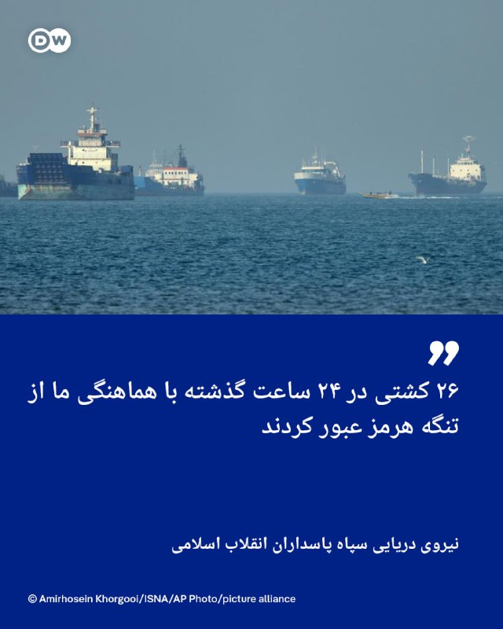

🔶 سپاه: ۲۶ کشتی در ۲۴ ساعت گذشته با هماهنگی ما از تنگه هرمز عبور کردند

بر اساس بیانیه منتشرشده از سوی نیروی دریایی سپاه، در ۲۴ ساعت گذشته ۲۶ شناور تجاری از تنگه هرمز عبور کرده‌اند و این عبور با "هماهنگی" و "تامین امنیت" از سوی نیروی دریایی سپاه انجام شده است.

در این بیانیه آمده است در میان این شناورها، نفتکش‌ها، کشتی‌های کانتینری و دیگر کشتی‌های تجاری حضور داشته‌اند.

این موضع‌گیری در ادامه تاکیدهای پیشین تهران بر این موضوع مطرح شده که کشتی‌های عبوری از تنگه هرمز باید مجوز لازم را از نیروهای مسلح ایران دریافت کنند.

جمهوری اسلامی از ۲۴ فروردین ۱۴۰۵، با وجود آتش‌بس، همچنان زیر محاصره دریایی آمریکا قرار دارد و بر همین اساس، عبور کشتی‌ها از این مسیر را تحت نظارت و کنترل خود تعریف می‌کند.

هم‌زمان، کره‌جنوبی اعلام کرده یکی از نفتکش‌هایش از تنگه هرمز عبور کرده است؛ رخدادی که از آن به‌عنوان نخستین عبور یک کشتی کره‌ای از زمان آغاز جنگ یاد شده است.

این تحول می‌تواند نشانه‌ای از تلاش تدریجی برای ازسرگیری بخشی از تردد تجاری در این آبراه باشد.

@dw_farsi

## DW_Farsi — post 124935

  

🔶 ترامپ: نتانیاهو هر کاری بخواهم انجام می‌دهد؛ برای توافق با ایران عجله‌ای ندارم

دونالد ترامپ، رئیس‌جمهور آمریکا روز چهارشنبه ۲۰ ماه مه در گفت‌وگو با خبرنگاران، در پاسخ به پرسشی درباره موضع خود در قبال اقدام احتمالی اسرائیل علیه ایران، گفت بنیامین نتانیاهو "هر کاری" او بخواهد انجام خواهد داد.

او همچنین تأکید کرد برای رسیدن به توافق با ایران عجله‌ای ندارد و گفت ترجیح می‌دهد به جای کشته شدن افراد بیشتر، راه‌حلی پیدا شود که تنش را کاهش دهد.

ترامپ در پاسخ به پرسشی درباره احتمال یک توافق محدود با ایران که فقط به باز شدن تنگه هرمز و تمدید آتش‌بس منجر شود، گفت برای رسیدن به توافق هیچ شتابی ندارد.

او گفت تنگه هرمز باید فورا باز شود، اما در عین حال افزود که می‌خواهد به این روند "یک فرصت" بدهد و تحت فشار زمان، از جمله به‌دلیل انتخابات میان‌دوره‌ای، تصمیم‌گیری نمی‌کند.

ترامپ در روزهای اخیر زمان‌بندی‌های متفاوتی برای رسیدن به یک راه‌حل دیپلماتیک مطرح کرده است. او پیش‌تر گفته بود ممکن است دو یا سه روز صبر کند یا برای "مدتی محدود" منتظر بماند.

@dw_farsi

## DW_Farsi — post 124934

  <a href="telegram/content/DW_Farsi_124934_1779306094.mp4" target="_blank">🎬 Download video</a>

🎥 هشدار به کاربران ایرانی؛ این برنامه‌ها را نصب نکنید!

اپلیکیشن‌های جعلی اندرویدی کاربران ایرانی را در محیط تلگرام هدف قرار داده‌اند.
این اپلیکیشن‌ها به عنوان وی‌پی‌ان، ابزارهای مرتبط با استارلینک یا فیلترشکن برای قربانیان ارسال می‌شوند و همراه با پیام‌هایی دوستانه.
در اینجا نحوه محافظت در مقابل چنین بدافزارهایی را آورده‌ایم.

@dw_farsi

## DW_Farsi — post 124933

  

🔶 امارات از عراق خواست فورا جلوی حملات از خاک خود را بگیرد

امارات متحده عربی روز چهارشنبه ۲۰ مه از عراق خواست فورا مانع هرگونه اقدام خصمانه از خاک خود شود.

وزارت خارجه امارات در بیانیه‌ای اعلام کرد ابوظبی بر این باور است که پهپادی که یکشنبه به یک ژنراتور برق در نزدیکی نیروگاه هسته‌ای براکه در اطراف ابوظبی اصابت کرد، از خاک عراق به پرواز درآمده بود.

وزارت خارجه امارات تاکید کرد عراق باید بدون شرط و در کوتاه‌ترین زمان ممکن از هرگونه اقدام خصمانه‌ای که از خاک این کشور منشأ می‌گیرد جلوگیری کند. در این بیانیه آمده است تهدیدهای موجود باید "سریع، فوری و مسئولانه" مهار شوند.

در حمله روز یکشنبه، یک پهپاد به یک ژنراتور برق در نزدیکی نیروگاه هسته‌ای براکه اصابت کرد.

این حمله که هیچ گروهی مسئولیت آن را به عهده نگرفت، باعث آتش‌سوزی شد، اما هیچ زخمی یا نشت پرتوی در پی نداشت. مقام‌های اماراتی همچنین گفتند دو پهپاد دیگر نیز رهگیری شده‌اند.

@dw_farsi

## DW_Farsi — post 124932

  

🔶 فرانسه: هنوز شواهد قطعی از مین‌گذاری در تنگه هرمز وجود ندارد

به گزارش خبرگزاری رویترز، کاترین ووترن، وزیر دفاع فرانسه، روز چهارشنبه ۲۰ مه (۳۰ اردیبهشت) گفت، هیچ "قطعیتی" درباره گزارش‌های مربوط به مین‌گذاری در تنگه هرمز وجود ندارد، اما پاریس خود را برای احتمال اعزام توان مین‌روبی آماده می‌کند.

او گفت فرانسه در حال آماده‌سازی برای سناریویی است که در آن، پاکسازی مین‌ها در قالب یک ماموریت احتمالی به رهبری فرانسه و بریتانیا انجام شود.

ووترن گفت فرانسه ناچار است برای ضرورت احتمالی پاکسازی مین‌ها آماده باشد و در صورت لزوم، شناورهای مین‌روب می‌توانند به منطقه اعزام شوند. رویترز پیش‌تر نیز گزارش داده بود که فرانسه، هلند و بلژیک از توان مین‌روبی برخوردارند و این ظرفیت می‌تواند برای امن‌سازی عبور و مرور در هرمز به کار گرفته شود.

این موضع پس از آن مطرح شد که برخی گزارش‌های رسانه‌ای در آمریکا، به نقل از مقام‌هایی که نامشان فاش نشد، مدعی شده بودند دست‌کم ۱۰ مین در منطقه شناسایی شده است. با این حال، مقام‌های فرانسوی گفته‌اند هنوز نمی‌توان درباره وجود مین‌ها با اطمینان سخن گفت.

@dw_farsi

## DW_Farsi — post 124931

🔶 کاهش تعهدات نظامی آمریکا به ناتو در شرایط بحران‌ و جنگ

تصمیم آمریکا درباره کاهش نیروها و تجهیزات خود برای حمایت از ناتو در شرایط بحران قرار است روز جمعه، ۱ خرداد (۲۱ مه)، به‌طور رسمی در بروکسل به متحدان ناتو اعلام شود.

این تغییر در قالب سازوکار "مدل نیروهای ناتو" انجام می‌شود؛ سازوکاری که در آن کشورهای عضو مشخص می‌کنند چه نیروهایی در صورت جنگ یا بحران بزرگ فعال خواهند شد.

پنتاگون تصمیم گرفته سهم خود از این نیروهای قابل‌استفاده را به‌طور قابل توجهی کاهش دهد، هرچند جزئیات دقیق آن هنوز اعلام نشده است.

وزارت دفاع آمریکا اما تاکید کرده است که "چتر هسته‌ای" این کشور برای دفاع از اعضای ناتو همچنان پابرجا خواهد ماند.

اقدام کاهش نیروهای آمریکایی در شرایط جنگ و بحران در راستای سیاست دونالد ترامپ، رئیس‌جمهور آمریکا انجام می‌شود که بارها تاکید کرده کشورهای اروپایی باید مسئولیت اصلی امنیت قاره خود را بر عهده بگیرند.

مارک روته، دبیر کل ناتو در بروکسل گفته است که تصمیم آمریکا قابل انتظار بوده و بخشی از تلاش برای کاهش وابستگی بیش از حد ائتلاف به یک متحد خاص است.

با این حال، این تغییر نگرانی‌هایی را در اروپا ایجاد کرده است؛ به‌ویژه در شرایطی که برخی کشورها احتمال کاهش تعهدات آمریکا و حتی عقب‌نشینی گسترده‌تر نظامی را مطرح می‌کنند.

در ماه‌های اخیر دولت ترامپ حدود ۵ هزار نیروی آمریکایی را از اروپا خارج کرده و اعزام یک تیپ نظامی به لهستان را نیز لغو کرده است؛ تصمیمی که با انتقاد برخی قانون‌گذاران آمریکایی مواجه شده است.

در مجموع، این تحولات نشان‌دهنده فشارهای فزاینده بر پیمان ناتو و اختلاف نظر میان آمریکا و متحدان اروپایی درباره تقسیم مسئولیت‌های دفاعی است.

دونالد ترامپ در آخرین دیدار خود با مارک روته، دبیرکل ناتو، در کاخ سفید اعلام کرد که از این پیمان "کاملا ناامید" است. در این دیدار همچنین درباره جنگ آمریکا و اسرائیل علیه ایران گفت‌وگو شد؛ جنگی که اعضای ناتو در آن مشارکت فعال نداشتند.

ترامپ پس از این ملاقات در شبکه اجتماعی "تروث سوشال" نوشت ناتو در زمان نیاز کنار آمریکا نبوده و در صورت نیاز دوباره نیز همراه نخواهد بود.

ترامپ بارها ناتو را "ببر کاغذی" توصیف کرده و حتی تهدید به خروج آمریکا از این پیمان کرده است. پیمان آتلانتیک شمالی (ناتو) ۳۲ عضو دارد و ایالات متحده یکی از بنیان‌گذاران آن به شمار می‌رود.

@dw_farsi

## DW_Farsi — post 124930

  <a href="telegram/content/DW_Farsi_124930_1779306097.mp4" target="_blank">🎬 Download video</a>

🎥 تاکسی‌های پرنده؛ آینده حمل‌ونقل یا رویایی دوردست؟

شرکت‌های چینی، آمریکایی و بریتانیایی وارد رقابت ساخت تاکسی‌های پرنده شده‌اند.
این هواپیماهای برقی که می‌توانند به طور عمودی از زمین بلند شوند، حالا به‌دنبال ورود به خیابان‌های هوایی هستند.
آیا آسمان شهرها واقعاً به‌زودی پر از تاکسی‌های هوایی می‌شود؟
@dw_farsi

## DW_Farsi — post 124929

  

🔶 تهدید سپاه: در صورت تکرار حمله، دامنه جنگ از منطقه فراتر خواهد رفت

سپاه پاسداران انقلاب اسلامی روز چهارشنبه ۳۰ اردیبهشت (۲۰ ماه مه) در بیانیه‌ای تهدید کرد اگر ایالات متحده بار دیگر حملات را آغاز کند، جنگ را فراتر از خاورمیانه گسترش خواهد داد.

این تهدید پس از آن مطرح شد که دونالد ترامپ، رئيس‌جمهور آمریکا گفت تنها یک ساعت با صدور دستور آغاز دوباره عملیات نظامی فاصله داشته است.

سپاه همچنین آمریکا و اسرائیل را خطاب قرار داد و مدعی شد که در صورت تکرار حمله، ضربات جمهوری اسلامی در نقاطی وارد خواهد شد که دشمنان "تصور آن را ندارند".

سپاه در بخش دیگری از بیانیه خود گفت با وجود آن‌که آمریکا و اسرائیل با همه توان دو ارتش "پرهزینه" خود به ایران حمله کردند، جمهوری اسلامی همه ظرفیت‌های خود را علیه آن‌ها وارد عمل نکرد.

به نظر می رسد این بیانیه در واکنش به اظهارات مقامات آمریکایی صادر شده است.

@dw_farsi

## DW_Farsi — post 124928

  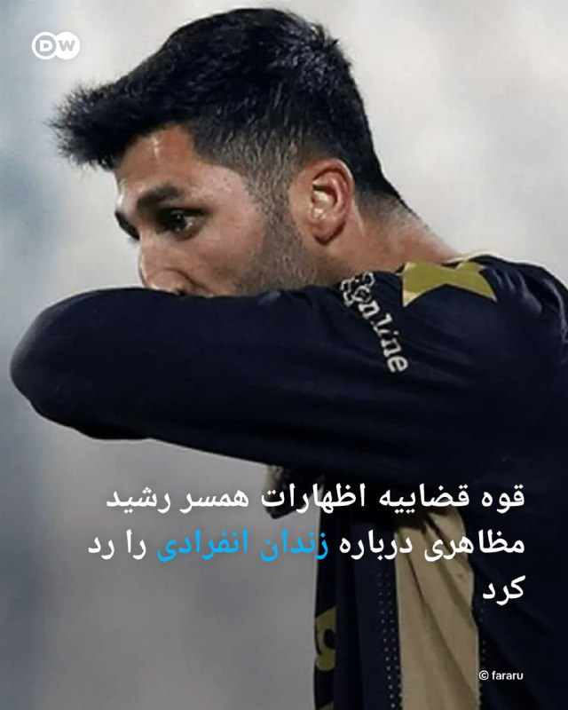

🔶 قوه قضاییه اظهارات همسر رشید مظاهری درباره زندان انفرادی را رد کرد

به گزارش خبرگزاری مهر، قوه قضائيه جمهوری اسلامی اعلام کرد رشید مظاهری هنگام تلاش برای خروج غیرقانونی از کشور از مرزهای غربی، پس از آن‌که به گفته این نهاد قصد داشت با تغییر چهره و پرداخت رشوه به ماموران مرزبانی از کشور خارج شود، بازداشت شده است.

قوه قضائيه همچنین اخبار منتشر شده در خصوص انتقال دروازه‌بان پیشین تیم ملی فوتبال ایران و باشگاه استقلال تهران به سلول انفرادی در زندان مرکزی ارومیه را رد کرد و مدعی شد که او اکنون در بند عمومی نگهداری می‌شود.

قوه قضائیه گفته است رسیدگی به این اتهام‌ها در حال انجام است و ادعاهای منتشرشده در فضای مجازی درباره وضعیت او با واقعیت تطابق ندارد.

پیش‌تر مریم عبدالهی، همسر رشید مظاهری، در یک پست اینستاگرامی نوشته بود که او به زندان مرکزی ارومیه منتقل شده و در شرایط سخت در سلول انفرادی نگهداری می‌شود.

او همچنین گفته بود ماه‌هاست برای آزادی همسرش تلاش می‌کند و از جامعه ورزش، رسانه‌ها و مردم خواسته بود صدای رشید مظاهری باشند و خواستار شفافیت و رسیدگی فوری و عادلانه شده بود.

@dw_farsi

## DW_Farsi — post 124927

🔶 اجرای توافق گمرکی اروپا و آمریکا پس از تهدیدهای ترامپ

نمایندگان کشورهای عضو اتحادیه اروپا و پارلمان اروپا روز چهارشنبه ۲۰ مه (۳۰ اردیبهشت) درباره اجرای توافق گمرکی آمریکا و اتحادیه اروپا به تفاهم رسیدند. طبق این توافق، قرار است دسترسی محصولات کشاورزی و دریایی آمریکا به بازار اروپا تسهیل شود.

با این حال، مقام‌های اروپایی تاکید کرده‌اند که این امتیازها تنها در صورتی ادامه خواهد داشت که آمریکا نیز به تعهدات خود پایبند بماند.

در متن توافق پیش‌بینی شده است که اگر واشنگتن مفاد توافق تجاری را نقض کند، اتحادیه اروپا می‌تواند امتیازهای گمرکی را تعلیق کرده و حتی دوباره تعرفه‌ها را افزایش دهد.

موضوع این "سازوکارهای حفاظتی"، یکی از اصلی‌ترین اختلاف‌ها میان کشورهای اروپایی در جریان مذاکرات داخلی بود.

پیش‌تر ترامپ به اتحادیه اروپا تا چهارم ژوئیه فرصت داده بود تا اجرای توافق را نهایی کند در غیر این صورت، او تعرفه واردات خودروهای اروپایی به آمریکا را از ۱۵ به ۲۵ درصد افزایش خواهد داد؛ اقدامی که می‌توانست به‌ویژه به خودروسازان آلمانی آسیب جدی وارد کند.

اورزولا فون‌ درلاین، رئیس کمیسیون اتحادیه اروپا ابراز امیدواری کرد توافق جدید به کاهش تنش‌های تجاری میان اروپا و آمریکا منجر شود. او خواستار اجرای سریع کاهش تعرفه‌ها شد.

برند لانگه، مذاکره‌کننده ارشد پارلمان اروپا نیز گفت پارلمان موفق شده است خواسته خود برای ایجاد "شبکه امنیتی" در برابر تخلف احتمالی آمریکا را در توافق بگنجاند.

مایکل دامیانوس، وزیر انرژی، تجارت و صنعت قبرس که کشورش ریاست دوره‌ای اتحادیه اروپا را بر عهده دارد، گفت "حفظ یک شراکت باثبات، قابل پیش‌بینی و متوازن میان دو سوی آتلانتیک به سود هر دو طرف است". او همچنین افزود اتحادیه اروپا با این تصمیم به تعهدات خود عمل می‌کند.

مارتین شیردوان، رئیس فراکسیون چپ در پارلمان اروپا، از این توافق انتقاد کرد و گفت اتحادیه اروپا در برابر فشارها و "باج‌خواهی" ترامپ عقب‌نشینی کرده است.

بر اساس این توافق، تعرفه‌های گمرکی اتحادیه اروپا بر کالاهای صنعتی آمریکا از زمان اجرایی شدن قانون آغاز می‌شود و تا پایان سال ۲۰۲۹ ادامه خواهد داشت.

این توافق بخشی از تفاهمی است که فون‌در لاین و ترامپ در اوت سال گذشته برای جلوگیری از تشدید جنگ تجاری میان دو طرف به آن دست یافته بودند. در مقابل آمریکا نیز متعهد شده بود تعرفه بیشتر کالاهای اروپایی را حداکثر در سطح ۱۵ درصد نگه دارد.

@dw_farsi

## DW_Farsi — post 124926

🎥 روغن‌های مصرف‌شده؛ راه‌حل جدید برای بحران سوخت جهانی؟
 
با افزایش قیمت نفت خام در پی تنش‌های خاورمیانه، سوخت‌های زیستی تجدیدپذیر بیش از پیش مورد توجه قرار گرفته‌اند. روغن‌های پخت‌وپز مصرف‌شده و دیگر منابع تجدیدپذیر حالا به‌عنوان گزینه‌ای جایگزین مطرح هستند؛ اما به نظر می‌رسد که چشم‌انداز این صنعت به روند قیمت نفت و سیاست‌های انرژی دولت‌ها  وابسته باشد.
@dw_farsi

## DW_Farsi — post 124925

  

🔶 قطع اینترنت در ایران وارد هشتادودومین روز شد؛ انتقاد سرافراز از "مدیریت ضعیف"
 
نت‌بلاکس اعلام کرد قطع اینترنت در ایران اکنون وارد هشتادودومین روز شده و پس از ۱۹۴۴ ساعت، کشور همچنان تا حد زیادی از اینترنت جهانی جدا مانده است.
 
نت‌بلاکس می‌گوید در دورانی که قطع چنددقیقه‌ای اینترنت می‌تواند "بحران" تلقی شود، ایران با ادامه این خاموشی دیجیتال رکوردهای تازه‌ای ثبت کرده است. این نهاد هشدار داده که ادامه این وضعیت، هم معیشت مردم را تخریب می‌کند و هم حقوق شهروندی را بیشتر فرسایش می‌دهد.
 
در همین رابطه، محمد سرافراز، عضو شورای عالی فضای مجازی، به روزنامه "شرق" گفته است که "مشکل اصلی، ساختار ناکارآمد، مدیریت ضعیف و دخالت نهادهای دیگر در شورای عالی فضای مجازی است. او تأکید کرده که تصمیم‌های مربوط به قطع اینترنت در خود این شورا گرفته نشده و کارنامه ۱۵ ساله شورا هم نشان می‌دهد این نهاد نتوانسته در جهت هدف اولیه‌اش، یعنی بهره‌گیری حداکثری از فرصت‌های اینترنت، گام‌های بلندی بردارد."
 
@dw_farsi

## DW_Farsi — post 124924

  

🔶 سامانه پاتریوت آلمان به مدت ۶ ماه در اختیار ترکیه قرار خواهد گرفت
 
ترکیه روز چهارشنبه ۳۰ اردیبهشت‌ماه اعلام کرد که آلمان از ماه ژوئن یک سامانه دفاع موشکی پاتریوت را به مدت شش ماه در اختیار این کشور قرار خواهد داد تا جایگزین سامانه‌ قبلی شود.
 
سامانه دفاعی پیشین در چارچوب تدابیر ناتو در جنوب شرقی ترکیه برای تقویت پدافند هوایی در بحبوحه جنگ ایران مستقر شده بود.
 
پدافندهای ناتو در جریان جنگ، چهار موشک بالستیک شلیک‌شده از ایران را سرنگون کرده بودند.
 
وزارت دفاع ترکیه در بیانیه‌ای اعلام کرد: «علاوه بر سامانه پدافند هوایی پاتریوت اسپانیا که هم‌اکنون در کشور ما مستقر است، یکی از دو سامانه پاتریوت اضافی که ناتو به دلیل درگیری‌های میان ایالات متحده، اسرائیل و ایران مستقر کرده بود، با یک سامانه آلمانی جایگزین خواهد شد.»
 
این وزارتخانه افزود: «برنامه‌ریزی شده است که این جایگزینی در ماه ژوئن تکمیل شود و انتظار می‌رود این سامانه حدود شش ماه عملیاتی باقی بماند.»
 
@dw_farsi

## DW_Farsi — post 124923

  

🔶 اردن از سرنگون کردن یک "پهپاد مهاجم" در حریم هوایی خود خبر داد
 
ارتش اردن اعلام کرد که روز چهارشنبه ۳۰ اردیبهشت‌ماه یک پهپاد با خاستگاه "نامشخص" را در حریم هوایی این کشور سرنگون کرده است. گزارشی از تلفات منتشر نشده است.
 
ارتش اردن در بیانیه‌ای اعلام کرد: «صبح امروز، نیروهای مسلح اردن با یک پهپاد با خاستگاه نامشخص که وارد حریم هوایی اردن شده بود، درگیر شدند و آن را در استان جرش سرنگون کردند؛ هیچ‌ موردی از مجروح‌شدن افراد گزارش نشده است.»
 
استان جرش در حدود ۵۰ کیلومتری شمال امان، پایتخت اردن، قرار دارد.
@dw_farsi

## Persian_Trend_Official — post 14549

  <a href="telegram/content/Persian_Trend_Official_14549_1779306101.mp4" target="_blank">🎬 Download video</a>

💢به مناسبت دومین سالگرد سقوط هلیکوپتر ابراهیم رئیسی

🔹بشنوید گزیده ای از قدرت سخنوری این ،شهید عضو هیئت مرگ

🫆:Tony

📌 @persian_trend_official
پرشین ترند | متفاوت‌ترین کانال نظامی

## Persian_Trend_Official — post 14547

  <a href="telegram/content/Persian_Trend_Official_14547_1779306103.webm" target="_blank">🎬 Download video</a>

🔴 حمله پهپادی به مقر گروه معارض کُرد در سلیمانیه عراق

💢رسانه‌ها از وقوع انفجار در پی حمله یک پهپاد انتحاری به مقر وابسته به گروه‌های معارض کُرد در استان سلیمانیه واقع در اقلیم کردستان عراق خبر می‌دهند.

💢استان سلیمانیه در ماه‌های گذشته چندین بار شاهد حملات پهپادی و موشکی علیه گروه‌های معارض ایرانی بوده است.

🫆:Tony

📌 @persian_trend_official
پرشین ترند | متفاوت‌ترین کانال نظامی

## Persian_Trend_Official — post 14546

  <a href="telegram/content/Persian_Trend_Official_14546_1779306104.mp4" target="_blank">🎬 Download video</a>

🔴آیا همانطور که رسانه های دولتی ایران گزارش داده اند، آمریکا در جریان مذاکرات صلح پیشنهاد کاهش تحریم های نفتی ایران را داده است؟

💢ترامپ: نه، من این را نشنیده ام. تا زمانی که توافقی امضا نکنند، هیچ کمکی نمی‌کنم.

▪️وقتی آنها توافق نامه ای امضا می کنند، می توانیم دوباره آن مکان را بسازیم و کشوری داشته باشیم که واقعا کشور خوبی برای مردم باشد.

▪️اما نه، ما چیزی پیشنهاد نکرده ایم.

🫆:Tony

📌 @persian_trend_official
پرشین ترند | متفاوت‌ترین کانال نظامی

## Persian_Trend_Official — post 14545

  <a href="telegram/content/Persian_Trend_Official_14545_1779306105.webm" target="_blank">🎬 Download video</a>

🔴 ترامپ: منتظر پاسخ ایران برای جلوگیری از تشدید تنش هستیم

💢دونالد ترامپ درباره مذاکرات با ایران گفت:

▪️ «منتظر پاسخ مناسبی از سوی ایران هستیم تا از تشدید بیشتر جلوگیری شود»
▪️ «چند روز برای دریافت پاسخ ایران صبر خواهیم کرد»
▪️ «تا زمانی که به توافق نرسیم، هیچ تحریمی علیه ایران را لغو نخواهم کرد»

او همچنین افزود:

▪️ «در ایران افراد باهوش و بااستعدادی وجود دارند و امیدواریم توافقی خوب برای هر دو طرف حاصل شود»

▪️ «اگر پاسخ‌های صددرصد درست از ایران دریافت کنیم، در زمان، هزینه و جان انسان‌ها صرفه‌جویی خواهد شد»

▪️ «ممکن است روند تحولات خیلی سریع پیش برود یا چند روز طول بکشد، اما می‌تواند ناگهان و با سرعت زیادی پایان یابد»

🫆:Tony

📌 @persian_trend_official
پرشین ترند | متفاوت‌ترین کانال نظامی

## Persian_Trend_Official — post 14544

  <a href="telegram/content/Persian_Trend_Official_14544_1779306105.mp4" target="_blank">🎬 Download video</a>

سنتکام:

💢اوایل امروز در خلیج عمان، تفنگداران دریایی آمریکا از یگان اعزامی دریایی سی و یکم سوار بر M/T Celestial Sea، یک نفتکش تجاری با پرچم ایران شدند که مظنون به تلاش برای نقض محاصره ایالات متحده از طریق عبور از بندر ایران بود.

💢نیروهای آمریکایی پس از جستجو و هدایت خدمه کشتی برای تغییر مسیر، کشتی را آزاد کردند.

🫆:Tony

📌 @persian_trend_official
پرشین ترند | متفاوت‌ترین کانال نظامی

## Persian_Trend_Official — post 14543

https://youtube.com/live/CCiwTJiy05Y?feature=share

## Persian_Trend_Official — post 14542

حدود 20 دقیقه دیگه لایو آغاز میشه

## Persian_Trend_Official — post 14541

🔴 کانال ۱۲ اسرائیل: اختلافات آمریکا و اسرائیل بر سر ایران تقریباً از بین رفته است

کانال ۱۲ اسرائیل گزارش داد مقام‌های اسرائیلی معتقدند تقریباً هیچ اختلاف مهمی میان تل‌آویو و واشینگتن درباره خواسته‌های مطرح‌شده از ایران در مذاکرات جاری باقی نمانده است.

بر اساس این گزارش:

▪️ با این حال تردیدهای جدی درباره احتمال پذیرش این شروط از سوی تهران وجود دارد
▪️ ایران تنها به بخشی از پیشنهادها پاسخ داده و درباره سایر مطالبات زمان‌کشی می‌کند
▪️ اسرائیل مذاکرات را تلاش ایران برای خرید زمان و طولانی‌کردن روند گفت‌وگوها می‌داند

در ادامه آمده:

▪️ بازگشت احتمالی به گزینه نظامی به‌طور جدی در حال بررسی است
▪️ و گفته می‌شود مقدمات چنین اقدامی از هم‌اکنون در حال آماده‌سازی است

🫆:Tony

📌 @persian_trend_official
پرشین ترند | متفاوت‌ترین کانال نظامی

## Persian_Trend_Official — post 14540

💢سخنگوی وزارت خارجه: تبادل پیام‌ها بین طرف ایرانی و آمریکایی براساس متن ۱۴بندی ایران ادامه دارد

▪️حضور وزیر کشور پاکستان برای تسهیل مبادلۀ پیام‌هاست.

🫆:Tony

📌 @persian_trend_official
پرشین ترند | متفاوت‌ترین کانال نظامی

## Persian_Trend_Official — post 14539

🔴 رویترز: برخی کشتی‌ها برای عبور از تنگه هرمز به ایران پول پرداخت می‌کنند

💢خبرگزاری رویترز گزارش داد برخی کشتی‌ها برای تضمین عبور امن از تنگه هرمز، مبالغی بیش از ۱۵۰ هزار دلار به ایران پرداخت می‌کنند.

بر اساس این گزارش:

▪️ این پرداخت‌ها با هدف جلوگیری از توقیف یا ایجاد مشکل در مسیر عبور انجام می‌شود

🫆:Tony

📌 @persian_trend_official
پرشین ترند | متفاوت‌ترین کانال نظامی

## Persian_Trend_Official — post 14538

❤️ اگر از مخاطبان پرشین ترند هستید و تلگرام پرمیوم دارید،
با بوست کردن کانال کمک بزرگی به رشد و دیده‌شدن بیشتر پرشین ترند می‌کنید.
این بوست‌ها باعث می‌شود امکانات بیشتری برای انتشار محتوا، استوری و قابلیت‌های ویژه کانال فعال شود و در شرایط فعلی، به ادامه پوشش سریع و تحلیل‌های روزانه کمک زیادی می‌کند.
🙏 اگر مایل بودید، از طریق لینک زیر کانال را بوست کنید:
https://t.me/boost/persian_trend_official
📌 @persian_trend_official
پرشین ترند | متفاوت‌ترین کانال نظامی

## Persian_Trend_Official — post 14537

  <a href="telegram/content/Persian_Trend_Official_14537_1779306107.mp4" target="_blank">🎬 Download video</a>

🔴ترامپ :

💢ما به آنها ضربه‌ای بسیار سخت زدیم. ممکن است مجبور شویم حتی سخت‌تر ضربه بزنیم — اما شاید هم نه.

🫆:Tony

📌 @persian_trend_official
پرشین ترند | متفاوت‌ترین کانال نظامی

## Persian_Trend_Official — post 14536

  <a href="telegram/content/Persian_Trend_Official_14536_1779306108.mp4" target="_blank">🎬 Download video</a>

💢ترامپ :

💢همه چیز آنها از بین رفته است. تنها سوال این است که آیا ما می‌رویم و آن را تمام می‌کنیم، یا آن‌ها قرار است یک سند را امضا کنند؟

💢خاهیم دید چه اتفاقی می افتد

🫆:Tony

📌 @persian_trend_official
پرشین ترند | متفاوت‌ترین کانال نظامی

## Persian_Trend_Official — post 14535

🔴 حمله مسلحانه در سراوان؛ یک نیروی امنیتی ایران کشته شد

💢رسانه‌های ایرانی از وقوع حمله مسلحانه توسط عناصر تروریستی در شهر سراوان واقع در استان سیستان و بلوچستان خبر دادند.

بر اساس گزارش‌های اولیه:

▪️ در این حمله یک نیروی امنیتی ایران کشته شده است

▪️ جزئیات بیشتری درباره تعداد مهاجمان یا تلفات احتمالی منتشر نشده

▪️ نیروهای امنیتی عملیات تعقیب عاملان حمله را آغاز کرده‌اند

🫆:Tony

📌 @persian_trend_official
پرشین ترند | متفاوت‌ترین کانال نظامی

## Persian_Trend_Official — post 14534

  

خداروشکر دارن توافق میکنن 😄 درجریانید که ... دلمون برای توافق های پر هیجان عراقچی با ویتکاف تنگ شده ! از توجه شما به این موضوع متشکرم الیاس فرخ

## Persian_Trend_Official — post 14533

  

خداروشکر دارن توافق میکنن 😄

درجریانید که ...

دلمون برای توافق های پر هیجان عراقچی با ویتکاف تنگ شده !

از توجه شما به این موضوع متشکرم
الیاس فرخ

## Persian_Trend_Official — post 14532

💢سخنگوی وزارت امور خارجه : ما نمی‌توانیم به ایالات متحده و اسرائیل اجازه عبور از هرمز را بدهیم 💢وقتی ما خواستار آزادی دارایی‌های مسدود شده خود هستیم، منظورمان دسترسی به آنها به عنوان حق ماست. 💢استفاده صلح‌آمیز از انرژی هسته‌ای یک مطالبه نیست، بلکه حقی است…

## Persian_Trend_Official — post 14531

💢سخنگوی وزارت امور خارجه : ما نمی‌توانیم به ایالات متحده و اسرائیل اجازه عبور از هرمز را بدهیم

💢وقتی ما خواستار آزادی دارایی‌های مسدود شده خود هستیم، منظورمان دسترسی به آنها به عنوان حق ماست.

💢استفاده صلح‌آمیز از انرژی هسته‌ای یک مطالبه نیست، بلکه حقی است که توسط پیمان منع گسترش سلاح‌های هسته‌ای تضمین شده است.

💢وقتی در مورد تحریم‌های یکجانبه آمریکا صحبت می‌کنیم، این یک مطالبه نیست، بلکه بخشی از حقوق ماست.

💢ما با عمان، دیگر کشور ساحلی، همکاری می‌کنیم تا عبور ایمن کشتی‌ها از تنگه هرمز را تضمین کنیم.

💢ما نمی‌توانیم به ایالات متحده و اسرائیل اجازه عبور از هرمز را بدهیم، زیرا این امر بر امنیت ملی ما تأثیر خواهد گذاشت.

💢ما با چندین کشور در تماس نزدیک هستیم تا اطمینان حاصل کنیم که کشتی‌های آنها می‌توانند بدون هیچ حادثه‌ای از تنگه هرمز عبور کنند.

💢ما برای صادرات و واردات خود به تنگه هرمز متکی هستیم، بنابراین انگیزه داریم که از امنیت آن اطمینان حاصل کنیم.

🫆:Tony

📌 @persian_trend_official
پرشین ترند | متفاوت‌ترین کانال نظامی

## Persian_Trend_Official — post 14530

  <a href="telegram/content/Persian_Trend_Official_14530_1779306111.mp4" target="_blank">🎬 Download video</a>

💢ترامپ :

الان تو اسرائیل ۹۹٪ طرفدار دارم.

▪️می‌تونم برای نخست‌وزیری کاندید شم، شاید بعد این ماجرا برم اسرائیل واسه نخست‌وزیری

🫆:Tony

📌 @persian_trend_official
پرشین ترند | متفاوت‌ترین کانال نظامی

## Persian_Trend_Official — post 14529

  <a href="telegram/content/Persian_Trend_Official_14529_1779306112.webm" target="_blank">🎬 Download video</a>

⭕️ادعای العربیه:

💢کار برای نهایی‌سازی متن توافق بین واشنگتن و تهران در حال انجام است.

💢فرمانده ارتش پاکستان ممکن است فردا برای اعلام نسخه نهایی توافق از ایران دیدار کند.

💢ممکن است طی ساعات آینده از نهایی شدن نسخه نهایی توافق بین آمریکا و ایران خبر داده شود.

▪️دور جدیدی از مذاکرات بعد از فصل حج در اسلام‌آباد برگزار خواهد شد.

🫆:Tony

📌 @persian_trend_official
پرشین ترند | متفاوت‌ترین کانال نظامی

## RadioFarda — post 157404

  <a href="https://t.me/radiofarda/157404" target="_blank">📎 Download file</a>

📻بشنوید: خبرهای ساعت ۲۱ با رادیوفردا،۳۰اردیبهشت ۱۴۰۵‌

@RadioFarda

## RadioFarda — post 157403

🔸دونالد ترامپ، رئیس‌جمهور آمریکا، شامگاه چهارشنبه گفت حاضر است «چند روز» برای رسیدن پاسخ ایران به پیشنهاد واشینگتن درباره توافق پایان جنگ صبر کند اما هشدار داد که این پاسخ باید «۱۰۰ درصد درست» باشد. 🔸او بعد از سخنرانی در جمع دانشجویان نظامی به خبرنگاران گفت…

## RadioFarda — post 157402

  

🔸دونالد ترامپ، رئیس‌جمهور آمریکا، شامگاه چهارشنبه گفت حاضر است «چند روز» برای رسیدن پاسخ ایران به پیشنهاد واشینگتن درباره توافق پایان جنگ صبر کند اما هشدار داد که این پاسخ باید «۱۰۰ درصد درست» باشد.

🔸او بعد از سخنرانی در جمع دانشجویان نظامی به خبرنگاران گفت اگر پاسخ ایران درست نباشد، تشدید تنش به سرعت رخ می‌دهد و افزود: «ما آماده پیش‌روی هستیم. باید جواب‌های ۱۰۰ درصد درست و خوبی بگیریم.»

🔸ترامپ اعلام کرد که آمریکا در حال حاضر با افراد «خیلی خوبی» از طرف ایرانی مواجه است که «استعداد و قدرت ذهن» دارند؛ افرادی که به گفته او جایگزین رهبران پیشین ایران شده‌اند.

🔸این اظهارات ساعتی بعد از آن است که سخنگوی وزارت خارجه ایران اعلام کرد تهران در حال بررسی طرح پیشنهادی جدید آمریکا است.

@RadioFarda

## RadioFarda — post 157401

شیعیان پاکستانی مقیم امارات؛ قربانی تنش‌ها بین ابوظبی و تهران

🔸اواسط فروردین‌ماه حمید علی شاه، از کارکنان «اتحاد ریل»، شرکت اپراتور شبکه ریلی امارات متحده عربی، از طرف این شرکت خبردار شد که باید به پلیس مراجعه کند. این مهندس عمران ساعت‌ها بازجویی شد، چندین روز در بازداشت بود و در نهایت، به کشورش پاکستان اخراج شد.

🔸آقای شاه در گفت‌وگو با رادیو اروپای آزاد/ رادیو آزادی می‌گوید: «وقتی با من تماس گرفتند، مشغول کار بودم. بعد از دو ساعت بازجویی، من و ۱۳ نفر دیگر را سوار یک ون کرده و به یک بازداشتگاه اداره مهاجرت منتقل کردند. هفدهم فروردین با یک هواپیما از امارات اخراج شدم».

🔸به گفتۀ یک نمایندۀ پارلمان پاکستان و بر اساس گزارش‌های رسانه‌ای، حمید علی شاه یکی از هزاران شهروند پاکستان بوده که از زمان آغاز جنگ اسرائیل و ایالات متحده علیه ایران در روز نهم اسفند سال گذشته، از امارات متحده عربی اخراج شده‌اند.

🔸بسیاری از آنها از اعضای اقلیت شیعۀ پاکستان بوده‌اند؛ جامعه‌ای که نزدیک به ۳۵ میلیون تن از شهروندان این کشور را در بر می‌گیرد. این بخش از جامعۀ پاکستان با ایران به‌عنوان بزرگترین کشور شیعۀ جهان روابط مستحکمی دارد.

🔸ایران در پاسخ به حملات آمریکا و اسرائیل، صدها موشک و پهپاد را به سمت همسایگانش در حاشیه خلیج فارس، از جمله امارات متحدۀ عربی به‌عنوان یک متحد ایالات متحده و اسرائیل شلیک کرد؛ کشوری که بیشترین بخش حملات تلافی‌جویانۀ ایران را متحمل شد.

🔸پاکستان، یکی از میانجی‌های اصلی برای پایان‌دادن به جنگ ایران، از متحدان دیرینۀ امارات متحده عربی به‌شمار می‌رود. اما با توجه به تعمیق روابط اسلام‌آباد و ریاض، به‌عنوان یک رقیب جدی ابوظبی، روابط پاکستان و امارات متحدۀ عربی دچار تنش‌هایی شده است.

🔸 گزارش کامل را در وب‌سایت رادیوفردا بخوانید.

@RadioFarda

## RadioFarda — post 157400

  <a href="https://t.me/radiofarda/157400" target="_blank">📎 Download file</a>

📻بشنوید: ایستگاه ۱۹ با رادیوفردا،۳۰ اردیبهشت ۱۴۰۵

@RadioFarda

## RadioFarda — post 157399

🔸گزارش‌ها حاکی از آن است که دادگاهی در تهران حکم جدید متهمان پرونده موسوم به «اکباتان» را صادر کرده که بر اساس آن سه تن از آنها تبرئه شده‌اند. 🔸رسانه امتداد در داخل ایران و گروه حقوق بشری هرانا، مستقر در آمریکا، روز چهارشنبه ۳۰ اردیبهشت اعلام کردند سه تن…

## RadioFarda — post 157398

  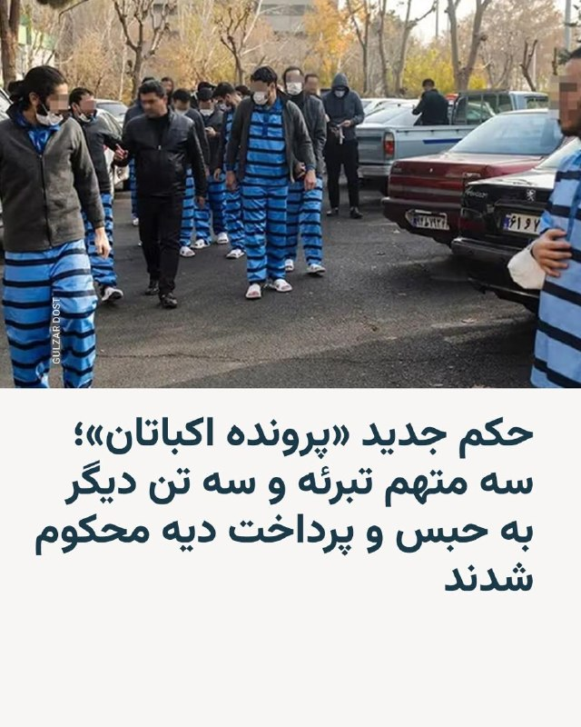

🔸گزارش‌ها حاکی از آن است که دادگاهی در تهران حکم جدید متهمان پرونده موسوم به «اکباتان» را صادر کرده که بر اساس آن سه تن از آنها تبرئه شده‌اند.

🔸رسانه امتداد در داخل ایران و گروه حقوق بشری هرانا، مستقر در آمریکا، روز چهارشنبه ۳۰ اردیبهشت اعلام کردند سه تن دیگر از این متهمان بازداشت‌شده در اعتراضات سال ۱۴۰۱ به پرداخت دیه و پنج سال حبس محکوم شدند.

🔸هر شش متهم این پرونده به اتهام نقش داشتن در کشته شدن آرمان علی‌وردی، از نیروهای بسیج، قبلا به اعدام محکوم شده بودند، اما دیوان عالی کشور این احکام را لغو کرد.

🔸بر اساس حکم دادگاه کیفری یک استان تهران، میلاد آرمون، علیرضا کفایی و امیرمحمد خوش‌اقبال بابت اتهام «مشارکت در قتل عمد» هر یک به پرداخت سهمی مساوی از دیه کامل یک انسان و تحمل ۵ سال حبس محکوم شدند.

🔸علیرضا برمرزپورناک، حسین نعمتی و نوید نجاران، سه متهم دیگر این پرونده، به دلیل فقدان مدارک دال بر وارد کردن ضربه به ناحیه مشخصی از بدن آرمان علی‌وردی، از اتهام مشارکت در قتل عمد تبرئه شدند.

@RadioFarda

## RadioFarda — post 157397

🔸فرماندهی مرکزی ایالات متحده (سنتکام) اعلام کرد که نیروهای نظامی آمریکا روز چهارشنبه در دریای عمان وارد نفتکش تجاری «ام/تی سلستیال سی» با پرچم ایران شدند.

🔸سنتکام ضمن انتشار تصاویری از ورود تفنگداران دریایی آمریکا به این نفتکش در شبکه ایکس گفت این شناور مظنون بود که قصد دارد به سمت یکی از بنادر ایران برود و محاصره دریایی ایالات متحده را نقض کند.

🔸در ادامه بیانیه آمده که نیروهای آمریکایی «پس از بازرسی کشتی و صدور دستور تغییر مسیر به خدمه آن، این شناور را آزاد کردند».

🔸سنتکام که نظارت و فرماندهی بر ارتش آمریکا در خاورمیانه را برعهده دارد، گفت: «نیروهای آمریکایی همچنان به‌طور کامل محاصره را اجرا می‌کنند و تاکنون مسیر ۹۱ کشتی تجاری را برای اطمینان از رعایت این محدودیت‌ها تغییر داده‌اند.»

🔸محاصره دریایی ایران به دستور دونالد ترامپ، رئیس‌جمهور آمریکا، چند روز بعد از برقراری آتش‌بس آغاز شد و همچنان ادامه دارد.

@RadioFarda

## RadioFarda — post 157396

  

🔸سخنگوی وزارت خارجه ایران روز چهارشنبه گفت که سفر دوباره وزیر کشور پاکستان در ایران برای «تسهیل مبادله پیام‌ها» بین تهران و واشینگتن انجام شده است.

🔸اسماعیل بقائی مدعی شد که تبادل پیام‌ها بین ایران و آمریکا «براساس متن ۱۴ بندی ایران» ادامه دارد اما به جزئیات بیشتری اشاره نکرد.

🔸محسن نقوی، وزیر کشور پاکستان، که روز ۲۶ اردیبهشت به ایران رفته و با مقام‌های ارشد جمهوری اسلامی دیدار کرده بود، بعد از چهار روز بار دیگر وارد تهران شده است.

🔸این در حالی است که رئیس‌جمهور آمریکا ساعتی پیش اعلام کرد مذاکره با ایران در «مراحل پایانی» قرار دارد و افزود اگر ایران سند توافق را امضا نکند، ایالات متحده حملات نظامی را از سر خواهد گرفت.

@RadioFarda

## RadioFarda — post 157395

  

🔸دونالد ترامپ، رئیس‌جمهور آمریکا، روز چهارشنبه با تکرار دوباره این ادعا که نیروی دریایی و نیروی هوایی ایران نابود شده‌اند، اعلام کرد تنها پرسش باقی‌مانده این است که آیا آمریکا برای «تمام کردن کار» بازخواهد گشت یا ایران توافق پایان دادن به جنگ را امضا خواهد کرد.

🔸او در سخنرانی خود در مراسم فارغ‌التحصیلی آکادمی گارد ساحلی آمریکا درباره ایران گفت: «همه‌چیز از بین رفته است. نیروی دریایی‌شان از بین رفته. نیروی هوایی‌شان از بین رفته. تقریباً همه‌چیز. تنها سؤال این است که آیا ما برمی‌گردیم و کار را تمام می‌کنیم؟ آیا آنها قرار است سندی را امضا کنند؟ ببینیم چه اتفاقی می‌افتد.»

🔸رئیس‌جمهور ایالات متحده روز دوشنبه خبر داد که دستور حمله به ایران در روز سه‌شنبه را به درخواست رهبران چند کشور منطقه لغو کرده تا به روند دیپلماتیک برای رسیدن به توافق با ایران فرصت جدیدی دهد.

🔸او در عین حال روز سه‌شنبه گفت که ایران تنها چند روز فرصت دارد تا با آمریکا به توافق برسد و در غیر این صورت شاید لازم باشد ضربه نظامی بزرگ دیگری به این کشور وارد شود.

@RadioFarda

## RadioFarda — post 157394

  <a href="https://t.me/radiofarda/157394" target="_blank">📎 Download file</a>

🔸 در این کافه فردا به آموزش استفاده از اسلحه در صدا و سیما، تبریک روز ارتباطات توسط پزشکیان در دوران قطعی اینترنت در ایران، تحلیل‌های یک کارشناس صدا و سیما در مورد یک عکس ساخته شده توسط هوش مصنوعی و تغییرات پیش رو در روند پذیرش فیلم‌ها در اسکار می‌پردازیم.

🔸 برای تماس با ما می‌توانید به شناسه کافه فردا در تلگرام صوت و متن بفرستید.

📻 کافه فردا

## RadioFarda — post 157393

🔸دونالد ترامپ، رئیس‌جمهور آمریکا، روز چهارشنبه به خبرنگاران گفت که برای پایان دادن به جنگ با ایران هیچ عجله‌ای ندارد. 🔸او درباره آتش‌بس شکننده فعلی و چشم‌انداز توافق پایان جنگ گفت: «ما باید تنگه هرمز را باز کنیم. تنگه باید فورا باز شود. به همین دلیل این مسیر…

## RadioFarda — post 157392

  

🔸دونالد ترامپ، رئیس‌جمهور آمریکا، روز چهارشنبه به خبرنگاران گفت که برای پایان دادن به جنگ با ایران هیچ عجله‌ای ندارد.

🔸او درباره آتش‌بس شکننده فعلی و چشم‌انداز توافق پایان جنگ گفت: «ما باید تنگه هرمز را باز کنیم. تنگه باید فورا باز شود. به همین دلیل این مسیر را امتحان می‌کنیم.»

🔸ترامپ با اشاره به انتخابات میاندوره‌ای کنگره آمریکا و تأثیر احتمالی آن بر تصمیمات او درباره ایران تأکید کرد: «من هیچ عجله‌ای ندارم... ترجیحم آن است که افراد کمتری کشته شوند.»

🔸رئیس‌جمهور آمریکا در ادامه گفت که برای او کامل کردن مأموریت درباره ایران مهم‌تر از تعیین زمان برای خاتمه دادن به درگیری است.

@RadioFarda

## RadioFarda — post 157391

🔸محمدباقر قالیباف، رئیس مجلس شورای اسلامی، ادعا کرد که آمریکا به دنبال دور جدید جنگ علیه ایران است و باید واشینگتن را از تسلیم شدن تهران ناامید کرد. 🔸او در یک فایل صوتی که رسانه‌های ایران روز چهارشنبه ۳۰ اردیبهشت منتشر کردند، با اشاره به برقراری آتش‌بس میان…

## RadioFarda — post 157390

  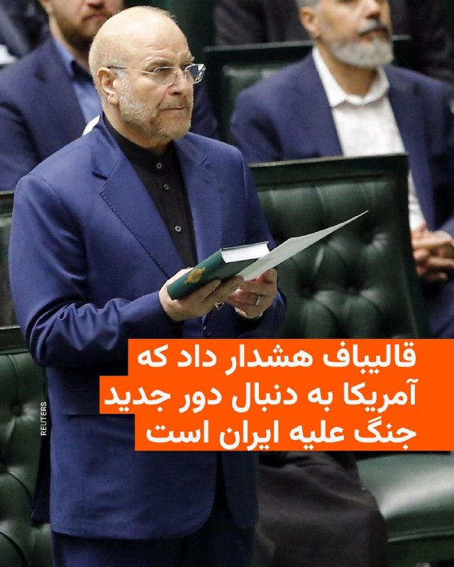

🔸محمدباقر قالیباف، رئیس مجلس شورای اسلامی، ادعا کرد که آمریکا به دنبال دور جدید جنگ علیه ایران است و باید واشینگتن را از تسلیم شدن تهران ناامید کرد.

🔸او در یک فایل صوتی که رسانه‌های ایران روز چهارشنبه ۳۰ اردیبهشت منتشر کردند، با اشاره به برقراری آتش‌بس میان ایران و آمریکا گفت: «تحرکات آشکار و پنهان دشمن نشان می‌دهد که دشمن به موازات فشارهای اقتصادی و سیاسی از اهداف نظامی خود دست نکشیده و به دنبال دور جدیدی از جنگ و ماجراجویی جدید است.»

🔸دونالد ترامپ، رئیس‌جمهور آمریکا، روز دوشنبه گفت که ارتش این کشور قرار بود روز سه‌شنبه حملاتی علیه ایران انجام دهد اما او به درخواست شماری از کشورهای منطقه و برای رسیدن به توافق پایان جنگ با ایران، دستور لغو این حملات را داده است.

🔸آقای ترامپ در عین حال روز سه‌شنبه هشدار داد که ایران تنها چند روز برای رسیدن به توافق با آمریکا وقت دارد و در غیر این‌صورت شاید لازم شود «ضربه بزرگ» دیگری به آن وارد شود.

@RadioFarda

## RadioFarda — post 157389

  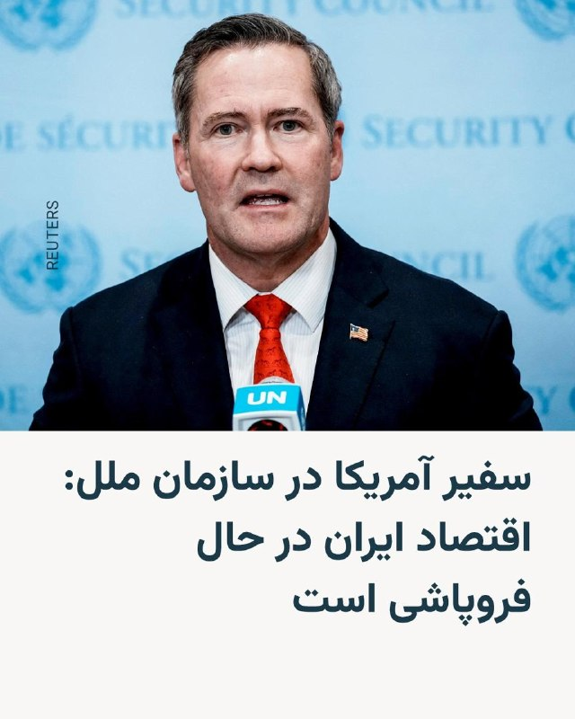

🔸مایک والتز، سفیر آمریکا در سازمان ملل، می‌گوید منابع مالی حکومت ایران «در حال تمام شدن» و اقتصاد این کشور «در وضعیت فروپاشی» است.

🔸او افزوده که با این حال جمهوری اسلامی «به‌جای روی آوردن به رویکردی تازه و صلح‌آمیز، دست به حملات مکرر و گستاخانه‌ای علیه زیرساخت‌های غیرنظامی برق زده و همچنان به راهبرد دستیابی به سلاح هسته‌ای چنگ زده که می‌تواند جهان را در تاریکی فرو ببرد.»

🔸او تأکید کرده که «ما نمی‌توانیم این را تحمل کنیم و هرگز تحمل نخواهیم کرد.»

🔸اسکات بسنت، وزیر خزانه‌داری ایالات متحده، هم روز سه‌شنبه ۲۹ اردیبهشت در یک نشست مبارزه با تأمین مالی تروریسم در پاریس، گفت که این وزارتخانه، حکومت ایران را از درآمدهایی که برای «برنامه‌های تسلیحاتی، گروه‌های نیابتی تروریستی و جاه‌طلبی‌های هسته‌ای خود استفاده می‌کرد، محروم کرده است.»

🔸او افزود که واشینگتن «ده‌ها میلیارد دلار از درآمد پیش‌بینی‌شده نفتی» جمهوری اسلامی را مختل کرده است.

@RadioFarda

## RadioFarda — post 157388

  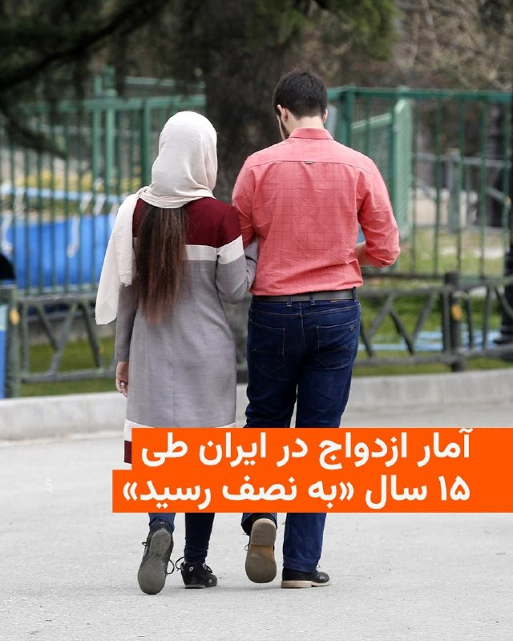

🔸دبیر ستاد ملی جمعیت ایران می‌گوید میزان ازدواج و تولد در کشور به اندازه‌ای کاهش یافته که بر اساس آمارها میزان ازدواج در کشور نسبت به سال ۱۳۸۹ «نصف» شده است.

🔸مرضیه وحید دستجردی در همایش روز ملی جمعیت گفت: «بالاترین میزان ازدواج در سال ۱۳۸۹ با ۸۹۱ هزار و ۶۲۷ مورد ثبت شده، اما این رقم در سال ۱۴۰۴ به ۴۳۱ هزار و ۲۱ مورد کاهش یافته که بیانگر افت ۵۰ درصدی ازدواج‌ها است.»

🔸دستجردی با استناد به آمار سازمان ثبت احوال، تعداد تولدها در سال ۱۴۰۴ را نیز ۸۹۲ هزار و ۲۷۸ مورد اعلام کرد و افزود که وقوع دو جنگ علیه کشور به فاصله هشت تا ۹ ماه، «تأثیر مستقیم و غیرقابل انکاری» بر فرزندآوری داشته است.

🔸او در اظهاراتش به دغدغه‌های علی خامنه‌ای، رهبر پیشین جمهوری اسلامی درباره فرزندآوری اشاره کرد و کاهش جمعیت را «زنگ خطر جدی» برای آینده ایران دانست.

🔸دستجردی تأکید کرد که برای افزایش فرزندآوری، «مؤلفه‌های کلیدی نظیر اشتغال پایدار، تأمین مسکن و ایجاد امید در دل جوانان نقش اساسی دارند که متأسفانه در قانون فعلی به برخی از این زیرساخت‌ها به طور کامل و جامع پرداخته نشده است.»

@RadioFarda

## RadioFarda — post 157387

  

🔸نیروی دریایی سپاه پاسداران روز چهارشنبه اعلام کرد که در شبانه‌روز گذشته ۲۶ کشتی تجاری با «هماهنگی و تامین امنیت» از سوی این نیرو از تنگه هرمز عبور کردند.

🔸در اطلاعیه کوتاهی که در شبکه ایکس منتشر شده، آمده است: «طی شبانه روز گذشته ۲۶ فروند کشتی اعم از نفتکش، کانتینربر و سایر کشتی‌های تجاری با هماهنگی و تامین امنیت نیروی دریایی سپاه از تنگه هرمز عبور کردند.»

🔸سپاه پاسداران مشخص نکرده است که این کشتی‌ها متعلق به کدام کشورها هستند.

🔸ایران از روز نهم اسفند و همزمان با آغاز حملات آمریکا و اسرائیل، اقدام به اختلال در رفت‌وآمد کشتی‌ها در تنگه هرمز کرد و سپس این آبراه استراتژیک را مسدود کرد.

🔸با برقراری آتش‌بس و بعد از یک دور مذاکره میان نمایندگان ایران و آمریکا در پاکستان که به نتیجه نرسید، دونالد ترامپ دستور محاصره دریایی ایران را صادر کرد که همچنان ادامه دارد.

🔸همزمان با سفر رئیس‌جمهور آمریکا به چین در هفته گذشته، مقام‌های ایرانی از عبور چند کشتی چینی از تنگه هرمز خبر داده بودند. همچنین در روزهای اخیر گزارش شد که دو نفتکش حامل گاز مایع متعلق به قطر نیز از این آبراه گذشته است.

@RadioFarda

## RadioFarda — post 157386

  

🔸رسانه‌های ایران روز چهارشنبه ۳۰ اردیبهشت خبر دادند که محسن نقوی، وزیر کشور پاکستان، وارد تهران شده است. او روز ۲۶ اردیبهشت نیز به ایران سفر کرده بود.

🔸خبرگزاری ایسنا اعلام کرده که برنامه و اهداف سفر این مقام ارشد پاکستانی در ایران «مشخص نیست». خبرگزاری تسنیم نیز گزارش داده که آقای نقوی در بدو ورود به تهران با وزیر کشور ایران دیدار کرده است.

🔸وزیر کشور پاکستان در سفر قبلی به تهران که ابتدای این هفته انجام شد، درباره «ازسرگیری مذاکرات» بین ایران و آمریکا با همتای ایرانی خود گفت‌وگو کرد و سپس به دیدار رئیس‌جمهور و رئیس مجلس ایران رفت.

🔸دومین سفر این مقام پاکستانی در حالی انجام می‌شود که دونالد ترامپ، رئیس‌جمهور آمریکا، گفته است یک حمله نظامی برنامه‌ریزی‌شده به اهدافی در ایران برای روز سه‌شنبه را لغو کرده و جی‌دی ونس، معاون او، نیز رروز سه‌شنبه از «پیشرفت زیاد» مذاکرات بین واشینگتن و تهران برای رسیدن به توافق پایان جنگ خبر داد.

🔸ترامپ روز سه‌شنبه تأکید کرد که ایران تنها چند روز برای تصمیم‌گیری درباره توافق وقت دارد و افزود شاید لازم باشد ضربات نظامی دیگری به ایران وارد شود.

@RadioFarda

## RadioFarda — post 157385

  

📷 Photo

## IranianMinds — post 20468

🔴 ترامپ درباره ایران: اگر پاسخ‌های درست را نگیریم، اوضاع خیلی سریع پیش می‌رود. همه ما آماده‌ایم. باید پاسخ‌های درست را به دست آوریم. @IranianMinds

## IranianMinds — post 20467

  <a href="telegram/content/IranianMinds_20467_1779306120.mp4" target="_blank">🎬 Download video</a>

🔴 ترامپ درباره ایران:

اگر پاسخ‌های درست را نگیریم، اوضاع خیلی سریع پیش می‌رود. همه ما آماده‌ایم. باید پاسخ‌های درست را به دست آوریم.

@IranianMinds

## IranianMinds — post 20466

  <a href="telegram/content/IranianMinds_20466_1779306122.mp4" target="_blank">🎬 Download video</a>

🔴ترامپ درباره ایران:

ما در واقع با برخی افراد بسیار خوب سر و کار داریم.

ما با افرادی با استعداد و با هوش خوب سر و کار داریم.

ما کاملاً تحت تأثیر قرار گرفته‌ایم.

@IranianMinds

## IranianMinds — post 20465

🔴فوری/ تسنیم:

آمریکایی‌ها متن جدیدی به ایران ارسال کرده‌اند، ایران در حال بررسی متن است و هنوز پاسخی داده نشده است.
میانجی پاکستانی در تهران به دنبال نزدیک کردن متون به یکدیگر است.

@IranianMinds

## IranianMinds — post 20464

🔴دقایقی پیش افراد مسلح در خودرویی، به سمت یک خودروی پلیس در جاده‌ای در شهرستان سراوان تیراندازی کردند که منجر به کشته شدن ستوان سوم امیر‌حسین شهرکی شد.

@IranianMinds

## IranianMinds — post 20463

🔴 العربیه :

ممکن است طی ساعات آینده از نهایی شدن نسخه نهایی توافق بین آمریکا و ایران خبر داده شود.

@IranianMinds

## IranianMinds — post 20462

🔴 ترامپ : برا جنگ عجله ندارم. رژیم ایران رو عوض کردم و بهشون فرصت میدم فکر کنن @IranianMinds

## IranianMinds — post 20461

🔴 ترامپ :

برا جنگ عجله ندارم. رژیم ایران رو عوض کردم و بهشون فرصت میدم فکر کنن

@IranianMinds

## IranianMinds — post 20460

  <a href="telegram/content/IranianMinds_20460_1779306123.mp4" target="_blank">🎬 Download video</a>

🔴 دونالد ترامپ :

«هرگز، هرگز تسلیم نشوید. هر اتفاقی که بیفتد، مهم نیست در چه جایگاهی از زندگی باشید یا در چه شرایطی قرار داشته باشید، به پیش رفتن ادامه دهید.

همیشه رو به جلو حرکت کنید. هرگز از پیش رفتن باز نایستید.

به مبارزه ادامه دهید و کاری کنید که طرف مقابل زودتر از شما تسلیم شود. بگذارید آن‌ها کنار بکشند. اگر به مسیر خود ادامه دهید، آن‌ها در نهایت تسلیم خواهند شد.»

@IranianMinds

## IranianMinds — post 20459

🔴 مارک روته، دبیرکل ناتو:

«بسیاری از کشورهای عضو ائتلاف در حال انتقال منابع نظامی به منطقه تنگه هرمز هستند»

@IranianMinds

## IranianMinds — post 20458

✅ (فقط ۲۰۰ هزار تومن)🥺 🌱 قیمت اقتصادی + پشتیبانی حرفه‌ای 🚀 سریع و پایدار، بدون قطعی 🦋پشتیبانی واقعی، همیشه در دسترس ربات ما🌴 📩 @dayaconfigbot کانال ما🌳 📩 @dayavpn

## IranianMinds — post 20457

  <a href="telegram/content/IranianMinds_20457_1779306125.mp4" target="_blank">🎬 Download video</a>

🔴 ترامپ :

«ونزوئلا بیست سال پیش واقعاً کشور بسیار خوبی بود؛ اما مسیر اشتباهی را در پیش گرفت.

همان مسیری را رفت که بعضی‌ها دوست دارند این کشور را به آن سمت ببرند برخی دیوانه‌ها می‌خواهند این کشور را به‌شدت به سمت چپ ببرند و آن را نابود کنند.»

@IranianMinds

## IranianMinds — post 20456

  <a href="telegram/content/IranianMinds_20456_1779306127.mp4" target="_blank">🎬 Download video</a>

🔴 ترامپ درباره ایران :

«ما ضربه بسیار سختی به آن‌ها وارد کردیم. ممکن است مجبور شویم حتی ضربه سخت‌تری هم وارد کنیم اما شاید هم نه.

ما اجازه نخواهیم داد ایران به سلاح هسته‌ای دست پیدا کند و تمام خاورمیانه را منفجر کند و بعد سراغ شما بیاید.»

@IranianMinds

## IranianMinds — post 20455

  

✅ (فقط ۲۰۰ هزار تومن)🥺

🌱 قیمت اقتصادی + پشتیبانی حرفه‌ای

🚀 سریع و پایدار، بدون قطعی
🦋پشتیبانی واقعی، همیشه در دسترس

ربات ما🌴
📩 @dayaconfigbot

کانال ما🌳
📩 @dayavpn

## IranianMinds — post 20454

  <a href="telegram/content/IranianMinds_20454_1779306129.mp4" target="_blank">🎬 Download video</a>

🔴آمریکا تعداد زیادی هواپیمای سوخت‌رسان را به فرودگاه بن‌گوریون اسرائیل منتقل کرد.

@IranianMinds

## IranianMinds — post 20453

  

🔴 ترامپ درباره کوبا :

ایالات متحده یک رژیم تروریستی را در نود مایلی خود تحمل نمیکند ، بنظر من وقت آن رسیده که مردم کوبا هم به آزادی که ۱۰۰ سال پیش برای آن جنگیده بودند برسند.

@IranianMinds

## IranianMinds — post 20452

نسخه کامل گفتگو در نشست آینده تکنولوژی ایران

این نشست روز ۱۶ مه (۲۶ اردیبهشت) در محل دفتر مرکزی شرکت «اوبر» در شهر سان‌فرانسیسکو در ایالت کالیفرنیای آمریکا برگزار شد.

@OfficialRezaPahlavi

## IranianMinds — post 20451

🔴 سخنگوی وزارت خارجه :

ما اورانیوم خودمونو به کسی تحویل نمیدیم و مسئله ی هسته ای ما کاملا صلح آمیزه.

@IranianMinds

## IranianMinds — post 20450

🔴 الحدث : دور بعدی مذاکرات پس از حج در اسلام آباد برگزار خواهد شد. @IranianMinds

## IranianMinds — post 20449

🔴 الحدث : احتمالا توافق ایران‌ و آمریکا تا ساعات آینده نهایی میشه. منظور متن توافق برای مذاکرات هست @IranianMinds

## BBCPersian — post 281639

  <a href="telegram/content/BBCPersian_281639_1779306131.mp4" target="_blank">🎬 Download video</a>

🔻آخرین خبرهای مهم روز چهارشنبه ۳۰ اردیبهشت ۱۴۰۵

@BBCPersian

## BBCPersian — post 281633

🖊شهاب میرزایی, بی‌بی‌سی

روزنامه نیویورک تایمز در گزارشی از برنامه «جسورانه» نیروهای آمریکایی و اسرائیلی برای آنچه عملیات «آزادی» محمود احمدی‌نژاد «از حصر خانگی» و «تسهیل روند تغییر رژیم» ایران با کمک رئیس‌جمهور پیشین خوانده، خبر داده است.
بر اساس گزارش رسانه‌های ایران، منزل مسکونی محمود احمدی‌نژاد در اولین روز از جنگ آمریکا و اسرائیل علیه ایران در ۹ اسفند ۱۴۰۴ هدف قرار گرفت و شایعاتی درباره کشته شدن او مطرح شد. روزنامه ایران، وابسته به دولت جمهوری اسلامی ایران، همان روز در حساب رسمی خود در شبکه ایکس نوشت که سه نفر از محافظان محمود احمدی‌نژاد، رئیس‌جمهوری اسبق، در حمله به منزل وی کشته شدند. این روزنامه گزارشی از وضعیت آقای احمدی‌نژاد نداد.

آلبوم را ورق بزنید و ادامه مطلب را در لینک زیر مطالعه کنید:

https://bbc.in/4dT881o
📷Getty/khamenei .ir/TABNAK

## BBCPersian — post 281632

🔻اردوغان از «تمدید آتش‌بس» میان ایالات متحده و ایران استقبال کرد

رجب طیب اردوغان، رئیس جمهور ترکیه، روز چهارشنبه در یک تماس تلفنی با دونالد ترامپ، همتای آمریکایی خود از تمدید آتش‌بس بین آمریکا و ایران استقبال کرده است و می‌گوید که به اعتقاد او، «مسائل مورد اختلاف بین دو طرف قابل حل است.»

دفتر ریاست جمهوری ترکیه در بیانیه‌ای اعلام کرده است که در این گفتگو، آقای اردوغان گفته است که تصمیم به تمدید آتش‌بس در منطقه درگیری در منطقه ما را یک تحول مثبت می‌بیند و «معتقد است که دستیابی به یک راه‌حل معقول برای مسائل مورد اختلاف امکان‌پذیر است.»

ساعاتی پیش هم وزیر خارجه عربستان سعودی، گفت که کشورش از تصمیم دونالد ترامپ برای دادن زمان بیشتر به مذاکرات با ایران برای رسیدن به توافق، قدردانی می‌کند.

دونالد ترامپ، رئیس‌جمهوری آمریکا، اوایل هفته گفته بود که عربستان سعودی، امارات متحده عربی و قطر از او خواسته‌ بودند که حمله برنامه‌ریزی شده آمریکا به ایران را به تعویق بیندازد تا زمان بیشتری برای مذاکرات فراهم شود.

رئیس‌جمهور آمریکا، با این حال روز چهارشنبه گفت که مذاکرات با ایران به مراحل پایانی رسیده، اما هشدار داد اگر تهران با توافق موافقت نکند، حملات بیشتری انجام خواهد شد.

شش هفته پس از آن‌که او عملیات «خشم حماسی» را برای برقراری آتش‌بس متوقف کرد، گفت‌وگوها برای پایان دادن به جنگ تاکنون پیشرفت اندکی داشته است.

## BBCPersian — post 281631

🔻ارتش اسرائیل: در بالاترین سطح هشدار قرار داریم

با بالاگرفتن تهدیدهای متقابل آمریکا و اسرائیل به جنگ، سپهبد ایال زمیر، فرمانده ارتش اسرائیل، روز چهارشنبه گفت که ارتش کشورش در بالاترین سطح هشدار خود قرار دارد.

بر اساس بیانیه‌ای که ارتش اسرائیل منتشر کرده است، ایال زمیر در جلسه‌ای با حضور تمام فرماندهان لشکرها گفت: «در حال حاضر، ارتش اسرائیل برای هرگونه تحولی آماده است.»

این اظهارات در حالیست که سپاه پاسداران ساعاتی پیش با انتشار بیانیه‌ای تهدید کرد که در صورت آغاز دوباره جنگ آمریکا و اسرائیل علیه ایران، جنگ «به فراتر از منطقه کشیده خواهد شد.»

دونالد ترامپ، رئیس جمهور آمریکا، هم دیروز گفته بود که در آستانه حمله نظامی دوباره به ایران، به درخواست رهبران منطقه، دستور حمله را لغو کرده است.

https://bbc.in/436bsAl
@BBCPersian

## BBCPersian — post 281630

🔻فرماندهی مرکزی آمریکا، سنتکام، با انتشار ویدیویی در حساب رسمی خود در شبکه اجتماعی ایکس گفته است که نیروهای آمریکایی وارد یک نفتکش با «پرچم ایران» شدند و این کشتی را مجبور به تغییر مسیر کردند.

سنتکام می‌گوید اوایل امروز (چهارشنبه) در دریای عمان، «تفنگداران دریایی ایالات متحده از واحد سی و یکم اعزامی تفنگداران دریایی، وارد ام‌تی سلستیال سی، یک نفتکش تجاری با پرچم ایران شدند که مظنون به تلاش برای نقض محاصره ایالات متحده با عبور به سمت یک بندر ایرانی بود.»

در ادامه این متن آمده است: «نیروهای آمریکایی پس از بازرسی و هدایت خدمه کشتی برای تغییر مسیر، کشتی را آزاد کردند.»

سنتکام می‌گوید نیروهای آمریکایی کماکان به اجرای کامل محاصره دریایی ادامه می‌دهند و اکنون ۹۱ کشتی تجاری را برای اطمینان از رعایت آن، تغییر مسیر داده‌اند.

🎥CENTCOM
https://bbc.in/436bsAl
@BBCPersian

## BBCPersian — post 281628

  <a href="telegram/content/BBCPersian_281628_1779306133.mp4" target="_blank">🎬 Download video</a>

ایتامار بن‌ گویر، وزیر امنیت ملی اسرائیل که به عنوان یک چهره سیاسی راست افراطی شناخته می‌شود، در شبکه اجتماعی ایکس ویدیویی از اعضای بازداشت شده کاروان کمک‌رسانی به غزه منتشر کرده است که نشان می‌دهد آنها با دست بسته رو به زمین زانو زده‌اند.
 
در بخش‌هایی از این ویدیو رفتار خشونت‌آمیز با آنها دیده می‌شود و بن‌گویر در حالی که پرچم بزرگی از اسرائیل را در دست دارد، به زبان عبری به آن‌ها می‌گوید: «به اسرائیل خوش آمدید، این ما هستیم که صاحب اختیاریم.»
 
گیدئون ساعر، وزیر خارجه اسرائیل به طور علنی از انتشار این ویدیو انتقاد کرده و این اقدام را «نمایشی شرم‌آور» توصیف کرد. او گفت ایتامار بن‌گویر «نمایانگر چهره واقعی اسرائیل نیست.»
 
انتشار این ویدیو واکنش‌های زیادی را در پی داشت از جمله جورجا ملونی، نخست‌وزیر ایتالیا، نیز این اقدام را محکوم کرده و خواستار عذرخواهی شده است.

@bbcpersian

## BBCPersian — post 281627

  <a href="https://t.me/bbcpersian/281627" target="_blank">📎 Download file</a>

امروز در برنامه رادیویی جام‌جهان‌نما می‌شنوید:

روایت نیویورک‌تایمز از اهداف آمریکا و اسرائیل در آغاز جنگ؛ این روزنامه می‌گوید بمباران اطراف خانه محمود احمدی‌نژاد، با هدف آزاد کردن او از حصر خانگی و بازگرداندنش به قدرت انجام شده بود. این گزارش تا چه اندازه قابل باور است و چه تصویری از اهداف پشت پرده جنگ ارائه می‌دهد؟

حرف‌وحدیث‌ها درباره نقش گروه‌های کرد ایرانی در عراق در آغاز جنگ ۳۹ روزه؛ گزارش بی‌بی‌سی فارسی نشان می‌دهد آمریکا به برخی از این گروه‌ها کمک مالی کرده بود تا وارد ایران شوند.

چین و روسیه بدون اشاره مستقیم به تنگه هرمز، اختلال در زنجیره تأمین و تجارت جهانی را محکوم کردند. آیا پکن و مسکو در حال فاصله گرفتن از تهران‌اند؟

و سپاه پاسداران هشدار داده اگر دوباره جنگی آغاز شود، پاسخ ایران «فراتر از منطقه» خواهد بود.این تهدیدتا چه حد جدی است؟

برنامه رادیویی جام جهان‌نما هر شب ساعت ۲۰ به وقت ایران، روی موج متوسط ۷۰۲ کیلوهرتز و موج کوتاه ۹۴۶۵ کیلوهرتز پخش می‌شود و تکرار آن را هم می‌توانید ساعت ۲۱:۳۰ روی موج متوسط ۷۰۲ کیلوهرتز و موج کوتاه ۵۳۹۵ کیلوهرتز گوش کنید.

## BBCPersian — post 281625

🔻ترامپ: مذاکرات با ایران به مراحل پایانی رسیده اگر توافق نکند حمله می‌کنیم

دونالد ترامپ، رئیس‌جمهور آمریکا، روز چهارشنبه گفت که مذاکرات با ایران به مراحل پایانی رسیده، اما هشدار داد اگر تهران با توافق موافقت نکند، حملات بیشتری انجام خواهد شد.

شش هفته پس از آن‌که او عملیات «خشم حماسی» را برای برقراری آتش‌بس متوقف کرد، گفت‌وگوها برای پایان دادن به جنگ تاکنون پیشرفت اندکی داشته است.

آقای ترامپ این هفته گفته بودکه تا آستانه صدور دستور حملات بیشتر پیش رفته است، اما برای دادن فرصت بیشتر به مذاکرات از این اقدام خودداری کرده است.

او امروز به خبرنگاران گفت: «ما در مراحل پایانی [مذاکرات] با ایران هستیم. خواهیم دید چه اتفاقی می‌افتد. یا به توافق می‌رسیم یا کارهایی خواهیم کرد که کمی ناخوشایند خواهد بود، اما امیدوارم به آنجا نکشد.»

رئیس‌جمهور آمریکا افزود: «ما این فرصت را می‌دهیم. عجله‌ای ندارم. ترجیح می‌دهم افراد کمتری کشته شوند تا تعداد زیادی. این موضوع می‌تواند به هر دو شکل پیش برود.»

حکومت ایران در مقابل، دونالد ترامپ را به تلاش برای ازسرگیری جنگ متهم کرد و هشدار داد که در صورت هرگونه حمله، فراتر از خاورمیانه پاسخ خواهد داد.

https://bbc.in/436bsAl
@BBCPersian

## BBCPersian — post 281624

  

🔻شعبه ۱۳ دادگاه کیفری تهران احکام ۶ متهم در پرونده موسوم به «اکباتان» را صادر کرده است.

بر اساس رای دادگاه که سایت امتداد منتشر کرده است، میلاد آرمون، علیرضا کفایی و امیرمحمد خوش اقبال به ۵ سال حبس و دیه محکوم شده‌اند.

این سه متهم به همراه حسین نعمتی با اتهام «ﻣﺸﺎرﮐﺖ در اﯾﺮاد ﺻﺪﻣﺎت و ﺟﺮاﺣﺎت ﻏﯿﺮ ﻣﺆﺛﺮ در ﻓﻮت» ﺑﻪ ﭘﺮداﺧﺖ دﯾﻪ ﺻﺪﻣﺎت به خانواده آرمان علی وردی محکوم شده‌اند.

آرمان علی‌وردی، طلبه بسیجی بود که طبق گزارش‌ها روز ۴ آبان سال ۱۴۰۱ در جریان اعتراضات سراسری در شهرک اکباتان مورد ضرب و جرح قرار گرفت و دو روز بعد در بیمارستان جان باخت.

سه متهم دیگر؛ نوید نجاران، علیرضا برمز پورناک و حسین نعمتی از اتهامات تبرئه شدند.

علیرضا برمز پورناک و نوید نجاران از اتهامات قبلی «مشارکت در قتل عمد ‌ایراد صدمات غیرموثر در فوت» و همچنین حسین نعمتی از اتهام «مشارکت در قتل»، تبرئه شده‌اند.

در پرونده موسوم به شهرک اکباتان این شش نفر به اتهام کشتن آرمان علی‌وردی، در جریان اعتراضات سال ۱۴۰۱، بازداشت شدند.

📷UGC
@BBCPersian

## BBCPersian — post 281623

  <a href="telegram/content/BBCPersian_281623_1779306136.mp4" target="_blank">🎬 Download video</a>

🔻دوربین همراه یکی از افسران پلیس کالامازوی ایالت میشیگان، ویدیویی را از عملیات نجات کودکی که در میان شعله‌های آتش در خانه‌ای گرفتار شده بود ثبت کرده است.

افسر پلیس پس از رسیدن به محل حادثه، از مادر کودک در حالیکه بر لبه پنجره ایستاده بود، خواست پنجره را با لگد بشکند و کودک را به سمت او پرتاب کند.

کودک و مادرش پس از عملیات نجات برای اطمینان از سلامتشان به بیمارستان منتقل شدند. به گفته مقام‌ها، هیچ‌کدام آسیبی ندیده‌اند و علت آتش‌سوزی هنوز در دست بررسی است.

https://bbc.in/436bsAl
@BBCPersian

## BBCPersian — post 281622

  

🔻بارنی فرانک نماینده سابق کنگره آمریکا از حزب دموکرات، که به‌عنوان یکی از اولین نمایندگان کنگره آمریکا به‌صورت آشکار هویت هم‌جنس‌گرایانه خود را آشکار کرد، در هشتاد و شش سالگی درگذشت. 

او به‌عنوان یکی از چهره‌های اثرگذار در پیشبرد حقوق جامعه ال‌جی‌بی‌تی و از معماران اصلاحات مالی پس از بحران ۲۰۰۸ شناخته می‌شود.

او پیش از سه دهه نمایندگی بخش جنوبی ایالت ماساچوست را در مجلس نمایندگان ایالات متحده آمریکا بر عهده داشت و در این مدت به یکی از چهره‌های شناخته‌شده و جنجالی سیاست آمریکا تبدیل شد.

آقای فرانک در تاریخ کنگره آمریکا به‌عنوان نخستین عضو این نهاد شناخته می‌شود که وارد یک ازدواج همجنس‌گرایانه شد؛ کاری که در زمان خود بازتاب گسترده‌ای داشت و جایگاه او را به‌عنوان یکی از چهره‌های پیشرو در جنبش حقوق ال‌جی‌بی‌تی ثبت کرد.

بارنی فرانک در طول دوران فعالیت سیاسی خود، هم‌زمان به‌خاطر رویکردهای صریح و گاه جنجالی‌اش در حوزه اقتصاد و سیاست اجتماعی شناخته می‌شد و جایگاهی متمایز در میان قانون‌گذاران هم‌عصر خود داشت.

📷Getty Images
@BBCPersian

## BBCPersian — post 281621

🔻وزیر خارجه اسرائیل ویدئوی جنجالی بن‌گویر درباره فعالان غزه را «شرم‌آور» خواند

گیدئون ساعر، وزیر خارجه اسرائیل، به‌طور علنی از وزیر امنیت ملی راست‌افراطی کشورش به دلیل انتشار ویدیوی تحقیرآمیز فعالان بین‌المللی بازداشت‌شده کاروان کمک‌رسانی به غزه، انتقاد کرده است.

او این اقدام را «نمایشی شرم‌آور» توصیف کرد و گفت ایتامار بن‌گویر «مایانگر چهره واقعی اسرائیل نیست.»

در این ویدیو ده‌ها فعال دیده می‌شوند که با دستان بسته روی زمین زانو زده‌اند.

بن‌گویر در حالی که پرچم بزرگی از اسرائیل را در دست دارد، به زبان عبری به آن‌ها می‌گوید: «به اسرائیل خوش آمدید، این ما هستیم که صاحب اختیاریم.»

انتشار این ویدئو واکنش‌های زیادی را در پی داشت از جمله جورجا ملونی، نخست‌وزیر ایتالیا، نیز این اقدام را محکوم کرده و خواستار عذرخواهی شده است.

https://bbc.in/3PtqVqU
@BBCPersian

## BBCPersian — post 281620

🔻قدردانی عربستان از ترامپ برای دادن زمان بیشتر به ایران

شاهزاده فیصل بن فرحان، وزیر امور خارجه عربستان سعودی، روز چهارشنبه گفت که کشورش از تصمیم دونالد ترامپ برای دادن زمان بیشتر به مذاکرات با ایران برای رسیدن به توافق، قدردانی می‌کند.

دونالد ترامپ، رئیس‌جمهوری آمریکا، اوایل این هفته گفت که عربستان سعودی، امارات متحده عربی و قطر از او خواسته‌اند که حمله برنامه‌ریزی شده آمریکا به ایران را به تعویق بیندازد تا زمان بیشتری برای مذاکرات فراهم شود.

پیش از این سپاه پاسداران با انتشار بیانیه‌ای تهدید کرد که در صورت آغاز دوباره جنگ آمریکا و اسرائیل علیه ایران، جنگ «به فراتر از منطقه کشیده خواهد شد.»

https://bbc.in/3PtqVqU
@BBCPersian

## BBCPersian — post 281619

🔻وزیر ارتباطات ایران: شبکه ملی اطلاعات در امتداد اینترنت جهانی است، نه جایگزینش

ستار هاشمی، وزیر ارتباطات و فناوری اطلاعات ایران، در مراسمی به مناسبت روز جهانی ارتباطات گفت: «اینکه گفته می‌شود شبکه ملی اطلاعات قرار است جایگزین اینترنت جهانی و دسترسی آزاد به اطلاعات شود، برداشت نادرستی است.»

او تاکید کرد: «شبکه ملی اطلاعات، در امتداد دسترسی بین‌الملل به اینترنت است، نه جایگزین آن.»

آقای هاشمی گفت: «استقلال شبکه به معنای قطع ارتباط با جهان نیست و نمی‌توان جامعه را از دسترسی به دانش، خدمات و ظرفیت‌های بین‌المللی محروم کرد.»

او در این جلسه با اشاره به کارکرد شبکه ملی اطلاعات در دوران جنگ گفت که به دلیل «توسعه زیرساخت‌های شبکه ملی اطلاعات و گسترش مویرگی ارتباطی در سراسر کشور»، خدمات بانکی، بهداشتی و درمانی، آموزشی و خدمات عمومی کشور «متوقف نشد.»

به گفته وزیر ارتباطات، در طول جنگ اخیر، «بیش از ۵۰۰ سایت ارتباطی کشور آسیب دید اما مردم اختلال گسترده‌ای در دریافت خدمات احساس نکردند.»

این در حالی است که در طول جنگ اخیر آمریکا و اسرائیل با ایران، گزارش‌هایی مبنی بر اختلال در دسترسی به خدمات بانکی و اداری منتشر شد.

ستار هاشمی با اشاره به قطع اینترنت جهانی که بیش از ۸۰ روز از آن می‌گذرد گفت: «برخی محدودیت‌ها در شرایط خاص و با تصمیم مراجع ذی‌صلاح اعمال شد، اما استمرار این وضعیت به‌تدریج می‌تواند به شبکه ملی اطلاعات نیز آسیب وارد کند.»

با شروع حملات آمریکا و اسرائیل به ایران، دسترسی عمومی به اینترنت جهانی در کشور قطع شد و تاکنون ادامه دارد. قطع دسترسی عمومی به اینترنت خسارت‌های بسیاری را به اقتصاد ایران وارد کرده است و مسئولان و کارشناسان بارها درباره آسیب‌های غیرقابل جبران آن هشدار داده‌اند.

https://bbc.in/3PtqVqU
@BBCPersian

## BBCPersian — post 281618

  <a href="telegram/content/BBCPersian_281618_1779306138.mp4" target="_blank">🎬 Download video</a>

دانشجویان دانشگاه هنگ‌کنگ که برترین دانشکده حقوق این شهر است، در گفت‌وگو با بی‌بی‌سی فاش کرده‌اند که متوجه شده‌اند از عکس‌هایشان برای تولید تصاویر هرزه‌نگاری با استفاده از هوش مصنوعی استفاده شده و این موضوع به شدت آنها را شوکه کرده است.
 
این دانشجویان زن تصمیم گرفته‌اند این موضوع را علنی کنند تا به این شکل، این رنج و تجربه شخصی را به تلاشی گسترده‌تر برای پاسخ‌گویی و اصلاحات قانونی تبدیل کنند.

@bbcpersian

## idfinfarsi — post 11613

  <a href="telegram/content/idfinfarsi_11613_1779306140.mp4" target="_blank">🎬 Download video</a>

‼️ارتش اسرائیل افشا می‌کند: سازمان‌های تروریستی در نوار غزه چگونه از کودکان به‌عنوان سپر انسانی برای تروریسم استفاده می‌کنند

⭕️در چارچوب فعالیت‌های معمول پهپادی نیروهای ارتش اسرائیل در منطقه خط زرد، مشخص شد که سازمان‌های تروریستی فعال در نوار غزه به‌شکل بی‌رحمانه و سوءاستفاده‌گرانه از کودکان به‌عنوان سپر انسانی برای اقدامات تروریستی استفاده می‌کنند.

⭕️در یکی از این فعالیت‌ها، ارتش اسرائیل شناسایی کرد که سازمان‌های تروریستی در غزه در حال انتقال تسلیحات از مکانی به مکان دیگر هستند، در حالی که تلاش می‌کنند این تسلیحات را پنهان کنند.
⭕️در فعالیتی دیگر، یک تروریست از سازمان تروریستی حماس شناسایی شد که در محوطه یک مدرسه در نوار غزه به کودکان سلاح می‌داد و مشاهده شد که کودکان با این سلاح‌ها «بازی» می‌کنند.

⭕️این مستندات به موارد دیگری می‌پیوندد که نشان‌دهنده سوءاستفاده‌ نظام‌مند و بی‌رحمانه سازمان تروریستی حماس از جمعیت غیرنظامی به‌عنوان سپر انسانی است، در حالی که این اقدامات نقض قوانین بین‌المللی به شمار می‌رود.

## idfinfarsi — post 11612

  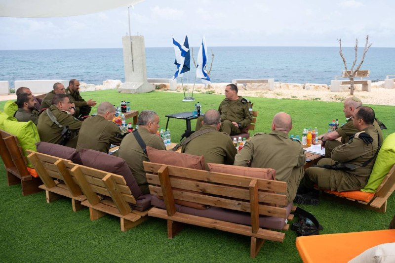

📷 Photo

## idfinfarsi — post 11611

سخنگوی ارتش اسرائیل:

رئیس ستاد کل ارتش اسرائیل خطاب به فرماندهان لشکرها: «در تمامی جبهه‌ها آماده هستیم و در مناطق دفاعی خط مقدم مستقر شده‌ایم، تهدیدها را خنثی کرده و با ابتکار، پایداری و قاطعیت واقعیت را شکل می‌دهیم. دستاوردهای ارتش اسرائیل حاصل نبرد و فداکاری بی‌سابقه شما فرماندهان و رزمندگان در نیروهای وظیفه و ذخیره است. در این لحظات، ارتش اسرائیل در بالاترین سطح آماده‌باش قرار دارد و برای هر تحولی آماده است. در کنار نبرد شدید و مستمر، باید سطح بالایی از ارزش‌ها، حرفه‌ای‌گری و انضباط عملیاتی را حفظ کنیم؛ این‌ها شرط آمادگی رزمی و انسجام ارتش اسرائیل است.»

رئیس ستاد کل ارتش اسرائیل، سپهبد ایال زامیر، امروز (چهارشنبه) با تمامی فرماندهان لشکرها گفت‌وگو کرد.

در این گفت‌وگو، رئیس ستاد کل ارتش اسرائیل ارزیابی وضعیت عملیاتی را با فرماندهان انجام داد و به چالش‌های عملیاتی در تمامی جبهه‌ها، میزان آمادگی نیروها و ادامه نبرد در جبهه‌های مختلف پرداخت.

بخشی از سخنان رئیس ستاد کل ارتش اسرائیل، سپهبد ایال زامیر: «شما نسل منحصربه‌فردی از فرماندهان لشکر در تاریخ ارتش اسرائیل و کشور اسرائیل هستید. اقدامات شما در دو سال و نیم گذشته در کتاب‌های تاریخ ثبت خواهد شد. توانمندی ارتش، حفظ ارزش‌ها و دستاوردهای عملیاتی آن—در دستان شماست.

در تمامی جبهه‌های نبرد در مرزها، ما آماده هستیم و در مناطق دفاع پیشرو مستقر شده‌ایم، تهدیدها را خنثی کرده و با ابتکار، پایداری و قاطعیت واقعیت را شکل می‌دهیم. دستاوردهای ارتش اسرائیل نتیجه نبرد و فداکاری بی‌سابقه شما فرماندهان و رزمندگان در نیروهای وظیفه و ذخیره است.

در این لحظات، ارتش اسرائیل در بالاترین سطح آماده‌باش قرار دارد و برای هر تحول احتمالی آماده است. در کنار نبرد شدید و مداوم، باید سطح بالایی از ارزش‌ها، حرفه‌ای‌گری و انضباط عملیاتی را حفظ کنیم. این‌ها شروط آمادگی رزمی و انسجام ارتش اسرائیل هستند.

در هر جبهه، ما تهدیدها را برطرف کرده و در درجه نخست برای تعمیق ضربه به دشمن و حفظ امنیت شهروندان و نیروهای خود عمل می‌کنیم.

به‌عنوان رئیس ستاد کل ارتش اسرائیل، تمامی جبهه‌ها را مدنظر دارم—ما به‌طور نظام‌مند، قدرتمند و مبتنی بر برنامه، به ایران و کل محور ضربه زده و آن را تضعیف کرده‌ایم. به نبرد در جبهه‌های نزدیک و دور به هر میزان که لازم باشد ادامه خواهیم داد. برای انجام تمامی مأموریت‌ها و کاهش بار غیرقابل‌تصور بر نیروهای ذخیره، نیازمند گسترش دایره خدمت‌کنندگان هستیم؛ این یک موضوع اساسی و حیاتی برای توان عملیاتی ارتش اسرائیل است.

در این میان، شما فرماندهان لشکرها کار فوق‌العاده‌ای انجام می‌دهید؛ این فقط در نتایج میدانی نیست، بلکه در توانایی هدایت نیروها، پرورش آن‌ها و در نهایت—پیروزی است.»

## Dirty_Kids — post 389834

ما از اینا عبور کردیم
این کصشرا رو دوباره مد نکنید!
شهر شبیه کوفه و کنعان میشه.

@Dirty_Kids 👻

## Dirty_Kids — post 389833

  <a href="telegram/content/Dirty_Kids_389833_1779306142.mp4" target="_blank">🎬 Download video</a>

🔴 صحبتای جنجالی آخوند رسایی، نماینده مجلس، قبل از کشته شدن علی خامنه‌ای:

بعضیا هستن که میگن علی خامنه‌ای داره تلاش میکنه پسرش رو جانشین خودش کنه ولی اگه کسی ذره‌ای عقل داشته باشه به حرفی که اینا میزنن میخنده.
اصلا ساز و کار تعیین رهبر، شرایط کسی که میخواد رهبر بشه، باید طرف سابقه کار اجرایی داشته باشه.

بنابراین اصلا و ابدا چنین چیزی امکان نداره.

@Dirty_Kids 👻

## Dirty_Kids — post 389832

  

بیا برو بیشرف من پدرمم برام تعیین تکلیف نمیکنه هرچقدر دلم بخواد خشخاش میکارم

@Dirty_Kids 👻

## Dirty_Kids — post 389831

‌‏آدم ذره ذره به اينكه اتفاقاى زندگيشو به هيجكس نگه عادت مى كنه🤌🏻🤌🏻🤌🏻🤌🏻🤌🏻🤌🏻🤌🏻🤌🏻

@Dirty_Kids 👻

## Dirty_Kids — post 389830

‏انسان یهو به خودش میاد و می‌بینه‌ جدی جدی گناه داره.

@Dirty_Kids 👻

## Dirty_Kids — post 389828

  <a href="telegram/content/Dirty_Kids_389828_1779306144.mp4" target="_blank">🎬 Download video</a>

رسانه‌های حرومی و هزارپدر شیعه‌سانان رافضی از جمله رسانه‌های مادرجنده‌ی ورزشی در حال دروغ‌پراکنی و پرونده‌سازی برای «رشید مظاهری» دلاور و باشرف هستن،

این مادرقحبه‌های خدعه‌زاده‌ی عالم بعد از اینکه همسر رشید چند روز پیش اعلام کرد بعد از کلی پیگیری تونسته از محل بازداشت رشید در زندان ارومیه اطلاع پیدا کنه،

امروز اومدن یه داستان کسشر سر هم کردن و به دروغ نوشتن که رشید چهارشنبه گذشته در مرز ماکوی آذربایجان‌غربی چون اقوام نزدیک و مدیر برنامه‌اش ازش شکایت کرده بودن بازداشت شده.

رشید دلاور و باشرف ما چند روز بعد از کشتار وحشیانه‌ی دی ماه، تو این ویدئو شخص موشعلی حرومزاده رو مسئول کشتار مردم معرفی کرد و بعد از انتشار این ویدئو در اینستاگرامش بازداشت شد.

اومدم تهش بنویسم شرم بر فیفا که دیدم خیلی اضافه‌کاریه و باید رید به بالا تا پایین فیفا و همه‌ی ارگان‌های پدرخراب و فاسد بین‌المللی.



@Dirty_Kids 👻

## Dirty_Kids — post 389826

هوش مصنوعی بله:

@Dirty_Kids 👻

## Dirty_Kids — post 389825

  <a href="telegram/content/Dirty_Kids_389825_1779306145.mp4" target="_blank">🎬 Download video</a>

با اون برنامه اى كه با هلال احمر درآورد و اون چاپلوسى كه براى ج.ا كرد، انتظار ديگه اى نميرفت, يجورى حرف ميزنه انگار تويه دادگاه عادلانه محاكمه شده نه دادگاه ج.ا

@Dirty_Kids 👻

## Dirty_Kids — post 389824

  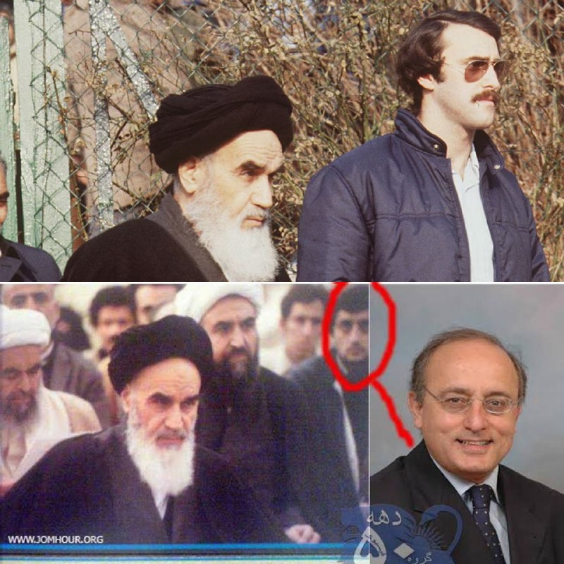

طنز ماجرا اینجاست که یک حرومزاده به اسم محسن سازگارا دست راست خمینی و موسس سپاه میگه نه به پهلوی و از دموکراسی بگو (:

@Dirty_Kids 👻

## Dirty_Kids — post 389823

  <a href="https://t.me/Dirty_Kids/389823" target="_blank">📎 Download file</a>

✅ اپلیکیشن اندروید سایت جهانی دربی بت

💰اولین سایت جهانی با امکان شارژ و برداشت ریالی(کارت به کارت)

🔗 برای ورود فیلترشکن روی کشور مناسب قرار دهید مانند فنلاند و المان و....

😀Telegram Channel
👇
https://t.me/+bcynkEgSW2dlYTc0

## Dirty_Kids — post 389822

  

😤دنبال یه سایت شرط بندی بین المللی بودی که به ایرانیا خدمات بده؟!
⛔

👍دربی بت همون انتخاب  100%

💎ویژگی های سایت جهانی Derby Bet:

⬅️امکان شارژ امن با کارت بانکی

⬅️واریز اول دوبل شارژ می شوید(بونوس۱۰۰٪)

⬅️پر اپشن ترین سایت فعال در ایران

⬅️تسویه حساب کمتر از 5 دقیقه

⬅️برگشت بخشی از باخت به صورت هفتگی

🚨کد هدیه ثبت نام:GG007

⚠️برای دانلود اپلکیشن کلیک کنید
👉

🔔کانال دربی بت :

🪙https://t.me/+bcynkEgSW2dlYTc0

## Dirty_Kids — post 389818

جنده ننه توعه هرشب تو خیابون صیغه میشه

ذهن مریض تو که سیو کردی اینارو فقط که ناخواسته باعث شادی و خاطره بازی ما میشه

[شبی که ابرام رییسی سقط شد]

@Dirty_Kids 👻

## Dirty_Kids — post 389817

  <a href="telegram/content/Dirty_Kids_389817_1779306148.mp4" target="_blank">🎬 Download video</a>

ترامپ:
الان ایران نیروی دریایی، نیروی هوایی و همه چیزشو از دست داده تقریبا.
تنها سوال اینه که بریم کار رو تموم کنیم یا توافق رو امضا میکنن؟
ببینیم چه اتفاقی میفته.

@Dirty_Kids 👻

## Dirty_Kids — post 389816

  <a href="telegram/content/Dirty_Kids_389816_1779306149.mp4" target="_blank">🎬 Download video</a>

اجرای آهنگ "Delalım" توسط ایلکا حسابی سر و صدا به پا کرد

@Dirty_Kids 👻

## Hranews — post 113068

  

میان موشک و سرکوب؛ گزارش مجموعه فعالان حقوق بشر درباره مخاصمه نظامی ایالات متحده-اسرائیل و ایران منتشر شد 
💥
💥
💥
💥
💥 – امروز، مجموعه فعالان حقوق بشر در ایران گزارش جدیدی را در ۲۴۰ صفحه و دو زبان منتشر کرد که به بررسی کارزار نظامی ایالات متحده و اسرائیل در ایران…

## Hranews — post 113067

دستکم ۲ تجمع اعتراضی برگزار شد

❗️
❗️
❗️
❗️
❗️ – امروز چهارشنبه ۳۰ اردیبهشت ماه، شماری از کارگران قراردادی شرکت پایانه‌ها و مخازن پتروشیمی ماهشهر در اعتراض به کسر مزایای مزدی خود، تجمع اعتراضی برگزار کردند. همچنین، جمعی از کارگران شهرداری زنجان نیز در اعتراض به حذف اضافه کاری و عدم افزایش حقوق؛ دست به #تجمع اعتراضی زدند.

ادامه مطلب

↘️
@hranews_bot تماس ✉️ -  @Hranews  کانال هرانا 🆑

## Hranews — post 113066

  

میان موشک و سرکوب؛ گزارش مجموعه فعالان حقوق بشر درباره مخاصمه نظامی ایالات متحده-اسرائیل و ایران منتشر شد 
💥
💥
💥
💥
💥 – امروز، مجموعه فعالان حقوق بشر در ایران گزارش جدیدی را در ۲۴۰ صفحه و دو زبان منتشر کرد که به بررسی کارزار نظامی ایالات متحده و اسرائیل در ایران…

## Hranews — post 113065

جرائم مواد مخدر؛ یک زندانی در زندان ساری اعدام شد

❗️
❗️
❗️
❗️
❗️ – سحرگاه روز یکشنبه ۱۳ اردیبهشت ماه، حکم یک زندانی که پیشتر بابت اتهامات مرتبط با جرائم مواد مخدر به #اعدام محکوم شده بود، در زندان ساری به اجرا در آمد.

ادامه مطلب

#یحیی_سبحانی

↘️
@hranews_bot تماس ✉️ -  @Hranews  کانال هرانا 🆑

## Hranews — post 113064

ضبط تجهیزات استارلینک؛ یک شهروند در هرمزگان بازداشت شد

❗️
❗️
❗️
❗️
❗️– فرماندهی انتظامی شهرستان خمیر واقع در استان هرمزگان در اطلاعیه‌ای از بازداشت یک شهروند در این شهرستان و ضبط تجهیزات اینترنت ماهواره‌ای استارلینک از وی خبر داد.

ادامه مطلب

↘️
@hranews_bot تماس ✉️ - @Hranews کانال هرانا 🆑

## Hranews — post 113063

بازماندگان از تحصیل بیشترین سهم از آمار خودکشی در خراسان شمالی را دارند

❗️
❗️
❗️
❗️
❗️– معاون اجتماعی و پیشگیری از وقوع جرم دادگستری خراسان شمالی اعلام کرد که طی پنج سال اخیر، بازماندگان از تحصیل، بالاترین سهم را در میان موارد #خودکشی در این استان به خود اختصاص داده‌اند.

ادامه مطلب

↘️
@hranews_bot تماس ✉️ - @Hranews کانال هرانا 🆑

## Hranews — post 113062

  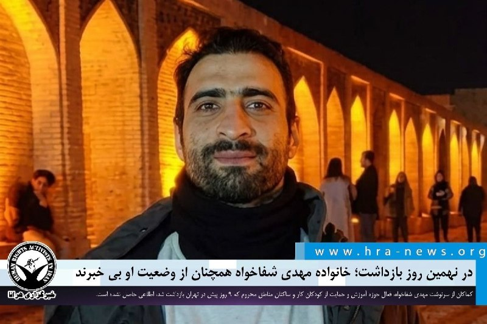

در نهمین روز بازداشت؛ خانواده مهدی شفاخواه همچنان از وضعیت او بی خبرند

❗️
❗️
❗️
❗️
❗️– کماکان از سرنوشت مهدی شفاخواه، فعال حوزه آموزش و حمایت از کودکان کار و ساکنان مناطق محروم که ۹ روز پیش در تهران بازداشت شد، اطلاعی حاصل نشده است. این وضعیت منجر به افزایش نگرانی‌های خانواده آقای شفاخواه شده است.

به گزارش خبرگزاری هرانا، ارگان خبری مجموعه فعالان حقوق بشر در ایران، مهدی شفاخواه، فعال اجتماعی کماکان در بازداشت به‌سر می‌برد.

یک منبع مطلع از وضعیت این فعال اجتماعی ضمن تایید این خبر به هرانا گفت: ۹ روز است که از بازداشت آقای شفاخواه می‌گذرد و وی همچنان از دسترسی به وکیل محروم مانده است. با وجود مراجعه برادر او، رضا شفاخواه، که خود وکیل دادگستری است، به خانواده اعلام شده که وی تنها امکان استفاده از وکلای مورد تأیید تبصره ماده ۴۸ را دارد.
همچنین، مراجعات مکرر خانواده این شهروند به مراجع قضایی و امنیتی برای کسب اطلاع از سرنوشت وی، تاکنون بی نتیجه بوده است.

#مهدی_شفاخواه

ادامه مطلب

↘️
@hranews_bot تماس ✉️ - @Hranews کانال هرانا 🆑

## Hranews — post 113061

زندان اوین؛ گزارشی از اعتصاب کریگ و لیندزی فورمن، زوج بریتانیایی

❗️
❗️
❗️
❗️
❗️– کریگ فورمن و لیندزی فورمن، دو شهروند بریتانیایی محبوس در زندان اوین، در اعتراض به شرایط نگهداری‌شان در زندان و قطع امکان برقراری تماس تلفنی با خانواده، دست به اعتصاب زده‌اند.

#کریگ_فورمن #لیندزی_فورمن

ادامه مطلب

↘️
@hranews_bot تماس ✉️ - @Hranews کانال هرانا 🆑

## Hranews — post 113060

  

پس از نقض حکم اعدام در دیوان عالی کشور؛ احکام جدید متهمان پرونده “شهرک اکباتان” صادر شد

❗️
❗️
❗️
❗️
❗️– حکم شش تن از متهمان پرونده موسوم به “#شهرک_اکباتان” توسط شعبه ۱۳ دادگاه کیفری یک استان تهران صادر شد. بر اساس رای صادره، میلاد آرمون، علیرضا کفایی و امیرمحمد خوش‌اقبال به اتهام مشارکت در قتل، هر یک به پرداخت دیه و حبس محکوم شدند. همچنین نوید نجاران، حسین نعمتی و علیرضا برمرزپورناک از اتهام مشارکت در قتل تبرئه شدند. حکم اعدام این افراد پیشتر در دیوان عالی کشور نقض شده بود.

به گزارش خبرگزاری هرانا، ارگان خبری مجموعه فعالان حقوق بشر در ایران، حکم متهمان پرونده موسوم به “شهرک اکباتان” توسط شعبه ۱۳ دادگاه کیفری یک استان تهران صادر شد.

بر اساس حکم صادره، میلاد آرمون، علیرضا کفایی و امیرمحمد خوش‌اقبال از بابت اتهام مشارکت در قتل عمد، هر یک به پرداخت سهمی مساوی از دیه کامل یک انسان و تحمل ۵ سال حبس محکوم شدند. همچنین علیرضا برمرزپورناک، حسین نعمتی و نوید نجاران، سه متهم دیگر این پرونده، به دلیل فقدان مدارک دال بر وارد کردن ضربه به ناحیه مشخصی از بدن آرمان علی‌وردی، از اتهام مشارکت در قتل عمد تبرئه شدند.
حکم مذکور در تاریخ ۱۵ بهمن ماه سال گذشته صادر و روز گذشته به وکلای این متهمان ابلاغ شده است.

#میلاد_آرمون #علیرضا_کفایی #امیرمحمد_خوش‌اقبال #علیرضا_برمرزپورناک #حسین_نعمتی #نوید_نجاران

ادامه مطلب

↘️
@hranews_bot تماس ✉️ - @Hranews کانال هرانا 🆑

## Hranews — post 113059

  

گزارشی از بازداشت و آزادی مجید کریمی در تهران

❗️
❗️
❗️
❗️
❗️– روز جمعه ۲۵ اردیبهشت ماه، مجید کریمی، با قرار وثیقه آزاد شد. وی، مورخ ۲۴ اردیبهشت ماه توسط نیروهای امنیتی در تهران بازداشت شده بود.

به گزارش خبرگزاری هرانا، ارگان خبری مجموعه فعالان حقوق بشر در ایران، مجید کریمی آزاد شد.

بر اساس این گزارش، آزادی مجید کریمی روز جمعه ۲۵ اردیبهشت ماه پس از اتمام مراحل بازجویی با قرار وثیقه از یکی از بازداشتگاه های امنیتی تهران صورت گرفته است.

#مجید_کریمی

ادامه مطلب

↘️
@hranews_bot تماس ✉️ - @Hranews کانال هرانا 🆑

## Hranews — post 113057

قوه قضاییه؛ رشید مظاهری به اتهام “فعالیت تبلیغی بر خلاف امنیت ملی” در زندان است

❗️
❗️
❗️
❗️
❗️– مرکز رسانه قوه قضاییه اعلام کرد که رشید مظاهری، بازیکن سابق فوتبال، از بابت اتهاماتی از جمله «فعالیت تبلیغی بر خلاف امنیت ملی» بازداشت و به زندان منتقل شده است.

#رشید_مظاهری

ادامه مطلب

↘️
@hranews_bot تماس ✉️ - @Hranews کانال هرانا 🆑

## officialrezapahlavi — post 1834

نسخه کامل گفتگو در نشست آینده تکنولوژی ایران

این نشست روز ۱۶ مه (۲۶ اردیبهشت) در محل دفتر مرکزی شرکت «اوبر» در شهر سان‌فرانسیسکو در ایالت کالیفرنیای آمریکا برگزار شد.

@OfficialRezaPahlavi

## manototv — post 105703

  <a href="telegram/content/manototv_105703_1779306153.mp4" target="_blank">🎬 Download video</a>

‌
دونالد ترامپ گفت آمریکا در آستانه تصمیم‌گیری درباره ایران قرار دارد و اگر پاسخ‌های مورد نظر واشینگتن دریافت نشود، تحولات می‌تواند «خیلی سریع» رخ دهد.

ترامپ گفت: «اگر پاسخ‌های درست را نگیریم، همه‌چیز خیلی سریع پیش خواهد رفت. ما کاملاً آماده‌ایم.»

او تأکید کرد هرگونه پاسخ از سوی جمهوری اسلامی باید «کامل و صددرصد قابل قبول» باشد و افزود در صورت دستیابی به توافق، «زمان، انرژی و جان انسان‌های زیادی» حفظ خواهد شد.

رئیس‌جمهوری آمریکا همچنین گفت ممکن است تصمیم‌گیری ظرف چند روز انجام شود، اما تأکید کرد روند تحولات می‌تواند «بسیار سریع» باشد.

ترامپ در ادامه ایران را «کشوری شکست‌خورده» توصیف کرد و گفت آمریکا اکنون با افرادی مذاکره می‌کند که به گفته او «بسیار منطقی‌تر» از مقام‌های پیشین جمهوری اسلامی هستند.

او افزود: «ما با افرادی بااستعداد و باهوش طرف هستیم و از این موضوع تحت تأثیر قرار گرفته‌ایم.»

ترامپ همچنین گفت اگر با چند روز صبر کردن بتوان از جنگ یا کشته شدن انسان‌ها جلوگیری کرد، «این کار ارزش انجام دادن دارد.»

## manototv — post 105702

  <a href="telegram/content/manototv_105702_1779306155.mp4" target="_blank">🎬 Download video</a>

تماسی از ایران:
«می‌گفت دیکتاتوری با بازتولید ظلم ادامه پیدا می‌کنه…
می‌گفت باید این چرخه رو شکست؛
با اعتصاب و نایستادن پای این شرایط.»

## manototv — post 105701

  <a href="telegram/content/manototv_105701_1779306156.mp4" target="_blank">🎬 Download video</a>

‌
دونالد ترامپ درباره مذاکرات با جمهوری اسلامی گفت آمریکا تا زمان دستیابی به توافق، هیچ‌گونه تخفیف یا امتیازی ارائه نخواهد کرد.

ترامپ همچنین گفت واشینگتن «چند روز» منتظر پاسخ تهران خواهد ماند.

رئیس جمهور آمریکا در ادامه تاکید کرد: «این موضوع به‌زودی، به هر شکلی که باشد، پایان خواهد یافت.»

او با اشاره به روند مذاکرات افزود: «ما با افراد منطقی طرف هستیم» و تأکید کرد: «باید به پاسخ درست برسیم.»

## manototv — post 105700

  <a href="telegram/content/manototv_105700_1779306157.mp4" target="_blank">🎬 Download video</a>

وزارت دادگستری آمریکا علیه رائول کاسترو، رئیس‌جمهوری پیشین کوبا و برادر فیدل کاسترو، اعلام جرم کرد.

بر اساس کیفرخواستی که در دادگاه فدرال میامی منتشر شده، رائول کاسترو ۹۴ ساله به همراه پنج نفر دیگر به اتهام قتل، توطئه برای کشتن شهروندان آمریکایی و انهدام هواپیما متهم شده‌اند.

این پرونده به سرنگونی دو هواپیمای متعلق به گروه «برادران نجات» در سال ۱۹۹۶ مربوط می‌شود؛ گروهی از تبعیدیان کوبایی که برای کمک به پناهجویان کوبایی فعالیت می‌کردند. در آن حادثه، چهار نفر کشته شدند.

آمریکا می‌گوید جنگنده‌های کوبایی این هواپیماها را بر فراز آب‌های بین‌المللی هدف قرار داده‌اند، اما دولت کوبا همواره مدعی بوده این هواپیماها وارد حریم هوایی این کشور شده بودند.

این اقدام که بخشی از کارزار فشار دولت ترامپ علیه حکومت کمونیستی کوباست، تنش‌ها میان واشینگتن و هاوانا را به سطح تازه‌ای رسانده است

## manototv — post 105699

  <a href="telegram/content/manototv_105699_1779306158.mp4" target="_blank">🎬 Download video</a>

‌
سنتکام، ستاد فرماندهی مرکزی آمریکا، با انتشار ویدیویی اعلام کرد تفنگداران دریایی آمریکا در خلیج عمان یک نفتکش تجاری با پرچم ایران را متوقف و بازرسی کرده‌اند.

به گفته سنتکام، نیروهای «واحد اعزامی سی‌ویک تفنگداران دریایی آمریکا» ساعاتی پیش سوار نفتکش «سلستیال سی» شدند؛ کشتی‌ای که به تلاش برای نقض محاصره دریایی آمریکا و حرکت به‌سوی یکی از بنادر ایران مظنون بوده است.

سنتکام اعلام کرد نیروهای آمریکایی پس از بازرسی کامل نفتکش، به خدمه دستور تغییر مسیر دادند و سپس کشتی را آزاد کردند.

در بیانیه سنتکام آمده است نیروهای آمریکا همچنان «به‌طور کامل» محاصره دریایی را اجرا می‌کنند و تاکنون مسیر ۹۱ کشتی تجاری را برای اطمینان از رعایت این محدودیت‌ها تغییر داده‌اند.

## manototv — post 105698

این خالکوبی فقط یک نقش روی صورتش نیست…
زخمِ نسلی‌ست که سال‌ها درد را نفس کشید، فریاد زد، سکوت کرد، گریه کرد، شکست، ایستاد، اما فراموش نکرد.

یادِ کودکانی‌ست که جنگ و ترس را زودتر از زندگی شناختند.

او می‌خواهد مردم هر بار که به این طرح روی صورتش نگاه می‌کنند، قصه‌ی روزهایی را به یاد بیاورند که از میان آتش، ترس، درد، ناامیدی و امید عبور کردند.

اما این فقط درد نیست…
این تتو، یادآور امید و زندگی هم هست.
یادآور روزهایی که هنوز برای ساختنشان زنده‌اند.

درست است که این تتو، طرحی از «God of War» است…
اما آن را به رنگ سبز انتخاب کرده‌اند؛ به نشانه عشق، صلح، امید و زندگی.

برای اینکه حقیقت فراموش نشود،
برای اینکه نسل بعد بداند مردم از چه روزهایی عبور کردند…
و چگونه با تمام زخم‌هایشان، هنوز عاشق ایران و ایرانی ماندند.

فراموش نکنید…
وقتی انسان‌ها برای شرافت، معرفت، عشق و گذشت ارزش قائل نشوند، ارزش‌ها کم‌کم معنای خودشان را از دست می‌دهند.

اول به انسان‌ها، بعد به حیوانات و در نهایت به طبیعت و گیاهان رحم کنیم و عشق بورزیم…
شاید دنیا هم یاد بگیرد که با ما مهربان‌تر باشد.

او سوخت…
آن‌ها سوختند…

یادتان نرود…
یادمان نرود.

## manototv — post 105697

  <a href="telegram/content/manototv_105697_1779306159.mp4" target="_blank">🎬 Download video</a>

نیروی دریایی سپاه اعلام کرده طی ۲۴ ساعت گذشته ۲۶ کشتی از تنگه هرمز عبور کرده‌اند.
با این حال، رویترز می‌نویسد این روند که در ظاهر نشانه‌ای از باز شدن مسیر کشتیرانی است، در عمل می‌تواند نشانه‌ای از افزایش کنترل جمهوری‌اسلامی بر این آبراه راهبردی باشد.
تهران پیش‌تر اعلام کرده بود در صورت دریافت هزینه یا عوارض از کشتی‌های تجاری، امکان بازگشایی تنگه هرمز را بررسی خواهد کرد؛ آبراهی که حدود یک‌پنجم صادرات نفت جهان از آن عبور می‌کند.
بر اساس این گزارش و به نقل از ۲۰ منبع، جمهوری‌اسلامی اکنون ایست‌های بازرسی نظامی، بررسی کشتی‌ها، ترتیبات دیپلماتیک و در برخی موارد دریافت هزینه امنیتی برای عبور ایمن را در این مسیر اعمال کرده است.
رویترز همچنین می‌گوید تهران در عمل در حال ایجاد یک «سازوکار پیچیده و چندلایه» است که به کشتی‌ها اجازه عبور می‌دهد، اما تنها در صورتی که از سوی نیروهای جمهوری‌اسلامی تأیید شوند.

## manototv — post 105696

  <a href="telegram/content/manototv_105696_1779306159.mp4" target="_blank">🎬 Download video</a>

تیم ملی فوتبال ایران هنوز ویزای آمریکا برای جام جهانی را دریافت نکرده است.

مقام‌های ایرانی گفته‌اند بازیکنان و اعضای کادر فنی تیم ملی هنوز موفق به دریافت ویزا برای حضور در جام جهانی ۲۰۲۶ در آمریکا نشده‌اند و قرار است برای دریافت ویزا از طریق سفارت کانادا در ترکیه اقدام کنند.

تیم ملی ایران قرار است ۱۵ ژوئن در نخستین بازی خود در گروه G در لس‌آنجلس به مصاف نیوزیلند برود و سپس برابر بلژیک و مصر بازی کند.

## manototv — post 105695

  <a href="telegram/content/manototv_105695_1779306160.mp4" target="_blank">🎬 Download video</a>

دونالد ترامپ، رئیس‌جمهور آمریکا، در ادامه سخنرانی خود در آکادمی گارد ساحلی آمریکا در ایالت کنتیکت گفت این نیرو نقش مهمی در عملیات «خشم حماسی» داشته است. ترامپ گفته گارد ساحلی آمریکا در اجرای محاصره علیه ایران کمک کرده و نمونه‌ای از آن را توقیف یک نفتکش ایرانی تحریم‌شده در نزدیکی سواحل مالزی عنوان کرد؛ نفتکشی که به گفته او نفت را از جزیره خارک حمل می‌کرده است.
او خطاب به حضار گفت: «این سومین کشتی ایرانیِ تحریم‌شده است که گارد ساحلی از زمان آغاز درگیری‌ها درگیری واقعی در توقیف آن کمک کرده است.»
ترامپ افزود: «با ایران و احتمالا موارد بیشتری هم در راه است، مگر اینکه آن‌ها عاقل شوند.» او همچنین گفته او گفت: «همه‌چیزشان از بین رفته؛ نیروی دریایی‌شان نابود شده، نیروی هوایی‌شان از بین رفته، تقریباً همه‌چیز.»
ترامپ افزود: «تنها سوال این است که آیا می‌رویم و کار را تمام می‌کنیم یا آن‌ها قرار است یک توافق امضا کنند. باید ببینیم چه اتفاقی می‌افتد.»

## manototv — post 105694

  <a href="telegram/content/manototv_105694_1779306160.mp4" target="_blank">🎬 Download video</a>

اسماعیل بقائی، سخنگوی وزارت خارجه جمهوری‌اسلامی اعلام کرده روند تبادل پیام‌ها میان جمهوری‌اسلامی و آمریکا «بر اساس متن ۱۴‌بندی پیشنهادی ایران» همچنان ادامه دارد و حضور وزیر کشور پاکستان در این روند با هدف «تسهیل مبادله پیام‌ها» میان دو طرف انجام شده است. وزیر کشور پاکستان امروز برای دومین بار طی یک هفته به تهران سفر کرد. به گفته سخنگوی وزارت خارجه نظام، تمرکز تهران بر «خاتمه جنگ در تمامی جبهه‌ها از جمله لبنان»، آزادسازی پول‌های بلوکه شده ایران، و توقف «راهزنی دریایی‌» اشاره به محاصره دریایی آمریکا در تنگه هرمز است.

## manototv — post 105693

  <a href="telegram/content/manototv_105693_1779306161.mp4" target="_blank">🎬 Download video</a>

دونالد ترامپ، رئیس‌جمهور آمریکا، در سخنرانی خود در مراسم فارغ‌التحصیلی آکادمی گارد ساحلی آمریکا در نیو لندنِ ایالت کنتیکت، بار دیگر جمهوری‌اسلامی را درباره برنامه هسته‌ای‌اش تهدید کرد و رسانه‌ها را «اخبار جعلی» خواند.
ترامپ که پشت شیشه ضدگلوله سخنرانی می‌کرد، پس از پرداختن به مسائل داخلی آمریکا، دوباره به موضوع ایران بازگشت و گفت: «ما اجازه نخواهیم داد ایران به سلاح هسته‌ای دست پیدا کند. موضوع همین‌قدر ساده است.»
او همچنین گفت جمهوری‌اسلامی «به‌شدت» خواهان توافق است و افزود: «باید ببینیم چه اتفاقی می‌افتد.»
ترامپ با اشاره به حملات آمریکا گفت: «ما ضربات بسیار سختی به آن‌ها زدیم و شاید مجبور شویم حتی شدیدتر هم ضربه بزنیم.»

## manototv — post 105692

  <a href="telegram/content/manototv_105692_1779306161.mp4" target="_blank">🎬 Download video</a>

در پی تیراندازی افراد مسلح به نیروهای پلیس در یکی از محورهای شهرستان سراوان در استان سیستان و بلوچستان، یک مامور پلیس کشته شد.
بر اساس گزارش‌ها، سرنشینان مسلح یک خودروی سواری به سمت نیروهای امنیتی تیراندازی کردند که در نتیجه آن، ستوان سوم امیرحسین شهرکی جان خود را از دست داد.
پلیس اعلام کرده افراد مهاجم تحت تعقیب قرار گرفته‌اند و طرح‌های امنیتی و انتظامی در مناطق اطراف در حال اجراست.

## manototv — post 105691

  <a href="telegram/content/manototv_105691_1779306162.mp4" target="_blank">🎬 Download video</a>

وزیر خارجه عربستان از تصمیم ترامپ برای تعویق حمله به ایران استقبال کرد.

فیصل بن فرحان، وزیر خارجه عربستان سعودی، در پیامی در شبکه اکس نوشت کشورش از تصمیم دونالد ترامپ برای دادن زمان بیشتر به مذاکرات با تهران استقبال می‌کند و ریاض از «فرصت دادن به دیپلماسی» برای پایان جنگ و بازگرداندن امنیت و آزادی کشتیرانی در تنگه هرمز حمایت می‌کند.

بن فرحان همچنین از جمهوری اسلامی خواست «فوراً» به تلاش‌ها برای پیشبرد مذاکرات و دستیابی به توافقی جامع پاسخ دهد.

## manototv — post 105690

  <a href="telegram/content/manototv_105690_1779306163.mp4" target="_blank">🎬 Download video</a>

انفجار خودروی متعلق به سازمان حمل‌ونقل نیویورک در نزدیکی وال‌استریت، باعث وحشت و فرار عابران شد.

ویدیوهای منتشرشده نشان می‌دهد این خودرو پس از آتش‌گرفتن، مقابل ساختمان مرکزی «ام‌تی‌ای» در منهتن به گلوله‌ای از آتش تبدیل شد.

آتش‌نشانی نیویورک اعلام کرد این حادثه تلفاتی نداشته و علت آن در دست بررسی است.

## manototv — post 105689

  <a href="telegram/content/manototv_105689_1779306164.mp4" target="_blank">🎬 Download video</a>

‌
الجزیره به نقل از «منابع دیپلماتیک» گزارش داد شمار کشورهای حامی پیش‌نویس قطعنامه درباره تنگه هرمز به ۱۳۶ کشور رسیده است.

پیش‌نویس این قطعنامه از جمهوری اسلامی می‌خواهد حملات و مین‌گذاری در تنگه هرمز را متوقف کند، اما دیپلمات‌ها می‌گویند در صورت مطرح شدن برای رأی‌گیری، احتمالاً با وتوی چین و روسیه روبه‌رو خواهد شد.

چین و روسیه ماه گذشته نیز قطعنامه مشابهی را که با حمایت آمریکا ارائه شده بود، وتو کرده بودند و آن را جانبدارانه علیه جمهوری اسلامی دانستند.

## manototv — post 105688

  <a href="telegram/content/manototv_105688_1779306165.mp4" target="_blank">🎬 Download video</a>

فرانسه پس از انتشار ویدیویی از برخورد با فعالان ناوگان امدادی عازم غزه، سفیر اسرائیل را احضار می‌کند. ایتالیا نیز پیش‌تر اقدام مشابهی انجام داده بود.
ژان‌نوئل بارو، وزیر خارجه فرانسه، رفتار ایتامار بن‌گویر، وزیر امنیت ملی اسرائیل از جناح راست افراطی، با فعالان بین‌المللی را «غیرقابل قبول» توصیف کرد و گفت پاریس خواهان توضیح رسمی از اسرائیل است.
این واکنش‌ها پس از انتشار ویدیویی از سوی بن‌گویر مطرح شد که او را در محل نگهداری فعالان «فلوتیلا گلوبال سومود» نشان می‌دهد؛ کاروانی متشکل از ده‌ها قایق و صدها فعال از کشورهای مختلف که چند روز پیش در آب‌های بین‌المللی، حدود ۲۵۰ مایل دریایی از غزه، توسط نیروی دریایی اسرائیل متوقف شد.
اسرائیل این کاروان را «تحریک‌آمیز» و حامی حماس توصیف کرده و فعالان را به بندر اشدود منتقل کرده است.
در ویدیوی منتشرشده، بن‌گویر در حالی که پرچم اسرائیل در دست دارد، مقابل فعالان دست‌بندزده می‌گوید: «به اسرائیل خوش آمدید، ما صاحب‌خانه‌ایم» و آن‌ها را «حامی تروریسم» می‌خواند. او همچنین از بنیامین نتانیاهو خواسته این افراد «برای مدت طولانی» در زندان نگهداری شوند.
این ویدیو در چند ساعت نخست بیش از ۱.۷ میلیون بار دیده شد و موجی از واکنش‌های تند را در اسرائیل و خارج از این کشور به‌دنبال داشت.
برخی مقام‌های اسرائیلی، از جمله گیدئون ساعر، وزیر خارجه اسرائیل، رفتار بن‌گویر را آسیب‌زننده به وجهه اسرائیل دانسته‌اند. دفتر نتانیاهو نیز با دفاع از توقیف ناوگان، اعلام کرده نحوه برخورد بن‌گویر «با ارزش‌ها و هنجارهای اسرائیل همخوانی ندارد» و خواستار اخراج سریع فعالان شده است.

## manototv — post 105687

  <a href="telegram/content/manototv_105687_1779306166.mp4" target="_blank">🎬 Download video</a>

‌
دونالد ترامپ، رئیس‌جمهوری آمریکا، با اشاره به وضعیت داخلی ایران گفت مطمئن نیست مقام‌های جمهوری اسلامی «خیر و صلاح مردم» را بخواهند.

ترامپ گفت: «بعضی از کارهایی که با من می‌کنند نشان می‌دهد که خیر مردم را نمی‌خواهند، در حالی که باید خیر مردم را بخواهند.»

او همچنین از افزایش نارضایتی عمومی در ایران سخن گفت و افزود: «الان خشم زیادی در ایران وجود دارد، چون مردم در شرایط بسیار بدی زندگی می‌کنند.»

رئیس‌جمهوری آمریکا همچنین گفت در ایران «ناآرامی و التهاب زیادی» وجود دارد که به گفته او، مشابه آن پیش‌تر دیده نشده است.

## manototv — post 105686

  <a href="telegram/content/manototv_105686_1779306167.mp4" target="_blank">🎬 Download video</a>

محمدباقر قالیباف، رئیس مجلس شورای اسلامی، در آنچه رسانه‌های حکومتی «سومین فایل صوتی» توصیف کرده‌اند از جمله گفته «تحرکات آشکار و پنهان دشمن نشان می‌دهد که طرف مقابل به‌دنبال آغاز دور جدیدی از جنگ است.»

## manototv — post 105685

  <a href="telegram/content/manototv_105685_1779306167.mp4" target="_blank">🎬 Download video</a>

مدیرعامل شرکت ملی نفت ابوظبی، اعلام کرده است امارات متحده عربی اجرای طرح ساخت یک خط لوله جدید برای دور زدن تنگه هرمز را پیش برده و این پروژه اکنون ۵۰ درصد پیشرفت داشته است.
در حال حاضر خط لوله عملیاتی امارات، خط لوله حبشان–فجیره است که از میادین نفتی حبشان در جنوب‌غرب ابوظبی تا بندر فجیره در دریای عمان امتداد دارد.
این خط لوله در حال حاضر توان انتقال تا ۱.۸ میلیون بشکه نفت در روز را دارد. تاسیسات نفتی فجیره از زمان آغاز جنگ چندین بار هدف حملات پهپادی منتسب به ایران قرار گرفته است.
بر اساس اعلام مقامات اماراتی، خط لوله جدید قرار است ظرفیت کل صادرات نفت این کشور را تا سال آینده دو برابر کند.

## manototv — post 105684

  <a href="telegram/content/manototv_105684_1779306168.mp4" target="_blank">🎬 Download video</a>

دادبان پیرامون پرونده اکباتان گزارش داده شعبه ۱۳ دادگاه کیفری یک استان تهران در رای جدید خود، اعلام کرده که در این پرونده امکان صدور حکم قصاص وجود ندارد. بر اساس حکم جدید، میلاد آرمون، علیرضا کفایی و امیرمحمد خوش‌اقبال به اتهام مشارکت در قتل عمد، هر کدام به پرداخت دیه کامل به‌صورت مساوی و تحمل ۵ سال حبس محکوم شده‌اند.
در همین پرونده، علیرضا برمرزپورناک، حسین نعمتی و نوید نجاران از اتهام مشارکت در قتل عمد تبرئه شده‌اند. دادگاه دلیل این تصمیم را نبود ادله کافی درباره این موضوع عنوان کرده که ضربه مرگبار دقیقا توسط چه فردی وارد شده است.
در رای صادر شده تاکید شده که هر چند متهمان در درگیری و ضرب‌وشتم آرمان علی‌وردی، بسیجی کشته‌شده در جریان اعتراضات سراسری ۱۴۰۱ حضور داشته‌اند، اما به دلیل مشخص نبودن عامل ضربه منجر به فوت، شرایط صدور حکم قصاص فراهم نیست.
این در حالی است که پیش‌تر همین شعبه در رای متفاوت، این شش متهم را به قصاص محکوم کرده بود؛ حکمی که بعدا با نظر دیوان عالی کشور نقض و برای رسیدگی مجدد به دادگاه بدوی بازگردانده شد.

## alonews — post 121411

🌟 اشتراک v2ray استارلینک 
🗯گیگی 150,000 تومان 
🔗لینک ساب برا چک کردن مصرف و حجمتون 
🔥سرعت و کیفیت بالا 
✅ پشتیبانی دائم 
📱جهت خرید پیام بدین : @v2safeBot

## alonews — post 121410

  

🌟 اشتراک v2ray استارلینک

🗯گیگی 150,000 تومان

🔗لینک ساب برا چک کردن مصرف و حجمتون

🔥سرعت و کیفیت بالا

✅ پشتیبانی دائم

📱جهت خرید پیام بدین : @v2safeBot

## alonews — post 121409

  <a href="telegram/content/alonews_121409_1779306169.webm" target="_blank">🎬 Download video</a>

🔴فووووووووووووووووووووووووووری

## alonews — post 121408

🔴فووووووووووووووووووووووووووری

## alonews — post 121407

  <a href="telegram/content/alonews_121407_1779306169.webm" target="_blank">🎬 Download video</a>

👈 ترامپ درباره ایران: «شرایط در نقطه حساسی است، باور کنید. اگر پاسخ‌های درست را نگیریم، خیلی سریع پیش می‌رود. همه چیز آماده است. باید پاسخ‌های درست را بگیریم، پاسخ‌ها باید ۱۰۰٪ کامل و خوب باشند.»

✅ @AloNews خبر جنگ

## alonews — post 121406

  <a href="telegram/content/alonews_121406_1779306169.mp4" target="_blank">🎬 Download video</a>

👈خبرنگار : قصد داری به اونا ( ایران) حمله کنی‌؟

🔴ترامپ : چرا باید اینو بهت بگم

✅ @AloNews خبر جنگ

## alonews — post 121405

  <a href="telegram/content/alonews_121405_1779306171.mp4" target="_blank">🎬 Download video</a>

👈خبرنگار : از این رفت و برگشت با ایران خسته نمیشی؟

🔴 ترامپ : من هیچوقت خسته نمیشم ولی اگه با چند روز صبر کردن بشه جلوی جنگ و کشته شدن مردم رو گرفت کار خوبیه

✅ @AloNews خبر جنگ

## alonews — post 121404

  <a href="telegram/content/alonews_121404_1779306172.webm" target="_blank">🎬 Download video</a>

👈 امروز اوایل روز، بحث داغی در داخل کاخ سفید درباره ایران شکل گرفت، جایی که جی‌دی ونس، استیو ویتکاف و جرد کوشنر برای توافق اولیه‌ای جهت پایان دادن به جنگ تلاش می‌کردند، در حالی که پیت هگست و مارکو روبیو برای فشار بیشتر و احتمال اقدام نظامی استدلال می‌کردند - گزارش آکسیوس

✅ @AloNews خبر جنگ

## alonews — post 121403

  <a href="telegram/content/alonews_121403_1779306173.mp4" target="_blank">🎬 Download video</a>

👈ترامپ در تماس خود با اردوغان ترکیه: من تماس بسیار خوبی با رئیس‌جمهور اردوغان داشتم. ما رابطه بسیار خوبی داریم.

🔴آیا خوب نیست که من با برخی افراد بسیار سرسخت رابطه دارم؟ او فردی سرسخت است، اما من رابطه‌ای با او دارم که هیچ کس دیگر ندارد.

🔴او در واقع کار خوبی انجام داده است. او، می‌دانید، من فکر می‌کنم که بسیار متحد بوده است. برخی افراد ممکن است در این شک داشته باشند، اما من فکر می‌کنم او یک متحد عالی بوده و مردمش به او احترام می‌گذارند. مردمش خیلی به او احترام می‌گذارند.

✅ @AloNews خبر جنگ

## alonews — post 121402

  <a href="telegram/content/alonews_121402_1779306174.mp4" target="_blank">🎬 Download video</a>

👈 گزارشگر: آیا آمریکا در جریان مذاکرات صلح، لغو تحریم‌های نفتی علیه ایران را پیشنهاد داده است، همانطور که رسانه‌های دولتی ایران گزارش داده‌اند؟

🔴ترامپ: نه، من چنین چیزی نشنیده‌ام. تا زمانی که آنها توافقنامه‌ای امضا نکنند، هیچ لغویی انجام نمی‌دهم.

🔴وقتی آنها توافقنامه را امضا کنند، می‌توانیم آنجا را دوباره بسازیم و چیزی داشته باشیم که واقعاً برای مردم کشور خوبی باشد.

🔴اما نه، ما هیچ پیشنهادی نداده‌ایم

✅ @AloNews خبر جنگ

## alonews — post 121401

  <a href="telegram/content/alonews_121401_1779306176.mp4" target="_blank">🎬 Download video</a>

👈ترامپ : کوبا یه کشور شکست خورده‌ست نفت ندارن ما اونجاییم که کمک کنیم داریم کوبا رو آزاد می‌کنیم

✅ @AloNews خبر جنگ

## alonews — post 121400

  <a href="telegram/content/alonews_121400_1779306178.mp4" target="_blank">🎬 Download video</a>

👈خبرنگار : پیامت به خانواده‌های آمریکایی که از هوش مصنوعی می‌ترسن چیه اونا نگرانن بچه‌هاشون تو آینده کار نداشته باشن

🔴 ترامپ : هوش مصنوعی فوق‌العاده‌ست ایران نباید سلاح هسته‌ای داشته باشه

✅ @AloNews خبر جنگ

## alonews — post 121399

  <a href="telegram/content/alonews_121399_1779306180.mp4" target="_blank">🎬 Download video</a>

👈ترامپ درباره ایران: ما در واقع با برخی افراد بسیار خوب سر و کار داریم.

🔴ما با افرادی که استعداد و هوش بالایی دارند، سر و کار داریم.

🔴ما بسیار تحت تأثیر قرار گرفته‌ایم.

✅ @AloNews خبر جنگ

## alonews — post 121398

  <a href="telegram/content/alonews_121398_1779306182.webm" target="_blank">🎬 Download video</a>

👈ترامپ: اگر پاسخ‌های درست درباره ایران را نگیرم، سریعاً اقدام می‌کنم؛ من به پاسخ‌های کامل و صددرصد خوب از ایران نیاز دارم

✅ @AloNews خبر جنگ

## alonews — post 121397

  <a href="telegram/content/alonews_121397_1779306182.webm" target="_blank">🎬 Download video</a>

👈 پولیتیکو: جمهوری‌خواه‌های مجلس رای‌گیری درباره اختیارات جنگ با ایران رو امروز عقب انداختن

✅ @AloNews خبر جنگ

## alonews — post 121396

  <a href="telegram/content/alonews_121396_1779306182.webm" target="_blank">🎬 Download video</a>

👈اکسیوس: منابع گفتند که قطر و پاکستان با مشارکت دیگر میانجی‌گران منطقه‌ای، یک یادداشت تفاهم اصلاح‌شده صلح را تهیه کرده‌اند تا شکاف‌های بین آمریکا و ایران را کاهش دهند

✅ @AloNews خبر جنگ

## alonews — post 121395

  <a href="telegram/content/alonews_121395_1779306182.webm" target="_blank">🎬 Download video</a>

👈مسعود پزشکیان: ایران همواره به تعهدات خود پایبند بوده و هر راهی را برای جلوگیری از جنگ بررسی کرده است؛ همه مسیرها از طرف ما باز است.

🔴وادار کردن ایران به تسلیم از طریق اجبار چیزی جز توهم نیست.

🔴احترام متقابل در دیپلماسی بسیار عاقلانه‌تر، ایمن‌تر و پایدارتر از جنگ است

✅ @AloNews خبر جنگ

## alonews — post 121394

  <a href="telegram/content/alonews_121394_1779306182.webm" target="_blank">🎬 Download video</a>

👈 عاصم منیر فردا به تهران می‌رود احتمالا خبر مهمی در راه است

🔴روزنامه ابزرور پاکستان: فیلد مارشال سید عاصم منیر، رئیس ستاد ارتش، به عنوان چهره‌ای کلیدی در روند دیپلماتیک ایران و آمریکا، فردا به ایران می‌رود. در طول این سفر احتمالی، انتظار می‌رود اعلامیه‌ای مبنی بر تأیید تکمیل پیش‌نویس نهایی توافق منتشر شود.

🔴 این سفر می‌تواند به عنوان یک نقطه عطف دیپلماتیک سطح بالا باشد، جایی که تکمیل نسخه نهایی توافق ممکن است رسماً اعلام شود

✅ @AloNews خبر جنگ

## alonews — post 121393

  <a href="telegram/content/alonews_121393_1779306182.webm" target="_blank">🎬 Download video</a>

👈امروز اوایل روز، بحث داغی در داخل کاخ سفید درباره ایران شکل گرفت، جایی که جی‌دی ونس، استیو ویتکاف و جرد کوشنر برای توافق اولیه‌ای جهت پایان دادن به جنگ تلاش می‌کردند، در حالی که پیت هگست و مارکو روبیو برای فشار بیشتر و احتمال اقدام نظامی استدلال می‌کردند - گزارش آکسیوس

✅ @AloNews خبر جنگ

## alonews — post 121392

  <a href="telegram/content/alonews_121392_1779306183.webm" target="_blank">🎬 Download video</a>

👈کلش ریپورت: اردوغان در تماس تلفنی با ترامپ درباره روابط ترکیه و آمریکا و مسائل منطقه‌ای صحبت کرد.

✅ @AloNews خبر جنگ

---
📅 بروزرسانی: 1405/02/30 14:10
---

## VahidOOnLine — post 241118

  

ایمان شمسایی، رییس مرکز ارتباطات، رسانه و امور فرهنگی مجلس، خبر استعفای محمدباقر قالیباف از ریاست هیات مذاکره‌کننده جمهوری اسلامی را «کذب محض و دروغی آشکار» خواند و منتشرکنندگان آن را به «خیانت» متهم کرد.

او در پیامی نوشت ادعای این جریان «امتداد همان خط تخریبی است که تا دیروز فرماندهان را نشانه می‌رفت و امروز شهدای والامقام را».

شمسایی افزود این جریان سابقه «هجمه» به فرماندهان نظامی، دفتر رهبر جمهوری اسلامی، مراجع تقلید و شورای عالی امنیت ملی را در کارنامه دارد.

در ادامه پیام او آمده است: «شایسته است این آقایان برای توجیه خیانت خود در شرایط جنگی پشت ژست‌های انقلابی پنهان نشوند و بیش از این به توجیه رفتارهای آسیب‌زای خود در شرایط حساس کنونی نپردازند.»

شمسایی تاکید کرد قالیباف همچنان ریاست هیات مذاکره‌کننده حکومت را بر عهده دارد و به‌تازگی نیز به پیشنهاد مسعود پزشکیان و تایید مجتبی خامنه‌ای، به‌عنوان نماینده ویژه جمهوری اسلامی در امور چین منصوب شده است.

در هفته‌های اخیر، گزارش‌های متعددی درباره اختلاف در ساختار حاکمیت جمهوری اسلامی منتشر شده است.
‌🏁 🇬🇧 IranintlTV

🤖 @VahidOOnLine

## VahidOOnLine — post 241117

  <a href="telegram/content/VahidOOnLine_241117_1779273625.mp4" target="_blank">🎬 Download video</a>

خبرگزاری حکومتی تسنیم گزارش داد که محسن نقوی، وزیر کشور پاکستان، برای دیدار و گفت‌وگو با مقام‌های جمهوری‌اسلامی راهی تهران شده است. این دومین سفر نقوی به تهران در طول یک هفته گذشته و در راستای تلاش‌های اسلام‌آباد برای میانجی‌گری میان جمهوری‌اسلامی و آمریکا است.
‌🏁 🇬🇧 ManotoTV

🤖 @VahidOOnLine

## VahidOOnLine — post 241116

  <a href="telegram/content/VahidOOnLine_241116_1779273626.mp4" target="_blank">🎬 Download video</a>

خبرگزاری رسمی اردن گزارش داد که نیروهای مسلح این کشور صبح امروز یک پهپاد ناشناس را که وارد حریم هوایی اردن شده بود، سرنگون کردند.
ارتش اردن این پهپاد را در استان جرش، در منطقه بلیلا در شمال کشور، هدف قرار داد. این حادثه تلفات جانی نداشت، اما خسارت‌های جزئی مادی بر جای گذاشت.
‌🏁 🇬🇧 ManotoTV

🤖 @VahidOOnLine

## VahidOOnLine — post 241115

  <a href="telegram/content/VahidOOnLine_241115_1779273626.mp4" target="_blank">🎬 Download video</a>

دیروز، هم‌زمان با زادروز جاویدنام پیام رخ‌بخش، خانواده و نزدیکان او بر سر مزارش در شیراز حاضر شدند و یادش را گرامی داشتند.

پیام رخ‌بخش، جوان ۳۲ ساله اهل شیراز، در ۱۹ دی‌ماه ۱۴۰۴ در جریان اعتراضات مردمی با شلیک مستقیم نیروهای حکومتی جان باخت.

حضور بر سر مزار جان‌باختگان، برای خانواده‌ها فقط سوگواری نیست؛ ادامه همان دادخواهی‌ای است که جمهوری اسلامی از آن هراس دارد.

#خانه_دوست_کجاست
‌🏁 🇬🇧 ManotoTV

🤖 @VahidOOnLine

## VahidOOnLine — post 241114

  <a href="telegram/content/VahidOOnLine_241114_1779273628.mp4" target="_blank">🎬 Download video</a>

بر اساس یک نظرسنجی جدید، اکثریت بزرگی از جمهوری‌خواهان همچنان عملکرد دونالد ترامپ در مدیریت جنگ ایران را تأیید می‌کنند.
طبق نظرسنجی انجام‌شده توسط خبرگزاری آسوشیتدپرس و مرکز پژوهش‌های امور عمومی نورک، در حالی که تنها یک‌سوم بزرگسالان آمریکایی از رویکرد رئیس‌جمهور حمایت می‌کنند، حدود دو‌سوم جمهوری‌خواهان با نحوه عملکرد او موافق هستند.
با این حال، بر اساس نظرسنجی ماه گذشته، جمهوری‌خواهان جوان‌تر بیشتر احتمال دارد که از عملکرد ترامپ در این موضوع ناراضی باشند.
علاوه بر این، تنها ۶ نفر از هر ۱۰ جمهوری‌خواه (در مقایسه با ۸ نفر از هر ۱۰ نفر در ماه فوریه) از نحوه مدیریت اقتصاد توسط رئیس‌جمهور حمایت می‌کنند؛ اقتصادی که تحت تأثیر جنگ قرار گرفته است.
‌🏁 🇬🇧 ManotoTV

🤖 @VahidOOnLine

## VahidOOnLine — post 241113

  

⭕️خبرگزاری قوه‌ قضاییه: رشید مظاهری هنگام خروج غیرقانونی از کشور بازداشت شد

♦️خبرگزاری قوه‌قضائیه گزارش داد رشید مظاهری، دروازه‌بان پیشین تیم ملی فوتبال و استقلال تهران، «هنگام تلاش برای خروج غیرقانونی از مرزهای غربی ایران بازداشت شده است.»

میزان در این گزارش رشید مظاهری را متهم کرده که «قصد داشته با تغییر چهره و پرداخت رشوه به ماموران مرزبانی از کشور خارج شود.»

قوه قضائیه به زمان بازداشت این بازیکن پیشین تیم ملی فوتبال ایران اشاره نکرده است.

رشید مظاهری پس از کشتار معترضان در ۱۸ و ۱۹ دی، با انتشار ویدیویی در پنجم اسفند، علی خامنه‌ای را مسئول کشته‌شدن معترضان معرفی کرده بود. پس از انتشار آن ویدیو، تا مدت‌ها خبری از وضعیت او منتشر نشده بود.

خبرگزاری میزان گزارش کرده که مظاهری در «بند عمومی زندان» به سر می‌برد و قرار است به اتهام‌های «پرداخت رشوه به مامور دولت»، «فعالیت تبلیغی برخلاف امنیت ملی در شرایط جنگی» و «اقدام به عبور غیرمجاز از مرز» محاکمه شود.
‌🇸🇦 Indypersian

🤖 @VahidOOnLine

## VahidOOnLine — post 241112

  

♦️خبرگزاری ایرنا روز چهارشنبه ۳۰ اردیبهشت از سفر دوباره سیدمحسن رضا نقوی، وزیر کشور پاکستان به ایران خبر داد.

رضا نقوی هفته گذشته هم به تهران سفر کرده و در مدت سه روز اقامت با مقام‌های ارشد جمهوری اسلامی گفتگو کرده بود.

پاکستان میانجی مذاکرات پایان جنگ میان تهران و واشنگتن است و بارها تاکید کرده برای پایان دادن به مخاصمه مسلحانه در منطقه با تمام توان تلاش خواهد کرد.
‌🇸🇦 Indypersian

🤖 @VahidOOnLine

## VahidOOnLine — post 241111

  

♦️ارتش اردن روز پنجشنبه اعلام کرد یک پهپاد را پس از ورود به حریم هوایی این کشور سرنگون کرده است.

مقام‌های اردنی جزئیاتی درباره مبدا یا هدف این پهپاد منتشر نکرده‌اند، اما تاکید کرده‌اند نیروهای مسلح این کشور با هرگونه تهدید علیه امنیت و حاکمیت اردن برخورد خواهند کرد.

عربستان سعودی و امارات متحده عربی اعلام کردند که هفته گذشته هدف حملات پهپادی از جانب عراق قرار گرفته‌اند.
حمله پهپادهای به محوطه تاسیسات هسته‌ای براکه امارات، باعث آسیب دیدن یکی از ژنراتورهای برق شد.

اردن در ماه‌های اخیر و هم‌زمان با افزایش تنش‌های منطقه‌ای، چندین بار از رهگیری و سرنگونی پهپادها و موشک‌ها در حریم هوایی خود خبر داده است.
یکی از پایگاه‌های نظامی آمریکا هم در جریان جنگ اخیر، چند بار هدف حمله موشک‌های سپاه قرار گرفت.
‌🇸🇦 Indypersian

🤖 @VahidOOnLine

## VahidOOnLine — post 241110

♦️وزارت دفاع روسیه اعلام کرد رزمایش نیروهای هسته‌ای این کشور که از ۲۹ تا ۳۱ اردیبهشت در جال برگزاری است، شامل تمرین‌هایی برای قرار دادن یگان‌ها و واحدهای نظامی در بالاترین سطح آمادگی رزمی برای استفاده از سلاح هسته‌ای است.
وزارت دفاع روسیه روز چهارشنبه ۳۰ اردیبهشت در بیانیه‌ای اعلام کرد: «در چارچوب رزمایش نیروهای هسته‌ای، اقدامات عملی برای آماده‌سازی یگان‌ها و واحدهای نظامی جهت استفاده از سلاح هسته‌ای در بالاترین سطح آمادگی رزمی تمرین شد.»
این رزمایش در حالی برگزار می‌شود که تنش‌های نظامی و هسته‌ای میان روسیه و غرب همچنان ادامه دارد.
‌🇸🇦 Indypersian

🤖 @VahidOOnLine

## VahidOOnLine — post 241109

  

گروه ناظر اینترنتی نت‌بلاکس اعلام کرد قطعی اینترنت در ایران امروز وارد هشتادودومین روز خود شده و از مرز ۱۹۴۴ ساعت گذشته است.
نت‌بلاکس هشدار داده در دورانی که قطع چنددقیقه‌ای اینترنت می‌تواند بحران‌زا باشد، ادامه این محدودیت‌ها در ایران همچنان به نابودی معیشت شهروندان و فرسایش حقوق اساسی آنان منجر می‌شود؛ شهروندانی که تا حد زیادی از ارتباط عادی با جهان خارج محروم مانده‌اند.
‌🏁 🇬🇧 ManotoTV

🤖 @VahidOOnLine

## VahidOOnLine — post 241108

  

روزنامه نیویورک‌تایمز به نقل از مقام‌های آمریکایی گزارش داد حمله اسرائیل به خانه محمود احمدی‌نژاد، رئیس‌جمهوری پیشین ایران، با هدف آزاد کردن او از حصر خانگی و در چارچوب طرح آمریکا و اسرائیل برای تغییر حکومت در ایران انجام شده بود.
بر اساس این گزارش، اسرائیل طراح اصلی این برنامه بوده و حتی با خود احمدی‌نژاد نیز درباره آن مشورت شده بود، اما این طرح به‌سرعت شکست خورد.
نیویورک‌تایمز همچنین به نقل از مقام‌های آمریکایی و یکی از نزدیکان احمدی‌نژاد نوشت او در نخستین روز جنگ و در جریان حمله به خانه‌اش در تهران زخمی شد، اما از این حمله جان سالم به در برد.
به نوشته این روزنامه، احمدی‌نژاد پس از این حمله و تجربه‌ای که تا آستانه مرگ پیش رفت، از پروژه تغییر حکومت فاصله گرفت. این گزارش افزوده است او از آن زمان تاکنون در انظار عمومی دیده نشده و محل حضور و وضعیت کنونی‌اش مشخص نیست.
دونالد ترامپ، رئیس‌جمهوری آمریکا، نیز چند روز پس از کشته شدن علی خامنه‌ای و شماری از مقام‌های جمهوری اسلامی در نخستین موج حملات آمریکا و اسرائیل گفته بود بهتر است «فردی از داخل ایران» اداره کشوردر دست بگیرد.
‌🏁 🇬🇧 ManotoTV

🤖 @VahidOOnLine

## VahidOOnLine — post 241107

  

♦️قیمت نفت در بازارهای جهانی روز چهارشنبه ۳۰ اردیبهشت و پس از آنکه دونالد ترامپ، رئیس جمهوری آمریکا گفت «جنگ با ایران را به سرعت خاتمه می‌دهیم»، در بازارهای جهانی نزدیک به دو دلار نسبت به روز گذشته کاهش یافت.

قیمت هر بشکه نفت خام برنت دریای شمال، صبح چهارشنبه و همزمان با آغاز به‌کار بازارهای اروپا به ۱۰۹ دلار و هفتاد یک سنت کاهش یافت.
همزمان با کاهش قیمت نفت، قیمت طلا هم افت کرد و شاخص سهام در بازارهای آسیا و اروپا افزایش یافت.
‌🇸🇦 Indypersian

🤖 @VahidOOnLine

## VahidOOnLine — post 241106

  

♦️یک مقام کاخ سفید روز سه‌شنبه ۲۹ اردیبهشت (چهارشنبه صبح به وقت تهران) به خبرگزاری رویترز گفت که دونالد ترامپ، رئیس جمهوری آمریکا، در نشست رهبران گروه ۷ در فرانسه در ماه ژوئن (خرداد) شرکت خواهد کرد.

پیش از این آکسیوس گزارش کرده بود که ترامپ می‌خواهد در مورد پیوند دادن کمک‌های ایالات متحده با تجارت، ترویج پذیرش ابزارهای هوش مصنوعی توسعه‌یافته ایالات متحده و کاهش تسلط چین بر زنجیره‌های تامین مواد معدنی حیاتی، از جمله موضوعات دیگر در این نشست صحبت کند.
‌🇸🇦 Indypersian

🤖 @VahidOOnLine

## VahidOOnLine — post 241105

♦️ولادیمیر پوتین، رئیس‌جمهوری روسیه روز چهارشنبه ۳۰ اردیبهشت ماه و در یک نشست خبری مشترک با شی‌ جین‌پینگ در پکن اعلام کرد مسکو و پکن به‌طور مشترک سیاست خارجی «مستقل و حاکمیتی (احترام با حاکمیت ملی کشورها)» را دنبال خواهند کرد.

پوتین در بخشی از سخنان خود گفت: «روابط روسیه و چین به سطحی بی‌سابقه رسیده و همچنان در حال توسعه است. روابط ما مستقل از شرایط فعلی جهان است و نمونه‌ای از الگویی است که کشورها باید امروز روابط خود را بر پایه آن بنا کنند.»

او همچنین تاکید کرد مذاکرات دو طرف «در فضایی گرم، دوستانه و سازنده» برگزار شده و همه حوزه‌های اصلی همکاری دوجانبه مورد بررسی قرار گرفته است.
‌🇸🇦 Indypersian

🤖 @VahidOOnLine

## VahidOOnLine — post 241104

♦️مراسم سنتی «پیک‌نیک کنگره» روز سه شنبه در محوطه چمن جنوبی کاخ سفید با حضور رئیس‌جمهور و بانوی اول آمریکا برگزار شد.

این مراسم سنتی به صورت سالانه در فضایی غیررسمی برگزار می‌شود و اعضای کنگره آمریکا از هر دو حزب دموکرات و جمهوری‌خواه به همراه خانواده‌هایشان در کنار رئیس‌جمهور و بانوی اول ایالات متحده در آن شرکت می‌کنند.

 در تصاویری که کاخ سفید منتشر کرده است استقبال دونالد ترامپ و ملانیا ترامپ از مهمانان در فضای باز کاخ سفید و در حال تماشای اجرای موسیقی زنده دیده می‌شوند.
‌🇸🇦 Indypersian

🤖 @VahidOOnLine

## VahidOOnLine — post 241103

  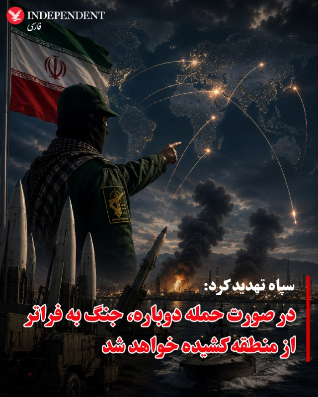

♦️سپاه پاسدران روز چهارشنبه ۳۰ اردیبهشت‌ماه با انتشار بیانیه خطاب به آمریکا و اسرائیل هشدار داد که در صورت حمله دوباره، «این بار جنگ به فراتر از منطقه کشیده خواهد شد.»

سپاه در این بیانیه مدعی تحمیل «شکست‌های بزرگ و راهبردی مکرر» به آمریکا و اسرائیل شده و نوشته است: «گرچه آنها با تمام توانایی‌های دو ارتش که پر هزینه‌ترین ارتش‌های جهان هستند به ما حمله کردند اما ما همه ظرفیت‌های انقلاب اسلامی را علیه آنان وارد عمل نکردیم، اما اینک اگر تجاوز به ایران تکرار شود جنگ منطقه‌ای که وعده داده شده بود، این‌بار به فراتر از منطقه کشیده خواهد شد و ضربات کوبنده ما در جاهایی که تصور آن را ندارید شما را به خاک سیاه خواهد نشاند.»

علی خامنه‌ای، رهبر پیشین جمهوری اسلامی که در موج اول حملات آمریکا و اسرائیل در بیت رهبری کشته شد، چند هفته پیش از آغاز حملات گفته بود «آمریکا بداند که در صورت حمله، این‌بار جنگ منطقه‌ای خواهد بود.»

سپاه در بیانیه خود بدون اشاره مستقیم به تهدیدهای رئیس جمهوری آمریکا نوشته است: «ما مرد جنگیم و قدرت ما را در میدان نبرد خواهید دید و نه در بیانیه‌های توخالی و صفحات مجازی.»

دونالد ترامپ دو روز پیش گفته بود در آستانه صدور فرمان حمله همه‌جانبه به ایران، با درخواست رهبران عربستان سعودی، قطر و امارات متحده عربی، این حمله را برای چند روز به تعویق انداخته است.
‌🇸🇦 Indypersian

🤖 @VahidOOnLine

## VahidOOnLine — post 241102

  

انور قرقاش، مشاور دیپلماتیک رییس امارات متحده عربی، در پیامی در شبکه اجتماعی ایکس، نیروهای نیابتی جمهوری اسلامی در عراق را مسئول حمله اخیر به نیروگاه هسته‌ای براکه معرفی کرد.

او نوشت این حمله «نشانه‌ای بسیار خطرناک از میزان تهدیدی است که منطقه با آن روبه‌روست؛ تهدیدی که از یک سو ناشی از فقدان دولت ملی و از سوی دیگر نتیجه نقض آشکار حقوق بین‌الملل است».

قرقاش افزود: «همان‌گونه که ربایش و ایجاد اختلال در تنگه هرمز تهدیدی برای اقتصاد جهانی و نظم بین‌المللی به شمار می‌رود، هدف قرار دادن براکه نیز اقدامی مجرمانه و نقض مستقیم حقوق بین‌الملل است.»

او یادآور شد: «از هرمز تا براکه، این تهدید دیگر تنها محدود به خلیج فارس نیست، بلکه کل نظام بین‌المللی را هدف قرار داده و بازتاب‌دهنده ذهنیت آشوب‌طلبی و باج‌خواهی است؛ ذهنیتی که برای امنیت ملت‌ها، حقوق بین‌الملل و ثبات اقتصاد جهانی ارزشی قائل نیست و تنها در پی بقا و تحمیل منطق تهاجمی خود است.»
‌🏁 🇬🇧 IranintlTV

🤖 @VahidOOnLine

## VahidOOnLine — post 241101

  

نت‌بلاکس، نهاد پایش‌کننده وضعیت اینترنت در جهان، چهارشنبه ۳۰ اردیبهشت، اعلام کرد هشتاد و دومین روز از قطع دیجیتال اینترنت در ایران سپری شده و این کشور پس از ۱۹۴۴ ساعت همچنان تا حد زیادی از اینترنت جهانی جدا مانده است.

این نهاد افزود در شرایطی که قطعی چند دقیقه‌ای اینترنت می‌تواند بحران‌زا باشد، ادامه این وضعیت در ایران به «نابودی معیشت‌ها و فرسایش حقوق شهروندان» منجر شده است.
‌🏁 🇬🇧 IranintlTV

🤖 @VahidOOnLine

## VahidOOnLine — post 241100

  <a href="telegram/content/VahidOOnLine_241100_1779273636.mp4" target="_blank">🎬 Download video</a>

بر اساس پیام‌های رسیده به ایران‌اینترنشنال، کمبود بنزین در بندرعباس و شماری از شهرهای جنوب استان کرمان باعث شکل‌گیری صف‌های طولانی در جایگاه‌های سوخت شده است.

به‌گفته شهروندان، برخی جایگاه‌ها بیش از ۱۵ لیتر بنزین عرضه نمی‌کنند و در مواردی قیمت آن در بازار آزاد به لیتری ۱۰۰ هزار تومان رسیده است. شهروندان می‌گویند ناچارند شب‌ها در صف‌های چند کیلومتری بمانند تا صبح نوبت سوخت‌گیری آنان برسد.

این وضعیت در بندرعباس، با وجود گرمای شدید و نیاز ضروری به کولر خودرو، نارضایتی گسترده‌ای ایجاد کرده است.
‌🏁 🇬🇧 IranintlTV

🤖 @VahidOOnLine

## VahidOOnLine — post 241099

  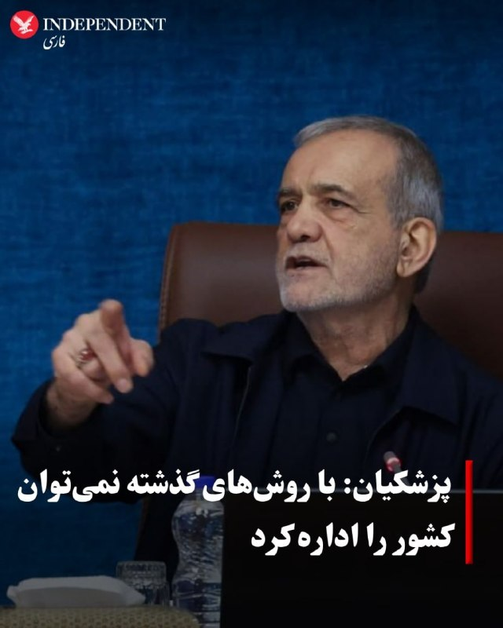

♦️مسعود پزشکیان، رئیس جمهوری اسلامی روز چهارشنبه ۳۰ اردیبهشت ماه در همایش دولتی استانداران گفت با روش‌های گذشته نمی‌توان کشور را اداره کرد و اگر شیوه‌های قبلی راه‌گشا بود، بسیاری از مشکلات تا الان «حل شده بود».

این سخنان در حالی عنوان می‌شود که پزشکیان دو روز پیش هم با انتقاد از «عادی نمایی» شرایط گفته بود که ایران پس از جنگ اخیر با آمریکا و اسرائیل، با مشکلات بسیاری در عرصه‌های مالی، انرژی و نفت و گاز مواجه است و حملات هوایی به تاسیسات نفتی و کارخانه‌های فولاد، آسیب جدی به این صنایع وارد کرده است. رئیس دولت چهاردهم خطاب به منتقدان مذاکرات با آمریکا گفته بود: «گفت‌وگو نکنیم، چه کنیم؟»
‌🇸🇦 Indypersian

🤖 @VahidOOnLine

## WithYashar — post 11738

گروسی: برای تضمین امنیت هسته‌ای به خلیج فارس سفر می‌کنم
@withyashar

## WithYashar — post 11737

وزیر کشور پاکستان عازم تهران شد
@withyashar

## WithYashar — post 11736

## WithYashar — post 11735

  

کانال ۱۲ اسرائیل: ترامپ و نتانیاهو دیشب تماس تلفنی طولانی داشتند که یک تماس محوری توصیف شده است
@withyashar

## WithYashar — post 11734

  <a href="telegram/content/WithYashar_11734_1779273640.mp4" target="_blank">🎬 Download video</a>

مراسم عروسی جان فداها: عروس رفته تنگه هرمز گل بچینه!
@withyashar
😂 جلبک دریایی 🪸

## WithYashar — post 11733

دو نفتکش چینی پس از دو ماه معطلی در خلیج فارس، روز چهارشنبه از تنگه هرمز عبور کردند.
@withyashar

## WithYashar — post 11732

  <a href="https://t.me/withyashar/11732" target="_blank">📎 Download file</a>

نسخه فارسی و بدون سانسور کتاب "پاسخ به تاریخ" نوشته‌ی، محمدرضا شاه پهلوی

🌐 @withyashar

🌐 instagram.com/yashar

## WithYashar — post 11731

  

آمار نشون می‌ده در ۳ ماه گذشته یک پاکسازی طبقاتی دیجیتال در ایران رخ داده. در این مدت سهم اندروید از ترافیک اینترنت ۲۵٪ افت و آیفون ۱۸۰٪ رشد داشته. این به معنی خروج میلیون‌ها کاربر طبقه متوسط و پایین از فضای آنلاینه. اونی که آیفون داره از پس هزینه کانفیگ یا اینترنت پرو برمیاد، اونی که نداره، اونقدر دغدغه مالی مختلف داره که عطای اینترنت رو به لقاش می‌بخشه

@withyashar

## WithYashar — post 11730

وزیر نیروهای مسلح فرانسه اعلام کرد این کشور از وجود مین‌های دریایی در تنگه هرمز اطمینان ندارد.
@withyashar

## WithYashar — post 11729

مقامات کره جنوبی تأیید کردند نفتکش «یونیورسال وینر» این کشور که حامل دو میلیون بشکه نفت از کویت است، از تنگه هرمز عبور کرد.
@withyashar

## WithYashar — post 11728

وزارت خارجه روسیه اعلام کرد ایران از «پیمان منع گسترش سلاح‌های هسته‌ای» (ان‌پی‌تی) خارج نخواهد شد.
@withyashar

## WithYashar — post 11727

۳پا تروریستی : جنگ منطقه‌ای که وعده داده شده بود با تکرار تجاوز، به فراتر از منطقه کشیده خواهد شد
@withyashar

## WithYashar — post 11726

شاهزاده رضا پهلوی:

با دولت ترامپ و اعضای کنگره آمریکا در تماس هستم.

@withyashar

## WithYashar — post 11725

  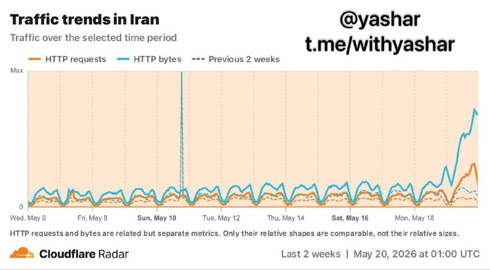

رادار کلادفلر خبر از افزایش ترافیک‌ اینترنت ایران می‌دهد؛ شروعی برای موج قوی تر فیلترینگ؟
@withyashar

## WithYashar — post 11724

فایننشال تایمز: شرکت سرمایه‌گذاری خطر پذیر ترامپ که در حوزه هوش مصنوعی، فناوری دفاعی و املاک فعالیت می‌کند، در حدود یک سال از ۲۰۰ میلیون دلار به ۳.۵ میلیارد دلار دارایی رسید؛ یعنی جهشی ۱۷ برابری
@withyashar

## WithYashar — post 11723

  <a href="telegram/content/WithYashar_11723_1779273643.mp4" target="_blank">🎬 Download video</a>

ترامپ بعد از زدن حرفهای همیشگی مانند رهبرشان مرده، نیروی نظامی ندارند و سلاح هستهی نباید داشته باشند
پس از سخنرانی ملانیا ترامپ در کاخ سفید، گفت: عجب سخنرانی فوق‌العاده‌ای بود، من هیچوقت دوس ندارم بعد از بانوی اول آمریکا صحبت کنم، چون باعث میشه خیلی خوب به نظر نرسم.
@withyashar

## WithYashar — post 11722

  <a href="telegram/content/WithYashar_11722_1779273645.mp4" target="_blank">🎬 Download video</a>

پوتین و شی بیانیۀ مشترک تعمیق روابط چین و روسیه را امضا کردند

شی: جهان به دلیل اقدامات یک‌جانبه و سلطه‌طلبانه دیگر پایدار نیست، بنابراین ما به دنبال یک نظام جهانی جدید هستیم.

پوتین: همکاری ما در امور سیاست خارجی یکی از عوامل اصلی ثبات در صحنه بین‌المللی است.
در شرایط پرتنش فعلی در صحنه بین‌المللی، هماهنگی نزدیک ما به ویژه مورد نیاز است.
@withyashar

## WithYashar — post 11721

فراخوان دادن هرکی با سیدعلی خاطره داشته بیاد تعريف کنه می‌خوایم سریال بسازیم
@withyashar 😬😂

## WithYashar — post 11720

  <a href="telegram/content/WithYashar_11720_1779273647.mp4" target="_blank">🎬 Download video</a>

ترامپ: ما در ایران کار فوق‌العاده‌ای انجام دادیم؛ فکر میکنم خیلی زود این کار تمام بشه و آنها سلاح هسته‌ای نخواهند داشت؛ امیدوارم این کار رو به روشی بسیار خوب انجام بدیم.
@withyashar

## WithYashar — post 11718

  <a href="telegram/content/WithYashar_11718_1779273650.mp4" target="_blank">🎬 Download video</a>

استقبال شی از پوتین در پکن چین
@withyashar

## mwarmonitor — post 9338

  

✈️یک فروند هواپیمای ترابری نظامی C-130H هرکولس نیروی هوایی پاکستان که از اسلام‌آباد پرواز کرده بود، امروز در حال عبور از حریم هوایی عربستان سعودی مشاهده شد؛ پروازی که احتمالاً به مقصد پایگاه هوایی ملک عبدالعزیز (King Abdulaziz Air Base) انجام شده است؛ جایی که یک یگان از نیروی هوایی پاکستان برای کمک به دفاع از پادشاهی عربستان در برابر حملات ایران مستقر است.

@mwarmonitor

## mwarmonitor — post 9337

  

🇺🇦سرویس امنیتی اوکراین (Ukraine’s Security Service / SBU) مدعی شده است که موشک‌های پدافند هوایی—از جمله گونه‌هایی از موشک R-60—که اخیراً روی پهپادهای روسی کشف شده‌اند، حاوی عناصر رادیواکتیو بوده‌اند؛ از جمله اورانیوم-۲۳۵ و اورانیوم-۲۳۸.

@mwarmonitor

## mwarmonitor — post 9336

🇮🇱🇺🇸بنیامین نتانیاهو و دونالد ترامپ شب گذشته یک تماس تلفنی «طولانی و پرتنش» داشتند؛ تماسی که به گفته شبکه N12 اسرائیل، در بحبوحه گمانه‌زنی‌های فزاینده درباره احتمال حمله جدید به ایران انجام شده است.

🔸نتانیاهو همچنین امروز هم در مراسم آغاز به کار نشست کنست شرکت نخواهد کرد و هم در رأی‌گیری مهم درباره انحلال پارلمان غایب خواهد بود.

@mwarmonitor

## mwarmonitor — post 9335

🔴رسانه‌های ایرانی به نقل از یک منبع در اسلام‌آباد گزارش دادند که وزیر کشور پاکستان برای دیدار با مقام‌های ایرانی عازم تهران شده است.

@mwarmonitor

## mwarmonitor — post 9334

🔴هدف اولیه جنگ، روی کار آوردن رئیس‌جمهور سابق تندرو به‌عنوان رهبر ایران بود. NYT 🔸به گفته مقام‌های آمریکایی، یک حمله اسرائیل که با هدف آزاد کردن محمود احمدی‌نژاد از حصر خانگی در تهران طراحی شده بود، بخشی از تلاشی برای ایجاد تغییر رژیم و رساندن او به قدرت…

## mwarmonitor — post 9333

  

🔴هدف اولیه جنگ، روی کار آوردن رئیس‌جمهور سابق تندرو به‌عنوان رهبر ایران بود. NYT

🔸به گفته مقام‌های آمریکایی، یک حمله اسرائیل که با هدف آزاد کردن محمود احمدی‌نژاد از حصر خانگی در تهران طراحی شده بود، بخشی از تلاشی برای ایجاد تغییر رژیم و رساندن او به قدرت محسوب می‌شد.

@mwarmonitor

## mwarmonitor — post 9332

🔴اختصاصی آکسیوس: ترامپ به‌رغم تنش با متحدان، در اجلاس G7 در فرانسه شرکت می‌کند

🔰رئیس‌جمهور ترامپ ماه ژوئن برای گفتگو درباره هوش مصنوعی، تجارت و مبارزه با جرم و جنایت در نشست سران گروه ۷ (G7) در فرانسه شرکت خواهد کرد؛ اقدامی که یک مقام کاخ سفید آن را در گفتگو با اکسیوس تایید کرده است.

چرا این موضوع اهمیت دارد؟
هرچند حضور روسای جمهور آمریکا در اجلاس‌های سالانه گروه ۷ امری مرسوم و سنتی است، اما شرکت ترامپ در این نشست به دلیل خشم فزاینده او از اعضای این گروه (مانند بریتانیا، فرانسه، آلمان و ایتالیا) به خاطر همراهی نکردن با تلاش‌های جنگی او در ایران، قطعی نبود.
یک مقام کاخ سفید اعلام کرد که این نشست منجر به امضای قراردادهای رسمی نخواهد شد، بلکه هدف آن ایجاد اجماع و همسویی برای توافقات آینده است.
تولد ترامپ درست پیش از آغاز این اجلاس، در ۱۴ ژوئن (۲۴ خرداد) است و او ۸۰ ساله خواهد شد.
نگاهی دقیق‌تر به برنامه‌ها
این نشست که از ۱۵ تا ۱۷ ژوئن (۲۵ تا ۲۷ خرداد) در شهر «اویان-له-بن» (Évian-les-Bains) در جنوب شرقی فرانسه برگزار می‌شود، قطعاً موضوع ایران را در دستور کار خواهد داشت، اما ترامپ می‌خواهد روی مسائل اقتصادی و تجاری تمرکز کند:
پیوند زدن کمک‌های آمریکا با تجارت: به گفته این مقام مسئول، هدف این است که تجارت برای هر دو کشور سرمایه‌گذار و دریافت‌کننده سود متقابل داشته باشد.
توسعه هوش مصنوعی: ترویج و به‌کارگیری ابزارهای هوش مصنوعی توسعه‌یافته در آمریکا.
کاهش نفوذ چین: توافق برای کاهش سلطه چین بر زنجیره تامین مواد معدنی حیاتی.
امنیت و مهاجرت: مبارزه با قاچاق مواد مخدر و مهاجرت غیرقانونی.
انرژی و صادرات: ترویج صادرات آمریکا، کاهش موانع مقرراتی و افزایش تولید انرژی، به‌ویژه سوخت‌های فسیلی.
پشت صحنه (روابط ترامپ و ماکرون)
امانوئل ماکرون، رئیس‌جمهور فرانسه که گاهی هدف خشم و انتقادهای ترامپ قرار گرفته است، تلاش کرده با پیشنهاد یک شام مجلل پس از پایان اجلاس در کاخ ورسای (نماد شکوه و زرق‌وبرق سبک باروک فرانسوی که ترامپ شیفته آن است)، دل رئیس‌جمهور آمریکا را به دست آورد. هنوز مشخص نیست که آیا ترامپ در این ضیافت شام شرکت خواهد کرد یا خیر.
نگاه کلان: سایه جنگ ایران بر روابط متحدان
جنگ در ایران همچنان سایه سنگینی بر روابط میان ایالات متحده و تقریباً تمام متحدان اصلی‌اش در گروه ۷ و فراتر از آن انداخته است.
حتی اگر از اکنون تا اواسط ژوئن توافقی حاصل شود، احتمالاً همچنان مقداری دلخوری و تنش در فضا باقی خواهد ماند.
هیچ‌کدام از کشورهای اروپایی به آمریکا در تلاش برای تضمین عبور امن کشتی‌های تجاری از تنگه هرمز کمک نکرده‌اند؛ هرچند ترامپ گاهی گفته به کمک آن‌ها نیازی ندارد و چندین رهبر اروپایی نیز اعلام کرده‌اند که پس از پایان جنگ، مشارکت خواهند کرد.
در همین حال، روز سه‌شنبه و در جریان نشست وزرای دارایی این گروه در پاریس، اسکات بسنت (Scott Bessent)، وزیر خزانه‌داری آمریکا، از اعضای گروه ۷ خواست تا برای مبارزه با «تروریسم ایرانی» و «منابع مالی پشتیبان آن»، تحریم‌های بیشتری وضع کنند.

📌اسکات بسنت در نشست پاریس گفت:
«درهم‌شکستن تهدید تروریسم ایجاب می‌کند که همه شما قدم پیش بگذارید و به ما ملحق شوید. ما از همه متحدان خود در G7 و در واقع از تمام جهان می‌خواهیم که از رژیم تحریم‌ها پیروی کنند تا بتوانیم جریان مالی نامشروعی را که ماشین جنگی ایران را تغذیه می‌کند، متوقف کنیم و این پول را به مردم ایران بازگردانیم.»

@mwarmonitor

## FoxNewsTwitter — post 341976

  <a href="telegram/content/FoxNewsTwitter_341976_1779273654.mp4" target="_blank">🎬 Download video</a>

Fox News (Twitter/X)

Newly released NTSB footage shows the terrifying moment a UPS cargo plane lost an engine seconds after takeoff in Louisville, Kentucky.

The surveillance video captures the aircraft’s left engine and pylon separating from the wing shortly after the plane lifted off the runway.

The November 4, 2025, crash killed 14 people and remains under intense federal investigation as officials work to determine what caused the catastrophic failure.

## FoxNewsTwitter — post 341975

  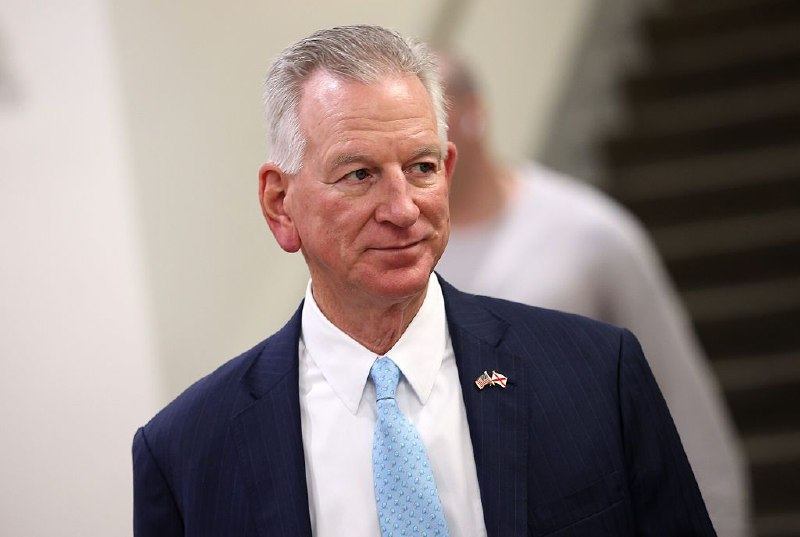

Fox News (Twitter/X)

A major Trump ally is now one step away from Alabama’s governor’s mansion.

Sen. Tommy Tuberville rolled through the Republican primary after months of campaigning as a close ally of President Trump and a fighter against the Washington establishment.

The race drew national attention as another early test of Trump’s strength with Republican voters — and Alabama Republicans delivered Tuberville a commanding victory.

Now the longtime senator heads into the general election with the GOP favored to hold the seat.

## FoxNewsTwitter — post 341974

  <a href="telegram/content/FoxNewsTwitter_341974_1779273656.mp4" target="_blank">🎬 Download video</a>

Fox News (Twitter/X)

“Bi means you like both.”

Rep. Thomas Massie cracks jokes after losing his primary race to Trump-endorsed former Navy SEAL Ed Gallrein, saying he may be “trans-partisan” because he doesn’t fully identify with either political side anymore.

The Kentucky congressman spent years carving out a reputation as one of the most independent Republicans in Washington — often frustrating both party leadership and President Trump.

But after a brutal Trump-backed challenge, Massie’s streak in Congress has now come to an end.

## FoxNewsTwitter — post 341973

  <a href="telegram/content/FoxNewsTwitter_341973_1779273658.mp4" target="_blank">🎬 Download video</a>

Fox News (Twitter/X)

"They tried to buy my vote. They couldn't buy it."

Rep. Thomas Massie delivers a fiery speech after losing his reelection bid, accusing powerful forces in Washington of trying for years to take him down.

Massie, who became a regular target of attacks from President Trump, said they "decided to buy the seat" after they couldn't buy his vote.

## FoxNewsTwitter — post 341972

  <a href="telegram/content/FoxNewsTwitter_341972_1779273660.mp4" target="_blank">🎬 Download video</a>

Fox News (Twitter/X)

"I would like to know how many more Americans we have to ask to die for this mistake."

That question from Rep. Seth Moulton sparked a fiery clash with CENTCOM Commander Admiral Brad Cooper during a tense hearing on Iran and U.S. military operations in the Middle East.

Cooper slammed Moulton's remark as "entirely inappropriate as the exchange escalated in front of lawmakers.

## FoxNewsTwitter — post 341971

  

Fox News (Twitter/X)

"We're going to end that war very quickly. They want to make a deal so badly. They're tired of this"

President Trump predicts a deal to end the war with Iran is going to happen "fast" — and that oil prices will plummet when the agreement is reached.

## FoxNewsTwitter — post 341970

  <a href="telegram/content/FoxNewsTwitter_341970_1779273663.mp4" target="_blank">🎬 Download video</a>

Fox News (Twitter/X)

FOX NEWS REPORT: President Trump warns Iran may face another "big hit" if negotiations collapse, revealing he was only an hour away from moving forward with another strike. @BillMelugin_ reports.

## FoxNewsTwitter — post 341969

  

Fox News (Twitter/X)

President Trump's thumb on the scale proved to be the difference maker for Rep. Andy Barr.

Barr emerged from a packed Republican field to win Kentucky's Senate primary, setting him up for a November showdown to replace retiring Sen. Mitch McConnell.

The race quickly became one of the most closely watched GOP primaries in the country because of McConnell’s looming exit and the battle over the future direction of the Republican Party.

## FoxNewsTwitter — post 341968

  <a href="telegram/content/FoxNewsTwitter_341968_1779273667.mp4" target="_blank">🎬 Download video</a>

Fox News (Twitter/X)

"Either MAGA extremists are going to break the country, or we're going to break them."

House Minority Leader Hakeem Jeffries lays out what he says is the Democratic strategy against the MAGA movement — not just to defeat them in elections, but to "break their spirit” over what he described as "unacceptable" extremism.

## FoxNewsTwitter — post 341967

  

Fox News (Twitter/X)

WATCH LIVE: President Trump speaks at Congressional Picnic on White House South Lawn https://twitter.com/i/broadcasts/1pKkOylkjjEKj

## FoxNewsTwitter — post 341966

  

Fox News (Twitter/X)

BREAKING: The Trump administration is preparing a possible indictment against former Cuban president Raúl Castro, brother of Fidel Castro, sources tell Fox News Digital.

Sources pointed to a Department of Justice advisory Tuesday that announced a Miami press conference "in conjunction with a ceremony to honor the victims of the Brothers to the Rescue Murders of 1996."

## pm_afshaa — post 91093

🔴وای نت:در رویدادی بسیار غیر عادی و عجیب نتانیاهو به دلیل بحث امنیتی اضطراری در رأی‌گیری امروز برای انحلال پارلمان اسرائیل شرکت نخواهد کرد،
همچنین جلسه دادگاه نتانیاهو نیز امروز لغو شده

💧 Rainbet.com the #1 Non-KYC Crypto Casino & Sportsbook @rainbetcom

😁 @Pm_Afshaa

## pm_afshaa — post 91092

🔴وزارت خارجه آمریکا تا سقف 15 میلیون دلار پاداش برای اطلاعات در مورد شبکه مالی سپاه پاسداران تعیین کرد

💧 Rainbet.com the #1 Non-KYC Crypto Casino & Sportsbook @rainbetcom

😁 @Pm_Afshaa

## pm_afshaa — post 91091

🔴ترامپ و نتانیاهو دیشب تماس تلفنی "طولانی و دراماتیک" داشتن

💧 Rainbet.com the #1 Non-KYC Crypto Casino & Sportsbook @rainbetcom

😁 @Pm_Afshaa

## pm_afshaa — post 91090

🔴کرملین:ویتکاف بارها تمایل خود را برای بازدید از مسکو ابراز کرده است، اما تاریخ آن هنوز تعیین نشده

💧 Rainbet.com the #1 Non-KYC Crypto Casino & Sportsbook @rainbetcom

😁 @Pm_Afshaa

## pm_afshaa — post 91089

سپاه:اگر حمله به ایران دوباره رخ دهد، جنگ فراتر از مرزهای منطقه گسترش خواهد یافت

💧 Rainbet.com the #1 Non-KYC Crypto Casino & Sportsbook @rainbetcom

😁 @Pm_Afshaa

## pm_afshaa — post 91088

🔴بهمن فرزانه؛ قاتل الهه حسین نژاد صبح امروز اعـدام شد

💧 Rainbet.com the #1 Non-KYC Crypto Casino & Sportsbook @rainbetcom

😁 @Pm_Afshaa

## pm_afshaa — post 91082

  <a href="telegram/content/pm_afshaa_91082_1779273670.webm" target="_blank">🎬 Download video</a>

🔴افشاگری عجیب نیویورک تایمز:
آمریکا و اسرائیل قبل از جنگ با ایران، طرحی رو برای نصب محمود احمدی‌نژاد به عنوان رهبر جدید کشور مورد بحث قرار دادن.

احمدی‌نژاد گزارشاً در مورد این طرح مشورت شده بود، اما پس از اینکه در حمله‌ای اسرائیل به خانه‌اش در تهران در روز آغازین جنگ مجروح شد، این طرح از هم پاشید. مقامات آمریکایی گفتن که این حمله با هدف آزاد کردن او از بازداشت خانگی انجام شده بود.

برنامه‌ریزان اسرائیلی ظاهراً پیش از درگیری با احمدی‌نژاد مشورت و توافق کرده و تلاش کردن اونو از حصر خانگی اجباری با حمله‌ای‌ اسرائیلی که نگهبانان خارج از اقامتگاهش در تهران رو هدف قرار داد، در روز اول جنگ آزاد کنن.

احمدی‌نژاد زنده موند اما به‌شدت زخمی شد و پس از آن ناامید از تلاش برای تغییر رژیم شد و از آن زمان به بعد به صورت عمومی دیده نشده و محل اقامت او نامشخصه.

💧 Rainbet.com the #1 Non-KYC Crypto Casino & Sportsbook @rainbetcom

😁 @Pm_Afshaa

## pm_afshaa — post 91080

  

مدیر ارتباطات کاخ سفید، استیون چونگ:
هرگز به رئیس‌جمهور ترامپ و قدرت سیاسی او شک نکنید.

آزمایش کن، نتیجه‌اش را ببین

💧 Rainbet.com the #1 Non-KYC Crypto Casino & Sportsbook @rainbetcom

😁 @Pm_Afshaa

## pm_afshaa — post 91079

  <a href="telegram/content/pm_afshaa_91079_1779273671.mp4" target="_blank">🎬 Download video</a>

ترامپ:ما در چند سال آینده روزهای بسیار سختی خواهیم داشت.

امیدواریم این چند سال به سال‌های درخشانی برای بسیاری، بسیاری از سال‌های آینده منجر شود

💧 Rainbet.com the #1 Non-KYC Crypto Casino & Sportsbook @rainbetcom

😁 @Pm_Afshaa

## pm_afshaa — post 91078

  <a href="telegram/content/pm_afshaa_91078_1779273673.mp4" target="_blank">🎬 Download video</a>

ترامپ:تمام تجهیزات آن‌ها که برای جنگ استفاده می‌کردند از بین رفته است. تقریباً همه چیز از بین رفته است.

نمی‌خواهم بگویم رهبرانشان از بین رفته‌اند، چون خیلی خوشایند نیست، اما این حقیقت دارد.

آن‌ها نمی‌توانند سلاح هسته‌ای داشته باشند. ما نمی‌توانیم این را تحمل کنیم و نخواهیم کرد

💧 Rainbet.com the #1 Non-KYC Crypto Casino & Sportsbook @rainbetcom

😁 @Pm_Afshaa

## pm_afshaa — post 91077

  <a href="telegram/content/pm_afshaa_91077_1779273675.mp4" target="_blank">🎬 Download video</a>

🔴ترامپ: ما همه چیز رو نابود می‌کنیم و این جنگ رو خیلی سریع به پایان میرسونیم؛ آنها انقدر خسته‌ان که میخوان معامله کنن.

این باید 47 سال پیش اتفاق می‌افتاد. کسی باید کاری درباره‌اش انجام می‌داد. این اتفاق خواهد افتاد و خیلی سریع خواهد بود.

💧 Rainbet.com the #1 Non-KYC Crypto Casino & Sportsbook @rainbetcom

😁 @Pm_Afshaa

## pm_afshaa — post 91076

  <a href="telegram/content/pm_afshaa_91076_1779273678.mp4" target="_blank">🎬 Download video</a>

🔴ترامپ: ما در ایران کار فوق‌العاده‌ای انجام دادیم؛ فکر میکنم خیلی زود این کار تمام بشه و آنها سلاح هسته‌ای نخواهند داشت؛ امیدوارم این کار رو به روشی بسیار خوب انجام بدیم.

💧 Rainbet.com the #1 Non-KYC Crypto Casino & Sportsbook @rainbetcom

😁 @Pm_Afshaa

## iaghapour — post 2620

  

⚠️ بحران خاموشی دیجیتال؛ ضربه‌ای جبران‌ناپذیر بر پیکر اقتصاد و جامعه

🔻بیش از ۱۹۴۴ ساعت خاموشی دیجیتال، تنها قطع یک ابزار ارتباطی روزمره نیست، بلکه یک «بحران تمام‌عیار اقتصادی و اجتماعی» است. در زمانه‌ای که در سراسر جهان حتی چند دقیقه اختلال در اینترنت زیان‌های هنگفتی به بار می‌آورد، تداوم ۸۲ روزه این وضعیت در ایران، آسیبی عمیق به شریان‌های حیاتی کسب‌وکارها و زندگی عادی مردم وارد کرده است.

در واقع، تداوم این قطعی طولانی‌مدت نشان می‌دهد که حفظ حیات اقتصادی مشاغلِ وابسته به فضای مجازی و نیازهای ارتباطی جامعه، در اولویت تصمیم‌گیری‌ها قرار ندارد؛ رویکردی که پیامدی جز نابودی معیشت هزاران نفر، فرسایش سرمایه اجتماعی و آسیب جدی به بدنه نوپای اقتصاد دیجیتال کشور نخواهد داشت.

🆔 @iaghapour

## iaghapour — post 2619

  

⭕️ شگفتی گوگل در Google I/O 2026؛ معرفی جمینای ۳.۵ فلش با سرعتی باورنکردنی!

در گام نخست، مدل جمینای ۳.۵ فلش عرضه شده است؛ مدلی که با وجود طراحی شدن برای سرعت بالا و هزینه کم، در کمال شگفتی توانسته مدل‌های پرچمدار و پرو نسل‌های قبل را در بنچمارک‌های تخصصی شکست دهد.

🔹 پادشاهی در بخش ایجنت‌ها: این مدل با توانایی برنامه‌ریزی بالا، می‌تواند چندین ایجنت را به صورت موازی برای پیشبرد پروژه‌های پیچیده و کدنویسی مستقر کند.

🔸 سرعت خیره‌کننده و کاهش هزینه‌ها: ساندار پیچای اعلام کرد این مدل با سرعت پردازش ۲۸۹ توکن در ثانیه، حدود ۴ برابر سریع‌تر از رقباست.

🔹 شکست رقبای سرسخت: جمینای ۳.۵ فلش در آزمون‌های تخصصیِ مربوط به کارهای ایجنتی، امتیاز بی‌نظیر ۱۶۵۶ را کسب کرده و عملاً رقیب سرسختی مثل کلود سونیت ۴.۶ آنتروپیک را پشت سر گذاشته است.

🔸 همچنین نسخه قدرتمندتر یعنی جمینای ۳.۵ پرو در ماه ژوئن ۲۰۲۶ رسماً عرضه خواهد شد.

جمینای ۳.۵ فلش هم‌اکنون به عنوان مدل پیش‌فرض در اپلیکیشن جمینای و بخش سرچ گوگل فعال شده است.

🧠 @NovinAIplus

## DEJradio — post 4762

  <a href="telegram/content/DEJradio_4762_1779273681.webm" target="_blank">🎬 Download video</a>

🚨
🔸 "همراهی ناخواسته اپوزسیون ملی با جمهوری اسلامی

*پژمان گلچین، پژوهشگر فلسفه.

#اپوزسیون_ملی #ایران
@DEJradio

## DEJradio — post 4759

  <a href="telegram/content/DEJradio_4759_1779273681.webm" target="_blank">🎬 Download video</a>

🚨📢 شبکه آمریکایی «الحره» به نقل از منابع نظامی و سیاسی آگاه در داخل ایران گزارش داد، کشور شاهد افزایش شدید و بی‌سابقه اختلافات و درگیری‌های داخلی میان ارتش و سپاه پاسداران است؛ اختلافاتی که به وقوع درگیری‌های مسلحانه در چندین شهر اصلی ایران انجامیده است. این تنش‌ها بعد از کشته شدن علی خامنه‌ای رهبر جمهوری اسلامی آغاز شد؛ رخدادی که خلأ سیاسی و امنیتی بزرگی در ساختار نظام ایجاد کرده است.

در این گزارش که ۲۵ اردیبهشت ۱۴۰۵ منتشر شد، مفصل به نقل از افسران سابق ارتش ایران و فعالان متخصص در امور ایران گفته شد، که طی هفته‌های اخیر درگیری‌های مسلحانه میان نیروهای ارتش رسمی و سپاه پاسداران در شهرهای مهمی از جمله #تهران، تبریز، اصفهان و مناطقی از اهواز رخ داده است.

این درگیری‌ها همزمان با دوره تنش‌های نظامی اخیر منطقه میان آمریکا و اسرائیل رخ داده و به کشته و زخمی شدن نیروهایی از هر دو طرف انجامیده است؛ موضوعی که نشان‌دهنده لرزش عمیق در نهادهای نظامی و امنیتی حکومت است.

#ارتش #IRGCterrorists
@DEJradio

## DEJradio — post 4758

  <a href="telegram/content/DEJradio_4758_1779273682.webm" target="_blank">🎬 Download video</a>

🚨
🔸 "جاسوس واقعی کسی است که به خامنه‌ای اطمینان داد از لونه موش بیرون بیاد.

فریبرز کرمی‌زند، افسر پیشین پلیس.

#موشعلی #جاسوسی
@DEJradio

## DEJradio — post 4757

  <a href="telegram/content/DEJradio_4757_1779273682.webm" target="_blank">🎬 Download video</a>

🔺📢 “سـ.ـپاهی‌های با اخلاص که در تجمعات جانفدا محور تبلیغات شدن، همون سرکوبگرای قاتل هستند که با وضو آدم کشتند...

پیام دریافتی

#تجمعات_حکومتی #IRGCterrorists
@DEJradio

## DEJradio — post 4756

  <a href="telegram/content/DEJradio_4756_1779273683.mp4" target="_blank">🎬 Download video</a>

🛩️
🔺 ‏ایالات متحده در حال اعزام نیروهای نظامی به دریای عمان است؛ اقدامی که نشان می‌دهد آمریکا در حال آماده‌سازی برای ازسرگیری جنگ با ایران است.

یک فروند هواپیمای شناسایی دریایی P-8A آمریکا بر فراز دریای عرب و خلیج عمان پرواز کرده و همزمان یک تانکر سوخت‌رسان KC-46A نیز در شمال خلیج عمان برای پشتیبانی از عملیات هوایی حضور داشته است.

پیش‌تر نیز ظهور ناگهانی یک فروند هواپیمای نظارتی دریایی P-8A Poseidon نیروی دریایی آمریکا در نزدیکی سواحل پاکستان، جغرافیای راهبردی تقابل جاری میان آمریکا و ایران را از تنگه هرمز به شمال دریای عرب گسترش داده و الگوهای نظارت دریایی را وارد مرحله‌ای از تشدید بالقوه و مهم کرده است.

#آتشبس #جنگ
@DEJradio

## DEJradio — post 4755

  <a href="telegram/content/DEJradio_4755_1779273685.webm" target="_blank">🎬 Download video</a>

🚨📢 سازمان اطلاعات داخلی آلمان هشدار داده جمهوری اسلامی ممکن است پس از پایان جنگ با اسرائیل و آمریکا، دامنه عملیات‌های امنیتی و تروریستی خود در اروپا را گسترش دهد.

بر اساس گزارش اختصاصی یوراکتیو، سازمان اطلاعات داخلی آلمان (BfV) اعلام کرده تهدید علیه مراکز یهودی و اسرائیلی، مخالفان جمهوری اسلامی و افرادی که حکومت ایران آن‌ها را «خائن» می‌داند، همچنان در سطح بالایی قرار دارد.

این نهاد امنیتی گفته شماری از افراد ساکن آلمان برای آموزش نظامی یا همکاری با نهادهای حکومتی به ایران سفر کرده‌اند و برخی از آن‌ها در ویدئوهای تبلیغاتی جمهوری اسلامی و بسیج ظاهر شده‌اند.

در این گزارش همچنین به نگرانی سرویس‌های امنیتی اروپا از استفاده جمهوری اسلامی از شبکه‌های نیابتی، گروه‌های وابسته به جرایم سازمان‌یافته و نیروهای کم‌هزینه محلی برای انجام حملات اشاره شده است.

به گفته منابع امنیتی، جمهوری اسلامی از مارس ۲۰۲۶ کارزاری با نام «حرکت أصحاب الیمین الإسلامیه» (HAYI) راه‌اندازی کرده که از طریق شبکه‌های اجتماعی اقدام به جذب نیرو در میان محافل طرفدار جمهوری اسلامی و جریان‌های افراطی شیعه می‌کند.

پژوهشگران امنیتی هشدار داده‌اند این مدل عملیات، شامل حملات ساده اما پرتعداد توسط افراد محلی و بعضاً نوجوانان، می‌تواند فشار گسترده‌ای بر سرویس‌های امنیتی اروپا وارد کند؛ به‌ویژه برای حفاظت از مراکز یهودی، مدارس و مراکز اجتماعی.

سازمان اطلاعات داخلی آلمان تأکید کرده است که جمهوری اسلامی در گذشته نیز از روش‌هایی در حد «تروریسم دولتی» استفاده کرده؛ از عملیات‌های شناسایی و مراقبت گرفته تا طراحی حملات علیه مخالفان و اهداف اسرائیلی و یهودی در اروپا.

#تروریسم #آلمان
@DEJradio

## DEJradio — post 4754

  <a href="telegram/content/DEJradio_4754_1779273685.mp4" target="_blank">🎬 Download video</a>

🔺🎥 پیام یک شهروند در واکنش به آموزش استفاده از سلاح به طرفداران نظام در خیابان‌ها: "این کـ...مشنگا هر روز جمع می‌شن اینجا آموزش تفنگ می‌دن".

#تروریسم
@DEJradio

## DEJradio — post 4753

  <a href="telegram/content/DEJradio_4753_1779273687.webm" target="_blank">🎬 Download video</a>

🔺📢 سی‌بی‌اس نیوز به نقل از مقام‌های آمریکایی اعلام کرد ارزیابی اطلاعاتی جدید آمریکا نشان می‌دهد نیروهای این کشور دست‌کم ۱۰ مین دریایی را در تنگه هرمز شناسایی کرده‌اند. پیش از این گزارش شده بود که مقام‌های آمریکایی بر اساس ارزیابی‌های اطلاعاتی معتقد بودند دست‌کم ۱۲ مین زیرسطحی در تنگه هرمز وجود دارد.

مقام‌ها گفته بودند مین‌هایی که ایران در این تنگه به کار گرفته، از نوع «Maham 3» و «Maham 7 Limpet Mine» ساخت ایران هستند. با این حال، یک مقام دیگر آمریکایی گفته بود تعداد مین‌ها کمتر از ۱۲ عدد است.

#تنگه_هرمز #محاصره_دریایی
@DEJradio

## VahidOnline — post 75566

  <a href="telegram/content/VahidOnline_75566_1779273688.mp4" target="_blank">🎬 Download video</a>

پوتین هم به خدمت شی رسید.
J74wabx

📡 @VahidOnline

## VahidOnline — post 75565

  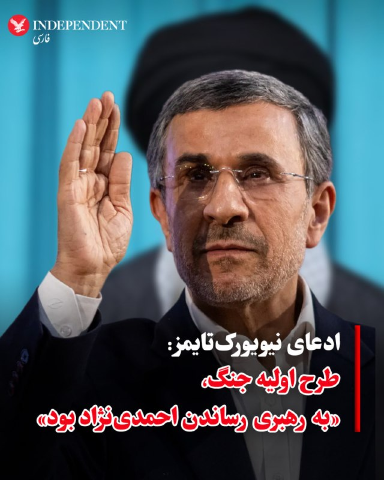

ترجمه ماشین
تیتر نیویورک‌تایمز: هدف اولیه جنگ، روی کار آوردن رئیس‌جمهور تندروی پیشین به عنوان رهبر ایران بود

بخش‌های خبری مطلب:
به گفته مقامات آمریکایی، حمله اسرائیل که با هدف آزادی محمود احمدی‌نژاد از حبس خانگی در تهران طراحی شده بود، بخشی از تلاش‌ها برای تغییر رژیم و به قدرت رساندن او بود.

چند روز پس از آنکه حملات اسرائیل در آغازین روزهای جنگ، رهبر ایران و سایر مقامات ارشد را به قتل رساند، پرزیدنت ترامپ علناً اظهار داشت که بهتر است «شخصی از درون» ایران کنترل کشور را به دست بگیرد.
اکنون مشخص شده است که ایالات متحده و اسرائیل با در نظر داشتن شخصیتی خاص و بسیار غافلگیرکننده وارد این درگیری شدند: محمود احمدی‌نژاد، رئیس‌جمهور پیشین ایران که به دلیل دیدگاه‌های تندرو، ضداسرائیلی و ضدآمریکایی‌اش شناخته می‌شود.

اما بر اساس گفته‌های مقامات آمریکاییِ مطلع از این موضوع، این طرح جسورانه که توسط اسرائیلی‌ها تدوین شده بود و با آقای احمدی‌نژاد نیز درباره آن مشورت شده بود، به سرعت با شکست مواجه شد.

مقامات آمریکایی و یکی از نزدیکان آقای احمدی‌نژاد اعلام کردند که او در روز اول جنگ بر اثر حمله اسرائیل به خانه‌اش در تهران - که برای رهایی او از حصر خانگی طراحی شده بود - مجروح شد. آن‌ها گفتند که او از این حمله جان سالم به در برد، اما پس از این خطر جانی، نسبت به طرح تغییر رژیم دلسرد و ناامید شد.

او از آن زمان تاکنون در انظار عمومی دیده نشده است و مکان و وضعیت فعلی او نامشخص است.
...
اینکه آقای احمدی‌نژاد چگونه برای مشارکت در این طرح به کار گرفته شد، هنوز در هاله‌ای از ابهام قرار دارد.
...
سخنگوی موساد، سازمان اطلاعات خارجی اسرائیل، از اظهارنظر در این باره خودداری کرد.
...
مقامات آمریکایی گفتند که این حمله - که توسط نیروی هوایی اسرائیل انجام شد - به منظور کشتن نگهبانان مراقب آقای احمدی‌نژاد و به عنوان بخشی از طرحی برای رهایی او از حبس خانگی صورت گرفت.
این حمله آسیب چندانی به خانه آقای احمدی‌نژاد که در انتهای یک کوچه بن‌بست قرار داشت، وارد نکرد. اما پاسگاه امنیتی در ورودی کوچه مورد اصابت قرار گرفت. تصاویر ماهواره‌ای نشان می‌دهد که آن ساختمان ویران شده است.

در روزهای پس از آن، خبرگزاری‌های رسمی روشن کردند که او جان سالم به در برده است، اما «محافظان» او - که در واقع اعضای سپاه پاسداران انقلاب اسلامی بودند و همزمان وظیفه محافظت و نگهداری او در حبس خانگی را بر عهده داشتند - کشته شده‌اند.

مقاله‌ای در نشریه آتلانتیک در ماه مارس، با استناد به منابع ناشناس نزدیک به آقای احمدی‌نژاد، نوشت که رئیس‌جمهور پیشین پس از حمله به خانه‌اش از حصر دولتی آزاد شده است؛ این مقاله آن رویداد را «در عمل یک عملیات فرار از زندان» توصیف کرد.

پس از انتشار آن مقاله، یکی از نزدیکان آقای احمدی‌نژاد در گفتگو با نیویورک تایمز تأیید کرد که آقای احمدی‌نژاد این حمله را به عنوان تلاشی برای آزادی خود تلقی کرده است. این فرد مطلع گفت که آمریکایی‌ها آقای احمدی‌نژاد را شخصی می‌دانستند که می‌تواند ایران را رهبری کند و توانایی مدیریت «وضعیت سیاسی، اجتماعی و نظامی ایران» را دارد.
این فرد مطلع اظهار داشت که آقای احمدی‌نژاد می‌توانست در آینده نزدیک «نقش بسیار مهمی» در ایران ایفا کند و اشاره کرد که ایالات متحده او را شبیه به دلسی رودریگز می‌دید؛ کسی که پس از دستگیری آقای مادورو توسط نیروهای آمریکایی در ونزوئلا قدرت را به دست گرفت و از آن زمان همکاری نزدیکی با دولت ترامپ داشته است.
...

در چند سال گذشته آقای احمدی‌نژاد سفرهایی به خارج از ایران داشته است که به گمانه‌زنی‌ها دامن زده است.
به گزارش مجله نیولاینز، او در سال ۲۰۲۳ به گواتمالا و در سال‌های ۲۰۲۴ و ۲۰۲۵ به مجارستان سفر کرد. هر دو کشور روابط نزدیکی با اسرائیل دارند.
ویکتور اوربان، نخست‌وزیر مجارستان در آن زمان، روابط نزدیکی با آقای نتانیاهو دارد. در طول این سفرها به مجارستان، آقای احمدی‌نژاد در دانشگاهی مرتبط با آقای اوربان سخنرانی کرد.

او تنها چند روز قبل از آغاز حملات اسرائیل به ایران در ژوئن گذشته از بوداپست بازگشت. زمانی که آن جنگ درگرفت، او حضور علنی کمرنگی داشت و تنها چند بیانیه در شبکه‌های اجتماعی منتشر کرد. سکوت نسبی او در مورد جنگ با کشوری که آقای احمدی‌نژاد مدت‌ها آن را دشمن اصلی ایران می‌دانست، مورد توجه بسیاری در شبکه‌های اجتماعی ایران قرار گرفت.
...
nytimes

📡 @VahidOnline

## VahidOnline — post 75564

  

ترامپ در یک سخنرانی در کاخ سفید گفت ایران قرار نیست به سلاح هسته‌ای دست پیدا کند. نمی‌توانند سلاح هسته‌ای داشته باشند. ما نمی‌توانیم چنین چیزی را تحمل کنیم و آن را تحمل نخواهیم کرد.
او گفت ما نیروی دریایی آن‌ها را نابود کردیم. نیروی هوایی آنها از بین رفته است. سامانه‌های پدافند هوایی آنها از بین رفته است. تمام تجهیزاتی که برای جنگ استفاده می‌کردند از بین رفته است. تقریبا همه چیز از بین رفته است.
ترامپ افزود: نمی‌خواهم بگویم رهبران آنها از بین رفته‌اند، چون بیان آن چندان خوشایند نیست، اما واقعیت همین است.
@VahidOOnLine

📡 @VahidOnline

## VahidOnline — post 75563

  

زمین‌لرزه در قشم

آپدیت:‌
تصویر بالا: #زلزله به بزرگی ۴٫۷ در عمق ۲۰ کیلومتری بندر لافت در جزیره قشم هرمزگان

پیام‌های دریافتی:
سلام وحید دو زلزله شدید بندرعباس رو لرزاند

ساعت ۳:۱۱ دقیقه بندرعباس زلزله اومد

همین الان ساعت ۳:۱۲ دوبار به مدت ۱۵ ثانیه وحشتناک بندرعباس لرزید

من بندرعباس هستم دو بار لرزید

زلزله اومده خیلی بد بود

زمین لرزه نسبتا شدید ساعت ٣:١٠ بامداد بندرعباس

بندرعباس هستم فکر کردیم باز زدن دقیقا ۲۰ ثانیه همه جا میلرزید

چند دقیقه پیش زمین لرزه نسبتا شدید اومد دوبار تو فاصله خیلی کم بندرعباس

📡 @VahidOnline

## VahidOnline — post 75562

  

سنای آمریکا روز سه‌شنبه قطعنامه‌ای را برای توقف اقدام نظامی در ایران پیش برد.

پیش بردن این قطعنامه پس از آن صورت گرفت که سناتور جمهوری‌خواه، بیل کسیدی از لوئیزیانا، به آن رای مثبت داد. کسیدی چند روز پیش، در رقابت‌های درون حزبی ایالتی برای ادامه حضورش در سنا، به نامزدی که از حمایت ترامپ برخوردار بود، باخت.

به گزارش سی‌ان‌بی‌سی، با وجود اینکه قطعنامه اختیارات جنگی با نتیجه ۵۰ به ۴۷ به تصویب رسید، اما هنوز احتمال کمی برای تبدیل شدن به قانون دارد. این قطعنامه باید ابتدا در سنا به تصویب نهایی برسد، سپس مجلس نمایندگان به رای بدهد و سپس نیز، دونالد ترامپ به احتمال قریب به یقین، آن را وتو خواهد کرد.
@VahidHeadline
چهار جمهوری‌خواه هم‌حزبی ترامپ همراه با همه دموکرات‌ها به جز یک نفر، به آن رای مثبت دادند. سه سناتور جمهوری‌خواه نیز در رای‌گیری غایب بودند.
باوجود تصویب این آیین‌نامه، حتی اگر قطعنامه‌ای در سنا با ۱۰۰ عضو هم به تایید برسد، کار دشواری در مجلس نمایندگان خواهد داشت که تحت کنترل جمهوری‌خواهان است و پس از آن نیز باید دو‌سوم رای کنگره و سنا را داشته باشد تا بتواند گزینه وتوی احتمالی رئیس‌جمهور را دور بزند.
طبق قانون اختیارات جنگی آمریکا مصوب ۱۹۷۳ که در واکنش به جنگ ویتنام تصویب شد، رئیس‌جمهور آمریکا تنها ۶۰ روز می‌تواند بدون مجوز کنگره عملیات نظامی انجام دهد و پس از آن باید یا جنگ را متوقف کند، یا از کنگره مجوز بگیرد.
@VahidOOnLine

📡 @VahidOnline

## kianmeli1 — post 87514

  

🔴وزارت خارجه آمریکا تا سقف ۱۵ میلیون دلار پاداش برای اطلاعات در مورد شبکه مالی سپاه تروریستی پاسداران تعیین کرد.
https://t.me/kianmeli1

## kianmeli1 — post 87513

🔴 نیویورک تایمز به نقل از منابع آگاه: اسرائیل و آمریکا به دنبال رهبری احمدی نژاد بعد از سرنگونی جمهوری اسلامی و جنگ بودند نیویورک تایمز نوشت: احمدی‌نژاد در اولین روز جنگ در حمله هوایی اسرائیل که محل اقامتش در تهران را هدف قرار داد، مجروح شد. https://t.me/kianmeli1

## kianmeli1 — post 87512

‏🔴رسانه‌های اسرائیل خبر دادند که تماس تلفنی دیشب ترامپ و نتانیاهو طولانی و در آستانه یک تصمیم مهم بوده است
https://t.me/kianmeli1

## kianmeli1 — post 87511

  <a href="telegram/content/kianmeli1_87511_1779273690.mp4" target="_blank">🎬 Download video</a>

🔴سنژنوئه، منطقه دونتسک. حمله به محل استقرار سربازان روسی. گزارش شده است که تعداد زیادی کشته شده‌اند
https://t.me/kianmeli1

## kianmeli1 — post 87510

  <a href="telegram/content/kianmeli1_87510_1779273692.mp4" target="_blank">🎬 Download video</a>

🔴مراسم عروسی جان فداهای حکومت: عروس رفته تنگه هرمز گل بچینه!
https://t.me/kianmeli1

## kianmeli1 — post 87509

  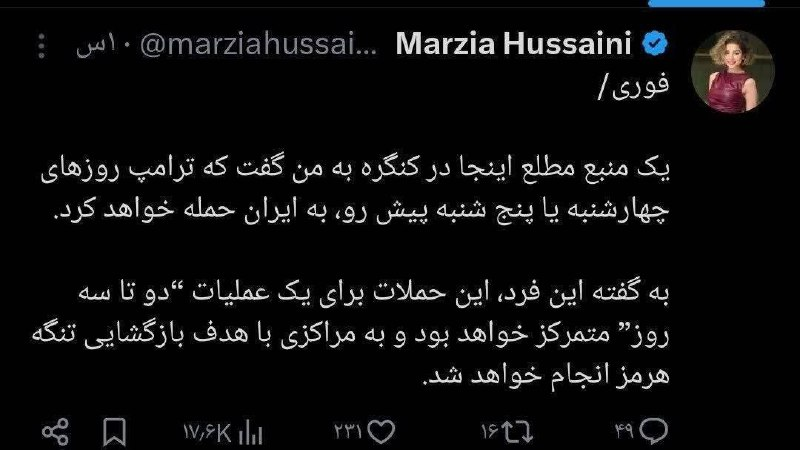

🔴مرضیه حسینی خبرنگار کنگره امریکا: یک منبع مطلع اینجا در کنگره به من گفت که ترامپ روزهای چهارشنبه یا پنج شنبه پیش رو، به ایران حمله خواهد کرد.

به گفته این فرد،این حملات برای یک عملیات "دو تا سه روز” متمرکز خواهد بود و به مراکزی با *هدف بازگشایی تنگه هرمز* انجام خواهد شد.
https://t.me/kianmeli1

## kianmeli1 — post 87508

  

🔴 نیویورک تایمز به نقل از منابع آگاه: اسرائیل و آمریکا به دنبال رهبری احمدی نژاد بعد از سرنگونی جمهوری اسلامی و جنگ بودند

نیویورک تایمز نوشت: احمدی‌نژاد در اولین روز جنگ در حمله هوایی اسرائیل که محل اقامتش در تهران را هدف قرار داد، مجروح شد.
https://t.me/kianmeli1

## kianmeli1 — post 87507

  <a href="telegram/content/kianmeli1_87507_1779273694.mp4" target="_blank">🎬 Download video</a>

🔴خبرنگار شبکه اسکای نیوز، فرمانده سنتکام درباره جنایت مدرسه میناب به چالش کشید و از او پرسید، تا کی می‌خواهید «پشت این ادعا که تحقیقات ادامه دارد پنهان شوید؟»

مارک استون خطاب به کوپر افزود، تیمی از شبکه اسکای نیوز همین الان در میناب هستند. آنچه آنجا رخ داد را دیده‌اند. هیچ مدرکی دال بر وجود پایگاه موشکی در آنجا وجود ندارد.

درحالیکه کوپر در حال فرار از پاسخگویی بود مارک استون دوباره وی را سوال پیچ کرد و گفت، تا کی میخواهید پشت این ادعا که تحقیقات در جریان است قایم شوید؟ «حداقل بگویید تحقیقات چه زمانی پایان خواهد یافت؟»

فرمانده سنتکام به جای پاسخگویی مسیر حرکت خود را تغییر داد و تلاش کرد با کمک محافظانش از دست خبرنگار اسکای نیوز فرار کند!
https://t.me/kianmeli1

## kianmeli1 — post 87506

  

🔴خطر اعدام فوری خواهر و برادر #زینب_موسوی و #حسن_موسوی

​زینب موسوی و برادرش، حسن موسوی، که در جریان اعتراضات سراسری دی‌ماه بازداشت شده بودند، اکنون در زندان وکیل‌آباد #مشهد با اتهام سنگین محاربه روبرو شده و به اعدام محکوم شده‌اند.
این خواهر و برادر معترض در بیدادگاهی فرمایشی و بدون دسترسی به دادرسی عادلانه به مرگ محکوم شده‌اند و جانشان در خطر فوری اجرای حکم قرار دارد.
خانواده موسوی در وضعیت روحی به‌شدت بحرانی و دلهره‌آوری به سر می‌برند و زیر سایه این احکام ظالمانه، چشم‌انتظار یاری و همصدایی افکار عمومی هستند.
سکوت در برابر این جنایت، دست دستگاه سرکوب را برای گرفتن جان این دو جوان بازتر می‌کند؛ نام زینب و حسن را فریاد بزنیم و اجازه ندهیم در بی‌خبری به مسلخ بروند.
https://t.me/kianmeli1

## kianmeli1 — post 87505

‏🔴سپاه پاسداران با انتشار بیانیه‌ای اعلام کرد جنگ منطقه‌ای که وعده داده شده بود با تکرار تجاوز، به فراتر از منطقه کشیده خواهد شد

‏در بیانیه سپاه پاسداران آمده است «ما همه ظرفیت‌های انقلاب اسلامی را علیه آمریکا و اسرائیل وارد عمل نکردیم» و در صورت وقوع جنگ «ضربات کوبنده ما در جاهایی که تصور آن را ندارید شما را به خاک سیاه خواهد نشاند»

‏سپاه پاسداران در پایان بیانیه خود خطاب به آمریکا و اسرائیل نوشت: «ما مرد جنگیم و قدرت ما را در میدان نبرد خواهید دید و نه در بیانیه‌های توخالی و صفحات مجازی»
https://t.me/kianmeli1

## kianmeli1 — post 87504

‏🔴سخنگوی انجمن صنایع فرآورده‌های لبنی: قیمت محصولات لبنی از یکم خرداد ۲۰ درصد گران خواهد شد
https://t.me/kianmeli1

## kianmeli1 — post 87503

‏🔴رييس کمیسیون تخصصی لوازم خانگی: امکان فروش اقساطی برای بسیاری از فروشندگان لوازم خانگی به‌دلیل افزایش مداوم قیمت کالاها وجود ندارد
https://t.me/kianmeli1

## kianmeli1 — post 87502

‏🔴عضو شورای عالی فضای مجازی: مسئول نهایی قطع اینترنت، سیم‌کارت سفید و اینترنت طبقاتی کسانی هستند که در بالاترین رده‌های حکمرانی، تصمیم‌سازی و تصمیم‌گیری می‌کنند، اما پاسخگو نیستند
https://t.me/kianmeli1

## kianmeli1 — post 87501

‏🔴نت‌بلاکس: قطع اینترنت در ایران وارد هشتاد و دومین روز خود شده است و پس از ۱۹۴۴ ساعت همچنان ادامه دارد
https://t.me/kianmeli1

## IranIntlTV — post 338061

  <a href="telegram/content/IranIntlTV_338061_1779273696.mp4" target="_blank">🎬 Download video</a>

سرخط خبرهای چهارشنبه ۳۰ اردیبهشت
@iranintltv

## IranIntlTV — post 338060

  

ایمان شمسایی، رییس مرکز ارتباطات، رسانه و امور فرهنگی مجلس، خبر استعفای محمدباقر قالیباف از ریاست هیات مذاکره‌کننده جمهوری اسلامی را «کذب محض و دروغی آشکار» خواند و منتشرکنندگان آن را به «خیانت» متهم کرد.

او در پیامی نوشت ادعای این جریان «امتداد همان خط تخریبی است که تا دیروز فرماندهان را نشانه می‌رفت و امروز شهدای والامقام را».

شمسایی افزود این جریان سابقه «هجمه» به فرماندهان نظامی، دفتر رهبر جمهوری اسلامی، مراجع تقلید و شورای عالی امنیت ملی را در کارنامه دارد.

در ادامه پیام او آمده است: «شایسته است این آقایان برای توجیه خیانت خود در شرایط جنگی پشت ژست‌های انقلابی پنهان نشوند و بیش از این به توجیه رفتارهای آسیب‌زای خود در شرایط حساس کنونی نپردازند.»

شمسایی تاکید کرد قالیباف همچنان ریاست هیات مذاکره‌کننده حکومت را بر عهده دارد و به‌تازگی نیز به پیشنهاد مسعود پزشکیان و تایید مجتبی خامنه‌ای، به‌عنوان نماینده ویژه جمهوری اسلامی در امور چین منصوب شده است.

در هفته‌های اخیر، گزارش‌های متعددی درباره اختلاف در ساختار حاکمیت جمهوری اسلامی منتشر شده است.
https://iranintl.com/202605204370

## IranIntlTV — post 338059

  <a href="telegram/content/IranIntlTV_338059_1779273698.mp4" target="_blank">🎬 Download video</a>

تیم فوتبال آرسنال عنوان قهرمانی لیگ برتر انگلستان را به دست آورد. در حاشیه این موفقیت، در شبکه‌های اجتماعی و میان هواداران، توجه ویژه‌ای به یاد جاویدنامان انقلاب ملی ایران دیده شد؛ هوادارانی که نام و تصویرشان در میان طرفداران این تیم زنده نگه داشته شده است. از جمله عارف جعفرزاده، ۳۲ ساله اهل رشت، که تصویر او توسط یک هنرمند انگلیسی بر دیوار ستاره‌های آرسنال در شمال لندن نقش بسته است.
جزییات بیشتر با آیدین مقیمی، خبرنگار ایران‌اینترنشنال
@iranintltv

## IranIntlTV — post 338058

  <a href="telegram/content/IranIntlTV_338058_1779273700.mp4" target="_blank">🎬 Download video</a>

مسعود پزشکیان، رییس دولت جمهوری اسلامی، با هشدار درباره تشدید بحران در صورت عدم مدیریت مصرف آب، برق، گاز و بنزین، از مردم خواست صرفه‌جویی را جدی بگیرند.
گفت‌وگو با علی شیرازی، عضو تحریریه ایران‌اینترنشنال
@iranintltv

## IranIntlTV — post 338057

دونالد ترامپ، رییس‌جمهوری آمریکا، درباره تنش‌ها با تهران گفت احتمال دارد ایالات متحده برای وارد کردن «ضربه‌ای بزرگ» بار دیگر به جمهوری اسلامی حمله کند. هم‌زمان، جی‌دی ونس سه‌شنبه در نشست خبری کاخ سفید تاکید کرد تهران باید وارد مذاکره شود و از دستیابی به سلاح هسته‌ای صرف‌نظر کند. او هشدار داد اگر این فرصت از دست برود، گزینه جنگ همچنان روی میز خواهد بود.

گفت‌وگو با علی‌حسین قاضی‌زاده، عضو تحریریه ایران‌اینترنشنال
@iranintltv

## IranIntlTV — post 338056

  <a href="telegram/content/IranIntlTV_338056_1779273702.mp4" target="_blank">🎬 Download video</a>

آرسنال پس از ۲۲ سال قهرمان لیگ برتر فوتبال انگلستان شد. تصویر جاویدنام عارف جعفرزاده، ۳۲ ساله و اهل رشت که از هواداران آرسنال بود، به دست یک هنرمند انگلیسی روی دیوار ستاره‌های این تیم در شمال لندن نقش بست.

گزارش آیدین مقیمی، خبرنگار ایران‌اینترنشنال
@iranintltv

## IranIntlTV — post 338055

  <a href="telegram/content/IranIntlTV_338055_1779273704.mp4" target="_blank">🎬 Download video</a>

پیام‌های رسیده به ایران‌اینترنشنال از نگرانی دانش‌آموزان، دانشجویان و والدین آنها در پایان سال تحصیلی حکایت دارد. این افراد در پیام‌های خود به ایران‌اینترنشنال گفته‌اند قطع اینترنت و مجازی شدن کلاس‌ها، باعث افت کیفیت آموزش شده است.

لیلا سعادتی، عضو تحریریه ایران‌اینترنشنال، گزارش می‌دهد
@iranintltv

## IranIntlTV — post 338054

  

🔻نشریه نیویورک‌پست، چهارشنبه ۳۰ اردیبهشت در یادداشتی تحلیلی و انتقادی، تصمیم احتمالی فدراسیون بین‌المللی فوتبال، فیفا، برای ممنوع کردن ورود پرچم تاریخی «شیر و خورشید» را به استادیوم‌های جام جهانی ۲۰۲۶ به شدت محکوم کرد. این یادداشت، اقدام مذکور را «توهینی آشکار به آمریکا» و «هدیه‌ای ارزشمند به جمهوری اسلامی» توصیف کرده است.

🔹طبق این یادداشت، فدراسیون فوتبال جمهوری اسلامی ایران به ریاست مهدی تاج، ۱۰ شرط را برای حضور تیم ملی ایران در این مسابقات تعیین کرده است. یکی از اصلی‌ترین خواسته‌های آن‌ها این است که «هیچ پرچمی جز پرچم جمهوری اسلامی» در ورزشگاه‌های محل بازی ایران اجازه ورود نداشته باشد. نیویورک‌پست می‌نویسد که پاسخ فیفا، رد این باج‌خواهی نبوده؛ بلکه با استناد به آیین‌نامه ممنوعیت ورود نمادهای «سیاسی یا تبعیض‌آمیز»، به خواست ملاها تن داده است.

🔹به نوشته نیویورک‌پست بزرگ‌ترین نهاد ورزشی جهان در حال آماده شدن است تا درخواست سانسور یکی از بدترین رژیم‌های دنیا را در خاک آمریکا اجرا کند.

🔹جزییات بیشتر را در سایت بخوانید

@iranintltvsport

## IranIntlTV — post 338053

  <a href="telegram/content/IranIntlTV_338053_1779273707.mp4" target="_blank">🎬 Download video</a>

شورای هماهنگی تشکل‌های صنفی فرهنگیان ایران در بیانیه‌ای، آموزش نظامی به کودکان در مساجد و پایگاه‌های بسیج را نقض آشکار کنوانسیون حقوق کودک دانست. ایران به‌عنوان یکی از امضاکنندگان کنوانسیون حقوق کودک، متعهد به حمایت از کودکان در برابر اقداماتی است که می‌تواند سلامت جسمی و روانی آن‌ها را تهدید کند.
گفت‌وگو با اسماعیل عبدی، فعال صنفی معلمان
@iranintltv

## IranIntlTV — post 338052

  

🔻روزنامه جوان، وابسته به سپاه پاسداران با انتشار یادداشتی به انتقاد از فدراسیون فوتبال پرداخت و نوشت: «داریم تیم ملی‌مان را با خوش‌خیالی به کشور متجاوز به خاک‌مان می‌فرستیم. این خوش‌خیالی می‌تواند به ضرر ما منجر شود. آقایان، طرف‌حساب ما آمریکا و ترامپ هستند، نه فیفا.»

🔹روزنامه جوان در ادامه نوشت: «داریم تیم ملی‌مان را به کشوری که دشمنی‌اش با ما عیان است و کمر به نابودی‌مان بسته می‌فرستیم؛ ولی نمی‌دانیم چرا عده‌ای نمی‌خواهند این واقعیت عیان را ببینند و بپذیرند. این خوش‌خیالی، این اعتماد بی‌جا به دشمن بسیار نگران‌کننده است.»

🔹انتقاد روزنامه جوان در حالی مطرح می‌شود که اردوی آماده‌سازی تیم ملی فوتبال ایران هم‌اکنون در کشور ترکیه در حال برگزاری است و ملی‌پوشان قرار است پس از پایان این اردو، راهی شهر توسان در ایالت آریزونای آمریکا شوند.

@iranintltvsport

## IranIntlTV — post 338051

  <a href="telegram/content/IranIntlTV_338051_1779273710.mp4" target="_blank">🎬 Download video</a>

🔻ویدیو رسیده به ایران‌اینترنشنال نشان می‌دهد یکی از هواداران ایرانی آرسنال در شب مشخص شدن قهرمانی این تیم در لیگ برتر، یاد و نام جاویدنام عارف جعفرزاده را زنده نگه‌ می‌دارد و همچنین هواداران آرسنال شادی خود را با این جاویدنام تقسیم می‌کنند.

🔹جاویدنام عارف جعفرزاده، ۳۴ ساله و اهل رشت، شامگاه ۱۸ دی ۱۴۰۴ در جریان اعتراضات مردمی هدف شلیک مستقیم نیروهای جمهوری اسلامی قرار گرفت و جان باخت. او پس از فراخوان شاهزاده رضا پهلوی، در حالی که لباس تیم آرسنال را بر تن داشت به خیابان رفت. کشته شدن این هوادار آرسنال در فضای هواداری این باشگاه در انگلستان بازتاب گسترده‌ای داشت.

@iranintltvsport

## IranIntlTV — post 338050

  

🔻مهدی طارمی، بازیکن تیم ملی، با انتشار استوری در اینستاگرام به حذف سردار آزمون از تیم ملی واکنش نشان داد و نوشت: «سردار، بودنت کنارم باعث می‌شد خیلی چیزها راحت‌تر و قشنگ‌تر بشود.»

🔹سردار آزمون پس از موضع‌گیری‌هایی در مخالفت با جمهوری اسلامی، از فهرست تیم ملی برای جام جهانی کنار گذاشته شد

🔹سردار آزمون روز گذشته با انتشار تصویری از تیم ملی پیش از سفر به ترکیه نوشت: «درست است که پیش‌تان نیستم، ولی رفیق‌های من هستید، دلیل نمی‌شود که برای شما آرزوی موفقیت نکنم. خیلی‌ها می‌خواهند خرابم کنند، ولی این حرف‌ها اصلاً درست نیست. موفق باشید بچه‌ها.»

@iranintltvsport

## IranIntlTV — post 338049

  

انور قرقاش، مشاور دیپلماتیک رییس امارات متحده عربی، در پیامی در شبکه اجتماعی ایکس، نیروهای نیابتی جمهوری اسلامی در عراق را مسئول حمله اخیر به نیروگاه هسته‌ای براکه معرفی کرد.

او نوشت این حمله «نشانه‌ای بسیار خطرناک از میزان تهدیدی است که منطقه با آن روبه‌روست؛ تهدیدی که از یک سو ناشی از فقدان دولت ملی و از سوی دیگر نتیجه نقض آشکار حقوق بین‌الملل است».

قرقاش افزود: «همان‌گونه که ربایش و ایجاد اختلال در تنگه هرمز تهدیدی برای اقتصاد جهانی و نظم بین‌المللی به شمار می‌رود، هدف قرار دادن براکه نیز اقدامی مجرمانه و نقض مستقیم حقوق بین‌الملل است.»

او یادآور شد: «از هرمز تا براکه، این تهدید دیگر تنها محدود به خلیج فارس نیست، بلکه کل نظام بین‌المللی را هدف قرار داده و بازتاب‌دهنده ذهنیت آشوب‌طلبی و باج‌خواهی است؛ ذهنیتی که برای امنیت ملت‌ها، حقوق بین‌الملل و ثبات اقتصاد جهانی ارزشی قائل نیست و تنها در پی بقا و تحمیل منطق تهاجمی خود است.»
https://iranintl.com/202605200793

## IranIntlTV — post 338048

  <a href="telegram/content/IranIntlTV_338048_1779273712.mp4" target="_blank">🎬 Download video</a>

دونالد ترامپ، رییس‌جمهوری آمریکا، اعلام کرد جنگ با جمهوری اسلامی به‌زودی پایان می‌یابد و مقام‌های تهران به‌شدت به دنبال توافق هستند. هم‌زمان جی‌دی ونس، معاون رییس‌جمهور آمریکا، هشدار داد اگر جمهوری اسلامی از فرصت مذاکره استفاده نکند، گزینه نظامی همچنان روی میز خواهد ماند.
گفت‌وگو با مرتضی کاظمیان، عضو تحریریه ایران‌اینترنشنال
@iranintltv

## IranIntlTV — post 338047

  <a href="telegram/content/IranIntlTV_338047_1779273715.mp4" target="_blank">🎬 Download video</a>

رجب طیب اردوغان، رییس‌جمهوری ترکیه، در گفت‌وگوی تلفنی با اورسولا فون درلاین، رییس کمیسیون اروپا، اعلام کرد آنکارا از حفظ آتش‌بس و برقراری صلح در منطقه حمایت می‌کند و خواستار بازگشایی فوری تنگه هرمز است.

نرگس هورخش، خبرنگار ایران‌اینترنشنال، گزارش می‌دهد
@iranintltv

## IranIntlTV — post 338046

  

نت‌بلاکس، نهاد پایش‌کننده وضعیت اینترنت در جهان، چهارشنبه ۳۰ اردیبهشت، اعلام کرد هشتاد و دومین روز از قطع دیجیتال اینترنت در ایران سپری شده و این کشور پس از ۱۹۴۴ ساعت همچنان تا حد زیادی از اینترنت جهانی جدا مانده است.

این نهاد افزود در شرایطی که قطعی چند دقیقه‌ای اینترنت می‌تواند بحران‌زا باشد، ادامه این وضعیت در ایران به «نابودی معیشت‌ها و فرسایش حقوق شهروندان» منجر شده است.
https://iranintl.com/202605207927

## IranIntlTV — post 338045

  <a href="telegram/content/IranIntlTV_338045_1779273717.mp4" target="_blank">🎬 Download video</a>

بر اساس پیام‌های رسیده به ایران‌اینترنشنال، کمبود بنزین در بندرعباس و شماری از شهرهای جنوب استان کرمان باعث شکل‌گیری صف‌های طولانی در جایگاه‌های سوخت شده است.

به‌گفته شهروندان، برخی جایگاه‌ها بیش از ۱۵ لیتر بنزین عرضه نمی‌کنند و در مواردی قیمت آن در بازار آزاد به لیتری ۱۰۰ هزار تومان رسیده است. شهروندان می‌گویند ناچارند شب‌ها در صف‌های چند کیلومتری بمانند تا صبح نوبت سوخت‌گیری آنان برسد.

این وضعیت در بندرعباس، با وجود گرمای شدید و نیاز ضروری به کولر خودرو، نارضایتی گسترده‌ای ایجاد کرده است.

## IranIntlTV — post 338044

  <a href="telegram/content/IranIntlTV_338044_1779273720.mp4" target="_blank">🎬 Download video</a>

ربات‌هایی که پیش‌تر تنها در فیلم‌های علمی‌تخیلی دیده می‌شدند، اکنون به فضای فروشگاه‌ها و زندگی روزمره مردم راه یافته‌اند. در تازه‌ترین نمونه از این تحولات، یک ربات انسان‌نما در جنوب آلمان به کار گرفته شده است.
فرزیا ثابتی، خبرنگار ایران‌اینترنشنال، گزارش می‌دهد
@iranintltv

## IranIntlTV — post 338043

  <a href="telegram/content/IranIntlTV_338043_1779273721.mp4" target="_blank">🎬 Download video</a>

محمدجواد اکبرین، عضو تحریریه ایران‌اینترنشنال، گفت واشینگتن در مذاکرات با تهران، شروطی مرتبط با منافع و مطالبات ایالات متحده مطرح می‌کند، اما شروط جمهوری اسلامی لزوما به ایران مربوط نیست. او افزود جمهوری اسلامی خواستار خروج آمریکا از منطقه و پایان جنگ در لبنان شده، در حالی که این موضوعات اساسا از سوژه مذاکرات خارج است.
@iranintltv

## IranIntlTV — post 338042

  <a href="https://t.me/IranintlTV/338042" target="_blank">📎 Download file</a>

🎧نسخه صوتی اخبار بامدادی | چهارشنبه ۳۰ اردیبهشت
@iranintlTV

## Shin_Persian — post 6104

  

NetBlocks ✓ @netblocks
Wed, 20 May 2026 07:43:12 UTC

📉 It's now the 82nd day of #Iran's digital blackout, with the country still largely cut off from the global internet after 1944 hours.

In an era when a disconnection lasting minutes would be a crisis, Iran continues to shatter records, destroying livelihoods and eroding rights.

فارسی

📉 اکنون ۸۲امین روز از خاموشی دیجیتال در #ایران است و کشور پس از ۱۹۴۴ ساعت همچنان تا حد زیادی از اینترنت جهانی قطع است.

در دورانی که قطعیِ تنها چند دقیقه‌ای یک بحران محسوب می‌شود، ایران همچنان به شکستن رکوردها، نابود کردن معیشت‌ها و تضعیف حقوق (شهروندی) ادامه می‌دهد.

𝕏 · @shin_persian

## ManotoTV — post 105675

  <a href="telegram/content/ManotoTV_105675_1779273724.mp4" target="_blank">🎬 Download video</a>

خبرگزاری حکومتی تسنیم گزارش داد که محسن نقوی، وزیر کشور پاکستان، برای دیدار و گفت‌وگو با مقام‌های جمهوری‌اسلامی راهی تهران شده است. این دومین سفر نقوی به تهران در طول یک هفته گذشته و در راستای تلاش‌های اسلام‌آباد برای میانجی‌گری میان جمهوری‌اسلامی و آمریکا است.

## ManotoTV — post 105674

  <a href="telegram/content/ManotoTV_105674_1779273725.mp4" target="_blank">🎬 Download video</a>

خبرگزاری رسمی اردن گزارش داد که نیروهای مسلح این کشور صبح امروز یک پهپاد ناشناس را که وارد حریم هوایی اردن شده بود، سرنگون کردند.
ارتش اردن این پهپاد را در استان جرش، در منطقه بلیلا در شمال کشور، هدف قرار داد. این حادثه تلفات جانی نداشت، اما خسارت‌های جزئی مادی بر جای گذاشت.

## ManotoTV — post 105673

  <a href="telegram/content/ManotoTV_105673_1779273725.mp4" target="_blank">🎬 Download video</a>

دیروز، هم‌زمان با زادروز جاویدنام پیام رخ‌بخش، خانواده و نزدیکان او بر سر مزارش در شیراز حاضر شدند و یادش را گرامی داشتند.

پیام رخ‌بخش، جوان ۳۲ ساله اهل شیراز، در ۱۹ دی‌ماه ۱۴۰۴ در جریان اعتراضات مردمی با شلیک مستقیم نیروهای حکومتی جان باخت.

حضور بر سر مزار جان‌باختگان، برای خانواده‌ها فقط سوگواری نیست؛ ادامه همان دادخواهی‌ای است که جمهوری اسلامی از آن هراس دارد.

#خانه_دوست_کجاست

## ManotoTV — post 105672

  <a href="telegram/content/ManotoTV_105672_1779273728.mp4" target="_blank">🎬 Download video</a>

بر اساس یک نظرسنجی جدید، اکثریت بزرگی از جمهوری‌خواهان همچنان عملکرد دونالد ترامپ در مدیریت جنگ ایران را تأیید می‌کنند.
طبق نظرسنجی انجام‌شده توسط خبرگزاری آسوشیتدپرس و مرکز پژوهش‌های امور عمومی نورک، در حالی که تنها یک‌سوم بزرگسالان آمریکایی از رویکرد رئیس‌جمهور حمایت می‌کنند، حدود دو‌سوم جمهوری‌خواهان با نحوه عملکرد او موافق هستند.
با این حال، بر اساس نظرسنجی ماه گذشته، جمهوری‌خواهان جوان‌تر بیشتر احتمال دارد که از عملکرد ترامپ در این موضوع ناراضی باشند.
علاوه بر این، تنها ۶ نفر از هر ۱۰ جمهوری‌خواه (در مقایسه با ۸ نفر از هر ۱۰ نفر در ماه فوریه) از نحوه مدیریت اقتصاد توسط رئیس‌جمهور حمایت می‌کنند؛ اقتصادی که تحت تأثیر جنگ قرار گرفته است.

## ManotoTV — post 105671

  

گروه ناظر اینترنتی نت‌بلاکس اعلام کرد قطعی اینترنت در ایران امروز وارد هشتادودومین روز خود شده و از مرز ۱۹۴۴ ساعت گذشته است.
نت‌بلاکس هشدار داده در دورانی که قطع چنددقیقه‌ای اینترنت می‌تواند بحران‌زا باشد، ادامه این محدودیت‌ها در ایران همچنان به نابودی معیشت شهروندان و فرسایش حقوق اساسی آنان منجر می‌شود؛ شهروندانی که تا حد زیادی از ارتباط عادی با جهان خارج محروم مانده‌اند.

## ManotoTV — post 105670

  

روزنامه نیویورک‌تایمز به نقل از مقام‌های آمریکایی گزارش داد حمله اسرائیل به خانه محمود احمدی‌نژاد، رئیس‌جمهوری پیشین ایران، با هدف آزاد کردن او از حصر خانگی و در چارچوب طرح آمریکا و اسرائیل برای تغییر حکومت در ایران انجام شده بود.
بر اساس این گزارش، اسرائیل طراح اصلی این برنامه بوده و حتی با خود احمدی‌نژاد نیز درباره آن مشورت شده بود، اما این طرح به‌سرعت شکست خورد.
نیویورک‌تایمز همچنین به نقل از مقام‌های آمریکایی و یکی از نزدیکان احمدی‌نژاد نوشت او در نخستین روز جنگ و در جریان حمله به خانه‌اش در تهران زخمی شد، اما از این حمله جان سالم به در برد.
به نوشته این روزنامه، احمدی‌نژاد پس از این حمله و تجربه‌ای که تا آستانه مرگ پیش رفت، از پروژه تغییر حکومت فاصله گرفت. این گزارش افزوده است او از آن زمان تاکنون در انظار عمومی دیده نشده و محل حضور و وضعیت کنونی‌اش مشخص نیست.
دونالد ترامپ، رئیس‌جمهوری آمریکا، نیز چند روز پس از کشته شدن علی خامنه‌ای و شماری از مقام‌های جمهوری اسلامی در نخستین موج حملات آمریکا و اسرائیل گفته بود بهتر است «فردی از داخل ایران» اداره کشوردر دست بگیرد.

## ManotoTV — post 105669

  

به گزارش خبرگزاری‌های داخلی، حکم اعدام بهمن فرزانه، قاتل الهه حسین‌نژاد، بامداد چهارشنبه اجرا شده است.
الهه حسین‌نژاد، زن ۲۴ ساله، خرداد سال گذشته هنگام بازگشت به خانه در تهران ناپدید شد و حدود ۱۰ روز بعد پیکر او با چندین ضربه چاقو در بیابان‌های اطراف تهران پیدا شد.
خبرگزاری میزان، وابسته به قوه قضاییه جمهوری اسلامی، اعلام کرده این حکم پس از طی مراحل قانونی و با درخواست اولیای دم اجرا شده است.

## ManotoTV — post 105668

  

زمین‌لرزه‌ای به بزرگی ۴.۷ بامداد چهارشنبه ۳۰ اردیبهشت حوالی لافت در استان هرمزگان را لرزاند. مرکز لرزه‌نگاری کشوری عمق این زلزله را ۲۰ کیلومتر اعلام کرده است. این زمین‌لرزه در بخش‌هایی از قشم، هرمز و مناطق روستایی بندرعباس نیز احساس شد. مقام‌های محلی می‌گویند تاکنون گزارشی از خسارت دریافت نشده، اما بررسی‌ها در مناطق نزدیک به کانون زلزله ادامه دارد.

## ManotoTV — post 105667

  <a href="telegram/content/ManotoTV_105667_1779273731.mp4" target="_blank">🎬 Download video</a>

دونالد ترامپ، رئیس‌جمهور آمریکا، بار دیگر مدعی شد که ایالات متحده جنگ با جمهوری اسلامی را «خیلی سریع» پایان خواهد داد و تهران «به‌شدت» خواهان توافق است.
ترامپ در جریان مراسم سالانه پیک‌نیک کنگره در محوطه جنوبی کاخ سفید گفت توافق با تهران «اتفاق خواهد افتاد و سریع هم اتفاق می‌افتد».
او همچنین مدعی شد با پایان این بحران، قیمت نفت «به‌شدت کاهش خواهد یافت».
این اظهارات پس از آن مطرح می‌شود که ترامپ اوایل هفته گفته بود تهران برای رسیدن به توافق «التماس» می‌کند و او تنها یک ساعت با صدور دستور حملات تازه علیه جمهوری اسلامی فاصله داشته است.
ترامپ گفت به درخواست متحدان خلیج فارس آمریکا، حملات را متوقف کرده تا به گفته او، «مذاکرات جدی» ادامه پیدا کند. با این حال، او هشدار داد اگر جمهوری اسلامی به توافق نرسد، آمریکا برای یک «حمله کامل» آماده است.

## ManotoTV — post 105666

  

شی جین‌پینگ، رئیس‌جمهوری چین، در دیدار با ولادیمیر پوتین در پکن خواستار توقف فوری درگیری‌ها در خاورمیانه شد و گفت پایان جنگ می‌تواند به کاهش اختلال در عرضه انرژی و زنجیره‌های تجارت جهانی کمک کند.

شی جین‌پینگ روز چهارشنبه، ۲۰ مه ۲۰۲۶، در دیدار با ولادیمیر پوتین در تالار بزرگ خلق پکن گفت وضعیت خاورمیانه در مرحله‌ای حساس میان جنگ و صلح قرار دارد و توقف درگیری‌ها «فوری‌ترین ضرورت» است. او تأکید کرد بازگشت به جنگ قابل قبول نیست و مسیر مذاکره باید در اولویت قرار گیرد. به گفته رئیس‌جمهور چین، پایان زودهنگام درگیری‌ها می‌تواند از اختلال بیشتر در عرضه انرژی و عملکرد زنجیره‌های صنعتی و تجاری جلوگیری کند.

پوتین نیز در آغاز این دیدار گفت روابط روسیه و چین به سطحی «بی‌سابقه» رسیده و از شی جین‌پینگ دعوت کرد سال آینده به روسیه سفر کند. رئیس‌جمهوری روسیه همچنین همکاری دو کشور را عاملی برای «بازدارندگی و ثبات» در روابط بین‌الملل توصیف کرد.

بر اساس گزارش‌ها، دو طرف در این دیدار درباره انرژی، امنیت و روابط کلی مسکو و پکن گفت‌وگو کردند و با تمدید پیمان دوستی چین و روسیه موافقت کردند؛ پیمانی که نخستین‌ب

## ManotoTV — post 105665

  

جی‌دی ونس، معاون رئیس‌جمهور آمریکا، گفت واشینگتن در برابر جنگ با ایران دو مسیر پیش رو دارد: ادامه مذاکره یا ازسرگیری عملیات نظامی.

جی‌دی ونس در نشست خبری کاخ سفید گفت آمریکا در برابر ایران «دو مسیر» دارد.

به گفته ونس، مسیر اول مذاکره است. او گفت دونالد ترامپ از تیم خود خواسته با جمهوری اسلامی «تهاجمی» مذاکره کنند.

ونس گفت آمریکا در موضوع اصلی، یعنی جلوگیری از دستیابی ایران به سلاح هسته‌ای، پیشرفت زیادی داشته و واشینگتن فکر می‌کند تهران خواهان توافق است.

او مسیر دوم را ازسرگیری عملیات نظامی دانست و گفت: «گزینه دوم این است که کارزار نظامی را دوباره شروع کنیم تا اهداف آمریکا دنبال شود.»

ونس گفت این مسیر چیزی نیست که ترامپ بخواهد و فکر نمی‌کند جمهوری اسلامی هم خواهان آن باشد.

او در پایان گفت: «برای توافق، دو طرف لازم است.»

## ManotoTV — post 105664

  <a href="telegram/content/ManotoTV_105664_1779273733.mp4" target="_blank">🎬 Download video</a>

«سکوت ما همدستی با جمهوری اسلامی است»

## ManotoTV — post 105663

  <a href="telegram/content/ManotoTV_105663_1779273734.mp4" target="_blank">🎬 Download video</a>

‌
خبرگزاری فرانسه گزارش داد شرکت هواپیماسازی ایرباس به دلیل پیامدهای جنگ آمریکا و اسرائیل با جمهوری اسلامی، از تیم‌های خود خواسته هزینه‌های «غیرضروری» را ۱۰ درصد کاهش دهند.

بر اساس سندی که خبرگزاری فرانسه مشاهده کرده، ایرباس اعلام کرده هدف این شرکت «توقف قابل توجه فعالیت‌ها و هزینه‌هایی است که برای عملیات و فعالیت‌های صنعتی کاملاً ضروری نیستند.»

در این یادداشت از کارکنان خواسته شده از ایجاد هزینه‌های جدید یا واگذاری فعالیت‌های غیرضروری به پیمانکاران خودداری کنند.

ایرباس همچنین بر کاهش هزینه‌هایی مانند رویدادهای داخلی، برنامه‌های تیمی، همایش‌ها و مشارکت در کنفرانس‌ها تاکید کرده است.

## FarsiVOA — post 218213

  

امارات متحده عربی منشأ حملات پهپادی اخیر به نزدیکی نیروگاه اتمی این کشور را عراق عنوان کرد.

امارات روز سه‌شنبه اعلام کرد طی ۴۸ ساعت گذشته شش پهپاد از خاک عراق به این کشور شلیک شده که یکی از آنها منجر به آتش‌سوزی در نزدیکی نیروگاه اتمی براکه در روز یکشنبه شده است.

وزارت دفاع امارات گفت پنج پهپاد رهگیری شدند، اما یکی از آنها به نزدیکی نیروگاه اتمی برخورد کرد. در مجموع هدف نیمی از پهپادهای شلیک شده از عراق، نیروگاه براکه بوده است.
@FarsiVOA

## FarsiVOA — post 218212

  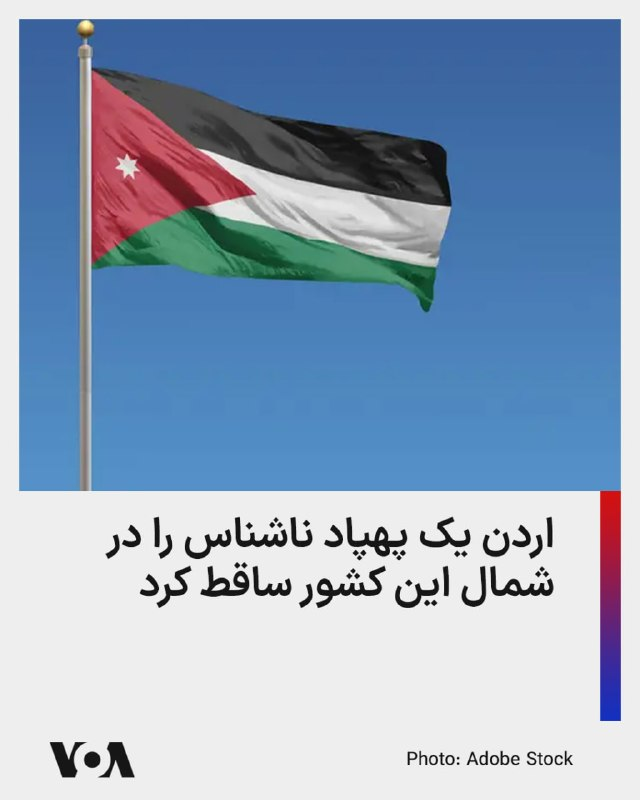

نیروهای مسلح اردن اعلام کردند صبح چهارشنبه یک پهپاد ناشناس را که وارد حریم هوایی این کشور شده بود، در استان جرش، در شمال اردن، ساقط کرده‌اند.

خبرگزاری رسمی اردن، بترا، به نقل از نیروهای مسلح این کشور گزارش داد که این پهپاد در منطقه بلیلا رهگیری و ساقط شد. بنا بر این گزارش، حادثه تلفات انسانی نداشته و خسارت‌ها به آسیب‌های مادی جزئی محدود بوده است. مقام‌های اردنی درباره مبدأ این پهپاد توضیحی نداده‌اند.

این حادثه در حالی رخ داده که طی روزهای گذشته چند کشور منطقه از رهگیری یا اصابت پهپادهایی خبر داده‌اند که مبدأ یا مسیر آنها به عراق نسبت داده شده است.

امارات متحده عربی روز سه‌شنبه اعلام کرد بررسی‌های فنی و ردیابی‌ها نشان داده پهپادهایی که تأسیسات نیروگاه هسته‌ای براکه را هدف قرار داده بودند، از خاک عراق برخاسته‌اند.

عربستان سعودی هم روز یکشنبه اعلام کرد پدافند هوایی این کشور سه پهپاد را پس از ورود از حریم هوایی عراق رهگیری و منهدم کرده است.

عراق در سال‌های اخیر به یکی از پایگاه‌های اصلی گروه‌های مسلح همسو با جمهوری اسلامی تبدیل شده است.
@FarsiVOA

## FarsiVOA — post 218211

  

وزارت امور خارجه کره جنوبی اعلام کرد یک نفتکش تحت مدیریت یک شرکت کره‌ای، پس از هماهنگی با مقام‌های جمهوری اسلامی، از تنگه هرمز عبور کرده است.

به گفته وزیر خارجه کره جنوبی، این کشتی حامل دو میلیون بشکه نفت خام بود و پس از پایان مشورت‌ها با تهران، مسیر خود را با احتیاط از آبراه هرمز آغاز کرد. مقام‌های سئول گفته‌اند این نفتکش در مسیر تعیین‌شده از سوی ایران حرکت کرده و برای عبور، هزینه‌ای به جمهوری اسلامی پرداخت نشده است.

هم‌زمان، رویترز بر اساس داده‌های کشتیرانی گزارش داد سه ابرنفتکش که بیش از دو ماه در خلیج فارس متوقف مانده بودند، در مجموع با شش میلیون بشکه نفت خام خاورمیانه در حال خروج از تنگه هرمز هستند.

این گزارش شامل نفتکش کره‌ای یونیورسال وینر با دو میلیون بشکه نفت کویت و دو نفتکش مرتبط با چین است که هر کدام حدود دو میلیون بشکه نفت عراق، قطر یا ترکیبی از آن را حمل می‌کنند.

تنگه هرمز همچنان یکی از حساس‌ترین مسیرهای انرژی جهان است؛ آبراهی که در شرایط عادی حدود یک‌پنجم عرضه نفت و انرژی جهان از آن عبور می‌کند.
@FarsiVOA

## FarsiVOA — post 218210

🔺ترامپ در نشست گروه هفت در فرانسه شرکت می‌کندد

▪️دونالد ترامپ، رئیس‌جمهوری آمریکا، در نشست سران گروه هفت در فرانسه شرکت خواهد کرد؛ نشستی که انتظار می‌رود تنش‌ها بر سر ایران و تنگه هرمز از محورهای اصلی آن باشد.

▪️اکسیوس به نقل از یک مقام کاخ سفید گزارش داد که ترامپ قصد دارد در این نشست درباره هوش مصنوعی، تجارت، مبارزه با جرائم سازمان‌یافته، کاهش وابستگی به چین در زنجیره تأمین مواد معدنی حیاتی، و پیوند دادن کمک‌های خارجی آمریکا با اهداف تجاری گفت‌وگو کند.

▪️نشست امسال گروه هفت در شرایطی برگزار می‌شود که روابط واشنگتن با چند متحد اروپایی بر سر جنگ با جمهوری اسلامی و امنیت کشتیرانی در تنگه هرمز دچار تنش شده است.

⬇️ بیشتر بخوانید:
https://ir.voanews.com/a/trump-to-attend-g7-summit-in-france/8151975.html

## FarsiVOA — post 218209

  

وزارت دادگستری آمریکا چهار غول سازنده کانتیتر چینی به همراه هفت مدیر ارشد آنها را را به تبانی برای محدود کردن تولید برای سودجویی بیشتر در دوران همه‌گیری کرونا متهم کرد.

بر اساس اعلامیه دادگستری آمریکا این شرکت‌ها که سهمی ۹۵ درصدی در تولید کانتینر کشتی‌ها در جهان دارند، با تبانی و به قصد سودجویی در سال‌های دوران کرونا، تولید خود را کاهش دادند و قیمت کانتینر کشتی در فاصله سال‌های ۲۰۱۹ تا ۲۰۲۱ دو برابر شد.

اقدام دادگستری آمریکا یکی از مهم‌ترین پرونده‌های ضدانحصار علیه شرکت‌های چینی در سال‌های اخیر محسوب می‌شود، آن هم در شرایطی که دو کشور در تلاش برای تثبیت روابط دوجانبه هستند.
@FarsiVOA

## FarsiVOA — post 218208

  

سخنگوی انجمن صنایع فرآورده‌های لبنی از افزایش ۲۰ درصدی محصولات لبنی از اول خرداد ماه خبر داد. محمد فربد، دلیل این امر را افزایش قیمت شیرخام و اثر آن بر قیمت تمام شده تولید، عنوان کرد.

بر اساس مصوبه روز یکشنبه ۲۷ اردیبهشت، وزارت جهاد کشاورزی جمهوری اسلامی، قیمت هر کیلوگرم شیر خام، حداقل ۶۰ هزار و ۵۰۰ تومان اعلام شد. قیمت قبلی ۴۶ هزار و ۵۰۰ تومان بود که افزایش ۳۰ درصدی را نشان می‌دهد.

طبق اعلام مرکز آمار، در فروردین امسال تورم نسبت به ماه مشابه سال ۱۴۰۴ ۷۳.۵ درصد و در ۱۲ ماهه منتهی به فروردین، ۵۳.۷ درصد افزایش داشته است.

پیشتر مدیرکل دفتر بهبود تغذیه جامعه وزارت بهداشت، درباره وضعیت غذایی ایرانیان «با توجه به گرانی خارج از حد تصور اقلام خوراکی»، از اجرای طرحی با عنوان «آموزش تغذیه برای مردم» خبر داده بود. احمد اسماعیل‌زاده، مدعی شد که هدف از اجرای این طرح، آموزش «شیوه‌های ارزان‌تر تأمین مواد غذایی» به شهروندان است.
@FarsiVOA

## FarsiVOA — post 218207

🔺۸۲ روز قطع اینترنت؛ معاون پزشکیان از نابودی کسب‌وکارهای روستایی خبر داد

▪️قطع گسترده اینترنت در ایران وارد هشتادودومین روز شده و پس از ۱۹۴۴ ساعت، کشور همچنان تا حد زیادی از اینترنت جهانی جدا مانده است.

▪️نت‌بلاکس در این باره یادآور شد در دورانی که حتی چند دقیقه اختلال در اینترنت می‌تواند بحران‌ساز باشد، ایران همچنان رکوردهای تازه‌ای در قطع ارتباطات دیجیتال ثبت می‌کند؛ وضعیتی که معیشت شهروندان را نابود کرده و حقوق آنان را فرسوده است.

▪️پیامدهای اقتصادی این قطعی اکنون از سوی مقام‌های دولت نیز تأیید می‌شود. عبدالکریم حسین‌زاده، معاون رئیس‌جمهور در امور توسعه روستایی و مناطق محروم، با انتقاد از وضعیت اینترنت گفته است: «وضعیت اینترنت دمار از روزگار بوم‌گردی‌ها درآورده است.»

⬇️ بیشتر بخوانید:
https://ir.voanews.com/a/8151974.html

## FarsiVOA — post 218206

🔺شوک گرانی کود شیمیایی به امنیت غذایی؛ سفره خانوار زیر فشار زنجیره گرانی

▪️روزنامه دنیای اقتصاد به نقل از نرخ‌نامه وزارت جهاد کشاورزی گزارش داده هزینه تأمین کود شیمیایی در سال جاری حدود ۶۰۰ درصد رشد کرده و قیمت برخی کودها تا چند برابر افزایش یافته است.

▪️چنین جهشی می‌تواند به معنای کاهش مصرف کود، افت عملکرد زمین و کاهش تولید محصولات اساسی باشد.

▪️پیامد این روند، در مرحله بعد، خود را در قیمت نان، غلات، حبوبات، سبزیجات و سایر اقلام ضروری نشان می‌دهد؛ یعنی همان جایی که فشار تولید مستقیم به سفره مردم منتقل می‌شود.

▪️به این ترتیب، افزایش سنگین قیمت کودهای شیمیایی در ایران، نشانه تازه‌ای از بحرانی است که از مزرعه آغاز می‌شود و به سفره خانوار می‌رسد.

⬇️ بیشتر بخوانید:
https://ir.voanews.com/a/8151973.html

## FarsiVOA — post 218205

  

رئیس دولت جمهوری اسلامی گفت که اگر برای مدیریت مصرف آب، برق، گاز و بنزین برنامه‌ریزی دقیق نداشته باشیم، در ادامه با مشکلاتی مواجه خواهیم شد.

مسعود پزشکیان روز چهارشنبه ۳۰ اردیبهشت، در نشست سراسری با استانداران، مدعی شد که مشکلات مربوط به کمبودها، ناشی از «جنگ» است، اما همزمان بیان داشت که با «روش‌های گذشته» نمی‌توان برای امروز راه‌حلی پیدا کرد. او تصریح کرد که اگر روش‌های پیشین به‌تنهایی قادر به حل مسائل بود، بسیاری از مشکلات تاکنون برطرف شده بود.

پزشکیان از آن روی بر ضرورت کاهش مصرف انرژی به‌ویژه بنزین تاکید می‌کند که پیشتر رمضانعلی سنگدوینی، عضو کمیسیون انرژی مجلس شورای اسلامی، از «ناترازی روزانه ۲۰ میلیون لیتری بنزین» در کشور خبر داده بود.

همچنین علیرضا شریعت، دبیرکل فدراسیون صنعت آب ایران، با اشاره به تنش آبی در ایران، هشدار داده بود که در صورت عدم صرفه‌جویی در مصرف آب، کشور با بحران مهاجرت اجباری دست‌کم‌ ۱۵ میلیون نفر مواجه خواهد شد.
@FarsiVOA

## FarsiVOA — post 218204

🔺رویترز: آمریکا نیروهای در دسترس ناتو در بحران‌ها را کاهش می‌دهد

▪️رویترز به نقل از سه منبع آگاه گزارش داد دولت دونالد ترامپ قصد دارد این هفته به متحدان ناتو اعلام کند که آمریکا بخشی از توانایی‌های نظامی خود را که در بحران‌ها یا جنگ‌های بزرگ در اختیار ناتو قرار می‌داد، کاهش خواهد داد.

▪️این تصمیم در چارچوب «مدل نیروی ناتو» مطرح شده است؛ سازوکاری که بر اساس آن، کشورهای عضو مشخص می‌کنند در صورت حمله نظامی یا بحران بزرگ، چه نیروها و قابلیت‌هایی را می‌توانند در اختیار ائتلاف بگذارند.

▪️ترکیب دقیق این نیروها محرمانه است، اما پنتاگون تصمیم گرفته تعهدات خود را به شکل قابل توجهی کاهش دهد.

▪️دونالد ترامپ پیش‌تر بارها اعضای ناتو را به کم‌کاری در هزینه‌های دفاعی متهم کرده بود.

⬇️ بیشتر بخوانید:
https://ir.voanews.com/a/8151972.html

## FarsiVOA — post 218203

🔺بسنت: آمریکا عجله‌ای برای تمدید آتش‌بس تجاری با چین ندارد

▪️وزیر خزانه‌داری آمریکا می‌گوید ایالات متحده عجله‌ای برای تمدید آتش‌بس تجاری با چین ندارد، اما مذاکرات پیرامون طیفی از مسائل دوجانبه مانند کاهش تعرفه‌های تجاری، سرمایه‌گذاری و هوش مصنوعی ادامه خواهد داشت.

▪️دونالد ترامپ رئیس‌جمهور آمریکا هفته گذشته طی سفری به پکن با همتای چینی خود دیدار و نتیجه مذاکرات را «عالی» توصیف کرد.

▪️دو کشور طی سال‌های گذشته جنگ تمام عیار اقتصادی و تجاری علیه همدیگر آغاز کرده، اما پارسال توافقاتی برای تعدیل تعرفه‌های تجاری تا نوامبر امسال انجام شد.

▪️قرار است شی جین‌پینگ رئیس‌جمهور چین در ماه سپتامبر، دو ماه مانده به پایان مهلت آتش‌بس تجاری، سفری به آمریکا داشته باشد.

⬇️ بیشتر بخوانید:
https://ir.voanews.com/a/8151971.html

## FarsiVOA — post 218202

🔺بحران در تأمین مواد اولیه؛ جمهوری اسلامی بخشی از واردات پتروشیمی را به کولبری و ملوانی سپرد

▪️در میانه اختلال در مسیرهای رسمی تجارت و فشار بر زنجیره تأمین صنایع، سازمان توسعه تجارت ایران واردات برخی مواد اولیه پتروشیمی و پلیمری را از طریق رویه‌های کولبری و ملوانی مجاز اعلام کرد.

▪️این تصمیم نشان می‌دهد بحران تأمین مواد اولیه در صنایع پایین‌دستی به مرحله‌ای رسیده که جمهوری اسلامی برای جبران کمبود، به مسیرهای مرزی و غیرمتعارف متوسل شده است.

▪️کولبری در ایران سال‌ها با فقر، ناامنی مرزی و برخوردهای خشونت‌آمیز همراه بوده است.

▪️پیش‌تر نیز سازمان توسعه تجارت ایران ممنوعیت صادرات محصولات شیمیایی، پلیمری و پتروشیمی را در شرایط اضطراری به گمرک ابلاغ کرده بود؛ تصمیمی که هدف آن تأمین نیاز داخلی اعلام شد.

⬇️ بیشتر بخوانید:
https://ir.voanews.com/a/8151970.html

## FarsiVOA — post 218201

🔺رویترز: دو نفتکش چینی با چهار میلیون بشکه نفت از تنگه هرمز خارج شدند

▪️رویترز گزارش داد دو نفتکش غول‌پیکر چینی، حامل مجموعاً چهار میلیون بشکه نفت خام خاورمیانه، روز چهارشنبه از تنگه هرمز خارج شده‌اند.

▪️بر اساس داده‌های ال‌اس‌ای‌جی و کپلر، این دو نفتکش از جمله شمار محدودی از ابرنفتکش‌هایی هستند که در ماه جاری، با حمل نفت خام عراق، از مسیر عبوری خارج شده‌اند که جمهوری اسلامی کشتی‌ها را به استفاده از آن ملزم کرده است.

▪️دو نفنکش چینی حامل نفت خام عراق و قطر هستند.

▪️چین که روابط دوستانه‌ای با جمهوری اسلامی دارد، به شدت به انرژی خاورمیانه وابسته است و حدود ۴۵ درصد نفت خود را از مسیر هرمز دریافت می‌کند.

⬇️ بیشتر بخوانید:
https://ir.voanews.com/a/8151969.html

## FarsiVOA — post 218200

  

آمارهای گمرکی چین حاکی از افت ۷۰ درصدی تجارت دوجانبه با ایران بعد از آغاز عملیات مشترک نظامی آمریکا و اسرائیل علیه جمهوری اسلامی است.

طبق داده‌های گمرک چین، این کشور در ماه‌های مارس و آوریل به طور متوسط ماهانه ۲۰۰ میلیون دلار تجارت دوجانبه با ایران داشته؛ در حالی که در ماه‌های ژانویه و فوریه این رقم حدود ۷۰۰ میلیون دلار بود.

گمرک چین سال‌هاست که آمارهای خرید نفت از ایران را از داده‌های مربوط به تجارت دوجانبه خارج کرده، اما آمارهای کپلر نشان می‌دهد خرید روزانه نفت ایران توسط پالایشگاه‌های چینی نیز در ماه گذشته تنها ۱.۱۶ میلیون بشکه بوده که حدود ۳۰ درصد کمتر از ماه‌های گذشته است.

⬇️ بیشتر بخوانید:
https://ir.voanews.com/a/8151968.html

## FarsiVOA — post 218199

  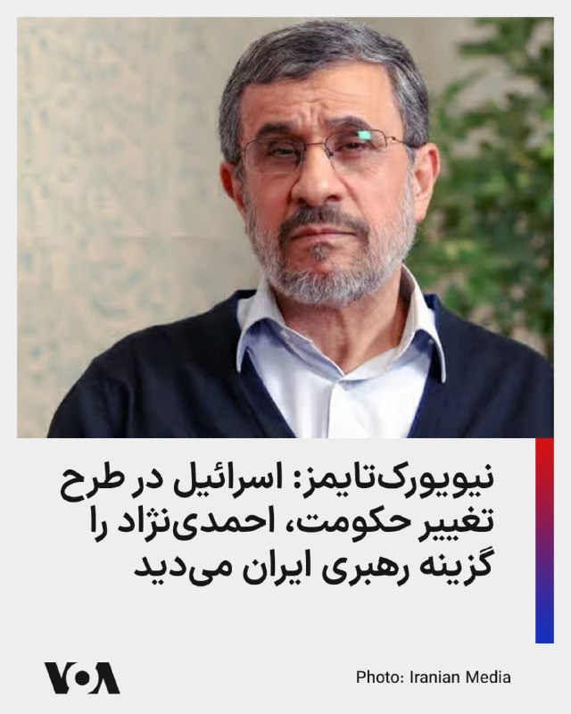

نیویورک‌تایمز گزارش داد اسرائیل در جریان طراحی یک طرح چندمرحله‌ای برای سرنگونی جمهوری اسلامی، محمود احمدی‌نژاد را به‌عنوان گزینه‌ای برای رهبری ایران پس از حذف علی خامنه‌ای و شماری از مقام‌های ارشد حکومت در نظر گرفته بود.

به نوشته این روزنامه، هنوز روشن نیست احمدی‌نژاد چگونه وارد این طرح شده یا چه میزان از جزئیات آن اطلاع داشته است. با این حال، بسیاری از مشاوران دونالد ترامپ این ایده را غیرواقع‌بینانه می‌دانستند و برخی مقام‌های آمریکایی به‌ویژه درباره امکان بازگرداندن احمدی‌نژاد به قدرت تردید داشتند.

نیویورک‌تایمز همچنین نوشت شماری از مقام‌های جمهوری اسلامی که در حمله به بیت رهبری کشته شدند، از نگاه کاخ سفید در میان چهره‌هایی قرار داشتند که آمادگی بیشتری برای گفت‌وگو درباره تغییر حکومت داشتند.

در همان دوره، رسانه‌های ایران ابتدا گزارش‌هایی درباره کشته‌شدن احمدی‌نژاد در حمله هوایی به خانه‌اش منتشر کردند؛ اما بعداً اعلام شد او زنده مانده است. تصاویر ماهواره‌ای نشان می‌داد خانه او آسیب جدی ندیده، اما پایگاه امنیتی ورودی کوچه کاملاً تخریب شده است.
@FarsiVOA

## FarsiVOA — post 218198

  

قوه قضائیه جمهوری اسلامی اعلام کرد حکم قصاص متهم به قتل الهه حسین‌نژاد، پس از تأیید در دیوان عالی کشور و با درخواست اولیای دم، اجرا شده است. رسانه‌های داخلی نام متهم این پرونده را بهمن فرزانه اعلام کرده‌اند.

الهه حسین‌نژاد خرداد ۱۴۰۴ پس از سوار شدن به یک خودروی مسافرکش برای بازگشت به خانه ناپدید شد. چند روز بعد، پیکر او در بیابان‌های اطراف تهران پیدا شد.

در گزارش‌های رسمی ادعا شده متهم پس از بازداشت به قتل اعتراف کرده و کیفرخواست پرونده با اتهام قتل عمد، مخفی کردن جسد و صدمه به اموال مقتول به دادگاه کیفری یک استان تهران ارسال شده است.

اجرای این حکم در حالی اعلام می‌شود که گزارش تازه عفو بین‌الملل از افزایش شدید اعدام‌ها در ایران در سال ۲۰۲۵ خبر داده است.

بر اساس این گزارش، جمهوری اسلامی در سال ۲۰۲۵ دست‌کم ۲۱۵۹ نفر را اعدام کرده؛ رقمی که بیش از دو برابر آمار سال ۲۰۲۴ است و ایران را عامل اصلی جهش جهانی اعدام‌ها در بالاترین سطح ثبت‌شده طی ۴۴ سال گذشته معرفی می‌کند.

عفو بین‌الملل می‌گوید آمار جهانی اعدام‌ها در سال ۲۰۲۵، بدون احتساب چین، کره شمالی و ویتنام، به ۲۷۰۷ مورد رسیده است.
@FarsiVOA

## FarsiVOA — post 218197

⚡️سنتکام اعلام کرد که از زمان اجرای محاصره دریایی جمهوری اسلامی نیروهای آمریکایی ۸۹ کشتی را وادار به تغییر مسیر کرده‌اند. سنتکام گفت مانع هرگونه جریان تجاری به داخل و خارج از بنادر ایران شده است تا محاصره دریایی علیه جمهوری اسلامی به طور کامل اجرا شود.
@FarsiVOA

## FarsiVOA — post 218196

🔺ترامپ: نمی‌خواهم بگویم که رهبران جمهوری اسلامی نیز نابود شده‌اند چون صحبت خیلی قشنگی نیست؛ آن‌ها به‌شدت مایل به توافقند

▪️دونالد ترامپ، رئیس‌جمهوری آمریکا، سه‌شنبه شب در سخنانی در مراسم «پیکنیک کنگره» در کاخ سفید گفت ایالات متحده «به‌سرعت» به «جنگ» با جمهوری اسلامی پایان خواهد داد و افزود رژیم ایران «به‌شدت مایل» به رسیدن به توافق است و از شرایط حاضر «خسته» شده است.

⬇️ بیشتر بخوانید:
https://ir.voanews.com/a/8151966.html
@FarsiVOA

## FarsiVOA — post 218195

🔺مایک والتز: جمهوری اسلامی ۴۷ سال است که صلح جهانی را تهدید می‌کند

▪️مایک والتز، سفیر آمریکا در سازمان ملل متحد، گفت جمهوری اسلامی به تاسیسات غیرنظامی در خاورمیانه حمله می‌کند.

⬇️ بیشتر بخوانید:
https://ir.voanews.com/a/8151759.html
@FarsiVOA

## FarsiVOA — post 218194

  

⚡️سایت خبری آکسیوس به نقل دو مقام آمریکایی گزارش داد دونالد ترامپ، رئیس جمهوری آمریکا، عصر دوشنبه جلسه‌ای با تیم ارشد امنیت ملی خود در مورد ایران تشکیل داد که شامل توضیحاتی در مورد گزینه‌های نظامی بود.
@FarsiVOA

## DW_Farsi — post 124918

🎥 از ازدواج اجباری تا سکوی قهرمانی

رویا کریمی، بدنساز افغان، در ۱۴ سالگی مجبور به ازدواج شد و در ۱۷ سالگی همراه پسر کوچکش از افغانستان گریخت. او حالا در نروژ، پس از سال‌ها مبارزه با محدودیت‌ها، به قهرمانی در بدنسازی رسیده و صدای زنانی شده است که هنوز از ابتدایی‌ترین حقوق خود محروم‌اند.

@dw_farsi

## DW_Farsi — post 124917

🔶 پوتین در پکن؛ شی: آتش‌بس فوری در خاورمیانه ضروری است
 
شی جین‌پینگ روز چهارشنبه ۲۰ مه (۳۰ اردیبهشت) در تالار بزرگ خلق از ولادیمیر پوتین استقبال رسمی کرد؛ دیداری که تنها چند روز پس از ملاقات او با دونالد ترامپ انجام شد.
 
پوتین و شی در ۱۰ سال اخیر ۴۲ بار باهم ملاقات کرده‌اند. رهبران دو کشور یکدیگر را "دوست عزیز" خطاب می‌کنند.
 
پوتین در این دیدار در تالار بزرگ خلق بر ادامه تماس‌های نزدیک میان دو کشور تاکید کرد و گفت که روابط میان مسکو و پکن هم در سطح شخصی و هم از طریق نهادهای دولتی به‌طور مستمر ادامه دارد.
 
شی جین‌پینگ نیز بر سطح بالای اعتماد سیاسی و همکاری راهبردی میان دو کشور تاکید کرد. پیش‌تر نیز او روابط خود با پوتین را بسیار نزدیک توصیف کرده و از او به عنوان یکی از مهم‌ترین دوستان خود یاد کرده بود.
 
به گفته تحلیلگران، نزدیکی زمان دیدار رهبران آمریکا و روسیه از چین نشان‌دهنده افزایش نقش پکن در معادلات قدرت جهانی است.
 
در دستور کار اصلی این مذاکرات، موضوعات انرژی، امنیت و روابط اقتصادی قرار دارد و درباره مسائل بین‌المللی و منطقه‌ای از جمله جنگ ایران و همچنین اوکراین تبادل نظر خواهد شد.
@dw_farsi

## DW_Farsi — post 124916

  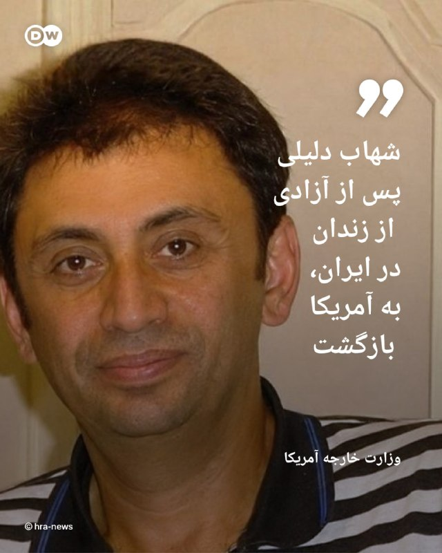

🔶 وزارت خارجه آمریکا: شهاب دلیلی پس از آزادی از زندان در ایران، به آمریکا بازگشت
 
وزارت امور خارجه ایالات متحده آمریکا روز سه‌شنبه تایید کرد که یک شهروند ایرانی دارای اقامت دائم آمریکا، پس از آزادی از زندان در ایران، به ایالات متحده بازگشته است.
 
یک سخنگوی این وزارتخانه اعلام کرد: «وزارت خارجه با خوشحالی از بازگشت امن شهاب دلیلی پس از بازداشتش در ایران استقبال می‌کند.»
 
او با تاکید بر این که حکومت ایران "باید فورا همه افرادی را که به‌ناحق در ایران بازداشت شده‌اند، آزاد کند"، افزود که دونالد ترامپ، رئیس‌ جمهور ایالات متحده آمریکا و مارکو روبیو، وزیر خارجه آمریکا، "به تلاش برای آزادی همه آمریکایی‌هایی که به‌ناحق بازداشت شده‌اند، ادامه خواهند داد".
 
ارگان خبری مجموعه فعالان حقوق بشر در ایران (هرانا) پیش‌تر اعلام کرده بود که شهاب دلیلی، شهروند ایرانی و دارای اقامت دائم آمریکا که در زندان اوین زندانی بود، پس از گذراندن ۱۰ سال حبس آزاد شد و پس از آزادی، به ایالات متحده بازگشت.
 
@dw_farsi

## DW_Farsi — post 124915

  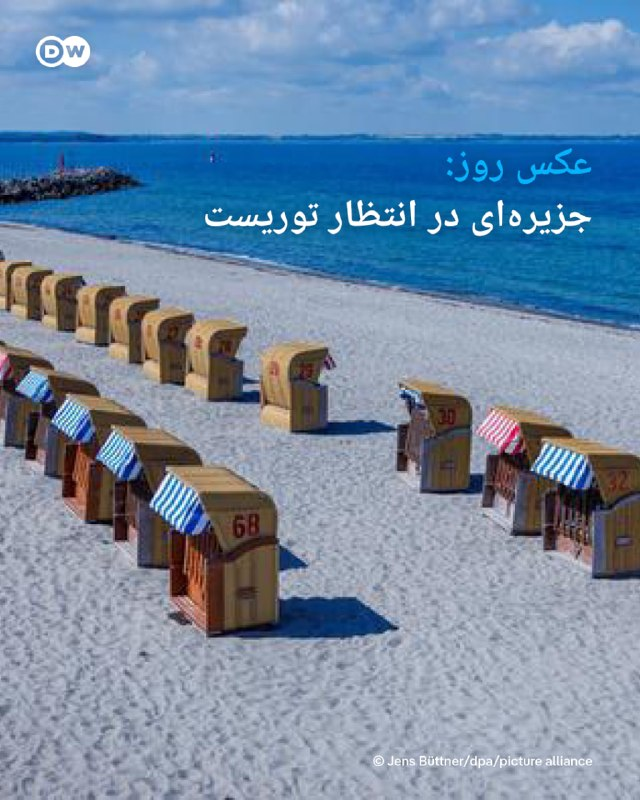

📸 عکس روز: جزیره‌ای در انتظار توریست

جزیره پوئل در شمال آلمان یک منطقه توریستی و محبوب برای گردشگران به شمار می‌رود. در هفته‌های اخیر آمار سفرهای توریستی در بسیاری از کشورهای اروپایی از جمله آلمان کاهش یافته است؛ عمدتا به دلیل شرایط اقتصادی نامطلوب و بدی آب و هوا. در این عکس تعداد معدودی از گردشگران از مقابل صندلی‌های ساحلی خالی در این جزیره عبور می‌کنند. 
@dw_farsi

## DW_Farsi — post 124914

  

🔶 شورای امنیت سازمان ملل حمله به نیروگاه هسته‌ای امارات را محکوم کرد
 
روز سه‌شنبه اعضای شورای امنیت سازمان ملل شامل روسیه، حمله پهپادی اخیر به نیروگاه هسته‌ای "براکه" در امارات متحده عربی را محکوم کردند.
 
این حمله پهپادی که هیچ گروهی مسئولیت آن را بر عهده نگرفته است، روز یکشنبه یک ژنراتور برقی را در نزدیکی نخستین نیروگاه هسته‌ای جهان عرب در براکه در ابوظبی هدف قرار داد و باعث آتش‌سوزی شد، اما هیچ مصدومیت یا نشت مواد رادیواکتیو ایجاد نکرد.
در همین راستا واسیلی نبنزیا، سفیر روسیه در سازمان ملل متحد گفت: «حملاتی که تاسیسات هسته‌ای صلح‌آمیز در هر کشوری از جهان را هدف قرار می‌دهند، کاملا غیرقابل قبول هستند.»

او بدون نام بردن از عاملان احتمالی این حمله ادامه داد: «در این چارچوب، کشور ما [روسیه] اقدامات کسانی را که حمله علیه این نیروگاه در خاک امارات متحده عربی را انجام دادند و از این طریق خطرات تشدید تنش را ایجاد کردند، به‌طور قاطع محکوم می‌کند.»

او در عین حال مدعی شد که این حمله احتمالا اگر جنگ ایالات متحده و اسرائیل علیه جمهوری اسلامی انجام نمی‌شد، رخ نمی‌داد.

 
@dw_farsi

## DW_Farsi — post 124913

  

🔶 بقایی اظهارات فرمانده سنتکام درباره مدرسه میناب را "بی‌اساس" خواند
 
اسماعیل بقایی، سخنگوی وزارت خارجه جمهوری اسلامی، اظهارات برد کوپر، فرمانده نیروهای مرکزی ایالات متحده، سنتکام، در خصوص مدرسه ابتدایی شجره طیبه در میناب را "بی‌اساس و دروغی تکان‌دهنده" خواند.
 
فرمانده سنتکام روز سه‌شنبه در برابر کنگره ایالات متحده آمریکا اعلام کرده بود که تحقیقات نظامی صورت‌گرفته توسط آمریکا در خصوص انفجاردر این مدرسه "پیچیده است، چرا که این مدرسه در یک سایت فعال موشک‌های کروز ایران واقع شده بود".
 
بقایی در واکنش به این اظهارات در شبکه اجتماعی ایکس، این سخنان را " تحریف بی‌شرمانه" خواند و مدعی شد که این "تلاشی آشکار برای پنهان کردن واقعیت تلخ حملات موشکی ۲۸فوریه (نهم اسفند) است؛ حملاتی که به کشته شدن تراژیک بیش از ۱۷۰دانش‌آموز و معلمان‌شان انجامید".
 
سخنگوی وزارت خارجه جمهوری اسلامی، "هدف قرار دادن" این مدرسه را "نقض جدی حقوق بشردوستانه بین‌المللی و جنایت جنگی آشکار" توصیف کرد.
@dw_farsi

## DW_Farsi — post 124912

  

🔶 رای اولیه سنای آمریکا به محدود کردن اختیارات ترامپ در جنگ با ایران
 
برای نخستین بار، سنای آمریکا به قطعنامه‌ای رای داد که در صورت تصویب، قرار است دونالد ترامپ، رئیس جمهور آمریکا را به پایان دادن به جنگ ایران وادار کند.
 
سنای آمریکا روز سه‌شنبه به وقت محلی، با حمایت چهار نماینده جمهوری‌خواه، با ۵۰ رای موافق در برابر ۴۷ رای مخالف، به یک گام آیین‌نامه‌ای برای پیشبرد این طرح رای داد. اکنون این طرح می‌تواند در هفته‌های آینده مورد بحث قرار گیرد و به رای‌گیری نهایی گذاشته شود.
 
جمهوری‌خواهان پیش از این در سال جاری، هفت تلاش مشابه در سنا و سه مورد در مجلس نمایندگان را متوقف کرده بودند و اختیار تصمیم‌گیری درباره جنگ را در دست رئیس‌ جمهور نگه داشته بودند.
 
با این حال، این قطعنامه هنوز باید از موانع بزرگی عبور کند. حتی اگر هر دو مجلس به آن رای مثبت بدهند، ترامپ می‌تواند آن را وتو کند.
 
قطعنامه محدود کردن اختیارات ترامپ در جنگ با ایران را تیم کین، سناتور دموکرات ارائه کرده بود. او ترامپ را متهم کرده است که "پیشنهادهای صلح را نادیده می‌گیرد".
 
@dw_farsi

## DW_Farsi — post 124911

🔶 جام‌های ۱۹۵۸ و ۱۹۷۰؛ پله، مروارید سیاه برزیل و بازیکن قرن
 
اِدسون آرانتِس دو ناسیمنتو، ملقب به پله، روز ۲۳ اکتبر ۱۹۴۰ در شهری کوچک بین ریو دژانیرو و سائو پائولو در برزیل به دنیا آمد. او در سن ۱۱ سالگى توجه مربیان فوتبال را به خود جلب کرد و ۴ سال بعد به خدمت باشگاه صاحب‌نام سانتوس درآمد. پله در سال ۱۹۵۶ در حالی که ۱۶ سال بیشتر سن نداشت، اولین گل خود را براى این تیم به ثمر رساند.
 
پله خود در مورد آن روزها گفته است: «سیزده، چهارده ساله بودم و در باشگاه ‌"بائرو" بازی می‌کردم. ما برنده شدیم و جایزه‌‌ای بردیم و عکسم را در روزنامه‌ها چاپ کردند. آن موقع می‌دانستم که می‌خواهم فوتبالیست حرفه‌ای شوم.»
 
درخشش فوق‌العاده‌ پله در لیگ برزیل، زمینه‌ای بود برای دعوت از او به اردوی تیم ملی براى حضور در جام جهانى ۱۹۵۸ سوئد؛ تورنمنتی که در آن جهان با ستاره‌اى استثنایى آشنا شد.
 
قدرت دریبل‌زنى، دید وسیع و پاس‌هاى دقیق پله‌ ۱۷ ساله او را در کنار واوا و گارینشا، به یکی از سه عضو مثلث جادویی برزیل تبدیل کرد.
 
این ستا‌ره‌ نوظهور در مرحله‌ گروهی این رقابت‌ها مصدوم شد، اما به اصرار دیگر بازیکنان تیم ملی، در دیدارهاى حساس بعدى به میدان رفت.
 
پله در یک‌چهارم نهایى جام جهانی ۱۹۵۸، یک گل به وِلز زد، در دیدار نیمه‌نهایى، سه بار دروازه‌ فرانسه را گشود و در فینال هم دو گل از ۵ گل تیمش را به ثمر رساند. تیم ملی برزیل در دیدار نهایی ۵ بر ۲ سوئد میزبان مسابقات را شکست داد و بدین ترتیب پله در سن ۱۷ سالگی نخستین قهرمانی جهان را تجربه کرد.
 
@dw_farsi

## DW_Farsi — post 124910

  

🔶 "ارتش آمریکا دست‌کم ۱۰ مین را در تنگه هرمز شناسایی کرده است"
 
سی‌بی‌اِس نیوز به نقل از مقام‌های ایالات متحده که نخواسته‌اند نام‌شان فاش شود، بر مبنای یک ارزیابی اطلاعاتی اخیر گزارش داده که نیروهای ارتش این کشور دست‌کم ۱۰ مین را در تنگه هرمز  شناسایی کرده‌اند.
 
سی‌بی‌اِس نیوز پیش‌تر در ماه مارس گزارش داده بود که بر اساس ارزیابی‌های اطلاعاتی آمریکا در آن زمان، دست‌کم ۱۲ مین زیرآبی در تنگه هرمز وجود داشته است. مقام‌های آمریکایی در ماه مارس گفته بودند مین‌هایی که اکنون جمهوری اسلامی در تنگه هرمز به کار گرفته، مین‌های چسبنده "مهام ۳" و "مهام ۷" ساخت ایران هستند. یک مقام دیگر ایالات متحده تعداد آن‌ها را کمتر از ۱۲ عدد اعلام کرده بود.
   
ایالات متحده هشدار داده است که عبور از مسیر عادی در تنگه هرمز می‌تواند به دلیل مین‌هایی که جمهوری اسلامی در تنگه هرمز کار گذاشته، "بسیار خطرناک" باشد.
 
پنتاگون پیش از این، تصویری گرافیکی منتشر کرده بود که نشان می‌داد جمهوری اسلامی در ۲۳ آوریل مین‌های جدیدی در تنگه هرمز کار گذاشته است.
 
@dw_farsi

## DW_Farsi — post 124909

🔶 ترامپ: جنگ با ایران را خیلی سریع پایان خواهیم داد
 
به گزارش خبرگزاری رویترز، دونالد ترامپ، رئیس ‌جمهور ایالات متحده، در کاخ سفید به اعضای کنگره گفته است که ایالات متحده، "جنگ با ایران را خیلی سریع" پایان خواهد داد.
 
همزمان دو مقام ایالات متحده به اکسیوس گفته‌اند که ترامپ، شامگاه دوشنبه جلسه‌ای با تیم ارشد امنیت ملی خود درباره ایران برگزار کرد که شامل ارائه گزارشی درباره گزینه‌های نظامی بود. بر اساس این گزارش، این جلسه چند ساعت پس از آن برگزار شد که ترامپ اعلام کرده بود حملات برنامه‌ریزی‌شده روز سه‌شنبه به ایران را متوقف کرده است.
 
ترامپ همچنان در تازه‌ترین اظهارنظرهای خود درباره جنگ ایران گفته است که جمهوری اسلامی تنها چند روز برای رسیدن به یک پیشرفت دیپلماتیک فرصت دارد.
 
او روز دوشنبه گفت که ضرب‌الاجل برای تعیین تکلیف این موضوع، "دو سه روز، شاید جمعه یا شنبه، یا اوایل هفته آینده" است.
 
به گفته مقام‌های ایالات متحده و منابع منطقه‌ای، تصمیم ترامپ برای خودداری از حمله تا حدی به دلیل نگرانی‌هایی بود که چند رهبر کشورهای خلیج فارس درباره حملات تلافی‌جویانه جمهوری اسلامی علیه تاسیسات نفتی و زیرساخت‌هایشان مطرح کرده بودند.
 
به گزارش اکسیوس، حاضران در جلسه با ترامپ، جی‌دی ونس، معاون او، مارکو روبیو، وزیر امور خارجه، استیو ویتکاف، فرستاده کاخ سفید، پیت هگست، وزیر دفاع، ژنرال دن کین، رئیس ستاد مشترک ارتش، جان رتکلیف، رئیس سازمان اطلاعات مرکزی آمریکا (سیا)، و دیگر مقام‌های ارشد بوده‌اند.
 
یک منبع منطقه‌ای نیز به اکسیوس گفته است که میانجی‌ها در تلاش هستند تا جمهوری اسلامی را متقاعد کنند موضعی انعطاف‌پذیرتر ارائه دهد که خواسته‌های هسته‌ای ایالات متحده را در بر بگیرد.
 
این در حالی است که ترامپ روز سه‌شنبه گفته بود: «ممکن است مجبور شویم یک ضربه بزرگ دیگر به ایران وارد کنیم. هنوز مطمئن نیستم. خیلی زود خواهید فهمید.»
 
این خبرگزاری پیش از این گزارش داده بود که ترامپ از زمان آغاز جنگ در ماه فوریه تا کنون "دست کم شش بار ضرب‌الاجل‌های اعلام‌شده را تمدید کرده و حمله‌های برنامه‌ریزی شده علیه جمهوری اسلامی را به تعویق انداخته است."
@dw_farsi

## DW_Farsi — post 124908

🔶 نمایش کلاشینکف روی آنتن؛ "بازگشت پروپاگاندای جنگی دهه شصت"
 
🔻 گزارشی از الینا فرهادی
 
در هفته‌های اخیر، آنتن شبکه‌های مختلف صدا و سیمای جمهوری اسلامی ایران شاهد تحولی بی‌سابقه و تامل‌برانگیز بوده است؛ قاب‌هایی که پیش از این به پادگان‌ها و رژه‌های نظامی محدود می‌شد، اکنون به برنامه‌های زنده، استودیوهای روتین و حتی دستان مجریان تلویزیونی راه یافته است.
 
از آموزش گام‌به‌گام باز و بسته کردن اسلحه کلاشنیکف تا نمایش تیربارهای سنگین و موشک‌اندازهای آرپی‌جی، رسانه رسمی حکومت ایران آشکارا یک "جامعه مسلح" و آماده برای بدترین سناریوها را تصویر می‌کند. بازوهای مدیریتی صداوسیما این روند را بخشی طبیعی از "آرایش جنگی رسانه ملی" در بحبوحه تنش‌های فزاینده منطقه‌ای می‌دانند. محسن برمهانی، معاون سیما، با صراحتی کم‌سابقه معتقد است در شرایط فعلی، وظیفه تلویزیون نه صرفا اطلاع‌رسانی، بلکه "تهییج و آموزش" برای مفاهیم جهاد و مقاومت است. در همین راستا، حسن عابدینی، معاون سیاسی این سازمان، نمایش اسلحه در دست مجریان و مهمانان را اقدامی "نمادین" برای بازنمایی آمادگی نیروهای داوطلب در برابر تهدیدات خارجی ارزیابی می‌کند.
 
 اما ناظران و حتی برخی رسانه‌های داخلی، این ویترین جدید را نشانه‌ای از یک بازآرایی استراتژیک با اهداف چندگانه داخلی و خارجی ارزیابی می‌کنند.
 
تحلیل‌گران مسائل سیاسی معتقدند این حجم از نظامی‌گری عریان بر صفحه تلویزیون، پیام پیچیده‌ای را حمل می‌کند که لزوما مخاطب خارجی یا دشمنان منطقه‌ای را هدف نگرفته است. منتقدان می‌گویند فراتر از نمایش بازدارندگی در برابر تهدیدهای بیرونی، این تصاویر پالس‌های مشخصی از ارعاب روانی را به جامعه معترض و مستعد بحران در داخل مخابره می‌کند؛ جامعه‌ای که زیر بار فشارهای خردکننده اقتصادی و انسداد سیاسی قرار دارد. در واقع، ابهام بزرگ اینجاست که آیا حاکمیت در حال آماده‌سازی هواداران خود برای یک رویارویی بزرگ نظامی است، یا آگاهانه بذر اضطراب اجتماعی را می‌پاشد تا هرگونه صدای مخالفت داخلی را در فضای گرگ‌ومیش "وضعیت جنگی" خفه کند؟
@dw_farsi

## Persian_Trend_Official — post 14520

  <a href="telegram/content/Persian_Trend_Official_14520_1779273745.mp4" target="_blank">🎬 Download video</a>

🔴 نخستین پرواز نسخه دو نفره جنگنده سوخو-۵۷ انجام شد

💢شرکت هواپیماسازی متحد روسیه اعلام کرد نمونه اولیه نسخه دو نفره جنگنده نسل پنجم «سوخو-۵۷» نخستین پرواز آزمایشی خود را با موفقیت انجام داده است.

بر اساس گزارش‌ها:

▪️ این نسخه برای آموزش خلبانان طراحی شده است

▪️ همچنین قرار است نقش هواپیمای فرماندهی برای هدایت عملیات مشترک جنگنده‌ها و پهپادها را ایفا کند

▪️ روسیه به‌دنبال توسعه مفهوم عملیات «سرنشین‌دار ـ بدون‌سرنشین» با استفاده از سوخو-۵۷ است

سوخو-۵۷ پیشرفته‌ترین جنگنده پنهانکار عملیاتی روسیه محسوب می‌شود.

🫆:Tony

📌 @persian_trend_official
پرشین ترند | متفاوت‌ترین کانال نظامی

## Persian_Trend_Official — post 14519

تا لحظاتی دیگر؛ سومین پیام صوتی قالیباف خطاب به مردم 

پ.ن : بوی مشکوکی به مشام میرسه !

## Persian_Trend_Official — post 14518

وزیر کشور پاکستان مجددا وارد تهران شد !!!

## Persian_Trend_Official — post 14517

  

⭕️ صداوسیما: تا عید غدیر مجسمه‌ای ۱۵ متری از مشت رهبر شهید در میدان انقلاب تهران نصب میشه.

📝 Nick

📌 @persian_trend_official
پرشین ترند | متفاوت‌ترین کانال نظامی

## Persian_Trend_Official — post 14516

https://youtube.com/shorts/P0wevYn52wU?feature=share

## Persian_Trend_Official — post 14515

  

💢واردات مواد اولیه پتروشیمی و پلیمری مجاز شد

💢مدیرکل دفتر مقررات صادرات و واردات وزارت صنعت، معدن و تجارت، در مکاتبه‌ای با مدیرکل واردات گمرک ایران، امکان واردات برخی مواد اولیه مرتبط با حوزه پتروشیمی و پلیمری از طریق رویه‌های ملوانی و کولبری را ابلاغ کرد.

🫆:Tony

📌 @persian_trend_official
پرشین ترند | متفاوت‌ترین کانال نظامی

## Persian_Trend_Official — post 14514

  <a href="telegram/content/Persian_Trend_Official_14514_1779273749.mp4" target="_blank">🎬 Download video</a>

کپشن با شما ...

📌 @persian_trend_official
پرشین ترند | متفاوت‌ترین کانال نظامی

## Persian_Trend_Official — post 14513

  

💢قاتل الهه حسین نژاد اعدام شد.

🫆:Tony
📌 @persian_trend_official
پرشین ترند | متفاوت‌ترین کانال نظامی

## Persian_Trend_Official — post 14512

حسین شریعتمداری : خاک بحرین متعلق به ایران است و مردم آن فارسی زبانند و خواستار الحاق این کشور به ایران هستند 💢دولت بحرین از جمهوری اسلامی ایران به سازمان ملل شکایت کرده و مدعی شده که ایران در امور داخلی بحرین دخالت می‌کند. 💢 اولا  بحرین متعلق به ایران است…

## Persian_Trend_Official — post 14511

حسین شریعتمداری : خاک بحرین متعلق به ایران است و مردم آن فارسی زبانند و خواستار الحاق این کشور به ایران هستند

💢دولت بحرین از جمهوری اسلامی ایران به سازمان ملل شکایت کرده و مدعی شده که ایران در امور داخلی بحرین دخالت می‌کند.

💢 اولا  بحرین متعلق به ایران است و مردم آن سامان خودشان را ایرانی می‌دانند. به زبان فارسی حرف می‌زنند و خواستار الحاق به وطن اصلی خود هستند.

💢ثانیاًً، حاکمان دست‌نشانده بحرین، خاک این جزیره ایرانی را برای حمله نظامی به ایران در اختیار آمریکا و رژیم صهیونیستی گذاشته‌اند. بنابراین، علاوه‌ بر خلع ید، باید محاکمه و مجازات هم بشوند.

🫆:Tony

📌 @persian_trend_official
پرشین ترند | متفاوت‌ترین کانال نظامی

## Persian_Trend_Official — post 14510

🔴 آزادی شهروند ایرانی دارای اقامت آمریکا پس از سال‌ها زندان

💢رسانه‌ها گزارش دادند «شهاب دلیلی» شهروند ایرانی دارای اقامت دائم آمریکا، پس از حدود ۱۰ سال از زندان ایران آزاد شده و به ایالات متحده بازگشته است.

▪️بر اساس گزارش‌ها:

▪️ دلیلی با اتهام «همکاری با دولت متخاصم» بازداشت شده بود
▪️ او پس از آزادی، از مسیر ارمنستان به آمریکا منتقل شده است
▪️ گفته می‌شود اکنون در کنار خانواده خود در واشینگتن حضور دارد
🫆:Tony

📌 @persian_trend_official
پرشین ترند | متفاوت‌ترین کانال نظامی

## Persian_Trend_Official — post 14509

  <a href="telegram/content/Persian_Trend_Official_14509_1779273752.mp4" target="_blank">🎬 Download video</a>

💢پوتین وارد تالار بزرگ خلق در پکن شد، جایی که قرار است با شی جین پینگ مذاکره کند

🫆:Tony

📌 @persian_trend_official
پرشین ترند | متفاوت‌ترین کانال نظامی

## Persian_Trend_Official — post 14508

  <a href="telegram/content/Persian_Trend_Official_14508_1779273753.webm" target="_blank">🎬 Download video</a>

💢نیویورک‌تایمز مدعی شد آمریکا و اسرائیل در روزهای ابتدایی عملیات مشترک نظامی علیه ایران، خانه محمود احمدی‌نژاد را هدف حمله هوایی قرار داده‌اند.

▪️بر اساس این گزارش:

▪️ هدف از این حمله، آزاد کردن احمدی‌نژاد از حصر خانگی و استفاده از او در پروژه تغییر نظام در ایران بوده است

▪️ احمدی‌نژاد به‌دلیل اختلاف با آیت‌الله خامنه‌ای تحت حصر قرار داشت

▪️ برنامه‌ریزان اسرائیلی پیش از آغاز جنگ با او ارتباط برقرار کرده بودند

در ادامه گزارش آمده:

▪️ حمله اسرائیل محافظان مستقر مقابل منزل احمدی‌نژاد در تهران را هدف قرار داده بود

▪️ احمدی‌نژادازحملهجانسالمبهدربردامازخمیشد

▪️ او پس از حمله نسبت به این طرح دچار تردید و ناامیدی شده است

💢طبق ادعای نیویورک‌تایمز:

▪️ طرح گسترده‌تر اسرائیل شامل حذف رهبران ارشد ایران، حمایت از ناآرامی‌های داخلی و ایجاد زمینه برای تشکیل دولت جایگزین بوده است

▪️ مقام‌های آمریکایی و اسرائیلی تصور می‌کردند برخی جریان‌های داخلی ایران پس از آغاز جنگ با واشینگتن همکاری خواهند کرد

🫆:Tony

📌 @persian_trend_official
پرشین ترند | متفاوت‌ترین کانال نظامی

## Persian_Trend_Official — post 14507

  <a href="telegram/content/Persian_Trend_Official_14507_1779273754.mp4" target="_blank">🎬 Download video</a>

صبحتون‌ بخیر ☕️🤍

📝 Nick
📌 @persian_trend_official
پرشین ترند | متفاوت‌ترین کانال نظامی

## Persian_Trend_Official — post 14506

  

💢فیفا قصد دارد بار دیگر ورود پرچم «شیر و خورشید» پیش از انقلاب ایران و پوشاک مرتبط با آن را به استادیوم‌های جام جهانی در مسابقات ۲۰۲۶ ممنوع کند.

این پرچم همچنین در جام جهانی قطر ۲۰۲۲ محدود شده بود.

منبع: نیویورک تایمز

🫆:Tony

📌 @persian_trend_official
پرشین ترند | متفاوت‌ترین کانال نظامی

## Persian_Trend_Official — post 14505

  <a href="telegram/content/Persian_Trend_Official_14505_1779273755.webm" target="_blank">🎬 Download video</a>

🔴انتقاد تلویحی امارات از عربستان و قطر بر سر ارتباط با ایران

💢شبکه i24 گزارش داد «انور قرقاش» مشاور رئیس امارات، بدون نام بردن مستقیم از عربستان و قطر، به‌صورت تلویحی از ادامه ارتباط و تماس‌های این کشورها با ایران انتقاد کرده است.

بر اساس این گزارش:

▪️ ابوظبی نگران است فشار کشورهای عربی باعث توقف دوباره عملیات نظامی آمریکا علیه ایران شده باشد
▪️ برخی محافل اماراتی معتقدند عربستان و قطر در تلاش برای حفظ مسیر مذاکره با تهران هستند
▪️ این اختلاف می‌تواند نشانه شکاف در مواضع کشورهای خلیج فارس درباره نحوه برخورد با ایران باشد

🫆:Tony

📌 @persian_trend_official
پرشین ترند | متفاوت‌ترین کانال نظامی

## Persian_Trend_Official — post 14503

  <a href="telegram/content/Persian_Trend_Official_14503_1779273755.webm" target="_blank">🎬 Download video</a>

⭕️زلزله 4.7 ریشتری لافت هرمزگان را لرزاند

💢بنا بر اعلام مرکز لرزه نگاری زمین لرزه ای به قدرت 4.7 ریشتر ساعت 3:10 بامداد امروز - چهارشنبه- لافت هرمزگان را لرزاند

🫆:Tony

📌 @persian_trend_official
پرشین ترند | متفاوت‌ترین کانال نظامی

## Persian_Trend_Official — post 14502

  <a href="telegram/content/Persian_Trend_Official_14502_1779273756.mp4" target="_blank">🎬 Download video</a>

💢دونالد ترامپ :

💢ما همه چیز را نابود می‌کنیم و این جنگ را خیلی سریع به پایان می‌رسانیم.

💢آن‌ها آنقدر خسته‌اند که می‌خواهند به شدت معامله کنند.

💢این باید ۴۷ سال پیش اتفاق می‌افتاد. کسی باید کاری درباره‌اش انجام می‌داد. کسی باید کاری درباره‌اش انجام می‌داد.

💢این اتفاق خواهد افتاد و خیلی سریع خواهد بود.

🫆:Tony

📌 @persian_trend_official
پرشین ترند | متفاوت‌ترین کانال نظامی

## RadioFarda — post 157379

سنای آمریکا با پیشبرد قطعنامه محدود کردن اختیارات جنگی رئیس‌جمهور موافقت کرد

🔸سنای آمریکا روز گذشته به پیشبرد قطعنامه‌ای رأی داد که هدف آن محدود کردن اختیارات دونالد ترامپ، رئیس‌جمهور آمریکا، برای «اقدام نظامی علیه ایران بدون مجوز کنگره» است.

🔸این هشتمین بار بود که دموکرات‌های سنا تلاش می‌کردند این طرح را در «رأی‌گیری آیین‌نامه‌ای» پیش ببرند و این بار به‌دلیل حمایت چهار جمهوری‌خواه و شرکت نکردن شماری دیگر در رأی‌گیری موفق شدند. نتیجهٔ این رأی‌گیری ۵۰ رأی موافق در برابر ۴۷ رأی مخالف بود.

🔸این اقدام در حالی صورت گرفت که دونالد ترامپ در روزهای اخیر تأکید کرده اگر جمهوری اسلامی تن به توافق ندهد، به‌طور جدی در حال بررسی حملات دیگری علیه ایران است.

🔸این طرح همچنان باید در رأی‌گیری‌های بعدی در سنا و مجلس نمایندگان تصویب شود و حتی در آن صورت نیز ممکن است با خود رئیس‌جمهور آن را وتو کند.

🔸هدف این قطعنامه جلوگیری از صدور دستور حملات بیشتر از سوی ترامپ بر اساس «قانون اختیارات جنگی» مصوب سال ۱۹۷۳ است. بر اساس این قانون، رؤسای‌جمهور آمریکا برای اعزام نیروهای مسلح به درگیری نظامی برای بیش از ۶۰ روز نیازمند مجوز کنگره هستند.

🔸حامیان این طرح می‌گویند با توجه به آغاز جنگ آمریکا و اسرائیل با ایران از نهم اسفند پارسال، این مهلت به پایان رسیده است. دولت ترامپ اما می‌گوید با توجه به آتش‌بس برقرارشده از ۱۹ فروردین، درگیری‌ها عملاً پایان یافته است.

@RadioFarda

## RadioFarda — post 157378

سپاه پاسداران تهدید کرد، در صورت حمله، جنگ را «به فراتر از منطقه» خواهد کشاند

🔸سپاه پاسداران انقلاب اسلامی، در واکنش به اظهارات دیروز دونالد ترامپ، با صدر بیانیه‌ای تهدید کرد که در صورت حمله مجدد به ایران، «جنگ منطقه‌ای» را «به فراتر از منطقه» خواهد کشاند.

🔸رئیس‌جمهور آمریکا روز سه‌شنبه ۲۹ اردیبهشت گفت که ایالات متحده در آستانهٔ اجرای حمله‌ای تازه علیه ایران بوده، اما این عملیات را در «لحظات آخر» متوقف کرده و افزود هنوز احتمال اقدام نظامی منتفی نشده و اگر توافقی حاصل نشود، شاید لازم باشد آمریکا «ضربهٔ بزرگ دیگری» به ایران بزند.

🔸سپاه پاسداران انقلاب اسلامی که از سوی دولت آمریکا یک سازمان تروریستی شناخته می‌شود، در بیانیه خود ادعا کرد که در جنگ اخیر تمام ظرفیت‌های خود علیه آمریکا و اسرائیل را وارد عمل نکرده و اگر حمله‌ای دوباره انجام شود، «این بار به فراتر از منطقه کشیده خواهد شد».

🔸در جریان ۴۰ روز جنگ آمریکا و اسرائیل با ایران، سپاه پاسداران انقلاب اسلامی، علاوه بر مسدود کردن تنگه هرمز، اغلب کشورهای منطقه خلیج فارس از جمله برخی اهداف غیرنظامی در این کشورها را با موشک و پهپاد هدف قرار داد.

🔸این جنگ از ۱۹ فروردین با آتش‌بس به‌منظور مذاکره برای توافق متوقف شده، اما جمهوری اسلامی شرایطی را برای مذاکره اعلام کرده که آمریکا می‌گوید غیرقابل‌قبول است. در مقابل، دولت آمریکا نیز خواهان برچیده شدن برنامه هسته‌ای تهران است اما مقامات جمهوری اسلامی آن را نپذیرفته‌اند.

@RadioFarda

## RadioFarda — post 157377

فرمانده سنتکام: تحقیق درباره حمله به مدرسه میناب «پیچیده» اما «رو به پایان» است

🔸فرمانده ستاد فرماندهی مرکزی ایالات متحده (سنتکام)، در سنای آمریکا گفت تحقیقات ارتش این کشور دربارهٔ حمله هوایی به مدرسه‌ای در شهر میناب در جنوب ایران «پیچیده» اما «رو به پایان» است.

🔸دریادار برد کوپر روز سه‌شنبه ۲۹ اردیبهشت در جلسهٔ استماع کمیته نیروهای مسلح سنای آمریکا افزود که قرارگرفتن این مدرسه در محل یک پایگاه فعال موشک‌های کروز ایران، این پرونده را «پیچیده» و «متفاوت» کرده است.

🔸کوپر افزود: «من همیشه از تعیین جدول زمانی برای این موضوع پرهیز می‌کنم. (این تحقیق) رو به پایان است و فکر می‌کنم شفافیت مهم است.»

🔸فرمانده سنتکام در پاسخ به پرسش‌های آدام اسمیت، عضو ارشد دموکرات کمیته نیروهای مسلح مجلس نمایندگان آمریکا، این اظهارات را مطرح کرد. در این جلسه، قانون‌گذاران دموکرات از کوپر خواستند که به‌صورت علنی مسئولیت احتمالی آمریکا را بپذیرد.

جزئیات بیشتر را در وب‌سایت رادیوفردا بخوانید.

@RadioFarda

## RadioFarda — post 157376

تعلیق حملهٔ آمریکا به ایران؛ یک تحلیلگر می‌گوید واشینگتن به‌دنبال «راه خروج» است

🔸همزمان با اعلام دونالد ترامپ، رئیس‌جمهور آمریکا، که می‌گوید به درخواست کشورهای خلیج فارس حملات احتمالی به ایران را فعلاً متوقف کرده، گمانه‌زنی‌ها دربارهٔ این‌که واشینگتن و تهران به توافق نزدیک‌تر شده‌اند یا فقط در حال به‌تعویق انداختن یک رویارویی گسترده‌تر منطقه‌ای هستند، افزایش یافته است.

🔸مارک کانسیان، مشاور ارشد بخش دفاع و امنیت در مرکز مطالعات راهبردی و بین‌المللی، در گفت‌وگو با رادیو اروپای آزاد/رادیو آزادی می‌گوید دولت آمریکا بیش از پیش به‌دنبال پیدا کردن «راه خروج» از بحران است، هرچند اختلاف‌های اساسی بر سر تحریم‌ها، برنامه هسته‌ای جمهوری اسلامی و ادعاهای مقامات تهران دربارهٔ تنگه هرمز همچنان پابرجا است.

🔸به‌‌گفتهٔ مارک کانسیان، هرچند بسیاری از خواسته‌های مطرح‌شده از سوی ایران برای آمریکا قابل‌قبول نیست، اما نشانه‌هایی دیده می‌شود که دو طرف در حال نزدیک شدن به تفاهمی دربارهٔ پرونده هسته‌ای و کاهش تنش‌ها در آبراه‌های منطقه هستند.

کامل این گفت‌وگو را در وب‌سایت رادیوفردا بخوانید.

@RadioFarda

## RadioFarda — post 157375

  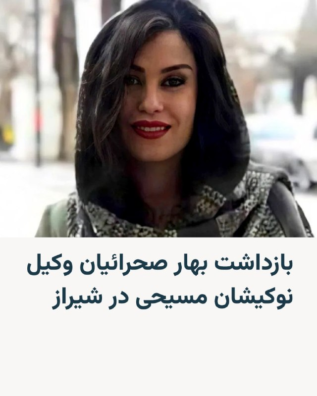

🔸گزارش‌ها از ایران حاکی است بهار صحرائیان، از جمله وکلای دادگستریِ فعال در حوزه حقوق بشر که وکالت چندین نوکیش مسیحی را نیز برعهده داشته، در شیراز بازداشت شده است.

🔸سازمان غیرانتفاعی «ماده ۱۸» که در لندن مستقر است و در حمایت از مسیحیان تحت آزار و اذیت در ایران فعالیت می‌کند، نوشته که خانم صحرائیان روز شنبه ۲۶ اردیبهشت بازداشت و روز بعد برای او در دادسرای این شهر جلسه بازپرسی برگزار شد.

🔸بر اساس این گزارش، صحرائیان بابت مواردی چون «اجتماع و تبانی به قصد اقدام علیه امنیت ملی»، «فعالیت تبلیغی علیه نظام» و «نشر اکاذیب» مورد تفهیم اتهام قرار گرفته است.

🔸پیش از این خبرگزاری حقوق بشری هرانا که در آمریکا مستقر است، نیز نوشته بود که این وکیل دادگستری پس از مراجعه به دادگاه انقلاب شیراز برای پیگیری امور وکالتی خود بازداشت شد.

🔸بهار صحرائیان، عضو کانون وکلای دادگستری استان فارس، پیش‌تر نیز به دلیل فعالیت‌های حقوق بشری خود سابقه بازداشت داشته است.

@RadioFarda

## RadioFarda — post 157374

ماجرای نزاع سیاسی امباپه و راست افراطی فرانسه چیست؟

🔸اظهارت اخیر کیلیان امباپه، فوق‌ستاره فوتبال فرانسه، دربارهٔ احتمال قدرت گرفتن حزب راست افراطی در این کشور، موجی از واکنش‌ها را برانگیخته است. این اظهارات در شرایطی مطرح شده که تنها یک سال به انتخابات ریاست‌جمهوری فرانسه باقی مانده و نامزدهای حزب راست افراطی در نظرسنجی‌ها پیشتازند.

🔸کیلیان امباپه که هرگز مخالفت خود با «اجتماع ملی»، حزب راست افراطی فرانسه، پنهان نکرده است، به تازگی در گفت‌وگویی با مجله ونتی‌فِر، اعلام کرده که نسبت به پیامدهای پیروزی احتمالی این حزب برای فرانسه نگران است.

🔸امباپه در این مصاحبه گفته است: «من می‌دانم این یعنی چه، و می‌دانم وقتی چنین افرادی قدرت را در دست بگیرند، چه پیامدهایی می‌تواند برای کشورم داشته باشد».

🔸اما هر بار که امباپه علیه حزب راست افراطی سخن گفته، رهبران این حزب، در واکنش درآمدهای زیاد ستارگان فوتبال را مطرح کرده‌اند و آنان را متهم کرده‌اند که وضعیت قشر کم‌درآمد را درک نمی‌کنند.

🔸به عنوان نمونه، ژوردن باردلا که اختلاف سنی چندانی با امباپه ندارد اما اکنون به اصلی‌ترین بخت راست افراطی فرانسه برای پیروزی در انتخابات ریاست‌جمهوری تبدیل شده، به کنایه گفته است: «باید به رأی هر فرد احترام گذاشت، مخصوصا وقتی این شانس را دارید که حقوق بسیار بسیار بالایی داشته باشید، میلیاردر یا میلیونر باشید، وقتی این امکان را دارید که با جت خصوصی رفت‌وآمد کنید».

جزئیات بیشتر در وب‌سایت رادیو فردا.

@RadioFarda

## RadioFarda — post 157373

ادعای نیویورک‌تایمز: محمود احمدی‌نژاد بخشی از طرح تغییر رژیم ایران بود

🔸روزنامه آمریکایی نیویورک‌تایمز می‌گوید در «تحقیقات خود» به این نتیجه رسیده که حملات هوایی آمریکا و اسرائیل به محل سکونت محمود احمدی‌نژاد، رئیس‌جمهور پیشین ایران، در اوایل جنگ اخیر، برای «آزادی او از حصر خانگی و بخشی از طرح تغییر رژیم» بوده است.

🔸این روزنامه در گزارشی اختصاصی که روز سه‌شنبه ۲۹ اردیبهشت منتشر شد، به‌نقل از «مقام‌های آمریکایی که در جریان این طرح قرار گرفته بودند»، نوشته است که این طرح که «احمدی‌نژاد نیز درباره آن مورد مشورت قرار گرفته بود، خیلی زود از مسیر خارج شد».

🔸به ادعای این روزنامه، بر اساس «طرح» آمریکا و اسرائیل، قرار بود احمدی‌نژاد تنها چند روز پس از آغاز جنگ علیه ایران و کشته شدن علی خامنه‌ای، رهبر پیشین جمهوری اسلامی، به قدرت برسد.

🔸نویسندگان این گزارش به اظهارات دونالد ترامپ، رئیس‌جمهور آمریکا، در روزهای ابتدایی جنگ اشاره کرده‌اند که گفته بود بهتر است «کسی از داخل» ایران ادارهٔ کشور را در دست بگیرد.

🔸نیویورک‌تایمز مدعی شده که مقامات آمریکایی به این روزنامه گفته‌اند این طرح «جسورانه» توسط اسرائیل طراحی و از سوی دولت آمریکا تأیید شده بود.

🔸این گزارش در عین حال می‌گوید مشخص نیست احمدی‌نژاد چگونه وارد این طرح شده، اما انتخاب او «غیرعادی» توصیف شده است؛ چراکه او در دوران ریاست‌جمهوری‌اش به اظهارات تند از جمله درباره «محو اسرائیل از نقشه جهان» شناخته می‌شد. او همچنین از حامیان سرسخت برنامه هسته‌ای ایران، منتقد آمریکا و حامی سرکوب اعتراضات داخلی بود.

🔸با این حال، به‌نوشتهٔ این روزنامه، این طرح به‌سرعت مختل شد به این دلیل که احمدی‌نژاد در روز نخست جنگ در اثر حمله هوایی اسرائیل به خانه‌اش در تهران زخمی شد.

🔸نیویورک تایمز همچنین گزارش داد که محل نگهداری فعلی و وضعیت احمدی‌نژاد پس از آن حمله مشخص نیست و آمریکا نیز از سرنوشت او اطلاعی ندارد.

🔸خبر حمله به محل زندگی محمود احمدی نژاد در شرق تهران در همان روزهای نخست حملات هوایی به تهران منتشر و کمی بعد تکذیب شده بود.

🔸رادیو فردا مستقلاً قادر به تأیید جزئیات این گزارش نیست. بخش قابل‌توجهی از این گزارش بر پایه نقل‌قول از «مقام‌های ناشناس» و «افراد نزدیک به احمدی‌نژاد» نوشته شده و هیچ سند رسمی یا مستقلی برای تأیید این ادعاها منتشر نشده است.

🔸کاخ سفید نیز در واکنش به این روایت، بدون اشاره مستقیم به احمدی‌نژاد، اعلام کرده هدف عملیات آمریکا صرفاً نابودی توان موشکی و هسته‌ای ایران بوده است. اسرائیل هم از اظهارنظر دربارهٔ این گزارش خودداری کرده است.

@RadioFarda

## RadioFarda — post 157372

  <a href="telegram/content/RadioFarda_157372_1779273758.mp4" target="_blank">🎬 Download video</a>

🔸ستاد فرماندهی مرکزی ایالات متحده (سنتکام) اعلام کرد از زمان اجرای محاصره دریایی جمهوری اسلامی ایران، نیروهای آمریکایی ۸۹ کشتی را وادار به تغییر مسیر کرده‌اند.

🔸سنتکام در پستی که ۲۹ اردیبهشت در شبکه ایکس منتشر شده، تأکید کرده که همچنان محاصره کامل آمریکا علیه ایران را اجرا می‌کنند و مانع جریان تجارت به بنادر ایران و از آن‌ها می‌شوند.

🔸آمریکا پس از شکست مذاکرات حضوری با ایران در پاکستان، در ۲۴ فروردین سال جاری، محاصرهٔ دریایی بنادر ایران را آغاز کرد.

@RadioFarda

## RadioFarda — post 157371

سفر پوتین به پکن؛ رئیس‌جمهور چین: ادامه درگیری‌ها در خاورمیانه «صلاح نیست»

در سفر ولادیمیر پوتین رئیس‌جمهور روسیه به پکن، رهبران دو کشور از پیشرفت روابط راهبردی میان دو طرف تمجید کردند. شی جین‌پینگ در این دیدار تأکید کرد که ادامه درگیری‌ها در خاورمیانه «صلاح نیست» و خواستار برقراری آتش‌بسی «جامع» شد.

بر اساس متن منتشرشده در خبرگزاری دولتی شینهوآ، شی جین‌پینگ،‌ رئیس‌جمهور چین، در دیدار با ولادیمیر پوتین گفت که دو کشور باید بر راهبرد بلندمدت تمرکز کرده و نظام حکمرانیِ جهانی را که به‌گفتهٔ او «عادلانه‌تر و منطقی‌تر» باشد، ترویج کنند.

شی در آغاز این دیدار در روز چهارشنبه ۳۰ اردیبهشت، گفت: «دلیل رسیدن روابط چین و روسیه به این سطح آن است که ما توانسته‌ایم اعتماد سیاسی متقابل و همکاری راهبردی را عمیق کنیم.»

او خطاب به پوتین افزود: «پایه‌های اعتماد متقابل در حال مستحکم‌تر شدن است» و «روابط چین و روسیه وارد مرحله‌ای جدید از پیشرفت بیشتر و توسعه سریع‌تر شده است.»

جزئیات بیشتر در وب‌سایت رادیوفردا.

@RadioFarda

## RadioFarda — post 157370

  <a href="telegram/content/RadioFarda_157370_1779273761.mp4" target="_blank">🎬 Download video</a>

🔸شی جین‌پینگ، رئیس‌جمهور چین، روز چهارشنبه در مراسمی رسمی در تالار بزرگ خلق در پکن، از همتای روس خود، ولادیمیر پوتین، استقبال کرد.

🔸قرار است رئیس‌جمهور روسیه در گفت‌وگو با همتای چینی‌اش مجموعه‌ای از موضوعات، از روابط متشنج دو کشور با غرب تا جنگ ایران و تأثیرش بر وضعیت جهانی انرژی را به بحث بگذارند.

🔸این دیدار درست پس از سفر رئیس‌جمهور آمریکا، به پایتخت چین انجام می‌شود.

🔸از این رو، نحوه برگزاری مراسم، و نتایج دیدار میان رهبران چین و روسیه با دقت مورد توجه و مقایسه قرار خواهد گرفت.

🔸پکن به مهمترین شریک تجاری مسکو تبدیل شده و چین حالا بزرگترین مشتری نفت و گاز روسیه به‌شمار می‌آید. با توجه به جنگ ایران، روسیه انتظار دارد میزان صادرات نفت و گازش به چین بیشتر هم بشود.

🔸بسته شدن تنگۀ هرمز انتقال حدود یک‌پنجم حامل‌های انرژی جهان را با اختلال مواجه کرده است؛ موضوعی که صنایع چین را هم تحت تأثیر قرار داده و به اهمیت توسعۀ شبکه‌های خط لولۀ سطحی به‌عنوان گزینه‌ای دیگر به موازات مسیرهای آبی و زیرآبی افزوده است.

@RadioFarda

## RadioFarda — post 157369

سفیر آمریکا در سازمان ملل: اقتصاد ایران در حال فروپاشی است

🔸مایک والتز، سفیر آمریکا در سازمان ملل، می‌گوید منابع مالی حکومت ایران «در حال تمام شدن» و اقتصاد این کشور «در وضعیت فروپاشی» است.

🔸او افزوده که با این حال جمهوری اسلامی «به‌جای روی آوردن به رویکردی تازه و صلح‌آمیز، دست به حملات مکرر و گستاخانه‌ای علیه زیرساخت‌های غیرنظامی برق زده و همچنان به راهبرد دستیابی به سلاح هسته‌ای چنگ زده که می‌تواند جهان را در تاریکی فرو ببرد.»

🔸او تأکید کرده که «ما نمی‌توانیم این را تحمل کنیم و هرگز تحمل نخواهیم کرد.»

🔸اسکات بسنت، وزیر خزانه‌داری ایالات متحده، هم روز سه‌شنبه ۲۹ اردیبهشت در یک نشست مبارزه با تأمین مالی تروریسم در پاریس، گفت که این وزارتخانه، حکومت ایران را از درآمدهایی که برای «برنامه‌های تسلیحاتی، گروه‌های نیابتی تروریستی و جاه‌طلبی‌های هسته‌ای خود استفاده می‌کرد، محروم کرده است.»

🔸او افزود که واشینگتن «ده‌ها میلیارد دلار از درآمد پیش‌بینی‌شده نفتی» جمهوری اسلامی را مختل کرده است.

@RadioFarda

## RadioFarda — post 157368

  

🔸رسانه‌ها در ایران از اجرای حکم اعدام قاتل الهه حسین‌نژاد، که جسد او اوایل خرداد سال گذشته در بیابان‌های اطراف تهران پیدا شد، خبر می‌دهند.

🔸ارگان رسمی قوه قضائیه ایران، میزان، با انتشار این خبر نوشته که این حکم با درخواست اولیای دم و پس از طی تمامی مراحل قانونی و قضایی اجرا شد.

🔸عصر چهارم خرداد ۱۴۰۴ الهه حسین‌نژاد ۲۴ ساله از سالن زیبایی که در آنجا مشغول به کار بود، بیرون آمد تا به خانه‌اش در اسلامشهر برود، اما ناپدید شد و وقتی خانواده‌اش اعلام شکایت کردند بررسی‌های تیم جنایی نشان می‌داد الهه از میدان آزادی سوار یک خودروی عبوری شده است.

🔸جست و جوها برای یافتن الهه سرانجام پس از ۱۱ روز نتیجه داد و با دستگیری راننده خودرو به نام بهمن ۳۷ ساله و اعتراف به قتل الهه، جسد او در بیابان‌های اطراف تهران پیدا شد. متهم نیز پس از محاکمه به اعدام محکوم شد.

🔸این قتل جنجال زیادی درباره امنیت زنان در ایران به پا کرد و تا مدت‌ها رسانه‌ها درباره آن مطالب مختلفی منتشر می‌کردند.

@RadioFarda

## RadioFarda — post 157367

  <a href="https://t.me/radiofarda/157367" target="_blank">📎 Download file</a>

📻بشنوید: خبرهای ۸ صبح با رادیوفردا، ۳۰ اردیبهشت ۱۴۰۵‌

@RadioFarda

## IranianMinds — post 20430

🔴 رادار کلودفلر نشون میده امروز سطح دسترسی و‌ ترافیک اینترنت ایرانیا بیشتر شده! @IranianMinds

## IranianMinds — post 20429

  

🔴 رادار کلودفلر نشون میده امروز سطح دسترسی و‌ ترافیک اینترنت ایرانیا بیشتر شده!

@IranianMinds

## IranianMinds — post 20428

  <a href="telegram/content/IranianMinds_20428_1779273765.webm" target="_blank">🎬 Download video</a>

💥 با هر ثبت نام 
🅰️
🅰️
🅰️  هزار تومن جایزه بگیرید

✔️ میتونید شرط‌بندی کنید و بونوس را به موجودی واقعی تبدیل کنید

⚽️  پوشش کامل مسابقات ورزشی 

💯  پیش‌بینی با بهترین ضرایب 

⭐️ تجربه سریع و حرفه‌ای

💰پرداخت مستقیم و سریع بدون واسطه، بدون دردسر، واریز و برداشت در سریع‌ترین زمان ممکن

☑️ کانال تلگرام: 

➡️ @winro_io  

🎁 هدیه خود را با ثبت نام در سایت دریافت کنید: 

➡️ Winro.io
R30
سایت اصلی در روزهای آینده بازگشایی خواهد شد A
💎

## IranianMinds — post 20427

  <a href="telegram/content/IranianMinds_20427_1779273765.mp4" target="_blank">🎬 Download video</a>

🔴 یه شعار جدید هم به تجمعاتشون اضافه شد :

مرگ بر امارات !

@IranianMinds

## IranianMinds — post 20426

  <a href="telegram/content/IranianMinds_20426_1779273767.mp4" target="_blank">🎬 Download video</a>

🔴 احمد ایراندوست:

والا من مشروب می‌خورم، کلاب می‌رم، اون‌ور که هستم با شهناز تهرانی می‌رقصم، این ‌ور که میام دست ‌بوس حاج قاسم‌ا م، نمی‌خوره بهم؟

@IranianMinds

## IranianMinds — post 20422

🔴 سپاه :

اگه دوباره به ما حمله بشه ایندفه جنگ دیگه منطقه ای نیست و فرا منطقه ای میشه.

@IranianMinds

## IranianMinds — post 20421

  <a href="telegram/content/IranianMinds_20421_1779273769.mp4" target="_blank">🎬 Download video</a>

اینجا نه عراقه و نه لبنان متاسفانه ایرانه خودمونه …

@IranianMinds

## IranianMinds — post 20420

🔴 وزارت خارجه آمریکا :

رژیم ایران کاملا بی پول و ورشکست شده و تمام راه هایی که میتونست ازش کسب درآمد کنه رو بستیم و بقیه راه هارو هم داریم میبندیم

همچنین هرکسی اطلاعاتی از منابع مالی رژیم ایران بده بهمون ۱۵ میلیون دلار پاداش دریافت میکنه!

@IranianMinds

## IranianMinds — post 20419

  

🔴 طبق گفته‌ی خواهر الهه حسین‌نژاد؛ بهمن فرزانه (قاتل) امشب اعدام میشه. @IranianMinds

## IranianMinds — post 20418

  

🔴 رسانه های حکومتی :

هرکی‌ با خامنه ای خاطره داره بیاد برامون تعریف کنه میخوایم سریال بسازیم ازش.

@IranianMinds

## IranianMinds — post 20417

🔴 برد کوپر، فرمانده سنتکام درباره مدرسه میناب:

ایالات متحده عمدا به غیرنظامیان حمله نمی‌کند. مردم ایران دشمن ما نیستند. سپاه پاسداران انقلاب اسلامی در این مورد دشمن است.
تحقیقات در حال انجام است. این یک تحقیق پیچیده است. چون این مدرسه داخل یک سایت فعال موشک‌های کروز جمهوری اسلامی قرار داشته
هر دو طرف باید اسناد مربوط به این مدرسه رو منتشر کنن و پرونده کشته‌شدن این تعداد دانش‌آموز نیاز به شفافیت کامل داره
انتظار شفاف‌سازی از طرف جمهوری اسلامی را نداریم
به محض اتمام تحقیقات، من کاملاً متعهد به شفافیت هستم.
به عنوان فرماندهان نظامی، ما از قوانین درگیری مسلحانه و مسئولیت‌های قانون اساسی خود پیروی می‌کنیم و همین کاری است که انجام داده‌ایم.

@IranianMinds

## IranianMinds — post 20416

  <a href="telegram/content/IranianMinds_20416_1779273772.webm" target="_blank">🎬 Download video</a>

💥 با هر ثبت نام 
🅰️
🅰️
🅰️  هزار تومن جایزه بگیرید

✔️ میتونید شرط‌بندی کنید و بونوس را به موجودی واقعی تبدیل کنید

⚽️  پوشش کامل مسابقات ورزشی 

💯  پیش‌بینی با بهترین ضرایب 

⭐️ تجربه سریع و حرفه‌ای

💰پرداخت مستقیم و سریع بدون واسطه، بدون دردسر، واریز و برداشت در سریع‌ترین زمان ممکن

☑️ کانال تلگرام: 

➡️ @winro_io  

🎁 هدیه خود را با ثبت نام در سایت دریافت کنید: 

➡️ Winro.io
A29
سایت اصلی در روزهای آینده بازگشایی خواهد شد A
💎

## IranianMinds — post 20415

  <a href="telegram/content/IranianMinds_20415_1779273772.mp4" target="_blank">🎬 Download video</a>

ما هم جام جهانی رو برای مزدوران جمهوری اسلامی تبدیل به جام جهنمی می‌کنیم.

@IranianMinds

## BBCPersian — post 281595

  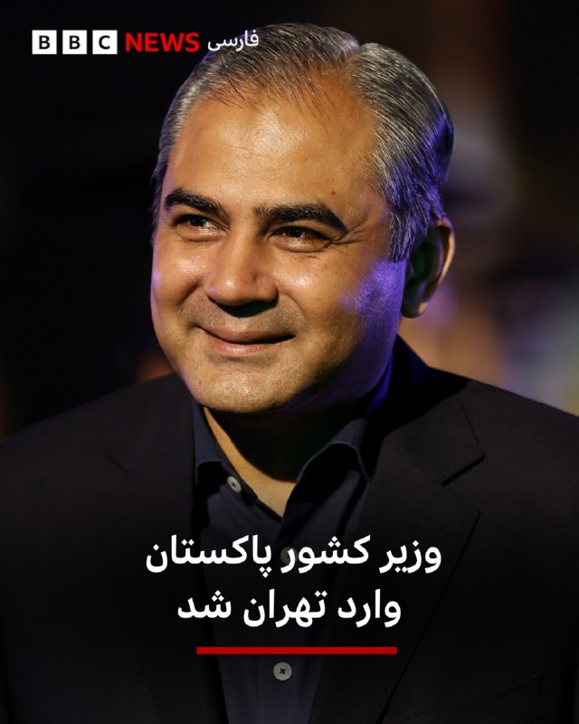

🔻محسن نقوی، وزیر کشور پاکستان برای دومین بار در کمتر از یک هفته بار دیگر وارد تهران شده است.

پاکستان میانجی مذاکرات اخیر میان ایران و آمریکا در اسلام‌آباد بود که بدون نتیجه به پایان رسید.

دوشنبه گذشته وزیر کشور پاکستان در تهران ابراز امیدواری کرد که تلاش کشورش در برقراری صلح و ثبات در منطقه موثر واقع شود.

عباس عراقچی، وزیر خارجه ایرن هم در آن دیدار به آقای نقوی گفت: «رفتارها و مواضع متناقض و زیاده‌خواهانه آمریکا مانعی جدی در مسیر دیپلماسی» است.

📷ICC via Getty Images
https://bbc.in/4uYdZbq

@BBCPersian

## BBCPersian — post 281594

🔻شکست نماینده منتقد ترامپ در انتخابات داخلی جمهوری‌خواهان

🔻با شکست توماس مسی، نماینده کنگره، در انتخابات مقدماتی کنتاکی، دونالد ترامپ پیروزی دیگری در مبارزات انتخاباتی داخلی حزب جمهوری‌خواه برای مجازات مخالفان خود در این حزب به دست آورد.

آقای مسی که رهبری مبارزات انتخاباتی برای مجبور کردن دولت ترامپ به انتشار پرونده‌های اپستین را بر عهده داشت در مقابل اد گالین، رقیب نامزد دموکرات‌ها در انتخابات میان‌دوره‌ای، شکست خورد که قرار است ماه نوامبر برگزار شود.

آقای مسی در سخنرانی خود پس از پذیرش شکست، گفت که هوادارانش قلدرها را دوست ندارند و تحمل نمی‌کنند.

حامیان ترامپ و گروه‌های طرفدار اسرائیل ده‌ها میلیون دلار صرف تبلیغات علیه توماس مسی کردند که منتقد سرسخت جنگ ایران و کمک به اسرائیل است.

پیش‌بینی می‌شود که در انتخابات مقدماتی سنا در کنتاکی، نماینده کنگره، اندی بار، یکی دیگر از نامزدهای مورد حمایت ترامپ، نامزدی حزب را برای کرسی خالی شده توسط میچ مک‌کانل، رهبر سابق و باسابقه سنا، به دست آورد.

درباره توماس مسی و سیاست‌هایش بیشتر بخوانید:

https://bbc.in/4wGLpwO
@BBCPersian

## BBCPersian — post 281593

  <a href="telegram/content/BBCPersian_281593_1779273775.mp4" target="_blank">🎬 Download video</a>

🔻در پی بارندگی شدید و طغیان رود جیان در چین، آب خودروها را با خود برد. یک شاهد عینی در شهر دویونِ استان گوئیژو لحظه‌ای را ثبت کرده که سیلاب خودرویی را با خود برده است. دست‌کم ۱۰ نفر  بر اثر سیلاب‌های مناطق جنوبی و مرکزی چین جان خود را از دست داده‌اند.

https://bbc.in/4v3RyBY
@BBCPersian

## BBCPersian — post 281592

🔻جنگ آمریکا و اسرائیل با ایران به افزایش فروش خودروهای برقی انجامید

🔻آژانس بین‌المللی انرژی می‌گوید که پیش‌بینی می‌شود فروش خودروهای برقی امسال به رکوردهای جدیدی برسد و حدود ۲۸ درصد از کل خریدها را تشکیل دهد.

به گفته این آژانس، یکی از دلایل افزایش فروش خودروهای برقی، افزایش قیمت سوخت پس از جنگ آمریکا و اسرائیل علیه ایران است.

حدود ۳۰ کشور در ماه مارس شاهد رکورد فروش خودروهای برقی بودند از جمله فروش در آمریکای لاتین ۷۵ درصد نسبت به سال گذشته افزایش یافته است.

بر اساس این گزارش، کاهش قیمت‌ این خودروها عامل دیگری برای افزایش خرید آن بوده است. اما این روند در آمریکا متفاوت بوده و فروش خودروهای برقی کاهش شدیدی در پایان سال گذشته داشته است.

https://bbc.in/4eTzy8t
@BBCPersian

## BBCPersian — post 281591

  

‌🔻سپاه پاسداران با انتشار بیانیه‌ای تهدید کرده که در صورت آغاز دوباره جنگ آمریکا و اسرائیل علیه ایران، جنگ «به فراتر از منطقه کشیده خواهد شد.»

در این بیانیه با اشاره به تهدیدهای دونالد ترامپ و مقام‌های اسرائیل برای حمله مجدد به ایران آمده: «اگر تجاوز به ایران تکرار شود جنگ منطقه‌ای که وعده داده شده بود، این بار به فراتر از منطقه کشیده خواهد شد و ضربات کوبنده ما در جاهایی که تصور آن را ندارید شما را به خاک سیاه خواهد نشاند.»

عباس عراقچی، وزیر خارجه ایران هم در واکنش به اظهارات تهدیدآمیز دونالد ترامپ، رئیس‌جمهور آمریکا، درباره احتمال از سرگیری حمله نظامی به ایران، در شبکه ایکس نوشته «با درس‌هایی که آموخته‌ایم و دانشی که به دست آورده‌ایم، مطمئن باشید بازگشت به میدان جنگ با شگفتی‌های بسیار بیشتری همراه خواهد بود.»

دونالد ترامپ، رئیس جمهور آمریکا، روز گذشته گفت که در آستانه حمله نظامی دوباره به ایران، او به درخواست رهبران منطقه، دستور لغو حمله را داده است.

📷NurPhoto via Getty Images
https://bbc.in/4uZ5Tzw

@BBCPersian

## BBCPersian — post 281590

🔻کاخ سفید شرکت ترامپ در اجلاس ماه آینده گروه هفت را تایید کرد

🔻کاخ سفید تایید کرده است که رئیس جمهور ترامپ علی‌رغم افزایش تنش با متحدانش، در اجلاس ماه آینده سران گروه هفت در فرانسه شرکت خواهد کرد.

پیش از این، تردیدهایی در مورد شرکت او در این رویداد در تفرجگاه اویان له بن در سواحل دریاچه ژنو وجود داشت.

گفته می‌شود آقای ترامپ مشتاق است که این نشست را بیش از آنچه که معمولاً گردهمایی‌های دیپلماتیک هستند، متمرکز بر تجارت کند.

میزبان او، رئیس جمهور امانوئل مکرون، پیش از این برنامه میزبانی شام پس از اجلاس در کاخ ورسای را به عنوان یک مشوق اضافی برای حضور آقای ترامپ پیشنهاد داد.

تاریخ‌های پیشنهادی این اجلاس قبلاً تغییر کرده بود تا با برنامه آقای ترامپ برای میزبانی یک مسابقه رزمی یو‌اف‌سی در کاخ سفید در هشتادمین سالگرد تولدش تداخل نداشته باشد.

https://bbc.in/3PsPDrq
@BBCPersian

## BBCPersian — post 281580

‌🖊آندره بیرناث
بی‌بی‌سی برزیل

🔻پایانی سرد، تاریک و تا حدی ملال‌آور. سرانجامی خشن و ویرانگر. یا شاید پایانی که آغازی دیگر در دل خود دارد؟

این موارد از برجسته‌ترین نظریه‌ها درباره این هستند که پایان جهان در آینده‌ای بسیار، بسیار دور ممکن است چه شکلی داشته باشد؛ البته اگر اصلا پایانی در کار باشد.

سرنوشت جهان یکی از اسرار‌آمیز‌ترین پرسش‌های علم است. حتی دانشمندان هم باور دارند که پرسش‌ها بیش از پاسخ‌هاست.

برای آنکه برخی از راه‌هایی که جهان ممکن است به پایان برسد را دریابیم ابتدا باید بفهمیم جهان چگونه آغاز شده است.

متن کامل خبر را از لینک زیر بخوانید:
https://bbc.in/4dSPuqm

📷Getty/ Fotograzia via Getty Images/ FlashMovie via GettyImages/ Arctic Images via Getty Images/ Fotograzia via Getty Images

@BBCPersian

## BBCPersian — post 281579

🔻نفتکش کره‌ جنوبی «با همکاری مقام‌های ایرانی» در حال عبور از تنگه هرمز است

🔻چو هیون، وزیر امور خارجه کره جنوبی، روز چهارشنبه گفت که یک نفتکش کره‌ای حامل نفت خام با همکاری مقام‌های ایرانی در حال عبور از تنگه هرمز است.

او در اظهارات خود در جلسه استماع پارلمان در سئول، جزئیات بیشتری در مورد این کشتی ارائه نکرد.

داده‌های کشتیرانی شرکت ال‌اس‌ای‌جی روز چهارشنبه نشان می‌دهد که ابرنفتکش یونیورسال وینر با پرچم کره جنوبی و حامل ۲ میلیون بشکه نفت خام کویت، در حال خروج از تنگه هرمز است.

عبور این نفتکش کره‌ای با همکاری مقام‌های ایران پس از آن صورت می‌گیرد که حدود دو هفته پیش (۱۴ اردیبهشت / ۴ مه) کشتی باری کره‌ای «اچ‌ام‌ام نامو» در نزدیکی تنگه هرمز هدف «دو پهپاد ناشناس» قرار گرفت.
https://bbc.in/3RwznWP
@BBCPersian

## BBCPersian — post 281571

‌🖊لوئیز آنتونیو آراخو
بی‌بی‌سی برزیل

🔻هم‌زمان با جنگ ایران، وب‌سایت «دیبریف» مصاحبه‌ای خیالی با کارل فون کلاوزویتس منتشر کرد؛ ژنرال و نظریه‌پرداز پروسی قرن نوزدهم که اندیشه‌هایش دوباره در تحلیل جنگ‌های مدرن مورد توجه قرار گرفته است.

بئاتریس هویزر، رئیس آکادمی ستاد کل نیروهای مسلح آلمان، می‌گوید کلاوزویتس نخستین متفکری بود که جنگ را نه از منظر اخلاق و الهیات، بلکه به عنوان پدیده‌ای سیاسی و اجتماعی برای فهم ماهیت آن بررسی کرد.

اندیشه‌های کلاوزویتس بر چهره‌هایی چون دوک ولینگتون و ولادیمیر لنین تاثیر گذاشت و ایده‌های او همچنان یکی از مهم‌ترین چارچوب‌های نظری برای تحلیل جنگ محسوب می‌شود.

ساندرو تیشیرا موئیتا، استاد علوم نظامی، می‌گوید ابهام درباره اهداف آمریکا در جنگ ایران نشان می‌دهد تحلیلگران همچنان از مفاهیم کلاوزویتس برای فهم استراتژی، قدرت و اهداف سیاسی در جنگ استفاده می‌کنند.

هیو استراون، استاد روابط بین‌الملل، می‌گوید مفهوم مشهور کلاوزویتس درباره «ادامه سیاست با ابزارهایی دیگر» همچنان برای فهم جنگ ایران کاربرد دارد؛

لینک خبر کامل:

https://bbc.in/49M0mUD
📷Getty Images/BBCImages

@BBCPersian

## Dirty_Kids — post 389796

  

‏من همون خرسیم که رئیسی رو خورد ولی الان بحث بحثِ وطنه

@Dirty_Kids 👻

## Dirty_Kids — post 389795

  <a href="telegram/content/Dirty_Kids_389795_1779273778.mp4" target="_blank">🎬 Download video</a>

هوش مصنوعیه؟؟؟😂
یه نفر تو روسیه شبیه خامنه‌ای پیدا شده

@Dirty_Kids 👻

## Dirty_Kids — post 389794

  

🌪وقتی اینترنت طوفانیه... کافیه بادبان ها رو بکشی تا

⚫️با بالاترین کیفیت ممکن
⚡️ 

⚫️100 هزار تومان شارژ هدیه 
🎁

⚫️پایین ترین قیمت گیگی 250
🌐 

⚫️و ارائه پورسانت %10 در ازای هر معرفی
💼

بتونی یه اتصال پایدار با پشتیبانی 24 ساعته داشته باشی
🚀

بادبان راهتو باز می‌کنه
⛵️

R30

🛡@BadBan_VPN | کانال 

🤖@BadBan_VPNBot | ربات 

📞@BadBan_VPNSupport | پشتیبانی

## Dirty_Kids — post 389793

  

لیلیوم خارج از مطب بو گوز میده؟

@Dirty_Kids 👻

## Dirty_Kids — post 389792

  <a href="telegram/content/Dirty_Kids_389792_1779273780.mp4" target="_blank">🎬 Download video</a>

در قطر، کشور دوست و مثلا برادر سیاسی‌مذهبی‌تون، جلو تعداد محدود ایرانی هم هیچ غلطی نتونستید بکنید؛ آمریکای شمالی که دیگه جای صدها هزار ایرانیِ ملی‌گراست. ✌️👑

@Dirty_Kids 👻

## Dirty_Kids — post 389791

  

‏به این میگن عقب‌نشینی استراتژیک.

@Dirty_Kids 👻

## Dirty_Kids — post 389790

خیلی دلم میخواد تو مترو با یه دختر دوست بشم، دیت اول با ماشینم برم دنبالش پشماش بریزه اون لحظه که تیبا ۲ رو میبینه و بفهمه هرکی سوار مترو میشه فقیر نیست.

@Dirty_Kids 👻

## Dirty_Kids — post 389789

  

فرزند ایران و کشته شده در راه وطن #امیرحسین_الوند

@Dirty_Kids 👻

## Dirty_Kids — post 389788

  

عارف‌ عزیز، آرسنال، تیم محبوبت قهرمان شد.

@Dirty_Kids 👻

## Dirty_Kids — post 389787

  

حاصل جفتگیری قالیباف و میرسلیم:

@Dirty_Kids 👻

## Hranews — post 113056

  

امروز چهارشنبه ۳۰ اردیبهشت ماه، جمعی از کارگران قراردادی شرکت پایانه‌ها و مخازن پتروشیمی ماهشهر در اعتراض به کسر مزایای مزدی خود، تحت عناوینی همچون «بهره‌وری»، «رفاهیات» و «مزایای مناسبت‌ها»، دست به #تجمع زدند.

↘️
@hranews_bot تماس ✉️ - @Hranews کانال هرانا 🆑

## Hranews — post 113055

خودکشی یک جنگ‌زده در هتل لاله؛ وزارت بهداشت: شهرداری مانع استقرار تیم‌های روان‌ درمانی شد

❗️
❗️
❗️
❗️
❗️– یک مرد جوان جنگ‌زده اسکان‌یافته در هتل لاله تهران در جریان درگیری های نظامی #خودکشی کرده است. در این میان، مقام‌های شهرداری تهران و وزارت بهداشت روایت‌های متفاوتی درباره نحوه رسیدگی به وضعیت روانی آسیب‌دیدگان ارائه داده‌اند. مقام‌های وزارت بهداشت می‌گویند شهرداری از استقرار تیم‌های تخصصی روان‌درمانی در مراکز اسکان جلوگیری کرده، اما شهرداری این ادعا را رد کرده و اعلام کرده است که پیش از آن، خدمات مشاوره‌ای را در این مراکز ارائه داده بود.

ادامه مطلب

↘️
@hranews_bot تماس ✉️ - @Hranews کانال هرانا 🆑

## Hranews — post 113054

گزارشی از بازداشت امیر سبحانی در جوانرود

❗️
❗️
❗️
❗️
❗️– روز دوشنبه ۲۸ اردیبهشت ماه، امیر سبحانی، شهروند اهل جوانرود، توسط نیروهای امنیتی در این شهرستان بازداشت شد. وی سپس با صدور قرار بازداشت به زندان دیزل آباد کرمانشاه منتقل شد.

#امیر_سبحانی

ادامه مطلب

↘️
@hranews_bot تماس ✉️ - @Hranews کانال هرانا 🆑

## Hranews — post 113053

  

بر اساس آخرین داده‌های نت‌ بلاکس، قطع گسترده اینترنت در ایران وارد هشتاد و دومین روز خود شده و این کشور پس از بیش از ۱۹۴۴ ساعت، همچنان تا حد زیادی از دسترسی به اینترنت جهانی محروم است. این نهاد ناظر بر وضعیت دسترسی به #اینترنت در جهان اعلام کرد که در شرایطی که حتی اختلالات چند دقیقه‌ای در بسیاری از کشورها بحران تلقی می‌شود، تداوم این وضعیت در ایران رکوردهای بی‌سابقه‌ای را ثبت کرده است.

↘️
@hranews_bot تماس ✉️ - @Hranews کانال هرانا 🆑

## Hranews — post 113052

یک شهروند در شهرستان ری بازداشت شد؛ طرح ادعای ارتباط با اسرائیل

❗️
❗️
❗️
❗️
❗️– دادستان شهرستان ری از بازداشت یک شهروند در جنوب این شهرستان خبر داد. این مقام قضایی، مدعی همکاری اطلاعاتی فرد بازداشتی با سرویس جاسوسی اسرائیل شده است.

ادامه مطلب

↘️
@hranews_bot تماس ✉️ - @Hranews کانال هرانا 🆑

## Hranews — post 113051

پژمان جمشیدی به ۹۹ ضربه شلاق محکوم شد

❗️
❗️
❗️
❗️
❗️– وکیل مدافع پژمان جمشیدی، بازیگر سینما و تلویزیون، از صدور حکم ۹۹ ضربه #شلاق تعزیری توسط دادگاه کیفری تهران برای موکل خود خبر داد. به گفته وکیل، این رای از بابت اتهامی موسوم به «مادون زنا» صادر شده و اتهامات اصلی مطرح‌شده در این پرونده در دادگاه رد شده است.

#پژمان_جمشیدی

ادامه مطلب

↘️
@hranews_bot تماس ✉️ - @Hranews کانال هرانا 🆑

## Hranews — post 113050

  

متهم به قتل الهه حسین‌نژاد اعدام شد

❗️
❗️
❗️
❗️
❗️– مرکز رسانه قوه قضاییه از اجرای حکم #اعدام متهم به قتل الهه حسین‌نژاد، خبر داد.

#الهه_حسین‌نژاد

ادامه مطلب

↘️
@hranews_bot تماس ✉️ - @Hranews کانال هرانا 🆑

## manototv — post 105675

  <a href="telegram/content/manototv_105675_1779273786.mp4" target="_blank">🎬 Download video</a>

خبرگزاری حکومتی تسنیم گزارش داد که محسن نقوی، وزیر کشور پاکستان، برای دیدار و گفت‌وگو با مقام‌های جمهوری‌اسلامی راهی تهران شده است. این دومین سفر نقوی به تهران در طول یک هفته گذشته و در راستای تلاش‌های اسلام‌آباد برای میانجی‌گری میان جمهوری‌اسلامی و آمریکا است.

## manototv — post 105674

  <a href="telegram/content/manototv_105674_1779273787.mp4" target="_blank">🎬 Download video</a>

خبرگزاری رسمی اردن گزارش داد که نیروهای مسلح این کشور صبح امروز یک پهپاد ناشناس را که وارد حریم هوایی اردن شده بود، سرنگون کردند.
ارتش اردن این پهپاد را در استان جرش، در منطقه بلیلا در شمال کشور، هدف قرار داد. این حادثه تلفات جانی نداشت، اما خسارت‌های جزئی مادی بر جای گذاشت.

## manototv — post 105673

  <a href="telegram/content/manototv_105673_1779273787.mp4" target="_blank">🎬 Download video</a>

دیروز، هم‌زمان با زادروز جاویدنام پیام رخ‌بخش، خانواده و نزدیکان او بر سر مزارش در شیراز حاضر شدند و یادش را گرامی داشتند.

پیام رخ‌بخش، جوان ۳۲ ساله اهل شیراز، در ۱۹ دی‌ماه ۱۴۰۴ در جریان اعتراضات مردمی با شلیک مستقیم نیروهای حکومتی جان باخت.

حضور بر سر مزار جان‌باختگان، برای خانواده‌ها فقط سوگواری نیست؛ ادامه همان دادخواهی‌ای است که جمهوری اسلامی از آن هراس دارد.

#خانه_دوست_کجاست

## manototv — post 105672

  <a href="telegram/content/manototv_105672_1779273789.mp4" target="_blank">🎬 Download video</a>

بر اساس یک نظرسنجی جدید، اکثریت بزرگی از جمهوری‌خواهان همچنان عملکرد دونالد ترامپ در مدیریت جنگ ایران را تأیید می‌کنند.
طبق نظرسنجی انجام‌شده توسط خبرگزاری آسوشیتدپرس و مرکز پژوهش‌های امور عمومی نورک، در حالی که تنها یک‌سوم بزرگسالان آمریکایی از رویکرد رئیس‌جمهور حمایت می‌کنند، حدود دو‌سوم جمهوری‌خواهان با نحوه عملکرد او موافق هستند.
با این حال، بر اساس نظرسنجی ماه گذشته، جمهوری‌خواهان جوان‌تر بیشتر احتمال دارد که از عملکرد ترامپ در این موضوع ناراضی باشند.
علاوه بر این، تنها ۶ نفر از هر ۱۰ جمهوری‌خواه (در مقایسه با ۸ نفر از هر ۱۰ نفر در ماه فوریه) از نحوه مدیریت اقتصاد توسط رئیس‌جمهور حمایت می‌کنند؛ اقتصادی که تحت تأثیر جنگ قرار گرفته است.

## manototv — post 105671

  

گروه ناظر اینترنتی نت‌بلاکس اعلام کرد قطعی اینترنت در ایران امروز وارد هشتادودومین روز خود شده و از مرز ۱۹۴۴ ساعت گذشته است.
نت‌بلاکس هشدار داده در دورانی که قطع چنددقیقه‌ای اینترنت می‌تواند بحران‌زا باشد، ادامه این محدودیت‌ها در ایران همچنان به نابودی معیشت شهروندان و فرسایش حقوق اساسی آنان منجر می‌شود؛ شهروندانی که تا حد زیادی از ارتباط عادی با جهان خارج محروم مانده‌اند.

## manototv — post 105670

  

روزنامه نیویورک‌تایمز به نقل از مقام‌های آمریکایی گزارش داد حمله اسرائیل به خانه محمود احمدی‌نژاد، رئیس‌جمهوری پیشین ایران، با هدف آزاد کردن او از حصر خانگی و در چارچوب طرح آمریکا و اسرائیل برای تغییر حکومت در ایران انجام شده بود.
بر اساس این گزارش، اسرائیل طراح اصلی این برنامه بوده و حتی با خود احمدی‌نژاد نیز درباره آن مشورت شده بود، اما این طرح به‌سرعت شکست خورد.
نیویورک‌تایمز همچنین به نقل از مقام‌های آمریکایی و یکی از نزدیکان احمدی‌نژاد نوشت او در نخستین روز جنگ و در جریان حمله به خانه‌اش در تهران زخمی شد، اما از این حمله جان سالم به در برد.
به نوشته این روزنامه، احمدی‌نژاد پس از این حمله و تجربه‌ای که تا آستانه مرگ پیش رفت، از پروژه تغییر حکومت فاصله گرفت. این گزارش افزوده است او از آن زمان تاکنون در انظار عمومی دیده نشده و محل حضور و وضعیت کنونی‌اش مشخص نیست.
دونالد ترامپ، رئیس‌جمهوری آمریکا، نیز چند روز پس از کشته شدن علی خامنه‌ای و شماری از مقام‌های جمهوری اسلامی در نخستین موج حملات آمریکا و اسرائیل گفته بود بهتر است «فردی از داخل ایران» اداره کشوردر دست بگیرد.

## manototv — post 105669

  

به گزارش خبرگزاری‌های داخلی، حکم اعدام بهمن فرزانه، قاتل الهه حسین‌نژاد، بامداد چهارشنبه اجرا شده است.
الهه حسین‌نژاد، زن ۲۴ ساله، خرداد سال گذشته هنگام بازگشت به خانه در تهران ناپدید شد و حدود ۱۰ روز بعد پیکر او با چندین ضربه چاقو در بیابان‌های اطراف تهران پیدا شد.
خبرگزاری میزان، وابسته به قوه قضاییه جمهوری اسلامی، اعلام کرده این حکم پس از طی مراحل قانونی و با درخواست اولیای دم اجرا شده است.

## manototv — post 105668

  

زمین‌لرزه‌ای به بزرگی ۴.۷ بامداد چهارشنبه ۳۰ اردیبهشت حوالی لافت در استان هرمزگان را لرزاند. مرکز لرزه‌نگاری کشوری عمق این زلزله را ۲۰ کیلومتر اعلام کرده است. این زمین‌لرزه در بخش‌هایی از قشم، هرمز و مناطق روستایی بندرعباس نیز احساس شد. مقام‌های محلی می‌گویند تاکنون گزارشی از خسارت دریافت نشده، اما بررسی‌ها در مناطق نزدیک به کانون زلزله ادامه دارد.

## manototv — post 105667

  <a href="telegram/content/manototv_105667_1779273792.mp4" target="_blank">🎬 Download video</a>

دونالد ترامپ، رئیس‌جمهور آمریکا، بار دیگر مدعی شد که ایالات متحده جنگ با جمهوری اسلامی را «خیلی سریع» پایان خواهد داد و تهران «به‌شدت» خواهان توافق است.
ترامپ در جریان مراسم سالانه پیک‌نیک کنگره در محوطه جنوبی کاخ سفید گفت توافق با تهران «اتفاق خواهد افتاد و سریع هم اتفاق می‌افتد».
او همچنین مدعی شد با پایان این بحران، قیمت نفت «به‌شدت کاهش خواهد یافت».
این اظهارات پس از آن مطرح می‌شود که ترامپ اوایل هفته گفته بود تهران برای رسیدن به توافق «التماس» می‌کند و او تنها یک ساعت با صدور دستور حملات تازه علیه جمهوری اسلامی فاصله داشته است.
ترامپ گفت به درخواست متحدان خلیج فارس آمریکا، حملات را متوقف کرده تا به گفته او، «مذاکرات جدی» ادامه پیدا کند. با این حال، او هشدار داد اگر جمهوری اسلامی به توافق نرسد، آمریکا برای یک «حمله کامل» آماده است.

## manototv — post 105666

  

شی جین‌پینگ، رئیس‌جمهوری چین، در دیدار با ولادیمیر پوتین در پکن خواستار توقف فوری درگیری‌ها در خاورمیانه شد و گفت پایان جنگ می‌تواند به کاهش اختلال در عرضه انرژی و زنجیره‌های تجارت جهانی کمک کند.

شی جین‌پینگ روز چهارشنبه، ۲۰ مه ۲۰۲۶، در دیدار با ولادیمیر پوتین در تالار بزرگ خلق پکن گفت وضعیت خاورمیانه در مرحله‌ای حساس میان جنگ و صلح قرار دارد و توقف درگیری‌ها «فوری‌ترین ضرورت» است. او تأکید کرد بازگشت به جنگ قابل قبول نیست و مسیر مذاکره باید در اولویت قرار گیرد. به گفته رئیس‌جمهور چین، پایان زودهنگام درگیری‌ها می‌تواند از اختلال بیشتر در عرضه انرژی و عملکرد زنجیره‌های صنعتی و تجاری جلوگیری کند.

پوتین نیز در آغاز این دیدار گفت روابط روسیه و چین به سطحی «بی‌سابقه» رسیده و از شی جین‌پینگ دعوت کرد سال آینده به روسیه سفر کند. رئیس‌جمهوری روسیه همچنین همکاری دو کشور را عاملی برای «بازدارندگی و ثبات» در روابط بین‌الملل توصیف کرد.

بر اساس گزارش‌ها، دو طرف در این دیدار درباره انرژی، امنیت و روابط کلی مسکو و پکن گفت‌وگو کردند و با تمدید پیمان دوستی چین و روسیه موافقت کردند؛ پیمانی که نخستین‌ب

## manototv — post 105665

  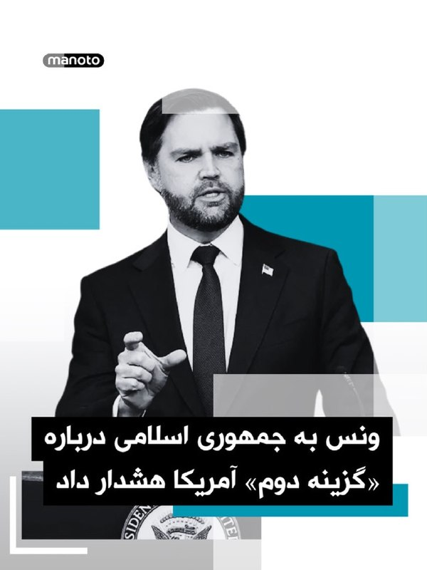

جی‌دی ونس، معاون رئیس‌جمهور آمریکا، گفت واشینگتن در برابر جنگ با ایران دو مسیر پیش رو دارد: ادامه مذاکره یا ازسرگیری عملیات نظامی.

جی‌دی ونس در نشست خبری کاخ سفید گفت آمریکا در برابر ایران «دو مسیر» دارد.

به گفته ونس، مسیر اول مذاکره است. او گفت دونالد ترامپ از تیم خود خواسته با جمهوری اسلامی «تهاجمی» مذاکره کنند.

ونس گفت آمریکا در موضوع اصلی، یعنی جلوگیری از دستیابی ایران به سلاح هسته‌ای، پیشرفت زیادی داشته و واشینگتن فکر می‌کند تهران خواهان توافق است.

او مسیر دوم را ازسرگیری عملیات نظامی دانست و گفت: «گزینه دوم این است که کارزار نظامی را دوباره شروع کنیم تا اهداف آمریکا دنبال شود.»

ونس گفت این مسیر چیزی نیست که ترامپ بخواهد و فکر نمی‌کند جمهوری اسلامی هم خواهان آن باشد.

او در پایان گفت: «برای توافق، دو طرف لازم است.»

## manototv — post 105664

  <a href="telegram/content/manototv_105664_1779273794.mp4" target="_blank">🎬 Download video</a>

«سکوت ما همدستی با جمهوری اسلامی است»

## manototv — post 105663

  <a href="telegram/content/manototv_105663_1779273795.mp4" target="_blank">🎬 Download video</a>

‌
خبرگزاری فرانسه گزارش داد شرکت هواپیماسازی ایرباس به دلیل پیامدهای جنگ آمریکا و اسرائیل با جمهوری اسلامی، از تیم‌های خود خواسته هزینه‌های «غیرضروری» را ۱۰ درصد کاهش دهند.

بر اساس سندی که خبرگزاری فرانسه مشاهده کرده، ایرباس اعلام کرده هدف این شرکت «توقف قابل توجه فعالیت‌ها و هزینه‌هایی است که برای عملیات و فعالیت‌های صنعتی کاملاً ضروری نیستند.»

در این یادداشت از کارکنان خواسته شده از ایجاد هزینه‌های جدید یا واگذاری فعالیت‌های غیرضروری به پیمانکاران خودداری کنند.

ایرباس همچنین بر کاهش هزینه‌هایی مانند رویدادهای داخلی، برنامه‌های تیمی، همایش‌ها و مشارکت در کنفرانس‌ها تاکید کرده است.

## alonews — post 121268

  <a href="telegram/content/alonews_121268_1779273796.webm" target="_blank">🎬 Download video</a>

👈رسانه عبری وای نت: امارات هماهنگی‌های امنیتی و عملیاتی با اسرائیل را تشدید کرده

🔴 این اقدام به منظور آمادگی برای سناریوی احتمالی بازگشت به نبرد علیه ایران صورت گرفت

✅ @AloNews خبر جنگ

## alonews — post 121267

  <a href="telegram/content/alonews_121267_1779273796.webm" target="_blank">🎬 Download video</a>

👈یک منبع بلندپایه دیپلماتیک گفت:
فضای بی‌اعتمادی هماهنگی‌های میان ایران و پاکستان را تحت تاثیر قرار داده و همکاری‌های فشرده دو کشور طی دو هفته گذشته اکنون متوقف شده است.

✅ @AloNews خبر جنگ

## alonews — post 121266

  <a href="telegram/content/alonews_121266_1779273796.webm" target="_blank">🎬 Download video</a>

👈 مقامات آلمانی دو شهروند آلمانی را به اتهام جاسوسی برای سرویس اطلاعاتی چین دستگیر کردند، دفتر دادستان فدرال آلمان گفت.

🔴متهمان، که به عنوان شواچون و هوا شناسایی شدند، اطلاعاتی در مورد محصولات با فناوری بالا با کاربردهای نظامی جستجو کردند.

✅ @AloNews خبر جنگ

## alonews — post 121265

  <a href="telegram/content/alonews_121265_1779273797.webm" target="_blank">🎬 Download video</a>

👈 خبرگزاری قوه قضائیه: رشید مظاهری، بازیکن سابق فوتبال، هنگام خروج غیرقانونی از کشور دستگیر شده. پیگیری‌ها نشون میده این فرد قصد داشته با تغییر چهره و پول دادن به ماموران مرزبانی، از مرزهای غربی به صورت غیرقانونی از کشور فرار کنه، ولی موقع خروجش دستگیر شده.

✅ @AloNews خبر جنگ

## alonews — post 121264

  <a href="telegram/content/alonews_121264_1779273797.mp4" target="_blank">🎬 Download video</a>

👈ابوالفضل ظهره‌وند، نماینده مجلس : اگه دشمنامون بیان رهبرامونو ترور کنن

🔴 ما هم باید جوابشونو با ترور رهبرای اونا بدیم، نه اینکه بریم پای مذاکره

🔴 اگه آمریکا بخواد تو آینده رهبرامونو بزنه، ایرانم باید واشنگتن دی‌سی رو بزنه

✅ @AloNews خبر جنگ

## alonews — post 121263

  <a href="telegram/content/alonews_121263_1779273799.webm" target="_blank">🎬 Download video</a>

👈سقوط قیمت طلا به پایین‌ترین سطح یک ماه و نیم اخیر

🔴هر اونس با ۰.۴ درصد کاهش، ۴۴۶۴ دلار معامله شد

✅ @AloNews خبر جنگ

## alonews — post 121262

  <a href="telegram/content/alonews_121262_1779273799.webm" target="_blank">🎬 Download video</a>

👈بریتانیا برخی تحریم‌ها علیه روسیه را با اجازه واردات دیزل و سوخت جت تصفیه شده از نفت خام روسی در کشورهای ثالث به بریتانیا، کاهش داده است.

🔴 این معافیت که امروز اجرایی شد، از طریق مجوزی دولتی صادر شده که «به صورت نامحدود» معتبر خواهد بود، مشروط به بازبینی دوره‌ای توسط وزیر تجارت.

🔴برخی محدودیت‌ها بر حمل و نقل گاز طبیعی مایع شده روسیه نیز برداشته شد.

✅ @AloNews خبر جنگ

## alonews — post 121261

  

قیمت استثنایی گیگی
9️⃣
8️⃣
1️⃣

تحویل زیر یک دقیقه
✅
دارای لینک سابسکریشن جهت دیدن حجم و کنترل مصرف
✅
بدون قطعی 
✅
بدون محدودیت کاربر و زمان
✅
جمینایو چت جی بی تی و... کامل اوکیه با سرورامون
✅

🏪پشتیبانی کامل
✅
شروع فعالیت از سال 2022 
✅
پرداخت ریالی
✅

ضریب و این چیزا ندارن و تا آخرین مگابایت برای پشتیبانیش درختمتیم
🥂

💤این تخفیف فقط تا ۱۲ شب فعاله
💤

⭐️ @Napsternetiran_bot
〰️〰️〰️〰️〰️〰️〰️

🔶 @Napsternetvirani

## alonews — post 121260

  <a href="telegram/content/alonews_121260_1779273800.webm" target="_blank">🎬 Download video</a>

👈وزارت خارجه آمریکا تا سقف ۱۵ میلیون دلار پاداش برای اطلاعات در مورد شبکه مالی سپاه پاسداران تعیین کرد.

✅ @AloNews خبر جنگ

## alonews — post 121259

  <a href="telegram/content/alonews_121259_1779273800.webm" target="_blank">🎬 Download video</a>

👈گروسی: برای تضمین امنیت هسته‌ای به خلیج فارس سفر می‌کنم

✅ @AloNews خبر جنگ

## alonews — post 121258

  <a href="telegram/content/alonews_121258_1779273800.webm" target="_blank">🎬 Download video</a>

👈دبیرکل ناتو: ایران با بستن تنگه هرمز، اقتصاد جهانی را گروگان گرفته است

🔴مارک روته، دبیرکل پیمان آتلانتیک شمالی در اظهاراتی علیه ایران گفت: این اتحاد و جامعه بین‌المللی دستیابی ایران به سلاح هسته‌ای را رد می‌کنند. بسیاری از کشورها در ایجاد ائتلافی برای تضمین آزادی دریانوردی در تنگه هرمز مشارکت دارند.

🔴ما در مورد حمایت از متحدان خود در منطقه خلیج فارس بحث خواهیم کرد. کشورهای اروپایی، علاوه بر کانادا، از همان روز اول با گشودن پایگاه‌های نظامی به روی هواپیماهای آمریکایی، از ایالات متحده در عملیاتش علیه ایران حمایت کردند

✅ @AloNews خبر جنگ

## alonews — post 121257

  <a href="telegram/content/alonews_121257_1779273800.webm" target="_blank">🎬 Download video</a>

👈بنیات از اول خرداد ۲۰ درصد گرون میشه

✅ @AloNews خبر جنگ

## alonews — post 121256

  <a href="telegram/content/alonews_121256_1779273800.webm" target="_blank">🎬 Download video</a>

👈اعلام قیمت نهایی خودروی وارداتی لکسوس LX600

🔴 110 میلیارد تومان...!

✅ @AloNews خبر جنگ

## alonews — post 121255

  <a href="telegram/content/alonews_121255_1779273801.webm" target="_blank">🎬 Download video</a>

👈نفوذ پهپاد به حریم هوایی اردن

✅ @AloNews خبر جنگ

## alonews — post 121254

  <a href="telegram/content/alonews_121254_1779273801.mp4" target="_blank">🎬 Download video</a>

👈گزارش‌هایی از یک رویداد با تلفات انبوه در شهر دویر در جنوب لبنان پس از یک حمله هوایی اسرائیلی که حدود ۳۰ دقیقه پیش منطقه را هدف قرار داد.

✅ @AloNews خبر جنگ

## alonews — post 121253

  <a href="telegram/content/alonews_121253_1779273804.webm" target="_blank">🎬 Download video</a>

👈وزیر کشور پاکستان عازم تهران شد

✅ @AloNews خبر جنگ

## alonews — post 121252

  <a href="telegram/content/alonews_121252_1779273804.webm" target="_blank">🎬 Download video</a>

👈وزارت خارجه کره جنوبی اعلام کرد: کشتی تحت مدیریت این کشور پس از مشورت با مقامات ایرانی، با خیال راحت از تنگه هرمز عبور کرد.

✅ @AloNews خبر جنگ

## alonews — post 121251

  <a href="telegram/content/alonews_121251_1779273804.webm" target="_blank">🎬 Download video</a>

👈بحرین : نیروهای ما تو حالت آمادگی رزمی "کامل" قرار داره

✅ @AloNews خبر جنگ

## alonews — post 121250

  <a href="telegram/content/alonews_121250_1779273804.webm" target="_blank">🎬 Download video</a>

👈 «امارات متحده عربی به آرامی با پاکستان تماس گرفته و به دنبال درگیری مجدد است.

🔴این حرکت پس از یک درک آشکار میان تصمیم‌گیرندگان اماراتی رخ داده است که پاکستان کشوری بسیار مهم است که نباید در سمت اشتباه قرار گیرد.

🔴همچنین تغییری در سیاست امارات وجود دارد. برخلاف موضع قبلی خود، ابوظبی اکنون دیپلماسی را برای حل تعارض ایران-آمریکا ترجیح می‌دهد،» - کامران یوسف از شبکه جهانی تی‌آرتی و اکسپرس نیوز پاکستان.

✅ @AloNews خبر جنگ

## alonews — post 121249

  <a href="telegram/content/alonews_121249_1779273804.webm" target="_blank">🎬 Download video</a>

👈مقامات بحرین دو تبعه مصری را به اتهام ابراز همدردی با جمهوری اسلامی ایران به ۱۰ سال زندان محکوم کرده‌اند

✅ @AloNews خبر جنگ

<!-- MSG END -->

<!-- NAV START -->

<a href="https://github.com/miladsa74520/aio-downloader/blob/main/telegram/content/archive_1.md" style="display:inline-block; padding:6px 12px; margin:0 4px; background-color:#2ea44f; color:white; text-decoration:none; border-radius:4px; font-weight:bold;">صفحه بعد</a>

<!-- NAV END -->
